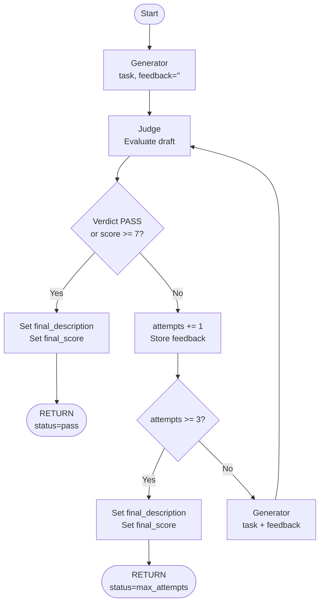

# S2 Judge Claude Cli Sonnet Workflow

Generated with [SPL](https://github.com/digital-duck/SPL) using: `spl3 text2mmd /home/wengong/projects/digital-duck/SPL.py/NeurIPS-26-lab/R3-judge/tests/claude_cli/sonnet/S1-judge-claude_cli-sonnet-1-spec.md --adapter claude_cli --model claude-sonnet-4-6 -o /home/wengong/projects/digital-duck/SPL.py/NeurIPS-26-lab/R3-judge/tests/claude_cli/sonnet/S2-judge-claude_cli-sonnet.mmd`

## Mermaid Diagram

## Usage Options

### For SPL Development
1. Review the workflow diagram above
2. Edit the mermaid code if needed
3. Generate SPL code: `spl3 mmd2spl /home/wengong/projects/digital-duck/SPL.py/NeurIPS-26-lab/R3-judge/tests/claude_cli/sonnet/S2-judge-claude_cli-sonnet.mmd -o S2-judge-claude_cli-sonnet.spl`
4. Validate: `spl3 validate S2-judge-claude_cli-sonnet.spl`

### For General Use
1. Use the `.mmd` file with any Mermaid-compatible tool
2. Copy the diagram code for documentation, presentations, or websites
3. Edit the visual workflow and regenerate as needed

---

**Learn more**: [SPL Repository](https://github.com/digital-duck/SPL) | [Documentation](https://github.com/digital-duck/SPL#readme)
