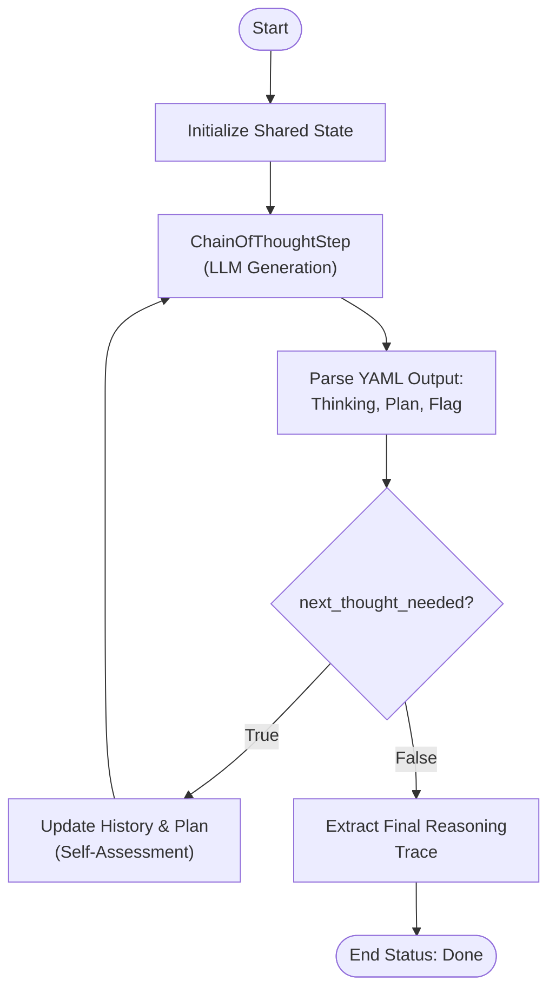

# S2 Thinking Openrouter Gemini Workflow

Generated with [SPL](https://github.com/digital-duck/SPL) using: `spl3 text2mmd /home/wengong/projects/digital-duck/SPL.py/NeurIPS-26-lab/R4-thinking/tests/openrouter/gemini/S1-thinking-openrouter-gemini-1-spec.md --adapter openrouter --model google/gemini-3-flash-preview -o /home/wengong/projects/digital-duck/SPL.py/NeurIPS-26-lab/R4-thinking/tests/openrouter/gemini/S2-thinking-openrouter-gemini.mmd`

## Mermaid Diagram

## Usage Options

### For SPL Development
1. Review the workflow diagram above
2. Edit the mermaid code if needed
3. Generate SPL code: `spl3 mmd2spl /home/wengong/projects/digital-duck/SPL.py/NeurIPS-26-lab/R4-thinking/tests/openrouter/gemini/S2-thinking-openrouter-gemini.mmd -o S2-thinking-openrouter-gemini.spl`
4. Validate: `spl3 validate S2-thinking-openrouter-gemini.spl`

### For General Use
1. Use the `.mmd` file with any Mermaid-compatible tool
2. Copy the diagram code for documentation, presentations, or websites
3. Edit the visual workflow and regenerate as needed

---

**Learn more**: [SPL Repository](https://github.com/digital-duck/SPL) | [Documentation](https://github.com/digital-duck/SPL#readme)
