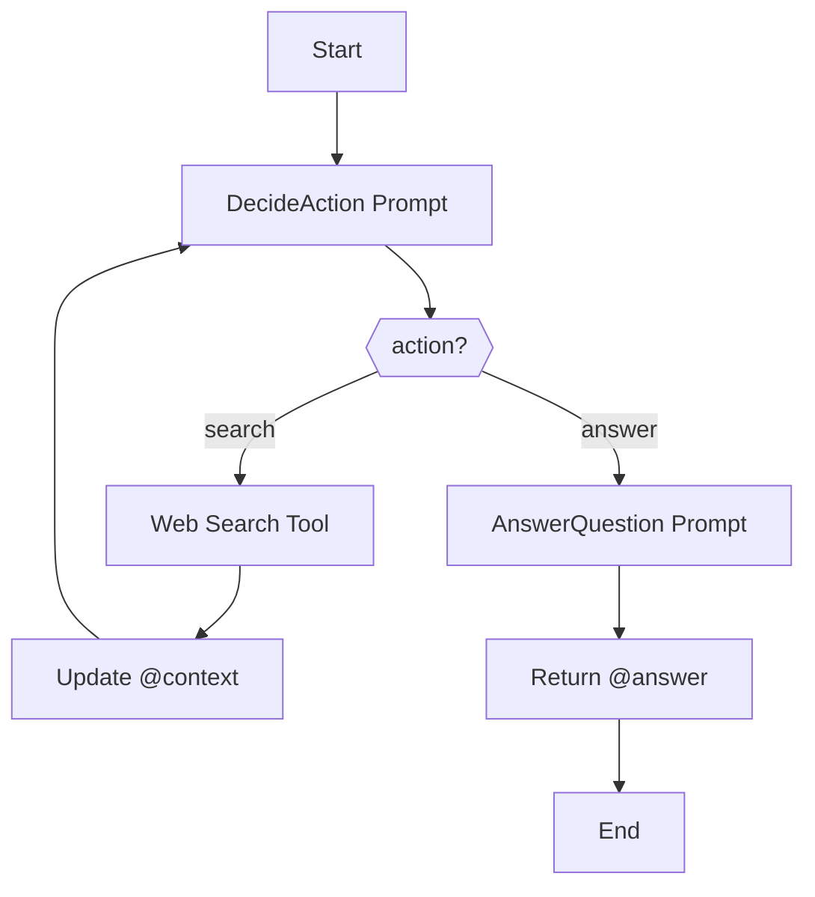

# Pocketflow Agent Workflow

Generated with [SPL](https://github.com/digital-duck/SPL) using: `spl3 text2mmd --description /home/gong2/projects/wgong/PocketFlow/cookbook/pocketflow-agent/flow-splc-python_pocketflow-spec.md --adapter gemini_cli --model gemini-3-flash-preview --out-dir /home/gong2/projects/digital-duck/SPL.py/cookbook-pocketflow-gemini/pocketflow-agent/ -o pocketflow-agent.mmd`

## Mermaid Diagram

## Usage Options

### For SPL Development
1. Review the workflow diagram above
2. Edit the mermaid code if needed
3. Generate SPL code: `spl3 mmd2spl /home/gong2/projects/digital-duck/SPL.py/cookbook-pocketflow-gemini/pocketflow-agent/pocketflow-agent.mmd -o pocketflow-agent.spl`
4. Validate: `spl3 validate pocketflow-agent.spl`

### For General Use
1. Use the `.mmd` file with any Mermaid-compatible tool
2. Copy the diagram code for documentation, presentations, or websites
3. Edit the visual workflow and regenerate as needed

---

**Learn more**: [SPL Repository](https://github.com/digital-duck/SPL) | [Documentation](https://github.com/digital-duck/SPL#readme)
