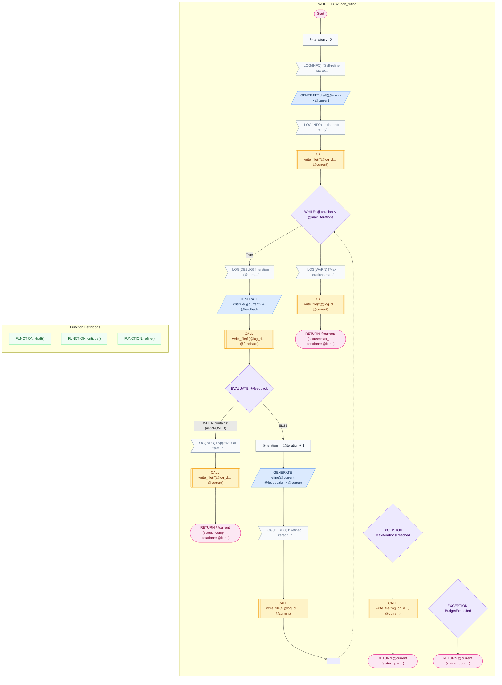

# Self Refine Workflow

Generated from `self_refine.spl` via `spl3 spl2mmd` (AST-direct, no LLM).

## Mermaid Diagram

```mermaid
flowchart TD
    subgraph SG_self_refine["WORKFLOW: self_refine"]
    direction TB
    START1(["Start"])
    A2["@iteration := 0"]
    LOG3>"LOG(INFO) f'Self-refine starte...'"]
    A2 --> LOG3
    GEN4[/"GENERATE draft(@task) -> @current"/]
    LOG3 --> GEN4
    LOG5>"LOG(INFO) 'Initial draft ready'"]
    GEN4 --> LOG5
    SUB6[["CALL write_file(f'(@log_d..., @current)"]]
    LOG5 --> SUB6
    WHILE7{"WHILE: @iteration < @max_iterations"}
    LOG8>"LOG(DEBUG) f'Iteration (@iterat...'"]
    GEN9[/"GENERATE critique(@current) -> @feedback"/]
    LOG8 --> GEN9
    SUB10[["CALL write_file(f'(@log_d..., @feedback)"]]
    GEN9 --> SUB10
    EVAL11{"EVALUATE: @feedback"}
    LOG13>"LOG(INFO) f'Approved at iterat...'"]
    SUB14[["CALL write_file(f'(@log_d..., @current)"]]
    LOG13 --> SUB14
    RET15(["RETURN @current (status='comp..., iterations=@iter...)"])
    SUB14 --> RET15
    EVAL11 -->|"WHEN contains:(APPROVED)"| LOG13
    A16["@iteration := @iteration + 1"]
    GEN17[/"GENERATE refine(@current, @feedback) -> @current"/]
    A16 --> GEN17
    LOG18>"LOG(DEBUG) f'Refined | iteratio...'"]
    GEN17 --> LOG18
    SUB19[["CALL write_file(f'(@log_d..., @current)"]]
    LOG18 --> SUB19
    EVAL11 -->|"ELSE"| A16
    SUB19 --> MERGE12
    MERGE12[" "]
    SUB10 --> EVAL11
    WHILE7 -->|"True"| LOG8
    MERGE12 -.-> WHILE7
    SUB6 --> WHILE7
    LOG20>"LOG(WARN) f'Max iterations rea...'"]
    WHILE7 --> LOG20
    SUB21[["CALL write_file(f'(@log_d..., @current)"]]
    LOG20 --> SUB21
    RET22(["RETURN @current (status='max_..., iterations=@iter...)"])
    SUB21 --> RET22
    START1 --> A2
    EXC23{"EXCEPTION MaxIterationsReached"}
    SUB24[["CALL write_file(f'(@log_d..., @current)"]]
    RET25(["RETURN @current (status='part...)"])
    SUB24 --> RET25
    EXC23 --> SUB24
    EXC26{"EXCEPTION BudgetExceeded"}
    RET27(["RETURN @current (status='budg...)"])
    EXC26 --> RET27
    end
    subgraph FUNCTIONS["Function Definitions"]
    direction TB
    FN28["FUNCTION: draft()"]
    FN29["FUNCTION: critique()"]
    FN30["FUNCTION: refine()"]
    end
    class START1 term
    class A2 assign
    class LOG3 log
    class GEN4 llm
    class LOG5 log
    class SUB6 proc
    class WHILE7 ctrl
    class LOG8 log
    class GEN9 llm
    class SUB10 proc
    class EVAL11 ctrl
    class LOG13 log
    class SUB14 proc
    class RET15 term
    class A16 assign
    class GEN17 llm
    class LOG18 log
    class SUB19 proc
    class LOG20 log
    class SUB21 proc
    class RET22 term
    class EXC23 ctrl
    class SUB24 proc
    class RET25 term
    class EXC26 ctrl
    class RET27 term
    class FN28 fn
    class FN29 fn
    class FN30 fn
    classDef llm fill:#dbeafe,stroke:#3b82f6,color:#1e3a5f
    classDef proc fill:#fef3c7,stroke:#f59e0b,color:#78350f
    classDef ctrl fill:#ede9fe,stroke:#8b5cf6,color:#3b0764
    classDef term fill:#fce7f3,stroke:#ec4899,color:#831843
    classDef log fill:#f8fafc,stroke:#94a3b8,color:#64748b
    classDef fn fill:#f0fdf4,stroke:#86efac,color:#166534
    classDef assign fill:#f8fafc,stroke:#64748b,color:#1e293b
```
