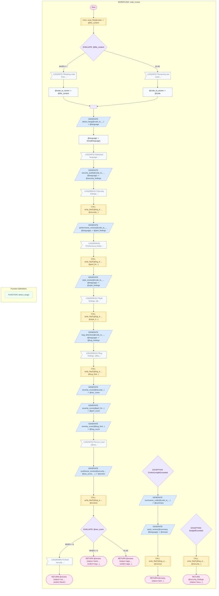

# Code Review Workflow

Generated from `code_review.spl` via `spl3 spl2mmd` (AST-direct, no LLM).

## Mermaid Diagram

```mermaid
flowchart TD
    subgraph SG_code_review["WORKFLOW: code_review"]
    direction TB
    START1(["Start"])
    SUB2[["CALL read_file(@code) -> @file_content"]]
    EVAL3{"EVALUATE: @file_content"}
    LOG5>"LOG(INFO) f'Reading code from ...'"]
    A6["@code_to_review := @file_content"]
    LOG5 --> A6
    EVAL3 -->|"WHEN != ''"| LOG5
    A6 --> MERGE4
    LOG7>"LOG(INFO) 'Reviewing raw code i...'"]
    A8["@code_to_review := @code"]
    LOG7 --> A8
    EVAL3 -->|"ELSE"| LOG7
    A8 --> MERGE4
    MERGE4[" "]
    SUB2 --> EVAL3
    GEN9[/"GENERATE detect_lang(@code_to_...) -> @language"/]
    MERGE4 --> GEN9
    A10["@language := trim(@language)"]
    GEN9 --> A10
    LOG11>"LOG(INFO) f'Detected language:...'"]
    A10 --> LOG11
    GEN12[/"GENERATE security_audit(@code_to_..., @language) -> @security_findings"/]
    LOG11 --> GEN12
    LOG13>"LOG(DEBUG) f'Security findings:...'"]
    GEN12 --> LOG13
    SUB14[["CALL write_file(f'(@log_d..., @security...)"]]
    LOG13 --> SUB14
    GEN15[/"GENERATE performance_review(@code_to_..., @language) -> @perf_findings"/]
    SUB14 --> GEN15
    LOG16>"LOG(DEBUG) f'Performance findin...'"]
    GEN15 --> LOG16
    SUB17[["CALL write_file(f'(@log_d..., @perf_fin...)"]]
    LOG16 --> SUB17
    GEN18[/"GENERATE style_review(@code_to_..., @language) -> @style_findings"/]
    SUB17 --> GEN18
    LOG19>"LOG(DEBUG) f'Style findings: (@...'"]
    GEN18 --> LOG19
    SUB20[["CALL write_file(f'(@log_d..., @style_fi...)"]]
    LOG19 --> SUB20
    GEN21[/"GENERATE bug_detection(@code_to_..., @language) -> @bug_findings"/]
    SUB20 --> GEN21
    LOG22>"LOG(DEBUG) f'Bug findings: (@bu...'"]
    GEN21 --> LOG22
    SUB23[["CALL write_file(f'(@log_d..., @bug_find...)"]]
    LOG22 --> SUB23
    GEN24[/"GENERATE severity_score(@security...) -> @sec_score"/]
    SUB23 --> GEN24
    GEN25[/"GENERATE severity_score(@perf_fin...) -> @perf_score"/]
    GEN24 --> GEN25
    GEN26[/"GENERATE severity_score(@bug_find...) -> @bug_score"/]
    GEN25 --> GEN26
    LOG27>"LOG(INFO) f'Scores | sec=(@sec...'"]
    GEN26 --> LOG27
    GEN28[/"GENERATE synthesize_review(@security..., @sec_score, ...) -> @review"/]
    LOG27 --> GEN28
    SUB29[["CALL write_file(f'(@log_d..., @review)"]]
    GEN28 --> SUB29
    EVAL30{"EVALUATE: @sec_score"}
    LOG32>"LOG(WARN) f'Critical security ...'"]
    RET33(["RETURN @review (status='crit..., verdict='block')"])
    LOG32 --> RET33
    EVAL30 -->|"WHEN > 8"| LOG32
    RET34(["RETURN @review (status='need..., verdict='requ...)"])
    EVAL30 -->|"WHEN > 5"| RET34
    RET35(["RETURN @review (status='appr..., verdict='appr...)"])
    EVAL30 -->|"ELSE"| RET35
    SUB29 --> EVAL30
    START1 --> SUB2
    EXC36{"EXCEPTION ContextLengthExceeded"}
    GEN37[/"GENERATE summarize_code(@code_to_...) -> @summary"/]
    GEN38[/"GENERATE quick_review(@summary, @language) -> @review"/]
    GEN37 --> GEN38
    SUB39[["CALL write_file(f'(@log_d..., @review)"]]
    GEN38 --> SUB39
    RET40(["RETURN @review (status='part...)"])
    SUB39 --> RET40
    EXC36 --> GEN37
    EXC41{"EXCEPTION BudgetExceeded"}
    SUB42[["CALL write_file(f'(@log_d..., @security...)"]]
    RET43(["RETURN @security_findings (status='secu...)"])
    SUB42 --> RET43
    EXC41 --> SUB42
    end
    subgraph FUNCTIONS["Function Definitions"]
    direction TB
    FN44["FUNCTION: detect_lang()"]
    end
    class START1 term
    class SUB2 proc
    class EVAL3 ctrl
    class LOG5 log
    class A6 assign
    class LOG7 log
    class A8 assign
    class GEN9 llm
    class A10 assign
    class LOG11 log
    class GEN12 llm
    class LOG13 log
    class SUB14 proc
    class GEN15 llm
    class LOG16 log
    class SUB17 proc
    class GEN18 llm
    class LOG19 log
    class SUB20 proc
    class GEN21 llm
    class LOG22 log
    class SUB23 proc
    class GEN24 llm
    class GEN25 llm
    class GEN26 llm
    class LOG27 log
    class GEN28 llm
    class SUB29 proc
    class EVAL30 ctrl
    class LOG32 log
    class RET33 term
    class RET34 term
    class RET35 term
    class EXC36 ctrl
    class GEN37 llm
    class GEN38 llm
    class SUB39 proc
    class RET40 term
    class EXC41 ctrl
    class SUB42 proc
    class RET43 term
    class FN44 fn
    classDef llm fill:#dbeafe,stroke:#3b82f6,color:#1e3a5f
    classDef proc fill:#fef3c7,stroke:#f59e0b,color:#78350f
    classDef ctrl fill:#ede9fe,stroke:#8b5cf6,color:#3b0764
    classDef term fill:#fce7f3,stroke:#ec4899,color:#831843
    classDef log fill:#f8fafc,stroke:#94a3b8,color:#64748b
    classDef fn fill:#f0fdf4,stroke:#86efac,color:#166534
    classDef assign fill:#f8fafc,stroke:#64748b,color:#1e293b
```
