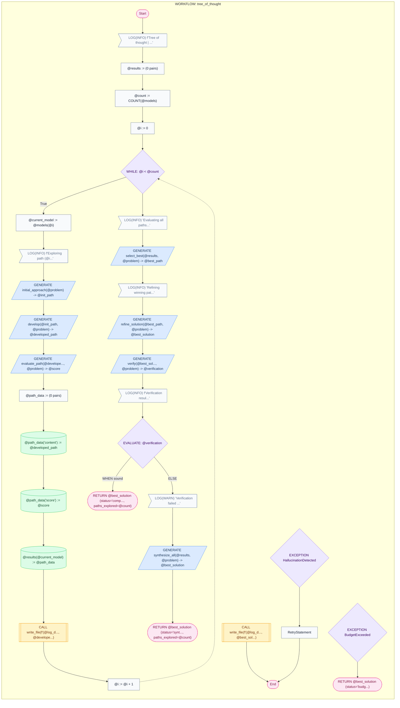

# Tree Of Thought Workflow

Generated from `tree_of_thought.spl` via `spl3 spl2mmd` (AST-direct, no LLM).

## Mermaid Diagram

```mermaid
flowchart TD
    subgraph SG_tree_of_thought["WORKFLOW: tree_of_thought"]
    direction TB
    START1(["Start"])
    LOG2>"LOG(INFO) f'Tree of thought | ...'"]
    A3["@results := (0 pairs)"]
    LOG2 --> A3
    A4["@count := COUNT(@models)"]
    A3 --> A4
    A5["@i := 0"]
    A4 --> A5
    WHILE6{"WHILE: @i < @count"}
    A7["@current_model := @models(@i)"]
    LOG8>"LOG(INFO) f'Exploring path (@i...'"]
    A7 --> LOG8
    GEN9[/"GENERATE initial_approach(@problem) -> @init_path"/]
    LOG8 --> GEN9
    GEN10[/"GENERATE develop(@init_path, @problem) -> @developed_path"/]
    GEN9 --> GEN10
    GEN11[/"GENERATE evaluate_path(@develope..., @problem) -> @score"/]
    GEN10 --> GEN11
    A12["@path_data := (0 pairs)"]
    GEN11 --> A12
    STA13[("@path_data('content') := @developed_path")]
    A12 --> STA13
    STA14[("@path_data('score') := @score")]
    STA13 --> STA14
    STA15[("@results(@current_model) := @path_data")]
    STA14 --> STA15
    SUB16[["CALL write_file(f'(@log_d..., @develope...)"]]
    STA15 --> SUB16
    A17["@i := @i + 1"]
    SUB16 --> A17
    WHILE6 -->|"True"| A7
    A17 -.-> WHILE6
    A5 --> WHILE6
    LOG18>"LOG(INFO) 'Evaluating all paths...'"]
    WHILE6 --> LOG18
    GEN19[/"GENERATE select_best(@results, @problem) -> @best_path"/]
    LOG18 --> GEN19
    LOG20>"LOG(INFO) 'Refining winning pat...'"]
    GEN19 --> LOG20
    GEN21[/"GENERATE refine_solution(@best_path, @problem) -> @best_solution"/]
    LOG20 --> GEN21
    GEN22[/"GENERATE verify(@best_sol..., @problem) -> @verification"/]
    GEN21 --> GEN22
    LOG23>"LOG(INFO) f'Verification resul...'"]
    GEN22 --> LOG23
    EVAL24{"EVALUATE: @verification"}
    RET26(["RETURN @best_solution (status='comp..., paths_explored=@count)"])
    EVAL24 -->|"WHEN sound"| RET26
    LOG27>"LOG(WARN) 'Verification failed ...'"]
    GEN28[/"GENERATE synthesize_all(@results, @problem) -> @best_solution"/]
    LOG27 --> GEN28
    RET29(["RETURN @best_solution (status='synt..., paths_explored=@count)"])
    GEN28 --> RET29
    EVAL24 -->|"ELSE"| LOG27
    LOG23 --> EVAL24
    SUB30[["CALL write_file(f'(@log_d..., @best_sol...)"]]
    START1 --> LOG2
    END31(["End"])
    SUB30 --> END31
    EXC32{"EXCEPTION BudgetExceeded"}
    RET33(["RETURN @best_solution (status='budg...)"])
    EXC32 --> RET33
    EXC34{"EXCEPTION HallucinationDetected"}
    S35["RetryStatement"]
    EXC34 --> S35
    S35 --> END31
    end
    class START1 term
    class LOG2 log
    class A3 assign
    class A4 assign
    class A5 assign
    class WHILE6 ctrl
    class A7 assign
    class LOG8 log
    class GEN9 llm
    class GEN10 llm
    class GEN11 llm
    class A12 assign
    class STA13 store
    class STA14 store
    class STA15 store
    class SUB16 proc
    class A17 assign
    class LOG18 log
    class GEN19 llm
    class LOG20 log
    class GEN21 llm
    class GEN22 llm
    class LOG23 log
    class EVAL24 ctrl
    class RET26 term
    class LOG27 log
    class GEN28 llm
    class RET29 term
    class SUB30 proc
    class END31 term
    class EXC32 ctrl
    class RET33 term
    class EXC34 ctrl
    class S35 assign
    classDef llm fill:#dbeafe,stroke:#3b82f6,color:#1e3a5f
    classDef proc fill:#fef3c7,stroke:#f59e0b,color:#78350f
    classDef ctrl fill:#ede9fe,stroke:#8b5cf6,color:#3b0764
    classDef store fill:#dcfce7,stroke:#22c55e,color:#14532d
    classDef term fill:#fce7f3,stroke:#ec4899,color:#831843
    classDef log fill:#f8fafc,stroke:#94a3b8,color:#64748b
    classDef fn fill:#f0fdf4,stroke:#86efac,color:#166534
    classDef assign fill:#f8fafc,stroke:#64748b,color:#1e293b
```
