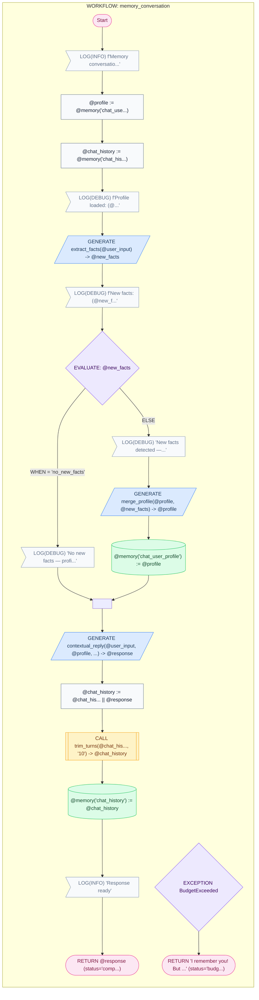

# Memory Chat Workflow

Generated from `memory_chat.spl` via `spl3 spl2mmd` (AST-direct, no LLM).

## Mermaid Diagram

```mermaid
flowchart TD
    subgraph SG_memory_conversation["WORKFLOW: memory_conversation"]
    direction TB
    START1(["Start"])
    LOG2>"LOG(INFO) f'Memory conversatio...'"]
    A3["@profile := @memory('chat_use...)"]
    LOG2 --> A3
    A4["@chat_history := @memory('chat_his...)"]
    A3 --> A4
    LOG5>"LOG(DEBUG) f'Profile loaded: (@...'"]
    A4 --> LOG5
    GEN6[/"GENERATE extract_facts(@user_input) -> @new_facts"/]
    LOG5 --> GEN6
    LOG7>"LOG(DEBUG) f'New facts: (@new_f...'"]
    GEN6 --> LOG7
    EVAL8{"EVALUATE: @new_facts"}
    LOG10>"LOG(DEBUG) 'No new facts — profi...'"]
    EVAL8 -->|"WHEN = 'no_new_facts'"| LOG10
    LOG10 --> MERGE9
    LOG11>"LOG(DEBUG) 'New facts detected —...'"]
    GEN12[/"GENERATE merge_profile(@profile, @new_facts) -> @profile"/]
    LOG11 --> GEN12
    STA13[("@memory('chat_user_profile') := @profile")]
    GEN12 --> STA13
    EVAL8 -->|"ELSE"| LOG11
    STA13 --> MERGE9
    MERGE9[" "]
    LOG7 --> EVAL8
    GEN14[/"GENERATE contextual_reply(@user_input, @profile, ...) -> @response"/]
    MERGE9 --> GEN14
    A15["@chat_history := @chat_his... || @response"]
    GEN14 --> A15
    SUB16[["CALL trim_turns(@chat_his..., '10') -> @chat_history"]]
    A15 --> SUB16
    STA17[("@memory('chat_history') := @chat_history")]
    SUB16 --> STA17
    LOG18>"LOG(INFO) 'Response ready'"]
    STA17 --> LOG18
    RET19(["RETURN @response (status='comp...)"])
    LOG18 --> RET19
    START1 --> LOG2
    EXC20{"EXCEPTION BudgetExceeded"}
    RET21(["RETURN 'I remember you! But ...' (status='budg...)"])
    EXC20 --> RET21
    end
    class START1 term
    class LOG2 log
    class A3 assign
    class A4 assign
    class LOG5 log
    class GEN6 llm
    class LOG7 log
    class EVAL8 ctrl
    class LOG10 log
    class LOG11 log
    class GEN12 llm
    class STA13 store
    class GEN14 llm
    class A15 assign
    class SUB16 proc
    class STA17 store
    class LOG18 log
    class RET19 term
    class EXC20 ctrl
    class RET21 term
    classDef llm fill:#dbeafe,stroke:#3b82f6,color:#1e3a5f
    classDef proc fill:#fef3c7,stroke:#f59e0b,color:#78350f
    classDef ctrl fill:#ede9fe,stroke:#8b5cf6,color:#3b0764
    classDef store fill:#dcfce7,stroke:#22c55e,color:#14532d
    classDef term fill:#fce7f3,stroke:#ec4899,color:#831843
    classDef log fill:#f8fafc,stroke:#94a3b8,color:#64748b
    classDef fn fill:#f0fdf4,stroke:#86efac,color:#166534
    classDef assign fill:#f8fafc,stroke:#64748b,color:#1e293b
```
