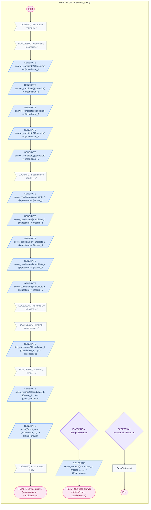

# Ensemble Workflow

Generated from `ensemble.spl` via `spl3 spl2mmd` (AST-direct, no LLM).

## Mermaid Diagram

```mermaid
flowchart TD
    subgraph SG_ensemble_voting["WORKFLOW: ensemble_voting"]
    direction TB
    START1(["Start"])
    LOG2>"LOG(INFO) f'Ensemble voting | ...'"]
    LOG3>"LOG(DEBUG) 'Generating 5 candida...'"]
    LOG2 --> LOG3
    GEN4[/"GENERATE answer_candidate(@question) -> @candidate_1"/]
    LOG3 --> GEN4
    GEN5[/"GENERATE answer_candidate(@question) -> @candidate_2"/]
    GEN4 --> GEN5
    GEN6[/"GENERATE answer_candidate(@question) -> @candidate_3"/]
    GEN5 --> GEN6
    GEN7[/"GENERATE answer_candidate(@question) -> @candidate_4"/]
    GEN6 --> GEN7
    GEN8[/"GENERATE answer_candidate(@question) -> @candidate_5"/]
    GEN7 --> GEN8
    LOG9>"LOG(INFO) '5 candidates ready —...'"]
    GEN8 --> LOG9
    GEN10[/"GENERATE score_candidate(@candidate_1, @question) -> @score_1"/]
    LOG9 --> GEN10
    GEN11[/"GENERATE score_candidate(@candidate_2, @question) -> @score_2"/]
    GEN10 --> GEN11
    GEN12[/"GENERATE score_candidate(@candidate_3, @question) -> @score_3"/]
    GEN11 --> GEN12
    GEN13[/"GENERATE score_candidate(@candidate_4, @question) -> @score_4"/]
    GEN12 --> GEN13
    GEN14[/"GENERATE score_candidate(@candidate_5, @question) -> @score_5"/]
    GEN13 --> GEN14
    LOG15>"LOG(DEBUG) f'Scores: 1=(@score_...'"]
    GEN14 --> LOG15
    LOG16>"LOG(DEBUG) 'Finding consensus .....'"]
    LOG15 --> LOG16
    GEN17[/"GENERATE find_consensus(@candidate_1, @candidate_2, ...) -> @consensus"/]
    LOG16 --> GEN17
    LOG18>"LOG(DEBUG) 'Selecting winner ...'"]
    GEN17 --> LOG18
    GEN19[/"GENERATE select_winner(@candidate_1, @score_1, ...) -> @best_candidate"/]
    LOG18 --> GEN19
    GEN20[/"GENERATE polish(@best_can..., @consensus, ...) -> @final_answer"/]
    GEN19 --> GEN20
    LOG21>"LOG(INFO) 'Final answer ready'"]
    GEN20 --> LOG21
    RET22(["RETURN @final_answer (status='comp..., candidates=5)"])
    LOG21 --> RET22
    START1 --> LOG2
    END23(["End"])
    EXC24{"EXCEPTION BudgetExceeded"}
    GEN25[/"GENERATE select_winner(@candidate_1, @score_1, ...) -> @final_answer"/]
    RET26(["RETURN @final_answer (status='part..., candidates=3)"])
    GEN25 --> RET26
    EXC24 --> GEN25
    EXC27{"EXCEPTION HallucinationDetected"}
    S28["RetryStatement"]
    EXC27 --> S28
    S28 --> END23
    end
    class START1 term
    class LOG2 log
    class LOG3 log
    class GEN4 llm
    class GEN5 llm
    class GEN6 llm
    class GEN7 llm
    class GEN8 llm
    class LOG9 log
    class GEN10 llm
    class GEN11 llm
    class GEN12 llm
    class GEN13 llm
    class GEN14 llm
    class LOG15 log
    class LOG16 log
    class GEN17 llm
    class LOG18 log
    class GEN19 llm
    class GEN20 llm
    class LOG21 log
    class RET22 term
    class END23 term
    class EXC24 ctrl
    class GEN25 llm
    class RET26 term
    class EXC27 ctrl
    class S28 assign
    classDef llm fill:#dbeafe,stroke:#3b82f6,color:#1e3a5f
    classDef ctrl fill:#ede9fe,stroke:#8b5cf6,color:#3b0764
    classDef term fill:#fce7f3,stroke:#ec4899,color:#831843
    classDef log fill:#f8fafc,stroke:#94a3b8,color:#64748b
    classDef assign fill:#f8fafc,stroke:#64748b,color:#1e293b
```
