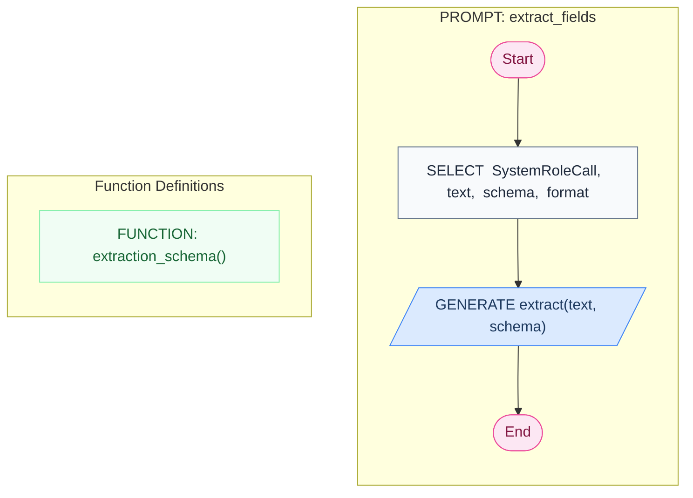

# Data Extraction Workflow

Generated from `data_extraction.spl` via `spl3 spl2mmd` (AST-direct, no LLM).

## Mermaid Diagram

```mermaid
flowchart TD
    subgraph SG_extract_fields["PROMPT: extract_fields"]
    direction TB
    START1(["Start"])
    SEL2["SELECT  SystemRoleCall,  text,  schema,  format"]
    START1 --> SEL2
    GEN3[/"GENERATE extract(text, schema)"/]
    SEL2 --> GEN3
    END4(["End"])
    GEN3 --> END4
    end
    subgraph FUNCTIONS["Function Definitions"]
    direction TB
    FN5["FUNCTION: extraction_schema()"]
    end
    class START1 term
    class SEL2 assign
    class GEN3 llm
    class END4 term
    class FN5 fn
    classDef llm fill:#dbeafe,stroke:#3b82f6,color:#1e3a5f
    classDef term fill:#fce7f3,stroke:#ec4899,color:#831843
    classDef fn fill:#f0fdf4,stroke:#86efac,color:#166534
    classDef assign fill:#f8fafc,stroke:#64748b,color:#1e293b
```
