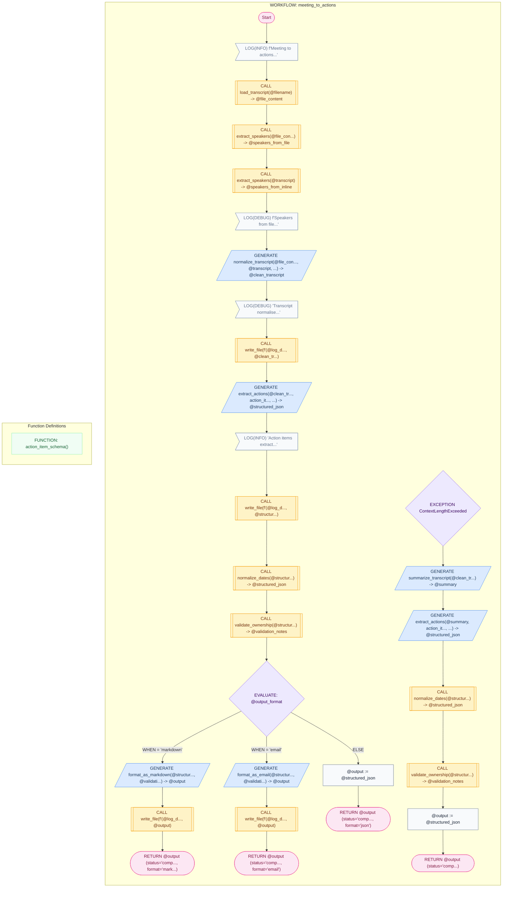

# Meeting Actions Workflow

Generated from `meeting_actions.spl` via `spl3 spl2mmd` (AST-direct, no LLM).

## Mermaid Diagram

```mermaid
flowchart TD
    subgraph SG_meeting_to_actions["WORKFLOW: meeting_to_actions"]
    direction TB
    START1(["Start"])
    LOG2>"LOG(INFO) f'Meeting to actions...'"]
    SUB3[["CALL load_transcript(@filename) -> @file_content"]]
    LOG2 --> SUB3
    SUB4[["CALL extract_speakers(@file_con...) -> @speakers_from_file"]]
    SUB3 --> SUB4
    SUB5[["CALL extract_speakers(@transcript) -> @speakers_from_inline"]]
    SUB4 --> SUB5
    LOG6>"LOG(DEBUG) f'Speakers from file...'"]
    SUB5 --> LOG6
    GEN7[/"GENERATE normalize_transcript(@file_con..., @transcript, ...) -> @clean_transcript"/]
    LOG6 --> GEN7
    LOG8>"LOG(DEBUG) 'Transcript normalise...'"]
    GEN7 --> LOG8
    SUB9[["CALL write_file(f'(@log_d..., @clean_tr...)"]]
    LOG8 --> SUB9
    GEN10[/"GENERATE extract_actions(@clean_tr..., action_it..., ...) -> @structured_json"/]
    SUB9 --> GEN10
    LOG11>"LOG(INFO) 'Action items extract...'"]
    GEN10 --> LOG11
    SUB12[["CALL write_file(f'(@log_d..., @structur...)"]]
    LOG11 --> SUB12
    SUB13[["CALL normalize_dates(@structur...) -> @structured_json"]]
    SUB12 --> SUB13
    SUB14[["CALL validate_ownership(@structur...) -> @validation_notes"]]
    SUB13 --> SUB14
    EVAL15{"EVALUATE: @output_format"}
    GEN17[/"GENERATE format_as_markdown(@structur..., @validati...) -> @output"/]
    SUB18[["CALL write_file(f'(@log_d..., @output)"]]
    GEN17 --> SUB18
    RET19(["RETURN @output (status='comp..., format='mark...)"])
    SUB18 --> RET19
    EVAL15 -->|"WHEN = 'markdown'"| GEN17
    GEN20[/"GENERATE format_as_email(@structur..., @validati...) -> @output"/]
    SUB21[["CALL write_file(f'(@log_d..., @output)"]]
    GEN20 --> SUB21
    RET22(["RETURN @output (status='comp..., format='email')"])
    SUB21 --> RET22
    EVAL15 -->|"WHEN = 'email'"| GEN20
    A23["@output := @structured_json"]
    RET24(["RETURN @output (status='comp..., format='json')"])
    A23 --> RET24
    EVAL15 -->|"ELSE"| A23
    SUB14 --> EVAL15
    START1 --> LOG2
    EXC25{"EXCEPTION ContextLengthExceeded"}
    GEN26[/"GENERATE summarize_transcript(@clean_tr...) -> @summary"/]
    GEN27[/"GENERATE extract_actions(@summary, action_it..., ...) -> @structured_json"/]
    GEN26 --> GEN27
    SUB28[["CALL normalize_dates(@structur...) -> @structured_json"]]
    GEN27 --> SUB28
    SUB29[["CALL validate_ownership(@structur...) -> @validation_notes"]]
    SUB28 --> SUB29
    A30["@output := @structured_json"]
    SUB29 --> A30
    RET31(["RETURN @output (status='comp...)"])
    A30 --> RET31
    EXC25 --> GEN26
    end
    subgraph FUNCTIONS["Function Definitions"]
    direction TB
    FN32["FUNCTION: action_item_schema()"]
    end
    class START1 term
    class LOG2 log
    class SUB3 proc
    class SUB4 proc
    class SUB5 proc
    class LOG6 log
    class GEN7 llm
    class LOG8 log
    class SUB9 proc
    class GEN10 llm
    class LOG11 log
    class SUB12 proc
    class SUB13 proc
    class SUB14 proc
    class EVAL15 ctrl
    class GEN17 llm
    class SUB18 proc
    class RET19 term
    class GEN20 llm
    class SUB21 proc
    class RET22 term
    class A23 assign
    class RET24 term
    class EXC25 ctrl
    class GEN26 llm
    class GEN27 llm
    class SUB28 proc
    class SUB29 proc
    class A30 assign
    class RET31 term
    class FN32 fn
    classDef llm fill:#dbeafe,stroke:#3b82f6,color:#1e3a5f
    classDef proc fill:#fef3c7,stroke:#f59e0b,color:#78350f
    classDef ctrl fill:#ede9fe,stroke:#8b5cf6,color:#3b0764
    classDef term fill:#fce7f3,stroke:#ec4899,color:#831843
    classDef log fill:#f8fafc,stroke:#94a3b8,color:#64748b
    classDef fn fill:#f0fdf4,stroke:#86efac,color:#166534
    classDef assign fill:#f8fafc,stroke:#64748b,color:#1e293b
```
