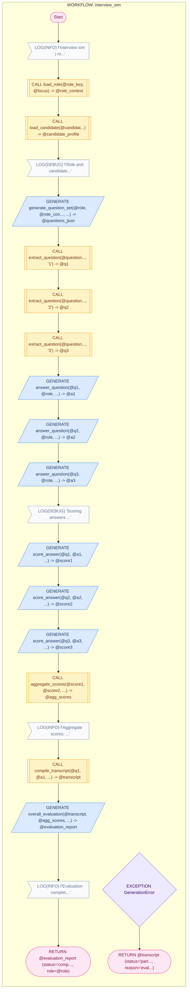

# Interview Sim Workflow

Generated from `interview_sim.spl` via `spl3 spl2mmd` (AST-direct, no LLM).

## Mermaid Diagram

```mermaid
flowchart TD
    subgraph SG_interview_sim["WORKFLOW: interview_sim"]
    direction TB
    START1(["Start"])
    LOG2>"LOG(INFO) f'Interview sim | ro...'"]
    SUB3[["CALL load_role(@role_key, @focus) -> @role_context"]]
    LOG2 --> SUB3
    SUB4[["CALL load_candidate(@candidat...) -> @candidate_profile"]]
    SUB3 --> SUB4
    LOG5>"LOG(DEBUG) f'Role and candidate...'"]
    SUB4 --> LOG5
    GEN6[/"GENERATE generate_question_set(@role, @role_con..., ...) -> @questions_json"/]
    LOG5 --> GEN6
    SUB7[["CALL extract_question(@question..., '1') -> @q1"]]
    GEN6 --> SUB7
    SUB8[["CALL extract_question(@question..., '2') -> @q2"]]
    SUB7 --> SUB8
    SUB9[["CALL extract_question(@question..., '3') -> @q3"]]
    SUB8 --> SUB9
    GEN10[/"GENERATE answer_question(@q1, @role, ...) -> @a1"/]
    SUB9 --> GEN10
    GEN11[/"GENERATE answer_question(@q2, @role, ...) -> @a2"/]
    GEN10 --> GEN11
    GEN12[/"GENERATE answer_question(@q3, @role, ...) -> @a3"/]
    GEN11 --> GEN12
    LOG13>"LOG(DEBUG) 'Scoring answers ...'"]
    GEN12 --> LOG13
    GEN14[/"GENERATE score_answer(@q1, @a1, ...) -> @score1"/]
    LOG13 --> GEN14
    GEN15[/"GENERATE score_answer(@q2, @a2, ...) -> @score2"/]
    GEN14 --> GEN15
    GEN16[/"GENERATE score_answer(@q3, @a3, ...) -> @score3"/]
    GEN15 --> GEN16
    SUB17[["CALL aggregate_scores(@score1, @score2, ...) -> @agg_scores"]]
    GEN16 --> SUB17
    LOG18>"LOG(INFO) f'Aggregate scores: ...'"]
    SUB17 --> LOG18
    SUB19[["CALL compile_transcript(@q1, @a1, ...) -> @transcript"]]
    LOG18 --> SUB19
    GEN20[/"GENERATE overall_evaluation(@transcript, @agg_scores, ...) -> @evaluation_report"/]
    SUB19 --> GEN20
    LOG21>"LOG(INFO) f'Evaluation complet...'"]
    GEN20 --> LOG21
    RET22(["RETURN @evaluation_report (status='comp..., role=@role)"])
    LOG21 --> RET22
    START1 --> LOG2
    EXC23{"EXCEPTION GenerationError"}
    RET24(["RETURN @transcript (status='part..., reason='eval...)"])
    EXC23 --> RET24
    end
    class START1 term
    class LOG2 log
    class SUB3 proc
    class SUB4 proc
    class LOG5 log
    class GEN6 llm
    class SUB7 proc
    class SUB8 proc
    class SUB9 proc
    class GEN10 llm
    class GEN11 llm
    class GEN12 llm
    class LOG13 log
    class GEN14 llm
    class GEN15 llm
    class GEN16 llm
    class SUB17 proc
    class LOG18 log
    class SUB19 proc
    class GEN20 llm
    class LOG21 log
    class RET22 term
    class EXC23 ctrl
    class RET24 term
    classDef llm fill:#dbeafe,stroke:#3b82f6,color:#1e3a5f
    classDef proc fill:#fef3c7,stroke:#f59e0b,color:#78350f
    classDef ctrl fill:#ede9fe,stroke:#8b5cf6,color:#3b0764
    classDef term fill:#fce7f3,stroke:#ec4899,color:#831843
    classDef log fill:#f8fafc,stroke:#94a3b8,color:#64748b
    classDef fn fill:#f0fdf4,stroke:#86efac,color:#166534
```
