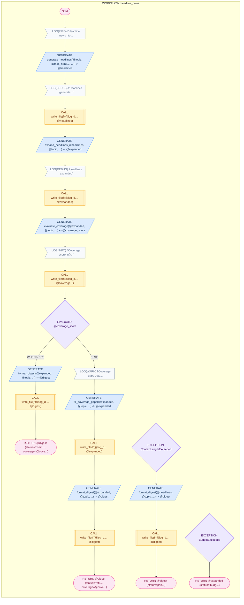

# Headline News Workflow

Generated from `headline_news.spl` via `spl3 spl2mmd` (AST-direct, no LLM).

## Mermaid Diagram

```mermaid
flowchart TD
    subgraph SG_headline_news["WORKFLOW: headline_news"]
    direction TB
    START1(["Start"])
    LOG2>"LOG(INFO) f'Headline news | to...'"]
    GEN3[/"GENERATE generate_headlines(@topic, @max_head..., ...) -> @headlines"/]
    LOG2 --> GEN3
    LOG4>"LOG(DEBUG) f'Headlines generate...'"]
    GEN3 --> LOG4
    SUB5[["CALL write_file(f'(@log_d..., @headlines)"]]
    LOG4 --> SUB5
    GEN6[/"GENERATE expand_headlines(@headlines, @topic, ...) -> @expanded"/]
    SUB5 --> GEN6
    LOG7>"LOG(DEBUG) 'Headlines expanded'"]
    GEN6 --> LOG7
    SUB8[["CALL write_file(f'(@log_d..., @expanded)"]]
    LOG7 --> SUB8
    GEN9[/"GENERATE evaluate_coverage(@expanded, @topic, ...) -> @coverage_score"/]
    SUB8 --> GEN9
    LOG10>"LOG(INFO) f'Coverage score: (@...'"]
    GEN9 --> LOG10
    SUB11[["CALL write_file(f'(@log_d..., @coverage...)"]]
    LOG10 --> SUB11
    EVAL12{"EVALUATE: @coverage_score"}
    GEN14[/"GENERATE format_digest(@expanded, @topic, ...) -> @digest"/]
    SUB15[["CALL write_file(f'(@log_d..., @digest)"]]
    GEN14 --> SUB15
    RET16(["RETURN @digest (status='comp..., coverage=@cove...)"])
    SUB15 --> RET16
    EVAL12 -->|"WHEN > 0.75"| GEN14
    LOG17>"LOG(WARN) f'Coverage gaps dete...'"]
    GEN18[/"GENERATE fill_coverage_gaps(@expanded, @topic, ...) -> @expanded"/]
    LOG17 --> GEN18
    SUB19[["CALL write_file(f'(@log_d..., @expanded)"]]
    GEN18 --> SUB19
    GEN20[/"GENERATE format_digest(@expanded, @topic, ...) -> @digest"/]
    SUB19 --> GEN20
    SUB21[["CALL write_file(f'(@log_d..., @digest)"]]
    GEN20 --> SUB21
    RET22(["RETURN @digest (status='refi..., coverage=@cove...)"])
    SUB21 --> RET22
    EVAL12 -->|"ELSE"| LOG17
    SUB11 --> EVAL12
    START1 --> LOG2
    EXC23{"EXCEPTION ContextLengthExceeded"}
    GEN24[/"GENERATE format_digest(@headlines, @topic, ...) -> @digest"/]
    SUB25[["CALL write_file(f'(@log_d..., @digest)"]]
    GEN24 --> SUB25
    RET26(["RETURN @digest (status='part...)"])
    SUB25 --> RET26
    EXC23 --> GEN24
    EXC27{"EXCEPTION BudgetExceeded"}
    RET28(["RETURN @expanded (status='budg...)"])
    EXC27 --> RET28
    end
    class START1 term
    class LOG2 log
    class GEN3 llm
    class LOG4 log
    class SUB5 proc
    class GEN6 llm
    class LOG7 log
    class SUB8 proc
    class GEN9 llm
    class LOG10 log
    class SUB11 proc
    class EVAL12 ctrl
    class GEN14 llm
    class SUB15 proc
    class RET16 term
    class LOG17 log
    class GEN18 llm
    class SUB19 proc
    class GEN20 llm
    class SUB21 proc
    class RET22 term
    class EXC23 ctrl
    class GEN24 llm
    class SUB25 proc
    class RET26 term
    class EXC27 ctrl
    class RET28 term
    classDef llm fill:#dbeafe,stroke:#3b82f6,color:#1e3a5f
    classDef proc fill:#fef3c7,stroke:#f59e0b,color:#78350f
    classDef ctrl fill:#ede9fe,stroke:#8b5cf6,color:#3b0764
    classDef term fill:#fce7f3,stroke:#ec4899,color:#831843
    classDef log fill:#f8fafc,stroke:#94a3b8,color:#64748b
    classDef fn fill:#f0fdf4,stroke:#86efac,color:#166534
```
