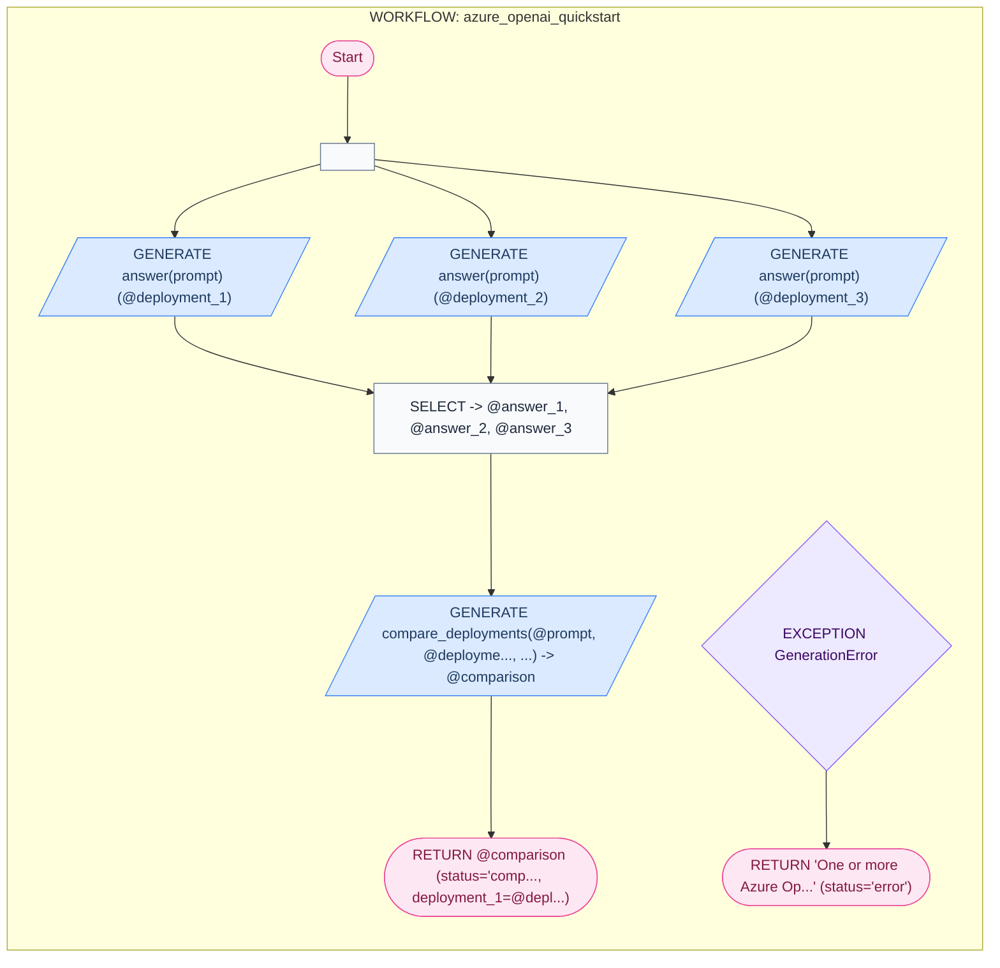

# Azure Openai Quickstart Workflow

Generated from `azure_openai_quickstart.spl` via `spl3 spl2mmd` (AST-direct, no LLM).

## Mermaid Diagram

```mermaid
flowchart TD
    subgraph SG_azure_openai_quickstart["WORKFLOW: azure_openai_quickstart"]
    direction TB
    START1(["Start"])
    FORK2[" "]
    SYNC3["SELECT -> @answer_1, @answer_2, @answer_3"]
    CTE4[/"GENERATE answer(prompt) (@deployment_1)"/]
    FORK2 --> CTE4
    CTE4 --> SYNC3
    CTE5[/"GENERATE answer(prompt) (@deployment_2)"/]
    FORK2 --> CTE5
    CTE5 --> SYNC3
    CTE6[/"GENERATE answer(prompt) (@deployment_3)"/]
    FORK2 --> CTE6
    CTE6 --> SYNC3
    GEN7[/"GENERATE compare_deployments(@prompt, @deployme..., ...) -> @comparison"/]
    SYNC3 --> GEN7
    RET8(["RETURN @comparison (status='comp..., deployment_1=@depl...)"])
    GEN7 --> RET8
    START1 --> FORK2
    EXC9{"EXCEPTION GenerationError"}
    RET10(["RETURN 'One or more Azure Op...' (status='error')"])
    EXC9 --> RET10
    end
    class START1 term
    class FORK2 assign
    class SYNC3 assign
    class CTE4 llm
    class CTE5 llm
    class CTE6 llm
    class GEN7 llm
    class RET8 term
    class EXC9 ctrl
    class RET10 term
    classDef llm fill:#dbeafe,stroke:#3b82f6,color:#1e3a5f
    classDef ctrl fill:#ede9fe,stroke:#8b5cf6,color:#3b0764
    classDef term fill:#fce7f3,stroke:#ec4899,color:#831843
    classDef fn fill:#f0fdf4,stroke:#86efac,color:#166534
    classDef assign fill:#f8fafc,stroke:#64748b,color:#1e293b
```
