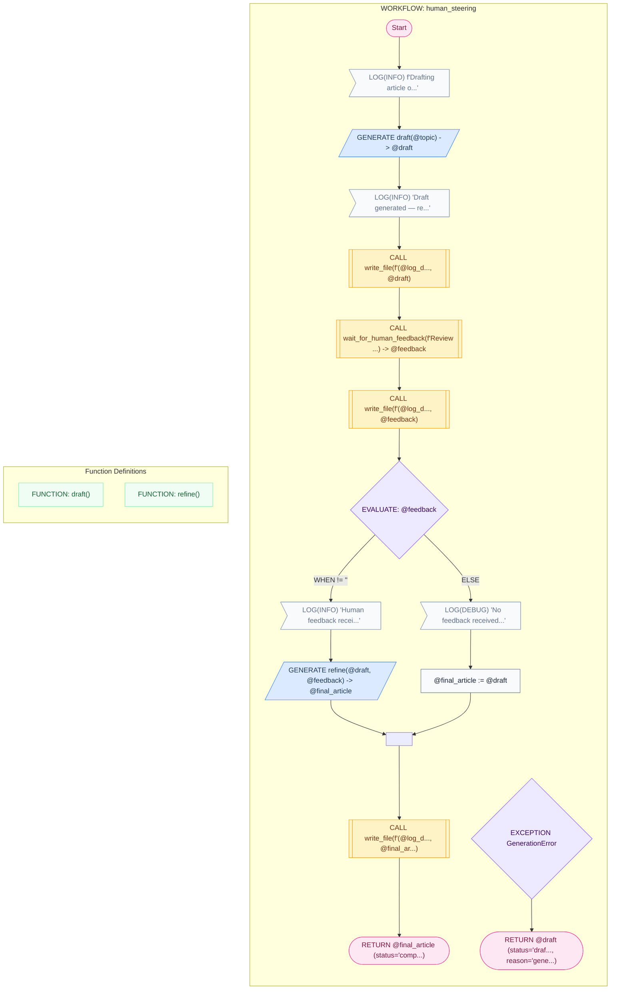

# Human Steering Workflow

Generated from `human_steering.spl` via `spl3 spl2mmd` (AST-direct, no LLM).

## Mermaid Diagram

```mermaid
flowchart TD
    subgraph SG_human_steering["WORKFLOW: human_steering"]
    direction TB
    START1(["Start"])
    LOG2>"LOG(INFO) f'Drafting article o...'"]
    GEN3[/"GENERATE draft(@topic) -> @draft"/]
    LOG2 --> GEN3
    LOG4>"LOG(INFO) 'Draft generated — re...'"]
    GEN3 --> LOG4
    SUB5[["CALL write_file(f'(@log_d..., @draft)"]]
    LOG4 --> SUB5
    SUB6[["CALL wait_for_human_feedback(f'Review ...) -> @feedback"]]
    SUB5 --> SUB6
    SUB7[["CALL write_file(f'(@log_d..., @feedback)"]]
    SUB6 --> SUB7
    EVAL8{"EVALUATE: @feedback"}
    LOG10>"LOG(INFO) 'Human feedback recei...'"]
    GEN11[/"GENERATE refine(@draft, @feedback) -> @final_article"/]
    LOG10 --> GEN11
    EVAL8 -->|"WHEN != ''"| LOG10
    GEN11 --> MERGE9
    LOG12>"LOG(DEBUG) 'No feedback received...'"]
    A13["@final_article := @draft"]
    LOG12 --> A13
    EVAL8 -->|"ELSE"| LOG12
    A13 --> MERGE9
    MERGE9[" "]
    SUB7 --> EVAL8
    SUB14[["CALL write_file(f'(@log_d..., @final_ar...)"]]
    MERGE9 --> SUB14
    RET15(["RETURN @final_article (status='comp...)"])
    SUB14 --> RET15
    START1 --> LOG2
    EXC16{"EXCEPTION GenerationError"}
    RET17(["RETURN @draft (status='draf..., reason='gene...)"])
    EXC16 --> RET17
    end
    subgraph FUNCTIONS["Function Definitions"]
    direction TB
    FN18["FUNCTION: draft()"]
    FN19["FUNCTION: refine()"]
    end
    class START1 term
    class LOG2 log
    class GEN3 llm
    class LOG4 log
    class SUB5 proc
    class SUB6 proc
    class SUB7 proc
    class EVAL8 ctrl
    class LOG10 log
    class GEN11 llm
    class LOG12 log
    class A13 assign
    class SUB14 proc
    class RET15 term
    class EXC16 ctrl
    class RET17 term
    class FN18 fn
    class FN19 fn
    classDef llm fill:#dbeafe,stroke:#3b82f6,color:#1e3a5f
    classDef proc fill:#fef3c7,stroke:#f59e0b,color:#78350f
    classDef ctrl fill:#ede9fe,stroke:#8b5cf6,color:#3b0764
    classDef term fill:#fce7f3,stroke:#ec4899,color:#831843
    classDef log fill:#f8fafc,stroke:#94a3b8,color:#64748b
    classDef fn fill:#f0fdf4,stroke:#86efac,color:#166534
    classDef assign fill:#f8fafc,stroke:#64748b,color:#1e293b
```
