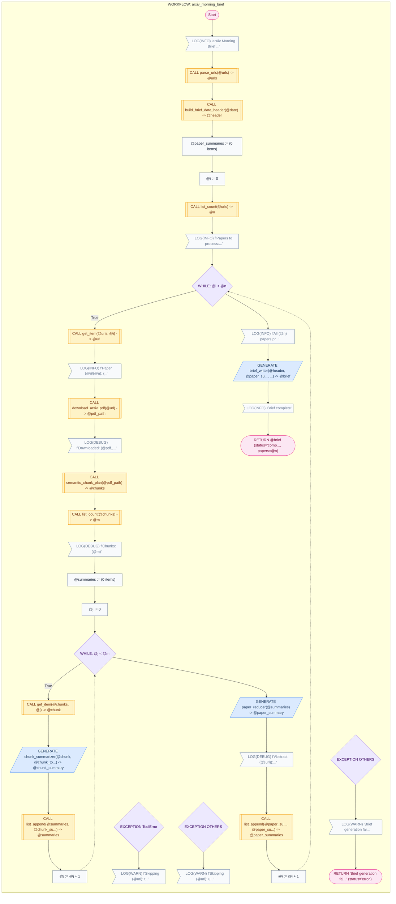

# Arxiv Morning Brief Workflow

Generated from `arxiv_morning_brief.spl` via `spl3 spl2mmd` (AST-direct, no LLM).

## Mermaid Diagram

```mermaid
flowchart TD
    subgraph SG_arxiv_morning_brief["WORKFLOW: arxiv_morning_brief"]
    direction TB
    START1(["Start"])
    LOG2>"LOG(INFO) 'arXiv Morning Brief ...'"]
    SUB3[["CALL parse_urls(@urls) -> @urls"]]
    LOG2 --> SUB3
    SUB4[["CALL build_brief_date_header(@date) -> @header"]]
    SUB3 --> SUB4
    A5["@paper_summaries := (0 items)"]
    SUB4 --> A5
    A6["@i := 0"]
    A5 --> A6
    SUB7[["CALL list_count(@urls) -> @n"]]
    A6 --> SUB7
    LOG8>"LOG(INFO) f'Papers to process:...'"]
    SUB7 --> LOG8
    WHILE9{"WHILE: @i < @n"}
    SUB10[["CALL get_item(@urls, @i) -> @url"]]
    LOG11>"LOG(INFO) f'Paper (@i)/(@n): (...'"]
    SUB10 --> LOG11
    SUB12[["CALL download_arxiv_pdf(@url) -> @pdf_path"]]
    LOG13>"LOG(DEBUG) f'Downloaded: (@pdf_...'"]
    SUB12 --> LOG13
    SUB14[["CALL semantic_chunk_plan(@pdf_path) -> @chunks"]]
    LOG13 --> SUB14
    SUB15[["CALL list_count(@chunks) -> @m"]]
    SUB14 --> SUB15
    LOG16>"LOG(DEBUG) f'Chunks: (@m)'"]
    SUB15 --> LOG16
    A17["@summaries := (0 items)"]
    LOG16 --> A17
    A18["@j := 0"]
    A17 --> A18
    WHILE19{"WHILE: @j < @m"}
    SUB20[["CALL get_item(@chunks, @j) -> @chunk"]]
    GEN21[/"GENERATE chunk_summarizer(@chunk, @chunk_to...) -> @chunk_summary"/]
    SUB20 --> GEN21
    SUB22[["CALL list_append(@summaries, @chunk_su...) -> @summaries"]]
    GEN21 --> SUB22
    A23["@j := @j + 1"]
    SUB22 --> A23
    WHILE19 -->|"True"| SUB20
    A23 -.-> WHILE19
    A18 --> WHILE19
    GEN24[/"GENERATE paper_reducer(@summaries) -> @paper_summary"/]
    WHILE19 --> GEN24
    LOG25>"LOG(DEBUG) f'Abstract ((@url)):...'"]
    GEN24 --> LOG25
    SUB26[["CALL list_append(@paper_su..., @paper_su...) -> @paper_summaries"]]
    LOG25 --> SUB26
    EXC27{"EXCEPTION ToolError"}
    LOG28>"LOG(WARN) f'Skipping (@url): t...'"]
    EXC27 --> LOG28
    EXC29{"EXCEPTION OTHERS"}
    LOG30>"LOG(WARN) f'Skipping (@url): u...'"]
    EXC29 --> LOG30
    LOG11 --> SUB12
    A31["@i := @i + 1"]
    SUB26 --> A31
    WHILE9 -->|"True"| SUB10
    A31 -.-> WHILE9
    LOG8 --> WHILE9
    LOG32>"LOG(INFO) f'All (@n) papers pr...'"]
    WHILE9 --> LOG32
    GEN33[/"GENERATE brief_writer(@header, @paper_su..., ...) -> @brief"/]
    LOG32 --> GEN33
    LOG34>"LOG(INFO) 'Brief complete'"]
    GEN33 --> LOG34
    RET35(["RETURN @brief (status='comp..., papers=@n)"])
    LOG34 --> RET35
    START1 --> LOG2
    EXC36{"EXCEPTION OTHERS"}
    LOG37>"LOG(WARN) 'Brief generation fai...'"]
    RET38(["RETURN 'Brief generation fai...' (status='error')"])
    LOG37 --> RET38
    EXC36 --> LOG37
    end
    class START1 term
    class LOG2 log
    class SUB3 proc
    class SUB4 proc
    class A5 assign
    class A6 assign
    class SUB7 proc
    class LOG8 log
    class WHILE9 ctrl
    class SUB10 proc
    class LOG11 log
    class SUB12 proc
    class LOG13 log
    class SUB14 proc
    class SUB15 proc
    class LOG16 log
    class A17 assign
    class A18 assign
    class WHILE19 ctrl
    class SUB20 proc
    class GEN21 llm
    class SUB22 proc
    class A23 assign
    class GEN24 llm
    class LOG25 log
    class SUB26 proc
    class EXC27 ctrl
    class LOG28 log
    class EXC29 ctrl
    class LOG30 log
    class A31 assign
    class LOG32 log
    class GEN33 llm
    class LOG34 log
    class RET35 term
    class EXC36 ctrl
    class LOG37 log
    class RET38 term
    classDef llm fill:#dbeafe,stroke:#3b82f6,color:#1e3a5f
    classDef proc fill:#fef3c7,stroke:#f59e0b,color:#78350f
    classDef ctrl fill:#ede9fe,stroke:#8b5cf6,color:#3b0764
    classDef term fill:#fce7f3,stroke:#ec4899,color:#831843
    classDef log fill:#f8fafc,stroke:#94a3b8,color:#64748b
    classDef fn fill:#f0fdf4,stroke:#86efac,color:#166534
    classDef assign fill:#f8fafc,stroke:#64748b,color:#1e293b
```
