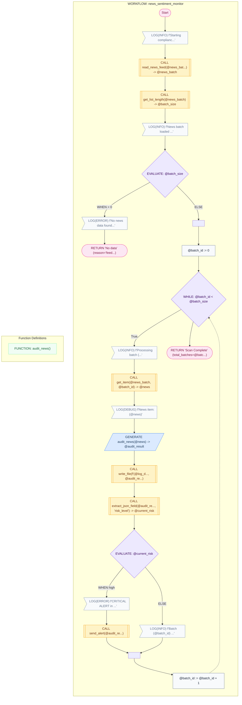

# Audit News Workflow

Generated from `audit_news.spl` via `spl3 spl2mmd` (AST-direct, no LLM).

## Mermaid Diagram

```mermaid
flowchart TD
    subgraph SG_news_sentiment_monitor["WORKFLOW: news_sentiment_monitor"]
    direction TB
    START1(["Start"])
    LOG2>"LOG(INFO) f'Starting complianc...'"]
    SUB3[["CALL read_news_feed(@news_bat...) -> @news_batch"]]
    LOG2 --> SUB3
    SUB4[["CALL get_list_length(@news_batch) -> @batch_size"]]
    SUB3 --> SUB4
    LOG5>"LOG(INFO) f'News batch loaded ...'"]
    SUB4 --> LOG5
    EVAL6{"EVALUATE: @batch_size"}
    LOG8>"LOG(ERROR) f'No news data found...'"]
    RET9(["RETURN 'No data' (reason='feed...)"])
    LOG8 --> RET9
    EVAL6 -->|"WHEN = 0"| LOG8
    EVAL6 -->|"ELSE"| MERGE7
    MERGE7[" "]
    LOG5 --> EVAL6
    A10["@batch_id := 0"]
    MERGE7 --> A10
    WHILE11{"WHILE: @batch_id < @batch_size"}
    LOG12>"LOG(INFO) f'Processing batch (...'"]
    SUB13[["CALL get_item(@news_batch, @batch_id) -> @news"]]
    LOG12 --> SUB13
    LOG14>"LOG(DEBUG) f'News item: (@news)'"]
    SUB13 --> LOG14
    GEN15[/"GENERATE audit_news(@news) -> @audit_result"/]
    LOG14 --> GEN15
    SUB16[["CALL write_file(f'(@log_d..., @audit_re...)"]]
    GEN15 --> SUB16
    SUB17[["CALL extract_json_field(@audit_re..., 'risk_level') -> @current_risk"]]
    SUB16 --> SUB17
    EVAL18{"EVALUATE: @current_risk"}
    LOG20>"LOG(ERROR) f'CRITICAL ALERT in ...'"]
    SUB21[["CALL send_alert(@audit_re...)"]]
    LOG20 --> SUB21
    EVAL18 -->|"WHEN high"| LOG20
    SUB21 --> MERGE19
    LOG22>"LOG(INFO) f'Batch (@batch_id) ...'"]
    EVAL18 -->|"ELSE"| LOG22
    LOG22 --> MERGE19
    MERGE19[" "]
    SUB17 --> EVAL18
    A23["@batch_id := @batch_id + 1"]
    MERGE19 --> A23
    WHILE11 -->|"True"| LOG12
    A23 -.-> WHILE11
    A10 --> WHILE11
    RET24(["RETURN 'Scan Complete' (total_batches=@batc...)"])
    WHILE11 --> RET24
    START1 --> LOG2
    end
    subgraph FUNCTIONS["Function Definitions"]
    direction TB
    FN25["FUNCTION: audit_news()"]
    end
    class START1 term
    class LOG2 log
    class SUB3 proc
    class SUB4 proc
    class LOG5 log
    class EVAL6 ctrl
    class LOG8 log
    class RET9 term
    class A10 assign
    class WHILE11 ctrl
    class LOG12 log
    class SUB13 proc
    class LOG14 log
    class GEN15 llm
    class SUB16 proc
    class SUB17 proc
    class EVAL18 ctrl
    class LOG20 log
    class SUB21 proc
    class LOG22 log
    class A23 assign
    class RET24 term
    class FN25 fn
    classDef llm fill:#dbeafe,stroke:#3b82f6,color:#1e3a5f
    classDef proc fill:#fef3c7,stroke:#f59e0b,color:#78350f
    classDef ctrl fill:#ede9fe,stroke:#8b5cf6,color:#3b0764
    classDef term fill:#fce7f3,stroke:#ec4899,color:#831843
    classDef log fill:#f8fafc,stroke:#94a3b8,color:#64748b
    classDef fn fill:#f0fdf4,stroke:#86efac,color:#166534
    classDef assign fill:#f8fafc,stroke:#64748b,color:#1e293b
```
