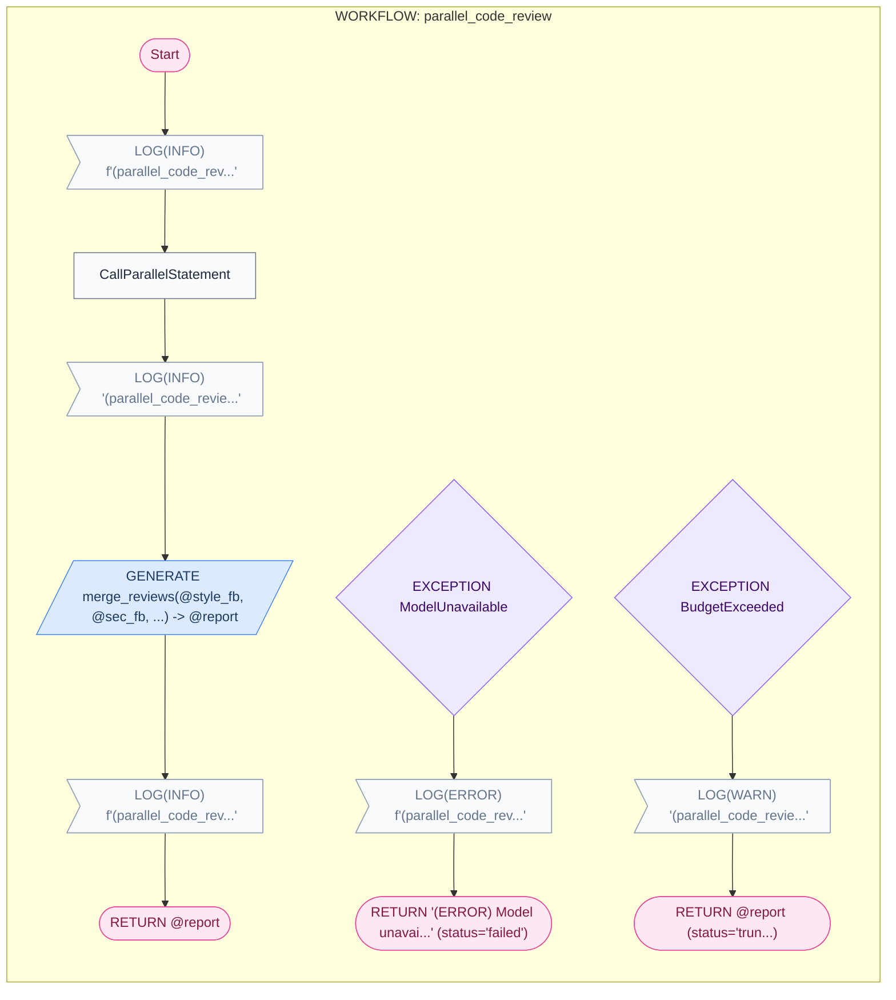

# Parallel Code Review Workflow

Generated from `parallel_code_review.spl` via `spl3 spl2mmd` (AST-direct, no LLM).

## Mermaid Diagram

```mermaid
flowchart TD
    subgraph SG_parallel_code_review["WORKFLOW: parallel_code_review"]
    direction TB
    START1(["Start"])
    LOG2>"LOG(INFO) f'(parallel_code_rev...'"]
    S3["CallParallelStatement"]
    LOG2 --> S3
    LOG4>"LOG(INFO) '(parallel_code_revie...'"]
    S3 --> LOG4
    GEN5[/"GENERATE merge_reviews(@style_fb, @sec_fb, ...) -> @report"/]
    LOG4 --> GEN5
    LOG6>"LOG(INFO) f'(parallel_code_rev...'"]
    GEN5 --> LOG6
    RET7(["RETURN @report"])
    LOG6 --> RET7
    START1 --> LOG2
    EXC8{"EXCEPTION ModelUnavailable"}
    LOG9>"LOG(ERROR) f'(parallel_code_rev...'"]
    RET10(["RETURN '(ERROR) Model unavai...' (status='failed')"])
    LOG9 --> RET10
    EXC8 --> LOG9
    EXC11{"EXCEPTION BudgetExceeded"}
    LOG12>"LOG(WARN) '(parallel_code_revie...'"]
    RET13(["RETURN @report (status='trun...)"])
    LOG12 --> RET13
    EXC11 --> LOG12
    end
    class START1 term
    class LOG2 log
    class S3 assign
    class LOG4 log
    class GEN5 llm
    class LOG6 log
    class RET7 term
    class EXC8 ctrl
    class LOG9 log
    class RET10 term
    class EXC11 ctrl
    class LOG12 log
    class RET13 term
    classDef llm fill:#dbeafe,stroke:#3b82f6,color:#1e3a5f
    classDef ctrl fill:#ede9fe,stroke:#8b5cf6,color:#3b0764
    classDef term fill:#fce7f3,stroke:#ec4899,color:#831843
    classDef log fill:#f8fafc,stroke:#94a3b8,color:#64748b
    classDef fn fill:#f0fdf4,stroke:#86efac,color:#166534
    classDef assign fill:#f8fafc,stroke:#64748b,color:#1e293b
```
