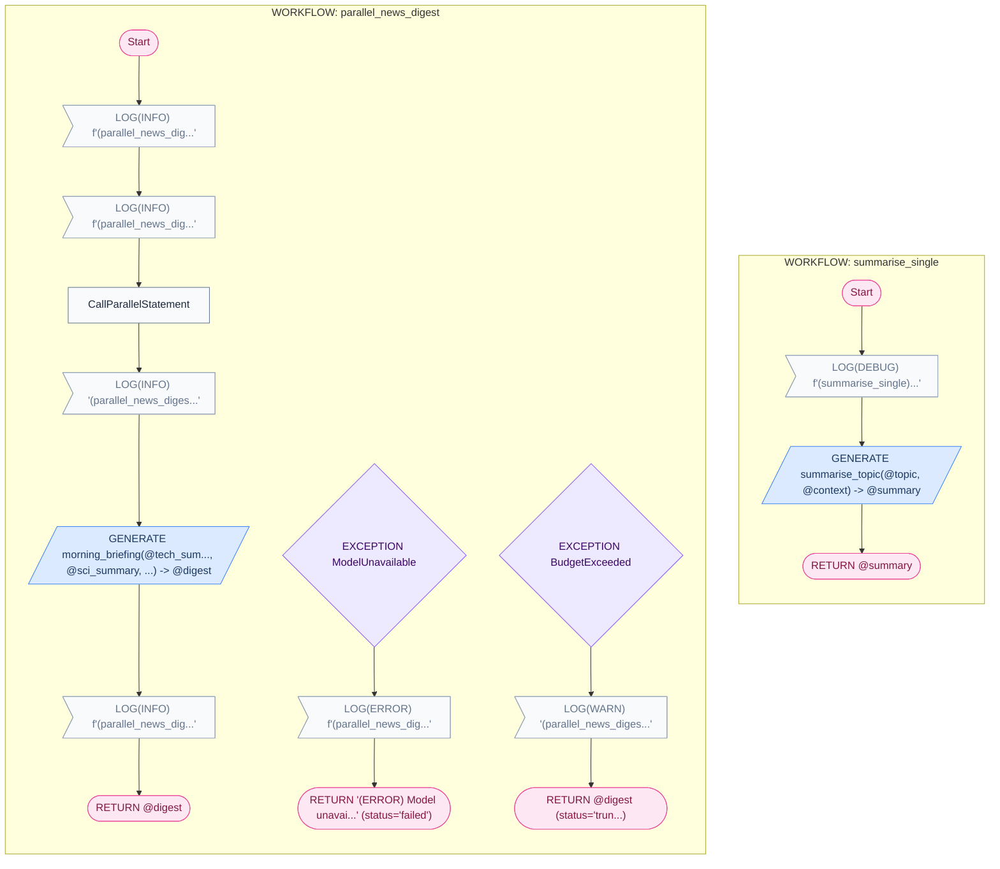

# Parallel News Digest Workflow

Generated from `parallel_news_digest.spl` via `spl3 spl2mmd` (AST-direct, no LLM).

## Mermaid Diagram

```mermaid
flowchart TD
    subgraph SG_summarise_single["WORKFLOW: summarise_single"]
    direction TB
    START1(["Start"])
    LOG2>"LOG(DEBUG) f'(summarise_single)...'"]
    GEN3[/"GENERATE summarise_topic(@topic, @context) -> @summary"/]
    LOG2 --> GEN3
    RET4(["RETURN @summary"])
    GEN3 --> RET4
    START1 --> LOG2
    end
    subgraph SG_parallel_news_digest["WORKFLOW: parallel_news_digest"]
    direction TB
    START5(["Start"])
    LOG6>"LOG(INFO) f'(parallel_news_dig...'"]
    LOG7>"LOG(INFO) f'(parallel_news_dig...'"]
    LOG6 --> LOG7
    S8["CallParallelStatement"]
    LOG7 --> S8
    LOG9>"LOG(INFO) '(parallel_news_diges...'"]
    S8 --> LOG9
    GEN10[/"GENERATE morning_briefing(@tech_sum..., @sci_summary, ...) -> @digest"/]
    LOG9 --> GEN10
    LOG11>"LOG(INFO) f'(parallel_news_dig...'"]
    GEN10 --> LOG11
    RET12(["RETURN @digest"])
    LOG11 --> RET12
    START5 --> LOG6
    EXC13{"EXCEPTION ModelUnavailable"}
    LOG14>"LOG(ERROR) f'(parallel_news_dig...'"]
    RET15(["RETURN '(ERROR) Model unavai...' (status='failed')"])
    LOG14 --> RET15
    EXC13 --> LOG14
    EXC16{"EXCEPTION BudgetExceeded"}
    LOG17>"LOG(WARN) '(parallel_news_diges...'"]
    RET18(["RETURN @digest (status='trun...)"])
    LOG17 --> RET18
    EXC16 --> LOG17
    end
    class START1 term
    class LOG2 log
    class GEN3 llm
    class RET4 term
    class START5 term
    class LOG6 log
    class LOG7 log
    class S8 assign
    class LOG9 log
    class GEN10 llm
    class LOG11 log
    class RET12 term
    class EXC13 ctrl
    class LOG14 log
    class RET15 term
    class EXC16 ctrl
    class LOG17 log
    class RET18 term
    classDef llm fill:#dbeafe,stroke:#3b82f6,color:#1e3a5f
    classDef ctrl fill:#ede9fe,stroke:#8b5cf6,color:#3b0764
    classDef term fill:#fce7f3,stroke:#ec4899,color:#831843
    classDef log fill:#f8fafc,stroke:#94a3b8,color:#64748b
    classDef fn fill:#f0fdf4,stroke:#86efac,color:#166534
    classDef assign fill:#f8fafc,stroke:#64748b,color:#1e293b
```
