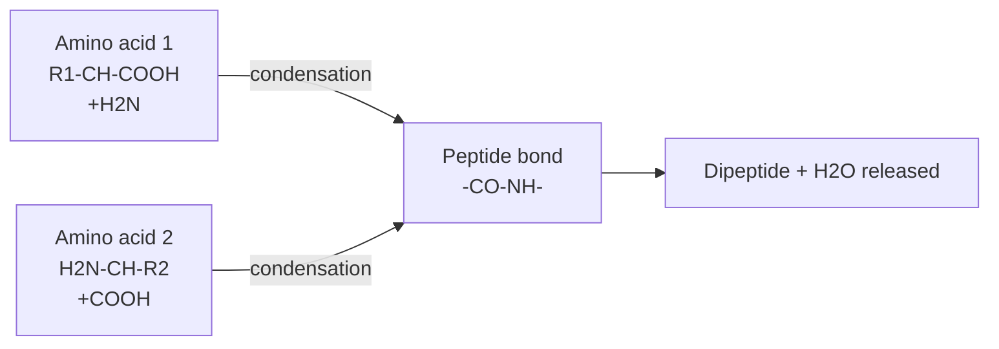
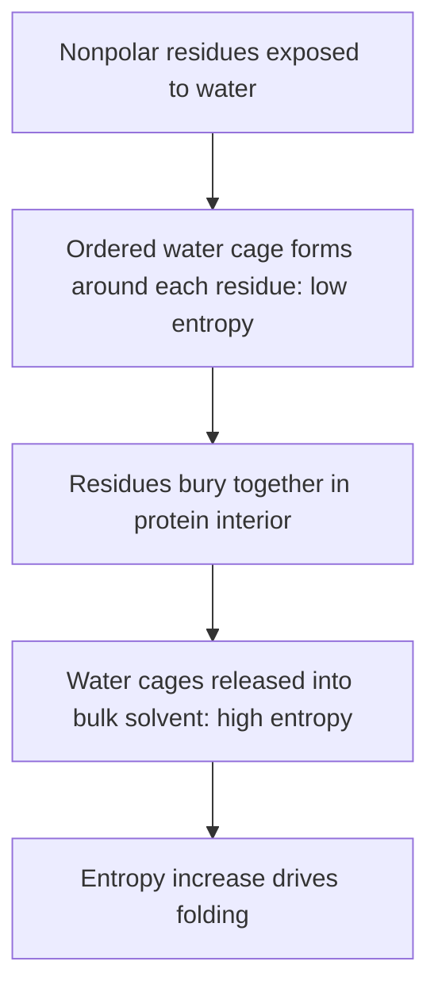
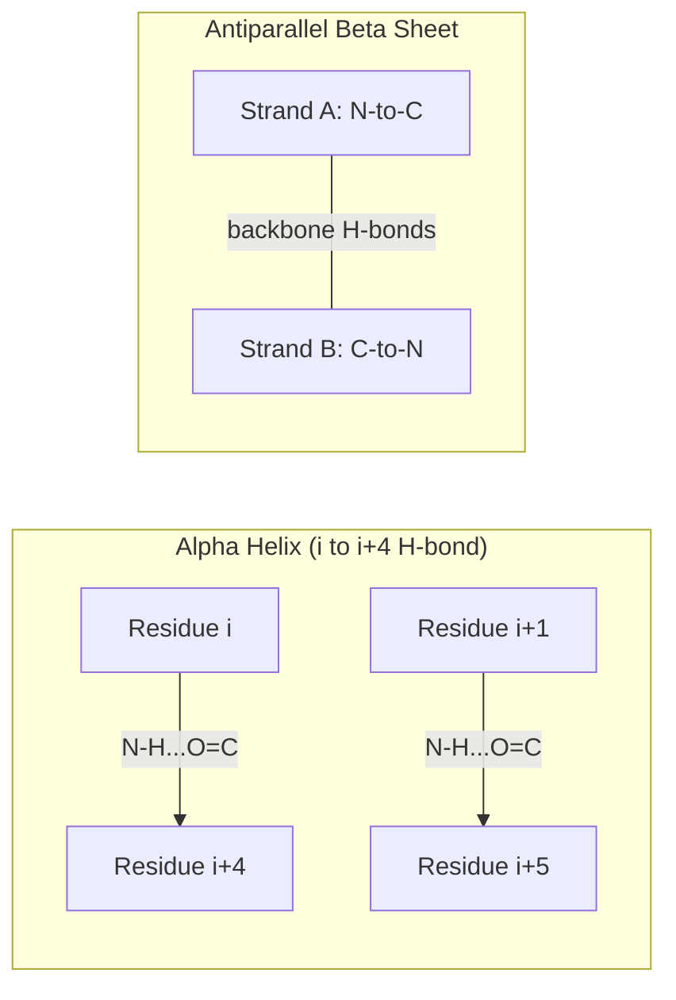
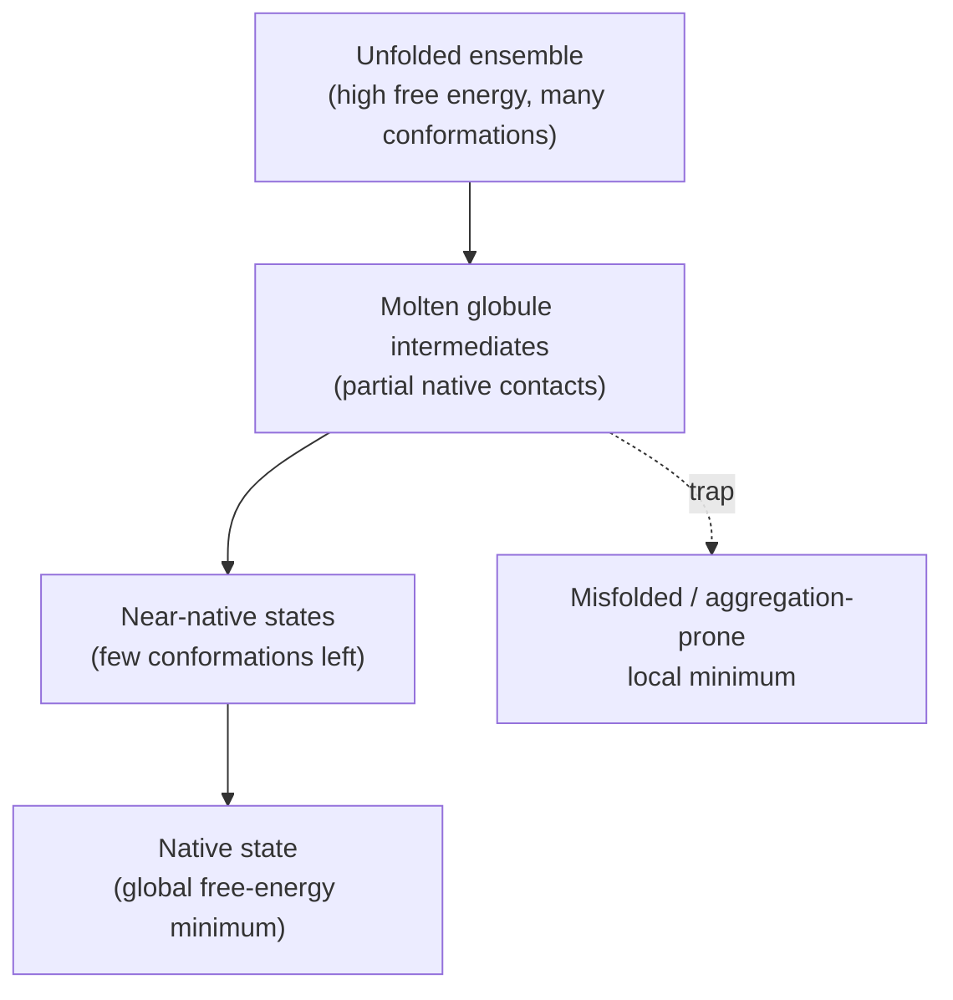
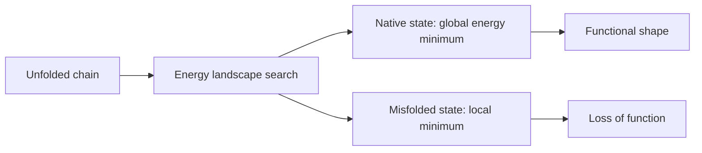
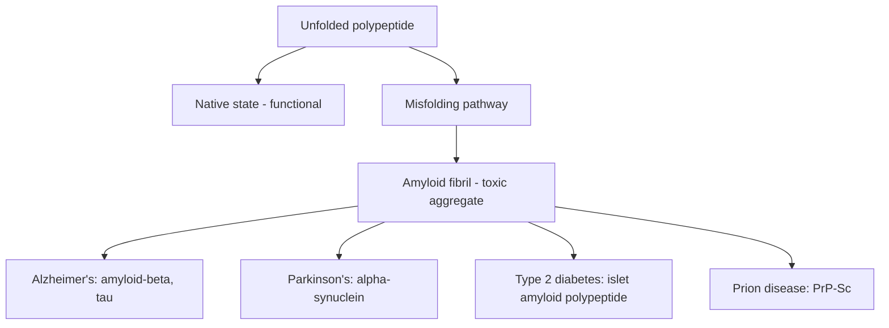

# Concept-Book Run

domain: /home/papagame/projects/digital-duck/conceptbook-app/public/domains/Digital-Duck/how_protein_folds/input/graph.yaml
target: protein_misfolding_disease
started: 2026-09-27T08:34:07

## Teaching order (16 concepts)

- amino_acid
- chemical_bond
- energy
- peptide_bond
- entropy
- polypeptide_chain
- noncovalent_interaction
- hydrogen_bond
- hydrophobic_effect
- primary_structure
- gibbs_free_energy
- secondary_structure
- tertiary_structure
- energy_landscape
- native_state
- protein_misfolding_disease

### amino_acid (0.8s)

## Amino Acid

An amino acid is the monomer unit from which proteins are built. Every one of the 20 standard amino acids shares the same backbone: a central alpha carbon bonded to an amine group ($-NH_2$), a carboxyl group ($-COOH$), a hydrogen atom, and a variable side chain called the R-group. The backbone is identical across all 20; the R-group is what distinguishes one amino acid from another, and it determines the amino acid's chemical personality — nonpolar (hydrophobic), polar (hydrophilic), positively charged, or negatively charged. This four-way classification predicts how the amino acid will behave when the protein folds: hydrophobic side chains tend to bury themselves in the protein's interior away from water, while charged and polar side chains tend to sit on the surface, interacting with the surrounding aqueous environment.

**Worked example.** Compare glycine, leucine, aspartate, and lysine. Glycine has the simplest possible R-group — a single hydrogen atom — making it small and flexible, useful in tight turns of a folded protein. Leucine has a bulky hydrocarbon side chain, strongly hydrophobic, so it is almost always found buried inside a protein. Aspartate's side chain ends in a carboxyl group that ionizes to carry a negative charge at physiological pH. Lysine's side chain ends in an amine group that ionizes to carry a positive charge. If you were shown a protein's folded structure and asked to guess which residues sit on the exterior surface facing water, you would predict aspartate and lysine, not leucine.

**Problem-solving application.** Because a protein is a sequence written in this 20-letter alphabet, you can often predict a fragment of a protein's function or stability directly from its sequence, without knowing the full 3D structure. Given a stretch of sequence rich in leucine, valine, and isoleucine, you can predict it is a hydrophobic core segment, likely buried or embedded in a membrane. Given a stretch rich in aspartate, glutamate, lysine, and arginine, you can predict a charged, surface-exposed, water-interacting region — common in a protein's active site or in a domain that binds another charged molecule like DNA. This sequence-to-property reasoning is the foundation of tools that predict protein structure and function from sequence alone.

### chemical_bond (0.8s)

## Chemical Bond

A chemical bond is the attractive force holding two atoms together. For proteins, only one distinction matters for problem-solving: is the bond covalent or noncovalent? The two regimes differ in strength by roughly two orders of magnitude, and that difference in kind — not just degree — is what makes a folded protein sturdy yet reversible.

**Covalent bonds** form when two atoms share a pair of electrons, locking their nuclei into a fixed, directional geometry. These bonds are strong, typically 80–100 kcal/mol — far more energy than random thermal collisions at body temperature can supply. The links joining one amino acid to the next along a protein's backbone are covalent, which is why the linear sequence of residues, once synthesized, is essentially permanent: you cannot reshuffle it by heating or jostling the molecule.

**Noncovalent interactions**, by contrast, are electrostatic attractions between atoms that do not share electrons — attractions between partial charges, transient pulls from fluctuating electron clouds, and attractions between oppositely charged side chains all fall into this single weak category, each contributing only 0.5–5 kcal/mol, comparable to the thermal energy available at body temperature. Individually, these contacts are constantly forming and breaking; that reversibility is precisely their functional value.

The problem-solving payoff: a folded protein is held together by hundreds of these weak noncovalent contacts acting simultaneously, and their combined energy can rival a single covalent bond even though no individual contact could survive alone. That is why a protein can be sturdy in its folded shape yet still come apart reversibly under heat, pH change, or chemical stress, and why a receptor can bind and release a ligand in milliseconds. When you face a structural or mechanistic question — "why does this protein unfold at high temperature," "how does a receptor release its ligand" — the diagnostic move is always the same: ask whether covalent bonds (the sequence) or noncovalent bonds (the shape) are the ones being broken. Only the noncovalent kind is reversible under physiological conditions.

### energy (1.1s)

## Energy

Energy is the capacity of a system to do work or to release heat. In thermodynamics, energy accounting is formalized through enthalpy, $H$, a state function defined as

$$H = U + PV$$

where $U$ is the internal energy of the system, $P$ is pressure, and $V$ is volume. At constant pressure — the condition for most chemistry done in open flasks or living cells — the change in enthalpy equals the heat absorbed or released by the process: $\Delta H = q_p$. This is what makes enthalpy useful: it converts an abstract "capacity to do work" into a measurable quantity, heat flow, that a thermometer or calorimeter can detect.

The sign of $\Delta H$ tells you the direction of energy flow. When atoms come together and form new, more stable bonds — for example, two hydrogen atoms combining into $\mathrm{H_2}$ — the resulting arrangement has lower potential energy than the separated atoms, so energy is released to the surroundings and $\Delta H < 0$ (exothermic). When bonds must be broken or atoms forced apart against their mutual attraction, energy must be supplied from the surroundings, so $\Delta H > 0$ (endothermic).

Worked example: consider combustion of methane, $\mathrm{CH_4(g)} + 2\mathrm{O_2(g)} \rightarrow \mathrm{CO_2(g)} + 2\mathrm{H_2O(l)}$, with $\Delta H = -890\ \mathrm{kJ/mol}$. Breaking the C–H and O=O bonds in the reactants costs energy, but forming the C=O and O–H bonds in the products releases more energy than was invested. The net negative $\Delta H$ tells you the products are more stable — this is why combustion releases usable heat.

For problem-solving, enthalpy changes are additive: by Hess's law, $\Delta H$ for a multi-step reaction pathway equals the sum of the $\Delta H$ values for each step, regardless of the path taken, because $H$ is a state function. This lets you calculate $\Delta H$ for reactions that are difficult to measure directly by combining known values from simpler reactions.

A critical limitation: enthalpy alone cannot predict whether a process will occur spontaneously. Some spontaneous processes are endothermic, such as ice melting at room temperature. Predicting spontaneity requires also accounting for entropy, combined with enthalpy through the Gibbs free energy relation $\Delta G = \Delta H - T\Delta S$.

### peptide_bond (1.0s)

## Peptide Bond

A peptide bond is the covalent C–N linkage that joins two amino acids into a chain. It forms through a condensation (dehydration) reaction: the carboxyl group (-COOH) of one amino acid reacts with the amine group (-NH2) of the next, releasing one molecule of water and leaving behind a new C(=O)-N-H linkage. Because each peptide bond costs one water molecule, a chain of $n$ amino acids contains $n-1$ peptide bonds — the basis for calculating a protein's molecular weight from its sequence.

The key structural fact is that this bond is not a simple single bond. The nitrogen's lone pair delocalizes into the adjacent carbonyl, giving the C–N bond roughly 40% double-bond character through resonance between two contributing structures. This partial double-bond character has a direct geometric consequence: rotation around the C–N bond is restricted, so the six atoms surrounding it (Cα, C, O, N, H, Cα) lie in a single rigid plane, almost always in the trans configuration. This planarity is the first constraint imposed on protein folding — free rotation is only possible around the two bonds flanking each peptide unit (the phi and psi dihedral angles at the Cα), which is why the Ramachandran plot restricts allowed backbone conformations to specific angle combinations rather than the full range geometrically conceivable.

**Worked example.** Glycine and alanine condense: glycine's -COOH reacts with alanine's -NH2. Water leaves, and the product is the dipeptide Gly-Ala, containing one peptide bond and one free amino end (Gly) and one free carboxyl end (Ala). The molecular weight of the dipeptide equals the sum of the two amino acid weights minus 18 (the mass of one water molecule) — a calculation that generalizes to any chain of $n$ residues, whose mass is the sum of residue masses minus $18(n-1)$ daltons.

*Two amino acids joining via condensation: the carboxyl group of one and the amine group of the other combine to form a rigid, planar peptide bond, releasing one water molecule.*

### entropy (0.9s)

## Entropy

Entropy quantifies the number of microscopic arrangements — microstates — consistent with a system's observed macroscopic state. Ludwig Boltzmann formalized this with the relation

$$
S = k_B \ln \Omega
$$

where $\Omega$ is the number of accessible microstates, and $k_B$ is Boltzmann's constant. The equation captures a deep idea: a system does not evolve toward low energy because energy is "preferred" — it evolves toward whichever macrostate corresponds to the largest number of microstates, because that macrostate is overwhelmingly more probable to be observed. High entropy is not disorder for its own sake; it is a statistical majority.

**Worked example.** Consider a protein chain of 300 amino acid residues. In its unfolded state, each residue can adopt roughly 3 backbone conformations, giving Levinthal's estimate of about $3^{300} \approx 10^{143}$ possible chain conformations. Applying the Boltzmann relation, the unfolded state's conformational entropy is approximately $S_{\text{unfolded}} = k_B \ln(10^{143})$, an enormous number compared to the folded state, which occupies essentially $\Omega \approx 1$ microstate (its unique native shape). Folding therefore requires the system to lose almost all of this entropy: $\Delta S_{\text{fold}} = S_{\text{folded}} - S_{\text{unfolded}} \ll 0$.

**Problem-solving application.** This entropic loss is not free. Basic thermodynamics tells us that a spontaneous process must release more usable energy than the entropy penalty costs it, so folding can only happen if something elsewhere in the system pays for the lost conformational freedom. In practice that payment comes from favorable interactions the folded protein forms as it collapses — hydrogen bonding, tight van der Waals packing in the hydrophobic core, and the release of ordered water molecules that had been caging the nonpolar side chains (the hydrophobic effect, which itself raises the entropy of the surrounding solvent). This is the general problem-solving move for any entropy-driven question: identify which piece of the system loses accessible states, then locate where else — energy release, solvent reorganization, or another subsystem's own entropy gain — the deficit is paid. Levinthal's paradox itself is resolved this way: proteins do not search all $10^{143}$ conformations sequentially; folding follows biased energy landscapes ("folding funnels") that make the probable path also the fast one.

### polypeptide_chain (1.1s)

## Polypeptide Chain

A polypeptide chain is a linear polymer formed when $N$ amino acids are joined end-to-end by $N-1$ peptide bonds, each formed by a condensation reaction that releases one water molecule. By convention the chain is written and read from its N-terminus (the residue with a free amine group) to its C-terminus (the residue with a free carboxyl group). Every peptide bond in every protein is chemically identical — a rigid, planar carbon-nitrogen linkage — so the backbone itself carries no information. What distinguishes one protein from another is entirely the order of side chains hanging off that backbone: the primary structure. A typical human protein runs 300–500 residues, though functional peptides can be as short as a few residues.

**Worked example.** Consider a short chain: glycine–alanine–serine. Joining these three amino acids removes two water molecules (one per peptide bond), leaving a tripeptide with a single free amine at the glycine end and a single free carboxyl at the serine end. Written in standard shorthand, this is Gly-Ala-Ser, always N-terminus first. If you were instead given Ser-Ala-Gly, this names a different molecule, even though it contains the same three amino acids — direction encodes information, just as it does in a sentence read left to right.

**Problem-solving application.** Because assembly is directional and irreversible on the ribosome, sequence problems reduce to counting and ordering. For a chain of $N$ residues, there are $N-1$ peptide bonds and, if all $N$ side chains are distinct, $N!$ possible orderings — the same permutation logic used for arranging any distinguishable objects in a row. This matters practically: a 300-residue protein assembled from the 20 standard amino acids has an astronomically larger number of possible sequences than there are protein-coding genes on Earth, which is why the genetic code (not chance) must specify the exact order. When you encounter a mutation problem — e.g., "a single amino acid substitution at position 6 of a 146-residue chain" — treat the chain as an indexed sequence: position number tells you which peptide bond neighbors are affected, and only the side chain at that position changes, not the backbone chemistry. This framing is what lets you connect a one-letter genetic change to a specific, localized change in the folded protein's shape and function.

### noncovalent_interaction (1.0s)

## Noncovalent Interaction

A noncovalent interaction is any attractive force between atoms that does not involve sharing electron pairs — no covalent bond forms, and the interaction is weak and reversible rather than a fixed, permanent linkage. Three types dominate protein folding. A hydrogen bond forms when a hydrogen attached to nitrogen or oxygen is drawn toward a nearby nitrogen or oxygen acceptor; it is directional and worth roughly 2–5 kcal/mol. A van der Waals contact is a fleeting attraction between the induced dipoles of any two atoms close enough to touch, worth only about 0.5–1 kcal/mol per contact but occurring by the thousands in a folded chain. An electrostatic interaction, or salt bridge, is the attraction between oppositely charged side chains, worth roughly 1–5 kcal/mol. Individually, none of these forces is strong; a single covalent bond (e.g., a carbon-carbon bond, ~80–90 kcal/mol) dwarfs any one of them.

Consider a folded enzyme with 150 amino acids. Its interior contains perhaps 50 hydrogen bonds along the backbone, a handful of salt bridges between charged side chains, and thousands of van der Waals contacts packed throughout the hydrophobic core. Summing these contributions — many small attractions acting simultaneously across the whole structure — gives a net folding stability of only about 5–15 kcal/mol. That total is the difference between the folded state's total noncovalent energy and the unfolded state's, not a single bond's strength.

This arithmetic explains a defining, almost counterintuitive property of proteins: they are only marginally stable. Raising the temperature by 20–30°C, adding a chaotropic agent like urea, or shifting the pH can supply enough thermal or chemical energy to overcome that modest 5–15 kcal/mol margin and unfold the protein — without ever breaking a single covalent bond in the backbone or side chains. This is the basis for problems asking why boiling an egg is irreversible in a different sense than mild heating a solution of a heat-tolerant enzyme: the covalent peptide bonds remain intact even after denaturation, but the noncovalent network that specified the fold has collapsed, and refolding depends on whether the fold's specific pattern of contacts can be found again.

The practical lesson for problem-solving: to assess whether a mutation or environmental change will destabilize a protein, don't look for broken covalent bonds — count the noncovalent contacts perturbed (an added charge disrupting a salt bridge, a bulky side chain displacing dozens of van der Waals contacts) and weigh their cumulative effect against that narrow 5–15 kcal/mol stability margin.

### hydrogen_bond (1.0s)

## Hydrogen Bond

A hydrogen bond is a noncovalent attraction that forms when a hydrogen atom, already covalently bonded to an electronegative atom (nitrogen or oxygen), is drawn toward a second electronegative atom nearby. The atom holding the hydrogen is called the donor; the atom being approached is the acceptor. Because the donor atom pulls electron density away from the hydrogen, the hydrogen carries a partial positive charge, while the acceptor atom carries a partial negative charge — the attraction is fundamentally electrostatic. Typical donor-to-acceptor distances fall between 2.7 and 3.3 Å, and the bond is strongest when the hydrogen, donor, and acceptor are nearly collinear (bond angle near $180°$). A single hydrogen bond contributes roughly 2–5 kcal/mol of stabilization energy — an order of magnitude weaker than a covalent bond, but significant when hundreds of them act together.

In a polypeptide chain, the most consequential hydrogen bonds occur between backbone atoms: the N-H group of one amino acid residue (donor) and the C=O group of another residue (acceptor). Every peptide bond has exactly one N-H and one C=O available for backbone hydrogen bonding, so the chain has a fixed, repeating supply of donors and acceptors. Because the peptide bond is planar and rigid (restricted rotation around the C-N bond), only certain foldings of the chain bring donor and acceptor atoms close enough, and at the correct angle, to satisfy the 2.7–3.3 Å and near-linear geometric requirements simultaneously.

Consider a chain folding into a right-handed helix. If the geometry is such that each N-H hydrogen bonds to the C=O four residues earlier in the sequence, the result is the alpha helix — a repeating i-to-(i−4) hydrogen-bonding pattern that runs parallel to the helix axis. If instead two extended chain segments lie side by side, N-H and C=O groups on adjacent strands can pair directly across the strands, producing a beta sheet. In both cases, the secondary structure observed is not arbitrary — it is the specific fold that satisfies the largest number of backbone hydrogen-bond geometric constraints given the fixed peptide-bond angles. This is why predicting hydrogen-bonding compatibility between backbone positions is a direct route to predicting secondary structure: count the donors and acceptors, check which pairs fall within the distance and angle window, and the allowed folds follow from geometry alone.

### hydrophobic_effect (0.8s)

## Hydrophobic Effect

When a protein chain is synthesized, it contains a mix of polar and nonpolar amino acid side chains, and how they interact with surrounding water determines the protein's three-dimensional fold. The hydrophobic effect is the entropy-driven tendency of nonpolar side chains to cluster together, away from water, forming the protein's compact interior core.

The mechanism hinges on what water does around a nonpolar surface, not on any attraction between nonpolar groups themselves. Water molecules are constantly forming and breaking hydrogen bonds with each other. A nonpolar residue offers no hydrogen-bonding partner, so nearby water molecules compensate by orienting into a cage-like shell that preserves their own hydrogen bonding — a structure far more ordered, and therefore lower in entropy, than bulk water. When two nonpolar residues bury themselves against each other instead of each maintaining a separate cage, the water molecules that were trapped in those cages are released back into the disordered bulk, and the total entropy of the water rises. Because a spontaneous process is one that increases the overall disorder of a system and its surroundings, this entropy gain is what makes protein folding thermodynamically favorable overall — the water "wants" to be less ordered, and burying hydrophobic residues is how it gets there.

As a worked example: consider a small protein with several leucine and valine residues on an unfolded, extended chain, each surrounded by its own ordered water cage. As the chain folds, these residues pack into the interior, releasing dozens of caged water molecules into bulk solvent. The same logic explains why oil droplets coalesce in water: not because oil molecules pull on each other, but because water prefers not to organize around them individually.

For problem-solving: given a partially folded protein, you can predict which residues will end up buried versus exposed by scanning the sequence for nonpolar side chains (e.g., leucine, valine, phenylalanine, isoleucine) — these are the strongest candidates for the hydrophobic core, while charged or polar residues (e.g., lysine, aspartate, serine) are expected to remain on the surface, in contact with water.

*Before-and-after comparison showing how burying hydrophobic residues releases ordered water and increases overall entropy, driving the folding process.*

### primary_structure (0.7s)

## Primary Structure

Primary structure is the linear sequence of amino acids in a polypeptide chain, written conventionally from the N-terminus (free amino group) to the C-terminus (free carboxyl group). This sequence is specified directly by the gene: each non-overlapping triplet of nucleotides (codon) in messenger RNA is translated, via the genetic code, into one of 20 amino acids, so a gene of $3n$ coding nucleotides specifies a chain of $n$ residues.

Anfinsen's thermodynamic hypothesis, for which he received the 1972 Nobel Prize in Chemistry, states that for many proteins the primary structure alone determines the native three-dimensional fold: the sequence contains sufficient information to specify the conformation of lowest accessible free energy, without requiring additional cellular machinery. He demonstrated this by denaturing ribonuclease A with urea and a reducing agent, then removing both — the protein spontaneously refolded into its active, correctly disulfide-bonded form. Because folding is driven by minimizing free energy, replacing even a single residue changes the balance of hydrophobic burial, hydrogen bonding, and electrostatic interactions that stabilizes the fold — the effect can be neutral, mildly destabilizing, catastrophic, or occasionally advantageous.

Worked example: sickle-cell anemia arises from a single-nucleotide substitution in the gene for the hemoglobin beta chain, changing codon 6 from GAG to GTG. This swaps the normal residue, glutamate (negatively charged, hydrophilic), for valine (nonpolar, hydrophobic), at a site on the protein's surface. The new hydrophobic patch allows deoxygenated hemoglobin molecules to polymerize into rigid fibers, distorting red blood cells into the characteristic sickle shape and causing vaso-occlusion and hemolysis.

Problem-solving application: given a coding sequence, you can predict the primary structure by reading it in triplets and translating each codon; conversely, given an observed amino acid substitution, you can infer which single-nucleotide change in the gene could produce it (since the genetic code is redundant, more than one codon can encode the same residue, but a single glutamate-to-valine change, as in hemoglobin, corresponds to a single-base transversion). This sequence-to-phenotype logic — codon in, residue out, residue change in, phenotype consequence out — is the starting point for interpreting any missense mutation.

### gibbs_free_energy (0.9s)

## Gibbs Free Energy

Gibbs free energy is the single quantity that predicts whether a process will occur spontaneously at constant temperature and pressure — the conditions of nearly every chemical and biological reaction on Earth's surface, including inside a living cell. It is defined as

$$
G = H - TS
$$

where $H$ is enthalpy (the heat content of the system), $T$ is absolute temperature, and $S$ is entropy (a measure of disorder, or more precisely, the number of microscopic arrangements consistent with a given state). Because a spontaneous process is one that increases the total entropy of the universe, and $G$ packages that requirement into a single system-level quantity, the criterion for spontaneity reduces to one inequality:

$$
\Delta G = \Delta H - T\Delta S < 0
$$

A process with $\Delta G < 0$ will proceed on its own, without external work being supplied; $\Delta G > 0$ means the reverse process is favored; $\Delta G = 0$ marks equilibrium.

**Worked example: protein folding.** When a protein folds from an unstructured chain into its compact native shape, two competing effects occur. Folding buries hydrophobic side chains and forms hydrogen bonds and van der Waals contacts, releasing heat: $\Delta H < 0$, which favors folding. But folding also collapses a floppy chain with enormous conformational freedom into one essentially fixed shape, which lowers entropy: $\Delta S < 0$, which opposes folding, since $-T\Delta S$ becomes a positive (unfavorable) contribution. The protein folds only because the enthalpy term wins by a narrow margin: $|\Delta H|$ slightly exceeds $T|\Delta S|$. The net result, $\Delta G$, typically works out to only $-5$ to $-15\ \text{kcal/mol}$ — a small number compared to the individual $\Delta H$ and $T\Delta S$ terms, which are often ten times larger and nearly cancel.

**Problem-solving application.** This narrow margin is precisely why folded proteins are fragile to modest changes in temperature or solvent. Raising temperature increases the magnitude of the $T\Delta S$ penalty directly; adding chemical denaturants (urea, guanidinium) weakens the favorable hydrophobic and hydrogen-bonding contacts that make $\Delta H$ negative. Either change is enough to flip the sign of $\Delta G$ from negative to positive, at which point the unfolded state becomes thermodynamically favored and the protein denatures — the basis of thermal and chemical stability assays used throughout biochemistry.

### secondary_structure (1.0s)

## Secondary Structure

Secondary structure describes the local, repeating conformations a polypeptide backbone adopts once regular hydrogen bonds form between backbone N–H and C=O groups — independent of what the side chains are doing. Because only the backbone atoms participate, the pattern depends on the sequence's flexibility and hydrogen-bonding geometry, not on which specific amino acids are present. Two conformations dominate: the alpha helix, a right-handed spiral in which each N–H bonds to the C=O of the residue four positions back along the chain ($i \rightarrow i+4$), completing 3.6 residues per full turn; and the beta sheet, in which extended strands lie side by side and are cross-linked by inter-strand backbone hydrogen bonds, running either parallel (same N-to-C direction) or antiparallel (opposite directions, which packs more efficiently and is more common).

**Worked example.** The alpha helix has a rise of 0.15 nm per residue. A helix of 22 residues has a contour length of:

$$
L = n \times 0.15\ \text{nm} = 22 \times 0.15\ \text{nm} = 3.3\ \text{nm}
$$

and completes $22 / 3.6 \approx 6.1$ turns. The helix pitch — the axial distance per full turn — is:

$$
p = 3.6 \times 0.15\ \text{nm} = 0.54\ \text{nm}
$$

**Problem-solving application.** These geometric constants let you predict physical dimensions from sequence length alone, which is routinely used to check whether a proposed helical segment is long enough to span a lipid bilayer (~3–4 nm thick): a transmembrane helix needs at least $3.5\ \text{nm} / 0.15\ \text{nm} \approx 24$ residues. Conversely, spacing of hydrogen-bond donors and acceptors tells you which conformation a stretch of backbone can adopt — a beta strand places every other residue's side chain on the same face, alternating up and down, which is why beta sheets favor sequences with alternating polar/nonpolar residues on membrane-facing or fibril-facing surfaces (relevant to amyloid formation). Both patterns are compact expressions of [[hydrogen_bond]] geometry acting on the [[primary_structure]] backbone, stabilized further by the [[hydrophobic_effect]] once these elements pack together.

*Backbone hydrogen-bond connectivity distinguishing the two secondary structure types: alpha helix bonds within a single strand (i to i+4), beta sheet bonds between adjacent strands.*

### tertiary_structure (1.2s)

## Tertiary Structure

Tertiary structure is the complete three-dimensional shape of a single folded polypeptide chain — the arrangement in space of all its secondary-structure elements (alpha helices, beta sheets, and connecting loops) relative to one another. Where secondary structure describes local, repeating backbone geometry, tertiary structure describes the global fold: which helices pack against which sheets, how far apart distant residues in the sequence end up in space, and where the chain buries itself versus exposes itself to solvent. The dominant organizing principle is the hydrophobic effect: nonpolar side chains cluster into a buried hydrophobic core, shielded from water, while polar and charged side chains remain on the surface, hydrogen-bonding with the surrounding aqueous environment. This partitioning is thermodynamically favorable — folding proceeds toward the conformation of lowest Gibbs free energy, $\Delta G = \Delta H - T\Delta S$, where burying hydrophobic groups lowers the energy of the system by releasing ordered water molecules from around them, increasing the entropy of the solvent even as the protein chain itself becomes more ordered. The folded state is held together by the cumulative effect of thousands of weak, noncovalent interactions — hydrogen bonds, van der Waals contacts, and electrostatic interactions — and, in many secreted proteins, reinforced by covalent disulfide bonds between cysteine residues.

Consider myoglobin, the oxygen-storage protein in muscle: its tertiary structure packs eight alpha helices into a compact globular fold, positioning a heme group in a hydrophobic pocket where it can bind oxygen without being displaced by water. The precise geometry of that pocket — not just "there are helices present" — is what gives myoglobin its function, and that geometry is exactly what tertiary structure specifies. This is also the structure level actually visualized in a Protein Data Bank entry: the ribbon-and-cartoon images seen in textbooks, resolved experimentally by X-ray crystallography, cryo-electron microscopy, or NMR spectroscopy.

For problem-solving, tertiary structure is the level at which sequence-to-function reasoning becomes possible: given a fold, one can predict which residues are catalytically accessible, which mutations would disrupt the hydrophobic core (destabilizing the fold, since burying a charged residue would sharply raise $\Delta G$), and which surface loops are free to evolve without breaking function.

### energy_landscape (0.8s)

## Energy Landscape

An energy landscape is a mathematical surface that assigns a Gibbs free energy value to every possible conformation of a polypeptide chain — a mapping $G: \text{conformation space} \rightarrow \mathbb{R}$. For a chain of $N$ residues, each with roughly a handful of accessible backbone and side-chain rotations, the number of conformations grows combinatorially, so for $N = 300$ the space contains on the order of $10^{143}$ points. Visualizing this surface directly is impossible — it lives in a space with thousands of dimensions — but its qualitative shape is what matters, and that shape is a funnel: high free energy and enormous conformational diversity at the top, narrowing continuously down to a single global minimum, the native folded state, at the bottom.

The funnel shape is the resolution to Levinthal's paradox. If a protein had to sample its $10^{143}$ conformations randomly before finding the correct one, folding would take longer than the age of the universe, yet real proteins fold in microseconds to seconds. The landscape shows why: folding is not a random search but a descent along a free-energy gradient. As the chain forms native-like contacts, free energy drops, and each favorable contact biases the chain toward forming the next one, funneling it toward the minimum. Bryngelson, Onuchic, and Wolynes formalized this in the 1980s–90s using ideas from statistical mechanics and spin-glass theory. A chain that folds in about a millisecond visits only around $10^{10}$ conformations — a minuscule fraction of the total space — because it is following the slope of the funnel rather than exhausting all possibilities.

The landscape also explains folding failures. A perfectly smooth funnel would guarantee folding, but real landscapes have ruggedness: local minima corresponding to misfolded or partially folded (molten globule) states, separated from the native state by energy barriers. A chain can become kinetically trapped in one of these local minima, especially if it exposes hydrophobic surfaces that mediate aggregation with other chains — the landscape picture directly motivates why aggregation-prone intermediates exist as distinct, semi-stable states rather than fleeting fluctuations.

*The folding funnel: free energy decreases (top to bottom) as conformational diversity narrows (wide to narrow), converging on the native state, with off-pathway local minima representing kinetic traps.*

### native_state (1.0s)

## Native State

The native state is the specific three-dimensional shape a protein settles into once it finishes folding under physiological conditions — the arrangement of its polypeptide chain that is stable, reproducible for a given sequence, and biologically functional. Among all the conformations a chain could in principle adopt, the native state is the one that sits at the bottom of the free-energy landscape: the global minimum, where the combination of internal bonds, side-chain packing, and interactions with the surrounding water is most energetically favorable. The chain does not need to be told which shape to adopt; it settles there spontaneously, driven by thermodynamics rather than by an external template.

The defining property of the native state is that shape determines function. Consider an enzyme like lysozyme, which cleaves bacterial cell walls. Its native fold creates a groove of precise dimensions lined with specific amino acid side chains positioned at exact angles — this geometry is what allows a sugar-chain substrate to bind and be cut. Distort that groove even slightly — by heat, by a mutation, by a change in pH — and the chemistry stops, even though every atom of the protein is still present. The information is not just in the sequence; it is in the spatial arrangement the sequence produces.

This principle turns structural biology into a problem-solving discipline. If a protein loses activity, the diagnostic question is always: has the native state been disrupted? A researcher observing loss of enzymatic activity after heating a sample can reason that the treatment likely denatured the protein — pushed it away from its energy minimum into a disordered or misfolded state — and can test this by checking whether cooling and refolding under mild conditions restores activity. Conversely, when engineering a drug to block a receptor, the design process depends on knowing the receptor's native conformation precisely, since a molecule shaped for the wrong geometry will not bind. In every case, the practical task — diagnosing dysfunction, designing an inhibitor, predicting a mutation's effect — reduces to reasoning about whether, and how, the native geometry is preserved or altered.

*The folding process explores the energy landscape; only the native state, at the global minimum, produces the correct functional geometry.*

### protein_misfolding_disease (17.2s)

## Protein Misfolding Disease

Protein misfolding disease is a category of illness caused not by a missing or mutated protein's absence, but by a protein adopting the wrong shape — and that wrong shape being unusually stable. Within the energy landscape framework, the native state is one low-energy minimum, but it is not always the global minimum. A separate, deeper basin exists corresponding to the amyloid fibril: a highly ordered "cross-beta sheet" structure in which thousands of individual protein chains stack their beta strands perpendicular to the long axis of the fibril, like pages compressed into a very rigid book. Once a protein falls into this basin, thermal energy at body temperature is not enough to climb back out, so the misfolded state accumulates rather than resolving.

Consider amyloid-beta, a short peptide fragment produced during normal neuronal metabolism. In its soluble, native form it is cleared harmlessly. But amyloid-beta's landscape has an unusually accessible aggregation pathway: a small fraction of misfolded monomers can nucleate a fibril, and once a seed exists, correctly folded or metastable monomers convert to the fibril form on contact, growing the aggregate autocatalytically. This same seeded-growth logic occurs in Parkinson's disease with alpha-synuclein, in type 2 diabetes with islet amyloid polypeptide, and — most strikingly — in prion disease, where the misfolded PrP-Sc form directly templates conversion of native PrP molecules without any change in the underlying genetic sequence. This is why prion disease is transmissible: the "infectious agent" is a conformation, not a nucleic acid.

The energy landscape view directly suggests three therapeutic strategies, each targeting a different feature of the landscape. First, stabilize the native basin — small-molecule or antibody therapies that bind the correctly folded protein and raise the energy barrier to unfolding. Second, destabilize the aggregation pathway — block the nucleation step or the surface contacts that let monomers add to a growing fibril. Third, clear existing aggregates — immunotherapy or cellular degradation pathways that physically remove amyloid once it has formed. Because the amyloid state's stability is a genuine thermodynamic feature of the landscape rather than a supply problem, therapies aimed only at reducing the protein's total abundance often fail; the real target is the shape of the landscape's competing basins.

*Two competing fates for a newly synthesized polypeptide: the native-state basin versus the amyloid-fibril basin, with representative diseases arising from the misfolding branch.*

## Run complete

total: 57.9s
