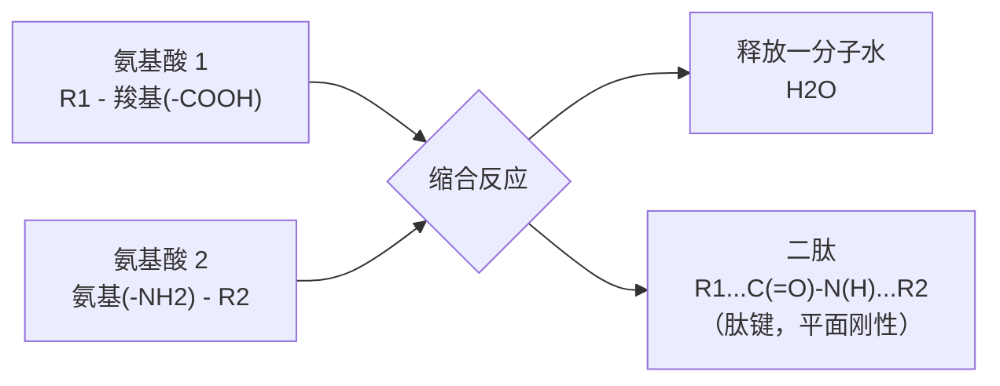
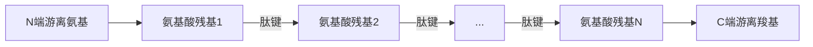
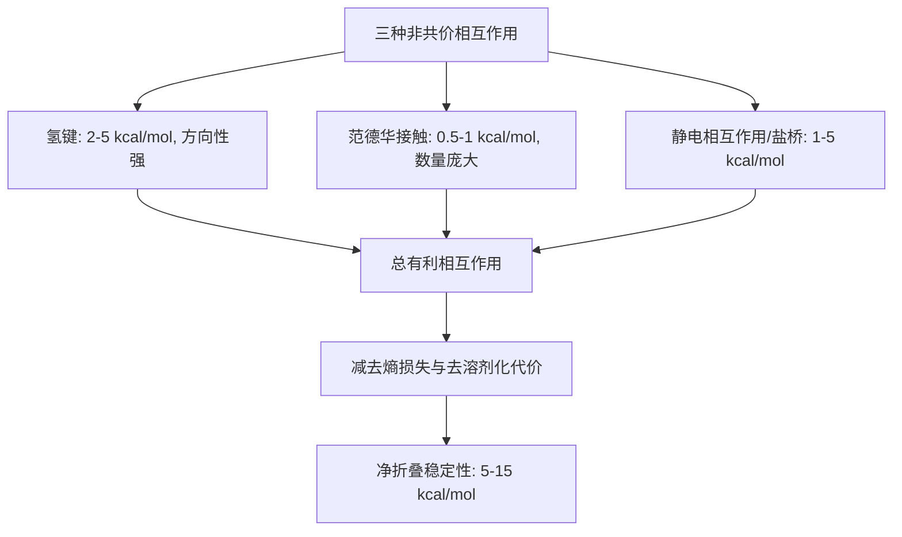
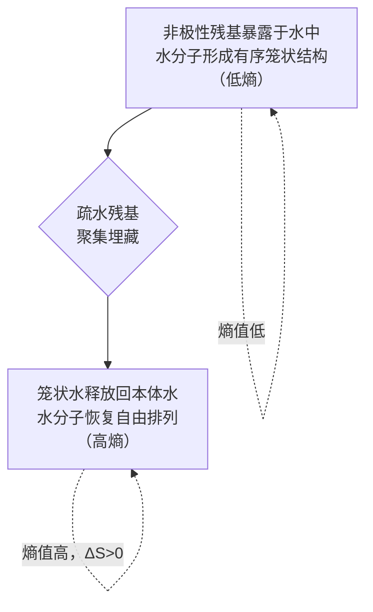
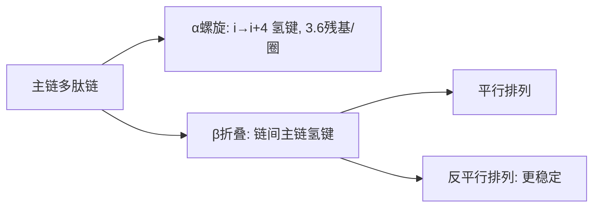
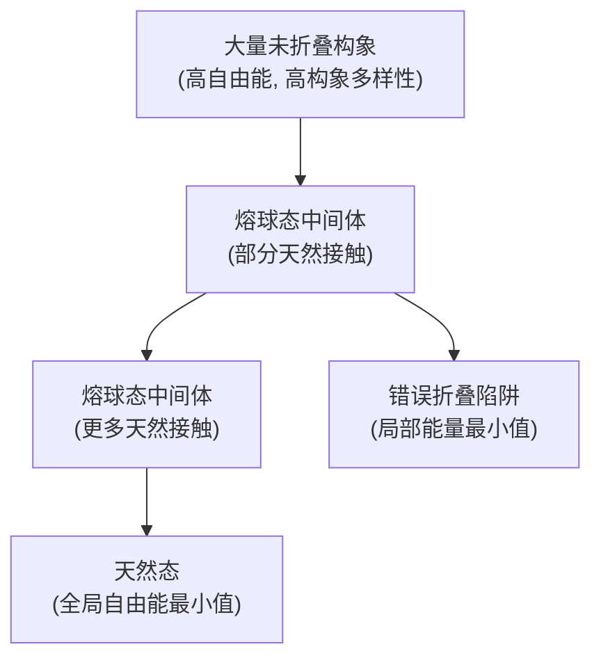
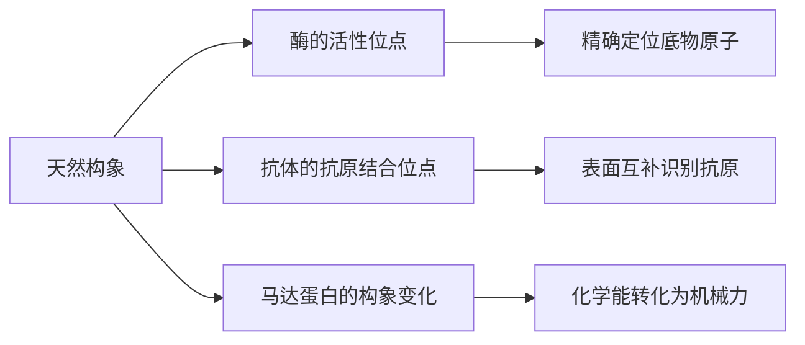

# Concept-Book Run

domain: /home/papagame/projects/digital-duck/conceptbook-app/public/domains/Digital-Duck/how_protein_folds/input/graph.yaml
target: protein_function
started: 2026-09-27T08:37:41

## Teaching order (16 concepts)

- amino_acid
- chemical_bond
- energy
- peptide_bond
- entropy
- polypeptide_chain
- noncovalent_interaction
- hydrogen_bond
- hydrophobic_effect
- primary_structure
- gibbs_free_energy
- secondary_structure
- tertiary_structure
- energy_landscape
- native_state
- protein_function

### amino_acid (23.1s)

## 氨基酸

氨基酸是蛋白质的基本组成单位（单体）。生物体内共有 20 种标准氨基酸，它们共享同一个骨架结构：一个氨基（$-\text{NH}_2$）、一个羧基（$-\text{COOH}$）连接在同一个碳原子——阿尔法碳（$\alpha$-碳）上，此外阿尔法碳上还连有一个氢原子和一个侧链（R 基团）。这个通用结构可以写成：

$$
\text{H}_2\text{N}-\underset{\displaystyle \underset{\displaystyle H}{|}}{\overset{\displaystyle R}{\overset{\displaystyle |}{\text{C}}}}-\text{COOH}
$$

20 种氨基酸的骨架完全相同，唯一的变量是 R 基团——正是这一个基团的化学性质，决定了这个氨基酸属于四种"性格"中的哪一种：非极性（疏水）、极性（亲水但不带电）、带正电、或带带负电。可以把这 20 种氨基酸看作一套 20 个字母的字母表，一条蛋白质链就是用这套字母表写成的一个"单词"，字母的排列顺序（氨基酸序列）决定了这个"单词"最终折叠成什么样的三维形状。

**举例说明**：甘氨酸（Glycine）的 R 基团只是一个氢原子，体积最小、完全非极性；丝氨酸（Serine）的 R 基团带有一个羟基（$-\text{OH}$），是极性但不带电；赖氨酸（Lysine）的 R 基团末端有一个氨基，在生理 pH 下质子化后带正电；天冬氨酸（Aspartate）的 R 基团是羧基，在生理 pH 下去质子化后带负电。同一个骨架，四种不同的化学"性格"。

**解决问题的应用**：当你拿到一条蛋白质的氨基酸序列，想预测它折叠后的三维结构时，第一步就是逐个判断每个氨基酸的 R 基团类型。折叠成球状蛋白质时，非极性（疏水）的氨基酸往往被"埋"进蛋白质内部，避开水环境；极性和带电的氨基酸则倾向于暴露在蛋白质表面，与周围的水分子相互作用。因此，仅凭序列中疏水与亲水氨基酸的分布模式，就可以初步推测蛋白质折叠后哪些区域会成为核心、哪些区域会成为表面——这是后续学习蛋白质折叠与结构预测的基础。

### chemical_bond (21.2s)

## 化学键

化学键是使两个原子结合在一起的作用力。在蛋白质中，我们需要区分两种性质截然不同的机制。第一种是共价键：原子之间共享电子对，键能约为每摩尔80至100千卡（kcal/mol），具有方向性，且在体温条件下几乎不会自发断裂。连接相邻氨基酸的肽键就是共价键，它构成了蛋白质主链的骨架，赋予其结构上的稳定性。第二种是非共价相互作用：包括氢键、范德华接触，以及带电侧链之间的静电吸引。这些作用不涉及电子共享，单个的键能很小，仅约0.5至5 kcal/mol，但正因为弱，它们才具有可逆性——分子可以在生理条件下轻易地形成或断裂这些接触。

**举例说明**：考虑一条正在折叠的多肽链。肽键把氨基酸依次连成主链，这个连接一旦形成便不会随意断裂，除非借助专门的酶（如蛋白酶）催化水解。但蛋白质要折叠成特定的三维结构，靠的却不是共价键的重新排列，而是数以百计的氢键、疏水侧链间的范德华接触，以及带正负电荷的侧链之间的静电吸引，这些非共价相互作用共同把分子"锁定"在一个特定的空间构象里。

**解决问题的应用**：蛋白质折叠的稳定性可以用热力学中的自由能变化来描述：

$$
\Delta G_{fold} = \Delta H - T\Delta S
$$

其中 $\Delta H$ 是折叠过程释放的焓（主要来自非共价相互作用的形成），$T$ 是绝对温度，$\Delta S$ 是熵变（折叠使链的构象自由度减少，熵为负）。折叠态之所以能在生理温度下稳定存在，是因为大量微弱的非共价作用累积起来，使 $\Delta G_{fold}$ 略为负值——通常净稳定能仅为5至15 kcal/mol，远小于任何一个共价键的强度。这个数值上的"脆弱平衡"解释了为什么蛋白质既能保持特定形状发挥功能，又能在温度、pH或变性剂作用下相对容易地展开——而肽键本身始终完好无损。

### energy (17.8s)

## Energy

能量是一个系统做功或释放热量的能力。在热力学的语境下，能量记账要回答一个具体问题：某个过程是放热还是吸热，放出或吸收多少？这正是焓（enthalpy，记作 $H$）所要衡量的量。由于焓的绝对值无法直接测量，我们关心的是过程前后焓的变化：

$$
\Delta H = H_{\text{生成物}} - H_{\text{反应物}}
$$

当原子或分子彼此靠近、形成新的化学键时，体系释放能量，$\Delta H < 0$，称为放热过程；当化学键被拆开、原子被迫分离时，体系需要吸收能量，$\Delta H > 0$，称为吸热过程。这个符号规则的直觉很简单：成键使体系更稳定（势能更低），断键则相反。

**举例说明**：以甲烷燃烧为例，$CH_4 + 2O_2 \rightarrow CO_2 + 2H_2O$。反应中，C–H 键和 O=O 键被打断（吸收能量），同时生成更强的 C=O 键和 O–H 键（释放能量）。由于新键释放的能量远大于旧键断裂所需的能量，整体 $\Delta H$ 为负值（约 $-890 \text{ kJ/mol}$），这也是燃烧能放出大量热的原因。

**问题解决中的应用**：给定各化学键的键能，可以用"断键耗能减去成键放能"的方式估算反应焓变：

$$
\Delta H \approx \sum(\text{断裂键的键能}) - \sum(\text{形成键的键能})
$$

这一估算法广泛用于预测未知反应是否放热，是化学与材料科学中设计反应路径、评估燃料效率的基本工具。

需要特别强调的是，$\Delta H$ 本身并不能单独决定一个过程是否会自发发生。能量降低（$\Delta H < 0$）通常有利于自发性，但体系的混乱程度——熵——同样必须纳入考量。只有把能量变化与熵变化结合起来（即通过吉布斯自由能），才能完整判断一个过程的方向性。这也是为什么焓只是能量记账的第一步，而不是全部答案。

### peptide_bond (17.9s)

## Peptide Bond

肽键是连接氨基酸、构建蛋白质链的共价键。它由一个氨基酸的羧基（-COOH）与相邻氨基酸的氨基（-NH2）经缩合反应形成：两个基团结合时释放一分子水（$H_2O$），生成一个新的碳氮键（C-N）。这个反应会不断重复，将氨基酸逐一连接成长链，也就是多肽或蛋白质的主链骨架。

肽键的特殊之处不在于它是一个普通的单键，而在于其电子结构。由于羰基氧原子的孤对电子与C-N键之间存在共振，肽键具有部分双键的性质。这意味着这个键无法像普通单键那样自由旋转——组成肽键的六个原子（$C_\alpha$、羰基碳、羰基氧、氮、氢、下一个$C_\alpha$）被固定在同一个平面内，这就是所谓的"肽平面"。可以把它想象成一节节刚性的火车车厢：车厢内部结构固定不变，但车厢与车厢之间的连接处（即$C_\alpha$两侧的键）仍然可以转动。这种刚性正是蛋白质能够折叠成特定三维结构、而不是变成完全无序链条的第一层几何约束。

**问题解决应用**：假设你要预测一段多肽链可能采取的构象数目。由于肽键平面本身不能旋转，你在建模柔性时只需考虑每个氨基酸残基两侧的两个可旋转二面角——$\phi$（连接氮与$C_\alpha$）和$\psi$（连接$C_\alpha$与羰基碳）。这大大简化了构象搜索的自由度：对于一条含$n$个残基的链，柔性自由度约为$2(n-1)$个二面角，而不是主链上所有键都可自由旋转时的数目。这也是拉马钱德兰图（Ramachandran plot）能够用二维图表来描述蛋白质主链构象的根本原因——因为肽键的刚性把问题从三维旋转简化成了两个角度的组合。

*该图展示缩合反应过程：两个氨基酸的羧基与氨基结合，释放一分子水，形成连接二者的刚性肽键。*

### entropy (29.2s)

## 熵

熵（entropy）是统计力学中衡量一个系统可及微观状态数目的物理量。系统的宏观状态可以对应大量不同的原子或分子排列方式，这些排列方式称为微观状态。玻尔兹曼给出了熵与微观状态数之间的定量关系：

$$S = k_B \ln \Omega$$

其中 $S$ 是熵，$k_B$ 是玻尔兹曼常数（约 $1.38\times10^{-23}\ \mathrm{J/K}$），$\Omega$ 是系统在给定宏观条件下可及的微观状态数目。这个公式的核心含义是：自然界并不偏爱低能量状态，而是偏爱高概率状态——也就是拥有更多可及微观状态的状态。一个系统若能以更多方式实现同一个宏观结果，它出现的概率就更大，熵也就更高。

**应用实例：蛋白质折叠的熵代价**

以一条含 300 个氨基酸残基的蛋白质链为例。莱文塔尔（Levinthal）估计，这样一条链在未折叠（伸展）状态下可能采取的构象数约为 $\Omega_u \approx 3^{300} \approx 10^{143}$。而折叠后的天然构象通常是唯一确定的，即 $\Omega_f = 1$。折叠过程中熵的变化为：

$$\Delta S = k_B \ln \Omega_f - k_B \ln \Omega_u = -300\,k_B \ln 3$$

代入数值可得每摩尔蛋白质的熵损失约为 $\Delta S \approx -2.7\times10^{3}\ \mathrm{J/(mol\cdot K)}$。在生理温度 $T \approx 310\ \mathrm{K}$ 下，这一构象熵损失对应的自由能代价为：

$$-T\Delta S \approx 8.5\times10^{5}\ \mathrm{J/mol} \approx 850\ \mathrm{kJ/mol}$$

**用熵解决问题：为什么折叠仍会自发发生**

按照吉布斯自由能判据：

$$\Delta G = \Delta H - T\Delta S$$

折叠反应要自发进行，必须满足 $\Delta G < 0$。既然熵项 $-T\Delta S$ 是一个巨大的正值（不利于折叠），折叠之所以仍能发生，是因为氢键形成、疏水塌缩、范德华力优化等相互作用释放了足够大的负焓变 $\Delta H$，其绝对值超过了熵代价。这正是"熵的代价必须由别处的能量增益来偿还"这一原则的定量体现：分析任何自组织或结合过程时，都应先计算构象熵的损失，再检验是否有相应的焓变来补偿它。

### polypeptide_chain (18.2s)

## Polypeptide Chain

**定义**

多肽链（polypeptide chain）是由 $N$ 个氨基酸通过 $N-1$ 个肽键首尾连接而成的线性聚合物。每个肽键由一个氨基酸的羧基与下一个氨基酸的氨基缩合脱水形成，这一反应具有方向性——因此整条链有明确的两端：游离氨基端（N端）和游离羧基端（C端），按照惯例，序列书写与命名都从N端开始，读到C端结束。

链的主链（backbone）由重复出现的"氮—碳—碳"单元构成，其化学组成在所有蛋白质中完全相同；真正携带信息、决定这条链最终功能与形状的，是每个氨基酸残基上伸出的侧链（side chain）——这一侧链序列被称为一级结构（primary structure）。人类蛋白质的典型长度在300到500个残基之间，理论上侧链种类数为20，因此一条长度为 $N$ 的链在序列层面的可能组合数为：

$$
20^{N}
$$

这个天文数字说明：仅靠20种氨基酸的排列组合，细胞就能编码出几乎无限多样的蛋白质身份。

**核心过程**

多肽链在核糖体上是逐个氨基酸、按照信使RNA给出的顺序合成的，这个过程本质上是严格线性、不可逆的——链一旦从N端向C端延伸完成，其一级结构就此固定。但合成完成只是第一步：这条刚刚生成的线性链并不具备功能，它必须自发折叠（fold）成特定的三维形状，才能成为有活性的蛋白质。折叠过程完全由一级结构中侧链之间的相互作用（氢键、疏水作用、离子键等）驱动，这正是"序列决定结构，结构决定功能"这一分子生物学核心原则的体现。

**问题解决应用**

设想你在实验室测得某未知蛋白质的分子量约为55,000道尔顿，若每个氨基酸残基平均分子量约为110道尔顿，试估算该蛋白质的残基数目 $N$：

$$
N \approx \frac{55000}{110} \approx 500
$$

这一估算方法在生物化学实验中常用于快速判断多肽链长度是否落在典型蛋白质的合理区间（300–500残基），从而验证纯化或测序结果的可信度。

*示意图：多肽链的方向性——合成与命名均从N端开始，沿主链延伸至C端，每个肽键连接相邻的两个氨基酸残基。*

### noncovalent_interaction (22.9s)

## Noncovalent Interaction

蛋白质折叠后的三维结构并非由共价键固定，而是依靠大量微弱的非共价相互作用共同维持。这类作用力可逆、方向性不一，单独存在时都很弱，但当成千上万个同时发生时，就能把一条松散的多肽链锁定在特定的折叠构象中。三种最重要的类型是：氢键、范德华接触、静电相互作用（盐桥）。

氢键发生在一个带部分正电的氢原子（连接在氮或氧上，即 N-H 或 O-H）与邻近的氮或氧原子之间；它具有方向性，即氢、供体原子与受体原子需要大致排列在一条直线上才能获得最大强度，单个氢键的强度约为 2–5 kcal/mol。范德华接触则来自任意两个原子之间瞬时电子云分布不均匀所产生的“瞬时偶极—诱导偶极”吸引，方向性弱，单个接触仅贡献约 0.5–1 kcal/mol，但一个折叠好的蛋白质内部可以有数千个这样的接触。静电相互作用发生在带相反电荷的侧链之间（例如带正电的赖氨酸与带负电的天冬氨酸），形成所谓的盐桥，强度约为 1–5 kcal/mol，且受周围介质极性影响较大。

**实例分析**：考虑一个中等大小的球状蛋白质，其折叠核心中可能包含约 50 个氢键、上千个范德华接触，以及若干盐桥。如果把每一种作用力的能量贡献单独相加，会得到一个远超共价键（约 80–100 kcal/mol 一个碳碳单键）的数字。但实际测得的蛋白质净折叠稳定性（即折叠态相对于展开态的自由能差）通常只有 5–15 kcal/mol。原因在于：折叠不仅带来这些有利的相互作用，同时也要付出代价——多肽链构象自由度的丧失（熵损失）、以及折叠态中某些原本可以与水分子形成氢键的基团被埋藏起来（去溶剂化能量损失）。净稳定性是“有利相互作用总和”减去“构象熵损失与去溶剂化代价”之后剩下的很小差值。

**解题应用**：这一净能量差值虽小，却解释了两个常被问到的现象。首先，为什么温和加热（约 40–60 ℃）或加入尿素、盐酸胍等化学变性剂就能使蛋白质变性——因为只需要提供 5–15 kcal/mol 量级的能量输入，就足以打破这个脆弱的净平衡，而破坏一个共价键则需要远高得多的能量。其次，在判断突变对蛋白质稳定性的影响时，应关注该突变是否显著改变了核心区域的氢键网络、范德华堆积紧密度或表面盐桥——因为蛋白质的稳定性储备本就微薄，即使去除一两个关键的非共价相互作用，也可能使净自由能差降至零甚至为负，导致蛋白质失去折叠结构。

*该图展示三种非共价相互作用如何共同贡献，并在扣除构象熵损失与去溶剂化代价后，得到蛋白质折叠的净稳定性。*

### hydrogen_bond (28.6s)

## Hydrogen Bond

**定义**：氢键是一种非共价相互作用，发生在一个与强电负性原子（氮 N 或氧 O）共价成键的氢原子（称为供体，donor）与另一个电负性原子（氮或氧，称为受体，acceptor）之间。氢原子上的部分正电荷与受体原子上未成键的孤对电子相互吸引，形成比共价键弱得多、但远强于普通范德华力的定向吸引。标准的氢键判据包括两个几何条件：供体—受体原子间距离约为 $2.7\text{–}3.3\ \text{Å}$，且供体—氢—受体三者接近共线，键角通常大于 $150°$。在蛋白质中，最关键的氢键发生在多肽骨架内部：每个氨基酸残基的骨架 N–H 基团作为供体，另一个残基的骨架 C=O 基团作为受体。由于肽键本身是刚性的平面结构（肽键的部分双键性质限制了骨架的自由旋转），骨架上哪些 N–H 与哪些 C=O 在空间中能够彼此靠近、满足上述距离与角度条件，直接决定了多肽链只能折叠成少数几种规律性的二级结构。

**实例**：在α螺旋中，每一圈螺旋包含约 3.6 个残基，几何上恰好使第 $i$ 个残基的骨架 N–H 与第 $i+4$ 个残基的骨架 C=O 相互靠近并满足氢键条件，于是螺旋中几乎每一个骨架 N–H 和 C=O 都参与了氢键，方向平行于螺旋轴，从而将螺旋牢牢"缝合"起来。在β折叠中，情况不同：氢键发生在相邻的两条肽链之间（而不是同一条链内部相邻残基之间），根据两条链走向相同还是相反，分别形成平行或反平行折叠，氢键的排列方式也随之改变。

**问题解决应用**：给定一段肽链的骨架坐标，可以通过计算每一对 N–H 与 C=O 原子之间的距离和键角，逐一检验是否满足氢键判据，从而重建出该肽段的二级结构类型——这正是计算生物学中二级结构指认算法（如 DSSP）的基本原理。反过来，也可以用氢键几何来解释某些残基为何破坏螺旋：脯氨酸的氮原子被锁定在环状侧链中，缺少可供氢键的 N–H 供体，因此插入螺旋中会中断氢键网络，造成螺旋扭结或终止。

### hydrophobic_effect (17.4s)

## Hydrophobic Effect（疏水效应）

**定义**：疏水效应是驱动蛋白质折叠的最主要作用力，其反直觉之处在于——它的本质不是"吸引力"，而是"熵增"。当一个非极性（疏水性）氨基酸残基暴露在水中时，周围的水分子无法与它形成氢键，于是这些水分子被迫重新排列，围绕该残基形成一层高度有序、低熵的"笼状结构"（clathrate cage）。这种有序化在热力学上是不利的，因为它降低了水的熵。当多个疏水残基聚集埋藏到蛋白质内部时，这些笼状水结构被释放回本体水（bulk water），水分子重新获得自由排列的可能性，体系的总熵大幅增加。根据热力学第二定律，体系会自发朝着熵增大、吉布斯自由能降低的方向演化，这正是疏水残基聚集埋藏、驱动蛋白质折叠的根本原因。

**类比理解**：油和水分离，并不是因为油分子之间相互吸引，而是因为水"更愿意"恢复自由排列的状态。混合体系被拆分后，水分子的熵增益超过了油滴表面积减小带来的熵损失，总熵仍然增大——这就是疏水效应在宏观世界的直观体现。

**问题解决应用**：在预测蛋白质结构时，研究者利用疏水效应作为核心经验规则——通过计算每个氨基酸残基的疏水性指数（如Kyte-Doolittle量表），可以预测哪些残基倾向于埋藏在蛋白质核心、哪些倾向于暴露在表面与水接触。这一原理也被应用于药物设计：调整小分子药物的疏水/亲水基团分布，可以优化其与蛋白质疏水口袋的结合能力，从而提高药效与选择性。

*该图展示疏水残基从暴露于水（水分子被迫形成低熵笼状结构）到聚集埋藏于蛋白质内部（笼状水释放，体系熵大幅增加）的转变过程，体现熵增是疏水效应驱动蛋白质折叠的根本机制。*

### primary_structure (25.7s)

## Primary Structure（一级结构）

**定义**

一级结构指多肽链中氨基酸残基的完整线性排列顺序，书写方向由N端（氨基端）到C端（羧基端）。这一序列并非任意排列，而是由基因通过遗传密码直接编码：DNA上每三个核苷酸构成一个密码子，对应一种氨基酸，mRNA经核糖体翻译后逐一将氨基酸缝合成肽链。因此，一级结构本质上是遗传信息在蛋白质层面的直接体现——基因序列的每一个改变，都可能在氨基酸序列上留下痕迹。

一级结构的重要性远不止于"记录顺序"。安芬森（Anfinsen）于1972年因"热力学假说"获诺贝尔奖，该假说指出：天然构象（native state）是该序列在给定环境下所能达到的全局自由能最小状态。换言之，氨基酸序列本身就已经编码了蛋白质折叠所需的全部信息——序列决定结构，结构决定功能。

**实例分析：镰刀型细胞贫血症**

血红蛋白β链的第6位残基正常为谷氨酸（glutamate，带负电、亲水），但在镰刀型细胞贫血症患者中，该位点被缬氨酸（valine，中性、疏水）取代。仅一个残基之差，却在血红蛋白分子表面引入一个疏水补丁；在脱氧状态下，这一疏水区域促使血红蛋白分子相互聚合，形成僵硬的纤维状聚合体，使红细胞扭曲成镰刀形，进而引发血管阻塞与慢性溶血性贫血。

**问题解决式应用：预测替换的后果**

面对任意一个氨基酸替换，可以按以下思路推断其影响：

1. **化学性质是否改变**——极性、电荷、体积是否发生显著变化？
2. **位置是否关键**——该残基是否位于疏水核心、活性位点，或仅暴露于分子表面的柔性区域？
3. **保守性检验**——比对同源蛋白，若该位点在进化中高度保守，替换的破坏性通常更大。

依此框架可初步判断：谷氨酸→缬氨酸的替换同时满足"化学性质剧变"（电荷消失、疏水性增强）与"位置关键"（表面暴露且参与聚合界面）两项高风险标准，这正是其致病性极强的分子基础。这套推理方法也是蛋白质工程与药物设计中评估突变效应的基本出发点。

### gibbs_free_energy (16.8s)

## Gibbs Free Energy

**定义**

吉布斯自由能（记作 $G$）是在恒定温度和压强下，判断一个过程能否自发进行的唯一判据。它的定义式为

$$
G = H - TS
$$

其中 $H$ 是焓（体系储存和释放热量的能力），$T$ 是绝对温度（单位开尔文），$S$ 是熵（体系混乱度或构象自由度的度量）。真正决定自发性的不是 $G$ 本身的绝对值，而是过程前后的变化量 $\Delta G$：

$$
\Delta G = \Delta H - T\Delta S
$$

判据很简单：当 $\Delta G < 0$ 时，过程在该温度、压强下是自发的；$\Delta G > 0$ 时不自发；$\Delta G = 0$ 时体系处于平衡。这个式子的物理意义是一种"竞争"——焓变 $\Delta H$ 反映体系是否倾向于释放能量（负值有利），熵变 $\Delta S$ 反映体系是否倾向于变得更混乱（正值有利，因为 $-T\Delta S$ 项为负）。两者的净效果决定了过程的方向。

**举例：蛋白质折叠**

蛋白质折叠是一个理解 $\Delta G$ 竞争关系的经典例子。折叠过程中：

- $\Delta H < 0$：氨基酸侧链紧密堆积、形成氢键和范德华相互作用，释放热量，这一项有利于折叠。
- $\Delta S < 0$：肽链从松散的伸展态变为紧凑的折叠态,构象自由度大幅减少，这一项不利于折叠（因为 $-T\Delta S$ 变为正值，抵消部分有利因素）。

折叠之所以能自发进行，是因为 $|\Delta H|$ 略微超过 $T|\Delta S|$，两者相减后 $\Delta G$ 仍为负值，净稳定性通常只有约 5–15 kcal/mol——这只相当于几个氢键的强度总和。

**解决问题：为什么蛋白质容易变性**

这个"净稳定性很小"的事实直接解释了一个重要现象：蛋白质为何对温度和化学环境的微小变化如此敏感。因为折叠态与去折叠态之间的自由能差本来就很窄，只需适度升高温度（增大 $T\Delta S$ 项的权重）、改变 pH、或加入变性剂（削弱稳定折叠的相互作用、改变 $\Delta H$），就足以使 $\Delta G$ 由负转正，导致蛋白质变性、失去功能。这也是为什么细胞需要精细调控温度和离子环境——生命依赖的稳定性,建立在一个非常窄小的能量安全边际之上。

### secondary_structure (19.4s)

## Secondary Structure

蛋白质的二级结构是多肽链在局部区域内,依靠主链原子之间有规律的氢键作用形成的重复折叠模式,这种折叠只取决于主链的几何排列,与侧链的化学性质无关。二级结构单元是折叠过程中最先形成的构件,随后被三级结构进一步组装成完整的三维形态。

最主要的两种二级结构是$\alpha$螺旋和$\beta$折叠。$\alpha$螺旋是多肽链绕成的右手螺旋,每圈包含3.6个氨基酸残基,螺旋直径约1.2 nm。其稳定性来自于主链氢键:每个残基的N-H基团与其前面第4个残基(即$i \to i+4$)的C=O基团形成氢键,所有侧链都指向螺旋外侧,不参与氢键网络。$\beta$折叠则是由若干条几乎伸展的主链(称为$\beta$链)并排排列而成,链间通过主链氢键连接;相邻链的方向可以相同(平行式)或相反(反平行式),其中反平行排列因氢键角度更接近线性而更加稳定。$\beta$折叠常构成蛋白质的结构核心,也是淀粉样纤维的主要成分。

**计算实例**:若已知每个残基沿螺旋轴方向的上升高度(称为螺距增量)为0.15 nm,一段$\alpha$螺旋含有36个残基,则该螺旋沿轴向的总长度为:

$$
L = n \times d = 36 \times 0.15\ \text{nm} = 5.4\ \text{nm}
$$

其中$n$为残基数,$d$为每残基上升高度。同时,螺旋圈数可由每圈3.6个残基推算:

$$
\text{圈数} = \frac{n}{3.6} = \frac{36}{3.6} = 10\ \text{圈}
$$

**解决问题的应用**:在分析未知蛋白质的圆二色谱(CD)数据或X射线衍射图谱时,若测得某片段沿轴向延伸5.4 nm且氢键模式符合$i \to i+4$规律,即可反推该片段含有约36个残基、形成10圈完整螺旋——这正是结构生物学家用二级结构参数定量还原分子几何形状的基本方法。

*该图展示由主链氢键驱动形成的两种主要二级结构类型及其排列方式。*

### tertiary_structure (19.5s)

## Tertiary Structure

三级结构指单条多肽链在二级结构元件（$\alpha$ 螺旋、$\beta$ 折叠、无规卷曲）的基础上进一步折叠、堆积所形成的完整三维空间构象。它不再是局部氢键网络的重复图案，而是整条链的螺旋与折叠片段相互靠拢、包装成一个具有特定拓扑关系的紧密球状体。驱动这一过程的核心物理原理是疏水效应：非极性残基的侧链倾向于避开水，聚集到蛋白质内部形成疏水核心，而带电荷和极性的残基则留在表面与水分子形成氢键。这个过程之所以能自发进行，是因为折叠态相对于伸展态具有更低的吉布斯自由能——当疏水残基被埋藏、有序氢键网络形成时，体系的自由能下降，折叠因此是热力学有利的。稳定这一构象的化学基础是大量非共价相互作用的总和：氢键、范德华力、静电相互作用（包括盐桥），在分泌型蛋白中还常有半胱氨酸之间形成的二硫键这一共价交联作为额外锁定。

**举例说明**：以肌红蛋白为例，它几乎全部由 $\alpha$ 螺旋构成，这些螺旋段像折叠的绳索一样彼此靠拢、扭转，包裹出一个口袋状的疏水腔，血红素辅基正是嵌入其中被牢牢固定，同时腔外表面的极性残基使整个分子能溶于细胞质中的水环境。

**解决问题的应用**：面对一个未知蛋白质的三级结构预测或验证问题，可以按以下逻辑分析：先确定序列中哪些位点是二级结构预测算法标注的螺旋或折叠区段；再检查折叠后模型中这些区段是否把非极性残基聚集到内部、极性残基暴露在外——这是验证模型合理性最直接的判据；最后核查半胱氨酸残基的空间距离，判断是否可能形成二硫键。X 射线晶体学、冷冻电镜和核磁共振正是通过测定原子级的空间坐标，把这种独特拓扑关系直接可视化，这也是教科书和蛋白质数据库中蛋白质图像的来源。

### energy_landscape (21.0s)

## Energy Landscape

**定义。** 能量地形（energy landscape）是一个概念性的数学曲面,它把多肽链的每一种可能构象映射到对应的吉布斯自由能。对于一条300个残基的多肽链,理论上的构象数约为$10^{143}$,因此这个曲面存在于一个天文数字维度的空间中——每一个自由度(每个二面角的可能取值)都构成一个维度。Bryngelson、Onuchic和Wolynes在1980年代至1990年代提出的关键洞见是:这个地形并非杂乱无章,而是呈现出漏斗形状(folding funnel)。绝大多数构象——那些未折叠、天然接触很少的构象——分布在漏斗顶部,自由能较高;随着多肽链形成越来越多的天然接触,自由能持续下降,曲面不断收窄,最终汇聚到漏斗底部一个自由能全局最小值,对应唯一的天然态。

**解决莱文塔尔悖论。** 如果蛋白质要在$10^{143}$种构象中逐一随机尝试,即使每次尝试只需$10^{-13}$秒,所需时间也会远超宇宙年龄——这就是莱文塔尔悖论。漏斗形能量地形给出了答案:折叠并非随机搜索,而是沿着自由能梯度下降的过程,如同水流沿地势自然汇入谷底。实验测得一条在1毫秒内折叠完成的蛋白质,实际只需经历约$10^{10}$种构象——远少于$10^{143}$,因为它并非探索整个空间,而是被地形的坡度持续引导向天然态。

**解题应用:识别陷阱态。** 理想的漏斗应平滑收窄,但真实地形上常存在局部自由能最小值——对应错误折叠(misfolded)状态或聚集中间体。这些"陷阱"构象虽不是全局最优,但被局部能量壁垒困住,难以继续下降。在实际问题中,判断某个错误折叠是否为热力学陷阱,可以比较其自由能与天然态及展开态的相对高低:若某中间体的自由能低于展开态但显著高于天然态,并被一个能量壁垒(activation barrier)分隔,该中间体就是漏斗侧壁上的一个局部极小值,分子伴侣（chaperone）等细胞机制的作用正是帮助蛋白质越过这类壁垒,重新进入通往天然态的通路。

*漏斗形能量地形示意图:纵轴为自由能,横轴（宽度）代表构象多样性。多数构象位于漏斗顶部（高自由能、高多样性),折叠过程沿地形下降并收窄,最终汇聚到底部唯一的天然态；侧壁的凹陷代表错误折叠陷阱。*

### native_state (22.6s)

## Native State

**定义**

天然状态是指一条多肽链在生理条件下（特定的温度、pH、离子强度和分子拥挤环境）自发折叠所采取的唯一、稳定且具有生物学功能的三维构象。之所以称为"天然"，是因为这正是该蛋白质在细胞内实际存在的形式。从能量的角度看，天然状态对应着该氨基酸序列所能形成的能量图景（energy landscape）中吉布斯自由能的全局最小值：

$$
G_{\text{native}} = \min_{\text{所有可及构象}} G(\text{构象})
$$

其中自由能由焓与熵两部分决定，$G = H - TS$。折叠过程之所以能可靠地收敛到这一个构象，是因为漏斗形的能量图景引导链从大量高能、高熵的无序构象，逐步下降到这个深且窄的能量陷阱。天然状态的核心意义在于"结构即功能"：酶活性位点的精确曲率、抗体抗原结合环的互补表面、膜转运蛋白的疏水通道，都只有在天然构象下才能正确工作；一旦蛋白质无法到达天然状态，它几乎必然丧失功能。

**实例分析**

安芬森（Christian Anfinsen）用核糖核酸酶 A 完成的经典实验证实了这一点：用尿素和还原剂使其完全变性、失去活性；一旦去除变性剂，蛋白质在无任何外部模板或酶辅助的情况下，自发重新折叠，并恢复全部催化活性。这说明天然状态完全由氨基酸序列决定——它是序列在给定环境下热力学上最稳定的构象，而不依赖折叠的具体路径。这一发现被称为安芬森的热力学假说，是理解蛋白质结构预测（如 AlphaFold）为何可行的理论基础。

**问题解决中的应用**

理解天然状态是自由能最小值这一点，能帮助解释疾病机制与药物设计。例如，某些致病突变并不改变蛋白质的化学功能，而是通过改变能量图景，抬高天然状态相对于错误折叠构象的稳定性差 $\Delta\Delta G$，使蛋白质更容易偏离天然构象、发生聚集（如朊病毒病、阿尔茨海默病中的淀粉样斑块）。工程师和药物化学家可以通过定点突变或小分子稳定剂，人为地重新加深天然状态这一能量陷阱，从而恢复或增强蛋白质的功能稳定性。

### protein_function (19.2s)

## Protein Function

蛋白质功能是指一个蛋白质所执行的具体生物学活性，这种活性完全来自于其天然构象的三维几何形状。换句话说，形状即功能——蛋白质不是通过化学组成本身发挥作用，而是通过其折叠后表面和内部口袋的精确几何排布，与其他分子（底物、抗原、配体、其他蛋白亚基）发生特异性相互作用。

**举例说明**

酶是最典型的例子。酶的活性位点以埃（$1\ \text{Å} = 10^{-10}\ \text{m}$）级精度将底物分子的原子固定在特定方向上，使化学键断裂或形成的过渡态能被稳定。哪怕活性位点上一个侧链的朝向发生轻微偏移，催化能力也可能完全丧失——这说明催化效率对几何精度的敏感程度极高。

抗体分子的功能同样源于形状匹配。抗体的抗原结合位点由若干高变环组成，这些环折叠出与特定抗原表面互补的凹凸形状，结合的亲和力由几何契合程度决定，而非仅由化学吸引力决定。

血红蛋白展示了形状变化如何实现协同调控：四个亚基相互作用，一个亚基结合氧气后会引起构象改变，进而提高其余亚基对氧气的亲和力。这种别构效应使血红蛋白能够在组织中浓度相差约100倍的范围内，仍然高效地摄取和释放氧气。

马达蛋白（如肌球蛋白、驱动蛋白）则展示了形状变化与能量转换的结合：ATP水解释放的化学能驱动蛋白质发生一系列受精确控制的构象改变，这些微小的机械运动被放大为沿细胞骨架轨道的定向移动。

**问题解决应用**

在实际研究和药物设计中，理解“形状即功能”这一原理意味着：如果想抑制某种酶的活性，最有效的策略往往不是改变其化学环境，而是设计一个能占据其活性位点、模拟底物几何形状的小分子（竞争性抑制剂）。同样，理解抗体—抗原识别的几何本质，是设计疫苗和单克隆抗体药物的基础。当研究者观察到某个突变导致蛋白质丧失功能时，第一个要问的问题就是：这个突变是否改变了活性位点或结合界面的局部几何结构？

*该图展示蛋白质天然构象如何分支衍生出三类功能应用：酶催化、抗体识别与马达蛋白运动。*

## Run complete

total: 379.2s
