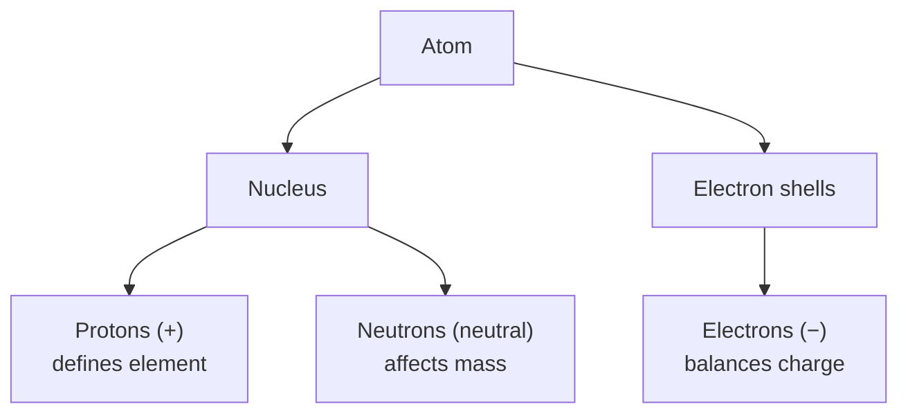
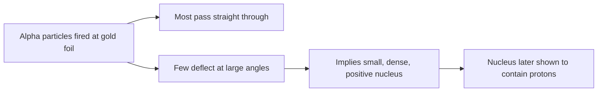

# Concept-Book Run

domain: /home/papagame/projects/digital-duck/cb-chemistry/public/domains/chemistry_ch02/input/graph.yaml
target: mass_spectrometry
started: 2026-09-27T17:33:10

## Teaching order (16 concepts)

- element
- matter
- daltons_atomic_theory
- atom
- electric_charge
- neutron
- proton
- nucleus
- atomic_number
- mass
- atomic_mass_unit
- electron
- isotope
- average_atomic_mass
- ion
- mass_spectrometry

### element (12.3s)

## Element

An element is a pure substance made of only one type of atom — meaning every atom in a sample has the same number of protons (its atomic number). Because chemical reactions only rearrange bonds between atoms, not the atoms' internal structure, elements cannot be decomposed into anything simpler by chemical means. This distinguishes elements from compounds (like water, $\text{H}_2\text{O}$), which can be broken into simpler substances (hydrogen and oxygen) through chemical reactions such as electrolysis. There are 118 known elements, organized in the periodic table by atomic number, but only about 25 of these are essential to life — with carbon, hydrogen, oxygen, and nitrogen making up roughly 96% of the mass of most living organisms.

**Worked example:** Suppose you're given a sample of table salt (sodium chloride, NaCl) and a sample of pure copper wire. Which one is an element? Copper is an element — every atom in the wire has 29 protons, and no chemical process can turn copper into a simpler substance. Sodium chloride, by contrast, is a compound: it can be split by electrolysis into sodium metal and chlorine gas, two entirely different substances with different properties from salt itself. This is the practical test for identifying an element: ask whether a chemical reaction (not just a physical process like melting or dissolving) can decompose the substance further. If yes, it's a compound or mixture; if no, it's an element.

**Problem-solving application:** Biologists and chemists use this concept to trace where atoms go during metabolic and environmental processes, since elements are never created or destroyed in chemical reactions — only rearranged (a principle known as conservation of mass). For example, when glucose ($\text{C}_6\text{H}_{12}\text{O}_6$) is broken down during cellular respiration, the carbon, hydrogen, and oxygen atoms aren't destroyed — they're reorganized into carbon dioxide and water. A student analyzing this reaction can verify it's balanced by counting atoms of each element on both sides: 6 carbons, 12 hydrogens, and 18 oxygens must appear on both the reactant and product side. This atom-counting skill, rooted in the definition of an element as an indivisible chemical unit, underlies balancing any chemical equation, from photosynthesis to industrial synthesis.

### matter (147.6s)

## Matter

Matter is anything that has mass and occupies space. Every object you can touch, weigh, or measure — air, water, rock, your own body — qualifies as matter. According to atomic theory, all matter is composed of atoms: extremely small particles that combine in fixed, whole-number ratios to form the elements and compounds we observe. This idea, formalized by John Dalton in the early 1800s, explains why matter has consistent, measurable properties (mass, density, volume) and why a given compound always forms from the same elements in the same fixed proportions, rather than in arbitrary amounts.

Worked example: Water is made of hydrogen and oxygen atoms combined in a fixed ratio — two hydrogen atoms for every one oxygen atom. Because an oxygen atom is about sixteen times heavier than a hydrogen atom, this atomic ratio translates into a fixed mass ratio: for every 1 gram of hydrogen, exactly 8 grams of oxygen combine to form 9 grams of water. Starting with 2 grams of hydrogen, you would need exactly 16 grams of oxygen — never 15 or 20 — to use it up completely, producing 18 grams of water. This fixed proportion is a direct consequence of atomic theory: since atoms combine in whole-number ratios, the masses of the elements in any compound must always combine in that same ratio, batch after batch.

Problem-solving application: This fixed-ratio idea lets you solve for unknown quantities in a chemical process without measuring them directly. Suppose 10 grams of hydrogen reacts completely with oxygen to form 90 grams of water. Using the same 1:8 mass ratio established above, the oxygen consumed must have been 10 × 8 = 80 grams — and indeed, 10 g hydrogen + 80 g oxygen = 90 g water, matching the total given. Notice that no matter is lost or gained in the process; the atoms present in the hydrogen and oxygen simply rearrange into water. Recognizing matter as made of countable atoms that combine in fixed ratios — rather than a vague "stuff" — is what makes this kind of quantitative reasoning possible, and it is the foundation for solving mass-balance problems throughout chemistry.

### daltons_atomic_theory (39.4s)

## Dalton's Atomic Theory

In 1808, John Dalton proposed the first modern atomic theory to explain a pattern chemists had already observed: elements always combine in the same fixed proportions by mass. Dalton's theory rests on four postulates. First, all matter consists of tiny, indivisible particles called atoms — this is the theory's central idea. Second, all atoms of a given element are identical in mass and properties, while atoms of different elements differ. Third, compounds form when atoms of different elements combine in simple, fixed whole-number ratios. Fourth, atoms are neither created nor destroyed in chemical reactions — they are only rearranged. This last postulate explains why the total mass before and after a reaction stays the same: if a reaction simply reshuffles atoms rather than creating or destroying them, no mass can appear or vanish.

Consider water and hydrogen peroxide as a worked example. Water is H$_2$O, with a hydrogen-to-oxygen mass ratio of about 1:8. Hydrogen peroxide is H$_2$O$_2$, with a ratio of about 1:16 — exactly double. Both compounds are built from the same two kinds of atoms, combined in different fixed whole-number ratios (2:1 versus 2:2, which simplifies to 1:1). That the ratios differ by a clean whole-number factor, rather than varying continuously, only makes sense if matter is made of discrete, countable atoms rather than some infinitely divisible substance.

For problem-solving, Dalton's postulates are the reasoning tool behind mass calculations in chemical reactions. If 10 g of hydrogen reacts completely with 80 g of oxygen to form water, the conservation postulate guarantees the product has a mass of exactly 90 g — no more, no less — because every atom that entered the reaction must appear in the products, just rearranged into a new compound. This same reasoning lets you predict exact quantities of reactants and products in any reaction, not just qualitative outcomes: count the atoms on each side, and the masses must balance.

Modern science has added detail to Dalton's model — atoms turn out to have internal structure, and not every atom of a given element is perfectly identical in mass. Yet the core insight, that chemical reactions are the rearrangement of conserved, discrete units, remains the foundation of quantitative chemistry.

### atom (55.7s)

## Atom

An atom is the smallest unit of an element that retains the chemical identity of that element — the basic building block described in Dalton's atomic theory (1803), which proposed that matter is made of indivisible atoms unique to each element. Modern atomic theory refines "indivisible": every atom is built from three subatomic particles. Protons (positive charge, ~1 atomic mass unit) and neutrons (no charge, ~1 amu) occupy a dense central nucleus, while electrons (negative charge, negligible mass) surround the nucleus in energy levels, or shells. The number of protons, called the atomic number, is what defines the element — every atom with 6 protons is carbon, no matter what else changes about it.

**Worked example.** Consider carbon-12, the standard reference isotope used to define the atomic mass unit. Its atomic number is 6, so it has 6 protons. Its mass number — the total count of protons plus neutrons — is 12, so it has 6 neutrons. A neutral atom always carries an equal number of electrons and protons, so carbon-12 also has 6 electrons balancing the nuclear charge. Note that the proton count alone tells you the element; the neutron count only affects the atom's mass, not its chemical behavior.

**Problem-solving application.** Most atomic-structure problems ask you to reconstruct particle counts from two numbers: the atomic number and the mass number. Given an atom with atomic number 17 and mass number 35: protons = 17 (read directly from the atomic number), neutrons = 35 − 17 = 18 (mass number minus proton count), and electrons = 17, since a neutral atom balances proton and electron counts exactly. This three-step bookkeeping — protons from atomic number, neutrons by subtraction, electrons by charge balance — applies to any atom on the periodic table and is the foundation for everything that follows in later sections: how atoms of the same element can differ in mass, how they can gain or lose charge, and how their electron arrangements drive chemical bonding.

*A schematic breakdown of atomic structure: the nucleus holds protons and neutrons, while electrons occupy surrounding shells.*

### electric_charge (36.6s)

## Electric Charge

Electric charge is a fundamental property of matter that comes in two types, positive and negative, and determines how particles interact through electromagnetic forces. Protons carry a positive charge, electrons carry a negative charge, and neutrons carry no charge. Charge is quantized, meaning it always occurs in whole-number multiples of the elementary charge, $e = 1.602 \times 10^{-19}\ \text{C}$, and it is conserved in every physical process — the total charge before an interaction equals the total charge after it. The rule governing interactions is simple: like charges repel, and opposite charges attract. This single rule underlies chemical bonding, the structure of atoms, and the behavior of circuits.

**Worked example:** Consider a neutral sodium atom (11 protons, 11 electrons) that loses one electron to become $\text{Na}^+$. The atom now has 11 protons (+11) and 10 electrons (–10), giving a net charge of $+1e$, or $+1.602 \times 10^{-19}\ \text{C}$. This is exactly what happens when sodium reacts with chlorine: sodium's outer electron transfers to chlorine, producing $\text{Na}^+$ and $\text{Cl}^-$ ions. Because the two ions carry opposite charges, they attract one another electrostatically, and this attraction is the ionic bond holding table salt together — the closer and more oppositely charged two ions are, the stronger that bond.

**Problem-solving application:** Suppose a biology student needs to determine the net charge on a protein at a given pH. Amino acid side chains can gain or lose a hydrogen ion ($\text{H}^+$) depending on the surrounding pH — for example, an aspartate side chain tends to lose its extra proton in more basic conditions, becoming negatively charged, while a lysine side chain tends to hold onto an extra proton in more acidic conditions, staying positively charged. Each ionizable group on the protein therefore contributes either a $+1$, a $-1$, or a $0$ to the total, and summing these contributions gives the protein's overall net charge at that pH — a direct application of the same charge-counting logic used for the sodium ion above. This calculation matters directly: it predicts how the protein will behave in techniques like gel electrophoresis or ion-exchange chromatography, where molecules separate based on their net charge and its interaction with an applied electric field.

### neutron (28.3s)

## Neutron

The neutron is a subatomic particle found in the nucleus of every atom (except ordinary hydrogen-1). It carries no electric charge and has a mass of about $1.675 \times 10^{-27}\ \text{kg}$, roughly $1.001$ times the mass of a proton — close enough that the two are often treated as equal in mass for calculation purposes. Because neutrons have mass but no charge, they contribute to an atom's overall mass without affecting its charge or its chemical behavior, which is determined by the number of protons and electrons.

Neutrons were discovered in 1932 by British physicist James Chadwick. Before his work, scientists knew that the nuclear mass of most atoms was larger than could be explained by protons alone, but a charged particle of that extra mass would have altered the atom's charge — which it didn't. Chadwick resolved this by bombarding beryllium with alpha particles and detecting a highly penetrating, electrically neutral radiation that could knock protons out of paraffin wax. Since the emitted radiation carried no charge yet had mass close to a proton's, Chadwick correctly identified it as a new particle: the neutron.

**Worked example.** Consider carbon-12 ($^{12}\text{C}$), the standard reference isotope for atomic mass. Its mass number (protons + neutrons) is 12, and its atomic number (protons) is 6. The number of neutrons is found by subtraction:
$$
\text{neutrons} = \text{mass number} - \text{atomic number} = 12 - 6 = 6
$$
So $^{12}\text{C}$ has 6 protons and 6 neutrons.

**Problem-solving application.** This same subtraction is how chemists distinguish **isotopes** — atoms of the same element that carry different numbers of neutrons in the nucleus. Carbon-14 ($^{14}\text{C}$) has the same 6 protons as $^{12}\text{C}$ (so it is still carbon), but $14 - 6 = 8$ neutrons instead of 6. That difference in neutron count is the only thing distinguishing the two, and it is enough to change the nucleus's stability — a detail exploited in techniques like radiocarbon dating. Whenever you're given an isotope's mass number and its element (which fixes the proton count), you can solve for the unknown neutron count using this same relationship, making it a standard first step in any nuclear chemistry problem.

### proton (11.8s)

## Proton

A proton is a positively charged subatomic particle located in the atomic nucleus, with a mass of approximately 1 atomic mass unit (amu), or about $1.673 \times 10^{-27}$ kg. Its charge, $+1$ elementary charge ($+1.602 \times 10^{-19}$ C), exactly balances the negative charge of an electron, which is why atoms with equal numbers of protons and electrons are electrically neutral. The number of protons in an atom's nucleus — its atomic number — defines which element the atom is; changing the proton count changes the element itself, whereas changing the neutron count merely produces a different isotope.

Protons were identified by Ernest Rutherford through his analysis of the 1909 gold foil experiment. When alpha particles were fired at thin gold foil, most passed straight through, but a small fraction deflected sharply or bounced back. This pattern revealed that atoms contain a small, dense, positively charged core — the nucleus — rather than the diffuse "plum pudding" structure previously proposed by J.J. Thomson. Rutherford later identified the hydrogen nucleus, the simplest possible nucleus, as a fundamental positive particle, which he named the proton.

**Problem-solving application:** Atomic number and mass number together let you determine nuclear composition. For an atom with atomic number $Z$ and mass number $A$, the number of protons equals $Z$, and the number of neutrons equals $A - Z$. For example, carbon-14 has $Z = 6$ and $A = 14$, so it contains 6 protons and $14 - 6 = 8$ neutrons. Because atomic number is fixed for a given element, students can use this relationship to identify isotopes, predict nuclear stability, and balance nuclear equations — skills essential in both chemistry and nuclear physics contexts.

*Rutherford's gold foil experiment: unexpected deflections revealed a concentrated positive nucleus, leading to the discovery of the proton.*

### nucleus (50.1s)

## Nucleus

The nucleus is the small, dense core of an atom, located at its center and composed of two types of subatomic particles: protons, which carry a positive electric charge, and neutrons, which carry no charge. Although the nucleus accounts for more than 99.9% of an atom's mass, it occupies only about 1/10,000th of the atom's total volume — most of the atom is empty space occupied by the much lighter, negatively charged electrons that orbit far outside the nucleus. Every atom of a given element has the same number of protons in its nucleus (for example, every carbon nucleus has exactly 6 protons), while the number of neutrons can vary somewhat between atoms of the same element.

**Worked example.** Consider carbon, the element used in radiocarbon dating. A typical carbon nucleus has 6 protons and 6 neutrons, for 12 particles total. A rarer, heavier form of carbon has the same 6 protons but 8 neutrons instead of 6, for 14 particles total. In both cases, the protons and neutrons are held together tightly inside this tiny nucleus despite the fact that protons, all carrying the same positive charge, should repel one another; a powerful short-range attractive force between nuclear particles overcomes this repulsion at the extremely small distances inside the nucleus.

**Problem-solving application.** Nuclear composition determines whether an atom is stable or unstable. The ordinary carbon nucleus (6 protons, 6 neutrons) is stable and persists indefinitely, while the heavier carbon nucleus (6 protons, 8 neutrons) has an unbalanced ratio of neutrons to protons and is unstable: over time it spontaneously converts one of its neutrons into a proton, releasing energy in the process. Because this conversion happens at a fixed, measurable rate, scientists can use it as a natural clock. When a plant or animal dies, it stops taking in new carbon, and the unstable form gradually disappears from its remains while the stable form does not; by comparing how much of the unstable form is left, researchers estimate how long ago the organism died. This same logic — using the fixed composition and behavior of a nucleus to infer age, identity, or behavior of matter — underlies techniques ranging from archaeological dating to nuclear medicine.

<figure class="cb-figure">
  
  <figcaption>A simplified model of an atom, showing the dense central nucleus (protons and neutrons) surrounded by orbiting electrons. Source: <a href="https://commons.wikimedia.org/wiki/File:Stylised_Lithium_Atom.svg">Wikimedia Commons</a>, Public Domain.</figcaption>
</figure>

### atomic_number (11.9s)

## Atomic Number

Every atom of every element carries a fixed number of protons packed into its nucleus, and that number — the **atomic number**, symbol $Z$ — is the atom's identity card. Change the proton count and you don't get a variant of the same element; you get a different element entirely. Hydrogen ($Z=1$) has one proton, helium ($Z=2$) has two, carbon ($Z=6$) has six, and so on through the periodic table, where elements are arranged in order of increasing $Z$. Neutrons can vary (giving isotopes), and electrons can be gained or lost (giving ions), but the proton count in a neutral or ionized atom of a given element never changes. This is why the periodic table is organized by atomic number rather than atomic mass: $Z$ is the unambiguous, invariant label.

**Worked example.** An atom has 17 protons in its nucleus. What element is it, and what is its atomic number? Since the proton count defines the element, $Z = 17$ points directly to chlorine (Cl) on the periodic table — no other information is needed. If this atom also has 18 neutrons, its mass number ($A$ = protons + neutrons) is $35$, making it the isotope chlorine-35. Note that $Z$ alone told us the element; the neutron count only distinguishes isotopes of that same element.

**Problem-solving application.** Atomic number lets you predict electron configuration and therefore chemical behavior, because a neutral atom has the same number of electrons as protons. Suppose you're given an unknown neutral atom with 20 electrons. Its atomic number must also be 20 (electrons = protons in a neutral atom), identifying it as calcium. Knowing $Z=20$ lets you predict its electron configuration ($1s^2\,2s^2\,2p^6\,3s^2\,3p^6\,4s^2$), and from there its tendency to lose two valence electrons and form a $\text{Ca}^{2+}$ ion — explaining why calcium reacts to form compounds like $\text{CaCl}_2$. This is the practical payoff of atomic number: it's not just a label, it's the starting point for predicting how an element bonds, reacts, and behaves in chemical and biological systems, from bone mineralization to enzyme cofactors.

### mass (62.1s)

## Mass

Mass is the quantity of matter in an object, measured in kilograms (SI) or, at the atomic scale, in atomic mass units (u). One atomic mass unit is defined as $\frac{1}{12}$ the mass of a carbon-12 atom, equal to approximately $1.6605 \times 10^{-27}\,\text{kg}$. Because protons and neutrons each contribute roughly 1 u to an atom's mass while electrons add a negligible amount (about 1/1836 of a proton's mass), an atom's total mass in u is closely approximated just by adding up its protons and neutrons — a quantity called the mass number.

**Worked example:** An unknown atom has 8 protons and a mass number of 18. Since mass number = protons + neutrons, the neutron count is $18 - 8 = 10$. This atom, oxygen-18, has the same 8 protons as ordinary oxygen-16 but two extra neutrons; atoms that share a proton count while differing in neutron count — and therefore in mass — are called isotopes. Oxygen-18 is stable but rare, making up about 0.2% of natural oxygen, and its slightly greater mass causes it to evaporate and react marginally more slowly than oxygen-16, a property exploited in paleoclimate research, where the ratio of oxygen-18 to oxygen-16 in ice cores and ocean sediments reveals past temperatures.

**Problem-solving application:** Suppose a sample of chlorine contains two isotopes: chlorine-35 (mass 34.97 u, abundance 75.8%) and chlorine-37 (mass 36.97 u, abundance 24.2%). To find the element's average atomic mass — the value listed on the periodic table — calculate the weighted average:
$$
(34.97 \times 0.758) + (36.97 \times 0.242) = 26.51 + 8.95 = 35.45\ \text{u}
$$
This matches chlorine's periodic table mass, confirming that atomic mass values reported for elements are abundance-weighted averages across all naturally occurring isotopes, not the mass of any single atom.

