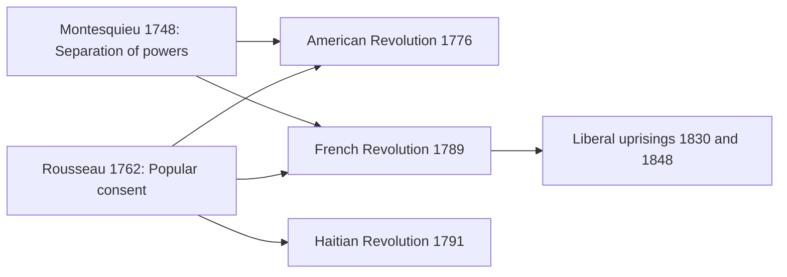

# Concept-Book Run

domain: /home/papagame/projects/digital-duck/conceptbook-app/public/domains/Users/200years_7powers_ch00/input/graph.yaml
target: enlightenment_philosophy_1748
started: 2026-09-28T02:06:47

## Teaching order (1 concepts)

- enlightenment_philosophy_1748

### enlightenment_philosophy_1748 (15.6s)

## Enlightenment Philosophy 1748

The Enlightenment supplied the political vocabulary that revolutionaries would use to justify overthrowing monarchies. Two texts did the heaviest lifting. Charles-Louis de Secondat, Baron de Montesquieu, published *The Spirit of the Laws* in 1748, drawing on his study of the English constitution after the Glorious Revolution of 1688. He argued that liberty survives only when the legislative, executive, and judicial functions of government are held by separate bodies that check one another — because, as he put it, "power must check power." Concentrate all three in one person or assembly, he warned, and tyranny follows almost automatically, regardless of the ruler's intentions. Fourteen years later, Jean-Jacques Rousseau published *The Social Contract* (1762), opening with the line "Man is born free, and everywhere he is in chains." Rousseau located legitimate authority not in divine right or inherited bloodline but in the "general will" of the people — a government rules justly only because the governed consent to be ruled, and that consent can be withdrawn.

These were not merely academic arguments; they were operational blueprints. The framers of the U.S. Constitution (1787) built the House, Senate, presidency, and federal judiciary explicitly around Montesquieu's separation of powers, citing him by name in the Federalist Papers. French revolutionaries in 1789 invoked Rousseau's popular sovereignty to declare the Estates-General a National Assembly acting for the people, not the king. In Saint-Domingue, Haitian revolutionaries — many of them enslaved or formerly enslaved — turned the same language of natural rights and consent against the French planter class itself, producing the only successful slave revolution in modern history (1791–1804).

The mechanism connecting these ideas to a century of upheaval was simple: once legitimacy was redefined as flowing from the people rather than from hereditary right, every dynastic monarchy in Europe became, in principle, contestable. That single reframing — from "the king rules because God ordained it" to "government rules because the governed consent" — is the intellectual fuse that runs through the American Revolution (1776), the French Revolution (1789), the Haitian Revolution (1791), and the liberal uprisings of 1830 and 1848, as constitutionalists across Europe repeatedly invoked Montesquieu's structural checks and Rousseau's consent principle against restored absolutist regimes.

*How Montesquieu's and Rousseau's ideas fed into the American, French, and Haitian revolutions and the later 19th-century liberal movements.*

## Run complete

total: 18.1s
