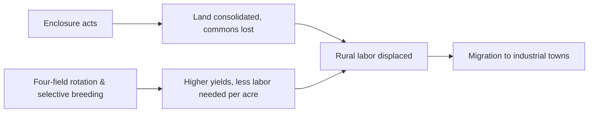

# Concept-Book Run

domain: /home/papagame/projects/digital-duck/conceptbook-app/public/domains/Users/200years_7powers_ch00/input/graph.yaml
target: watt_steam_engine_1769
started: 2026-09-28T02:07:48

## Teaching order (2 concepts)

- agri_rev_1740s
- watt_steam_engine_1769

### agri_rev_1740s (15.9s)

## Agri Rev 1740S

Before a factory could employ a worker, that worker had to eat—and, just as important, had to be free to leave the land. Between the 1740s and 1780s, Britain's agricultural revolution solved both problems at once. Parliamentary enclosure acts converted open, communally worked fields and shared common land into fenced, privately held plots. Landowners consolidated scattered strips into efficient blocks, but the price was paid by smallholders and cottagers, who lost customary grazing and gleaning rights that had subsidized their household economies. Roughly 4 million acres of English land were enclosed by act of Parliament between 1750 and 1820, and the pace was steepest in exactly this window. At the same time, the Norfolk four-field rotation—wheat, turnips, barley, clover, cycled without leaving land fallow—spread from Norfolk estates across the country. Turnips and clover restored soil nitrogen and supplied winter fodder, ending the old autumn slaughter of livestock for lack of feed. Combined with selective breeding pioneered by figures like Robert Bakewell, who used controlled pairing to fix desirable traits in sheep and cattle, average livestock weights at market roughly doubled over the eighteenth century.

The consequence was a food system that could feed more people with less labor. Estimates suggest agricultural output per worker rose by 40–50% over the century, meaning the same harvest could be produced with a shrinking share of the workforce. Displaced cottagers and smallholders, no longer able to sustain themselves on enclosed commons, migrated toward towns in search of wage labor—precisely the moment textile mills in Manchester and Lancashire needed hands.

This is a case of structural cause and effect rather than a formula: a change in land tenure and farming technique altered the supply of rural labor, and that altered labor supply became the input for industrial growth. No industrial workforce assembles itself from a self-sufficient peasantry; it requires people pushed off the land and pulled toward wages. Historians therefore treat the agricultural revolution not as a side story but as the load-bearing precondition beneath urbanization, factory labor, and everything that follows in Britain's industrial transformation.

*How enclosure and farming innovation together freed rural labor for the factory workforce.*

### watt_steam_engine_1769 (16.2s)

## Watt Steam Engine 1769

James Watt did not invent the steam engine — Thomas Newcomen had built working atmospheric engines to pump water out of coal mines since 1712. Watt's contribution, patented in 1769, was the separate condenser: a distinct chamber where steam could be cooled and condensed without cooling the engine's main cylinder itself. In Newcomen's design, the cylinder had to be alternately heated with injected steam and then cooled with a jet of cold water to create the vacuum that drove the piston — a cycle that wasted most of the fuel reheating metal that had just been cooled. By routing the spent steam into a separate condenser, Watt kept the cylinder permanently hot and the condenser permanently cold, cutting coal consumption by roughly 75 percent for the same power output. This single change turned the steam engine from a fuel-hungry curiosity, viable only next to a coal seam, into a machine efficient enough to power cotton mills, iron forges, and eventually railway locomotives far from any mine.

Watt's practical breakthrough depended on an unglamorous but decisive partnership: he needed precisely bored cylinders to prevent steam from leaking past the piston, a manufacturing tolerance beyond ordinary blacksmithing. His 1775 partnership with Birmingham manufacturer Matthew Boulton supplied both capital and access to John Wilkinson's improved cannon-boring technique, which could machine a cylinder to within the thickness of a shilling coin. Boulton and Watt then sold engines not for a flat price but on a royalty basis — one-third of the fuel savings compared to a Newcomen engine — which let mine and mill owners adopt the technology with little upfront risk while giving Boulton and Watt a stake in every efficiency gain.

The deeper significance of the Watt engine is what it freed industry from: location. A water-driven mill had to sit on a river; a Newcomen engine was economical only beside a coal seam. Watt's high-efficiency engine could be sited wherever labor, capital, and markets converged — increasingly, in growing cities. That labor supply was itself the product of the Agricultural Revolution of the 1740s, whose enclosure and crop-rotation gains had freed roughly one-third of Britain's workforce from subsistence farming by 1800, supplying the mill towns of Manchester and Birmingham with workers displaced from the land. By 1800, over 2,500 Boulton and Watt engines were in use across Britain, and by the 1830s their descendants — lighter, high-pressure engines developed by Richard Trevithick and others — were hauling freight and passengers on the first railways, cementing steam as the power source of the industrial age.

## Run complete

total: 35.6s
