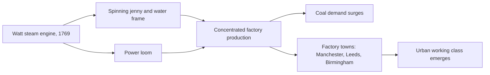

# Concept-Book Run

domain: /home/papagame/projects/digital-duck/conceptbook-app/public/domains/Users/200years_7powers_ch00/input/graph.yaml
target: mechanized_textile_mills_1785
started: 2026-09-28T02:08:25

## Teaching order (3 concepts)

- agri_rev_1740s
- watt_steam_engine_1769
- mechanized_textile_mills_1785

### agri_rev_1740s (16.5s)

## Agri Rev 1740S

Britain's Agricultural Revolution refers to a cluster of changes in landownership, crop management, and animal breeding between roughly 1740 and 1780 that raised farm output while sharply reducing the number of people needed to produce it. Two changes mattered most: enclosure and four-field crop rotation. Enclosure was the legal and physical consolidation of scattered open-field strips and common pasture into fenced, privately held plots, carried out through thousands of individual Acts of Parliament — over 5,000 enclosure acts were passed between 1750 and 1860, affecting roughly a quarter of England's cultivated land. Four-field rotation, popularized by Norfolk farmers and associated with figures like Charles "Turnip" Townshend, replaced the old three-field system (which left a third of land fallow each year) with a wheat–turnips–barley–clover cycle. Turnips and clover restored soil nitrogen and provided winter fodder, so no land had to sit idle and livestock no longer had to be slaughtered en masse each autumn.

The consequence was twofold. First, yields rose: wheat output per acre in England is estimated to have increased by 50 to 90 percent over the eighteenth century. Second, and more consequential for the rest of the chapter, enclosure eliminated the small subsistence plots and common grazing rights that had let cottagers and smallholders feed themselves without wages. Deprived of that land, large numbers of rural families had no choice but to sell their labor — first as agricultural wage-workers on the newly consolidated farms, then increasingly in nearby towns.

Consider a concrete case: in a typical open-field Midlands village before enclosure, a family might farm three or four scattered acre-strips plus graze a cow and some geese on common land — enough to survive without cash income. After enclosure redrew the parish into hedged, privately owned fields, that family's strips were reassigned or bought out, and the commons fenced off entirely. With no land to work, sons and daughters who once labored on the family plot now had to seek wages elsewhere.

This is why historians treat the Agricultural Revolution as a precondition rather than a parallel development: the textile mills and factories of the 1760s–1780s required a landless, wage-dependent labor force willing to work in Manchester or Birmingham, and enclosure is what created that population before the machines existed to employ it.

### watt_steam_engine_1769 (15.4s)

## Watt Steam Engine 1769

James Watt did not invent the steam engine — Thomas Newcomen had built working atmospheric engines since 1712, using them to pump water out of flooded coal and tin mines. Watt's contribution, patented in 1769, was the separate condenser. In Newcomen's design, the same cylinder that received hot steam was cooled with a jet of water on every stroke to condense it, then had to be reheated for the next stroke. Watt calculated that this repeated heating and cooling wasted roughly three-quarters of the coal burned. His fix was to route the steam into a separate, permanently cool chamber for condensation, letting the main cylinder stay hot throughout operation. The result was an engine that did the same work on a fraction of the fuel — contemporary estimates put the efficiency gain at three to five times that of a Newcomen engine.

Worked example: A Cornish mine running a Newcomen engine to pump water might burn on the order of 15 pounds of coal per horsepower-hour. Watt's engine, doing identical pumping work, could do so on roughly 4–5 pounds. For a mine already spending a large share of its operating costs on coal — often shipped in at high cost to sites without local seams — this was not a marginal improvement but the difference between a pit remaining profitable or being abandoned. Watt partnered with the manufacturer Matthew Boulton in Birmingham, and the firm Boulton & Watt licensed engines by charging mine owners a share of the fuel savings itself, a business model that only worked because the savings were so large and easily measured.

Problem-solving application: The deeper transformation came when Watt, prompted by Boulton, adapted the engine from simple up-and-down pumping to rotary motion (patented 1781), allowing it to turn shafts and drive machinery directly. This converted steam power from a single-purpose mine-drainage tool into a general-purpose power source usable in any factory, regardless of location near flowing water. That flexibility mattered because Britain's Agricultural Revolution of the 1740s had already displaced large numbers of rural laborers, who migrated toward towns seeking work; Watt's engine gave factory owners a reliable, sitable power source to employ them, turning surplus labor and surplus power into the two ingredients of industrial mass production.

### mechanized_textile_mills_1785 (17.0s)

## Mechanized Textile Mills 1785

Mechanized textile milling is the combination of Richard Arkwright's water frame, James Hargreaves's spinning jenny, and Edmund Cartwright's power loom with a stationary power source — first waterwheels, then James Watt's rotative steam engine — to spin and weave cotton on a scale no hand workshop could match. Before 1785, spinning and weaving were cottage-based: a family working by hand and foot could produce perhaps a few pounds of yarn a week. A single Arkwright-style mill, once linked to steam power, could run hundreds of spindles continuously, day and night, limited only by coal supply and labor shifts rather than daylight or human fatigue. This is why the concept sits directly downstream of the Watt steam engine: mechanization existed in isolated form earlier, but steam power is what let mills relocate off riverbanks and concentrate in cities with coal, labor, and rail access — Manchester, Leeds, Birmingham.

The worked example is Manchester itself. In 1771, Arkwright opened his first water-powered mill at Cromford; by 1830, Manchester alone held over 100 cotton mills and had grown from roughly 25,000 residents in 1772 to more than 180,000. British raw cotton imports rose from about 5 million pounds in 1781 to over 500 million pounds by 1860 — a hundredfold increase driven almost entirely by mechanized spinning and weaving. Coal consumption in England climbed from around 10 million tons annually in 1800 to over 30 million tons by 1830, as coal became the direct energy input for both the steam engines and the growing iron industry that built them.

Applying this concept means tracing a specific causal chain rather than memorizing a date. Ask: what changed for a displaced hand-loom weaver in Yorkshire around 1810? Mechanized power looms cut the labor cost of weaving cloth by roughly two-thirds, which meant hand weavers could not compete on price; many were forced into factory wage labor or unemployment — a shift documented in the Luddite uprisings of 1811–1813, when hand weavers destroyed mechanized looms in protest. This is the historical mechanism behind "the factory system and the urban working class are born together": mechanization did not simply add output, it restructured who controlled production (mill owners with capital for machinery and steam power) and who supplied labor (wage workers, including large numbers of women and children, subject to factory discipline and hours no household workshop had ever imposed).

*How steam power converted scattered hand-based textile work into concentrated, coal-dependent factory production and a new urban working class.*

## Run complete

total: 52.3s
