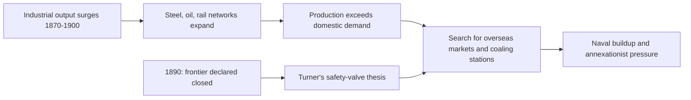

# Concept-Book Run

domain: /home/papagame/projects/digital-duck/conceptbook-app/public/domains/Users/200years_7powers_ch08/input/graph.yaml
target: science_electrification_shifts_power
started: 2026-09-28T02:09:01

## Teaching order (9 concepts)

- science_faraday_darwin_era
- german_unification_1871
- great_power_rivalry
- science_darwinism_and_germ_theory
- us_gilded_age
- germany_weltpolitik_rivalry
- science_electrification_and_chemistry
- us_industrial_rise
- science_electrification_shifts_power

### science_faraday_darwin_era (18.8s)

## Science Faraday Darwin Era

By 1845 three scientific threads are converging that will remake the next century, though almost no one alive yet grasps their combined weight. In 1831 Michael Faraday demonstrated electromagnetic induction: moving a magnet through a coil of wire generates an electric current. This single laboratory result — Faraday had no formal mathematics training and reasoned largely through physical intuition and careful experiment — is the seed of the entire electrical age: the dynamo, the generator, and eventually the electric grid all descend directly from it. Faraday's law would later be formalized by James Clerk Maxwell as one of the four Maxwell equations, but in 1845 it exists as demonstrated phenomenon, not yet theory.

Simultaneously, Charles Darwin has returned from the five-year voyage of HMS Beagle (1831–1836) carrying finch specimens from the Galápagos, fossil evidence from South America, and a private notebook already sketching the mechanism of natural selection — yet he withholds publication. He will not publish On the Origin of Species until 1859, spurred finally by Alfred Russel Wallace independently reaching similar conclusions. The twenty-year delay is itself historically significant: Darwin understood how explosively his idea would collide with religious orthodoxy and social hierarchy, and he spent those years amassing overwhelming evidence — barnacle taxonomy, breeding experiments, geological correspondence with Charles Lyell — specifically to make the theory difficult to dismiss.

Meanwhile chemistry is industrializing rather than merely theorizing. German chemists, especially through Justus von Liebig's laboratory at Giessen, are systematizing organic chemistry and agricultural fertilizer science, while British industrial chemistry (alkali production, dye synthesis) is scaling manufacturing processes. Dmitri Mendeleev's periodic table is still 24 years away (1869), but the elemental data — atomic weights, reaction patterns — that will make it possible is being tabulated now.

The pattern connecting all three: each discipline moves from isolated discovery toward systematic, applicable science, but on different timelines. Faraday's induction reaches industrial application (electric lighting, telegraphy) within decades. Darwin's theory is scientifically complete by the mid-1840s but politically withheld for fourteen more years. Chemistry industrializes fastest because it has immediate commercial payoff — dyes, fertilizers, explosives — with the least ideological resistance.

**Problem-solving application:** If a historian is asked why electromagnetism transformed industry within a single generation while evolutionary theory took over a century to gain full scientific and educational acceptance, the answer lies not in the quality of evidence but in the destination of the idea: electromagnetism threatened no existing social or religious order, so capital and institutions absorbed it immediately, whereas natural selection challenged doctrines of human origin and hierarchy, making its adoption a contested cultural process rather than a purely technical one.

### german_unification_1871 (15.6s)

## German Unification 1871

**Definition**

German unification refers to the process by which Prussia, under Chancellor Otto von Bismarck, consolidated a patchwork of 39 independent German states into a single nation-state, culminating in the proclamation of the German Empire on January 18, 1871. Bismarck achieved this not through parliamentary persuasion but through a deliberate sequence of three wars — against Denmark (1864), Austria (1866), and France (1870–71) — each engineered to isolate a rival power and rally the German states around Prussian leadership. The final and decisive war, the Franco-Prussian War, ended in a crushing Prussian victory: France's Emperor Napoleon III was captured at the Battle of Sedan (September 1870), Paris fell after a four-month siege, and France was forced to cede Alsace-Lorraine and pay an indemnity of 5 billion francs.

**Worked example**

The symbolism of the unification was as calculated as the military strategy. Bismarck staged the imperial proclamation inside the Hall of Mirrors at the Palace of Versailles — the ceremonial heart of French royal power — deliberately humiliating the defeated French and signaling to all of Europe that a new great power had arrived. Overnight, the new German Empire combined Prussia's disciplined military-industrial machine with the populations and resources of Bavaria, Saxony, Württemberg, and dozens of smaller states, producing a nation of roughly 41 million people — larger than France's 36 million — and an industrial base that would soon rival Britain's in steel and coal production.

**Problem-solving application**

To assess why unification destabilized the European balance of power, compare pre- and post-1871 conditions using primary evidence rather than abstract reasoning. Before 1871, the German states were fragmented and posed no unified military threat, so France could treat the Rhine as a secure frontier. After 1871, a single German state controlled Alsace-Lorraine's iron-ore resources, fielded a conscript army exceeding 400,000 men, and possessed the war-tested General Staff system that had defeated both Austria and France within a decade. A historian evaluating the causes of the eventual outbreak of the First World War in 1914 must therefore weigh 1871 as the structural starting point: French resentment over Alsace-Lorraine's loss (memorialized in the "revanchism" movement) and German anxiety over encirclement by France and Russia both trace directly back to the terms Bismarck imposed at Versailles.

### great_power_rivalry (17.1s)

## Great Power Rivalry

By the 1870s, the major European states, along with Japan and the United States, operated within an international system where national standing was measured almost entirely by territorial reach, industrial output, and naval strength. This was great power rivalry: a competitive order in which Britain, France, Germany, Russia, Austria-Hungary, Italy, Japan, and the United States treated colonial acquisition and military buildup not as optional projects but as proof of a nation's rank among its peers. A state that failed to expand risked being seen — by its rivals and its own public — as declining.

The clearest illustration is the Scramble for Africa. In 1870, European powers controlled about 10 percent of the African continent; by 1914, they controlled roughly 90 percent. The 1884–85 Berlin Conference formalized this competition by setting rules for claiming territory, but it did not slow the race — it accelerated it, since any power that hesitated risked losing land to a faster-moving rival. Germany's unification in 1871 under Otto von Bismarck intensified the rivalry directly: a newly powerful German Empire began demanding colonies and building a battleship fleet after 1898, alarming Britain, whose global strength rested on naval supremacy. Britain responded with its own shipbuilding surge, producing the Anglo-German naval arms race that historians widely cite as a direct precursor to the alliance tensions of 1914.

Applying this concept to primary evidence sharpens the analysis. Consider Germany's 1897 naval program: Admiral Alfred von Tirpitz argued that Germany needed a fleet strong enough to make attacking it too costly for Britain — a stated goal, not a hidden one, recorded in Reichstag naval bills. By 1914, Germany had built 17 dreadnought-class battleships against Britain's 29; the gap narrowed sharply from a decade earlier, when Britain held overwhelming superiority. A student analyzing this rivalry should ask: what specific resource, territory, or prestige marker was contested, and what actions did each side take in response? Applying that question to the 1905 and 1911 Moroccan crises, for example, shows France and Germany each testing the other's resolve over colonial claims — with Britain's alliance with France (the 1904 Entente Cordiale) shaping the outcome. This rivalry framework — measuring power by expansion and reading rival actions as signals of intent — explains why colonial disputes in Africa and Asia could escalate into crises that reshaped European alliances well before 1914.

### science_darwinism_and_germ_theory (14.5s)

## Science Darwinism And Germ Theory

Between 1859 and 1883, two independent scientific revolutions redefined how societies understood life and disease — and one of them was almost immediately hijacked to justify empire.

In 1859, Charles Darwin published *On the Origin of Species*, arguing that species change over time through natural selection: individuals with traits better suited to their environment survive and reproduce more successfully, gradually reshaping populations across generations. This overturned the prevailing view that species were fixed at creation, and it placed humans within the natural, evolving world rather than outside it. The theory rested on evidence Darwin spent decades assembling — fossil records, selective breeding practices, and geographic distribution of species he observed during the voyage of the *Beagle*.

At nearly the same time, Louis Pasteur and Robert Koch built the case for germ theory: the idea that specific microorganisms, not "bad air" or spontaneous generation, cause specific diseases. Pasteur's experiments in the 1860s disproved spontaneous generation and led to pasteurization; Koch's postulates (1876–1884) established a rigorous method for linking a particular bacterium — such as the anthrax bacillus he identified in 1876 or the tuberculosis bacillus in 1882 — to a particular illness. Together, this work founded modern medicine and public health, enabling sanitation reform, vaccination programs, and dramatic declines in infectious-disease mortality across industrializing nations by the early twentieth century.

The practical application of germ theory was straightforward and largely beneficial: once officials accepted that cholera spread through contaminated water rather than miasma, cities invested in sewage systems and water treatment, saving millions of lives.

Darwin's theory, however, was misapplied far outside its scientific domain. Thinkers like Herbert Spencer coined "survival of the fittest" and extended it to human societies, arguing that richer nations and dominant races had proven themselves biologically superior — a doctrine now called Social Darwinism. European and American imperial powers used this reasoning to justify colonization, racial segregation, and the displacement of indigenous peoples as natural, even inevitable, consequences of evolutionary competition. Darwin himself never endorsed this extension; the misapplication lay in treating a biological mechanism for populations over geological time as a moral license for human political domination over decades.

### us_gilded_age (15.6s)

## Us Gilded Age

Between 1870 and 1890, the United States underwent the fastest industrial expansion any nation had yet experienced. Railroad mileage grew from about 53,000 miles in 1870 to over 163,000 miles by 1890, knitting together a national market for the first time. Steel production, driven by the Bessemer process, rose from roughly 77,000 tons in 1870 to over 4.7 million tons by 1890 — a sixtyfold increase in two decades. This era, named "the Gilded Age" by Mark Twain and Charles Dudley Warner in their 1873 satirical novel, refers to a surface of gold-plated prosperity covering deep inequality and corruption underneath.

The engine of this growth was a small group of industrialists — Andrew Carnegie in steel, John D. Rockefeller in oil, Cornelius Vanderbilt and Jay Gould in railroads — who built vertically integrated empires and consolidated competitors into trusts. Rockefeller's Standard Oil controlled about 90 percent of American oil refining by 1880 through aggressive buyouts and secret railroad rebates that undercut rivals. Critics called these men "Robber Barons," accusing them of exploiting workers, bribing legislators, and crushing competition; defenders called them "Captains of Industry," crediting them with building the infrastructure and capital base of a modern economy. Both descriptions capture something true: Carnegie's steel mills employed workers twelve hours a day, six days a week, for wages often near subsistence, while Carnegie himself would later give away $350 million to libraries and universities.

The problem this era poses for historical analysis is a causal one: how did unregulated concentration of capital produce both real economic transformation and social costs severe enough to trigger a political backlash? The 1877 Great Railroad Strike, the 1886 Haymarket affair, and the 1892 Homestead Strike at Carnegie's own steel plant show labor responding to wage cuts and dangerous conditions with organized resistance, often met with private security forces and state militias. This tension between growth and grievance directly produced the Progressive Era reforms of the 1890s–1910s, including the Sherman Antitrust Act (1890) and later trust-busting under Theodore Roosevelt.

By 1890, the United States had surpassed Britain and Germany in industrial output, producing the manufacturing capacity, transportation network, and capital markets that would allow it to project economic and later military power globally in the twentieth century — the material foundation beneath its rise to world-power status.

### germany_weltpolitik_rivalry (15.1s)

## Germany Weltpolitik Rivalry

Otto von Bismarck's foreign policy after 1871 rested on a single insight: a unified Germany, now the strongest land power in Europe, had to reassure its neighbors that it wanted no more territory, or it would face a coalition of enemies on all sides. He kept France isolated, courted Russia and Austria-Hungary, and stayed out of the colonial race that consumed Britain and France. When Kaiser Wilhelm II forced Bismarck's resignation in March 1890, that restraint ended. The new course, publicly named Weltpolitik ("world policy") by Chancellor Bernhard von Bülow in 1897, declared that Germany deserved a colonial empire and a battle fleet commensurate with its industrial strength — Wilhelm's demand for "a place in the sun."

The clearest instrument of this shift was the naval program driven by Admiral Alfred von Tirpitz. The Fleet Acts of 1898 and 1900 committed Germany to building a battleship fleet explicitly designed to challenge the Royal Navy, and the 1906 launch of Britain's HMS Dreadnought — a ship so advanced it made all earlier battleships obsolete — triggered an arms race in which both nations raced to build dreadnought-class ships year after year. Britain, which had avoided permanent alliances for decades, responded by settling colonial disputes with France (the 1904 Entente Cordiale) and later Russia (1907), reversing a century of mutual suspicion specifically to counterbalance Germany.

Weltpolitik's colonial ambitions produced direct confrontations. In 1905, Wilhelm II landed at Tangier and publicly backed Moroccan independence from French influence, testing whether the new Anglo-French entente would hold; it did, and the resulting Algeciras Conference of 1906 isolated Germany diplomatically. Germany repeated the gambit in 1911, sending the gunboat Panther to Agadir to pressure France over Morocco, only to see Britain again side firmly with France, extracting German recognition of a French protectorate over Morocco in exchange for territory in the Congo.

The pattern is the historical lesson: each Moroccan crisis was meant to break the Franco-British entente but instead hardened it, while each new German battleship deepened British resolve. Weltpolitik, intended to secure Germany's status as a world power, instead converted a diplomatic problem — how to expand without provoking encirclement — into the very alliance structure that would face Germany in 1914.

### science_electrification_and_chemistry (27.5s)

## Science Electrification And Chemistry

Between 1865 and 1895, three scientific breakthroughs converted laboratory theory into industrial infrastructure, and in doing so redrew the map of economic power. James Clerk Maxwell's 1865 "Treatise on Electricity and Magnetism" showed that electricity, magnetism, and light were a single phenomenon, governed by four coupled field equations:

$$
\nabla \cdot \mathbf{E} = \frac{\rho}{\varepsilon_0}, \quad \nabla \cdot \mathbf{B} = 0, \quad \nabla \times \mathbf{E} = -\frac{\partial \mathbf{B}}{\partial t}, \quad \nabla \times \mathbf{B} = \mu_0 \mathbf{J} + \mu_0 \varepsilon_0 \frac{\partial \mathbf{E}}{\partial t}
$$

This unification made electrical engineering a predictive science rather than trial-and-error tinkering. In 1869, Dmitri Mendeleev arranged the 63 known elements by atomic weight and recurring chemical properties, leaving gaps he predicted would be filled — and when gallium (1875), scandium (1879), and germanium (1886) were discovered with almost exactly his predicted masses and densities, periodicity became the organizing law of chemistry.

The worked example is the "War of Currents." Thomas Edison's Pearl Street Station (New York, 1882) delivered direct current to 59 customers over roughly one square mile — reliable but unable to transmit far without massive energy loss. Nikola Tesla's alternating-current system, backed by George Westinghouse and demonstrated at the 1893 Chicago World's Fair, could step voltage up for long-distance transmission and down for safe household use; AC's 1896 Niagara Falls plant sent power 20 miles to Buffalo, settling the standard still used today.

The problem-solving payoff is explaining industrial divergence. Britain had led coal-and-steam manufacturing for a century, but its firms under-invested in the new chemistry and electricity. Germany's technical universities and corporate labs (BASF, Bayer, Hoechst) captured roughly 90 percent of the world's synthetic-dye market by 1900 and pioneered industrial pharmaceuticals. The United States, drawing on Edison's and Tesla's patents and consolidating them into General Electric (1892) and Westinghouse Electric, electrified factories and cities at a pace Britain could not match. Applying this concept means tracing a specific national outcome — market share, patent count, infrastructure reach — back to which country invested earliest in translating a scientific law into a deployable industrial system.

### us_industrial_rise (15.7s)

## Us Industrial Rise

Between 1870 and 1900, the United States transformed from a primarily agricultural nation into the world's leading industrial power. Steel production, driven by Andrew Carnegie's application of the Bessemer process, rose from roughly 77,000 tons in 1870 to over 11 million tons by 1900, surpassing Britain and Germany combined. The transcontinental railroad network expanded from 53,000 miles of track in 1870 to nearly 193,000 miles by 1900, knitting together national markets for the first time and enabling mass production and distribution on a continental scale. Oil refining, consolidated under John D. Rockefeller's Standard Oil, and electrical power, pioneered by Thomas Edison and George Westinghouse, added further momentum. By 1894, U.S. manufacturing output exceeded that of Britain, France, and Germany individually.

This industrial surge coincided with a symbolic turning point: the 1890 U.S. Census Bureau declaration that a continuous frontier line no longer existed. Historian Frederick Jackson Turner argued in his 1893 essay that the frontier had shaped American character and democracy by offering an outlet for surplus population and ambition; its closing, he warned, removed a safety valve just as industrial capacity was peaking. Whether or not Turner's thesis fully explains what followed, the timing was consequential: American elites, industrialists, and naval strategists like Alfred Thayer Mahan began arguing that a nation producing far more than it could consume needed new markets and coaling stations abroad to sustain growth.

The practical problem this raised was one of applied strategy, not physics: where should surplus American capital, goods, and naval power be directed once continental expansion was no longer available? Policymakers answered by looking outward. Congress authorized a modern steel navy beginning in 1883; annexationists eyed Hawaii, Cuba, and the Philippines; and businessmen sought overseas markets for surplus wheat, cotton, and manufactured goods. This reasoning — that domestic industrial success created pressure for overseas engagement — directly set up the debates over annexation and war that defined the 1898 Spanish-American War and the subsequent acquisition of an overseas empire.

*Diagram showing how simultaneous industrial growth and the closing of the frontier redirected American ambitions toward overseas expansion.*

### science_electrification_shifts_power (13.8s)

## Science Electrification Shifts Power

By the 1870s, Britain had powered the First Industrial Revolution on steam, coal, and textiles, and still led the world in industrial output. But the Second Industrial Revolution ran on a different set of technologies — electrical power generation and distribution, synthetic dyes and industrial chemistry, and precision engineering tied closely to university and corporate research laboratories. These technologies did not take root primarily in Britain. They concentrated in Germany and the United States.

The evidence is concrete. Germany's chemical industry, built on firms like BASF, Bayer, and Hoechst, dominated synthetic dye production by 1900, holding roughly 90 percent of the world dye market. German firms also led in electrical engineering, with Siemens and AEG pioneering large-scale power generation and the German patent and technical-university system producing a steady stream of engineers trained specifically for these new industries. In the United States, Thomas Edison's Pearl Street Station opened in 1882, and by the 1900s American manufacturers such as General Electric and Westinghouse were electrifying factories at a pace that raised labor productivity across entire sectors. Meanwhile Britain, whose university and apprenticeship systems remained oriented toward the craft skills of the steam era, saw its share of world manufacturing output fall from about one-third in 1870 to under 15 percent by 1913, while Germany's share rose to roughly 16 percent and the United States' to over 30 percent.

The chains constructed for this study — tracing where scientific and technical activity clusters over time — register this same shift independently: the locus of electrical and chemical science activity moves from Britain toward Germany and the United States across this exact window. That the science chain's relocation coincides with the industrial-output reversal is a documented correlation, not a claim that science caused the shift by itself; tariff policy, capital markets, and firm organization all mattered too.

For problem-solving purposes, students should practice distinguishing correlation from mechanism in a case like this: identify which specific institutions (a research university, a corporate laboratory, a patent office) plausibly transmitted the technological advantage into industrial output, rather than treating "Germany overtook Britain" as a single unexplained fact. Tracing a named institution's founding date against a country's output-share trend is a more rigorous exercise than citing the aggregate trend alone.

## Run complete

total: 174.7s
