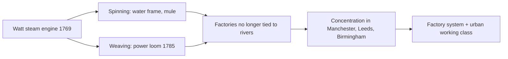

# Concept-Book Run

domain: /home/papagame/projects/digital-duck/conceptbook-app/public/domains/Users/200years_7powers_ch00/input/graph.yaml
target: stockton_darlington_railway_1825
started: 2026-09-28T02:09:19

## Teaching order (4 concepts)

- agri_rev_1740s
- watt_steam_engine_1769
- mechanized_textile_mills_1785
- stockton_darlington_railway_1825

### agri_rev_1740s (15.5s)

## Agri Rev 1740S

Britain's Industrial Revolution needed something an industrial economy cannot manufacture: a surplus of food large enough to feed people who no longer grow their own, and a surplus of labor freed from the fields to work in factories. Both surpluses came from changes to farming that unfolded between the 1740s and 1780s, decades before the first cotton mills reached full scale.

Two changes did most of the work. First, enclosure — the legal consolidation of scattered open fields and shared common land into single, fenced, privately controlled farms — let landowners manage soil and livestock as one continuous operation rather than negotiating with dozens of smallholders. Parliament passed over 4,000 enclosure acts between 1750 and 1850, eventually enclosing roughly a quarter of England's cultivated area. Second, the Norfolk four-course rotation — wheat, turnips, barley, clover, in a repeating four-year cycle — replaced the medieval three-field system, which had required leaving a third of the land fallow each year to recover fertility. Turnips and clover restored nutrients to the soil while also providing winter feed for livestock, eliminating the fallow year entirely and keeping animals alive through winter instead of forcing mass autumn slaughter, as had been customary for centuries.

Selective breeding compounded these gains. Robert Bakewell's work with Leicester sheep and Longhorn cattle in the 1760s and 1770s used deliberate mating of animals with desirable traits — faster weight gain, more meat per animal — to roughly double average sheep weights by 1800 compared to mid-century stock.

The consequence was displacement as much as abundance. Enclosure ended the common grazing and gleaning rights that had let landless cottagers survive on marginal plots; large-scale, rotation-based farming needed fewer hands per acre than the old open-field patchwork. Historians estimate England's agricultural labor force fell as a share of total employment from roughly 60 percent around 1700 to under 40 percent by 1800, even as total output rose. Those displaced rural workers became the pool of people available to move to Manchester, Birmingham, and Leeds — supplying the labor that mechanized textile and iron production required starting in the 1780s. Without a farm sector that could feed a nation while employing fewer of its people, urban factories would have had machines and capital but no one to staff them, and no food to sustain them.

### watt_steam_engine_1769 (15.2s)

## Watt Steam Engine 1769

James Watt's 1769 patent for a "new method of lessening the consumption of steam and fuel in fire engines" solved a specific inefficiency in the existing Newcomen engine, which had been used since 1712 mainly to pump water out of coal and tin mines. In the Newcomen design, steam was injected into the main cylinder and then condensed by spraying cold water directly into that same cylinder. This cooled the cylinder walls along with the steam, so every stroke wasted fuel reheating the cylinder before the next stroke could begin. Watt's insight, developed while repairing a Newcomen model at the University of Glasgow, was to add a separate condenser chamber connected to the main cylinder by a valve. Steam still condensed and lost its pressure, but the cylinder itself stayed hot, since only the separate chamber was cooled. This single change cut fuel consumption by roughly 75 percent for the same power output.

The efficiency gain mattered because it changed what the steam engine was for. Newcomen engines were fuel-hungry enough that they only made economic sense at coal mines, where fuel was essentially free on-site. Watt's engine, refined through his partnership with manufacturer Matthew Boulton beginning in 1775, produced enough power per unit of fuel to be worth transporting coal to run it elsewhere. By the 1780s, Boulton and Watt engines were driving rotary machinery in cotton mills and iron forges across Britain, converting the reciprocating piston motion into continuous rotational power via Watt's separate patented sun-and-planet gear mechanism (patented 1781) — because James Watt's original rotative patent had already covered similar crank arrangements held by rivals.

This transition depended on a prior structural shift: the Agricultural Revolution of the 1740s had already increased crop yields per farmworker, releasing labor from the land into towns and factories. Watt's engine gave that displaced labor force a location-independent power source; a mill no longer had to sit beside a fast-flowing river, as water-powered mills did. Textile output in Britain grew accordingly — raw cotton imports rose from about 5 million pounds in 1781 to over 300 million pounds by 1830 — as steam-driven machinery multiplied the productivity of each worker, marking the practical beginning of industrial manufacturing at scale.

### mechanized_textile_mills_1785 (16.6s)

## Mechanized Textile Mills 1785

By the 1780s, James Watt's improved steam engine gave British manufacturers a power source that did not depend on rivers or the weather. Textile production was the first industry transformed. Richard Arkwright's water frame (1769) and Samuel Crompton's spinning mule (1779) mechanized the spinning of cotton thread, and Edmund Cartwright's power loom (1785) mechanized weaving. When these machines were driven by steam rather than waterwheels, factories no longer needed to sit beside fast-flowing streams — they could cluster wherever coal and labor were cheap and accessible. Manchester, Leeds, and Birmingham grew rapidly as a result, becoming the world's first industrial cities.

The consequence was a fundamental reorganization of work. Before mechanization, spinning and weaving were done by families in their homes — the "domestic system," paid by the piece and set to its own rhythm. The factory system replaced this with wage labor performed on a fixed schedule, under supervision, inside a single building housing dozens or hundreds of machines. A worker no longer owned the tools of production; the machinery, and the building that housed it, belonged to the factory owner. This shift created two new social classes tied directly to mechanized production: an industrial capitalist class that owned mills and machinery, and an urban working class — including large numbers of women and children — that sold labor for wages.

The scale of change is measurable. Britain's raw cotton imports rose from about 11 million pounds in 1785 to over 300 million pounds by 1830, while coal output climbed from roughly 6 million tons in 1770 to over 30 million tons by 1830 to fuel steam engines and iron furnaces. Manchester's population grew from about 25,000 in 1772 to over 300,000 by 1850, a rate of urban growth without precedent in European history.

*How steam power freed textile production from water sites and concentrated it into factory towns, giving rise to the industrial working class.*

For a historian evaluating this transition, the analytical task is to distinguish cause from consequence: mechanization did not simply speed up an existing system, it created a new one, replacing household production with wage labor concentrated under one roof. When assessing any later industrializing region — Lowell, Massachusetts in the 1820s, or the Ruhr Valley in the 1850s — the same diagnostic questions apply: what powered the machines, what happened to the people who previously did the work by hand, and how did population and pollution concentrate around the new mills.

### stockton_darlington_railway_1825 (19.9s)

## Stockton Darlington Railway 1825

Before 1825, moving heavy freight overland meant horse-drawn wagons on rutted roads or slow canal barges — a horse could haul perhaps two tons on a road but ten times that on rails, since iron wheels on iron rails face far less friction than wheels on dirt. Mine owners in northeast England had used horse-drawn wagonways for decades to move coal short distances, but nothing connected an inland coalfield to a port over a long, public route. The Stockton and Darlington Railway, opened on 27 September 1825, closed that gap: a 26-mile line linking the coal pits around Darlington to the River Tees at Stockton, built by engineer George Stephenson and financed by Quaker merchants who needed a cheaper way to ship coal than the existing turnpike roads.

What made the line historic was not the track itself — wagonways already existed — but the decision to run a steam locomotive, Stephenson's "Locomotion No. 1," and to carry passengers and general goods as well as coal, making it the first public railway to combine steam traction with common-carrier service open to paying customers. On opening day the train pulled around 450 passengers and freight wagons at roughly 8 miles per hour, astonishing crowds who had never seen a mechanical vehicle move that fast over land. Within a few years the line proved that steam haulage was not just a novelty but was cheaper per ton-mile than horse haulage once traffic volume was high enough to spread the locomotive's fixed cost — a lesson investors absorbed quickly.

That commercial proof triggered a wave of railway-building capital could not resist: the Liverpool and Manchester Railway followed in 1830 with faster, fully timetabled steam passenger service, and by 1845 Britain had roughly 2,000 miles of track, with thousands more approved during the "Railway Mania" speculative boom of 1845–1847. Railways cut the cost and time of moving coal, iron, and finished goods between regions, letting factories draw raw materials and reach markets far beyond what canals or roads allowed, and directly extending the industrial shift already begun by mechanized textile production forty years earlier.

*How the 1825 proof-of-concept railway triggered Britain's national rail network within two decades.*

For problem-solving practice: if a mine shipped 500 tons of coal per week by horse wagon at a cost of 8 pence per ton-mile over a 20-mile route, and the railway cut that cost to 2 pence per ton-mile, the weekly saving is 500 × 20 × (8 − 2) pence — over £250 per week, explaining why merchants funded railways even before passenger revenue was considered.

## Run complete

total: 71.7s
