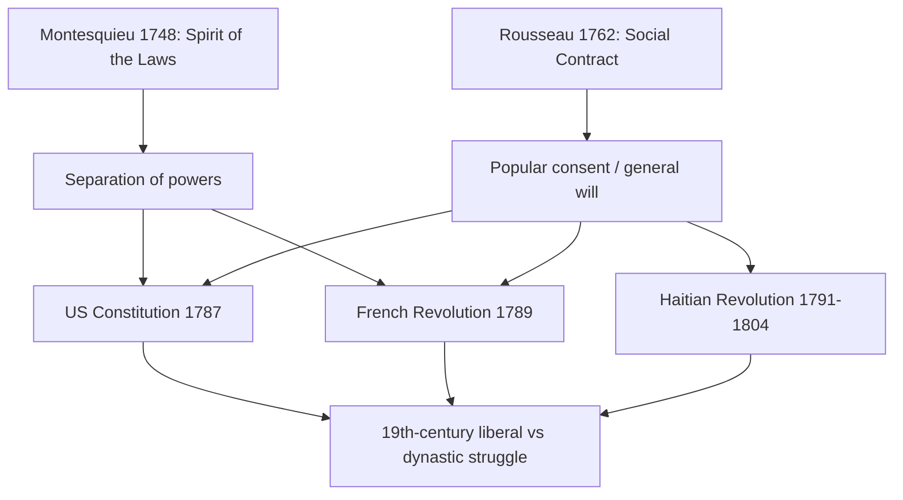

# Concept-Book Run

domain: /home/papagame/projects/digital-duck/conceptbook-app/public/domains/Users/200years_7powers_ch00/input/graph.yaml
target: american_revolution_1775
started: 2026-09-28T02:10:32

## Teaching order (3 concepts)

- enlightenment_philosophy_1748
- seven_years_war_1756
- american_revolution_1775

### enlightenment_philosophy_1748 (16.2s)

## Enlightenment Philosophy 1748

The Enlightenment was a Europe-wide intellectual movement, centered in France, Scotland, and the German states, that applied reason and empirical observation to questions of government, law, and human rights previously settled by religious authority or royal tradition. Two texts crystallized its political consequences. Charles-Louis de Secondat, Baron de Montesquieu, published "The Spirit of the Laws" in 1748 after nearly two decades of comparative study of governments ancient and modern. His central claim: liberty is best preserved not by virtuous rulers but by structure — by dividing government into legislative, executive, and judicial powers that check one another, so that "power must be made to counteract power." Jean-Jacques Rousseau's "The Social Contract" (1762) went further, arguing that legitimate political authority arises only from the consent of the governed, expressed through a "general will," and that a ruler who violates that trust forfeits his claim to obedience.

These were not abstract musings; they were tools statesmen used directly. The framers of the United States Constitution (1787) split government into three branches with enumerated checks — presidential veto, congressional override, judicial review — explicitly citing Montesquieu in the Federalist Papers (Madison, Federalist No. 47, invokes him by name). The French National Assembly's 1789 Declaration of the Rights of Man opens with language of popular sovereignty traceable to Rousseau. In Saint-Domingue, Toussaint Louverture and the leaders of the Haitian Revolution (1791–1804) invoked the same principles of natural rights and consent to justify the only successful slave-led revolution in history, producing the world's first Black republic in 1804.

Applying these ideas as a problem-solving lens: when evaluating any government structure, ask two Enlightenment-derived questions. First, is power divided so that no single branch can act unchecked (Montesquieu's test)? Second, does the government's authority trace back to some mechanism of popular consent — elections, representation, ratification (Rousseau's test)? Regimes that fail both tests — pre-1789 France's absolute monarchy, for instance, where the king held legislative, executive, and judicial power simultaneously and answered to no elected body — were precisely the targets these philosophies were built to dismantle, and precisely why the long nineteenth century became a running contest between liberal constitutionalists and the old dynastic order defending divine-right rule.

*How Montesquieu's and Rousseau's core ideas fed directly into the American, French, and Haitian revolutions, and then into the broader nineteenth-century contest between liberal and dynastic governments.*

### seven_years_war_1756 (14.8s)

## Seven Years War 1756

By the mid-eighteenth century, Britain and France had fought three inconclusive wars over trade, colonies, and dynastic succession. The Seven Years' War (1756–1763) settled the rivalry decisively. Triggered by competing claims in the Ohio River Valley and a diplomatic realignment in Europe (Austria and France uniting against Prussia, which allied with Britain), the war rapidly expanded beyond a European land conflict into fighting across North America, the Caribbean, West Africa, India, and the Philippines — historians often call it the first true world war.

The decisive theater was North America, where the war is known as the French and Indian War. Britain's capture of Quebec in 1759 and Montreal in 1760 broke French colonial power there. In India, Robert Clive's victory at the Battle of Plassey (1757) gave the British East India Company effective control over Bengal, the wealthiest province in the subcontinent, laying the foundation for British colonial rule that would last until 1947. At sea, the Royal Navy's superiority let Britain blockade French ports and seize French colonies almost at will, since France could not resupply or reinforce them.

The 1763 Treaty of Paris formalized the outcome. France ceded Canada and all territory east of the Mississippi River to Britain, and ceded Louisiana west of the Mississippi to Spain — effectively ending its North American empire. France kept a few Caribbean sugar islands (Guadeloupe, Martinique) and trading posts in India, but lost real political power there. Britain emerged as the world's dominant maritime and colonial empire, controlling Canada, the Eastern Seaboard, and the beginnings of the Raj in India.

The war's financial consequences proved as important as its territorial ones. France's national debt roughly doubled — estimates put wartime borrowing at over 1 billion livres — pushing the monarchy into a structural fiscal crisis it never solved. Attempts to tax the nobility and clergy to service this debt met entrenched resistance, and by 1789 the Crown's insolvency forced Louis XVI to convene the Estates-General for the first time in 175 years, the opening act of the French Revolution. In this sense, the war that made Britain a global superpower also planted the fiscal seed of the revolution that would topple the French monarchy.

Britain's own war debt — roughly doubling from about £75 million to £133 million — pushed Parliament to impose new taxes on its American colonies (the Stamp Act of 1765, the Townshend Acts of 1767) to help pay for colonial defense, provoking the resistance that led to the American Revolution just over a decade later. A single war, only thirteen years earlier, thus set the fiscal and political conditions for two revolutions on opposite sides of the Atlantic.

### american_revolution_1775 (14.2s)

## American Revolution 1775

The American Revolution (1775–1783) was the successful rebellion of thirteen British colonies in North America against rule from London, resulting in the founding of the United States as an independent constitutional republic. The colonists justified their break with Britain using Enlightenment political theory — particularly the arguments of John Locke — that legitimate government rests on the consent of the governed and that a government violating natural rights to life, liberty, and property forfeits its authority. The immediate triggers were fiscal: after the Seven Years' War left Britain with roughly £130 million in debt, Parliament imposed a series of taxes on the colonies (the Stamp Act of 1765, the Townshend Acts of 1767, the Tea Act of 1773) without colonial representation in Parliament, provoking the rallying cry "no taxation without representation."

The Declaration of Independence (July 4, 1776), drafted principally by Thomas Jefferson, translated Enlightenment theory into a founding document: it opens by asserting that "all men are created equal" and endowed with "unalienable Rights," then lists specific grievances against King George III as evidence that he had breached the social contract — a direct application of Locke's theory of legitimate revolution to a concrete political case.

Militarily, the war pitted a colonial militia and Continental Army under George Washington against the world's most powerful navy and professional army. The turning point came at the Battle of Saratoga (October 1777), where American forces captured an entire British army of nearly 6,000 men. This victory convinced France — eager for revenge after its territorial losses in the Seven Years' War — to enter the war openly as an American ally in 1778, followed by Spain and the Dutch Republic. French money, arms, and naval power (decisive at the Siege of Yorktown in 1781, where a French fleet blocked British reinforcement by sea) were essential to the American victory, formalized in the Treaty of Paris (1783).

The consequences were global. Britain lost its most valuable colonies but retained naval supremacy. France's intervention, however, cost an estimated 1 billion livres, deepening the fiscal crisis that would trigger its own revolution in 1789. The American precedent — that colonial subjects could invoke natural-rights philosophy to overthrow an empire and construct a written constitutional republic — became a template cited by later independence and reform movements across Latin America, France, and beyond, proving that Enlightenment ideals could be translated into durable political institutions rather than remaining abstract theory.

## Run complete

total: 49.0s
