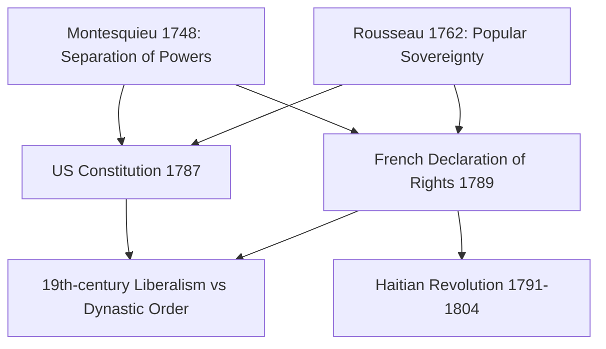

# Concept-Book Run

domain: /home/papagame/projects/digital-duck/conceptbook-app/public/domains/Users/200years_7powers_ch00/input/graph.yaml
target: french_revolution_1789
started: 2026-09-28T02:11:22

## Teaching order (4 concepts)

- enlightenment_philosophy_1748
- seven_years_war_1756
- american_revolution_1775
- french_revolution_1789

### enlightenment_philosophy_1748 (16.9s)

## Enlightenment Philosophy 1748

The Enlightenment gave revolutionaries their political vocabulary. Two texts mattered most. Montesquieu's *The Spirit of the Laws* (1748) argued that liberty survives only when the power to make laws, enforce them, and judge disputes are held by separate bodies that check one another — his reading of the English constitution, generalized into a warning against concentrating authority in one person or institution. Jean-Jacques Rousseau's *The Social Contract* (1762) went further: legitimate government exists only because free individuals consent to it, surrendering some natural liberty in exchange for civil order and equal citizenship. A king who rules by birthright alone, on this view, rules without legitimate authority — a direct challenge to divine-right monarchy as practiced across 18th-century Europe.

These were not abstract classroom exercises; they were read by the men who wrote founding documents. The framers of the United States Constitution (1787) split government into legislative, executive, and judicial branches explicitly citing Montesquieu. The French National Assembly's Declaration of the Rights of Man and of the Citizen (1789) opened by grounding law in "the general will" — Rousseau's own term. In Saint-Domingue, Haitian revolutionaries invoked the same declaration's promise of universal rights to demand it apply to enslaved and free people of color alike, culminating in the 1804 founding of Haiti as the first state born of a successful slave revolt.

Consider the problem these ideas solved: 18th-century France in 1789 carried a national debt exceeding 4 billion livres, a tax system that exempted the nobility and clergy while burdening peasants and the bourgeoisie, and an absolute monarch (Louis XVI) who could jail subjects without trial by royal decree (lettre de cachet). Enlightenment philosophy supplied the reformers a working alternative: write down which body holds which power, and root that arrangement in the consent of the governed rather than inherited status. That template — separated powers plus popular sovereignty — became the shared design used, adapted, or fought over in constitutions from Philadelphia to Paris to Port-au-Prince, and it defined the 19th-century contest between liberal constitutionalists and the surviving dynastic monarchies of Austria, Prussia, and Russia.

*How Montesquieu's and Rousseau's core ideas fed into three founding revolutionary documents and the century-long conflict that followed.*

### seven_years_war_1756 (12.4s)

## Seven Years War 1756

The Seven Years' War (1756–1763) was fought on five continents — Europe, North America, the Caribbean, West Africa, India, and the Philippines — making it a strong candidate for history's first true world war, predating World War I by over 150 years. In Europe it pitted Prussia and Britain against France, Austria, Russia, and Sweden; in North America the same conflict is known as the French and Indian War. The stakes were colonial supremacy and continental balance of power, and the outcome reshaped both.

Consider the war's two decisive theaters. In North America, British General James Wolfe defeated French forces under the Marquis de Montcalm at the Battle of Quebec in September 1759 — both commanders died in the fighting — opening the way for Britain to seize all of New France. The 1763 Treaty of Paris confirmed the transfer: France ceded Canada and all territory east of the Mississippi to Britain, keeping only small Caribbean sugar islands and fishing rights off Newfoundland. In India, Robert Clive's victory at Plassey in 1757 broke French-backed Bengali resistance and gave the British East India Company effective control over Bengal, the wealthiest province in the subcontinent — a foothold that expanded into control of most of India within a century.

The financial consequences proved as important as the territorial ones. France emerged from the war with a debt exceeding 1 billion livres, more than double its annual revenue, having spent heavily on a navy and army it ultimately could not sustain. This debt compounded through the 1770s and 1780s — worsened by France's costly support of the American Revolution — until by 1789 nearly half the royal budget went to debt service alone. That fiscal crisis forced Louis XVI to convene the Estates-General, the meeting that triggered the French Revolution.

To evaluate the war's significance, compare it against the alternative: had France retained Canada and Bengal, its treasury would have carried colonial revenue rather than colonial debt, and the political calendar of 1789 might have unfolded very differently. This is the historian's counterfactual test — tracing a single military campaign's fiscal residue forward three decades to a revolution — and it illustrates how battlefield outcomes in one era can determine political outcomes in the next.

### american_revolution_1775 (14.5s)

## American Revolution 1775

By 1775, the thirteen British colonies in North America had accumulated a specific set of grievances that Enlightenment philosophy gave them the vocabulary to name. Britain's Seven Years' War victory over France (1763) had doubled the national debt to roughly £130 million, and Parliament responded with revenue measures aimed at the colonies: the Stamp Act (1765), the Townshend Acts (1767), and the Tea Act (1773). Colonists objected not merely to the taxes but to the principle behind them — "no taxation without representation" — a direct application of John Locke's argument that legitimate government requires the consent of the governed. When fighting broke out at Lexington and Concord in April 1775, the colonies were not yet arguing for independence; they were arguing that Parliament had violated its own constitutional compact.

The move from grievance to revolution required a theoretical bridge, and Thomas Jefferson supplied it in the Declaration of Independence (July 4, 1776). Drawing almost verbatim on Locke's *Second Treatise of Government*, Jefferson asserted that governments derive "just powers from the consent of the governed" and that when a government becomes destructive of natural rights — "life, liberty, and the pursuit of happiness" — the people retain the right to abolish it. This was not a call for reform within the British system but a claim to a sovereign right to build a new one.

Winning that claim militarily seemed improbable: Britain fielded the world's largest navy and a professional army against a colonial militia with no standing army or treasury. The turning point was diplomatic rather than tactical. After the American victory at Saratoga (1777) demonstrated the rebellion's viability, France — still smarting from its 1763 losses — signed a formal alliance with the United States in 1778, followed by Spain and the Netherlands. French money, arms, and naval support (decisive at the Siege of Yorktown, 1781) tipped the balance, but at a cost: France's war expenditure, layered on Seven Years' War debt, pushed royal finances toward the crisis that erupted in 1789.

The resulting Treaty of Paris (1783) recognized American independence and established, for the first time, a large-scale republic built explicitly on Enlightenment constitutional principles — proof, to reformers and revolutionaries in France, Latin America, and beyond, that such principles could survive contact with military and political reality.

### french_revolution_1789 (14.0s)

## French Revolution 1789

By 1789 the French monarchy faced bankruptcy — decades of war spending, including support for the American Revolution, had pushed the crown into debt equal to roughly half of annual state revenue, while an outdated tax system exempted the nobility and clergy from most direct taxes. When King Louis XVI convened the Estates-General in May 1789 to approve new taxes, the Third Estate (commoners, about 97% of the population) demanded voting by head rather than by order, was rebuffed, and broke away to form a National Assembly, swearing the Tennis Court Oath on June 20 to write a constitution. On July 14, Parisians stormed the Bastille fortress-prison, a symbolic act against royal authority that triggered peasant uprisings across the countryside. Within weeks the National Assembly abolished feudal privileges (August 4) and adopted the Declaration of the Rights of Man and of the Citizen (August 26), asserting that all men are born free and equal in rights and that sovereignty resides in the nation rather than the king.

Worked example: compare the Declaration of the Rights of Man to the American Declaration of Independence, drafted thirteen years earlier. Both proclaim natural rights and popular sovereignty, but the French document goes further institutionally — it was written not to justify separation from a distant crown but to serve as the preamble for a new domestic constitution, meaning it directly restructured law, property, and citizenship inside France itself. This is why its influence spread so quickly to other European states with entrenched aristocracies: it was a ready-made legal template, not just a philosophical statement.

Problem-solving application: when analyzing why the Revolution radicalized after 1792 — the execution of Louis XVI in January 1793, the Terror's roughly 17,000 official executions through 1794, and the rise of Napoleon by 1799 — avoid treating this as a single continuous outcome of the 1789 principles. Instead, trace it as a sequence of contingent crises: foreign wars against Austria and Prussia beginning April 1792 created fears of invasion and internal treason, which the Committee of Public Safety used to justify emergency powers. Distinguishing the founding ideals (1789) from the wartime radicalization (1792–94) is the key analytical move historians use to explain why revolutions with liberal origins can produce authoritarian phases.

## Run complete

total: 64.1s
