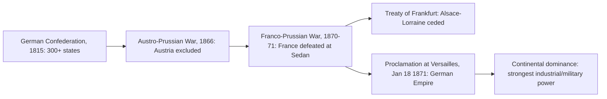

# Concept-Book Run

domain: /home/papagame/projects/digital-duck/conceptbook-app/public/domains/Users/200years_7powers_ch08/input/graph.yaml
target: science_haber_bosch_and_wwi_length
started: 2026-09-28T02:11:58

## Teaching order (9 concepts)

- science_faraday_darwin_era
- german_unification_1871
- great_power_rivalry
- science_darwinism_and_germ_theory
- germany_weltpolitik_rivalry
- science_electrification_and_chemistry
- germany_wwi_defeat
- science_haber_bosch_and_aviation
- science_haber_bosch_and_wwi_length

### science_faraday_darwin_era (16.4s)

## Science Faraday Darwin Era

By 1845 three separate scientific threads were converging toward a transformation of industry, medicine, and warfare that none of their originators fully anticipated. Michael Faraday's 1831 discovery of electromagnetic induction — that a changing magnetic field generates an electric current in a nearby conductor — supplied the physical principle behind every generator, transformer, and electric motor built afterward. Faraday summarized the relationship between the induced electromotive force and the rate of change of magnetic flux through a circuit:

$$
\varepsilon = -\frac{d\Phi_B}{dt}
$$

Here $\varepsilon$ is the induced voltage and $\Phi_B$ the magnetic flux through the circuit; the negative sign (formalized later by Heinrich Lenz) states that the induced current opposes the change that created it. Faraday, self-taught and without formal mathematical training, demonstrated the effect experimentally at the Royal Institution rather than deriving it — the mathematics came later from James Clerk Maxwell.

Meanwhile Charles Darwin, having returned from the five-year voyage of HMS Beagle in 1836, was privately compiling the evidence — Galápagos finch variation, fossil succession in South America, geographic distribution of species — that would become "On the Origin of Species," not published until 1859. In 1845 he was still corresponding cautiously with fellow naturalists like Joseph Hooker, aware that a mechanism for species change would collide with prevailing religious and scientific orthodoxy.

In parallel, German and British chemists — Justus von Liebig in Giessen, August Wilhelm von Hofmann in London — were systematizing organic chemistry and coal-tar derivatives, laying groundwork that would yield synthetic dyes, fertilizers, and eventually explosives. The periodic law itself was two decades away (Mendeleev, 1869), but the practice of classifying elements by atomic weight was already underway through the work of Jöns Jacob Berzelius and others.

None of these three threads had yet produced a visible technology in 1845 — no power grid, no evolutionary biology curriculum, no synthetic chemical industry. The lag between discovery and application is itself a historical pattern: Faraday's principle took forty years to become Edison's and Tesla's power systems; Darwin's evidence sat unpublished for fourteen years after his return. Recognizing this incubation period is essential to understanding why the scientific revolutions of the mid-1800s only reshaped the visible world after 1870.

### german_unification_1871 (15.4s)

## German Unification 1871

For most of its history, "Germany" was a geographic expression, not a state — a patchwork of over 300 sovereign kingdoms, duchies, and free cities loosely bound after 1815 in the German Confederation. Prussian minister-president Otto von Bismarck engineered unification not through parliamentary debate but through what he called "blood and iron": three deliberately provoked wars that isolated Austria, absorbed the smaller German states into a Prussian-led bloc, and finally united north and south Germans against a common enemy, France. The Austro-Prussian War (1866) excluded Austria from German affairs in seven weeks. The decisive step was the Franco-Prussian War (1870–1871): Bismarck edited a diplomatic telegram (the Ems Dispatch) to provoke France into declaring war, then watched Prussian and allied German armies encircle and capture Emperor Napoleon III at Sedan on September 2, 1870, with over 100,000 French troops taken prisoner. Paris fell after a four-month siege.

On January 18, 1871, in the Hall of Mirrors at the Palace of Versailles — a deliberate humiliation of the defeated host nation — the German princes proclaimed Prussian King Wilhelm I as Kaiser of a unified German Empire. The Treaty of Frankfurt (May 1871) then forced France to cede Alsace-Lorraine and pay an indemnity of 5 billion francs. Overnight, a nation of roughly 41 million people, controlling the coal and steel of the Ruhr and Alsace-Lorraine combined, became continental Europe's largest industrial and military power, soon overtaking Britain in steel production by the 1890s.

The historical lesson for problem-solving is about reading strategic sequencing: Bismarck's wars were not fought at random but in a deliberate order — first isolate the target diplomatically, then defeat it before other powers can intervene. Applying this framework to prediction: given that unification made Germany dominant but left France resentful and revanchist over Alsace-Lorraine, and left Bismarck's successors without his restraint on further expansion, historians identify 1871 as the structural precondition for the alliance systems and arms race that produced World War I in 1914 — the new power's rise had unbalanced a continental order built on multiple roughly equal states.

*Sequence from fragmented confederation to unified empire through Bismarck's wars.*

### great_power_rivalry (17.5s)

## Great Power Rivalry

By the 1880s, the major European powers—Britain, France, Germany, Russia, and later Italy and Japan—had adopted a shared assumption: national greatness was measured by territorial extent, industrial output, and naval strength, and any power that stood still while rivals expanded was, in effect, declining. This was great power rivalry: a system in which colonies, resources, and prestige became competitive currency rather than incidental gains. Germany's unification in 1871 under Bismarck upset the existing balance, and by 1898 Kaiser Wilhelm II's pursuit of "a place in the sun" pushed Germany into a naval race with Britain, whose Royal Navy had guaranteed uncontested maritime supremacy since Trafalgar. Between 1898 and 1914, Britain and Germany each built successive generations of dreadnought battleships—Britain alone laid down 29—driven not by an immediate military threat but by the conviction that fleet size itself signaled power.

A concrete case is the Scramble for Africa. In 1870, European states controlled about 10 percent of the African continent; by 1914, they controlled nearly 90 percent. The 1884–85 Berlin Conference, convened by Bismarck, formalized rules for partitioning African territory among European claimants without African representation at the table. France and Britain nearly went to war over the Sudan in the 1898 Fashing Fashoda incident, where a French expedition met a British force at Fashoda on the Nile; France ultimately withdrew, but the episode shows how colonial claims—not always of great economic value—could trigger a crisis between great powers because backing down was seen as a loss of prestige, not just territory.

To analyze any instance of great power rivalry, ask three questions: What tangible resource or strategic asset is contested (a coaling station, mineral rights, a trade route)? What domestic political or economic pressure pushes leaders to compete rather than negotiate (industrial capacity, public opinion, a rising middle class demanding results)? And what alliance commitments turn a bilateral dispute into a multilateral one? Applying this framework to the 1905 and 1911 Moroccan crises reveals the same pattern as the Fashoda incident: Germany challenged French claims in Morocco largely to test the Anglo-French Entente Cordiale of 1904, not because Morocco itself was economically vital to Berlin. Recognizing this distinction—between the stated object of a dispute and its real function as a test of alliance strength—is the essential analytical skill for understanding how rivalry escalated toward the alliance system that produced war in 1914.

### science_darwinism_and_germ_theory (14.0s)

## Science Darwinism And Germ Theory

Between 1859 and 1883, two independent scientific revolutions transformed how societies understood life, disease, and human difference — and one of them was almost immediately twisted into a political weapon.

In 1859, Charles Darwin published *On the Origin of Species*, presenting evidence that species change over time through natural selection: individuals with heritable traits better suited to their environment survive and reproduce more successfully, gradually reshaping populations. This overturned the prevailing view that species were fixed since creation. Darwin's evidence came from comparative anatomy, fossil records, and his own observations of finches and tortoises during the *Beagle* voyage (1831–1836). The theory reshaped biology, geology, and eventually anthropology.

At nearly the same time, Louis Pasteur in France and Robert Koch in Germany independently established germ theory — the finding that specific microorganisms cause specific diseases, replacing older ideas like miasma (disease from "bad air"). Pasteur's 1861 experiments disproved spontaneous generation and led to pasteurization; Koch's postulates (1876–1884) provided a rigorous method for linking a specific bacterium to a specific illness, starting with anthrax and later tuberculosis (1882) and cholera (1883). Together, these findings founded modern medicine: antiseptic surgery, vaccination programs, and public sanitation systems that dramatically cut mortality from infectious disease in industrializing nations over the following decades.

Darwin's biological theory, however, was soon misapplied far beyond biology. Herbert Spencer coined "survival of the fittest" and extended it into Social Darwinism — the claim that human societies, races, and classes were locked in a natural competition in which the "fit" rightly dominated the "unfit." This was a distortion of Darwin's own argument, which described biological populations, not moral or political hierarchies. Yet Social Darwinism was seized upon by European and American elites in the late nineteenth century to justify imperial conquest in Africa and Asia, racial segregation, and opposition to social welfare, framing colonial domination and inequality as natural law rather than policy choice.

Evaluating historical claims that invoke "science" requires the same discipline in both cases: check whether the evidence supports the stated mechanism. Germ theory could be tested directly — isolate a bacterium, infect a host, observe the disease, as Koch's postulates required — and it produced measurable results, such as sharp declines in surgical mortality after antiseptic techniques spread through European hospitals in the 1870s–1880s. Social Darwinism, by contrast, made no testable predictions; it functioned as a rationalization applied after the fact to justify decisions — imperialism, inequality — that were driven by economic and political interests, not biological evidence.

### germany_weltpolitik_rivalry (23.2s)

## Germany Weltpolitik Rivalry

After Germany's unification in 1871, Chancellor Otto von Bismarck pursued a deliberately cautious foreign policy: he declared Germany "satisfied" as a power, avoided colonial adventures that might provoke Britain, and built a web of alliances (the Dual Alliance with Austria-Hungary, the Reinsurance Treaty with Russia) designed to keep France isolated and Europe stable. When the young Kaiser Wilhelm II dismissed Bismarck in 1890, this restraint ended. Wilhelm and his advisors adopted Weltpolitik ("world policy"), a program aimed at securing Germany a colonial empire and global influence commensurate with its industrial and military strength — rivaling Britain and France as a world, not merely European, power.

The clearest instrument of Weltpolitik was naval expansion. Admiral Alfred von Tirpitz's Navy Laws (1898, 1900, 1906, 1908, 1912) authorized a High Seas Fleet explicitly intended to challenge British naval supremacy: by 1914 Germany had built 17 dreadnought-class battleships against Britain's 29, a gap Britain worked hard to preserve by outbuilding Germany ship for ship. This naval race, more than any single colonial dispute, alarmed Britain because it directly threatened the Royal Navy's control of the sea lanes on which the British Empire depended.

Weltpolitik also produced repeated diplomatic crises. In the First Moroccan Crisis (1905), Wilhelm landed at Tangier and declared support for Moroccan independence, directly challenging French colonial claims and testing the recently signed Anglo-French Entente Cordiale (1904). Britain backed France at the Algeciras Conference (1906), leaving Germany diplomatically isolated. In the Second Moroccan Crisis (1911), Germany sent the gunboat Panther to Agadir to pressure France into territorial concessions in the Congo; Britain again sided with France, and Germany received only a small strip of French Equatorial Africa in compromise.

The problem-solving lesson for students of this period is one of strategic miscalculation: Weltpolitik aimed to win Germany prestige and security through displays of strength, but each crisis instead pushed Britain and France closer together and hardened British public opinion against Germany. By abandoning Bismarck's policy of reassurance for one of confrontation, Wilhelm's Germany converted potential rivals into an increasingly unified opposing coalition — a pattern of escalation without resolution that historians trace directly into the alliance blocs of 1914.

### science_electrification_and_chemistry (27.6s)

## Science Electrification And Chemistry

Between 1865 and 1895, physics and chemistry each produced a unifying framework that put practical technology on a rigorous footing. In 1865, James Clerk Maxwell published equations showing that electricity, magnetism, and light are a single phenomenon:

$$\nabla \cdot \mathbf{E} = \frac{\rho}{\varepsilon_0}, \quad \nabla \cdot \mathbf{B} = 0, \quad \nabla \times \mathbf{E} = -\frac{\partial \mathbf{B}}{\partial t}, \quad \nabla \times \mathbf{B} = \mu_0 \mathbf{J} + \mu_0 \varepsilon_0 \frac{\partial \mathbf{E}}{\partial t}$$

These four relations explain why a changing magnetic field induces current — the principle behind every generator and transformer built in the following decades. In 1869, Dmitri Mendeleev arranged the known elements by atomic weight and recurring properties, leaving deliberate gaps; his predictions for the missing elements (later named gallium, germanium, and scandium) were confirmed within 15 years, proving chemistry had become predictive rather than merely descriptive.

**Worked example.** Thomas Edison's Pearl Street Station (New York, 1882) delivered direct current (DC) to 59 customers and about 800 lamps, but DC loses power rapidly over distance and could not be stepped up in voltage. Nikola Tesla and George Westinghouse exploited Maxwell's induction principle directly: alternating current (AC) can be transformed to high voltage for transmission and back down for safe use, cutting transmission losses over long distances. By 1896, AC power from Niagara Falls reached Buffalo, 20 miles away — a feat DC could not match. The "War of Currents" was decided by physics, not marketing.

**Application.** This period also shows why nations industrialize differently. Germany's universities trained chemists who moved directly into corporate laboratories (BASF, Bayer), turning Mendeleev's table into synthetic dyes and, later, industrial ammonia — a science-to-factory pipeline. The United States, lacking Germany's university-industry chemistry link, instead built infrastructure-scale enterprises: Edison's Menlo Park (1876) was the first dedicated industrial research lab, and Bell's telephone patent (1876) created an entire communications industry. Comparing patent counts, corporate R&D spending, and electrification rates between the two countries in this era explains why Germany led in chemicals while the US led in electrical and telecommunication infrastructure — a divergence with lasting economic consequences into the twentieth century.

### germany_wwi_defeat (13.7s)

## Germany Wwi Defeat

Germany's pursuit of world-power status did not stay confined to naval competition and colonial rivalry — it shaped the decisions that turned a regional Balkan crisis into a continental war, and the manner of Germany's defeat then shaped the peace that followed for two decades. On July 5, 1914, German Chancellor Theobald von Bethmann-Hollweg issued the so-called "blank check," assuring Austria-Hungary of unconditional German support for punitive action against Serbia after the assassination of Archduke Franz Ferdinand. This encouragement removed Vienna's restraint and set the July Crisis in motion. When war began, Germany's own war plan (the Schlieffen Plan) required a rapid strike through neutral Belgium to knock France out before turning against Russia — the invasion that violated the 1839 Treaty of London guaranteeing Belgian neutrality and brought Britain into the war on August 4, 1914.

Four years of trench warfare, a failed 1918 spring offensive, and the collapse of the German home front under naval blockade and food shortages left Germany unable to continue fighting. An armistice took effect on November 11, 1918, followed by the Treaty of Versailles, signed June 28, 1919. Article 231 assigned Germany sole responsibility for the war — the "war guilt clause" — providing the legal basis for reparations later fixed at 132 billion gold marks. Germany lost roughly 13 percent of its prewar territory, including Alsace-Lorraine to France and territory to the reconstituted Poland, along with its overseas colonies, and its army was capped at 100,000 men.

Consider the causal chain a historian must trace to explain the war's origin: without the blank check, Austria-Hungary likely could not have risked a punitive war against Serbia without provoking Russian intervention alone; without the Belgian invasion, Britain's declaration of war was far less certain, since British commitment to France was not yet a binding alliance obligation in 1914. Evaluating counterfactuals like these — which decision was necessary, which was sufficient — is the core skill of diplomatic history, and it is exactly the method used to assess why the Versailles settlement's harshness toward Germany later became a grievance exploited by Weimar-era nationalist politics.

### science_haber_bosch_and_aviation (14.1s)

## Science Haber Bosch And Aviation

Nitrogen fixation is the process of converting nitrogen gas from the atmosphere into a chemical form that plants and industry can use. Nitrogen makes up 78 percent of Earth's air, but as the inert $N_2$ molecule it is useless to living organisms until it is bonded with hydrogen or oxygen. Before 1909, the only large-scale source of fixed nitrogen for fertilizer and explosives was mined sodium nitrate from Chile — a supply line entirely dependent on ocean shipping. In 1909, German chemist Fritz Haber demonstrated a way to synthesize ammonia ($NH_3$) directly from nitrogen and hydrogen gas under high pressure and heat with a metal catalyst; engineer Carl Bosch then scaled this laboratory reaction into an industrial plant, completed by BASF in 1913. The reaction is:

$$N_2 + 3H_2 \rightarrow 2NH_3$$

Ammonia is the feedstock both for nitrate fertilizers and for nitric acid, the precursor to explosives such as TNT. This dual use turned a chemistry breakthrough into a strategic asset.

The application became urgent almost immediately. When World War I began in August 1914, the Royal Navy imposed a blockade on Germany, cutting off its Chilean nitrate imports within months. Without an alternative nitrogen source, Germany's ability to manufacture explosives would have collapsed by 1915 — a scenario British planners expected would shorten the war considerably. Instead, German industry redirected Haber-Bosch ammonia production toward nitric acid and explosives, and the plants at Oppau and later Leuna kept German artillery supplied through four more years of war, an estimated 20 million tons of ordnance fired on the Western Front alone by 1918. The same infrastructure, redirected to fertilizer after 1918, is credited with sustaining roughly half the world's current food-growing capacity, since synthetic nitrogen fertilizer dramatically raised crop yields per acre worldwide over the following century.

This episode illustrates a recurring problem-solving lesson in the history of technology: a single scientific process can simultaneously solve a civilian problem (food scarcity) and a military problem (explosives supply), and which application dominates first often depends on the geopolitical pressure of the moment — here, a naval blockade — rather than the intent of the original inventors.

### science_haber_bosch_and_wwi_length (15.3s)

## Science Haber Bosch And Wwi Length

Before 1914, Germany's explosives and fertilizer industries both depended on one raw material: sodium nitrate mined in the Atacama Desert of Chile. This dependence was a strategic vulnerability, and Britain knew it. When the Royal Navy imposed a naval blockade on Germany at the outbreak of World War I, it aimed to cut off exactly this kind of import — expecting that within months, Germany would run out of nitrates for both gunpowder and crop fertilizer, forcing an early collapse of its war effort and its food supply.

That collapse did not happen, because of a laboratory discovery made just a few years earlier. In 1909, the chemist Fritz Haber demonstrated a process for synthesizing ammonia directly from atmospheric nitrogen and hydrogen gas, using high pressure, high temperature, and a metal catalyst. The German chemical company BASF, under the engineer Carl Bosch, scaled this reaction from a benchtop apparatus into an industrial plant — the Oppau facility, operational by 1913. The resulting Haber-Bosch process could fix nitrogen from the air itself, making Germany's explosives supply independent of any imported ore or any blockade.

The timing is the historically significant part. Had the Haber-Bosch process not existed, Germany's stockpiled nitrate reserves in 1914 were expected to last only a matter of months. Historians estimate that without synthetic ammonia, Germany would have exhausted its capacity to manufacture explosives by sometime in 1915, well before either side had achieved a decisive outcome on the Western Front. Instead, German munitions production continued at scale for the war's full four years, because Oppau and a second plant at Leuna converted atmospheric nitrogen into the ammonium compounds used for both explosives and fertilizer.

This is a case in which a single chemical innovation intersects two separate historical narratives at the same moment: it belongs to the history of science, as a landmark achievement in industrial chemistry that later won Haber a Nobel Prize, and simultaneously belongs to the history of Germany's war effort, as the material precondition that let the country's army keep fighting past the point where its stockpiled resources should have run out. Evaluating either narrative in isolation — the chemistry without the war, or the war without the chemistry — misses the causal link between them: a scientific reaction developed for peacetime fertilizer production became, by circumstance of timing, the reason a nation could sustain a war it might otherwise have been forced to end early.

## Run complete

total: 180.4s
