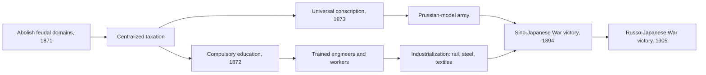
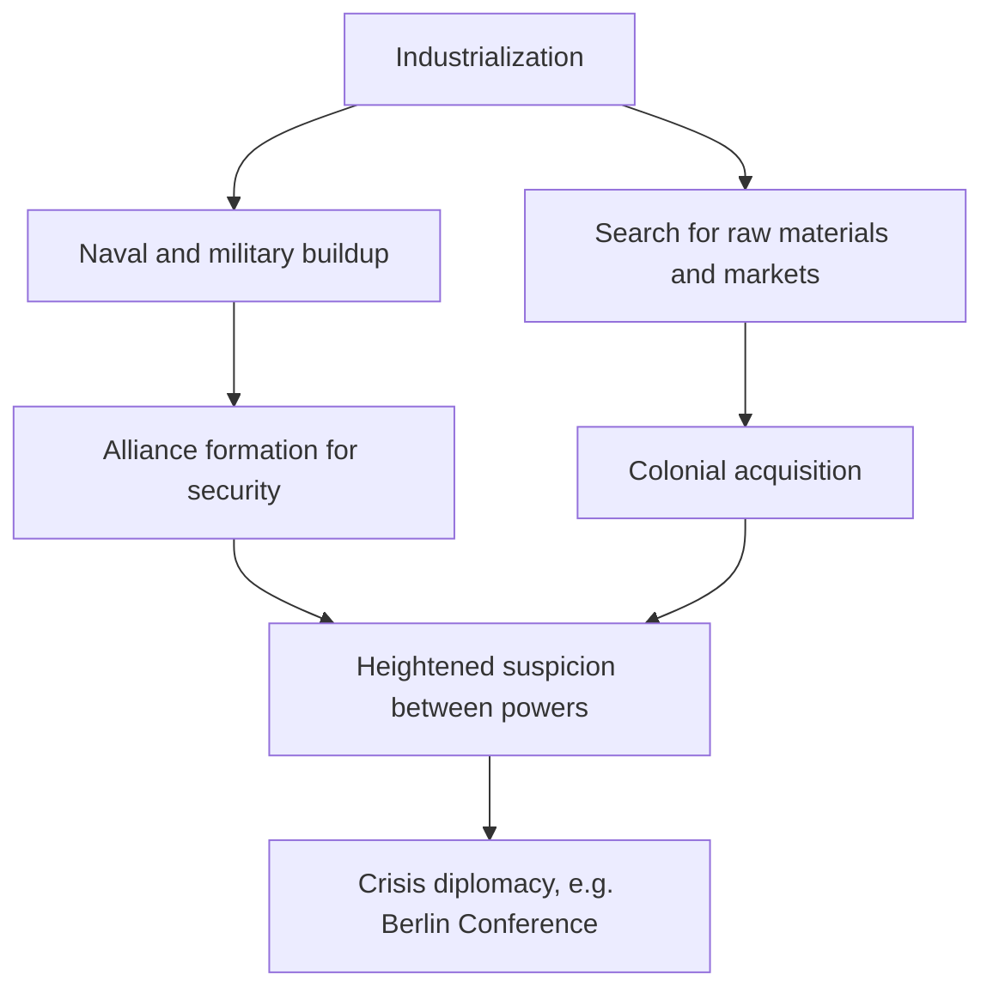
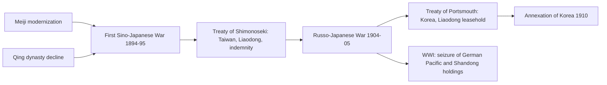
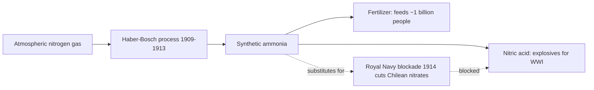

# Concept-Book Run

domain: /home/papagame/projects/digital-duck/conceptbook-app/public/domains/Users/200years_7powers_ch08/input/graph.yaml
target: science_nuclear_ends_pacific_war
started: 2026-09-28T02:15:00

## Teaching order (24 concepts)

- meiji_restoration
- science_faraday_darwin_era
- japan_meiji_modernization
- science_darwinism_and_germ_theory
- us_gilded_age
- german_unification_1871
- great_power_rivalry
- qing_dynasty_decline
- science_electrification_and_chemistry
- us_industrial_rise
- japan_imperial_expansion
- japan_prussian_model_emulation
- us_overseas_imperialism
- japan_depression_militarism
- science_haber_bosch_and_aviation
- science_radioactivity_and_quantum
- us_wwi_and_isolationism
- japan_china_war
- science_penicillin_and_nuclear_fission
- us_great_depression
- japan_pacific_war_defeat
- science_atomic_bomb_1945
- us_arsenal_of_democracy
- science_nuclear_ends_pacific_war

### meiji_restoration (14.3s)

## Meiji Restoration

In 1868, a coalition of samurai from the Satsuma and Choshu domains overthrew the Tokugawa shogunate, the military government that had ruled Japan since 1603, and restored formal political power to the young Emperor Meiji. Unlike most revolutions, which topple old elites in the name of the common people, this one was led by regional aristocrats who used the emperor's name to legitimize sweeping modernization. Within two decades, the new government abolished the feudal domain system, dismantled the hereditary samurai class, adopted a Western-style constitution (1889), built a national army through conscription, and financed state-led industrialization in textiles, shipbuilding, and railways. The driving fear was concrete: China's defeat in the Opium Wars (1839–1842) and the arrival of Commodore Matthew Perry's American fleet in 1853, which forced Japan to open its ports under unequal treaties, showed Japanese leaders that a weak, disunited country would be colonized like its neighbors.

A worked example clarifies how deliberate this transformation was. In 1871, the government sent the Iwakura Mission — a delegation of nearly fifty officials — on a two-year tour of the United States and Europe to study Western institutions directly. They returned having selected specific models: a German-style army, a British-style navy, a French-inspired legal code, and an American-style public education system. This was not passive Westernization but selective, comparative institution-shopping, and it produced measurable results — by 1895, Japan defeated Qing China in the First Sino-Japanese War, and by 1905, it defeated Russia, the first modern military victory of an Asian power over a European one.

To analyze historical causation, ask: why did Japan modernize successfully while other non-Western states, such as Qing China or the Ottoman Empire, modernized more slowly in this period? Compare their starting conditions using evidence: Japan had a unified population, a preexisting literate bureaucratic class (former samurai retrained as administrators), and no internal population comparable to China's task of governing over 400 million people across a vastly larger territory. Applying this comparison to a broader question—why do some crisis-driven reform movements succeed while others stall—requires weighing centralized political will, administrative capacity, and social cohesion as the determining historical variables, not any single reform decree.

### science_faraday_darwin_era (14.8s)

## Science Faraday Darwin Era

By 1845, three scientific threads are converging that will define the next century's material and intellectual world. Michael Faraday's 1831 discovery of electromagnetic induction — that a moving magnet generates an electric current in a nearby coil — turned electricity from a laboratory curiosity into a controllable, transmissible force. Faraday had no advanced mathematics; he worked by systematic experiment, and his notebooks record the induction effect in plain descriptive terms rather than equations. It would fall to James Clerk Maxwell, two decades later, to express the relationship formally. Meanwhile Charles Darwin, home since 1836 from the five-year voyage of HMS Beagle, has assembled overwhelming evidence — fossil succession in South America, the finches and tortoises of the Galápagos, the geographic distribution of related species — for the transmutation of species. He holds off publishing, aware the idea will collide with prevailing religious and social orthodoxy; "On the Origin of Species" will not appear until 1859. In parallel, German and British chemists are cataloguing elements and compounds at industrial scale: coal-tar dyes, sulfuric acid manufacture, and fertilizer chemistry are turning laboratories into factories, laying groundwork for the systematic ordering that Dmitri Mendeleev will complete in 1869 with the periodic table.

What connects these three threads is not a shared law but a shared method: controlled experiment, careful measurement, and public verification, applied without deference to inherited authority. This is the same method that, a generation later, converts Faraday's induction into the dynamo and the electric grid, converts Darwin's quiet notebooks into a public reordering of humanity's place in nature, and converts industrial chemistry into synthetic explosives and pharmaceuticals. The lag between discovery and consequence is the pattern worth tracking: Faraday's 1831 finding takes roughly fifty years to reach Edison and Tesla's power stations; Darwin's decade of silent evidence-gathering takes fourteen years to reach print, then another generation to reshape biology, medicine, and social theory (not always for the better, as eugenics later shows). Reading 1845 forward, the historian's task is to trace how a single insight — induction, common descent, elemental order — moves from a private notebook to a factory floor or a battlefield, and how long that migration takes before it changes the balance of power among nations.

### japan_meiji_modernization (17.0s)

## Japan Meiji Modernization

When the Meiji government abolished Japan's feudal domains in 1871 and replaced them with centrally administered prefectures, it eliminated the political structure that had governed the country for over two and a half centuries under the Tokugawa shogunate. In its place, a small group of former samurai from Satsuma and Choshu built a centralized state modeled explicitly on Western institutions. Within roughly one generation — from 1868 to the mid-1890s — Japan replaced hereditary samurai armies with universal male conscription (the 1873 Conscription Law), replaced domain taxation with a uniform national land tax, and replaced artisanal manufacturing with state-sponsored heavy industry, railroads, and a modern banking system.

The speed of this transformation is best illustrated by a single case: the Tomioka Silk Mill, opened in 1872 with French machinery and French technical advisors, trained Japanese engineers who then built and operated mills across the country without foreign supervision within a decade. The same pattern repeated in shipbuilding, steel, and the military: Japan imported a technology or institution, sent students and officials abroad to master it (the Iwakura Mission of 1871–73 toured the United States and Europe for two years studying government, industry, and education), then localized and scaled it domestically. By 1894, this newly built military — a conscript army trained on Prussian doctrine and a navy built partly in Japanese shipyards — defeated Qing China in the First Sino-Japanese War, and by 1905 it defeated Russia, the first modern military victory of an Asian power over a European one.

The problem-solving lesson generalizes beyond Japan: rapid modernization requires sequencing, not just import of parts. Meiji leaders did not simply buy Western guns and ships; they first restructured taxation and land ownership to fund the state, then built a conscript-based manpower system, then education (compulsory schooling from 1872) to supply literate workers and technicians, and only then scaled industry and military hardware. A state that imports technology without first securing revenue and trained personnel to sustain it typically cannot maintain the technology after the initial transfer — a pattern visible by contrast in several 19th-century modernization attempts elsewhere in Asia and the Middle East that stalled for lack of matching institutional reform.

*Sequence of institutional reforms underlying Japan's Meiji-era military and industrial modernization.*

### science_darwinism_and_germ_theory (21.9s)

## Science Darwinism And Germ Theory

Between 1859 and 1883, two independent scientific revolutions transformed how humans understood life and disease — and a third, ideological movement misused one of them to justify empire.

In 1859, Charles Darwin published *On the Origin of Species*, presenting evidence that species change over time through natural selection: individuals with heritable traits better suited to their environment survive and reproduce at higher rates, gradually reshaping populations. This overturned the prevailing view that species were fixed at creation, and it reframed biology, geology, and even human origins around a shared evolutionary history documented in the fossil record, comparative anatomy, and biogeography.

At nearly the same time, Louis Pasteur and Robert Koch established germ theory — the finding that specific microorganisms cause specific diseases. Pasteur's experiments in the 1860s disproved spontaneous generation and led to pasteurization; Koch's 1876 identification of the anthrax bacillus, followed by his isolation of the tuberculosis bacterium (1882) and cholera bacterium (1883), gave doctors a rigorous method (Koch's postulates) for proving that a given microbe causes a given illness. Together these discoveries founded modern medicine and public health: understanding disease as caused by identifiable, controllable organisms enabled sanitation reform, vaccination programs, and antiseptic surgery, which cut mortality rates dramatically in industrializing cities during the late nineteenth century.

**Worked example.** Before germ theory, hospital surgical mortality from infection often exceeded 40–50 percent in some wards. After surgeons like Joseph Lister applied antiseptic techniques informed by Pasteur's findings in the 1870s, infection-related deaths fell sharply within a decade — a measurable, documented public-health outcome directly traceable to accepting germ theory as fact rather than treating disease as caused by "bad air" or moral failing.

**Application and consequence.** Darwin's biology was quickly distorted by so-called Social Darwinists, who applied "survival of the fittest" — a phrase Darwin never used to describe human societies — to argue that colonized peoples, poorer classes, or entire "races" were biologically destined to be dominated. This pseudo-scientific reasoning supplied European and American imperial powers with a convenient justification for conquest and racial hierarchy, illustrating how a rigorous scientific finding can be stripped of its evidence and repurposed as political ideology.

### us_gilded_age (14.2s)

## Us Gilded Age

Between 1870 and 1890, the United States underwent an industrial transformation so rapid and so uneven that Mark Twain gave the era its name: the Gilded Age — gleaming on the surface, cheaper underneath. Railroad track mileage nearly quadrupled, from about 53,000 miles in 1870 to over 163,000 by 1890, knitting together a genuinely national market for the first time. Steel production, driven by Andrew Carnegie's adoption of the Bessemer process, rose from roughly 77,000 tons in 1870 to over 4.7 million tons by 1890. John D. Rockefeller's Standard Oil controlled about 90 percent of American oil refining by 1880. This was the period in which the "Robber Barons" — Carnegie in steel, Rockefeller in oil, Vanderbilt in railroads, J.P. Morgan in finance — built vertically and horizontally integrated monopolies (trusts) that eliminated competitors and set prices largely free of market check.

Consider the Standard Oil case as a worked example of how this consolidation actually happened. Rockefeller did not simply build better refineries; he negotiated secret rebates from railroads that lowered his shipping costs below what rivals paid for the same routes, then used the resulting price advantage to buy out or bankrupt competitors, folding their capacity into a single trust structure by 1882. The mechanism was not innovation alone but control over the infrastructure — rail — that every producer depended on.

The problem this posed for the republic was political as much as economic: could democratic government coexist with private concentrations of capital larger than most state budgets? Congress's answer, the Interstate Commerce Act of 1887 and the Sherman Antitrust Act of 1890, came late and was weakly enforced for another decade, but it established the legal precedent that the federal government could regulate interstate commerce and break up monopolistic combinations — a framework courts and regulators would use far more aggressively under Theodore Roosevelt after 1901.

What matters for the larger story of American power is the balance sheet this era left behind: by 1890 the United States had surpassed Britain and Germany in steel output and manufacturing value, converting continental resources and immigrant labor into the industrial capacity that would make possible naval expansion, overseas markets, and, within a generation, a claim to great-power status.

### german_unification_1871 (16.1s)

## German Unification 1871

Before 1871, "Germany" was a geographic expression, not a state — a patchwork of 39 sovereign German-speaking territories loosely tied together in the German Confederation, the largest being Prussia and Austria. Unification was engineered not by popular revolution but by Prussian statecraft, chiefly Chancellor Otto von Bismarck's deliberate use of war to force the smaller German states into orbit around Prussia while excluding Austria. Bismarck fought three short, decisive wars in eight years: against Denmark (1864) over Schleswig-Holstein, against Austria (1866, the Austro-Prussian War), and against France (1870–71, the Franco-Prussian War). Each war was diplomatically isolated in advance so no other great power intervened, and each ended quickly with Prussia's superior mobilization, railway logistics, and breech-loading rifles overwhelming opponents still fighting with older tactics.

The decisive blow came at the Battle of Sedan on September 1, 1870, where Prussian and allied German forces encircled the French army and captured Emperor Napoleon III himself along with roughly 100,000 troops. France's imperial government collapsed within days. With French resistance broken and southern German states (Bavaria, Württemberg, Baden) now bound to Prussia by wartime treaties, Bismarck staged the proclamation of the German Empire on January 18, 1871 — deliberately held in the Hall of Mirrors at the Palace of Versailles, a calculated humiliation of the defeated host nation. King Wilhelm I of Prussia became German Emperor (Kaiser), and Bismarck became the new empire's first chancellor.

The practical consequences were immediate and structural. The war ended with the Treaty of Frankfurt (May 1871), under which France ceded Alsace-Lorraine — a resource-rich border region with iron ore and coal — and paid an indemnity of 5 billion francs. Overnight, a unified Germany of roughly 41 million people commanded the Continent's fastest-growing industrial base in steel, chemicals, and rail, backed by a standing army built on universal conscription and a Prussian-trained officer corps. France's defeat and the loss of Alsace-Lorraine left a durable grievance — "revanchism" — that shaped French foreign policy for the next four decades and became a direct precondition for the alliance system that collapsed into the First World War in 1914.

The problem this history poses for later diplomacy is one of balance: a single unified, industrializing, militarily confident state had replaced a fragmented buffer zone at the center of Europe, and no existing treaty framework (the post-1815 Concert of Europe) was designed to accommodate a power of that new weight — a structural imbalance statesmen like Bismarck himself spent the next two decades trying, and ultimately failing, to manage through alliances alone.

### great_power_rivalry (15.5s)

## Great Power Rivalry

By the 1880s, the major European states, along with the United States and Japan, operated within a shared assumption: national greatness was measured by territorial reach, industrial output, and naval strength. This was great power rivalry — a system in which Britain, France, Germany, Russia, Austria-Hungary, Italy, the United States, and Japan competed openly for colonies, markets, and strategic advantage, treating expansion abroad as proof of strength at home. Unlike earlier eras of dynastic war, this competition was fueled by the Industrial Revolution: steel, steamships, and railroads gave states the means to project power globally, while newspapers and mass politics gave leaders incentive to publicize conquest as national achievement.

A clear case is the Scramble for Africa. In 1876, European powers controlled roughly 10 percent of the African continent; by 1900, that figure had risen to over 90 percent. The trigger was not a single war but a rush of competing claims — Belgium's King Leopold II asserting personal control over the Congo, France pushing west from Senegal, Britain expanding from Egypt to South Africa. To prevent this scramble from erupting into a European war, fourteen powers convened the Berlin Conference of 1884–1885, where they agreed on rules for dividing African territory without consulting a single African ruler or population. The conference itself is evidence of the rivalry's logic: expansion was so central to national prestige that powers preferred elaborate diplomatic bargaining over losing ground to a rival.

Applying this concept means reading a specific policy — a naval bill, a colonial annexation, a tariff — and asking what rivalry it responds to. Germany's Naval Laws of 1898 and 1900, which expanded its battleship fleet to challenge British supremacy, make sense only against Britain's two-power standard, the policy of maintaining a navy larger than the next two rivals combined. Britain's alarm and its resulting shift toward alliances with France and Russia becomes explicable once you locate it inside this competitive framework rather than treating it as an isolated defense decision.

*How industrial growth channeled great powers toward competing buildups, colonial expansion, and alliance-driven tension.*

### qing_dynasty_decline (13.4s)

## Qing Dynasty Decline

By the mid-19th century the Qing Dynasty, which had ruled China since 1644, faced a compounding crisis: military defeat by industrialized foreign powers abroad and mass rebellion at home. The First Opium War (1839–1842) exposed the gap between Qing forces — still reliant on matchlocks, war junks, and garrison troops — and British steam-powered gunboats and rifled artillery. China's defeat produced the Treaty of Nanking (1842), which ceded Hong Kong, opened five treaty ports, and imposed an indemnity of 21 million silver dollars. A Second Opium War (1856–1860), fought against a joint British-French force, ended with the burning of the Summer Palace and further concessions, including legalized opium imports and additional treaty ports. These "unequal treaties" also granted foreign powers extraterritoriality — the right of their citizens to be tried under their own laws on Chinese soil — a direct erosion of Qing sovereignty.

Simultaneously, internal collapse deepened the crisis. The Taiping Rebellion (1850–1864), led by Hong Xiuquan, who believed himself the younger brother of Jesus Christ, grew into one of the deadliest conflicts in human history, with estimated deaths of 20 to 30 million people from combat, famine, and disease. The rebellion controlled large swaths of southern China, including the former capital Nanjing, for over a decade before Qing forces, aided by regional armies and Western-supplied weapons, suppressed it.

The problem-solving lesson here is one of historical causation: how do external defeat and internal rebellion interact to accelerate imperial decline rather than occurring independently? The Opium Wars drained state revenue through indemnities and lost tariff control, weakening the Qing treasury precisely when it needed resources to fight the Taiping. Conversely, the Taiping Rebellion diverted military attention and legitimacy away from coastal defense, making China more vulnerable to further foreign encroachment — as seen when Russia annexed territory north of the Amur River in 1858 while Beijing was consumed by rebellion.

This dual crisis marks the historical turning point at which China shifted from being the object of tribute from neighboring states to being an object of "spheres of influence" carved out by Britain, France, Russia, and later Japan and Germany — a subordinate position it would not fully escape until the 20th century.

### science_electrification_and_chemistry (18.0s)

## Science Electrification And Chemistry

Between 1865 and 1895, three scientific breakthroughs converted physics and chemistry from theoretical disciplines into engines of industrial power. James Clerk Maxwell's 1865 equations showed that electricity, magnetism, and light are a single phenomenon, giving engineers a predictive theory to design generators and transmission lines rather than relying on trial and error. Dmitri Mendeleev's 1869 periodic table organized the elements by atomic weight and recurring properties, correctly predicting the existence and behavior of undiscovered elements (gallium, germanium) and giving chemists a systematic map for synthesizing new compounds — especially dyes, fertilizers, and pharmaceuticals. Thomas Edison's 1882 Pearl Street Station in New York delivered direct-current electric light to city blocks, while Nikola Tesla's alternating-current system, commercialized through George Westinghouse in the early 1890s, solved the problem of transmitting power over long distances with far less loss.

A worked example: the "War of Currents" (1888–1893). Edison's DC could not travel more than about a mile from a generator without severe voltage drop, forcing a power plant every few blocks in a city. Tesla and Westinghouse's AC system, using transformers to step voltage up for transmission and down for household use, powered the 1893 Chicago World's Fair with a single distant plant — a demonstration that settled the technical argument and set the standard still used in electrical grids today.

Applying this to industrial strategy: Germany, lacking Britain's coal-and-steam head start, invested instead in university chemistry and patent law, producing firms like BASF and Bayer that dominated synthetic dye and fertilizer production by the 1890s — supplying roughly 90 percent of the world's synthetic dyes. The United States, with vast distances and private capital willing to fund infrastructure, built out electrical grids and telephone networks (Alexander Graham Bell's 1876 patent spawned Bell Telephone, precursor to AT&T) faster than any European rival. The lesson for comparing national development paths: a country's industrial strategy follows from which scientific advantage it can convert into infrastructure fastest, not merely which advantage is technically superior.

### us_industrial_rise (14.3s)

## Us Industrial Rise

Between 1865 and 1900, the United States transformed from a predominantly agrarian republic into the world's leading industrial power. Steel production, the backbone of railroads, bridges, and skyscrapers, rose from roughly 77,000 tons in 1870 to over 10 million tons by 1900, propelled by Andrew Carnegie's adoption of the Bessemer process. Railroad mileage quintupled in the same period, from about 53,000 miles to over 193,000 miles, knitting together a national market for the first time. By 1894, U.S. manufacturing output surpassed that of Britain, France, and Germany combined, making America the world's largest industrial economy — a position it would not relinquish for the rest of the twentieth century.

This industrial surge collided with a symbolic and practical turning point: the 1890 U.S. Census Bureau's declaration that a continuous frontier line no longer existed. For three centuries, "free land" to the west had absorbed surplus population, defused social tension, and supplied the raw material for the national narrative of manifest destiny. Historian Frederick Jackson Turner's 1893 "Frontier Thesis" argued that this westward expansion had shaped American democracy and character itself; its closing, he warned, removed a safety valve just as industrial capitalism was producing unprecedented wealth alongside urban poverty, labor unrest (the Homestead Strike of 1892, the Pullman Strike of 1894), and immigration-driven social strain.

The practical consequence was a redirection of ambition. Domestic industry had outgrown domestic consumption: American factories needed new markets for surplus steel, textiles, and manufactured goods, while a swelling navy — driven by Alfred Thayer Mahan's 1890 treatise *The Influence of Sea Power upon History* — needed coaling stations and forward bases to project commercial and military reach. Where expansion had once meant absorbing western territories into statehood, it now meant reaching beyond the continent: Hawaii, Cuba, the Philippines, and Pacific trade routes to Asia.

For problem-solving purposes, treat this shift as a case study in cause-and-effect chains: identify the economic driver (industrial overproduction), the ideological trigger (frontier closure and Turner's thesis), and the strategic instrument (naval expansion) that together explain why an economically self-sufficient continental power pivoted toward overseas empire within a single decade — a pivot fully realized in the Spanish-American War of 1898.

### japan_imperial_expansion (17.3s)

## Japan Imperial Expansion

By the 1890s, the modernization launched under the Meiji Restoration had given Japan a conscript army, an industrial base, and a modern navy — while the Qing dynasty, weakened by internal rebellion and unequal treaties, could not modernize fast enough to match it. This gap between a rising power and a declining one is what allowed Japan to convert domestic reform into external conquest in the space of two decades.

The First Sino-Japanese War (1894–95) tested this gap directly. Fighting over influence in Korea, Japan's modern forces routed Qing armies and fleets, forcing China to sign the Treaty of Shimonoseki: China ceded Taiwan and the Liaodong Peninsula, recognized Korean independence (removing it from Chinese suzerainty), and paid an indemnity of 200 million taels of silver. Russia, Germany, and France then forced Japan to return Liaodong to China (the Triple Intervention), a humiliation that convinced Tokyo it needed to confront Russia directly to secure its gains.

That confrontation came in the Russo-Japanese War (1904–05), fought largely over control of Manchuria and Korea. Japan's decisive naval victory at Tsushima (May 1905), where Admiral Togo's fleet destroyed Russia's Baltic Fleet, forced Russia to the negotiating table. The Treaty of Portsmouth (mediated by Theodore Roosevelt) recognized Japan's dominant interest in Korea and transferred Russia's leasehold on the Liaodong Peninsula to Japan — the first time in the modern era a non-Western power had defeated a European great power in a major war.

Korea followed the same logic of accumulated leverage: a protectorate in 1905, formal annexation in 1910, ending Korea's independent statehood for 35 years. World War I then let Japan expand with almost no cost — as an Allied power, it seized Germany's Pacific island colonies (the Marshalls, Marianas, and Carolines) and Germany's leasehold at Qingdao in China's Shandong province, formalized at the 1919 Paris Peace Conference over China's objections.

*How Meiji-era strength and Qing-era weakness combined to drive Japan's expansion from Korea to the Pacific between 1894 and 1919.*

Each step reinforced the next: victory over China funded and legitimized the military buildup used against Russia; victory over Russia removed the last regional rival to annexing Korea; and wartime alliance with Britain in 1914 let Japan absorb German territory without a fight. By 1919, Japan controlled Taiwan, Korea, southern Manchuria's railways, and a string of Pacific islands — a colonial empire built in a single generation and recognized, however grudgingly, by the existing Western powers.

### japan_prussian_model_emulation (17.4s)

## Japan Prussian Model Emulation

When Itō Hirobumi traveled to Europe in 1882 to study constitutional systems for Japan, he deliberately passed over Britain's parliamentary model and settled on Prussia's. His reasoning was pragmatic: Britain's constitution rested on centuries of unwritten precedent and a legislature that could make and unmake governments, while Prussia (and after 1871, the German Empire) offered a written framework that preserved strong monarchical authority while still presenting the trappings of representative government. For a Meiji leadership determined to modernize fast without surrendering elite control, the Prussian model was the closer fit.

The 1889 Meiji Constitution, promulgated as a gift from Emperor Meiji to his people, borrowed the German Empire's structure point for point. Sovereignty resided in the Emperor, not the people. A bicameral Diet was created, but its lower house's budgetary and legislative powers could be circumvented by imperial ordinance, much as the German Reichstag's authority was checked by the Kaiser and the Bundesrat. Cabinet ministers were answerable to the Emperor rather than to a Diet majority, mirroring Bismarck's chancellor system, in which the chancellor served at the Kaiser's pleasure rather than the legislature's.

The most consequential borrowing was structural, not merely political: both constitutions granted the military "supreme command" authority (in Japanese, tōsuiken) that ran directly to the head of state, bypassing the civilian cabinet entirely. In Germany, this let the Prussian General Staff plan war strategy without War Ministry or Reichstag interference. In Japan, Article 11 of the Meiji Constitution similarly placed command of the army and navy under the Emperor alone. Because the Emperor exercised this power through military advisors rather than civilian ministers, army and navy leaders could, in practice, act with civilian government uninformed or overruled.

This flaw metastasized over the following decades. Japan's army invoked the doctrine of "supreme command independence" to justify the 1931 Manchurian Incident and subsequent escalation into China without cabinet authorization; a civilian prime minister could not lawfully countermand generals acting under direct imperial sanction. The same structural gap that let the Kaiser's generals push Germany toward war in 1914 let Japan's army push toward war throughout the 1930s — evidence that a single flawed institutional import, not merely national temperament, shaped both empires' paths toward militarism.

Understanding this borrowing helps explain a recurring problem in comparative constitutional history: when one nation adopts another's institutional design, it imports not only the design's strengths but also its latent structural risks, often before those risks have been tested by crisis in the original system.

### us_overseas_imperialism (22.3s)

## Us Overseas Imperialism

By the 1890s, the United States had the industrial output to rival any European power, but it still lacked overseas colonies. The Spanish-American War of 1898 changed that in a matter of months. The immediate trigger was the explosion of the USS Maine in Havana harbor in February 1898, which killed 266 American sailors and was blamed, without solid evidence, on Spain. Congress declared war in April, and the fighting was lopsided and brief — often nicknamed a "splendid little war" by contemporaries. Commodore George Dewey destroyed the Spanish fleet in Manila Bay on May 1, 1898, and U.S. forces took Santiago de Cuba and swept through Puerto Rico by summer. The Treaty of Paris, signed in December 1898, ended the war and transferred Puerto Rico, Guam, and the Philippines to the United States, while Cuba became a nominally independent republic under heavy American oversight.

The transfer of the Philippines is the clearest evidence of a shift from war aim to imperial policy. The United States paid Spain $20 million for the islands — a purchase, not merely a spoil of war — and then fought a much longer and bloodier conflict to hold them: the Philippine-American War (1899–1902) cost an estimated 4,200 American and over 200,000 Filipino lives, mostly from the Filipino independence movement led by Emilio Aguinaldo, who had expected the U.S. to support self-rule rather than replace Spain as colonial ruler.

For problem-solving purposes, treat 1898 as a case study in identifying the difference between a stated war aim and an underlying strategic motive. The stated aim was to free Cuba from Spanish rule; the outcome delivered island possessions across the Pacific and Caribbean useful for coaling stations, naval bases, and access to Asian markets. When analyzing any war's outcomes, compare the territory and economic concessions actually gained in the peace treaty against the publicly stated cause of the war — the gap between the two is often the best evidence of a power's real strategic priorities. Here, that gap reveals the United States joining, rather than resisting, the imperial competition already underway among Britain, France, Germany, and Japan.

### japan_depression_militarism (16.8s)

## Japan Depression Militarism

By 1929 Japan's economy rested heavily on raw silk exports to the United States, which accounted for roughly a third of its foreign earnings. When the Great Depression cut American demand, silk prices collapsed by more than 50 percent between 1929 and 1931, and rice prices fell alongside it. Farm income in Japan's rural prefectures dropped by nearly half in two years, producing widespread tenant debt, child sales, and starvation reports in the Tohoku region. This economic collapse arrived on top of two earlier grievances: the 1922 Washington Naval Treaty, which capped Japan's capital ship tonnage at a 5:5:3 ratio against Britain and the United States, and the U.S. Immigration Act of 1924, which barred Japanese immigration outright and was read in Tokyo as a racial insult from a nation Japan had treated as a diplomatic equal. Junior army officers and ultranationalist societies blamed party politicians and business elites (the zaibatsu) for accepting naval "humiliation" abroad while failing rural Japan at home.

That fusion of economic desperation and wounded national pride found nearly identical outlets. In September 1931, army officers in the Kwantung Army staged the Mukden Incident, a fabricated railway sabotage used to justify the invasion and seizure of Manchuria without Tokyo's authorization — and the civilian cabinet, unable to control the military, was forced to ratify the fait accompli. Domestic politics radicalized in parallel: the May 15 Incident of 1932 saw naval officers assassinate Prime Minister Inukai Tsuyoshi, ending party cabinet government for good, and the February 26 Incident of 1936 saw army units briefly seize central Tokyo and murder several ministers before being suppressed. After 1936 the military held effective veto power over any cabinet, since service ministers had to be active-duty officers who could resign to collapse a government.

The problem-solving lesson is one of institutional diagnosis: identify the mechanism connecting an external economic shock to a shift in a country's decision-making structure. Here the sequence runs from commodity-price collapse, to rural social crisis, to elite delegitimization, to assassination and coup as tools of policy change, to military capture of cabinet formation. Applying this same four-link chain — shock, grievance, delegitimized civilian authority, armed faction filling the vacuum — helps explain comparable interwar collapses in Germany and elsewhere without requiring nation-specific ideology as the sole cause.

### science_haber_bosch_and_aviation (18.6s)

## Science Haber Bosch And Aviation

Fixed nitrogen is the bottleneck of both agriculture and modern warfare. Plants need nitrogen to grow, but the vast reservoir of nitrogen gas in the atmosphere is chemically inert — its two atoms are bound by a triple bond that ordinary chemical processes cannot break. Before the twentieth century, farmers depended on natural sources of "fixed" (chemically reactive) nitrogen: manure, guano, and above all Chile saltpeter, a mineral nitrate mined almost exclusively in the Atacama Desert. The same nitrate compounds used for fertilizer are also the raw material for gunpowder and high explosives, so any nation's supply of nitrates was simultaneously its food security and its war-fighting capacity.

In 1909, German chemist Fritz Haber demonstrated a process for synthesizing ammonia directly from nitrogen and hydrogen gas under high pressure and temperature with a catalyst. Engineer Carl Bosch then scaled this laboratory reaction into an industrial plant for BASF, opening the Oppau facility in 1913. The Haber-Bosch process converted atmospheric nitrogen into ammonia, which could be processed into both fertilizer and nitric acid for explosives — breaking humanity's dependence on mined nitrate deposits.

This breakthrough became strategically decisive within a year. When Britain's Royal Navy imposed a naval blockade on Germany in 1914, it cut off German access to Chilean nitrate shipments, a supply line the German war planners had assumed adequate. Britain expected the blockade to exhaust German explosives production within months. Instead, German industry redirected Haber-Bosch ammonia output toward nitric acid and munitions, and Germany sustained large-scale ammunition production for the entire war, from 1914 to 1918 — a conflict that consumed roughly 1.3 billion artillery shells among the major belligerents.

The problem-solving lesson here is one of dual-use technology and strategic substitution: a chemical process developed to solve a civilian resource constraint (fertilizer shortage) can, without modification, resolve a military resource constraint (explosives shortage) — meaning a blockade or embargo aimed at one vulnerability can be defeated if the target country controls the underlying general-purpose technology. This same substitution logic recurs throughout twentieth-century conflict, wherever a chokepoint resource is chemically replaceable by domestic synthesis.

The long-run consequence outlasted the war by a century. Synthetic ammonia fertilizer, produced by the same Haber-Bosch reaction, became the foundation of the Green Revolution's crop yields; agronomists estimate that roughly half of the nitrogen atoms in human bodies today originated from a Haber-Bosch plant, and the process is credited with making possible the food supply for approximately one billion of the world's population that could not otherwise be sustained by natural nitrogen sources.

*The same Haber-Bosch ammonia output branched into two uses — food and explosives — letting Germany substitute domestic synthesis for the nitrate imports the British blockade had cut off.*

### science_radioactivity_and_quantum (17.5s)

## Science Radioactivity And Quantum

Between 1895 and 1915, a cluster of European laboratories dismantled the tidy nineteenth-century picture of matter as solid billiard balls governed by Newtonian mechanics. Wilhelm Röntgen's accidental discovery of X-rays in 1895 revealed that atoms could emit penetrating radiation. Three years later, Marie and Pierre Curie, working in a converted shed in Paris, isolated two new radioactive elements — polonium and radium — from tons of pitchblende ore, proving that radioactivity was an atomic property, not a chemical reaction. Max Planck's 1900 proposal that energy is emitted in discrete packets, or quanta, resolved the "ultraviolet catastrophe" in blackbody radiation and introduced the constant $h = 6.626 \times 10^{-34}\ \text{J·s}$. Albert Einstein extended this in 1905, explaining the photoelectric effect with $E = h\nu$ and publishing special relativity, whose mass-energy relation $E = mc^2$ implied that radioactive decay released energy by converting a measurable fraction of an atom's mass. Niels Bohr's 1913 model, with electrons confined to fixed orbits, gave the atom a quantized internal structure for the first time.

The stakes of this science were not abstract. Marie Curie won Nobel Prizes in both Physics (1903, shared with Pierre and Henri Becquerel) and Chemistry (1911) — the first person to win in two sciences — yet died in 1934 of aplastic anemia from decades of unshielded radiation exposure, a cost that underscored how poorly understood these new forces still were even as governments began to grasp their power.

The practical stakes became unmistakable a generation later. Einstein's mass-energy equivalence, combined with the neutron's 1932 discovery, gave physicists the theoretical basis for nuclear fission: a uranium-235 nucleus splitting releases roughly $3.2 \times 10^{-11}$ joules per atom, a quantity trivial alone but explosive across a kilogram of material — the physics that would produce the Manhattan Project and the atomic bombs of 1945. In this sense, the quiet laboratory work of 1895–1915 did not merely end an era of classical physics; it quietly assembled the theoretical toolkit that a subsequent generation would turn into the defining weapon of twentieth-century geopolitics.

### us_wwi_and_isolationism (13.8s)

## Us Wwi And Isolationism

The United States entered World War I in April 1917, ending nearly three years of official neutrality. President Woodrow Wilson's decision followed Germany's resumption of unrestricted submarine warfare, which sank American merchant ships, and the interception of the Zimmermann Telegram, in which Germany proposed a military alliance with Mexico against the United States. American troops — the American Expeditionary Forces, eventually over two million strong — helped break the stalemate on the Western Front in 1918, contributing to Germany's request for an armistice on November 11, 1918.

Wilson entered the postwar peace negotiations at Versailles hoping to remake international relations around his Fourteen Points, especially the creation of a League of Nations to prevent future wars through collective security. The resulting Treaty of Versailles imposed harsh terms on Germany, including war-guilt clauses and reparations, and established the League. But Wilson faced fierce opposition at home. Senate "Irreconcilables," led by figures like William Borah, rejected the treaty outright, while "Reservationists" under Henry Cabot Lodge demanded changes protecting congressional war powers before they would ratify it. Wilson refused to compromise, and the Senate voted down the treaty in November 1919 and again in March 1920, falling short of the two-thirds majority required. The United States never joined the League of Nations and signed a separate peace with Germany in 1921.

This rejection signaled a broader turn toward isolationism. Through the 1920s, the U.S. avoided binding European security commitments, focusing instead on economic ties, tariffs, and unilateral disarmament agreements like the Washington Naval Conference of 1921–22. Congress passed restrictive immigration laws (1921, 1924) reflecting a similar impulse to limit foreign entanglement at home. In the 1930s, as fascism rose in Europe and Asia, isolationist sentiment hardened further: the Neutrality Acts of 1935–1937 barred arms sales and loans to belligerent nations, reflecting a determination — rooted directly in the disillusionment following Versailles — not to be drawn into another European war. This isolationist consensus persisted until the attack on Pearl Harbor in December 1941 forced a decisive reversal.

*Causal chain from U.S. entry into World War I through Senate rejection of Versailles to interwar isolationist policy.*

### japan_china_war (14.7s)

## Japan China War

By 1937, two trajectories collided. Japan's economy, battered by the Depression, had come under the control of an army leadership that treated continental expansion as the solution to resource scarcity and domestic unrest. China, nearly three decades after the Qing dynasty's collapse in 1912, remained fractured — the Nationalist government under Chiang Kai-shek controlled the coast and cities but faced warlord autonomy in the interior and an active Communist insurgency. On the night of July 7, 1937, a night-firing exercise near the Marco Polo Bridge outside Beijing triggered an exchange of gunfire between Japanese and Chinese troops. Neither side treated it as decisive, but Japan's army leadership, already primed for expansion, used it to justify a full mobilization rather than a local settlement.

Within months, Japanese forces captured Beijing, Shanghai, and by December 1937, the Nationalist capital of Nanjing. The occupation of Nanjing produced one of the war's defining atrocities: over six weeks, Japanese soldiers killed an estimated 200,000 to 300,000 civilians and disarmed soldiers, alongside widespread sexual violence — a event documented by foreign observers present in the city's international safety zone, including diarist John Rabe, and later examined at the postwar Tokyo war crimes tribunal.

The core strategic problem Japan created for itself was one of scale versus control. Japan's military could seize China's coastal cities and rail lines, but it lacked the manpower — Japan's population was roughly 71 million against China's roughly 500 million — to pacify the interior. Chiang's government retreated to Chongqing and continued fighting; Communist forces under Mao Zedong waged guerrilla resistance in the north. By 1938, Japan held the map's major cities yet controlled little beyond them, sinking an army of over a million men into an occupation that consumed resources without producing surrender.

This unresolved war shaped Japan's subsequent decisions. Unable to conclude the China conflict and increasingly cut off from oil and scrap-metal supplies by U.S. and British sanctions imposed in response to the occupation, Japan's leadership turned toward Southeast Asia's resource-rich colonies — a path that led directly to the attack on Pearl Harbor in December 1941 and Japan's entry into a war it could not sustain on two fronts.

### science_penicillin_and_nuclear_fission (15.2s)

## Science Penicillin And Nuclear Fission

Between 1928 and 1942, two discoveries — one in a London hospital laboratory, the other in a Berlin chemistry institute — redefined what science could do to human bodies and to human conflict. In 1928, Alexander Fleming noticed that a stray mold, Penicillium notatum, had killed the bacteria in a contaminated petri dish; the observation sat largely unexploited for a decade until Howard Florey and Ernst Chain purified the compound in the late 1930s, turning a laboratory curiosity into a treatment mass-produced for Allied soldiers by 1943. In 1932, James Chadwick identified the neutron, a chargeless particle that could penetrate an atomic nucleus without being repelled by its charge — a discovery that made nuclear reactions experimentally accessible for the first time. In 1938, Otto Hahn and Fritz Strassmann bombarded uranium with neutrons and found barium among the products; Lise Meitner and Otto Frisch explained this as nuclear fission — the splitting of a heavy nucleus into lighter ones, releasing energy. Physicists immediately recognized that fission could be made self-sustaining through a chain reaction, and that such a reaction, uncontrolled, could produce an explosion of unprecedented power.

The two discoveries diverged sharply in application. Penicillin was pursued as a public good: Florey deliberately avoided patenting the drug and toured U.S. pharmaceutical companies in 1941 to scale production, so that by D-Day in 1944 enough penicillin existed to treat Allied wounded on a mass basis, cutting deaths from bacterial infection that had historically outnumbered battlefield deaths in prior wars. Fission was pursued as a weapon: fearing that Nazi Germany, home to many of the physicists who had done the founding research, might build a bomb first, Albert Einstein and Leo Szilard wrote to President Roosevelt in August 1939 urging a U.S. program. That warning matured into the Manhattan Project, which by 1942 was mobilizing roughly 130,000 workers across sites in the United States, Canada, and Britain — an industrial and scientific undertaking larger and costlier than any research effort in history to that point.

The contrast illustrates a recurring pattern in the history of science: the same decade, the same institutions of physics and chemistry, and even overlapping personnel produced one technology aimed at preserving life at scale and another aimed at destruction at scale — and national governments, not laboratories, decided which mission received wartime priority and resources.

### us_great_depression (12.0s)

## Us Great Depression

On October 29, 1929 — "Black Tuesday" — the New York Stock Exchange collapsed, wiping out roughly $30 billion in market value within days, over ten times the federal budget that year. The crash exposed deep weaknesses already present in the economy: overextended bank lending, a farm sector in chronic depression since the early 1920s, and vast household debt taken on to buy stocks "on margin" (with borrowed money). When stock prices fell, investors couldn't repay loans, banks failed, and depositors lost savings because no federal insurance existed at the time. Nearly 9,000 banks closed between 1930 and 1933. Industrial production fell by roughly half, and unemployment climbed from about 3% in 1929 to 25% by 1933 — one in four workers idle, with no unemployment insurance to cushion the fall.

President Herbert Hoover initially favored limited federal intervention, believing local charities and voluntary business cooperation would restore confidence; this proved inadequate against a crisis of this scale. Franklin D. Roosevelt, elected in 1932, launched the New Deal in 1933, organized around three goals: relief for the immediate suffering of the unemployed, recovery of the broader economy, and reform of the financial system to prevent recurrence. Relief came through agencies like the Works Progress Administration and Civilian Conservation Corps, which employed millions on public projects. Recovery efforts included the National Recovery Administration, aimed at stabilizing prices and wages. Reform produced lasting institutions: the Securities and Exchange Commission to regulate stock trading, the Federal Deposit Insurance Corporation to guarantee bank deposits, and the Social Security Act of 1935, establishing old-age pensions and unemployment insurance.

A useful way to evaluate the New Deal's effectiveness is to separate its three goals and examine evidence for each. Relief programs demonstrably reduced immediate hardship — the WPA alone employed 8.5 million people over its lifetime. Recovery was partial: unemployment remained above 14% as late as 1937, and full economic recovery didn't arrive until wartime spending after 1941. Reform proved the most durable outcome — the FDIC, SEC, and Social Security system still structure the American economy today. This division helps explain a common historical debate: the New Deal is often judged a mixed success on curing the Depression itself, but a clear success in reshaping the government's permanent role in the economy.

### japan_pacific_war_defeat (15.2s)

## Japan Pacific War Defeat

By 1940, Japan's war in China had stalled into a costly occupation, and Japan turned to alliances and expansion to secure the resources — oil, rubber, iron — that a prolonged war demanded. The Tripartite Pact, signed with Germany and Italy in September 1940, committed the three powers to mutual defense and signaled Japan's alignment with the Axis cause. In response, the United States tightened economic pressure, culminating in a July 1941 oil embargo that cut off roughly 80 percent of Japan's fuel imports. Facing an ultimatum between withdrawing from China or losing the fuel needed to fight, Japan's military leadership chose a third path: a preemptive strike meant to cripple American naval power before it could interfere with a rapid seizure of Southeast Asian resources.

On December 7, 1941, Japan attacked the U.S. Pacific Fleet at Pearl Harbor, destroying or damaging eight battleships and killing over 2,400 Americans. The strike brought the United States into full war footing and transformed a regional conflict in China into the Pacific War. Japan's initial advance was rapid — the Philippines, Malaya, Singapore, and the Dutch East Indies fell within months — but the strategic balance shifted in June 1942 at the Battle of Midway. American codebreakers had deciphered Japanese naval communications, allowing a heavily outnumbered U.S. fleet to ambush and sink four Japanese aircraft carriers in a single battle, a loss Japan's industrial base could never replace.

From Midway onward, the United States pursued an island-hopping campaign that steadily closed the distance to the Japanese home islands, while a submarine blockade strangled Japan's shipping and starved its war economy of oil and raw materials. By 1945, Japan's navy and air force were largely destroyed, yet its government resisted surrender. On August 6 and 9, 1945, the United States dropped atomic bombs on Hiroshima and Nagasaki, killing an estimated 140,000 and 74,000 people respectively by the end of that year, while the Soviet Union simultaneously invaded Japanese-held Manchuria. Facing this combined shock, Emperor Hirohito announced Japan's surrender on August 15, formalized aboard the USS Missouri on September 2, 1945, ending the Second World War.

### science_atomic_bomb_1945 (13.8s)

## Science Atomic Bomb 1945

Nuclear fission, discovered in Germany in 1938 by Otto Hahn and Lise Meitner, showed that splitting a uranium nucleus releases enormous energy. In 1942 the United States launched the Manhattan Project, a secret $2 billion program (roughly $30 billion in today's dollars) employing over 130,000 people at sites including Los Alamos, Oak Ridge, and Hanford. On July 16, 1945, the Trinity test in New Mexico detonated the first nuclear device, with a yield equivalent to about 20,000 tons of TNT — proof that a chain reaction could be triggered and controlled as a weapon.

Three weeks later, on August 6, 1945, the United States dropped the uranium bomb "Little Boy" on Hiroshima, killing an estimated 70,000–80,000 people instantly, with total deaths reaching roughly 140,000 by the end of that year from injury and radiation. On August 9, a plutonium bomb, "Fat Man," destroyed Nagasaki, killing about 40,000 immediately and roughly 70,000 by year's end. Japan's Supreme War Council, which had resisted surrender even after the fire-bombing of Tokyo killed over 100,000 in March 1945, capitulated on August 15. Emperor Hirohito's surrender broadcast explicitly cited "a new and most cruel bomb" as the reason further resistance was futile.

The strategic significance was immediate: US war planners had projected that Operation Downfall, the planned invasion of the Japanese home islands, could cost hundreds of thousands to over a million Allied casualties. The bomb replaced invasion with a single decisive act, ending the war in days rather than the additional year military planners had expected. For the first time, a scientific and industrial achievement — not troop numbers or territory held — determined the outcome of a great-power war.

This set the template for the Cold War. By 1949 the Soviet Union tested its own bomb, ending the American monopoly and inaugurating a nuclear arms race. Applying this history requires distinguishing between the war-ending effect of 1945 (a one-time asymmetric advantage) and the deterrence logic that followed once both superpowers possessed the weapon: once destruction becomes assured on both sides, the bomb's use shifts from war-winning tool to war-preventing threat — the foundation of the doctrine known as mutually assured destruction that shaped the next four decades of US-Soviet relations.

### us_arsenal_of_democracy (16.8s)

## Us Arsenal Of Democracy

By 1939, the Great Depression had left American industry with enormous idle capacity, and much of the public wanted no part of another European war. President Franklin D. Roosevelt navigated this by supplying belligerents without sending troops. The Neutrality Acts of the 1930s were loosened, and in March 1941 Congress passed the Lend-Lease Act, authorizing the president to sell, lend, or lease war materiel to any nation deemed vital to U.S. defense — chiefly Britain, and later the Soviet Union and China. Roosevelt had described the policy months earlier in a radio address as making the United States "the great arsenal of democracy": American factories would arm the fight against fascism even while the country stayed formally neutral.

The scale was decisive. Lend-Lease ultimately delivered roughly $50 billion (about $700 billion in today's dollars) in aid — trucks, aircraft, tanks, food, and fuel — with Britain receiving about $31 billion and the Soviet Union about $11 billion. Soviet forces alone received over 400,000 U.S.-built jeeps and trucks, materially easing the logistics of the Eastern Front even before American soldiers fought there.

Neutrality ended abruptly on December 7, 1941, when Japan attacked the U.S. naval base at Pearl Harbor, killing 2,403 Americans and destroying or damaging 19 ships. Congress declared war on Japan the next day; Germany and Italy declared war on the United States on December 11. The "arsenal" now armed its own military as well as its allies, and U.S. industrial output expanded accordingly — from under 3,000 aircraft produced in 1939 to nearly 96,000 in 1944.

This mobilization illustrates a recurring pattern in the study of great-power conflict: a nation's latent industrial capacity, built up even during economic distress, can be converted rapidly into military and diplomatic leverage once political will aligns. Analysts can use Lend-Lease as a case study for evaluating other historical instances of indirect intervention — asking who received aid, in what volume, and how it shifted the balance of a conflict without formal belligerency.

By 1945, this productive capacity, combined with a homeland untouched by invasion, left the United States accounting for roughly half of world manufacturing output. That position translated directly into political architecture: the U.S. was a principal drafter of the United Nations Charter, signed in San Francisco in June 1945, and became a permanent member of the Security Council — cementing its emergence as the century's dominant economic and diplomatic power.

### science_nuclear_ends_pacific_war (12.0s)

## Science Nuclear Ends Pacific War

By the summer of 1945, three separate historical trajectories converged on a single moment: the culmination of two decades of nuclear physics research, the endgame of Japan's war in the Pacific, and the peak output of America's wartime industrial base. The Manhattan Project, employing over 130,000 people and costing roughly $2 billion (about $30 billion in today's dollars), had turned Einstein's mass-energy relationship and Fermi's controlled chain reaction into a deliverable weapon. On August 6, 1945, the United States dropped "Little Boy," a uranium-235 gun-type bomb, on Hiroshima, killing an estimated 70,000–80,000 people instantly, with the toll rising to roughly 140,000 by the end of the year from burns, injuries, and radiation sickness. Three days later, "Fat Man," a plutonium implosion-type bomb, destroyed Nagasaki, killing approximately 40,000 people immediately and around 70,000 by year's end.

These two events sit at the intersection of three otherwise distinct chains of causation. In the science chain, they represent the applied endpoint of nuclear fission research begun with Otto Hahn and Lise Meitner's 1938 discovery and accelerated by fears that Nazi Germany might build a bomb first. In the Japan chain, the bombings — combined with the Soviet Union's declaration of war on August 8 and invasion of Manchuria — precipitated Emperor Hirohito's unprecedented radio broadcast announcing surrender on August 15, ending a war that had already cost Japan an estimated 2.6–3.1 million lives. In the USA chain, the bombings mark the peak demonstration of a wartime industrial-scientific mobilization that had converted civilian factories, universities, and a scattered nuclear-physics community into a coordinated weapons program in under four years.

Historians still debate the necessity and morality of the bombings against alternatives such as a demonstration blast, continued conventional bombing, or awaiting the Soviet invasion's effect alone — but the historical record is unambiguous that no other event in this period simultaneously closes out a scientific research program, ends a nation's war, and marks the zenith of another nation's wartime capacity. That triple convergence is precisely what makes August 1945 a singular hinge point connecting the science, Japan, and United States narratives into one shared conclusion.

## Run complete

total: 416.6s
