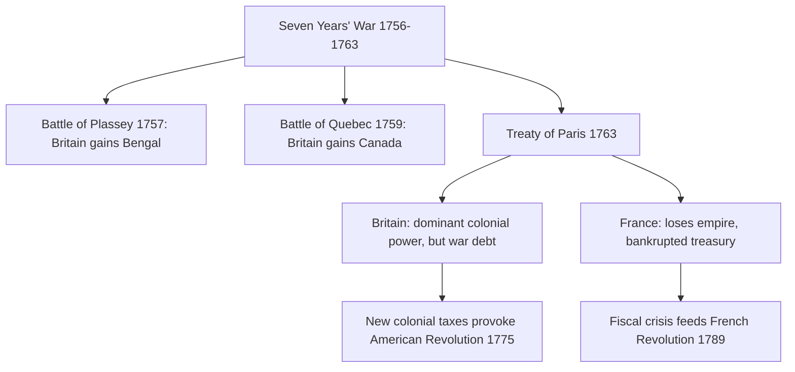

# Concept-Book Run

domain: /home/papagame/projects/digital-duck/conceptbook-app/public/domains/Users/200years_7powers_ch00/input/graph.yaml
target: abolition_slave_trade_1807
started: 2026-09-28T02:16:18

## Teaching order (8 concepts)

- seven_years_war_1756
- enlightenment_philosophy_1748
- american_revolution_1775
- agri_rev_1740s
- french_revolution_1789
- adam_smith_1776
- haitian_revolution_1791
- abolition_slave_trade_1807

### seven_years_war_1756 (15.7s)

## Seven Years War 1756

The Seven Years' War (1756–1763) is often called the first true world war: fighting broke out not just in Europe but in North America (where colonists called it the French and Indian War), the Caribbean, West Africa, India, and the Philippines. The core conflict pitted Britain and Prussia against France, Austria, and Russia, with the underlying stakes being colonial supremacy — control of North American territory and Indian trade — layered on top of a European struggle over Prussia's rising power in Central Europe.

Britain's advantage was structural, not merely tactical: a superior Royal Navy let it blockade French ports, intercept reinforcements and supplies bound for French colonies, and project power simultaneously in multiple theaters. The decisive North American moment came in September 1759 at the Battle of Quebec, where General James Wolfe's forces defeated the French under Louis-Joseph de Montcalm; both commanders died, but the battle opened the way to British conquest of Canada. In India, Robert Clive's victory at the Battle of Plassey in 1757 crushed the Nawab of Bengal (a French ally) and gave the British East India Company effective control over Bengal, the wealthiest province in the subcontinent — a foothold from which British dominance over India would expand for the next century.

The 1763 Treaty of Paris formalized these outcomes: France ceded Canada and its claims east of the Mississippi to Britain, and ceded Louisiana to Spain, retaining only a few Caribbean sugar islands and fishing rights near Newfoundland. Financially, the war was ruinous for France, which had spent roughly 1.3 billion livres and borrowed heavily to sustain a war it ultimately lost — debt that compounded over the following decades and became a central grievance driving the fiscal crisis of the 1780s, a direct causal thread to the French Revolution of 1789. Britain, though victorious, also emerged deeply in debt, and its attempts to recoup war costs through new colonial taxes (the Stamp Act, the Townshend Acts) directly provoked the resistance that led to the American Revolution.

*This diagram traces how the war's two decisive battles and peace settlement produced financial and political consequences in both Britain and France that fed directly into the revolutions of the following decades.*

### enlightenment_philosophy_1748 (15.6s)

## Enlightenment Philosophy 1748

Enlightenment political philosophy asked a question that medieval Europe had rarely posed directly: what makes a government's power legitimate, and how should that power be structured to prevent abuse? Two texts, published fourteen years apart, gave answers that would outlive the century that produced them.

Charles-Louis de Secondat, Baron de Montesquieu, published "The Spirit of the Laws" in 1748 after nearly twenty years of study, including firsthand observation of the British constitutional system during a stay in England. Montesquieu argued that liberty survives only when governmental power is divided among distinct branches — legislative, executive, and judicial — each capable of checking the others. His reasoning was empirical rather than abstract: he had watched Louis XIV concentrate authority in Versailles and had seen how England's Parliament, courts, and monarchy constrained one another. Montesquieu's separation-of-powers model directly shaped Article 1 of the U.S. Constitution's structure, which assigns lawmaking to Congress, execution to the presidency, and adjudication to the judiciary as separate branches.

Jean-Jacques Rousseau's "The Social Contract" (1762) took a different starting point. Rousseau argued that legitimate political authority arises only from the consent of the governed, expressed through what he called the general will — the collective interest of a community as opposed to the sum of individual private interests. A ruler who governs without that consent, however competent, holds power illegitimately. This idea directly undercut the doctrine of divine right that had justified European monarchies for centuries.

Worked example: apply both frameworks to the French Revolution's National Assembly of 1789. When the Third Estate declared itself the sole legitimate representative of the French nation (Tennis Court Oath, June 1789), it was invoking Rousseau's consent principle to delegitimize the Estates-General's structure, which had given equal votes to three unequal-sized orders. When the resulting 1791 Constitution created a Legislative Assembly, a king wielding only a suspensive veto, and a separate judiciary, it was implementing Montesquieu's structural remedy.

Problem-solving application: when evaluating any revolutionary charter — American (1776–1789), French (1789–1791), or Haitian (1801, 1805) — ask two diagnostic questions. First, does it claim popular consent as its source of authority (Rousseau's test)? Second, does it divide power among competing institutions (Montesquieu's test)? Documents satisfying both criteria mark a decisive break from dynastic absolutism; those satisfying only one reveal a partial or contested revolution.

### american_revolution_1775 (15.0s)

## American Revolution 1775

By 1775, the thirteen British colonies had accumulated a decade of grievances rooted directly in the aftermath of the Seven Years' War. Britain's victory had doubled its national debt to roughly £133 million, and Parliament sought to recoup costs through direct taxation of the colonies — the Stamp Act (1765), the Townshend Acts (1767), and the Tea Act (1773). Colonists rejected these measures not merely on financial grounds but on the constitutional principle, drawn from Enlightenment philosophy, that legitimate government requires the consent of the governed. John Locke's argument that government exists to protect natural rights to life, liberty, and property, and that a government violating this trust may be justly overthrown, appears almost verbatim in the Declaration of Independence's assertion that "governments are instituted among men, deriving their just powers from the consent of the governed."

Fighting began at Lexington and Concord in April 1775. The Continental Congress formalized the break in July 1776, but independence remained militarily uncertain for years. The turning point came at Saratoga in October 1777, where the surrender of General John Burgoyne's army convinced France that the rebellion could succeed. France's subsequent 1778 alliance transformed a colonial rebellion into a global war against Britain, ultimately committing over 1 billion livres in aid and naval support — expenditure that pushed the French crown toward the fiscal crisis that erupted in the French Revolution of 1789. The war ended with Cornwallis's surrender at Yorktown in 1781, sealed diplomatically by the Treaty of Paris (1783), which recognized American independence.

The practical significance for problem-solving in historical analysis lies in tracing the chain of consequence: a war fought to relieve postwar debt (Seven Years' War) produced the taxation policies that triggered rebellion; Enlightenment natural-rights theory supplied the justifying ideology; and French intervention, decisive for American victory, became a primary accelerant of France's own revolutionary collapse. This case demonstrates how a single conflict can simultaneously resolve one nation's political order while destabilizing another's — the same French support that secured Yorktown left Louis XVI's treasury too depleted to survive the next decade. Historians analyzing revolutionary movements consistently return to this sequence as the template linking Enlightenment ideas, fiscal strain from prior wars, and the demonstration effect of successful rebellion on subsequent independence movements in Latin America and beyond.

### agri_rev_1740s (16.0s)

## Agri Rev 1740S

Before a single spinning jenny turned in Lancashire, farming itself had to change. Britain's agricultural revolution of the 1740s–1780s reorganized land ownership and farming technique so thoroughly that it produced two things the coming industrial economy needed: more food per acre, and a surplus of people no longer needed on the land.

The core changes were legal and agronomic. Parliamentary enclosure acts consolidated the old open-field system — strips of land scattered across shared village fields, worked communally under medieval custom — into large, fenced, privately controlled farms. Between 1750 and 1820, over 4,000 enclosure acts reorganized roughly 6.8 million acres of English farmland. Alongside enclosure, farmers adopted the Norfolk four-field rotation (wheat, turnips, barley, clover), pioneered by figures like Charles "Turnip" Townshend. Because turnips and clover restored soil nitrogen and fed livestock over winter, farmers no longer had to leave a third of their land fallow each year, as the old three-field system required. Selective breeders such as Robert Bakewell applied systematic mating to sheep and cattle, roughly doubling average livestock weights between 1700 and 1800.

The consequence was a labor surplus, not just a food surplus. Enclosure eliminated the common grazing and gleaning rights that had let smallholders and cottagers survive on marginal plots; larger, more efficient farms needed fewer hands per acre of output. Historians estimate that the share of the English workforce in agriculture fell from roughly 60% in 1700 to under 40% by 1800. Those displaced rural laborers became the pool of workers available to move into the textile mills and coal-fired factories of the coming decades — precisely the labor supply that steam power and mechanized spinning required to scale.

The problem this posed for contemporaries was less "how do we grow more food" than "what happens to the people the new farming no longer needs." Landless families migrated to expanding cities like Manchester and Birmingham in search of wage labor, a shift that reshaped Britain's population map: urban dwellers rose from about 20% of the population in 1750 to nearly 50% by 1850. Enclosure was frequently contested — parliamentary petitions and local riots protested the loss of common rights — but the economic logic proved decisive: concentrated, efficient farms fed a growing population with a shrinking rural workforce, and it was that displaced workforce, not any single invention, that made the factory system possible.

### french_revolution_1789 (15.1s)

## French Revolution 1789

By 1789, the French monarchy was insolvent. Decades of war spending — including the enormous cost of supporting the American Revolution — had pushed royal debt to roughly 4 billion livres, consuming over half of annual state revenue just in interest payments. King Louis XVI convened the Estates-General for the first time since 1614 to approve new taxes, but the Third Estate (commoners, roughly 97% of the population) rejected a voting system that let the nobility and clergy outvote them two-to-one. On June 20, 1789, its delegates took the Tennis Court Oath, vowing not to disband until France had a written constitution. On July 14, Parisian crowds stormed the Bastille fortress, and by August the National Constituent Assembly had abolished feudal privileges and issued the Declaration of the Rights of Man and of the Citizen, asserting that "men are born and remain free and equal in rights."

The Revolution radicalized quickly. The monarchy was abolished in 1792, Louis XVI was executed in January 1793, and the Committee of Public Safety under Robespierre launched the Terror, executing an estimated 17,000 people by tribunal (with tens of thousands more dying in related violence) between 1793 and 1794 in the name of defending the republic from internal and foreign enemies. Robespierre himself was guillotined in July 1794, ending the Terror's most acute phase. The decade closed in 1799 when Napoleon Bonaparte seized power in the Coup of 18 Brumaire.

The Revolution's causal chain illustrates how a fiscal crisis becomes a political one becomes an ideological one: debt forced the calling of the Estates-General; procedural deadlock there radicalized the Third Estate into asserting sovereignty on its own; and the language of natural rights, once declared, could not be contained to France. Revolutionary and Napoleonic France exported the Declaration's principles at bayonet-point across Europe, and even after 1815 restored the old dynasties on paper, the idea that legitimate government rests on the people rather than divine right had entered European political life to stay, resurfacing in 1830, 1848, and beyond.

*Causal sequence from fiscal crisis to political revolution to Napoleonic seizure of power.*

### adam_smith_1776 (12.7s)

## Adam Smith 1776

In 1776 the Scottish philosopher Adam Smith published *An Inquiry into the Nature and Causes of the Wealth of Nations*, a book that reoriented economic thinking away from mercantilism — the prevailing doctrine that a nation's wealth was measured by the gold and silver it hoarded through trade surpluses and protective tariffs. Smith argued instead that national wealth comes from the productive capacity of labor and capital, and that this capacity grows fastest when individuals pursue their own economic self-interest within a competitive market, guided by what he famously called an "invisible hand" toward outcomes that benefit society as a whole. Government's proper role, in his view, was to enforce contracts and property rights, not to manage trade through quotas, monopolies, and tariffs.

Two forces gave Smith's ideas concrete material grounding. Britain's victory in the Seven Years' War (1756–1763) had left it the dominant global trading power, controlling markets and shipping lanes across the Atlantic and into Asia — a real-world laboratory in which the gains from open exchange were already visible. At the same time, the agricultural revolution of the 1740s — enclosure of common land, crop rotation, and selective livestock breeding — had raised farm yields enough that fewer workers were needed to feed the population, freeing labor to move into towns and manufacturing. Smith's most concrete illustration of this shift is his description of a pin factory, where a single worker doing every step of pin-making might produce only a handful of pins a day, but ten workers each specializing in one step of the process — drawing the wire, cutting it, sharpening the point, attaching the head — could together produce thousands. This example, division of labor, became Smith's central mechanism for explaining how productivity, not accumulated bullion, generates real wealth.

The practical payoff of this argument arrived seven decades later. When Parliament repealed the Corn Laws in 1846, ending tariffs that had propped up domestic grain prices to protect landowners, the decision drew directly on Smith's case that free trade lowers prices for consumers and lets each nation specialize in what it produces most efficiently. Wealth of Nations supplied the intellectual justification that industrial capitalists and free-trade politicians would invoke for the next hundred years of British economic policy.

### haitian_revolution_1791 (15.8s)

## Haitian Revolution 1791

Saint-Domingue in 1789 was the single most profitable colony in the world: its sugar and coffee plantations, worked by roughly 500,000 enslaved Africans under brutal conditions, generated more export revenue than the entire United States. When the French Revolution's Declaration of the Rights of Man proclaimed liberty and equality in 1789, it exposed a glaring contradiction that colonial elites could not contain — free people of color demanded citizenship rights, and enslaved people took the promise of liberty literally. On the night of August 22, 1791, enslaved insurgents in the northern plain launched a coordinated uprising, burning plantations and killing enslavers. Within weeks, roughly 100,000 enslaved people had joined the revolt.

What followed was thirteen years of shifting alliances and warfare. The enslaved rebels fought French colonial forces, then allied briefly with Spain and Britain as European powers competed for the colony, then turned against those same allies once France's revolutionary government abolished slavery in 1794 — a decision driven largely by the need for Black military support. Toussaint Louverture, a formerly enslaved man and self-taught military strategist, rose to command, defeating Spanish and British forces and negotiating Saint-Domingue into a position of effective autonomy within the French empire by 1801. When Napoleon Bonaparte, seeking to restore slavery and French control, sent a 20,000-troop expedition in 1802, Louverture was captured and died in a French prison in 1803. But his former general Jean-Jacques Dessalines took command and completed the fight: at the Battle of Vertières in November 1803, Dessalines's forces defeated the remaining French army, which had already lost most of its 60,000-plus troops to combat and yellow fever. On January 1, 1804, Dessalines declared independence, renaming the colony Haiti and founding the first Black republic in the modern world.

The application of this history to problem-solving lies in causal reasoning: identifying why Haiti succeeded where other slave revolts failed. Three factors combined — sheer numerical majority (enslaved people outnumbered white colonists roughly ten to one), organizational leadership capable of conventional military command, and the disease environment, which decimated European expeditionary forces unaccustomed to tropical pathogens. Comparing Haiti to contemporaneous revolts (e.g., Gabriel's Rebellion in Virginia, 1800, which was betrayed before it began) shows that scale and terrain, not just grievance, determined outcomes. The consequence was severe: France demanded a crushing 150-million-franc indemnity in 1825 for lost "property," debt Haiti serviced into the twentieth century, a lasting economic burden directly traceable to the revolution's aftermath.

### abolition_slave_trade_1807 (14.4s)

## Abolition Slave Trade 1807

By the late eighteenth century, the transatlantic slave trade was a highly profitable, state-sanctioned system: British ships alone had carried an estimated 3.1 million enslaved Africans across the Atlantic between 1662 and 1807. Two forces converged to end it. The first was intellectual: Adam Smith's 1776 critique of mercantilism argued that free wage labor was economically more productive than coerced labor, undermining the claim that slavery was indispensable to national wealth. The second was demonstrative: the Haitian Revolution, beginning in 1791, showed that enslaved people could organize, fight, and defeat European colonial armies, culminating in Haiti's 1804 independence — the only successful slave-led revolution in history. Together, these two developments shifted the debate in Britain from "is abolition moral?" to "is slavery even viable or safe to maintain?"

British abolitionists, led by William Wilberforce and the Clapham Sect, campaigned in Parliament for two decades, using petitions, published testimony from formerly enslaved people like Olaudah Equiano, and economic arguments drawn from Smith's free-labor thesis. The Slave Trade Act of 1807 passed by a decisive majority in the House of Commons (283 to 16), making it illegal for British subjects to engage in the slave trade anywhere in the world — though it did not free the roughly 800,000 people already enslaved in British colonies, who waited until the Slavery Abolition Act of 1833 for legal freedom.

Enforcement, not just legislation, made 1807 consequential. Britain deployed the Royal Navy's West Africa Squadron, which by the 1840s had intercepted over 1,600 slave ships and freed an estimated 150,000 captives, while also pressuring other nations — Portugal, Spain, and the United States — through treaties to restrict their own trades. This combination of moral argument, revolutionary proof-of-concept, and naval enforcement illustrates a recurring pattern in historical change: an entrenched economic system rarely ends from ethical persuasion alone, but from persuasion paired with a credible demonstration that the old order is no longer secure or inevitable, backed by a power willing to enforce the new norm globally.

## Run complete

total: 126.1s
