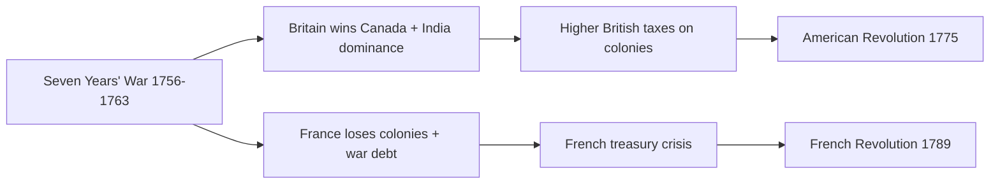
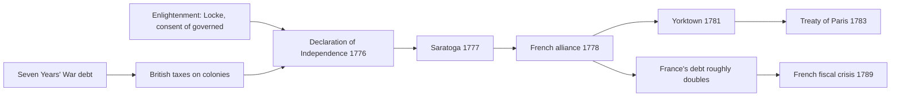

# Concept-Book Run

domain: /home/papagame/projects/digital-duck/conceptbook-app/public/domains/Users/200years_7powers_ch00/input/graph.yaml
target: british_abolition_slavery_1833
started: 2026-09-28T02:18:26

## Teaching order (9 concepts)

- seven_years_war_1756
- enlightenment_philosophy_1748
- american_revolution_1775
- agri_rev_1740s
- french_revolution_1789
- adam_smith_1776
- haitian_revolution_1791
- abolition_slave_trade_1807
- british_abolition_slavery_1833

### seven_years_war_1756 (16.3s)

## Seven Years War 1756

Fought from 1756 to 1763, the Seven Years' War was the first conflict to span multiple continents simultaneously — battles raged in Central Europe, North America (where colonists called it the French and Indian War), the Caribbean, West Africa, India, and the Philippines. Two rival coalitions faced off: Britain and Prussia against France, Austria, Russia, and Spain. At stake were colonial trade, territory in the Americas and Asia, and control of Central Europe. The war reshaped the global balance of power more decisively than any conflict since the Peace of Westphalia in 1648.

The clearest illustration is North America. In 1754, a young British colonial officer named George Washington skirmished with French forces in the Ohio Valley, a spark that widened into full war by 1756. Britain committed naval superiority and financial subsidies to allies in Europe while striking French colonies directly. The decisive moment came in 1759 at the Battle of Quebec, where British general James Wolfe defeated French forces under Louis-Joseph de Montcalm; both commanders died, but Quebec fell, and with it, French Canada. Simultaneously, the British East India Company, under Robert Clive, defeated French-backed forces at the Battle of Plassey in 1757, establishing Company dominance over Bengal and setting the template for British rule in India.

The 1763 Treaty of Paris formalized the outcome: France ceded Canada and its territories east of the Mississippi to Britain, and effectively withdrew as a serious colonial competitor in India. Britain emerged holding the largest colonial empire in the world. But the war's costs proved as consequential as its territorial gains. Britain's national debt roughly doubled to £133 million, prompting Parliament to impose new taxes on American colonists (the Stamp Act of 1765, the Townshend Acts) — grievances that fed directly into the American Revolution just over a decade later. France's losses were graver still: its treasury, already strained, sank deeper into debt financing a war it lost, with no territorial gains to offset the expense. This fiscal crisis persisted for three decades, and by 1789 it was a principal cause of the tax revolts and Estates-General crisis that ignited the French Revolution.

*How the Seven Years' War's outcomes fed forward into both the American and French Revolutions.*

The lesson for analyzing global conflict: military victory and fiscal solvency are not the same outcome. Britain won the war but incurred debts that provoked colonial rebellion; France lost the war and incurred debts that provoked domestic revolution. Evaluating any war's true consequences requires tracing both the territorial settlement and the financial ledger it leaves behind.

### enlightenment_philosophy_1748 (14.3s)

## Enlightenment Philosophy 1748

The Enlightenment produced a set of political ideas that reimagined the source and structure of legitimate government. In *The Spirit of the Laws* (1748), Montesquieu argued that liberty survives only when power is divided rather than concentrated: he proposed separating government into legislative, executive, and judicial branches so that each could check the others. Fourteen years later, in *The Social Contract* (1762), Jean-Jacques Rousseau argued that legitimate authority does not descend from God or heredity but arises from the consent of the governed, expressed as a "general will." Neither theorist wrote in the abstract — both were reacting to the absolute monarchy of Louis XIV's France, where a single sovereign claimed unchecked power over law, taxation, and justice.

**Worked example.** Consider the American Constitution of 1787. Montesquieu's separation of powers is visible directly in its structure: Congress legislates (Article I), the President executes (Article II), and the courts adjudicate (Article III), with each branch holding checks over the others — the presidential veto, congressional override, judicial review. Rousseau's consent principle appears in the Constitution's opening words, "We the People," and in the Declaration of Independence's claim that governments derive "their just powers from the consent of the governed." When French revolutionaries stormed the Bastille in 1789, they invoked the same logic to declare Louis XVI's absolute rule illegitimate — the National Assembly's 1789 Declaration of the Rights of Man explicitly cited separation of powers (Article 16) and popular sovereignty (Article 3) as the tests of a valid constitution.

**Problem-solving application.** To analyze any revolution or constitutional reform from this era, ask two diagnostic questions drawn from these texts: (1) Does power rest in one office or is it distributed and checked? (2) Does the government's authority rest on heredity/divine right, or on the consent of those it governs? Applying this to Haiti (1791–1804): enslaved and free colonists used Rousseau's consent language to argue that French rule over Saint-Domingue was illegitimate without their consent, while the 1805 Haitian constitution built in checks on executive power — showing the same Enlightenment toolkit exported to a colonial and racial context its European authors had not anticipated. This two-question test also explains the 19th-century liberal-versus-monarchist conflicts across Europe: each uprising — Naples in 1820, France in 1830 and 1848 — was fundamentally a demand to replace hereditary, unchecked rule with divided power and consent-based legitimacy.

### american_revolution_1775 (15.6s)

## American Revolution 1775

By 1775, the Thirteen Colonies had accumulated a decade of grievances against Britain: the Stamp Act (1765), the Townshend Acts (1767), and the Tea Act (1773) all raised the same objection — taxation without representation in Parliament. But the deeper intellectual justification came from Enlightenment philosophy, particularly John Locke's argument that governments derive their legitimacy from the consent of the governed and that citizens retain a right to overthrow a government that violates their natural rights to life, liberty, and property. Thomas Jefferson translated this directly into the Declaration of Independence (July 4, 1776), which listed 27 specific grievances against King George III as evidence that the social contract had been broken.

The war itself (1775–1783) tested whether Enlightenment ideals could survive a real military confrontation. Britain possessed the world's most powerful navy and a professional army; the Continental Army was underfed, underpaid, and often outnumbered. The turning point came at Saratoga (October 1777), where American forces under General Horatio Gates forced the surrender of a full British army of nearly 6,000 men. Saratoga convinced France — still smarting from its defeat in the Seven Years' War two decades earlier — that the colonies could actually win, and in 1778 France formally allied with the United States, followed by Spain and the Dutch Republic. French money, arms, and naval power (decisively, Admiral de Grasse's fleet blocking British reinforcement at Yorktown in 1781) tipped the balance. The war ended with the Treaty of Paris (1783), in which Britain recognized American independence outright.

The financial mechanism connecting this revolution to the next one is direct and well documented: France spent over 1 billion livres supporting the American war effort, nearly doubling its national debt. That debt, combined with a regressive tax system that exempted the nobility and clergy, produced the fiscal crisis that forced Louis XVI to convene the Estates-General in 1789 — the opening act of the French Revolution.

*How British war debt and Enlightenment ideas produced American independence, and how French intervention in that war fed forward into the French Revolution.*

The American Revolution's lasting significance lies less in the battlefield outcomes than in the precedent it set: a written constitution (1787) built on separation of powers and enumerated rights demonstrated that Enlightenment political theory could be operationalized into a functioning state, not just debated in salons. That demonstration effect — a colonial rebellion defeating an empire and then codifying self-government — became a reference point invoked by revolutionaries in France, Haiti, and Latin America over the following half-century.

### agri_rev_1740s (16.4s)

## Agri Rev 1740S

Britain's Industrial Revolution needed something that had never existed before: a large population willing to leave the land and work in factories. That population only became available because British agriculture, between roughly 1740 and 1780, learned to feed more people with fewer farmers. Two changes drove this: enclosure and crop rotation.

Enclosure was the legal consolidation of scattered open fields and shared common land into fenced, privately owned plots. Parliament passed thousands of enclosure acts across the eighteenth century, formalizing a process that had been building since the Tudor period. Consolidated land could be farmed efficiently by a single owner using new methods, but it also eliminated the small strips and grazing commons that had let landless cottagers keep a cow or grow a garden. Deprived of that subsistence margin, many rural families had no choice but to seek wage labor — first on the newly efficient farms, and increasingly in the growing towns.

The second change was the four-field (Norfolk) rotation, popularized by Charles Townshend and pushed further by farmers like Thomas Coke. Traditional English farming had relied on a three-field system that left a third of the land fallow each year to recover fertility. The Norfolk system instead rotated wheat, turnips, barley, and clover on the same land year after year. Turnips fed livestock through the winter, allowing farmers to keep more animals producing manure, which restored soil nitrogen for the grain crops; clover did the same while also feeding livestock. No field sat idle. Combined with Robert Bakewell's selective livestock breeding — deliberately mating animals for size and meat yield rather than letting them breed randomly — average sheep and cattle weights roughly doubled over the century, and grain yields per acre rose substantially.

The practical result: fewer farm workers produced more food, and the labor no longer needed on the land became available for hire elsewhere. This is the precondition, not a footnote — without a food surplus that didn't require most of the population to grow it, and without displaced rural labor seeking new work, there would have been no workforce for the textile mills and ironworks that define the rest of this chapter. Historians still debate how much of urban migration was enclosure "pushing" people off the land versus factory wages "pulling" them toward cities, but both forces required the agricultural surplus this revolution created.

### french_revolution_1789 (14.9s)

## French Revolution 1789

France entered 1789 burdened by near bankruptcy, an inequitable tax system that exempted the nobility and clergy, and a subsistence crisis after poor harvests drove bread prices to record highs. King Louis XVI convened the Estates-General in May 1789 to address the fiscal emergency, but the Third Estate — commoners, who made up roughly 97 percent of the population yet held only one-third of the votes — demanded proportional representation. When negotiations stalled, they broke away, formed the National Assembly, and swore the Tennis Court Oath on June 20, 1789, pledging not to disband until France had a constitution. On July 14, Parisians stormed the Bastille fortress, and on August 4 the Assembly abolished feudal privileges outright. Weeks later it issued the Declaration of the Rights of Man and of the Citizen, asserting that "men are born and remain free and equal in rights" — a document that echoed the American Declaration of Independence but went further in universalizing its claims beyond one nation's colonists.

Worked example: compare the two revolutions' outcomes. The American Revolution (1775) replaced a distant colonial authority with a federal republic while leaving existing social and property structures largely intact. The French Revolution attacked the domestic social order itself — monarchy, aristocracy, and church privilege — within a single, densely populated kingdom of roughly 28 million people. That difference in target explains why the French Revolution radicalized further: by 1792 the monarchy was abolished, by 1793 Louis XVI was executed, and the Committee of Public Safety under Robespierre launched the Terror, executing an estimated 17,000 people by tribunal alongside tens of thousands more killed in suppressing counter-revolutionary revolts.

Problem-solving application: when assessing why a revolution either stabilizes into new institutions or spirals into violence, historians examine three factors evident here — the depth of the economic crisis (French state debt exceeded annual revenue by more than 50 percent by 1788), the rigidity of the old elite in refusing reform, and the presence or absence of external military threat (Austria and Prussia's 1792 invasion threat pushed the Assembly toward radical war-mobilization measures). Applying this framework to any revolution — fiscal pressure, elite intransigence, external threat — helps explain why France's crisis, unlike America's, could not be resolved through negotiated separation and instead consumed the existing order from within, then exported its principles and its instability across Europe for the following century.

### adam_smith_1776 (13.7s)

## Adam Smith 1776

In 1776, Adam Smith published An Inquiry into the Nature and Causes of the Wealth of Nations, the founding text of modern economics. Smith argued that national prosperity comes not from a monarch's hoard of gold or from restrictive trade monopolies, but from the productive capacity of a nation's labor, organized through specialization and exchanged freely in open markets. His two central arguments were the division of labor — breaking production into specialized tasks to multiply output — and the idea of a self-regulating market, in which individuals pursuing their own interest are guided, as if by an "invisible hand," to serve the interests of society as a whole.

Smith's famous worked example was a pin factory. One worker performing every step alone might make barely a handful of pins a day. But when the process is divided into roughly eighteen distinct operations — drawing the wire, straightening it, cutting it, sharpening the point, grinding the head — and each worker specializes in one step, a small team of ten workers could produce upwards of 48,000 pins a day, an output impossible for any one person to match alone. Smith used this example to show that specialization, not individual effort, was the true engine of wealth creation.

This framework had immediate practical stakes for policy: Smith opposed the mercantilist system of tariffs and monopolies that dominated eighteenth-century European trade, including Britain's own Corn Laws, which taxed imported grain to protect domestic landowners. He argued that such protections raised prices for consumers and misallocated labor away from what a nation produced most efficiently. This argument became the intellectual ammunition for the free-trade movement that culminated seventy years later in the 1846 repeal of the Corn Laws, when British industrialists — needing cheap imported grain to keep wages and food costs low for their factory workforce — successfully overturned agricultural protectionism.

The timing was not accidental. Smith wrote during the Agricultural Revolution of the 1740s, which had already raised British crop yields and freed rural labor for factory work, and in the aftermath of the Seven Years' War (1756–1763), which left Britain with a vast trade network and war debts that made questions of taxation and commercial policy urgent. Smith's theory gave coherent economic justification to changes already underway on the ground — turning practical necessity into policy doctrine.

### haitian_revolution_1791 (15.7s)

## Haitian Revolution 1791

By 1789, Saint-Domingue produced roughly 40 percent of the world's sugar and over half its coffee, generating more wealth than the entire thirteen North American colonies combined at the time of American independence. That wealth rested on approximately 500,000 enslaved Africans working under a regime so brutal that planters routinely calculated it cheaper to work captives to death within a few years and purchase replacements than to sustain a stable enslaved population. When the French Revolution's Declaration of the Rights of Man reached the colony in 1789, free people of color demanded its promised equality, while white planters refused to extend any rights to non-whites. Into this contest arrived the enslaved majority, who launched a coordinated uprising on the night of August 22, 1791, burning plantations across the Northern Plain.

What followed was not a single revolt but thirteen years of shifting warfare. Toussaint Louverture, a formerly enslaved and self-taught military strategist, forged the rebels into a disciplined army, allied briefly with Spain, then with France after Paris abolished slavery in the colonies in 1794, and by 1801 governed the island as its de facto ruler while nominally remaining under French sovereignty. Napoleon Bonaparte, seeking to restore slavery and French control, sent an expeditionary force of over 40,000 troops in 1802. Louverture was captured by treachery and died in a French prison in 1803, but his successor, Jean-Jacques Dessalines, continued the war. Yellow fever killed an estimated 50,000 to 65,000 French soldiers, and combined with battlefield defeats, forced Napoleon's surviving forces to withdraw. On January 1, 1804, Dessalines declared independence, renaming the colony Haiti and founding the world's first Black-led republic and the only nation born from a successful slave revolt.

To assess why Saint-Domingue succeeded where other slave uprisings failed, a student should compare the conditions: the colony's Black population outnumbered whites roughly ten to one, French Revolutionary chaos temporarily withdrew metropolitan support, and disease decimated European reinforcements unaccustomed to tropical conditions. The revolution's aftermath demonstrates real consequences historians can trace directly: France demanded a crippling indemnity from Haiti in 1825 (paid until 1947) as compensation to former slaveholders, and the United States, fearing the example, refused to recognize Haiti until 1862 — evidence of how a moral victory provoked decades of diplomatic and financial retaliation.

### abolition_slave_trade_1807 (19.2s)

## Abolition Slave Trade 1807

In 1807, Parliament passed the Slave Trade Act, making it illegal for British subjects to buy, sell, or transport enslaved Africans across the Atlantic. Britain then deployed the Royal Navy's West Africa Squadron to intercept slave ships, eventually freeing an estimated 150,000 captives over six decades of patrols. The law did not end slavery itself in British colonies — that came only with the Slavery Abolition Act of 1833 — but it struck at the trade's supply line and marked the first time a major imperial power used its own military and diplomatic weight against a system it had long profited from.

Two forces converged to produce this outcome. The first was moral and economic argument. Adam Smith's 1776 case that free markets and free labor outperform coerced systems gave abolitionists an economic vocabulary to pair with religious and humanitarian objections raised by figures like William Wilberforce and Thomas Clarkson; Parliament could be told that slavery was not just cruel but inefficient. The second was demonstrated fact rather than theory: the Haitian Revolution of 1791–1804, in which enslaved people on France's richest colony overthrew their masters, defeated Napoleon's army, and founded an independent Black republic, proved that enslaved resistance could not only occur but succeed decisively. Haiti's example removed the argument that slave societies were inherently stable, and it terrified planters in Jamaica and the American South, adding fear of insurrection to the moral case already being made in London.

A worked application of this convergence is the debate record itself. When Wilberforce introduced abolition bills in the 1790s, they failed repeatedly, partly because MPs assumed the plantation economy could not survive without the trade. By 1806–1807, with Haiti as evidence that suppression could fail catastrophically and Smith's free-labor argument gaining currency among merchants and economists, the political calculus shifted enough to pass the act by a large majority. Analyzing this shift is itself a problem-solving exercise: it shows how a change in policy on an entrenched economic institution rarely comes from moral argument or material shock alone, but from the two reinforcing each other until the cost of continuing outweighs the cost of change — a pattern historians look for whenever a durable, profitable system is dismantled by legislation rather than collapse.

### british_abolition_slavery_1833 (15.0s)

## British Abolition Slavery 1833

The Slavery Abolition Act, passed by Parliament in August 1833 and effective August 1, 1834, ended slavery across the British Empire, freeing approximately 800,000 enslaved people in the Caribbean, Mauritius, and the Cape Colony. Building on the Abolition of the Slave Trade Act of 1807 — which had banned the buying and selling of enslaved people but not the institution itself — the 1833 Act addressed the underlying practice of ownership. Parliament allocated £20 million in compensation, roughly 40 percent of the government's annual budget at the time, paid not to the formerly enslaved but to the approximately 46,000 slaveholders who claimed ownership. Many freed people were instead required to serve a transitional "apprenticeship" period, extended to six years for field laborers, effectively delaying full freedom for most agricultural workers until 1838.

The economic consequences were immediate and uneven. Caribbean sugar plantations, which had depended on unpaid coerced labor, faced sharp increases in production costs. Planters responded by importing indentured laborers from India — over half a million between the 1830s and early 1900s — under contracts that replicated many features of the system just abolished. Britain's compensation payments, funded through government loans, were so large that the debt was not fully repaid by British taxpayers until 2015, a fact revealed by UK Treasury records in 2018.

The moral and political argument underlying British abolition — that slavery was incompatible with a nation's claimed principles of liberty and Christian ethics — traveled across the Atlantic and reinforced the American abolitionist movement. British abolitionists such as Thomas Clarkson corresponded directly with American reformers, and the 1833 precedent gave U.S. abolitionists a working example: a major slaveholding empire had ended slavery through legislation rather than war, though at enormous financial cost. This transatlantic exchange of tactics and moral framing sharpened the sectional divide in the United States between North and South over the following three decades, contributing to the political rupture that erupted in the Civil War in 1861. The British case demonstrated abolition was administratively achievable, but its reliance on compensating owners rather than the enslaved — and its continuation of coerced labor through apprenticeship and indenture — also revealed how incompletely a legal end to slavery could translate into genuine freedom or economic justice.

## Run complete

total: 149.4s
