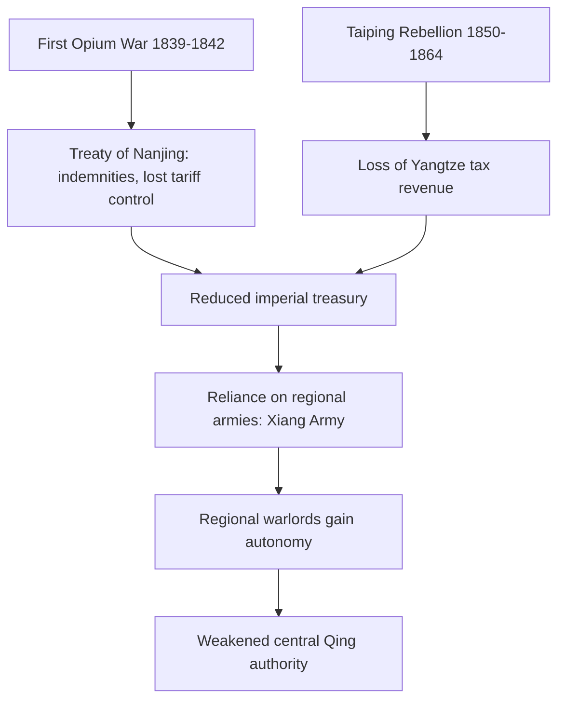
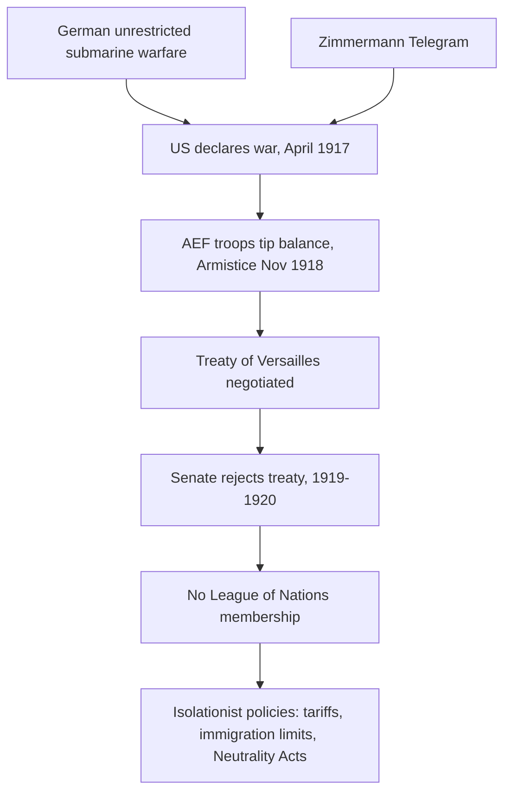
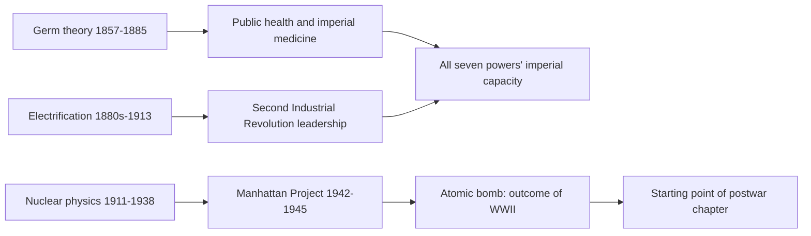

# Concept-Book Run

domain: /home/papagame/projects/digital-duck/conceptbook-app/public/domains/Users/200years_7powers_ch08/input/graph.yaml
target: science_cross_cutting_synthesis_1845_1945
started: 2026-09-28T02:21:58

## Teaching order (29 concepts)

- german_unification_1871
- great_power_rivalry
- science_faraday_darwin_era
- science_darwinism_and_germ_theory
- science_electrification_and_chemistry
- us_gilded_age
- meiji_restoration
- us_industrial_rise
- japan_meiji_modernization
- qing_dynasty_decline
- science_haber_bosch_and_aviation
- japan_imperial_expansion
- japan_prussian_model_emulation
- us_overseas_imperialism
- germany_weltpolitik_rivalry
- japan_depression_militarism
- science_radioactivity_and_quantum
- us_wwi_and_isolationism
- japan_china_war
- science_penicillin_and_nuclear_fission
- us_great_depression
- germany_wwi_defeat
- japan_pacific_war_defeat
- science_atomic_bomb_1945
- us_arsenal_of_democracy
- science_electrification_shifts_power
- science_haber_bosch_and_wwi_length
- science_nuclear_ends_pacific_war
- science_cross_cutting_synthesis_1845_1945

### german_unification_1871 (17.3s)

## German Unification 1871

On January 18, 1871, in the Hall of Mirrors at the Palace of Versailles, Prussian King Wilhelm I was proclaimed Kaiser (Emperor) of a unified German Empire. The setting was deliberately humiliating to France: the ceremony took place on French soil, in the very palace built by Louis XIV, while Prussian troops still besieged Paris. Germany's unification was not a peaceful federation of equals but the culmination of a decade-long strategy orchestrated by Prussian Minister-President Otto von Bismarck, who used a sequence of three wars — against Denmark (1864), Austria (1866), and France (1870–71) — to isolate rivals and force the smaller German states into a Prussian-led union. Bismarck's own phrase for this method, delivered in an 1862 speech to the Prussian parliament, was that great questions of the era would be decided "not by speeches and majority votes... but by iron and blood."

The immediate trigger for unification was the Franco-Prussian War. Bismarck provoked France into declaring war in July 1870 by editing and publishing the inflammatory "Ems Dispatch," a diplomatic telegram, in a way that insulted French national pride. France declared war expecting an easy victory; instead, Prussia's superior rail-mobilization and artillery led to a rout. The decisive Battle of Sedan on September 1, 1870, resulted in the capture of French Emperor Napoleon III himself, along with roughly 104,000 French troops. Paris fell to a prolonged siege in January 1871, and France was forced to cede the resource-rich provinces of Alsace and Lorraine and pay an indemnity of five billion francs under the Treaty of Frankfurt (May 1871).

The consequence reshaped the European balance of power. A fragmented patchwork of German states — Prussia, Bavaria, Saxony, and dozens of smaller principalities — became a single empire of roughly 41 million people, backed by Europe's most modern industrial base (Ruhr Valley coal and steel) and its most effective conscript army. France's defeat and the loss of Alsace-Lorraine created a lasting grievance, driving French foreign policy toward alliance-seeking (eventually with Russia) and revanchism, a resentment that would help set the stage for the First World War four decades later. Historians studying the pre-1914 alliance system point directly to 1871 as the moment continental Europe's old equilibrium, dominated by France and Austria, was replaced by a new and unstable multipolar order centered on a suddenly dominant Germany.

### great_power_rivalry (14.7s)

## Great Power Rivalry

By the 1870s, industrialization had convinced European statesmen that national power could be measured, and expansion was the yardstick. Great power rivalry describes the competitive dynamic among industrializing states — chiefly Britain, France, Germany, Russia, Austria-Hungary, Italy, Japan, and the United States — who pursued colonies, naval strength, and diplomatic prestige not merely for material gain but as proof of standing among peers. A state that failed to expand risked being classified, in the language of the era, as a declining power.

The clearest illustration is the Scramble for Africa. In 1870, European powers controlled roughly 10 percent of the African continent; by 1914, that figure exceeded 90 percent. The Berlin Conference of 1884–85, convened by Otto von Bismarck, formalized the rules of partition among fourteen states without a single African representative present. Britain and France alone divided the majority of the continent, while Germany, arriving late to colonial competition, seized Cameroon, Togoland, German East Africa, and German Southwest Africa in a deliberate effort to match its European rivals. The logic was explicit: German officials argued that a state without colonies could not be considered a genuine world power, regardless of its industrial or military strength at home.

This rivalry also drove naval competition, most visibly in the Anglo-German dreadnought race after 1906. Britain's navy had guaranteed its global primacy for decades; Germany's 1898 and 1900 Navy Laws, championed by Admiral Alfred von Tirpitz, aimed to build a fleet capable of challenging that primacy. By 1914, Britain had commissioned 29 dreadnoughts to Germany's 17 — Britain won the numerical race, but the competition itself corroded Anglo-German relations and hardened the alliance blocs that entered the First World War.

Applying this concept to historical analysis: a rivalry driven by prestige rather than strict economic necessity helps explain otherwise puzzling decisions, such as Italy's costly pursuit of Libya (1911–12) or Germany's expensive fleet despite its primarily continental strategic position. When evaluating any imperial decision from this period, ask whether it can be justified by resource or strategic need alone — if not, prestige competition among rival great powers is likely the deciding factor.

### science_faraday_darwin_era (14.6s)

## Science Faraday Darwin Era

By 1845, three scientific threads are converging that will remake the nineteenth century's economy, medicine, and battlefield. Michael Faraday's 1831 discovery of electromagnetic induction — that a changing magnetic field drives an electric current through a nearby conductor — supplied the working principle behind the dynamo and, eventually, the electric motor. Faraday himself, when asked the use of a mere laboratory curiosity, is reported to have answered that a newborn baby is also of no immediate use; within decades induction generators would electrify cities and factories. Meanwhile Charles Darwin, back in England since 1836 after five years aboard HMS Beagle, is sitting on the evidence — Galápagos finches with island-specific beaks, layered fossil strata in Patagonia — that will become "On the Origin of Species," still fourteen years from print in 1845 because Darwin is quietly amassing proof against an anticipated storm of religious objection. In parallel, German and British chemists are cataloguing elements and reactions with industrial intent: coal-tar dyes, synthetic fertilizers, and improved metallurgy are turning chemistry from a gentleman's hobby into a driver of factory output, a process that will culminate decades later in Mendeleev's periodic table (1869).

A worked comparison shows why these three threads are historically linked rather than coincidental. Britain's Industrial Revolution had already mechanized textile production using steam power by the 1840s; what induction added was a second, more flexible energy-conversion pathway — mechanical motion to electricity and back — that did not require a fixed steam engine on-site. This is precisely why electrification, when it comes after 1870, will spread faster than steam did: a factory need only run a wire, not build a boiler.

The practical exercise for a student of this period is to trace consequence, not mechanism: if Faraday's principle is not applied to industry until the 1870s dynamo boom, and Darwin's theory is not published until 1859, what does that forty-year lag between discovery and application tell us about the difference between a scientific insight and a technological or social revolution? The 1845 threshold is instructive precisely because the ideas already exist — the disruption they cause is still decades away.

### science_darwinism_and_germ_theory (14.6s)

## Science Darwinism And Germ Theory

In 1859, Charles Darwin published *On the Origin of Species*, proposing that species change over time through natural selection: individuals with heritable traits better suited to their environment survive and reproduce at higher rates, gradually reshaping populations. This overturned the prevailing view, dominant since Linnaeus, that species were fixed and separately created. Darwin drew on evidence from fossil succession, geographic distribution of species (notably his 1835 observations in the Galápagos), and the artificial selection practiced by breeders, arguing that the same selective pressure operates in nature over vast stretches of time.

At almost the same moment, the study of disease was undergoing its own revolution. Louis Pasteur's experiments in the 1860s disproved spontaneous generation and showed that microorganisms cause fermentation and spoilage; he extended this reasoning to disease, developing vaccines for anthrax (1881) and rabies (1885). Robert Koch, working independently, isolated the specific bacteria responsible for anthrax (1876), tuberculosis (1882), and cholera (1883), and formulated a set of criteria — now called Koch's postulates — for proving that a particular microbe causes a particular disease. Together, Pasteur and Koch replaced older theories blaming disease on "bad air" (miasma) with germ theory: specific, identifiable pathogens cause specific illnesses. This directly enabled antiseptic surgery, pasteurization, sanitation reform, and the vaccines and public-health campaigns that cut urban mortality sharply by the early twentieth century.

Applying these two breakthroughs side by side clarifies a common historical error. Darwin's theory described how selection acts on populations over geological time through differential reproduction; it made no claim about the moral worth of individuals or races, nor about how human societies should be governed. "Social Darwinism," popularized by Herbert Spencer's phrase "survival of the fittest" (coined 1864, before Darwin used it himself), took the biological mechanism and misapplied it to justify existing social and imperial hierarchies — claiming that European domination, industrial wealth, or colonial conquest simply reflected the "fitness" of the dominant group. This was a political ideology borrowed from science, not a finding of science itself: Darwin's own writings emphasized cooperation and common descent, not conquest. Recognizing this distinction — a genuine biological mechanism versus its ideological misuse — is itself the practical skill: when a historical actor invokes "science" to justify a policy of domination, the test is whether the science actually supports the specific causal claim being made, or is merely lending borrowed authority to a preexisting agenda.

### science_electrification_and_chemistry (14.5s)

## Science Electrification And Chemistry

Between 1865 and 1895, science stopped being a spectator sport for industry and became its engine. Three breakthroughs mattered most. In 1865, James Clerk Maxwell published equations showing that electricity and magnetism were two faces of a single force, and that oscillating electric fields propagate as waves — the theoretical basis for everything from radio to power transmission. In 1869, Dmitri Mendeleev arranged the known elements by atomic weight into a periodic table, leaving gaps for undiscovered elements (gallium, germanium, scandium) that were found within 15 years, exactly where he predicted, confirming that chemistry followed a discoverable underlying order rather than being a catalog of unrelated substances. And in the 1880s, engineers turned Maxwell's abstract theory into infrastructure: Thomas Edison opened the Pearl Street power station in New York in 1882 delivering direct current, while Nikola Tesla and George Westinghouse championed alternating current, which could travel far greater distances with far less energy loss. AC's practical advantage settled the "War of the Currents" by the mid-1890s and became the standard for electrical grids worldwide.

The deeper story is which nations captured this science industrially. Britain had led the First Industrial Revolution on coal, iron, and steam — technologies improvable by skilled tinkerers without much formal science. Electrification and synthetic chemistry required something different: trained chemists and electrical engineers working in organized laboratories. Germany built this system first. Its universities and technical institutes, backed by firms like BASF and Bayer, turned chemistry into an industry — Germany produced roughly 90 percent of the world's synthetic dyes by 1900 and pioneered industrial-scale nitrogen fixation soon after. The United States, meanwhile, built the electrical infrastructure at continental scale: by 1900 the country had generating capacity Britain could not match, powering factories, streetcars, and — after Alexander Graham Bell's 1876 telephone patent — a communications network that shrank the distances of a huge nation.

The practical lesson for historians of technology: national industrial power after 1870 tracked not natural resources or empire size, but the number of trained scientists and engineers a country could put to productive work. Britain's advantage in coal and colonies could not substitute for Germany's chemists or America's electrical engineers.

### us_gilded_age (15.0s)

## Us Gilded Age

Between 1870 and 1890, the United States underwent the fastest industrial expansion any economy had yet achieved. Named ironically by Mark Twain and Charles Dudley Warner for its gilded, rather than solid, prosperity, the Gilded Age saw steel production rise from roughly 77,000 tons in 1870 to over 4.7 million tons by 1890, railroad trackage nearly triple to almost 164,000 miles, and the U.S. overtake Britain as the world's leading industrial producer by the 1890s. This growth was driven by entrepreneurs later called "Robber Barons" — Andrew Carnegie in steel, John D. Rockefeller in oil, Cornelius Vanderbilt and Jay Gould in railroads — who built vertically integrated corporations, consolidated competitors into trusts, and amassed personal fortunes on a scale unprecedented in American history.

A concrete example clarifies how this transformation worked. Rockefeller's Standard Oil, founded in 1870, controlled about 2 percent of U.S. oil refining that year; by 1880, through aggressive buyouts, secret railroad rebates, and price wars that undercut smaller refiners, it controlled roughly 90 percent. This pattern — horizontal consolidation into a trust, followed by vertical integration into pipelines, barrel-making, and distribution — became the template Carnegie and others copied. The result was efficiency and lower consumer prices (kerosene prices fell by more than half between 1870 and 1885), but also the near-elimination of competition and enormous concentrations of private power that operated largely outside government regulation, since the Sherman Antitrust Act was not passed until 1890 and remained weakly enforced for another decade.

The problem-solving lesson historians draw from the Gilded Age is how to weigh the trade-off between economic development and social cost. Railroad expansion connected national markets and enabled mass production, but it relied on immigrant and Chinese labor working under dangerous conditions for low wages, and on land grants — over 175 million acres given to railroad companies — that dispossessed Native American nations. Wealth inequality reached extremes: by 1890, the wealthiest 1 percent of Americans held about 51 percent of the nation's wealth. This same industrial base — steel mills, rail networks, oil infrastructure, and capital markets built between 1870 and 1890 — became the material foundation the United States drew on to project economic and, eventually, military power globally in the twentieth century.

### meiji_restoration (20.4s)

## Meiji Restoration

In 1868, a coalition of samurai from the domains of Satsuma and Choshu overthrew the Tokugawa shogunate, the military government that had ruled Japan for over 250 years, and restored nominal political authority to the emperor, a fifteen-year-old named Mutsuhito who took the reign name Meiji ("enlightened rule"). The immediate trigger was the shogunate's failure to resist Western intrusion: Commodore Matthew Perry's 1853 arrival with American warships had forced Japan to sign unequal treaties opening its ports and ceding tariff control, exposing the regime as unable to defend Japanese sovereignty. But the restoration was not a return to old ways — it launched one of history's fastest state-led modernizations. Within a generation, the new government abolished the feudal domain system (1871), ended samurai stipends and their exclusive right to bear arms, introduced universal conscription (1873), and built a national education system, rail network, and telegraph grid. The Meiji leaders (the Emperor as figurehead) sent thousands of Japanese officials abroad, most famously the Iwakura Mission (1871–1873), to copy institutions selectively: a Prussian-style army, a British-style navy, a French-style legal code, and American-style banking.

The results were measurable and fast. Japan's steel and coal output multiplied, textile exports surged, and the state itself financed early heavy industry through model factories before privatizing them to conglomerates (the zaibatsu) like Mitsubishi and Mitsui. Military reform paid off within a single generation: Japan defeated Qing China in 1894–95, gaining Taiwan and an indemnity, then stunned the world by defeating Russia in 1904–05 — the first modern military victory of an Asian power over a European one. This trajectory illustrates a recurring pattern in comparative modernization: a state facing an external military-technological threat can compress a century of institutional change into a few decades by combining top-down control with selective, adaptive borrowing rather than wholesale imitation.

For problem-solving practice, compare Meiji Japan to a case of failed or stalled modernization, such as late Qing China's self-strengthening movement in the same period. Both faced identical treaty-port humiliations, yet Japan centralized power and dismantled its old elite (the samurai), while Qing reformers left the imperial bureaucracy and regional power structures largely intact. Evaluate how the difference in elite displacement, rather than access to foreign technology, best explains the divergent outcomes by 1895.

### us_industrial_rise (15.9s)

## Us Industrial Rise

Between 1865 and 1900, the United States transformed from a predominantly agrarian republic into the world's leading industrial power. Steel production, driven by the Bessemer process, rose from roughly 20,000 tons in 1867 to over 10 million tons by 1900 — surpassing Britain and Germany combined. Railroad mileage quintupled to nearly 200,000 miles, knitting together a continental market for the first time. Andrew Carnegie's vertically integrated steel empire and John D. Rockefeller's Standard Oil, controlling about 90 percent of American oil refining by 1880, exemplified the era's defining feature: consolidation of capital into trusts and holding companies of unprecedented scale.

This industrial surge collided with a symbolic turning point. In 1890, the U.S. Census Bureau announced that a continuous line of unsettled land could no longer be traced on the map — the frontier, in the government's own terms, had "closed." Historian Frederick Jackson Turner argued in 1893 that this frontier had been the engine of American democracy and opportunity, and its disappearance provoked genuine anxiety about where national energy and expansion would go next. That anxiety did not resolve into stagnation; it redirected outward.

Three forces converged to push the United States toward overseas ambition. First, factories were now producing far more than the domestic market could absorb, and industrialists — including Secretary of State James G. Blaine — pressed for new foreign markets in Latin America and Asia. Second, naval strategist Alfred Thayer Mahan's 1890 book *The Influence of Sea Power upon History* argued that great powers required overseas coaling stations and a modern battleship fleet, directly shaping the buildup of the "New Navy." Third, a rising generation of policymakers, from Theodore Roosevelt to Henry Cabot Lodge, treated overseas assertion as a natural extension of continental destiny, coining the era's rhetoric of national vigor and civilizing mission.

The practical result appeared within a decade: annexation of Hawaii in 1898, war with Spain the same year, and acquisition of the Philippines, Puerto Rico, and Guam. A useful problem-solving exercise for students is to trace a single causal chain — for example, connect Carnegie's overproduction of steel rails to the demand for the New Navy's steel-hulled battleships to the coaling-station logic that made Hawaii and the Philippines strategically desirable — and identify at which link economic interest, strategic doctrine, or ideology was the dominant driver.

### japan_meiji_modernization (15.2s)

## Japan Meiji Modernization

The Meiji Restoration of 1868 ended over two and a half centuries of Tokugawa shogunate rule and, within roughly one generation, transformed Japan from a decentralized feudal society into a centralized industrial and military power. The new government, acting in the name of the restored Emperor Meiji, moved with striking speed: in 1871 it abolished the han (feudal domains) and replaced them with prefectures administered directly by Tokyo, stripping the daimyo lords of their hereditary authority. In 1873 it introduced universal male conscription, ending the samurai's centuries-old monopoly on bearing arms and building a national army modeled on Prussian organization, alongside a navy modeled on Britain's. Land tax reform in the same year replaced payments in rice with a fixed monetary tax, giving the state a predictable revenue base to fund industrialization.

A useful worked example is Japan's response to unequal treaties. In 1858 Western powers had forced Japan to accept fixed low tariffs and extraterritorial rights for foreign nationals, treaties Japan considered humiliating. Meiji leaders reasoned that only a nation demonstrably "civilized" by Western standards, meaning industrialized, legally codified, and militarily credible, could renegotiate these terms on equal footing. They sent the Iwakura Mission (1871–1873), nearly fifty officials touring the United States and Europe to study banking, education, and military systems, and imported thousands of foreign technical advisers while sending Japanese students abroad. Government-built model factories, railways, and the Tokyo–Yokohama telegraph line followed within a decade. The strategy paid off: Japan achieved full tariff autonomy by 1911.

This case illustrates a broader problem-solving pattern applicable across the history of state modernization: when a country perceives an external threat to sovereignty, it can respond by selectively importing specific foreign institutions, an army structure, a tax system, a school curriculum, while preserving political legitimacy through a native symbol, in this case the Emperor. Comparing this to contemporaneous Qing China, which resisted comparable institutional change until after the 1894–95 Sino-Japanese War (a war Japan won decisively), shows why the pace and top-down coordination of reform, not merely the desire for it, determined which nation modernized successfully and which one did not.

### qing_dynasty_decline (16.9s)

## Qing Dynasty Decline

By the mid-nineteenth century, the Qing Dynasty—which had ruled China since 1644 and presided over a period of territorial expansion and demographic growth—entered a prolonged decline driven by military defeat, internal rebellion, and fiscal exhaustion. The First Opium War (1839–1842) exposed the gap between Qing military technology and that of industrializing Britain: British steam-powered gunboats and rifled artillery defeated Qing forces decisively, forcing the Treaty of Nanjing, which ceded Hong Kong, opened five treaty ports, and imposed an indemnity of 21 million silver dollars. The Second Opium War (1856–1860) compounded the humiliation, culminating in the Anglo-French burning of the Summer Palace in Beijing. These defeats established the "unequal treaty" system, under which foreign powers extracted extraterritorial legal rights, fixed low tariffs, and control over Chinese customs revenue—arrangements that persisted for nearly a century.

Internally, the Taiping Rebellion (1850–1864) proved even more devastating. Led by Hong Xiuquan, a failed civil service examination candidate who declared himself the younger brother of Jesus Christ, the Taiping movement built a rival state in Nanjing and sought to overthrow the Qing entirely. The ensuing civil war killed an estimated 20–30 million people, making it one of the deadliest conflicts in human history, and devastated the agriculturally rich Yangtze River valley, crippling imperial tax revenue for a generation.

Worked example: consider why these two crises compounded rather than merely added to each other. The Opium War indemnities and lost customs revenue reduced the funds available for a modern standing army; simultaneously, the Qing court had to rely on regional strongmen—such as Zeng Guofan, who raised the Xiang Army privately—to suppress the Taiping rebels, since the traditional Banner and Green Standard armies had decayed. This created a structural problem: the very people who saved the dynasty from the Taiping now controlled regional armies and tax bases the central court could not fully command, a devolution of power that outlasted the rebellion itself.

Problem-solving application: when analyzing any declining empire, ask whether external defeat and internal revolt are independent shocks or mutually reinforcing ones. In the Qing case, foreign indemnities starved the treasury needed to modernize defense, while internal rebellion diverted resources and devolved military power to regional actors—each crisis narrowing the state's options for addressing the other. This diagnostic—tracing how a fiscal shock and a legitimacy shock feed each other—applies equally to analyzing the late Ottoman Empire or the Bourbon monarchy before 1789.

*How external military defeat and internal rebellion jointly eroded Qing fiscal capacity and centralized authority.*

### science_haber_bosch_and_aviation (14.1s)

## Science Haber Bosch And Aviation

Nitrogen makes up 78 percent of the atmosphere, but in its gaseous form it is chemically inert — plants cannot use it, and neither could nineteenth-century industry. Before 1909, the only large-scale sources of fixed nitrogen (nitrogen bound into compounds usable for fertilizer or explosives) were Chilean sodium nitrate deposits and guano, both imported by sea. In 1909, German chemist Fritz Haber demonstrated a process to synthesize ammonia directly from atmospheric nitrogen and hydrogen gas under high pressure and heat, using an iron catalyst. Carl Bosch, an engineer at the chemical company BASF, then solved the industrial-scale problem of building reactors that could withstand the required pressures — around 200 atmospheres — and temperatures near 450°C. By 1913, the first Haber-Bosch plant at Oppau was producing ammonia by the ton. This synthetic ammonia could be converted into either fertilizer or nitric acid, the precursor for explosives like TNT.

The strategic consequence emerged almost immediately. When Britain's Royal Navy imposed a naval blockade on Germany in 1914, it cut off German access to Chilean nitrates — the traditional source of both fertilizer and munitions-grade nitrogen compounds. British planners expected this would exhaust German explosives stocks within months. Instead, Haber-Bosch plants, redirected to military production, supplied Germany with synthetic nitrates for the entire duration of World War I, sustaining an ammunition supply that outside observers had assumed impossible without seaborne imports. Historians estimate that without this process, Germany could not have continued large-scale warfare much past 1915 or 1916.

The same technology later became one of the most consequential inventions in human history for a very different reason: agriculture. Synthetic nitrogen fertilizer, scaled globally after 1945, is credited with enabling the population growth of the twentieth century — agronomists estimate that roughly half of the nitrogen atoms in human bodies today originated from a Haber-Bosch plant rather than natural soil fixation. This dual character — a single chemical process simultaneously enabling industrialized warfare and feeding a growing world population — illustrates a recurring pattern in this period: breakthroughs in applied chemistry and physics arrived without built-in distinction between civilian and military use, and states deployed them for whichever purpose the moment demanded.

### japan_imperial_expansion (16.7s)

## Japan Imperial Expansion

By the 1890s, the Meiji reforms had given Japan a conscript army, a modern navy, and an industrial base capable of sustained war production — capacities that Qing China and Tsarist Russia, both weakened by internal decay, could not match. Japan converted this advantage into territory and international standing in three deliberate steps over two decades.

The First Sino-Japanese War (1894–95) began as a dispute over influence in Korea. Japan's modernized forces defeated Qing armies on land and at sea within months. The Treaty of Shimonoseki (1895) forced China to recognize Korean independence, cede Taiwan and the Liaodong Peninsula, and pay an indemnity of 200 million taels of silver — roughly a third of Japan's annual national income at the time, which Japan used to fund further industrialization and naval expansion. The victory stunned Western observers: a non-Western power had defeated a major Asian empire using its methods.

A decade later, Japan confronted Russia over rival claims in Manchuria and Korea. The Russo-Japanese War (1904–05) climaxed at the Battle of Tsushima (May 1905), where the Japanese navy destroyed Russia's Baltic Fleet after its 18,000-mile voyage — a defeat so decisive that it triggered unrest inside Russia and forced Tsar Nicholas II to the negotiating table. The Treaty of Portsmouth (1905), mediated by U.S. President Theodore Roosevelt, gave Japan the Liaodong lease, the South Manchurian Railway, and recognized Japanese dominance in Korea. This was the first time in the modern era that an Asian power had defeated a European great power in open war, and it registered globally as proof that industrial military strength was no longer a Western monopoly.

Japan formalized control of Korea by annexation in 1910, ending the peninsula's nominal independence and installing direct colonial administration. Then, entering World War I on the Allied side in 1914, Japan seized Germany's Pacific island colonies (the Marshalls, Carolines, and Marianas) and its leasehold at Qingdao on China's Shandong peninsula, confirmed afterward in the Treaty of Versailles.

*Sequence of wars and treaties by which Japan converted Meiji-era industrial strength into a Pacific empire, 1894–1919.*

By 1919, Japan sat at the Paris Peace Conference as one of the "Big Five" powers — the only non-Western state at that table — a status earned directly through these three campaigns rather than through diplomacy alone.

### japan_prussian_model_emulation (15.1s)

## Japan Prussian Model Emulation

When the Meiji government sent the statesman Ito Hirobumi to Europe in 1882 to study constitutional systems, he deliberately bypassed the British and French models in favor of Prussia and the newly unified German Empire. The choice was not accidental. Japan's leaders wanted a constitution that preserved strong centralized authority under a monarch while presenting the outward form of a modern parliamentary state — precisely what Otto von Bismarck had engineered for Germany in 1871. The result, promulgated in 1889 as the Meiji Constitution, borrowed the German framework almost point for point: a bicameral legislature (the Diet) with limited power over the executive, ministers responsible to the Emperor rather than to parliament, and a monarch described as "sacred and inviolable."

The most consequential borrowing was structural rather than symbolic: both constitutions granted the military a right of "supreme command" (in Japanese, tosuiken) that let the army and navy report directly to the Emperor, circumventing the civilian cabinet entirely. In Germany, this arrangement let the Prussian General Staff operate with little check from the Reichstag. In Japan, the same clause meant that by the 1930s, army and navy ministers could resign to bring down a cabinet, and military leaders could pursue actions abroad — such as the 1931 Manchurian Incident — without prime ministerial authorization. The Kwantung Army's officers fabricated a pretext, invaded Manchuria, and presented Tokyo with a fait accompli; the civilian government, lacking constitutional authority over the military chain of command, could only ratify what had already happened.

This flaw illustrates a broader lesson in institutional design: copying a constitutional structure without also inheriting the balancing norms or crises that shaped it can transplant the model's weaknesses along with its strengths. Prussia's military autonomy emerged from a specific 19th-century context of unification wars where army prestige was unquestioned; Japan inherited the same legal loophole without the same counterweights, and it became one of the direct institutional causes of the military's growing autonomy in the run-up to World War II — a case study for constitutional designers on how a clause modeled on another nation's constitution can produce very different, and destabilizing, consequences once local political incentives change.

### us_overseas_imperialism (16.5s)

## Us Overseas Imperialism

By 1898, the United States possessed the industrial capacity of a great power but had never acted like one overseas. The Spanish-American War changed that in just ten weeks. American public opinion, inflamed by sensational newspaper coverage of Spanish repression in Cuba and the destruction of the USS Maine in Havana harbor in February 1898, pushed Congress toward war. The United States declared war in April 1898; by August, Spain had sued for peace. The Treaty of Paris (December 1898) ceded Puerto Rico, Guam, and the Philippines to the United States and granted Cuba nominal independence. The U.S. paid Spain twenty million dollars for the Philippines — a formality that could not obscure the fact that Filipinos, who had been fighting for their own independence from Spain, now faced a new colonial ruler.

This was a deliberate turn toward empire, not an accident of war. President William McKinley and figures like Theodore Roosevelt and Senator Henry Cabot Lodge argued that the United States needed overseas coaling stations, naval bases, and markets to compete with Britain, Germany, and Japan, all of which were carving up Africa and Asia into colonies and spheres of influence. The Philippines, sitting near China's coast, offered a foothold in the world's largest untapped market. Alfred Thayer Mahan's 1890 book on sea power had already convinced much of the American elite that national greatness required a global navy and overseas bases to fuel it.

The costs of empire proved immediate and severe. Filipino nationalists under Emilio Aguinaldo, feeling betrayed after fighting alongside the Americans against Spain, rose in revolt in 1899. The resulting Philippine-American War lasted three years, cost over four thousand American lives, and killed an estimated 200,000 or more Filipino civilians and combatants through combat, disease, and famine — a far bloodier conflict than the war with Spain itself. This forces students of the period to weigh a genuine historical debate: was overseas expansion a natural extension of continental expansion across North America, or a break with the republic's founding principles? Anti-imperialists like Mark Twain and William Jennings Bryan argued the latter, insisting that ruling subject peoples without their consent contradicted the Declaration of Independence. Imperialists countered that a modern nation could not remain a regional power while European rivals divided the globe.

Applying this to comparative analysis: unlike Britain's decades-long, piecemeal colonial acquisition, the United States became an overseas empire in a single stroke, exposing the tension between republican self-government at home and colonial rule abroad — a tension that would shape American foreign policy debates for the next half-century, including the eventual, gradual paths to independence granted to the Philippines in 1946 and to Cuba in 1902.

### germany_weltpolitik_rivalry (13.3s)

## Germany Weltpolitik Rivalry

When Kaiser Wilhelm II forced Otto von Bismarck's resignation in March 1890, he discarded the framework that had kept Germany's ambitions carefully bounded for two decades. Bismarck's post-1871 diplomacy treated Germany as a "satisfied" power: it avoided colonial overreach, cultivated alliances (the Dreikaiserbund, the Reinsurance Treaty with Russia) to prevent encirclement, and kept Britain neutral by staying out of naval competition. Wilhelm II replaced this with Weltpolitik ("world policy"), an assertive drive to secure colonies, markets, and naval power commensurate with Germany's industrial strength — by 1900 Germany had overtaken Britain in steel production and stood second only to the United States in industrial output. The Kaiser and his naval secretary, Alfred von Tirpitz, pursued this ambition concretely: the Naval Laws of 1898 and 1900 authorized a battle fleet explicitly designed, in Tirpitz's own "risk theory," to make war with Germany too costly for the Royal Navy to contemplate. Britain, whose security depended on naval supremacy, read this as a direct challenge and responded with its own building program, including the revolutionary all-big-gun HMS Dreadnought in 1906, which reset the arms race at zero and intensified it further.

Weltpolitik's colonial ambitions produced two direct confrontations with France, both centered on Morocco, an area France considered within its sphere of influence following its 1904 Entente Cordiale with Britain. In the First Moroccan Crisis (1905), Wilhelm II landed at Tangier and publicly backed Moroccan independence, testing whether the new Anglo-French entente would hold; it did, and the 1906 Algeciras Conference isolated Germany diplomatically. In the Second Moroccan Crisis (Agadir, 1911), Germany dispatched the gunboat Panther to Agadir harbor, ostensibly to protect German nationals but actually to extract colonial concessions; France ceded territory in the French Congo, but Britain's firm support for France left Germany diplomatically isolated again.

The strategic lesson of these episodes is straightforward: each crisis, intended to fracture the Anglo-French Entente or extract German gains, instead drove Britain and France closer together and hardened British threat perception of Germany. By 1912, the naval race and repeated Moroccan confrontations had converted Britain's prior policy of "splendid isolation" into firm, if informal, commitment to the entente powers — a realignment that shaped the alliance structure Europe carried into 1914.

### japan_depression_militarism (15.8s)

## Japan Depression Militarism

By 1930, Japan's rural economy rested heavily on raw silk exports to the United States, which absorbed roughly two-thirds of Japan's silk output. When the Great Depression collapsed American demand, raw silk prices fell by more than half between 1929 and 1931, and rice prices dropped alongside it. Farm income in prefectures like Nagano and Yamagata cratered, pushing many tenant families into debt, and in some regions daughters were sold into indentured labor to cover shortfalls. Because a large share of Japan's army conscripts and junior officers came from these same farming villages, the crisis was not an abstract statistic to the military — it was the visible suffering of their own relatives, and it convinced a generation of officers that the civilian parties and industrial conglomerates (the zaibatsu) running Tokyo were corrupt and indifferent.

This economic grievance fused with two earlier diplomatic humiliations. The 1922 Washington Naval Treaty had capped Japan's capital-ship tonnage at a 5:5:3 ratio against Britain and the United States, a formula nationalists read as the Western powers treating Japan as a permanently inferior power despite its victory over Russia in 1905. The United States' Immigration Act of 1924 then explicitly barred Japanese immigration, an insult widely covered in the Japanese press as proof that Japan would never be accepted as an equal by the West. Army and navy officers increasingly argued that only continental expansion — seizing resource-rich territory in Manchuria — could give Japan the economic self-sufficiency and strategic depth that international treaties denied it.

These pressures produced two military coups. In the May 15 Incident of 1932, naval officers assassinated Prime Minister Inukai Tsuyoshi, effectively ending party-led cabinets. In the February 26 Incident of 1936, army officers occupied central Tokyo and killed several senior ministers before being suppressed; afterward the army secured the right to veto any cabinet by refusing to supply a war minister. Field officers had already acted unilaterally in September 1931, staging the Mukden Incident to justify the Kwantung Army's invasion and occupation of Manchuria, which Tokyo ratified after the fact rather than punishing. By 1936, elected civilian government in Japan was effectively finished, replaced by a military-dominated state pursuing expansion as the answer to both economic collapse and diplomatic grievance.

### science_radioactivity_and_quantum (24.4s)

## Science Radioactivity And Quantum

Between 1895 and 1915, five discoveries in roughly twenty years dismantled the classical physics that had explained matter and energy for two centuries, and replaced it with the quantum framework that would make nuclear technology possible. Wilhelm Röntgen found X-rays in 1895 while experimenting with cathode-ray tubes, and within a year hospitals were using them for diagnostic imaging. Marie and Pierre Curie, working with crude pitchblende ore in a converted shed in Paris, isolated polonium and radium in 1898, proving that atoms — supposedly indivisible — could spontaneously emit energy and transform into different elements. Marie Curie's 1903 and 1911 Nobel Prizes (the only person to win in two distinct sciences, physics and chemistry) marked radioactivity as a legitimate field, not an anomaly.

The theoretical break came from Max Planck in 1900. Trying to explain the spectrum of light emitted by a heated object — a problem classical physics got wrong at short wavelengths — Planck proposed that energy is emitted only in discrete packets, or quanta, given by

$$
E = h f
$$

where $h$ is Planck's constant ($6.626 \times 10^{-34}\ \text{J·s}$) and $f$ is the frequency of the radiation. Albert Einstein took this idea further in 1905, using it to explain the photoelectric effect: light striking a metal ejects electrons only above a threshold frequency, regardless of the light's intensity, a result wave theory could not account for. Einstein showed the ejected electron's kinetic energy follows $E_k = hf - \phi$, where $\phi$ is the metal's work function — the minimum energy needed to free an electron. This paper, not relativity, earned him his 1921 Nobel Prize.

Niels Bohr then applied quantization to atomic structure in 1913, proposing that electrons orbit the nucleus only at specific, quantized energy levels, explaining the discrete lines seen in hydrogen's emission spectrum. Together, radioactivity and quantum theory gave physicists both the raw phenomenon — atoms releasing enormous energy — and the theoretical tools to understand why, setting up the physics that would drive the nuclear weapons and reactors of the mid-twentieth century.

### us_wwi_and_isolationism (13.6s)

## Us Wwi And Isolationism

The United States entered World War I in April 1917, ending nearly three years of official neutrality. President Woodrow Wilson had won reelection in 1916 partly on the slogan "He kept us out of war," but German policy made continued neutrality untenable. Germany's unrestricted submarine warfare — sinking merchant and passenger ships without warning, including the *Lusitania* in 1915 (1,198 dead, 128 Americans) — directly threatened American lives and trade. The intercepted Zimmermann Telegram of January 1917, in which Germany proposed a military alliance with Mexico against the United States, further inflamed public opinion. On April 2, 1917, Wilson asked Congress for a declaration of war, framing it in idealistic terms: making the world "safe for democracy." Congress declared war on April 6.

American entry proved decisive. Over 2 million U.S. troops (the American Expeditionary Forces) reached Europe by late 1918, reinforcing exhausted British and French armies and helping break the German offensive. Germany signed an armistice on November 11, 1918.

Wilson then pursued a peace built on his Fourteen Points, including a League of Nations to prevent future wars through collective security. Yet the resulting Treaty of Versailles (June 1919), which Wilson helped negotiate, required Senate ratification under the Constitution's two-thirds rule. Senator Henry Cabot Lodge led opposition, objecting particularly to Article X, which committed League members to defend one another's territorial integrity — a clause critics argued would drag the U.S. into future European conflicts without full congressional control over war-declaration power. Wilson refused compromise; the Senate rejected the treaty in November 1919 and again in March 1920, falling short of the two-thirds threshold both times. The United States never joined the League of Nations and signed a separate peace with Germany in 1921.

This rejection signaled a broader retreat from international commitments. Through the 1920s and into the 1930s, the U.S. raised tariffs (Fordney-McCumber Act, 1922; Smoot-Hawley Tariff, 1930), restricted immigration (1924 National Origins Act), and passed a series of Neutrality Acts (1935–1937) explicitly designed to prevent the entanglements that had preceded 1917. This isolationist turn shaped American foreign policy until Pearl Harbor in December 1941 forced a second, more permanent reversal.

*Causal chain from U.S. entry into WWI to the postwar isolationist turn.*

### japan_china_war (13.5s)

## Japan China War

By the mid-1930s, two trajectories converged on a collision course. Japan's economy, devastated by the Great Depression and now steered by a militarist government that had sidelined civilian leadership, needed raw materials, markets, and a justification for the army's growing political power. China, still reeling from the Qing dynasty's collapse in 1912, remained fractured — the Nationalist government under Chiang Kai-shek controlled only parts of the country and was locked in an uneasy, incomplete truce with Chinese Communist forces. A weak, divided China was, to Tokyo's military planners, an opportunity too tempting to ignore.

The spark came on July 7, 1937, at the Marco Polo Bridge near Beijing, where a night-time skirmish between Japanese and Chinese troops — the exact origin remains disputed — escalated within weeks into full-scale war. Japan's army, expecting a quick campaign as it had achieved in Manchuria in 1931, instead found itself drawn into an ever-widening occupation. Shanghai fell after three months of brutal urban fighting in autumn 1937, and Japanese forces then advanced on the Nationalist capital, Nanjing. When the city fell in December 1937, occupying troops carried out six weeks of mass killing and sexual violence against civilians and disarmed soldiers — the Nanjing Massacre — with death toll estimates ranging from roughly 40,000 to over 300,000, a range still contested by historians and a source of ongoing diplomatic tension between China and Japan today.

The strategic problem for Japan was that battlefield victories did not translate into political control. China's vast territory, its retreating Nationalist government (which relocated inland to Chongqing), and a hardening popular resistance meant Japan could seize cities but never pacify the countryside. By 1938, Japanese leaders privately acknowledged the war had become a quagmire: too costly to abandon without losing face and military credibility, yet too vast to finish outright. This unresolved war consumed Japanese manpower and resources for the rest of the decade, and it directly shaped Tokyo's later decision to seek resources in Southeast Asia — a move that would draw the United States into direct confrontation and, by 1941, merge the Japan-China war into the wider Pacific theater of World War II.

### science_penicillin_and_nuclear_fission (14.3s)

## Science Penicillin And Nuclear Fission

Between 1928 and 1942, two discoveries — one accidental, one deliberate — showed how quickly laboratory science could become a force with global consequences. In 1928, Alexander Fleming noticed that a mold, Penicillium notatum, had contaminated a petri dish and killed the surrounding bacteria; he had found the first antibiotic, though it took until the early 1940s, and a wartime production push by Britain and the United States, before penicillin could be manufactured at scale to treat infected wounds. In 1932, James Chadwick identified the neutron, a neutral particle inside the atomic nucleus, which gave physicists a new tool for probing and altering nuclei. In 1938, Otto Hahn and Fritz Strassmann, working in Berlin, bombarded uranium with neutrons and found that the uranium nucleus had split into lighter elements — nuclear fission — releasing far more energy per reaction than any chemical process. Lise Meitner and Otto Frisch supplied the theoretical explanation months later, showing the mass lost in the split converted to energy according to Einstein's relation, $E = mc^2$.

The strategic implication was immediate: a sustained fission chain reaction could release energy on an unprecedented scale, and possibly on the timescale of a single explosion. Recognizing this, Leo Szilard drafted a letter, signed by Einstein and sent to President Roosevelt in August 1939, warning that Nazi Germany might pursue an atomic bomb and urging the United States to act first. This warning eventually produced the Manhattan Project, which by 1945 employed roughly 130,000 people across sites in the United States, Britain, and Canada, and cost about 2 billion dollars (roughly 30 billion in today's dollars) — the largest and most expensive scientific undertaking in history to that point.

The problem-solving lesson for policymakers and scientists was the same one repeated throughout the twentieth century: a discovery's civilian and military applications often emerge from the same basic finding, and the lag between laboratory result and large-scale application can be measured in a handful of years, not decades. Penicillin and fission, discovered within a decade of each other, both moved from curiosity to industrial-scale program once national governments recognized the stakes — one to save soldiers' lives, the other to end a war with a single weapon. Evaluating a new scientific finding therefore requires asking not only what it explains, but what it could enable, and how fast.

### us_great_depression (13.8s)

## Us Great Depression

The stock market crash of October 1929 wiped out roughly $30 billion in market value in a matter of days, but the crash itself was a trigger, not the whole cause. Banks had lent heavily against inflated stock prices, and when the market collapsed, over 9,000 banks failed between 1930 and 1933, wiping out the savings of millions of depositors who had no federal insurance to protect them. As banks closed, credit dried up, businesses cut production, and unemployment climbed from about 3% in 1929 to a peak of 25% in 1933 — one in four American workers without a job. Industrial production fell by nearly half, and farm income collapsed as crop prices dropped by more than 50%, pushing many rural families into foreclosure.

President Herbert Hoover's administration initially favored limited federal intervention, believing local charities and voluntary business cooperation would restore confidence. That approach proved inadequate against a downturn of this scale, and Franklin D. Roosevelt won the 1932 election on a promise of direct federal action. In his first hundred days in office in 1933, FDR launched the New Deal, organized around three goals historians commonly label relief, recovery, and reform. Relief programs like the Civilian Conservation Corps and the Works Progress Administration put millions of unemployed Americans directly on the federal payroll. Recovery measures, such as the National Recovery Administration, tried to stabilize prices and wages across industries. Reform legislation addressed the structural weaknesses that had caused the crisis: the Glass-Steagall Act separated commercial from investment banking and created the Federal Deposit Insurance Corporation to guarantee bank deposits, while the Securities and Exchange Commission was established in 1934 to regulate stock trading.

A useful way to evaluate any New Deal program is to ask which of the three goals it primarily served, since a single agency often did more than one job at once. The Social Security Act of 1935, for example, was framed as reform — a permanent pension system—but it also delivered ongoing relief to elderly Americans with no other income. Applying this three-part framework helps explain why the New Deal is remembered less as a single policy than as a sustained, decade-long experiment in redefining the federal government's responsibility for economic security.

### germany_wwi_defeat (15.8s)

## Germany Wwi Defeat

Germany's foreign policy before 1914 had built a system in which a regional crisis could not stay regional. When a Bosnian Serb nationalist assassinated Archduke Franz Ferdinand in Sarajevo on June 28, 1914, Germany issued Austria-Hungary a "blank check" on July 5–6, promising unconditional military support against Serbia. This encouragement let Vienna deliver an ultimatum designed to be rejected, and Austria-Hungary declared war on Serbia on July 28. Russia mobilized to defend Serbia, and Germany's war plan—the Schlieffen Plan—called for a rapid knockout of France before turning east, which meant marching through neutral Belgium. Germany invaded Belgium on August 4, 1914, a violation of an 1839 treaty that Britain had guaranteed, bringing the British Empire into the war. What began as a Balkan dispute became a continental war within five weeks because German strategy had eliminated any option short of general mobilization.

The war Germany expected to win quickly instead became a four-year war of attrition. The Western Front stalemated after the German advance was stopped at the Marne in September 1914, and trench warfare produced enormous losses at Verdun and the Somme (1916) without decisive gains. Germany's home front and armies exhausted themselves faster than the Allies, especially after the United States entered the war in April 1917, adding fresh troops and industrial capacity to the Allied side. By autumn 1918, facing collapsing alliances, a naval mutiny at Kiel, and the abdication of Kaiser Wilhelm II, Germany requested an armistice, signed on November 11, 1918. Germany had not been invaded and its army had not surrendered on German soil—a fact later exploited by nationalists who claimed the army had been "stabbed in the back" rather than defeated.

The peace settlement, the Treaty of Versailles (signed June 28, 1919), imposed harsh terms. Article 231, the "war guilt clause," assigned Germany sole responsibility for the war, justifying reparations later fixed at 132 billion gold marks. Germany lost about 13 percent of its prewar territory and population, including Alsace-Lorraine (to France) and West Prussia/Posen (to the reconstituted Poland), plus all overseas colonies. The army was capped at 100,000 men, conscription was banned, and the Rhineland was demilitarized. These terms, negotiated without German representation at the table, left a legacy of resentment that shaped German politics through the interwar period.

```mermaid
flowchart LR
    A[Assassination of Franz Ferdinand, June 1914] --> B[German blank check to Austria-Hungary]
    B --> C[Austria-Hungary declares war on Serbia]
    C --> D[Russian mobilization]
    D --> E[German invasion of Belgium, Aug 1914]
    E --> F[Britain enters the war]
    F --> G[Four years of attrition warfare]
    G --> H[German armistice, Nov 1918]
    H --> I[Treaty of Versailles, 1919: war guilt, territory, reparations]
```

*The causal chain from Germany's encouragement of Austria-Hungary and its invasion of Belgium through to the punitive terms of the Treaty of Versailles.*

### japan_pacific_war_defeat (15.3s)

## Japan Pacific War Defeat

By 1940 Japan was mired in a costly, unwinnable war in China, and its leaders looked south and east for a way out. Joining the Tripartite Pact with Germany and Italy in September 1940 signaled alignment with the Axis and emboldened Japan to seize resource-rich Southeast Asia — French Indochina, and eventually the oil, rubber, and tin of the Dutch East Indies and British Malaya — to sustain the war machine that a U.S. oil embargo threatened to strangle. On December 7, 1941, Japan attacked the American fleet at Pearl Harbor, hoping to cripple U.S. naval power before Washington could respond. The strategy backfired: it transformed a regional war into a global one and united American public opinion behind total war against Japan.

The turning point came at the Battle of Midway in June 1942. U.S. codebreakers had cracked Japanese naval ciphers and knew Japan intended to ambush and destroy the remaining American carriers near Midway Atoll. Instead, U.S. dive-bombers sank four Japanese fleet carriers — Akagi, Kaga, Sōryū, and Hiryū — in a single day, versus the loss of one American carrier, USS Yorktown. Japan never replaced that carrier strength or its veteran aircrews, while U.S. industrial capacity kept building new ships faster than Japan could sink them. From Midway onward, the Pacific War became a slow American advance — island by island, from Guadalcanal through the Philippines to Iwo Jima and Okinawa — that steadily closed in on the Japanese home islands.

By mid-1945 Japan's navy and air force were largely destroyed, its cities firebombed, and an Allied invasion of the home islands was being planned at an estimated cost of hundreds of thousands of casualties on both sides. On August 6 and 9, 1945, the United States dropped atomic bombs on Hiroshima and Nagasaki, killing an estimated 140,000 and 74,000 people respectively by the end of that year, while the Soviet Union simultaneously declared war on Japan and invaded Manchuria. Facing this combined shock, Japan announced surrender on August 15 and signed the formal instrument of surrender aboard USS Missouri on September 2, 1945, ending the Second World War.

This case illustrates a recurring pattern in this history: a rising power widens a war it cannot sustain, a single decisive battle shifts industrial and strategic momentum irreversibly, and unprecedented destructive force compresses the endgame into a matter of days rather than years.

### science_atomic_bomb_1945 (19.1s)

## Science Atomic Bomb 1945

Nuclear fission, discovered in Germany in 1938, released roughly two million times more energy per reaction than any chemical explosive, because the process converts a measurable fraction of an atom's mass directly into energy. The Manhattan Project, a $2 billion American program employing over 130,000 people at sites including Los Alamos, Oak Ridge, and Hanford, turned that laboratory finding into a deliverable weapon in under four years. On July 16, 1945, the Trinity test in the New Mexico desert detonated a plutonium device with a yield equivalent to about 21,000 tons of TNT, confirming the design worked before any bomb was used in combat.

The military and diplomatic consequences followed almost immediately. On August 6, the uranium bomb "Little Boy" destroyed Hiroshima, killing an estimated 70,000–80,000 people instantly, with tens of thousands more dying later from burns and radiation. On August 9, the plutonium bomb "Fat Man" struck Nagasaki, killing roughly 40,000 people outright. Japan's Supreme War Council, already weighing surrender after the Soviet Union declared war on August 8, accepted unconditional surrender on August 15 — ending a war that Allied planners had projected would otherwise require a 1946 invasion of the Japanese home islands, with casualty estimates in the hundreds of thousands.

Applying this case as a problem in strategic analysis: compare the atomic bombings to the planned invasion, codenamed Operation Downfall. Historians debate whether the bombs alone caused surrender or whether the Soviet declaration of war was equally decisive, since it eliminated Japan's hope of a Soviet-mediated peace. A rigorous argument must weigh both variables using the actual sequence of events — the Soviet declaration came two days after Hiroshima but before Nagasaki — rather than assuming either cause in isolation.

The bomb's deeper significance was structural: for the first time, a single scientific breakthrough, not troop numbers or industrial output alone, could decide a war's outcome. This fact immediately reshaped great-power relations. The Soviet Union, which tested its own device in 1949, entered an arms race with the United States built on the doctrine of mutual assured destruction, in which each side's ability to retaliate deterred either from striking first — the organizing logic of the Cold War for the next four decades.

### us_arsenal_of_democracy (14.0s)

## Us Arsenal Of Democracy

By 1939, the Great Depression had left roughly 17 percent of American workers unemployed and the country deeply reluctant to enter another foreign war. Yet as Nazi Germany overran Western Europe and Britain stood alone, President Franklin Roosevelt began shifting policy from strict neutrality toward material support for the Allies. In his December 1940 radio address, Roosevelt declared that the United States must become "the great arsenal of democracy," arguing that supplying weapons to Britain — rather than sending troops — was the surest way to keep America out of direct combat while ensuring Axis powers did not prevail. This phrase gave its name to the policy era that followed.

The mechanism for this support was the Lend-Lease Act, signed into law in March 1941. Rather than requiring cash payment up front (as the earlier "cash and carry" policy had), Lend-Lease allowed the United States to lend or lease war materiel — tanks, aircraft, ships, food, and ammunition — to any country deemed vital to American defense, with repayment terms settled later or waived. Congress initially authorized $7 billion; by the war's end, total Lend-Lease aid exceeded $50 billion (about $700 billion in today's dollars), flowing primarily to Britain, the Soviet Union, and China. This transformed idle Depression-era factories into the industrial engine of the Allied war effort, converting unemployment into full wartime production almost overnight.

Neutrality collapsed entirely on December 7, 1941, when Japan attacked the U.S. naval base at Pearl Harbor, killing 2,403 Americans and destroying or damaging 19 ships. Congress declared war on Japan the next day; Germany and Italy, honoring their alliance with Japan, declared war on the United States on December 11. The country that had resisted involvement now mobilized over 16 million service members and retooled its entire economy for war production.

By 1945, this mobilization had a lasting geopolitical payoff. European and Asian industrial infrastructure lay in ruins, while U.S. factories, homeland, and workforce emerged intact and vastly expanded — American GDP nearly doubled between 1939 and 1945. The United States became the principal architect and founding member of the United Nations, established in 1945, cementing its role as the dominant economic and diplomatic power of the postwar order — a direct continuation of the industrial and political momentum built during the Lend-Lease years.

### science_electrification_shifts_power (14.6s)

## Science Electrification Shifts Power

Britain led the First Industrial Revolution because it paired coal and steam power with textiles and iron — technologies that rewarded early infrastructure, accumulated capital, and a head start in skilled trades. But the Second Industrial Revolution, roughly 1870 to 1900, ran on a different set of technologies: electrical power generation and distribution, synthetic dyes and industrial chemistry, and precision engineering built on formal scientific research rather than artisanal trial and error. These technologies did not simply reward whoever industrialized first — they rewarded whoever had the institutions to produce and apply new science quickly. Germany and the United States built those institutions; Britain, invested in its existing steam-and-coal base, did not adapt as fast.

The evidence is concrete. Germany's technical universities and industrial research laboratories — exemplified by BASF, Bayer, and Siemens — turned university chemistry and physics directly into patents and factories; by 1900 Germany produced roughly 90 percent of the world's synthetic dye output, a market Britain had originally pioneered with William Perkin's mauveine in 1856 but failed to scale. The United States built a parallel advantage through mass electrification: Edison's Pearl Street Station (1882) and Westinghouse's alternating-current systems electrified factories, enabling assembly-line production methods that steam-driven line shafts could not match efficiently. By 1913, the United States and Germany combined accounted for roughly 50 percent of world manufacturing output, while Britain's share had fallen from about one-third at mid-century to under 15 percent.

This is the pattern the science chain, the USA chain, and the Germany chain converge on independently: research institutions and applied science became the new source of industrial advantage, and the countries that invested in them — not the country that industrialized earliest — captured the growth of the new sectors. The chains recorded this shift concurrently, not as one variable causing another, but as parallel evidence of the same reordering: electrification and chemistry moved the center of industrial power from the workshop tradition of Manchester and Birmingham to the laboratory-linked factories of the Ruhr and the American Midwest.

### science_haber_bosch_and_wwi_length (15.8s)

## Science Haber Bosch And Wwi Length

By 1914, Germany's ability to make explosives and fertilizer depended on an import it did not control: Chilean saltpeter, the natural sodium nitrate mined in the Atacama Desert and shipped around the world as the primary source of fixed nitrogen for both gunpowder and crop nutrients. When Britain's Royal Navy imposed its blockade on Germany at the outset of World War I, it expected this dependency to be decisive — without nitrates, Germany could neither fertilize its fields nor manufacture the nitric acid needed for explosives, and its war effort was projected by British planners to collapse within roughly a year.

That prediction failed because of a discovery made just a few years earlier. In 1909, the German chemist Fritz Haber demonstrated a laboratory process for combining atmospheric nitrogen and hydrogen gas under high pressure and temperature, using an iron catalyst, to produce ammonia directly from air. The chemical engineer Carl Bosch, working for the firm BASF, then solved the industrial-scale problem of running this reaction in pressurized reactors capable of withstanding the extreme conditions required, and BASF opened the first large Haber-Bosch plant at Oppau in 1913. Ammonia from this process could be oxidized into nitric acid, giving Germany a synthetic, domestic substitute for imported nitrate that required no ships, no blockade-runners, and no dependence on a hostile navy's goodwill.

The timing mattered enormously. Had the Oppau plant not existed, or had it come five years later, the blockade's effect on Germany's explosives supply would likely have forced an earlier end to the war, since Germany's own General Staff had counted on nitrate stockpiles lasting only months. Instead, German factories using Haber-Bosch ammonia kept producing propellants and explosives throughout the war, and historians estimate the process extended Germany's capacity to fight by at least one to two years beyond what naval blockade alone would have permitted.

This episode illustrates a recurring problem-solving pattern in the history of science and technology: a peacetime civilian discovery, developed for one purpose — in this case, boosting agricultural yields through synthetic fertilizer — can be repurposed almost instantly to serve a strategic wartime function, altering the calculations of military planners who had not accounted for it. When evaluating any historical blockade, embargo, or resource-denial strategy, one must ask not only what a nation currently imports, but what substitute technologies its scientists might already be capable of industrializing.

### science_nuclear_ends_pacific_war (16.0s)

## Science Nuclear Ends Pacific War

By August 1945, three converging chains of cause and effect reached the same terminal point. In physics, the discovery of nuclear fission in 1938 by Otto Hahn and Fritz Strassmann, explained theoretically by Lise Meitner and Otto Frisch, showed that splitting a uranium nucleus released enormous energy — a principle that within seven years moved from laboratory curiosity to deliverable weapon. In American industrial history, the Manhattan Project (1942–1945) mobilized roughly 130,000 workers and over $2 billion (about $30 billion today) across secret sites at Oak Ridge, Los Alamos, and Hanford, representing the largest concentrated scientific-industrial effort the United States had ever undertaken. In Japan's wartime trajectory, the bombings of Hiroshima on August 6 and Nagasaki on August 9, 1945, combined with the Soviet Union's declaration of war and invasion of Manchuria on August 8, produced the shock that broke the deadlock inside Japan's Supreme War Council and led Emperor Hirohito to order surrender, announced August 15 and formalized aboard USS Missouri on September 2.

The scale of destruction was unprecedented for single weapons: Hiroshima's bomb killed an estimated 70,000–80,000 people instantly, with total deaths from blast, fire, and radiation reaching 140,000 by year's end; Nagasaki's bomb killed roughly 40,000 immediately and about 70,000 by year's end. Each bomb matched the destructive output of thousands of conventional bombing raids delivered by a single aircraft in seconds.

Consider the problem historians actually debate: was the bomb decisive, or would Japan have surrendered anyway due to the Soviet entry and ongoing conventional bombing and blockade? Evidence for the bomb's decisiveness includes the Council's continued deadlock even after Hiroshima, breaking only after Nagasaki and the Soviet invasion arrived within 72 hours of each other — making the two events nearly impossible to disentangle causally. Evidence for a broader multi-causal view includes the U.S. Strategic Bombing Survey's 1946 postwar interviews suggesting some officials believed surrender was likely before a planned invasion regardless. Historians resolve this not by picking one cause but by weighing the sequence: the atomic bombings removed any remaining rationale for continued resistance by demonstrating that Japan's home islands could be destroyed without the invasion Japanese strategists had been preparing to bloody.

This is why the event sits at the intersection of three chains at once: it is simultaneously the endpoint of a physics discovery, an industrial mobilization, and a nation's war — one occurrence, three completed histories.

### science_cross_cutting_synthesis_1845_1945 (19.6s)

## Science Cross Cutting Synthesis 1845 1945

Between 1845 and 1945, science stopped being a backdrop to great-power politics and became a participant in it. Three scientific developments intersected all seven powers' trajectories and repeatedly changed who could compete, how empires were run, and who ultimately won the era's decisive war.

Germ theory, established by Louis Pasteur's fermentation and vaccination work (1857–1885) and confirmed by Robert Koch's identification of the tuberculosis and cholera bacilli (1882–1883), gave every imperial power a new tool of rule. Colonial administrations used quinine prophylaxis, sanitation codes, and vaccination campaigns to cut death rates among European garrisons in Africa and Asia — British military mortality in West Africa fell from over 500 per 1,000 troops per year at mid-century to under 50 per 1,000 by 1900. This "medicalization of empire" let Britain, France, Germany, and later Japan hold tropical territories with smaller occupying forces than earlier decades required, while epidemiology also became a tool of labor control on plantations and in colonial cities.

Electrification, driven by Thomas Edison's and Nikola Tesla's rival direct- and alternating-current systems (1880s) and by Werner von Siemens's dynamo, redrew the industrial leaderboard. Germany and the United States, which built alternating-current grids and electrochemical/electrical-engineering industries from the 1890s onward, overtook Britain's coal-and-steam-based lead in the Second Industrial Revolution; German electrical exports (Siemens, AEG) and American output (General Electric, Westinghouse) by 1913 dwarfed British electrical manufacturing, a reversal that fed directly into the industrial capacity each side brought to both world wars.

Nuclear physics closed the era. Ernest Rutherford's nuclear model (1911), the discovery of the neutron by James Chadwick (1932), and nuclear fission identified by Otto Hahn and Lise Meitner (1938) were rapidly converted into the Manhattan Project (1942–1945), a $2 billion effort employing over 130,000 people. The atomic bombs dropped on Hiroshima and Nagasaki in August 1945 ended the Pacific War and installed the United States as the sole nuclear power — a monopoly that defined the immediate postwar order and is the starting condition for the Cold War chapter that follows.

*How three scientific leverage points — germ theory, electrification, and nuclear physics — each intersected the seven powers' trajectories, converging on the atomic bomb as the pivot into the postwar era.*

A problem-solving application: when comparing why Germany overtook Britain industrially before 1914 but lost both world wars, students should trace the electrification data and the nuclear-physics timeline as separate causal threads rather than treating "science" as one undifferentiated advantage — Germany's electrical and chemical lead was real and measurable, but it did not translate into the atomic-weapons program that decided 1945, since that capability shifted to the American-British-Canadian effort once European physicists (many refugees from Nazi persecution) relocated across the Atlantic.

## Run complete

total: 498.7s
