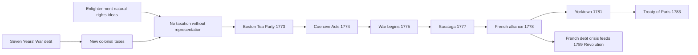
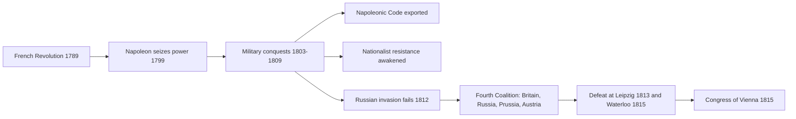

# Concept-Book Run

domain: /home/papagame/projects/digital-duck/conceptbook-app/public/domains/Users/200years_7powers_ch00/input/graph.yaml
target: revolutions_of_1830
started: 2026-09-28T02:24:16

## Teaching order (9 concepts)

- enlightenment_philosophy_1748
- seven_years_war_1756
- american_revolution_1775
- french_revolution_1789
- haitian_revolution_1791
- napoleonic_wars_1799
- congress_of_vienna_1815
- latin_american_independence_1808
- revolutions_of_1830

### enlightenment_philosophy_1748 (14.9s)

## Enlightenment Philosophy 1748

The Enlightenment was a movement of writers and philosophers who argued that government should be judged by reason and human experience rather than by religious authority or hereditary right. Two texts gave this movement its lasting political shape. In 1748, Montesquieu published *The Spirit of the Laws*, which argued that liberty is best protected not by a virtuous ruler but by a structure: government power divided into separate legislative, executive, and judicial branches, each able to check the others. Montesquieu drew this insight partly from his (somewhat idealized) reading of the British constitution, where Parliament, the Crown, and the courts held distinct functions. Fourteen years later, in 1762, Jean-Jacques Rousseau's *The Social Contract* made a different but complementary claim: legitimate political authority does not come from conquest, inheritance, or divine right, but from the consent of the governed, expressed as a "general will." A ruler who violates that trust forfeits the right to rule.

These two ideas — separation of powers and popular sovereignty — did not stay confined to books. They became the working vocabulary of revolution. The framers of the United States Constitution (1787) built the federal government explicitly around three separate branches, citing Montesquieu by name in the Federalist Papers. French revolutionaries in 1789 invoked Rousseau's language of popular will in the Declaration of the Rights of Man and of the Citizen, and later in the phrase "liberty, equality, fraternity." In Saint-Domingue, Haitian revolutionaries — including formerly enslaved leaders like Toussaint Louverture — turned the same Enlightenment claim of natural rights and consent against the French colonial planters who had refused to extend it to non-white subjects, producing the only successful large-scale slave revolution in history (1791–1804).

The problem these ideas were built to solve was practical: how to prevent any single person or institution from accumulating unchecked power. Montesquieu's answer — institutional division — and Rousseau's answer — a foundation of consent — became the two load-bearing pillars of nearly every constitutional government written afterward. Applying this concept means asking, of any political system, two diagnostic questions: Is power divided among independent institutions that can check one another? And does the government's authority ultimately trace back to the consent of those it governs? Regimes that fail either test — a single-branch autocracy, or a government installed without consent — are precisely the targets the nineteenth-century liberal movements, discussed next, organized against.

### seven_years_war_1756 (14.7s)

## Seven Years War 1756

By 1756, Britain and France had already fought three inconclusive colonial wars in North America and India. The Seven Years' War turned that rivalry into the first conflict fought on every populated continent except Australia and Antarctica — hence Winston Churchill's later description of it as "the first world war." In Europe it pitted Prussia and Britain against France, Austria, Russia, and Sweden; in North America it was known as the French and Indian War; in India it decided whether the French or British East India Company would dominate the subcontinent's trade and politics.

The military and financial outcomes were decisive. Britain's Royal Navy cut France's colonies off from resupply, enabling the capture of Quebec (1759) and Montreal (1760), while Robert Clive's victory at Plassey (1757) gave the British East India Company control of Bengal. The 1763 Treaty of Paris formalized the result: France ceded nearly all of Canada and its territory east of the Mississippi to Britain, and abandoned most of its claims in India, keeping only a handful of trading posts. Britain emerged as the world's leading colonial and naval power, controlling the whole of eastern North America and effective political and commercial dominance in India.

The war's most consequential legacy, however, was fiscal rather than territorial. France's crown debt roughly doubled during the conflict, reaching over 2 billion livres by the 1770s, with annual interest payments consuming close to half of royal revenue by the 1780s. Louis XV's and later Louis XVI's finance ministers — Turgot, Necker, Calonne — repeatedly tried and failed to reform a tax system that exempted the nobility and clergy, because any change required approval from a nobility unwilling to give up its privileges. This unresolved fiscal crisis, compounded by France's further borrowing to support the American Revolution against Britain in the 1770s–80s, left the monarchy insolvent by 1789 and forced Louis XVI to summon the Estates-General — the meeting that opened directly into the French Revolution.

For problem-solving purposes, treat this as a case study in tracing causal chains across decades: identify how a military and financial outcome in one conflict (war debt, loss of colonial revenue) becomes a structural constraint that limits a government's options a generation later, ultimately triggering a political crisis it never intended to cause.

### american_revolution_1775 (17.0s)

## American Revolution 1775

The American Revolution was the political and military conflict in which thirteen British colonies in North America declared independence in 1776 and, by 1783, secured recognition as the sovereign United States. Its intellectual foundation lay in Enlightenment ideas about natural rights, consent of the governed, and limits on state power — arguments drawn from thinkers like John Locke and applied directly in the Declaration of Independence's claim that governments derive "just powers from the consent of the governed." Its immediate triggers were fiscal and constitutional: Britain, having tripled its national debt fighting the Seven Years' War, imposed new taxes on the colonies (the Stamp Act of 1765, the Townshend Acts of 1767, the Tea Act of 1773) without colonial representation in Parliament — giving rise to the protest "no taxation without representation."

A worked example of cause and consequence: after the Boston Tea Party (December 1773), Parliament passed the Coercive Acts (1774), closing Boston's port and revoking Massachusetts's charter. Colonial delegates responded by convening the First Continental Congress, and fighting broke out at Lexington and Concord in April 1775. The war that followed was decided as much by diplomacy as by battlefield victory: the American triumph at Saratoga (1777) persuaded France to enter as a formal ally in 1778, followed by Spain and the Dutch Republic. French naval and military support proved decisive at Yorktown (1781), where a Franco-American force trapped Cornwallis's army of roughly 8,000 troops, forcing his surrender and effectively ending major fighting. The 1783 Treaty of Paris recognized American independence and set the new nation's boundaries at the Mississippi River.

For problem-solving application, treat this as a case study in how domestic grievances become transnational upheaval: identify the fiscal trigger (war debt forces new taxation), the constitutional trigger (taxation without representation violates colonial self-governance norms), and the external multiplier (a rival power's intervention transforms a colonial rebellion into a great-power war). This same three-step lens — fiscal strain, contested legitimacy, external alliance — recurs in later revolutions and is worth testing against each new case you study.

France's intervention came at severe cost: financing the American war added roughly 1 billion livres to a monarchy already strained by the Seven Years' War, a debt burden that fed directly into the fiscal crisis of the 1780s and the calling of the Estates-General in 1789. The American Revolution thus did double work — it produced the first written constitutional republic grounded in Enlightenment principles, and it helped bankrupt the very ally whose support made that outcome possible.

*Causal chain from imperial debt and Enlightenment ideas through war to independence and France's own fiscal crisis.*

### french_revolution_1789 (14.5s)

## French Revolution 1789

By 1789, the French monarchy was insolvent. Decades of war spending — including massive loans to support the American Revolution — had pushed the crown deep into debt, while a regressive tax system exempted the nobility and clergy and placed the burden on commoners. When King Louis XVI convened the Estates-General in May 1789 to approve new taxes, the Third Estate (commoners), representing roughly 97 percent of the population but historically outvoted by the two privileged estates, broke away and declared itself the National Assembly. On July 14, 1789, Parisians stormed the Bastille fortress-prison, a symbolic act against royal tyranny that marks the Revolution's traditional start date.

Worked example: On August 4, 1789, the National Assembly abolished feudal privileges in a single overnight session, eliminating seigneurial dues, tithes, and venal offices. Weeks later, on August 26, it adopted the Declaration of the Rights of Man and of the Citizen, asserting that "men are born and remain free and equal in rights" and that sovereignty resides in the nation rather than the monarch. This sequence — fiscal crisis, representative revolt, symbolic uprising, legal abolition of the old order, and a written rights charter — became the template later reproduced across Latin America, the 1848 European revolutions, and 20th-century decolonization movements.

Problem-solving application: Historians use a comparative method to explain why France's revolution radicalized into the Terror (1793–1794, roughly 16,000–40,000 executions) while the American Revolution did not. Key evidence: France faced simultaneous war with Austria and Prussia (from 1792), internal counter-revolutionary revolt in the Vendée, and near-total currency collapse (the assignat lost over 80 percent of its value by 1795) — external and economic pressures largely absent in the American case. Applying this evidence, students can assess a general historical pattern: revolutions that abolish a ruling order without a stable transitional institution, under simultaneous foreign invasion and economic collapse, are especially prone to radical, coercive phases as factions compete to fill the resulting power vacuum. Napoleon Bonaparte's coup in 1799 ended the decade by concentrating power once again — but the Declaration's principles of legal equality and popular sovereignty survived and were exported through the Napoleonic Code across Europe.

### haitian_revolution_1791 (22.4s)

## Haitian Revolution 1791

Saint-Domingue in 1791 was the wealthiest colony in the world: its sugar and coffee plantations, worked by roughly 500,000 enslaved Africans, generated more export revenue than the entire thirteen American colonies combined had before independence. That wealth rested on brutal demographics — enslaved people outnumbered free colonists nearly ten to one, and mortality on the plantations was so severe that planters relied on constant new shipments from Africa rather than natural population growth to sustain their workforce. When news of the French Revolution's Declaration of the Rights of Man reached the colony, it exposed a glaring contradiction: a nation proclaiming liberty and equality was simultaneously enforcing the most violent slave system in the Americas.

In August 1791, enslaved leaders including Dutty Boukman organized a coordinated uprising in the northern plains, burning plantations and killing enslaved-owners. What began as a revolt evolved, under the leadership of Toussaint Louverture, into a disciplined military and political movement. Louverture's forces defeated Spanish and British invasion attempts in the 1790s, and by 1801 he had unified the colony and abolished slavery outright. Napoleon, seeking to restore both slavery and French control, sent a massive expeditionary force in 1802; Louverture was captured and died in a French prison in 1803. But his successor, Jean-Jacques Dessalines, continued the fight, defeating the remaining French army — already decimated by yellow fever, losing over 50,000 soldiers — at the Battle of Vertières in November 1803. On January 1, 1804, Dessalines declared independence, founding Haiti as the first Black republic and the only nation born of a successful slave revolt.

To apply this history analytically: compare Haiti's outcome to slave revolts elsewhere in the Americas, such as the 1739 Stono Rebellion in South Carolina or Jamaica's Maroon Wars, which were suppressed or contained without dismantling the plantation system. What distinguished Saint-Domingue was the scale of enslaved population, the collapse of colonial authority during the French Revolution's chaos, and Louverture's ability to convert scattered uprisings into a unified army capable of defeating three European powers. The revolution's aftermath mattered as much as its victory: fearing similar revolts, the United States and European powers diplomatically isolated Haiti for decades, and France extracted a crippling independence indemnity in 1825 — evidence that the moral shock of Haiti's success provoked a defensive counter-reaction across the slaveholding Atlantic world, even as it inspired later abolitionist movements.

### napoleonic_wars_1799 (17.3s)

## Napoleonic Wars 1799

When Napoleon Bonaparte seized power in the coup of 18 Brumaire (November 9, 1799), France had already been at war with European monarchies for seven years, but the conflict now entered a new phase driven by one man's ambition to remake the continent. Between 1803 and 1815, Napoleon's armies defeated Austria, Prussia, and Russia in a series of campaigns — Austerlitz (1805), Jena-Auerstedt (1806), Friedland (1807) — that placed most of continental Europe under direct French rule or client-state control. Wherever French armies marched, they carried the Napoleonic Code of 1804, which abolished feudal privilege, established legal equality before the law, and secularized property and marriage law. This was revolutionary export by force: the same principles that had overturned the French aristocracy in 1789 were now imposed on Italian, German, and Polish territories, dismantling centuries-old feudal obligations in a matter of months.

The occupation had a paradoxical effect: it dismantled old hierarchies but also provoked the peoples it "liberated" into nationalist resistance. Spanish guerrillas after 1808, Prussian reformers humiliated at Jena, and German intellectuals reacting against French cultural dominance all began to imagine their fragmented territories as unified nations — a sentiment that would shape European politics for the next century.

Napoleon's overreach came in 1812, when he invaded Russia with roughly 600,000 troops and retreated with fewer than 100,000, destroyed by scorched-earth tactics and winter rather than direct battlefield defeat. Sensing the opportunity, Britain, Russia, Prussia, and Austria formed the Sixth and Seventh Coalitions, defeating Napoleon decisively at Leipzig (1813) and finally at Waterloo (1815). This coalition marked a turning point in the practice of great-power politics: for the first time, rival states subordinated their individual rivalries to jointly contain a single hegemon threatening the continental balance, a precedent formalized at the Congress of Vienna (1814–1815), which redrew Europe's borders explicitly to prevent any one power from dominating again.

*The chain from Napoleon's rise through conquest, resistance, and coalition defeat to the post-war settlement.*

The lasting lesson for students of international relations: legal and administrative reform can spread through conquest, but conquest also breeds the very nationalist consciousness that later resists it — and unchecked power tends to summon coalitions that check it.

### congress_of_vienna_1815 (14.8s)

## Congress Of Vienna 1815

After Napoleon's defeat, the victorious powers — Austria, Prussia, Russia, and Britain, later joined by a restored France — convened in Vienna from September 1814 to June 1815 to settle the territorial and political order of Europe. The Congress was not a single formal assembly but a nine-month round of negotiations, balls, and bilateral deals among monarchs and foreign ministers, chief among them Austria's Klemens von Metternich, who chaired the proceedings, and France's Charles Maurice de Talleyrand, who skillfully secured France's readmission as a great power despite its recent defeat. Their guiding principle was balance of power: no single state should again be strong enough to dominate the continent, as France had done under Napoleon. The Final Act, signed June 9, 1815, redrew borders accordingly — Prussia gained the Rhineland and part of Saxony, Russia absorbed most of the Duchy of Warsaw as "Congress Poland," Austria received northern Italy (Lombardy-Venetia), and a buffer Kingdom of the Netherlands was created to check France. The settlement also restored the Bourbon monarchy in France but limited its 1815 borders to those of 1790, denying it territorial spoils.

The Congress's deeper innovation was procedural: it established the Concert of Europe, an informal system in which the great powers would meet periodically — at Aix-la-Chapelle (1818), Troppau (1820), Laibach (1821), and Verona (1822) — to manage crises collectively rather than let disputes escalate into unilateral war. This produced the longest stretch without a general European war between 1815 and the Crimean War in 1853, and no war involving all major powers simultaneously until 1914 — nearly a century of relative stability, a striking contrast to the quarter-century of near-continuous warfare from 1792 to 1815 that had killed an estimated 3.5 to 6 million people.

The problem-solving lesson for later diplomacy was structural: multilateral consultation, negotiated equilibrium, and legitimacy-based restoration (returning deposed dynasties to stabilize domestic order) proved more durable than punitive settlements. The League of Nations (1919) and the United Nations (1945) both adapted this congress-based template — regular multilateral meetings among leading powers to manage disputes before they escalated — though both also tried to correct Vienna's central weakness: it managed power among monarchs, not the nationalist and popular movements that would eventually strain and break its settlement by 1848 and 1914.

### latin_american_independence_1808 (15.9s)

## Latin American Independence 1808

In 1808 Napoleon deposed the Spanish king and installed his own brother on the throne, then occupied Portugal, forcing its royal family to flee to Brazil. This single act shattered the legal basis of colonial rule. Spanish American colonists had governed under a loyalty to the crown, not to Spain as a nation; with no legitimate king, cities across the Americas formed juntas claiming to hold sovereignty in trust until Ferdinand VII was restored. What began as a defense of the monarchy evolved, over the next two decades, into full independence movements, because the temporary councils resisted relinquishing power even after Ferdinand returned in 1814 and tried to reassert absolute rule.

The movement unfolded in three major theaters. In Mexico, the priest Miguel Hidalgo issued his 1810 call to arms, the Grito de Dolores, igniting a mass insurgency of indigenous and mestizo peasants; though Hidalgo was captured and executed in 1811, the rebellion he sparked ultimately produced Mexican independence in 1821. In the north of South America, Simón Bolívar led a grinding campaign across Venezuela, Colombia, Ecuador, and into Peru and Bolivia, winning decisive battles such as Boyacá (1819) and Carabobo (1821) that broke Spanish military power in the Andes. In the south, José de San Martín crossed the Andes from Argentina in 1817 to liberate Chile, then sailed north to help free Peru, meeting Bolívar at Guayaquil in 1822 before withdrawing from the struggle entirely. Brazil took a different path: in 1822 the Portuguese prince regent Pedro, left in charge of the colony, declared independence himself rather than return to a subordinate role in Lisbon, making Brazil an independent empire without the sustained warfare seen in Spanish America.

By 1826, Spain retained only Cuba and Puerto Rico in the Americas, having lost territory that had generated immense silver wealth for three centuries. Applying this case requires distinguishing *cause* from *trigger*: long-standing grievances — exclusion of American-born elites (Creoles) from top colonial offices, trade restrictions favoring Spanish merchants, and Enlightenment ideas absorbed from the French and American revolutions — created the underlying pressure, while Napoleon's invasion supplied the immediate opening. A useful comparative exercise is to contrast this outcome with the Haitian Revolution of 1791–1804: Haiti's independence came from an enslaved population overturning the entire social order, whereas most Spanish American independence movements were led by Creole elites who preserved existing social hierarchies, illustrating how the same era of revolutionary upheaval produced sharply different social outcomes depending on who led the fight and what they sought to preserve or dismantle.

### revolutions_of_1830 (14.3s)

## Revolutions Of 1830

By 1830 the settlement engineered at the Congress of Vienna fifteen years earlier had held together Europe's monarchies, but it had not resolved the tension between restored royal authority and the liberal, nationalist aspirations the French Revolution had first unleashed. France's Charles X supplied the spark: in July 1830 he issued the July Ordinances, dissolving the newly elected Chamber of Deputies, gutting the franchise, and censoring the press. Parisians responded with three days of street fighting — the "Three Glorious Days" (July 27–29) — that forced Charles X to abdicate. Rather than restoring a republic, the propertied liberal elite installed Louis-Philippe, Duke of Orléans, as a constitutional "Citizen King," a compromise that satisfied the bourgeoisie without granting the broader political rights the Parisian crowds had fought for.

The July Revolution's news traveled fast. In Brussels, opposition to Dutch rule — imposed on the Southern Netherlands by the Vienna settlement to create a buffer state against France — erupted into rebellion that August. Belgian rebels declared independence, and by 1831 the great powers, wary of a wider war but unwilling to let Dutch King William I forcibly reverse the outcome, recognized Belgium as an independent, neutral kingdom under Leopold I. In Poland, however, the uprising that began in Warsaw in November 1830 met a different fate: Tsar Nicholas I crushed the Polish rebels by September 1831, abolished the Congress Kingdom's constitution, and imposed direct Russian rule — a stark reminder that liberal victories in Western Europe did not translate automatically eastward.

The pattern across all three cases reveals the Vienna order's real limits: it could bend in France and Belgium, where Britain and a reform-minded French monarchy had interests in a negotiated outcome, but it snapped back hard wherever an autocratic power like Russia held decisive military force. The underlying grievances — restricted suffrage, censorship, and unresolved national identity — went unaddressed rather than resolved, and they would resurface with far greater force across the continent in 1848, this time touching nearly every major European capital at once.

## Run complete

total: 152.7s
