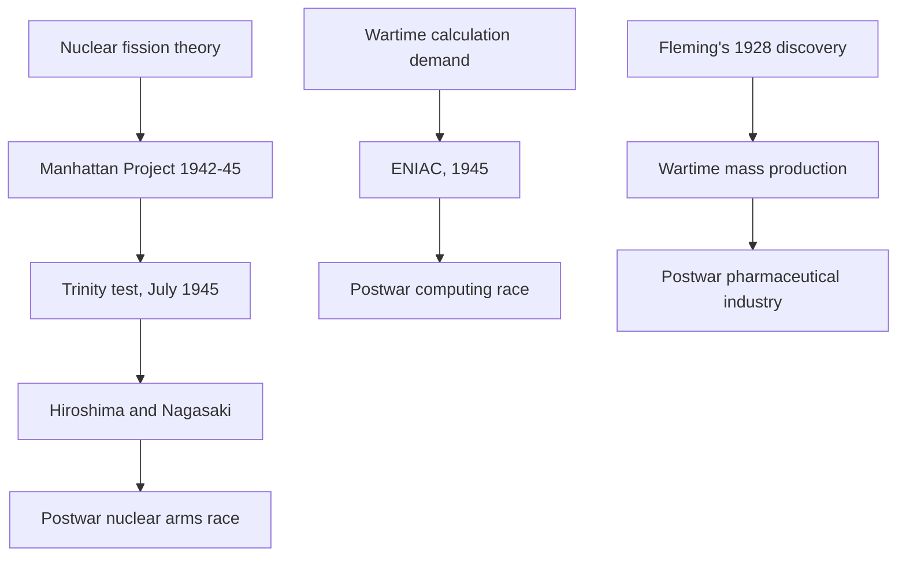
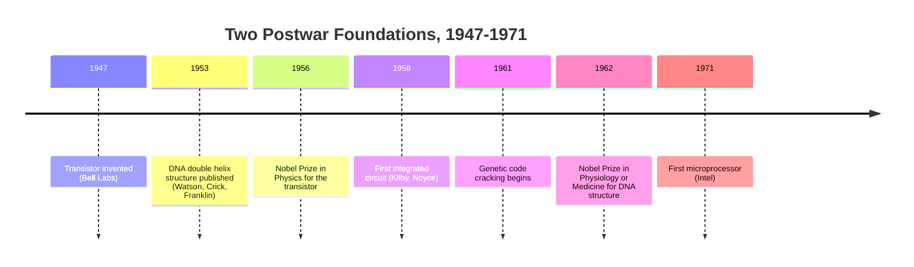
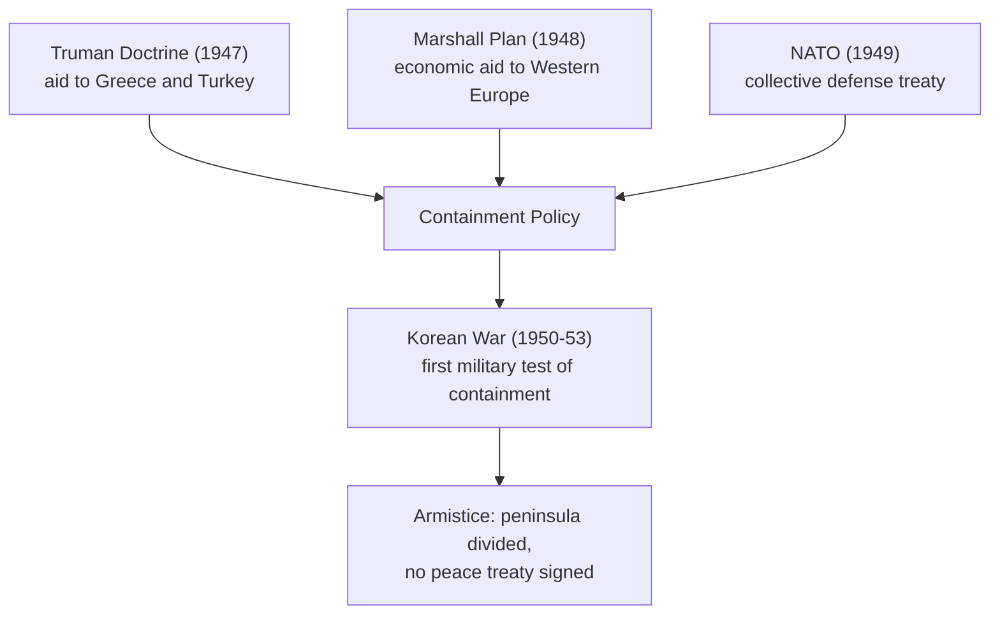

# Concept-Book Run

domain: /home/papagame/projects/digital-duck/conceptbook-app/public/domains/Users/200years_7powers_ch16/input/graph.yaml
target: science_space_race_as_cold_war_proxy
started: 2026-09-28T02:35:13

## Teaching order (9 concepts)

- cold_war_bipolar_order
- science_atomic_age_and_computing_dawn
- russia_soviet_superpower_1945
- science_dna_and_transistor
- usa_postwar_superpower_1945
- russia_cold_war_buildup
- science_space_race_and_microprocessor
- usa_cold_war_containment
- science_space_race_as_cold_war_proxy

### cold_war_bipolar_order (14.6s)

## Cold War Bipolar Order

The Cold War bipolar order refers to the international system that emerged after 1945, in which global power concentrated in two rival superpowers—the United States and the Soviet Union—rather than dispersing among several roughly equal great powers, as it had before both World Wars. Each superpower anchored a bloc: the US led NATO (founded 1949) and a network of alliances (SEATO, CENTO, bilateral treaties with Japan and South Korea), while the USSR led the Warsaw Pact (founded 1955) and the Communist bloc in Eastern Europe. Both sides extended influence through client states, economic aid, and proxy conflicts, and both built nuclear arsenals explicitly designed to deter attack by threatening unacceptable retaliation—a condition strategists called mutual assured destruction. By 1962, the US held roughly 27,000 nuclear warheads and the USSR about 3,300; by the late 1980s both arsenals exceeded 10,000 warheads each, illustrating how bipolarity fueled an arms race rather than a single decisive conflict.

A clear worked example is the division of Germany and Berlin. At the 1945 Yalta and Potsdam conferences, the Allies split Germany into four occupation zones; the American, British, and French zones merged into West Germany (Federal Republic, 1949) while the Soviet zone became East Germany (Democratic Republic, 1949). Berlin, though deep inside Soviet territory, was itself divided into four sectors. When the Soviets blockaded West Berlin's land access in June 1948, the US and Britain responded with the Berlin Airlift, flying in over 2.3 million tons of supplies over eleven months rather than abandoning the city—demonstrating that bipolar competition operated through calibrated shows of resolve, not direct military engagement. The Berlin Wall (built 1961) later became the era's starkest physical symbol of this division.

To analyze any Cold War crisis, ask three questions: (1) Which bloc initiated the action, and what did it signal about resolve or weakness? (2) Did the opposing superpower respond directly or through a proxy (as in Korea 1950–53, Vietnam, or Afghanistan after 1979)? (3) Did the crisis escalate toward direct confrontation, as in the Cuban Missile Crisis (October 1962), or de-escalate through negotiation, as with the Strategic Arms Limitation Talks (1972)? Applying this framework to any Cold War event reveals the same underlying logic: two blocs managing rivalry through deterrence, alliance-building, and proxy competition rather than head-on war between the superpowers themselves.

### science_atomic_age_and_computing_dawn (15.9s)

## Science Atomic Age And Computing Dawn

By the summer of 1945, three research programs — each begun as a wartime emergency measure — converged to redefine what science could do to the world in real time. On July 16, 1945, the Trinity test in New Mexico detonated the first nuclear weapon, releasing energy equivalent to roughly 21,000 tons of TNT from a chain reaction inside a sphere of plutonium smaller than a grapefruit. Three weeks later, atomic bombs killed an estimated 70,000–80,000 people instantly at Hiroshima and 40,000 at Nagasaki, with tens of thousands more dying from burns and radiation sickness in the following months. The Manhattan Project had cost roughly $2 billion (about $28 billion in today's dollars) and employed some 130,000 people, proving that a government could convert abstract theoretical physics — nuclear fission, first explained by Otto Hahn, Lise Meitner, and Otto Frisch in 1938–39 — into a weapon capable of ending a war in days rather than years.

The same year, ENIAC (Electronic Numerical Integrator and Computer), completed at the University of Pennsylvania, became the first general-purpose electronic computer, using 17,468 vacuum tubes to perform calculations — including artillery trajectory tables and early hydrogen bomb feasibility studies — thousands of times faster than mechanical calculators. Meanwhile, penicillin, discovered by Alexander Fleming in 1928 but not mass-produced until wartime demand forced pharmaceutical firms to scale fermentation techniques, went from a laboratory curiosity to an antibiotic manufactured in the billions of units, cutting battlefield infection deaths dramatically and setting the template for the modern pharmaceutical industry.

A worked comparison shows why these three breakthroughs are treated as a single hinge point rather than isolated inventions. Consider what each capability made newly possible: the bomb converted physics into geopolitical leverage (a single weapon could now do what previously required massed armies); the computer converted calculation into a scalable, repeatable process (problems too complex for human calculators — such as bomb design itself — became tractable); and penicillin converted biology into industrial output (a scarce discovery became a mass-produced commodity). Each of these transitions — from discovery to weaponizable capacity, from labor to machine calculation, from craft to mass production — became the seed pattern that postwar nations would race to replicate in their own military, computing, and public-health programs, discussed in the country threads that follow.

*The three converging 1945 breakthroughs — nuclear, digital, and biological — and the postwar races each one triggered.*

### russia_soviet_superpower_1945 (15.2s)

## Russia Soviet Superpower 1945

By May 1945 the Soviet Union had absorbed the war's heaviest losses — an estimated 24 to 27 million dead, roughly one in seven citizens — yet emerged as one of only two states capable of projecting military power across an entire continent. The Red Army had advanced from Stalingrad to Berlin, and by war's end it physically occupied Poland, Romania, Bulgaria, Hungary, Czechoslovakia, and the eastern half of Germany. Stalin treated this occupation not as a temporary wartime measure but as the foundation of a permanent security buffer against future invasion from the west — a buffer he considered non-negotiable given that Germany had invaded Russia twice in thirty years. This is the pivot point of 1945: a wartime ally holding territory it had no intention of relinquishing.

Worked example: at the Yalta Conference in February 1945, Stalin, Roosevelt, and Churchill agreed that liberated Europe would hold "free and unfettered elections." Stalin signed this declaration while his forces already controlled Poland's territory and, within weeks, began installing a Soviet-backed provisional government there instead. By 1947, similar processes — banning opposition parties, controlling police ministries, rigging or canceling votes — had converted Poland, Romania, Bulgaria, and Hungary into one-party Communist states. Western leaders read this pattern as a broken promise; Stalin read Eastern Europe as compensation for 27 million dead and insurance against a third German invasion. Both readings were internally consistent, which is precisely why the wartime alliance could not survive contact with the postwar settlement.

The problem-solving lesson here is how to read a treaty's language against the material facts on the ground. A student analyzing 1945 should not ask "did Stalin lie at Yalta?" as a moral question alone, but should trace the sequence: which army controlled which territory at the moment of signing, what enforcement mechanism (if any) existed to compel compliance, and who held the greater bargaining leverage — the side with troops physically present, or the side asking for promises. Applying this method to Yalta explains why the declaration was unenforceable: the United States had no forces in Poland to contest Soviet control, and Britain lacked the capacity to act alone. Territorial occupation, not signed language, determined the actual postwar map — a pattern worth testing against later Cold War flashpoints such as Czechoslovakia in 1948 or Berlin in 1961.

### science_dna_and_transistor (17.0s)

## Science Dna And Transistor

Between 1947 and 1953, two discoveries made within a few miles of each other on America's East Coast quietly set the terms for the rest of the twentieth century. At Bell Telephone Laboratories in Murray Hill, New Jersey, physicists John Bardeen, Walter Brattain, and William Shockley demonstrated the first working transistor on December 23, 1947 — a solid-state device that could amplify and switch electrical signals using a sliver of germanium instead of a bulky, fragile, power-hungry vacuum tube. Six years later, at the Cavendish Laboratory in Cambridge, England, James Watson and Francis Crick — drawing on Rosalind Franklin's X-ray diffraction image "Photo 51" — published the double-helix structure of DNA in April 1953, showing how genetic information could be copied and passed on.

Neither discovery was an isolated technical curiosity; each replaced an entire prior paradigm. The transistor eliminated the vacuum tube's need for a heated filament, making devices smaller, cooler, cheaper, and vastly more reliable — a single tube in a 1940s computer like ENIAC might fail every few hours, while transistors could run for years. The DNA structure replaced vague, competing hypotheses about heredity with a concrete physical mechanism: two complementary strands that could separate and each serve as a template for a new copy, explaining at a stroke how genetic information is both stored and replicated.

The practical significance of both discoveries did not appear immediately — it took roughly a decade of intervening engineering and scientific work before either paid off commercially. The transistor's economic payoff arrived with the integrated circuit (Robert Noyce and Jack Kilby, 1958–1959) and then the microprocessor (Intel, 1971), the lineage that runs directly to every smartphone and computer in use today. The DNA structure's payoff arrived with the cracking of the genetic code (1961–1966) and, decades later, the biotechnology industry: recombinant DNA (1973), the founding of Genentech (1976), and eventually the Human Genome Project (1990–2003). A useful comparative exercise: if Bell Labs' 1947 transistor is compared to Bardeen, Brattain, and Shockley's shared 1956 Nobel Prize in Physics, and Watson and Crick's 1953 paper to their shared 1962 Nobel Prize in Physiology or Medicine (with Maurice Wilkins, following Franklin's death in 1958, which made her ineligible), the lag in each case is roughly a decade — illustrating how the scientific community requires a period of independent verification and follow-on work before recognizing a discovery's full weight.

*Parallel timelines showing how the 1947 transistor and 1953 DNA structure each took roughly a decade to mature into industry-defining technologies.*

### usa_postwar_superpower_1945 (16.8s)

## Usa Postwar Superpower 1945

When the guns fell silent in 1945, the United States occupied a position no great power had held before: it was simultaneously the largest economy, the dominant military force, and the sole possessor of the atomic bomb, while every other major belligerent lay in physical or financial ruin. American gross national product had roughly doubled during the war, rising from about 91 billion dollars in 1939 to over 210 billion dollars in 1945, and the country held about half of the world's manufacturing capacity and roughly two-thirds of its gold reserves. Continental United States territory had suffered no bombing, no invasion, and no famine, in sharp contrast to the Soviet Union's estimated 20 million dead and shattered western industrial base, Germany's leveled cities, Japan's firebombed and atomic-bombed urban centers, and Britain's exhausted treasury and crushing war debt.

This unmatched economic and military position let Washington do something no victor had attempted after the First World War: build the rules of the postwar order rather than simply retreat into isolation. At the Bretton Woods Conference in July 1944, forty-four Allied nations agreed on a monetary system anchoring international exchange rates to the U.S. dollar, itself convertible to gold at 35 dollars per ounce, and created the International Monetary Fund and the World Bank to stabilize currencies and finance reconstruction. In June 1945, delegates in San Francisco signed the United Nations Charter, giving the United States one of five permanent Security Council seats and hosting the new organization's headquarters on American soil in New York. Where the Treaty of Versailles had left the U.S. Senate to reject membership in the League of Nations in 1919, the postwar leadership in 1945 committed the country to permanent international engagement, later reinforced by the Marshall Plan's roughly 13 billion dollars in European reconstruction aid beginning in 1948.

The problem this position posed for policymakers was not military weakness but the reverse: how to convert overwhelming relative strength into a stable, self-sustaining order before rivals rebuilt. The Bretton Woods and United Nations frameworks were the answer — institutions that locked in American economic leadership and diplomatic legitimacy through durable rules rather than through direct occupation, a lesson explicitly drawn from the failed peace of 1919.

### russia_cold_war_buildup (15.0s)

## Russia Cold War Buildup

By 1949 the Soviet Union had closed the gap that many Western strategists assumed would last a decade or more. On August 29, 1949, at the Semipalatinsk test site in Kazakhstan, the USSR detonated its first atomic bomb, code-named First Lightning, ending the four-year American monopoly on nuclear weapons that had underwritten U.S. diplomatic leverage since Hiroshima. The program succeeded years ahead of Western estimates partly through original Soviet physics research and partly through espionage — most notably information passed by Klaus Fuchs, a scientist who had worked on the Manhattan Project. The result was immediate: nuclear weapons stopped being a one-sided American asset and became a shared, mutual danger, reshaping how both blocs calculated risk in every subsequent confrontation.

The Warsaw Pact, signed on May 14, 1955, formalized this counterweight on the conventional-military side. It was a direct response to NATO's decision days earlier to admit West Germany, an outcome Moscow viewed as reviving German military power on its border only a decade after the war. The treaty bound the USSR and seven Eastern European states — Poland, Czechoslovakia, Hungary, Romania, Bulgaria, Albania, and East Germany — into a unified command structure under Soviet leadership, giving legal and organizational form to an alliance system that in practice also let Moscow justify stationing troops and intervening in member states, as it later did in Hungary (1956) and Czechoslovakia (1968).

Sputnik, launched October 4, 1957, added a third dimension: demonstrated missile reach. The satellite itself was modest — 184 pounds, beeping radio signals — but the R-7 rocket that carried it into orbit was an intercontinental ballistic missile capable of striking the continental United States, a fact not lost on U.S. defense planners. The launch triggered the "Sputnik crisis" in American public opinion, an intelligence reassessment of Soviet missile capacity, and, within a year, the creation of NASA and the National Defense Education Act, which funneled federal funding into science education.

For problem-solving purposes, treat these three events as evidence, not isolated trivia: a historical argument that the Cold War became genuinely bipolar rests on showing convergence across at least three domains — weapons (1949), alliance structure (1955), and delivery/technology (1957) — occurring within a single decade. When asked to assess a "power transition" in any period, look for this same multi-domain convergence rather than a single dramatic event.

### science_space_race_and_microprocessor (14.7s)

## Science Space Race And Microprocessor

The Soviet Union's launch of Sputnik on October 4, 1957 — a 184-pound satellite that did nothing but beep — triggered a disproportionate shock in the United States precisely because of what it implied rather than what it did. A rocket powerful enough to reach orbit was also powerful enough to deliver a nuclear warhead across continents. Within a year Congress created NASA (1958) and the Advanced Research Projects Agency (ARPA, later DARPA), and the Eisenhower administration poured funding into science education through the National Defense Education Act. The space race that followed was never purely scientific: it was a proxy contest for which economic and political system — American capitalism or Soviet communism — could out-produce the other in advanced technology, watched by a global audience deciding which model to emulate.

The contest reached its symbolic peak on July 20, 1969, when Apollo 11's Neil Armstrong became the first person to walk on the Moon, fulfilling President Kennedy's 1961 pledge to land a man there "before this decade is out." The Apollo program cost roughly $25 billion (about $150 billion in today's dollars) and employed 400,000 people at its peak — an investment justified publicly as scientific exploration but privately understood, in Kennedy's own words to NASA administrator James Webb, as a demonstration of national capability during the Cold War.

That spending left an infrastructure behind it. Guidance computers built for Apollo pushed the U.S. semiconductor industry to miniaturize circuits, and NASA's demand for reliable, compact electronics was a major early customer for integrated circuits. This lineage culminated in 1971 when Intel released the 4004, the first microprocessor: a complete central processing unit — arithmetic logic, control, and registers — fabricated on a single chip about the size of a fingernail, containing 2,300 transistors. Where earlier computers filled rooms, the 4004 showed that computation could be miniaturized indefinitely, a capability first proven necessary by spaceflight's weight and power constraints.

The practical application of this history is tracing dual-use funding: military and prestige-driven government spending (Cold War competition, Apollo) frequently seeds civilian technologies decades later — GPS satellites, communications networks, and the personal computer all descend from space-race-era investment, illustrating how geopolitical competition can accelerate technological diffusion far beyond its original strategic purpose.

### usa_cold_war_containment (14.8s)

## Usa Cold War Containment

By 1947, the wartime alliance between the United States and the Soviet Union had collapsed into open rivalry. American policymakers, drawing on diplomat George Kennan's "long telegram" and subsequent "Mr. X" article, concluded that Soviet expansion could not be reversed by force without risking another world war, but that it could be checked — contained — at every point where Moscow tried to extend its influence. This became the doctrine of containment, and it defined American foreign policy for the next four decades.

The doctrine took concrete form quickly. In March 1947, President Harry Truman asked Congress for $400 million in aid to Greece and Turkey, arguing that the United States must support "free peoples who are resisting attempted subjugation by armed minorities or by outside pressures" — a commitment that became known as the Truman Doctrine. A year later, the Marshall Plan committed roughly $13 billion (over $150 billion in today's dollars) to rebuild Western European economies, on the reasoning that poverty and desperation were the soil in which communist movements grew. In April 1949, twelve nations signed the North Atlantic Treaty, creating NATO and binding the United States to the defense of Western Europe for the first time in peacetime history. Article 5 of that treaty declared that an attack on one member would be treated as an attack on all.

Containment's first military test came in Korea. When North Korean forces invaded the South in June 1950, Truman committed American troops under a United Nations mandate without seeking a formal declaration of war from Congress. Over three years of fighting — including China's entry after UN forces approached the Yalu River — the conflict killed an estimated 36,000 American service members and left the peninsula divided along almost the same line as before the war. The 1953 armistice was a ceasefire, not a peace treaty; a state of war technically persists between North and South Korea to this day.

Korea established a pattern that would recur throughout the Cold War: the United States would use military force to prevent communist gains, but would deliberately limit that force — avoiding direct war with the Soviet Union or China — to prevent escalation into nuclear conflict.

*How the diplomatic and economic tools of containment (1947-49) established the framework that led to America's first Cold War military commitment in Korea.*

### science_space_race_as_cold_war_proxy (15.3s)

## Science Space Race As Cold War Proxy

By the mid-1950s, the arms race and the space race had become the same contest viewed from two angles. Both superpowers used long-range rocketry developed for nuclear delivery — the R-7 and the Atlas — to launch satellites, so a demonstration of orbital capability was simultaneously a demonstration of intercontinental missile reach. When the Soviet Union launched Sputnik 1 on October 4, 1957, the achievement registered in Washington not as a science story but as a security shock: if a Soviet rocket could put a satellite in orbit, it could deliver a warhead to American soil. That single event triggered the creation of NASA (1958) and a surge in U.S. federal research spending, embedding space exploration permanently inside Cold War strategy rather than treating it as a separate scientific pursuit.

The Apollo program made the equivalence explicit. President Kennedy's 1961 pledge to land a man on the Moon "before this decade is out" came weeks after the Soviet Union put Yuri Gagarin into orbit (April 1961) — a direct response to a geopolitical humiliation, funded at roughly \$25.4 billion (about \$150 billion in today's dollars) precisely because prestige, not orbital mechanics, was the deliverable. When Apollo 11 landed on July 20, 1969, the outcome was reported worldwide as an American Cold War victory: the United States had answered Sputnik with an achievement the Soviet Union could not match, reversing the "space gap" narrative of the late 1950s.

Applying this case requires separating the scientific record from the political reading of it. Historians distinguish the technical fact (both nations achieved orbital flight and, later, the U.S. achieved crewed lunar landing) from the interpretive fact (each achievement was consumed domestically and internationally as evidence of the superiority of one economic and political system over the other). A useful exercise: for a given event — Sputnik, Gagarin's flight, Apollo 11 — identify (1) the engineering milestone itself, (2) the funding and policy decision it triggered in the rival state, and (3) the public narrative each government constructed from it. This three-part decomposition is why the space race is the clearest example in modern history of a single event chain serving simultaneously as a chapter in the history of science and a chapter in the history of great-power rivalry.

## Run complete

total: 162.9s
