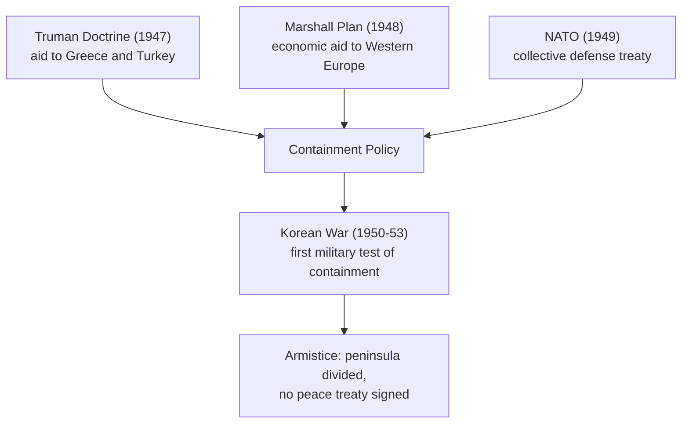
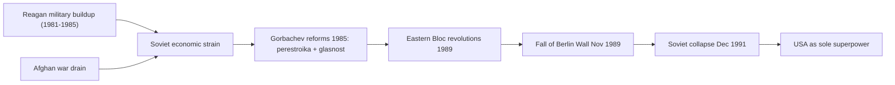
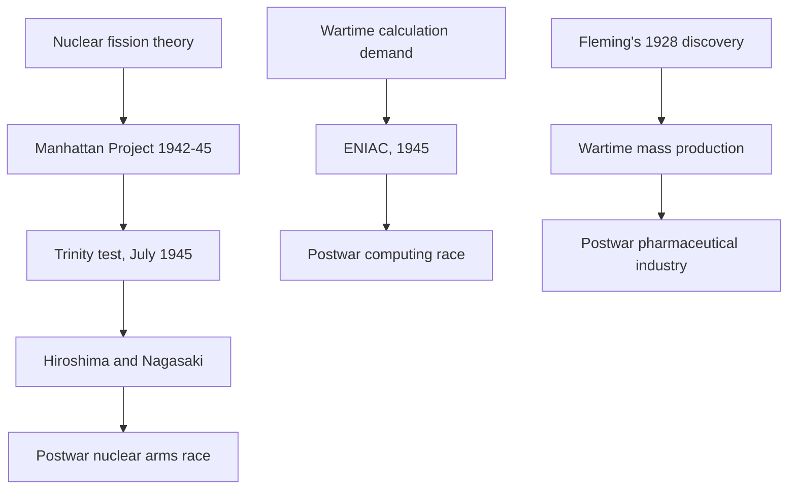
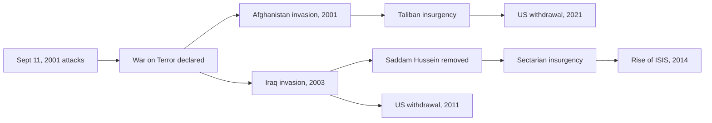
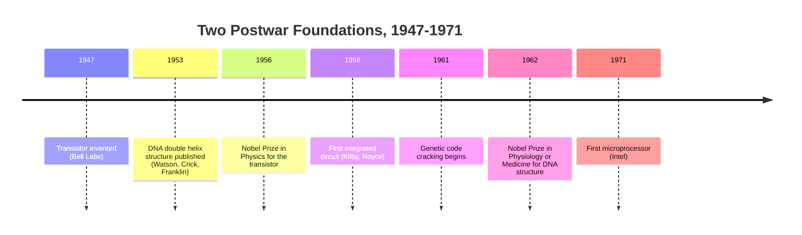
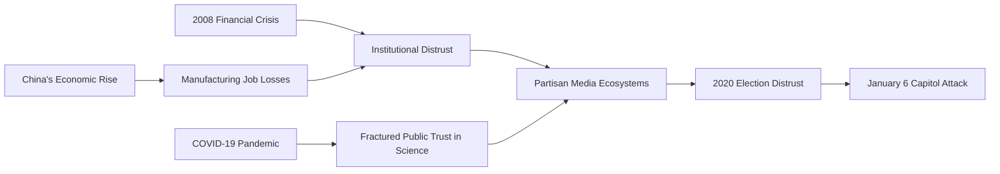
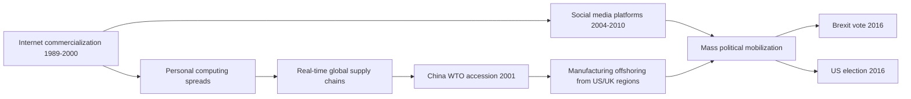

# Concept-Book Run

domain: /home/papagame/projects/digital-duck/conceptbook-app/public/domains/Users/200years_7powers_ch16/input/graph.yaml
target: science_internet_and_globalization_backlash
started: 2026-09-28T02:37:57

## Teaching order (24 concepts)

- usa_postwar_superpower_1945
- china_civil_war_resumption_1945
- cold_war_bipolar_order
- uk_postwar_settlement_1945
- china_communist_consolidation
- uk_decolonization_wave
- usa_cold_war_containment
- china_maoist_upheaval
- uk_suez_humiliation
- usa_civil_rights_and_vietnam
- china_reform_and_opening
- uk_eec_membership
- usa_cold_war_endgame
- science_atomic_age_and_computing_dawn
- china_rise_as_power
- uk_thatcher_restructuring
- usa_war_on_terror
- science_dna_and_transistor
- uk_brexit_realignment
- usa_polarization_era
- science_space_race_and_microprocessor
- globalization_backlash_pattern
- science_personal_computer_and_internet
- science_internet_and_globalization_backlash

### usa_postwar_superpower_1945 (0.8s)

## Usa Postwar Superpower 1945

When the guns fell silent in 1945, the United States occupied a position no great power had held before: it was simultaneously the largest economy, the dominant military force, and the sole possessor of the atomic bomb, while every other major belligerent lay in physical or financial ruin. American gross national product had roughly doubled during the war, rising from about 91 billion dollars in 1939 to over 210 billion dollars in 1945, and the country held about half of the world's manufacturing capacity and roughly two-thirds of its gold reserves. Continental United States territory had suffered no bombing, no invasion, and no famine, in sharp contrast to the Soviet Union's estimated 20 million dead and shattered western industrial base, Germany's leveled cities, Japan's firebombed and atomic-bombed urban centers, and Britain's exhausted treasury and crushing war debt.

This unmatched economic and military position let Washington do something no victor had attempted after the First World War: build the rules of the postwar order rather than simply retreat into isolation. At the Bretton Woods Conference in July 1944, forty-four Allied nations agreed on a monetary system anchoring international exchange rates to the U.S. dollar, itself convertible to gold at 35 dollars per ounce, and created the International Monetary Fund and the World Bank to stabilize currencies and finance reconstruction. In June 1945, delegates in San Francisco signed the United Nations Charter, giving the United States one of five permanent Security Council seats and hosting the new organization's headquarters on American soil in New York. Where the Treaty of Versailles had left the U.S. Senate to reject membership in the League of Nations in 1919, the postwar leadership in 1945 committed the country to permanent international engagement, later reinforced by the Marshall Plan's roughly 13 billion dollars in European reconstruction aid beginning in 1948.

The problem this position posed for policymakers was not military weakness but the reverse: how to convert overwhelming relative strength into a stable, self-sustaining order before rivals rebuilt. The Bretton Woods and United Nations frameworks were the answer — institutions that locked in American economic leadership and diplomatic legitimacy through durable rules rather than through direct occupation, a lesson explicitly drawn from the failed peace of 1919.

### china_civil_war_resumption_1945 (15.6s)

## China Civil War Resumption 1945

Japan's surrender on September 2, 1945, ended eight years of occupation but did not bring peace to China. Instead it removed the one force that had temporarily bound the Nationalists (Kuomintang, led by Chiang Kai-shek) and the Communists (led by Mao Zedong) into an uneasy Second United Front. With the common enemy gone, both sides raced to fill the power vacuum, and the fragile alliance collapsed within months.

The core conflict was over who would control the territory Japan had occupied, especially Manchuria, China's most industrialized region. The Soviet Union, which had entered the war against Japan only in August 1945, occupied Manchuria first and stripped it of roughly $2 billion worth of industrial equipment, but it also allowed Communist forces under Lin Biao to move in and absorb Japanese weapons stockpiles before withdrawing in 1946. The Nationalists, backed by American airlift and naval transport that moved half a million of their troops into position, tried to reclaim the same cities. Both sides interpreted the postwar reorganization as a zero-sum contest for the country's industrial and strategic core.

The United States attempted mediation through the Marshall Mission (December 1945–January 1947), led by General George Marshall, which produced a truce agreement in January 1946 and a nominal Political Consultative Conference. Both terms broke down: the Nationalists resumed offensives into Communist-held areas of Manchuria in mid-1946, and full-scale civil war resumed openly by that summer, this time with no wartime pretext for cooperation.

Two structural weaknesses shaped the outcome long before major battles were fought. First, wartime hyperinflation had devastated Nationalist-controlled currency, with prices in cities like Shanghai rising thousands of times over between 1945 and 1948, eroding public and military trust in the government. Second, the Nationalist army, though larger and better-equipped with American arms, was overextended defending cities and rail lines, while the Communists retained the guerrilla-honed rural base and land-reform appeal built during the Japanese occupation. The alliance's collapse in 1945 was therefore not a sudden rupture but the resumption of a rivalry that Japan's invasion had only interrupted, not resolved.

### cold_war_bipolar_order (3.6s)

## Cold War Bipolar Order

The Cold War bipolar order refers to the international system that emerged after 1945, in which global power concentrated in two rival superpowers—the United States and the Soviet Union—rather than dispersing among several roughly equal great powers, as it had before both World Wars. Each superpower anchored a bloc: the US led NATO (founded 1949) and a network of alliances (SEATO, CENTO, bilateral treaties with Japan and South Korea), while the USSR led the Warsaw Pact (founded 1955) and the Communist bloc in Eastern Europe. Both sides extended influence through client states, economic aid, and proxy conflicts, and both built nuclear arsenals explicitly designed to deter attack by threatening unacceptable retaliation—a condition strategists called mutual assured destruction. By 1962, the US held roughly 27,000 nuclear warheads and the USSR about 3,300; by the late 1980s both arsenals exceeded 10,000 warheads each, illustrating how bipolarity fueled an arms race rather than a single decisive conflict.

A clear worked example is the division of Germany and Berlin. At the 1945 Yalta and Potsdam conferences, the Allies split Germany into four occupation zones; the American, British, and French zones merged into West Germany (Federal Republic, 1949) while the Soviet zone became East Germany (Democratic Republic, 1949). Berlin, though deep inside Soviet territory, was itself divided into four sectors. When the Soviets blockaded West Berlin's land access in June 1948, the US and Britain responded with the Berlin Airlift, flying in over 2.3 million tons of supplies over eleven months rather than abandoning the city—demonstrating that bipolar competition operated through calibrated shows of resolve, not direct military engagement. The Berlin Wall (built 1961) later became the era's starkest physical symbol of this division.

To analyze any Cold War crisis, ask three questions: (1) Which bloc initiated the action, and what did it signal about resolve or weakness? (2) Did the opposing superpower respond directly or through a proxy (as in Korea 1950–53, Vietnam, or Afghanistan after 1979)? (3) Did the crisis escalate toward direct confrontation, as in the Cuban Missile Crisis (October 1962), or de-escalate through negotiation, as with the Strategic Arms Limitation Talks (1972)? Applying this framework to any Cold War event reveals the same underlying logic: two blocs managing rivalry through deterrence, alliance-building, and proxy competition rather than head-on war between the superpowers themselves.

### uk_postwar_settlement_1945 (17.7s)

## Uk Postwar Settlement 1945

In July 1945, British voters delivered one of the great political surprises of the twentieth century: they turned out Winston Churchill, the wartime leader who had just helped defeat Nazi Germany, and gave the Labour Party under Clement Attlee a landslide majority of 393 seats to the Conservatives' 213. The decision reflected a public mood, hardened over six years of war and shaped by the 1942 Beveridge Report, that victory should be followed not by a return to the unemployment and poverty of the 1930s but by a fundamentally reorganized peacetime economy. Attlee's government moved quickly: it nationalized the Bank of England, coal mining, railways, gas, and electricity, and in 1946 passed the National Insurance Act and National Health Service Act. The NHS, launched in July 1948, guaranteed medical care free at the point of use, funded through general taxation — a structural break from a system in which treatment had depended on private payment or charity.

This domestic transformation unfolded against a starkly different external reality. Britain had won the war but was financially ruined by it: the country had spent roughly a quarter of its national wealth, run up external debts near £3.4 billion, and depended on a $3.75 billion American loan (agreed in December 1945) simply to avoid economic collapse. Wartime rationing of food and fuel continued into the early 1950s — bread was rationed only after the war ended, in 1946 — even as the government expanded welfare spending. Yet Britain still governed the largest empire in the world, some 700 million people across territories on every inhabited continent, and its leaders in 1945 assumed this empire would remain the basis of British global power for decades. That assumption collided almost immediately with reality: India, the empire's largest and most valuable possession, gained independence in August 1947, just two years after the Attlee government took office.

The postwar settlement therefore combined three developments that were in tension with one another: a newly ambitious welfare state built on a war-depleted treasury, continued imperial pretensions, and mounting financial dependence on the United States. Historians have long debated how a nation borrowing dollars to avoid bankruptcy could simultaneously fund free healthcare and hold a global empire — the 1947 sterling convertibility crisis, in which a currency run forced Britain to suspend convertibility within weeks of restoring it, exposed how precarious this balance was, and set the stage for the accelerating decolonization of the following two decades.

### china_communist_consolidation (16.1s)

## China Communist Consolidation

On October 1, 1949, Mao Zedong proclaimed the founding of the People's Republic of China from Tiananmen Gate, ending a civil war that had killed several million people and driven the Nationalist government to retreat to Taiwan with roughly two million soldiers, officials, and refugees. The Chinese Communist Party inherited a country exhausted by war: hyperinflation had wiped out savings, industrial output had collapsed to a fraction of prewar levels, and decades of foreign occupation, warlordism, and internal conflict had left almost no functioning national institutions. Consolidating power meant not just declaring victory but rebuilding a state administration from the county level up, redistributing land to roughly 300 million peasants, and eliminating remaining Nationalist resistance and rival political organizations — a process the CCP carried out with land reform campaigns and mass political movements that, by most estimates, cost between one and two million lives between 1949 and 1953.

The new government's first major external test came almost immediately. When North Korea invaded South Korea in June 1950, the United Nations Security Council — with the Soviet Union absent, boycotting over the exclusion of the PRC from China's UN seat — authorized a US-led force to intervene. As UN troops pushed north toward the Yalu River bordering China in October 1950, Beijing viewed this as an existential threat to the fledgling PRC and sent roughly 300,000 "People's Volunteers" across the border. The fighting stalemated near the original 38th parallel border, and the 1953 armistice restored a border close to where the war began — but at a staggering cost: an estimated 180,000 to 400,000 Chinese soldiers died, alongside roughly 36,500 American and hundreds of thousands of Korean deaths on both sides.

The strategic significance extended beyond the battlefield. China had fought the world's dominant military power, backed by the United Nations, to a draw within a year of its own founding — a outcome that Mao and the CCP leadership presented domestically as proof the new regime could defend Chinese sovereignty against the postwar American-led order, even as the war deepened China's economic isolation and locked in decades of hostility with Washington over Taiwan's status.

### uk_decolonization_wave (15.4s)

## Uk Decolonization Wave

At the end of the Second World War, Britain governed roughly 700 million people outside its own borders, but the war had left it financially exhausted and politically unable to sustain that empire by force. The war had cost Britain about a quarter of its national wealth, and its 1945 Labour government, led by Clement Attlee, faced rising nationalist movements it lacked the resources to suppress indefinitely. Decolonization proceeded in two broad phases: South Asia first, in a single traumatic year, and sub-Saharan Africa and the Caribbean afterward, in a longer, more staggered sequence spanning the late 1950s through the 1960s.

The opening move came in August 1947, when Britain granted independence to India and, simultaneously, to the newly created state of Pakistan, partitioned along religious lines. The partition triggered one of the largest forced migrations in history — an estimated 10 to 15 million people crossed the new borders, and communal violence killed between 200,000 and 1 million people. The speed of British withdrawal, compressed into a matter of months once Lord Mountbatten was appointed viceroy in early 1947, reflected London's judgment that it could no longer govern the subcontinent, not a carefully sequenced plan for stability.

Africa followed a different rhythm. Ghana (the former Gold Coast) became the first sub-Saharan African colony to gain independence, in 1957, under Kwame Nkrumah, setting a precedent that other colonies invoked. British prime minister Harold Macmillan's 1960 "Wind of Change" speech, delivered in South Africa, publicly acknowledged that African nationalism was a fact London would now accommodate rather than resist. Nigeria followed in 1960, Kenya in 1963 (after the Mau Mau uprising had been suppressed at a cost of tens of thousands of African lives), and most Caribbean colonies, including Jamaica and Trinidad and Tobago, in 1962. By 1968, the number of colonies under direct British rule had fallen from dozens to a handful of small territories.

The consistent driver across both regions was the same calculation applied twice: postwar Britain could no longer afford the military and administrative cost of empire, so independence was negotiated on a timetable set by British capacity and nationalist pressure, not by any single formal plan for transition.

*Sequence of major independence milestones from South Asia through Africa and the Caribbean, 1947–1960s.*

### usa_cold_war_containment (0.7s)

## Usa Cold War Containment

By 1947, the wartime alliance between the United States and the Soviet Union had collapsed into open rivalry. American policymakers, drawing on diplomat George Kennan's "long telegram" and subsequent "Mr. X" article, concluded that Soviet expansion could not be reversed by force without risking another world war, but that it could be checked — contained — at every point where Moscow tried to extend its influence. This became the doctrine of containment, and it defined American foreign policy for the next four decades.

The doctrine took concrete form quickly. In March 1947, President Harry Truman asked Congress for $400 million in aid to Greece and Turkey, arguing that the United States must support "free peoples who are resisting attempted subjugation by armed minorities or by outside pressures" — a commitment that became known as the Truman Doctrine. A year later, the Marshall Plan committed roughly $13 billion (over $150 billion in today's dollars) to rebuild Western European economies, on the reasoning that poverty and desperation were the soil in which communist movements grew. In April 1949, twelve nations signed the North Atlantic Treaty, creating NATO and binding the United States to the defense of Western Europe for the first time in peacetime history. Article 5 of that treaty declared that an attack on one member would be treated as an attack on all.

Containment's first military test came in Korea. When North Korean forces invaded the South in June 1950, Truman committed American troops under a United Nations mandate without seeking a formal declaration of war from Congress. Over three years of fighting — including China's entry after UN forces approached the Yalu River — the conflict killed an estimated 36,000 American service members and left the peninsula divided along almost the same line as before the war. The 1953 armistice was a ceasefire, not a peace treaty; a state of war technically persists between North and South Korea to this day.

Korea established a pattern that would recur throughout the Cold War: the United States would use military force to prevent communist gains, but would deliberately limit that force — avoiding direct war with the Soviet Union or China — to prevent escalation into nuclear conflict.

*How the diplomatic and economic tools of containment (1947-49) established the framework that led to America's first Cold War military commitment in Korea.*

### china_maoist_upheaval (18.0s)

## China Maoist Upheaval

Having consolidated power in 1949, Mao Zedong pursued two campaigns in the following three decades that inflicted more death and disruption on China than any foreign invasion had. Both were self-generated crises rooted in ideology rather than external pressure.

The Great Leap Forward (1958–1962) was Mao's attempt to vault China past Britain and the United States in industrial output within fifteen years. Communes were ordered to smelt steel in backyard furnaces, often melting down usable tools and pots to meet quotas, while grain quotas were set based on wildly inflated production reports rather than actual harvests. Local officials, fearing punishment, reported fictitious surpluses; the state then requisitioned grain based on those fictitious numbers, stripping villages of the food they actually had. Combined with disastrous agricultural policies — dense planting, deep plowing, and the campaign to eliminate sparrows, which removed a natural check on crop-eating insects — the result was the deadliest famine in recorded history. Demographic reconstructions place excess deaths at 15 to 45 million between 1959 and 1961.

The Cultural Revolution (1966–1976) followed a different mechanism but the same top-down logic. Having lost authority after the famine, Mao mobilized students into Red Guard units to attack the "Four Olds" — old customs, culture, habits, and ideas — and to purge rivals within the Communist Party itself. Schools and universities closed; an estimated 17 million urban youth were later sent to the countryside. Party officials, intellectuals, and teachers were publicly humiliated in struggle sessions, imprisoned, or killed; estimates of deaths from violence and persecution range from 1 to 2 million, with tens of millions more displaced or persecuted.

For problem-solving practice, treat these episodes as a case study in information failure under authoritarian incentives: when subordinates are rewarded for reporting compliance rather than truth, a regime can lose the ability to detect its own catastrophe until the human cost is undeniable. This is why Chinese Communist Party historiography since 1981 has officially attributed 30% of the blame for this period to Mao's errors while crediting 70% to the revolution's achievements — an explicit accounting exercise, not a numerical law, meant to preserve the Party's legitimacy while acknowledging the scale of the failure.

### uk_suez_humiliation (14.6s)

## Uk Suez Humiliation

By 1956, Britain still saw itself as a global power with vital interests east of Suez, and the Suez Canal — 120 miles of waterway carrying most of Western Europe's oil — was the artery of that claim. When Egyptian President Gamal Abdel Nasser nationalized the Anglo-French-owned Suez Canal Company on July 26, 1956, Britain's Prime Minister Anthony Eden treated it as an existential challenge, comparing Nasser to Hitler and Mussolini. Eden secretly colluded with France and Israel: Israel would invade the Sinai Peninsula, giving Britain and France a pretext to intervene "to separate the combatants" and seize the canal zone. The plan launched on October 29, 1956, with Israeli forces attacking Egypt, followed by an Anglo-French ultimatum and, on November 5, an airborne and amphibious assault on Port Said.

Militarily the operation succeeded within days. Politically it collapsed almost as fast. US President Dwight Eisenhower, furious at not being consulted and worried about Soviet exploitation of the crisis (which coincided with the Soviet invasion of Hungary), refused to support the pound sterling during a run on the currency and blocked emergency IMF assistance unless Britain withdrew. The Soviet Union threatened rocket attacks on London and Paris. Facing a collapsing currency, UN condemnation, and the loss of American backing, Britain agreed to a ceasefire on November 6 and withdrew its forces by December, with a UN Emergency Force taking over the canal zone.

The application of this episode as a case study is in reading the causal chain rather than the battle: Britain possessed the military means to hold the canal but lacked the financial and diplomatic independence to defend that position once its superpower patron withdrew support. This is the analytical tool historians apply broadly to postwar Britain — that after 1945, London's global reach depended on Washington's consent, and Suez was the moment that dependency became undeniable, both to the world and to Britain itself. Eden resigned in January 1957, and successive British governments accelerated withdrawal from remaining imperial commitments East of Suez through the 1960s. Suez also reshaped Egypt's and Nasser's standing: though militarily defeated, Nasser emerged as the dominant figure of Arab nationalism, having forced two European empires to retreat under American pressure — a reversal of roles that marked the wider shift examined in the broader wave of British decolonization.

### usa_civil_rights_and_vietnam (15.5s)

## Usa Civil Rights And Vietnam

The two central dramas of 1960s America unfolded on parallel tracks that increasingly collided. At home, the Civil Rights Movement used litigation, boycotts, and nonviolent direct action to dismantle the legal architecture of segregation. Brown v. Board of Education (1954) declared segregated schooling unconstitutional; the Montgomery bus boycott (1955–56) demonstrated the power of sustained economic pressure; and a decade of marches, sit-ins, and freedom rides culminated in the Civil Rights Act of 1964, which outlawed discrimination in public accommodations and employment, and the Voting Rights Act of 1965, which dismantled literacy tests and other barriers that had disenfranchised Black voters across the South. Abroad, the United States escalated its military commitment in Vietnam as an extension of Cold War containment policy—the doctrine of resisting communist expansion wherever it appeared. What began under Eisenhower as advisers grew, after the 1964 Gulf of Tonkin incident, into a full ground war; by 1968 over 500,000 American troops were deployed, and draft calls reached into working-class and Black communities disproportionately.

The two movements intersected directly. Martin Luther King Jr., who had built his moral authority on nonviolence and integration, publicly broke with the Johnson administration in his 1967 "Beyond Vietnam" speech, arguing that the war drained resources and attention from anti-poverty programs and fell hardest on poor and Black draftees. Draft boards exempted college students at higher rates than the general population, meaning deferments favored wealthier, disproportionately white Americans—a pattern civil rights leaders cited as evidence that the burdens of war, like the burdens of poverty, fell unequally by race and class.

As a problem-solving exercise: a historian asked to explain why 1968 became the movement's turning point must weigh converging pressures rather than a single cause. King's assassination in April 1968 removed the movement's most visible unifying voice; the Tet Offensive that same year shattered public confidence that the war was winnable, prompting Johnson's withdrawal from the presidential race; and urban uprisings in over 100 cities that spring revealed how economic exclusion had outlasted legal victories. The correct historical answer is not that domestic reform "caused" war fatigue or vice versa, but that both crises exposed the same underlying tension: formal legal equality had been won faster than economic equality or public trust in government could catch up, and an increasingly costly, casualty-heavy war made that gap impossible to ignore.

### china_reform_and_opening (15.5s)

## China Reform And Opening

When Mao Zedong died in September 1976, China was poor, isolationist, and exhausted by a decade of political upheaval. Deng Xiaoping, rehabilitated after twice being purged during the Cultural Revolution, emerged as paramount leader by late 1978 and used the Third Plenum of the Eleventh Central Committee (December 1978) to redirect the Communist Party's priorities from class struggle toward economic modernization. His slogan "reform and opening" captured two linked moves: reform of the domestic economy away from rigid central planning, and opening China's borders to foreign trade, investment, and technology after nearly three decades of near-isolation.

The changes began cautiously and locally. In 1978–79, farmers in Anhui province informally adopted the "household responsibility system," letting families farm assigned plots and sell surplus after meeting state quotas — a sharp break from collective farming. Beijing tolerated, then endorsed, the experiment, and grain output rose sharply through the early 1980s. In 1980, Deng designated four coastal cities, including Shenzhen, as Special Economic Zones, offering foreign investors tax breaks and looser regulation. Shenzhen grew from a fishing town of roughly 30,000 people in 1980 to a manufacturing hub of over a million by the early 1990s, becoming the template for opening dozens more coastal cities through the decade.

The pace accelerated in the 1990s under Jiang Zemin, and culminated in China's accession to the World Trade Organization on December 11, 2001, after fifteen years of negotiation. WTO membership locked in lower tariffs, protections for foreign investors, and access to global markets, triggering a surge in exports: China's share of world merchandise exports rose from about 4 percent in 2001 to over 13 percent by 2019, and GDP grew at an average of roughly 9–10 percent annually across the two decades following 1978, lifting an estimated 800 million people out of extreme poverty according to World Bank estimates.

For a problem-solving exercise, consider why Deng chose gradual, geographically limited experiments (rural reform first, then a handful of coastal zones) rather than a single nationwide policy shift. The evidence suggests this sequencing let the leadership observe results, manage political risk within the Party, and expand successful pilots — such as Shenzhen's zone status — only after they demonstrated measurable gains in output and investment, a strategy historians often call "crossing the river by feeling the stones."

### uk_eec_membership (20.8s)

## Uk Eec Membership

By the early 1960s, Britain faced a hard reality: the empire that had once defined its global role was dissolving, and the humiliation of the 1956 Suez Crisis had already exposed the limits of acting as an independent great power without American backing. Continental Europe, meanwhile, was building an alternative source of economic strength. Six countries—France, West Germany, Italy, Belgium, the Netherlands, and Luxembourg—had formed the European Economic Community in 1957 under the Treaty of Rome, creating a customs union and common market that was growing faster than Britain's own economy. Recognizing this, Britain applied to join in 1961 and again in 1967.

Both applications were vetoed by French President Charles de Gaulle. His objections were not merely bureaucratic: de Gaulle viewed Britain as too closely tied to the United States and the Commonwealth to be a genuinely committed European partner, and he suspected London would act as an American proxy inside the Community, diluting French leadership of continental Europe. Only after de Gaulle resigned in 1969 did the political obstacle disappear. His successor, Georges Pompidou, was more open to enlargement, and negotiations resumed under Prime Minister Edward Heath.

Britain finally joined the EEC on 1 January 1973, alongside Ireland and Denmark, expanding the Community to nine members. The terms required Britain to adopt the Common External Tariff, phase out preferential trade arrangements with Commonwealth countries, and contribute to the Common Agricultural Policy—a policy that disproportionately benefited French farmers and became a persistent source of British grievance. Membership was economically consequential and politically divisive from the outset: it reoriented British trade decisively toward continental Europe, but a 1975 referendum was needed to confirm public support, and the question of Europe's role in British sovereignty remained contested for decades afterward, culminating eventually in the 2016 Brexit vote.

The 1973 accession illustrates a broader pattern in postwar British history: a nation adjusting its ambitions from imperial power to regional economic integration, a transition set in motion by the shock of Suez and completed only once a specific French political obstacle—de Gaulle himself—was removed from the equation.

### usa_cold_war_endgame (20.6s)

## Usa Cold War Endgame

By 1981 the Cold War had settled into a costly standoff, but Ronald Reagan chose to escalate rather than manage it. His administration raised defense spending from roughly 178 billion dollars in 1981 to over 300 billion by 1985, funded new systems like the MX missile and the B-1 bomber, and announced the Strategic Defense Initiative in 1983 — a proposed space-based missile shield that Soviet leaders took seriously as a technological threat they could not match. Reagan paired this buildup with sharp rhetoric, calling the USSR an "evil empire" in 1983, while simultaneously funding anti-Soviet insurgents in Afghanistan, where the Soviet occupation begun in 1979 was bleeding money and soldiers with no victory in sight.

The Soviet economy could not sustain parallel competition. Central planning had produced stagnant growth through the 1970s and 1980s, oil revenues that had propped up the system collapsed alongside falling world prices in the mid-1980s, and the Afghan war drained roughly 40,000 to 50,000 Soviet soldiers into a decade-long conflict with no clear exit. When Mikhail Gorbachev became General Secretary in 1985, he recognized that the system could not fund both a military rivalry with Washington and basic domestic needs. He introduced perestroika (economic restructuring) and glasnost (political openness) to save the system through reform, and he pursued arms control with Reagan directly: the two men met at Geneva in 1985 and Reykjavik in 1986, and signed the Intermediate-Range Nuclear Forces Treaty in 1987, eliminating an entire class of missiles for the first time in the nuclear age.

Gorbachev's reforms, intended to strengthen Soviet communism, instead released pressures that dismantled it. Openness allowed public criticism of the regime; restructuring failed to fix shortages; and Gorbachev's refusal to use force to prop up allied governments — a reversal of the Brezhnev Doctrine — meant Eastern Bloc states could break away without Soviet tanks intervening. Poland held partly free elections in June 1989; Hungary opened its border with Austria that summer; and on November 9, 1989, East German authorities opened the Berlin Wall, the concrete barrier that had divided the city since 1961, after mass demonstrations made its enforcement untenable. Communist governments across Eastern Europe fell within weeks. The Soviet Union itself dissolved on December 26, 1991, splitting into fifteen independent states, after a failed hardline coup against Gorbachev that August had shattered what remained of central authority.

The consequence was a fundamental restructuring of the international order: a bipolar world, organized for four decades around the rivalry of two superpowers, gave way to a moment of unrivaled American dominance in military reach, economic weight, and global institutional influence — commonly labeled the "unipolar moment."

*Causal chain from renewed Cold War competition in the 1980s to the collapse of the Soviet Union and the emergence of a unipolar international order.*

### science_atomic_age_and_computing_dawn (1.9s)

## Science Atomic Age And Computing Dawn

By the summer of 1945, three research programs — each begun as a wartime emergency measure — converged to redefine what science could do to the world in real time. On July 16, 1945, the Trinity test in New Mexico detonated the first nuclear weapon, releasing energy equivalent to roughly 21,000 tons of TNT from a chain reaction inside a sphere of plutonium smaller than a grapefruit. Three weeks later, atomic bombs killed an estimated 70,000–80,000 people instantly at Hiroshima and 40,000 at Nagasaki, with tens of thousands more dying from burns and radiation sickness in the following months. The Manhattan Project had cost roughly $2 billion (about $28 billion in today's dollars) and employed some 130,000 people, proving that a government could convert abstract theoretical physics — nuclear fission, first explained by Otto Hahn, Lise Meitner, and Otto Frisch in 1938–39 — into a weapon capable of ending a war in days rather than years.

The same year, ENIAC (Electronic Numerical Integrator and Computer), completed at the University of Pennsylvania, became the first general-purpose electronic computer, using 17,468 vacuum tubes to perform calculations — including artillery trajectory tables and early hydrogen bomb feasibility studies — thousands of times faster than mechanical calculators. Meanwhile, penicillin, discovered by Alexander Fleming in 1928 but not mass-produced until wartime demand forced pharmaceutical firms to scale fermentation techniques, went from a laboratory curiosity to an antibiotic manufactured in the billions of units, cutting battlefield infection deaths dramatically and setting the template for the modern pharmaceutical industry.

A worked comparison shows why these three breakthroughs are treated as a single hinge point rather than isolated inventions. Consider what each capability made newly possible: the bomb converted physics into geopolitical leverage (a single weapon could now do what previously required massed armies); the computer converted calculation into a scalable, repeatable process (problems too complex for human calculators — such as bomb design itself — became tractable); and penicillin converted biology into industrial output (a scarce discovery became a mass-produced commodity). Each of these transitions — from discovery to weaponizable capacity, from labor to machine calculation, from craft to mass production — became the seed pattern that postwar nations would race to replicate in their own military, computing, and public-health programs, discussed in the country threads that follow.

*The three converging 1945 breakthroughs — nuclear, digital, and biological — and the postwar races each one triggered.*

### china_rise_as_power (15.8s)

## China Rise As Power

Building on the market reforms and global integration begun under Deng Xiaoping, China's rise as a power in the twenty-first century combined economic scale, strategic infrastructure investment, and tightened political centralization. Three episodes mark this trajectory. The 2008 Beijing Olympics served as a coming-out event: China spent roughly $40 billion on venues and infrastructure and used the games to project an image of a modern, capable state to a global television audience of over four billion. In 2013, Xi Jinping launched the Belt and Road Initiative (BRI), a program of loans and construction contracts for ports, railways, and pipelines across more than 140 countries, with cumulative Chinese investment and contracts estimated at over $1 trillion by the early 2020s. Domestically, Xi consolidated authority by folding anti-corruption campaigns, media control, and party discipline into a single power base, culminating in the 2018 constitutional amendment that abolished the two-term limit on the presidency, reversing a norm Deng had instituted in 1982 specifically to prevent a return to Mao-style one-man rule.

A useful way to evaluate this shift is to compare stated intentions with measurable outcomes. The BRI was announced as a mutual-development program, but case studies test that claim: Sri Lanka's Hambantota Port, financed by a Chinese loan, was unable to generate enough revenue to service its debt, and in 2017 Sri Lanka handed China a 99-year lease on the port. Critics call this "debt-trap diplomacy"; supporters note that most BRI recipient countries have not defaulted and point to genuine infrastructure gains in Kenya, Ethiopia, and Pakistan. Weighing both the debt data and completed-infrastructure data for several countries, rather than accepting either narrative alone, is the discipline required to assess the initiative fairly.

The term-limit abolition raises a distinct historical question: does centralized, long-term leadership improve a state's capacity for consistent strategy (as BRI's multi-decade planning arguably required), or does it recreate the succession risks and lack of institutional checks that destabilized China during the Mao era's Cultural Revolution? Historians and political scientists remain divided, and evaluating the claim requires tracing concrete outcomes over the coming decades rather than assuming either answer.

### uk_thatcher_restructuring (14.4s)

## Uk Thatcher Restructuring

When Margaret Thatcher became prime minister in May 1979, Britain's economy was still organized around the postwar settlement: major industries—coal, steel, rail, telecommunications, gas, and later water and electricity—were state-owned, and trade unions held significant bargaining power over wages and working conditions. Thatcher's government pursued a deliberate reversal of this model through two connected policies: privatization, the sale of state-owned enterprises to private shareholders, and confrontation with union power, most dramatically in the 1984–85 miners' strike.

Privatization began in earnest with British Telecom's 1984 flotation, which raised £3.9 billion and was followed by British Gas (1986), British Airways (1987), and British Steel (1988), among others. Between 1979 and 1990, over forty major state enterprises were sold, and the number of shareholders in Britain roughly tripled, from about 3 million to over 9 million people. The government argued that state monopolies were inefficient and starved of investment capital, while private ownership would introduce market discipline and competition.

The confrontation with organized labor culminated in the miners' strike of March 1984 to March 1985, triggered by the National Coal Board's plan to close twenty pits and cut 20,000 jobs. The National Union of Mineworkers, led by Arthur Scargill, called a strike without a national ballot, which weakened its legal standing and public support. The government, having stockpiled coal reserves in anticipation of exactly this confrontation, outlasted the strikers. After nearly a year, with miners' families facing severe hardship and support fracturing, the union returned to work without a settlement in March 1985. Coal industry employment fell from roughly 235,000 miners in 1979 to under 60,000 by 1990.

To apply these events analytically, a student should trace the causal chain: legislation limiting secondary picketing and mandating strike ballots (the 1980 and 1982 Employment Acts) had already weakened union leverage before the strike began, so the miners' defeat was as much a product of prior legal restructuring as of the strike itself. This illustrates a recurring pattern in institutional change: the decisive battle is often preceded by quieter legal groundwork that determines its outcome.

### usa_war_on_terror (14.9s)

## Usa War On Terror

On September 11, 2001, nineteen al-Qaeda operatives hijacked four commercial airliners, crashing two into the World Trade Center towers in New York, one into the Pentagon, and one into a field near Shanksville, Pennsylvania, after passengers resisted. The attacks killed nearly 3,000 people, the deadliest single act of terrorism in American history. President George W. Bush declared a global "War on Terror," and Congress passed the Authorization for Use of Military Force, granting the president broad power to pursue those responsible and any group harboring them.

The first campaign targeted Afghanistan, where the Taliban regime sheltered al-Qaeda leader Osama bin Laden. U.S. and allied forces toppled the Taliban within weeks in late 2001, but the war dragged on for two decades as insurgents regrouped and the Taliban gradually reclaimed territory. The United States withdrew in August 2021; the Taliban retook Kabul within days, and the war's cost is estimated at over 2,400 American military deaths and roughly $2 trillion.

In 2003, the Bush administration invaded Iraq, citing intelligence — later discredited — that Saddam Hussein possessed weapons of mass destruction and had ties to al-Qaeda. U.S. forces overthrew Saddam within weeks, but the absence of an internal security force and mishandled reconstruction fueled a sectarian insurgency and civil conflict that killed well over 100,000 Iraqi civilians and roughly 4,500 U.S. troops before combat forces withdrew in 2011.

Applying this history requires weighing cause against consequence rather than treating outcomes as inevitable. Consider the analytical question: did removing Saddam Hussein reduce or increase regional terrorism risk? The 2003 invasion dismantled Iraq's state security apparatus, creating a power vacuum that Sunni insurgents and later the Islamic State (which seized Mosul in 2014) exploited — a direct causal chain from regime change to the rise of a group deadlier than al-Qaeda itself. This illustrates a recurring lesson in the study of intervention: removing a hostile government does not automatically produce a stable one, and the resulting vacuum can generate new security threats rather than eliminating existing ones.

*This diagram traces the causal sequence from the September 11 attacks through both wars to their long-term destabilizing consequences.*

### science_dna_and_transistor (0.7s)

## Science Dna And Transistor

Between 1947 and 1953, two discoveries made within a few miles of each other on America's East Coast quietly set the terms for the rest of the twentieth century. At Bell Telephone Laboratories in Murray Hill, New Jersey, physicists John Bardeen, Walter Brattain, and William Shockley demonstrated the first working transistor on December 23, 1947 — a solid-state device that could amplify and switch electrical signals using a sliver of germanium instead of a bulky, fragile, power-hungry vacuum tube. Six years later, at the Cavendish Laboratory in Cambridge, England, James Watson and Francis Crick — drawing on Rosalind Franklin's X-ray diffraction image "Photo 51" — published the double-helix structure of DNA in April 1953, showing how genetic information could be copied and passed on.

Neither discovery was an isolated technical curiosity; each replaced an entire prior paradigm. The transistor eliminated the vacuum tube's need for a heated filament, making devices smaller, cooler, cheaper, and vastly more reliable — a single tube in a 1940s computer like ENIAC might fail every few hours, while transistors could run for years. The DNA structure replaced vague, competing hypotheses about heredity with a concrete physical mechanism: two complementary strands that could separate and each serve as a template for a new copy, explaining at a stroke how genetic information is both stored and replicated.

The practical significance of both discoveries did not appear immediately — it took roughly a decade of intervening engineering and scientific work before either paid off commercially. The transistor's economic payoff arrived with the integrated circuit (Robert Noyce and Jack Kilby, 1958–1959) and then the microprocessor (Intel, 1971), the lineage that runs directly to every smartphone and computer in use today. The DNA structure's payoff arrived with the cracking of the genetic code (1961–1966) and, decades later, the biotechnology industry: recombinant DNA (1973), the founding of Genentech (1976), and eventually the Human Genome Project (1990–2003). A useful comparative exercise: if Bell Labs' 1947 transistor is compared to Bardeen, Brattain, and Shockley's shared 1956 Nobel Prize in Physics, and Watson and Crick's 1953 paper to their shared 1962 Nobel Prize in Physiology or Medicine (with Maurice Wilkins, following Franklin's death in 1958, which made her ineligible), the lag in each case is roughly a decade — illustrating how the scientific community requires a period of independent verification and follow-on work before recognizing a discovery's full weight.

*Parallel timelines showing how the 1947 transistor and 1953 DNA structure each took roughly a decade to mature into industry-defining technologies.*

### uk_brexit_realignment (13.7s)

## Uk Brexit Realignment

Membership in the European Economic Community, which Britain joined in 1973, tied the country to a project of ever-closer political and economic union among European states — a shared external tariff, free movement of people, and a growing body of EU law that took precedence over national legislation. On 23 June 2016, in a referendum called by Prime Minister David Cameron to settle internal Conservative Party divisions, 51.9% of British voters chose to leave the European Union, against 48.1% to remain, on a turnout of 72.2%. The vote reversed a decision that had stood for 43 years and triggered a formal withdrawal process that took three and a half years of negotiation, two changes of prime minister (Theresa May, then Boris Johnson), and three delayed exit deadlines before Britain formally left the EU on 31 January 2020, entering a transition period that ended on 31 December 2020.

The vote's roots lie partly in the restructuring begun under Margaret Thatcher in the 1980s, which prioritized deregulated markets, reduced state intervention, and skepticism toward supranational authority — a political current that persisted in the Conservative Party and shaped its later Euroskeptic wing. Regions that had lost manufacturing jobs during and after Thatcher's deindustrialization, particularly in the Midlands and North of England, voted heavily to leave, driven by grievances over immigration, wage stagnation, and a sense of being left behind by globalization, while London, Scotland, and university towns voted to remain.

The economic and political consequences were substantial. Britain's departure ended free movement with the EU, its largest trading partner, and required a new UK-EU Trade and Cooperation Agreement, signed in December 2020, that reintroduced customs checks and non-tariff barriers to trade in goods. The Bank of England and independent forecasters, including the Office for Budget Responsibility, estimated that Brexit reduced UK GDP by roughly 4% over the long run compared to a scenario of continued membership. Politically, the vote also strained the unity of the United Kingdom itself: Scotland, which voted 62% to remain, saw renewed momentum for a second independence referendum, and Northern Ireland required a special protocol to avoid a hard border with EU-member Ireland, keeping it partially aligned with EU customs rules — an arrangement that itself became a source of ongoing political dispute.

### usa_polarization_era (16.1s)

## Usa Polarization Era

The years following the 2008 financial crisis mark the onset of a period of deepening political polarization in the United States, driven by the convergence of four distinct shocks: an economic collapse that eroded trust in institutions, a geopolitical rivalry with a rapidly rising China that undercut confidence in continued American economic primacy, a pandemic that turned basic public-health measures into partisan markers, and the January 6, 2021 attack on the Capitol, which exposed a willingness among some political actors to contest an election result by force.

The 2008 crisis wiped out roughly $8 trillion in household wealth and pushed unemployment above 10 percent by late 2009. The federal bailout of banks (TARP, $700 billion) alongside foreclosures affecting millions of homeowners produced a durable sense, across the political spectrum, that the system was rigged in favor of elites — fueling both the Tea Party movement on the right and Occupy Wall Street on the left. Meanwhile China's economy, which had been roughly one-eighth the size of the U.S. economy in 2000, grew to about two-thirds its size by 2020, and Chinese manufacturing displaced an estimated 2 to 2.4 million U.S. jobs between 1999 and 2011 according to economist David Autor's research on the "China shock." This loss of manufacturing employment concentrated in specific regions, correlating strongly with subsequent political realignment in those same counties.

The COVID-19 pandemic, which killed over 1.1 million Americans, became a case study in how polarization can override shared factual ground: mask mandates, vaccine uptake, and even the reported death toll diverged sharply along partisan lines, with public trust in the CDC falling from about 90 percent in early 2020 to roughly 44 percent by 2023 in some surveys. This erosion of a shared factual baseline set the stage for the contested 2020 election, culminating in the January 6, 2021 assault on the Capitol by a mob seeking to prevent certification of the electoral vote — the first violent attempt to obstruct the peaceful transfer of power in American history.

Understanding this era requires connecting cause to consequence: economic dislocation and geopolitical anxiety generated grievance; grievance was channeled by partisan media and social platforms into mutually exclusive narratives; and the absence of a shared narrative made the ordinary political mechanism of conceding an election outcome — the foundation of stable democratic transfer — no longer reliably operative.

*This diagram traces how economic and geopolitical shocks compounded institutional distrust, which combined with pandemic-era fractures to produce the contested 2020 election and the January 6 attack.*

### science_space_race_and_microprocessor (0.6s)

## Science Space Race And Microprocessor

The Soviet Union's launch of Sputnik on October 4, 1957 — a 184-pound satellite that did nothing but beep — triggered a disproportionate shock in the United States precisely because of what it implied rather than what it did. A rocket powerful enough to reach orbit was also powerful enough to deliver a nuclear warhead across continents. Within a year Congress created NASA (1958) and the Advanced Research Projects Agency (ARPA, later DARPA), and the Eisenhower administration poured funding into science education through the National Defense Education Act. The space race that followed was never purely scientific: it was a proxy contest for which economic and political system — American capitalism or Soviet communism — could out-produce the other in advanced technology, watched by a global audience deciding which model to emulate.

The contest reached its symbolic peak on July 20, 1969, when Apollo 11's Neil Armstrong became the first person to walk on the Moon, fulfilling President Kennedy's 1961 pledge to land a man there "before this decade is out." The Apollo program cost roughly $25 billion (about $150 billion in today's dollars) and employed 400,000 people at its peak — an investment justified publicly as scientific exploration but privately understood, in Kennedy's own words to NASA administrator James Webb, as a demonstration of national capability during the Cold War.

That spending left an infrastructure behind it. Guidance computers built for Apollo pushed the U.S. semiconductor industry to miniaturize circuits, and NASA's demand for reliable, compact electronics was a major early customer for integrated circuits. This lineage culminated in 1971 when Intel released the 4004, the first microprocessor: a complete central processing unit — arithmetic logic, control, and registers — fabricated on a single chip about the size of a fingernail, containing 2,300 transistors. Where earlier computers filled rooms, the 4004 showed that computation could be miniaturized indefinitely, a capability first proven necessary by spaceflight's weight and power constraints.

The practical application of this history is tracing dual-use funding: military and prestige-driven government spending (Cold War competition, Apollo) frequently seeds civilian technologies decades later — GPS satellites, communications networks, and the personal computer all descend from space-race-era investment, illustrating how geopolitical competition can accelerate technological diffusion far beyond its original strategic purpose.

### globalization_backlash_pattern (16.1s)

## Globalization Backlash Pattern

Between roughly 2008 and 2020, three countries that appear repeatedly in comparative historical study — China, the United States, and the United Kingdom — each went through a domestic political shock. These events happened in the same general window, and they share a common backdrop: decades of accelerating global trade and financial integration that had already begun reshaping industries, labor markets, and voter coalitions in each country. This is a case of concurrent events with overlapping conditions, not a single cause producing three identical effects.

The starting point is the 2008 global financial crisis, triggered by the collapse of the US subprime mortgage market and the failure of Lehman Brothers in September 2008. Because banks and investors worldwide held interconnected assets, the shock spread quickly: UK bank RBS required a government bailout of roughly £45 billion, and global GDP growth turned negative in 2009 for the first time since World War II. The crisis exposed how deeply integrated financial systems had become — and how painful that integration could be when it went wrong.

In the years that followed, two political reactions unfolded in parallel. In the UK, austerity measures, immigration concerns, and resentment toward EU regulatory authority culminated in the June 2016 Brexit referendum, in which 51.9% of voters chose to leave the European Union — a direct rejection of a supranational, globalized arrangement. In the United States, economists Autor, Dorn, and Hanson's "China Shock" research (published starting in 2013) documented that US regions most exposed to Chinese import competition after China's 2001 WTO entry lost roughly 2 million manufacturing jobs between 1999 and 2011, and that these same regions showed measurably greater political polarization and support for anti-trade candidates in subsequent elections.

The problem-solving skill here is not fitting these events to one master formula, but tracing distinct, evidence-based causal chains that share a common upstream condition. A student evaluating this pattern should ask: What specific economic exposure (job losses, bank losses, trade deficits) can be documented in each country? What specific political outcome followed (a vote, a policy shift, an electoral trend)? Only where a documented mechanism connects exposure to outcome — such as the Autor-Dorn-Hanson district-level correlation — can causation be claimed; where events are merely contemporaneous, such as the general timing overlap between Brexit and rising US polarization, the honest historical conclusion is correlation in timing, not shared causation.

### science_personal_computer_and_internet (15.4s)

## Science Personal Computer And Internet

Between 1976 and 1991, two inventions moved computing power out of institutions and into individual hands, then connected those hands to one another. The Apple II, released in 1977 by Steve Wozniak and Steve Jobs, was among the first mass-produced computers sold pre-assembled to ordinary consumers rather than to corporations or research labs; IBM followed in 1981 with the IBM PC, whose open architecture let other manufacturers build compatible "clones," driving prices down and adoption up across households and small businesses. In 1989, physicist Tim Berners-Lee, working at CERN in Switzerland, proposed a system of linked documents accessible over the internet — the World Wide Web, combining hypertext, a addressing scheme (URLs), and a transfer protocol (HTTP). CERN released the software into the public domain in 1991, free of royalties or licensing fees, which meant anyone could build a website or browser without paying anyone else.

The combined effect was a collapse in the cost of information, communication, and commerce. Consider a small business owner in 1985 wanting to reach customers nationally: printing and mailing a catalog might cost several dollars per household reached. By the late 1990s, that same business could publish a website reachable by millions at effectively zero marginal cost per viewer. This is the mechanism, not a coincidence: personal computers gave ordinary people the hardware to create and process information cheaply, while the open, free web gave them the network to distribute it globally without gatekeepers — publishers, broadcasters, or governments controlling access.

Applying this to later history: the "dot-com" boom of the late 1990s, the outsourcing waves of the 2000s, and the platform economies (Amazon, Google, social media) of the 2010s all depend on this 1976–1991 infrastructure. When later chapters describe manufacturing jobs moving overseas or entire industries (retail, media, travel agencies) being disrupted, the underlying enabling condition is this: once information and coordination costs approach zero, work can be distributed to wherever labor is cheapest, and intermediaries whose value was controlling access to information lose their function. The personal computer and the internet did not cause any single event in the decades that followed, but they are the shared precondition — the technical floor beneath — nearly every economic disruption those chapters record.

### science_internet_and_globalization_backlash (17.3s)

## Science Internet And Globalization Backlash

The internet did not simply add a communications layer on top of the existing world economy — it rebuilt the economy's plumbing, and that rebuilt plumbing carried consequences its architects did not anticipate. Between 1989 and 2007, three linked developments — the commercialization of the internet, the spread of personal computing, and the build-out of fiber-optic and satellite networks — created the infrastructure that let a firm in Ohio design a product, a factory in Shenzhen manufacture it to spec within days, and a container ship deliver it to a port in Los Angeles a few weeks later. This is the physical and informational backbone of what economists call global supply-chain integration, and it is what made China's entry into the World Trade Organization in 2001 economically operational rather than merely diplomatic. China's manufacturing exports rose from about $249 billion in 2001 to over $1.2 trillion by 2007, a trajectory unthinkable without real-time digital coordination between design, procurement, and shipping across continents.

The same network infrastructure, a decade later, carried a different kind of traffic: opinion, grievance, and mobilization at a speed and scale no prior medium allowed. Facebook (founded 2004), Twitter (2006), and smartphone-based news consumption gave populations in the deindustrialized regions of the United States and the United Kingdom a direct channel to organize around the economic dislocation that offshoring had produced. The 2016 Brexit referendum and the 2016 U.S. presidential election were both fought substantially on social-media platforms, and both drew heavily on constituencies in regions — the U.S. industrial Midwest, the north of England — that had lost manufacturing employment over the preceding two decades to the very trade integration the internet had enabled.

The causal chain, then, runs in one direction before it doubles back: internet infrastructure enabled globalization; globalization produced regional economic losers; and the same infrastructure, now mature enough to power mass social media, gave those losers a mobilizing tool their counterparts in the 1980s recession did not have. A historian tracing the Brexit vote or the 2016 U.S. election back to its technological preconditions cannot stop at "economic anxiety" — the mechanism by which that anxiety translated into a coordinated political outcome is itself a downstream product of the 1989–2007 science chain.

*How the same 1989–2007 internet infrastructure produced both the manufacturing offshoring that created economic grievance and the social-media tools that mobilized it politically.*

## Run complete

total: 331.2s
