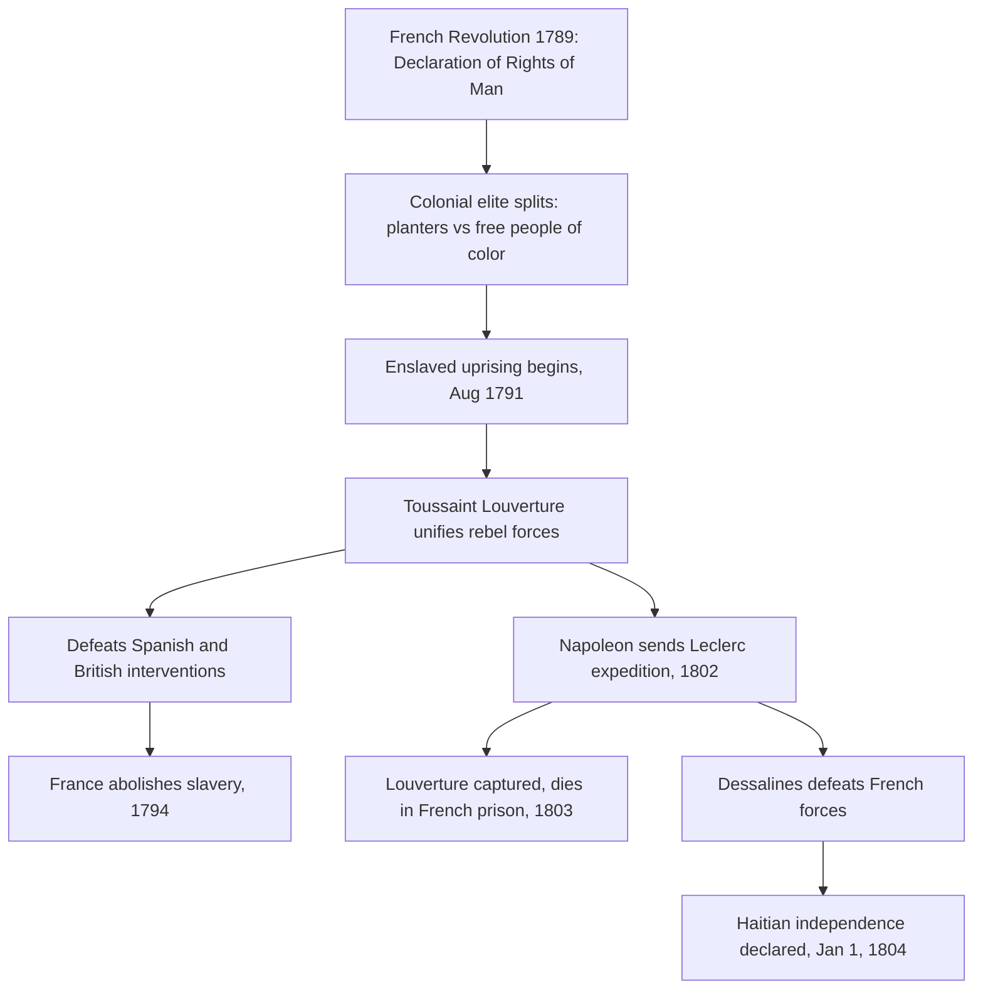
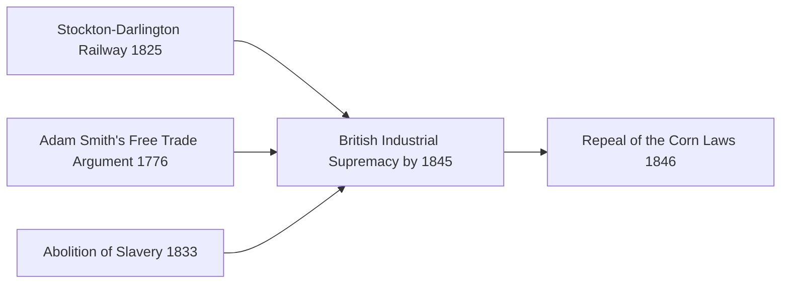

# Concept-Book Run

domain: /home/papagame/projects/digital-duck/conceptbook-app/public/domains/Users/200years_7powers_ch00/input/graph.yaml
target: payoff_british_industrial_supremacy
started: 2026-09-28T02:38:11

## Teaching order (13 concepts)

- agri_rev_1740s
- seven_years_war_1756
- enlightenment_philosophy_1748
- american_revolution_1775
- french_revolution_1789
- adam_smith_1776
- haitian_revolution_1791
- watt_steam_engine_1769
- abolition_slave_trade_1807
- mechanized_textile_mills_1785
- british_abolition_slavery_1833
- stockton_darlington_railway_1825
- payoff_british_industrial_supremacy

### agri_rev_1740s (0.7s)

## Agri Rev 1740S

Before a factory could hire workers, farming had to release them. In the mid-eighteenth century, British agriculture underwent a transformation that did exactly this — not through a single invention, but through two connected changes: how land was owned and how it was farmed.

The first change was enclosure. For centuries, much English farmland had been worked as open fields — large unfenced tracts divided into strips, with peasants holding scattered strips and shared rights to graze livestock on common land. Enclosure acts, passed in growing numbers by Parliament from the 1750s onward (over 4,000 acts between 1750 and 1830, affecting roughly 7 million acres), consolidated these strips into fenced, individually owned plots. Landlords who could now farm efficient, contiguous fields evicted or bought out smallholders who depended on common grazing rights. The result was a more productive but less labor-absorbing countryside: fewer people were needed to work the same land, and many who lost their customary land rights had no choice but to seek wages elsewhere.

The second change was technique. Charles Townshend popularized the four-field (Norfolk) rotation — wheat, turnips, barley, and clover cycled through each field in sequence — which restored soil nitrogen without leaving land fallow every third year, as the older three-field system required. Turnips and clover also provided winter fodder, which fed into the third development: Robert Bakewell's selective livestock breeding, which produced sheep and cattle that matured faster and yielded more meat and wool per animal.

Together these changes solved a problem simple enough to state in numbers: fewer farmers, using fewer fallow fields, were now feeding more people. Estimates suggest English agricultural output per worker roughly doubled across the eighteenth century, while the share of the workforce in agriculture fell from about 60 percent in 1700 to under 40 percent by 1800.

That freed labor pool is the hinge of this chapter. Enclosure didn't just make farming efficient — it made rural life unsustainable for many families, pushing them toward towns just as new textile machinery was creating demand for exactly that labor. Without the Agricultural Revolution, there is no workforce standing outside the factory gates in the 1780s.

### seven_years_war_1756 (1.1s)

## Seven Years War 1756

The Seven Years' War (1756–1763) was the first conflict fought on a genuinely global scale, with campaigns in Europe, North America, the Caribbean, West Africa, India, and the Philippines. At its core it pitted Britain and Prussia against France, Austria, Russia, and Spain, but the underlying stakes were colonial: who would control North America and the lucrative trade routes to India. Winston Churchill later called it "the first world war," and the label fits — it was the war that decided which European power would dominate global commerce for the next century.

The North American theater, known there as the French and Indian War, illustrates the stakes concretely. British forces under General Jeffrey Amherst captured Quebec in 1759 and Montreal in 1760, ending French rule in Canada. Simultaneously, Robert Clive's victory at the Battle of Plassey in 1757 broke the power of the Nawab of Bengal and gave the British East India Company effective control over Bengal's revenues — a foothold that expanded into control of most of the Indian subcontinent within decades. The 1763 Treaty of Paris formalized these gains: France ceded Canada and its territory east of the Mississippi to Britain, while retaining only small Caribbean sugar islands and trading posts in India.

The financial consequences of the war are as important as the territorial ones. Britain's national debt roughly doubled during the war, from about £75 million to £133 million — a burden Parliament tried to offset by taxing American colonists directly, through measures like the Stamp Act of 1765, setting off the resentments that led to the American Revolution a decade later. France's finances suffered even more severely: the war cost the French crown roughly 1.3 billion livres, deepening a debt crisis that French finance ministers could never fully resolve. That unresolved debt, compounded by France's later support for the American Revolution, was a direct structural cause of the fiscal desperation that forced Louis XVI to convene the Estates-General in 1789 — the opening act of the French Revolution.

Applying this case requires tracing cause and consequence across decades: a war fought to settle colonial rivalry in 1763 produced a chain of fiscal and political pressures that toppled a monarchy twenty-six years later, showing how imperial overreach abroad can generate revolutionary conditions at home.

### enlightenment_philosophy_1748 (1.6s)

## Enlightenment Philosophy 1748

The Enlightenment was a movement of writers and thinkers, mostly in France, Britain, and their colonies, who argued that reason and observation — not tradition, divine right, or inherited privilege — should be the basis for organizing government and society. Two texts published within this project's timeframe supplied the specific political vocabulary that revolutionaries would later use to justify overthrowing monarchies: Montesquieu's *The Spirit of the Laws* (1748) and Rousseau's *The Social Contract* (1762).

Montesquieu, studying the English constitutional system after the Glorious Revolution of 1688, argued that liberty is best protected when governmental power is divided among separate branches — legislative, executive, and judicial — each able to check the others. His central claim, drawn from observing how unchecked monarchs like Louis XIV had ruled France, was that concentrating all power in one person or body inevitably leads to tyranny, regardless of that ruler's intentions. Rousseau, writing fourteen years later, went further: he argued that government has no legitimate authority except what the governed consent to give it, an idea he called the "general will." A king who ruled without the people's consent was, in Rousseau's framework, not a legitimate authority at all — merely a person exercising force.

These were not abstract classroom exercises. Thomas Jefferson had a French edition of Montesquieu on his shelf while drafting the Declaration of Independence in 1776, and the U.S. Constitution's division into Congress, the Presidency, and the Supreme Court is a direct, traceable application of Montesquieu's separation-of-powers argument. The French National Assembly's 1789 Declaration of the Rights of Man cites "the distinction of powers" by name as a requirement for any constitution. In Saint-Domingue (Haiti), enslaved and free Black revolutionaries led by Toussaint Louverture invoked the same language of natural rights and popular sovereignty against French colonial rule after 1791, applying Enlightenment consent theory to a population its French originators had not imagined including.

The problem-solving application for a student of this era is diagnostic: when analyzing any revolution or constitutional document from 1776 onward, ask two questions drawn directly from these texts — does power get divided or checked (Montesquieu's test), and does the government's authority derive from the consent of the governed (Rousseau's test)? Regimes that failed both tests — Bourbon France, the Spanish Bourbon monarchy in Latin America, the Russian and Ottoman empires — became the recurring targets of nineteenth-century liberal and nationalist uprisings.

### american_revolution_1775 (1.2s)

## American Revolution 1775

The American Revolution (1775–1783) was the successful rebellion of thirteen British colonies in North America, justified by Enlightenment political theory and secured through French military intervention. Colonial leaders drew directly on John Locke's arguments about natural rights and government by consent: if a government fails to protect the rights of the governed, the governed may withdraw their consent and form a new one. The Declaration of Independence (1776) states this explicitly, asserting that governments derive their "just powers from the consent of the governed" and that people have the right "to alter or to abolish" a government that violates their rights. This was not an abstract debate — colonists had spent over a decade contesting British taxes (the Stamp Act of 1765, the Townshend Acts of 1767, the tea tax retained after 1770) imposed without their representation in Parliament, a grievance summarized in the slogan "no taxation without representation."

The war itself illustrates how a materially weaker force can prevail through strategy and outside support rather than raw military parity. The Continental Army, poorly funded and often unpaid, avoided full-scale battles it could not win and instead wore down British resolve through attrition and selective victories. The turning point was the American victory at Saratoga (1777), which convinced France — still smarting from its losses in the Seven Years' War — to formally ally with the colonies in 1778, followed by Spain and the Netherlands. French naval support proved decisive at Yorktown (1781), where a combined American-French force trapped General Cornwallis's army, leading to British surrender and the Treaty of Paris (1783), which recognized American independence.

The consequences radiated outward. Domestically, the United States Constitution (1789) established the first large-scale modern republic built on separation of powers and popular sovereignty, translating Enlightenment theory into durable institutions. Internationally, the war deepened the French monarchy's debt — already strained since 1756 — by an estimated 1 billion livres, a burden that fed directly into the fiscal crisis triggering the French Revolution just six years later. The American case also became a reference point that revolutionaries and independence movements across Europe and Latin America would cite for the next century as proof that colonial subjects could overthrow imperial rule.

*How Enlightenment ideology and Seven Years' War debts converged to produce American independence, which in turn worsened France's fiscal crisis.*

### french_revolution_1789 (2.0s)

## French Revolution 1789

By 1789, France's monarchy was insolvent: decades of war spending, including support for the American Revolution, had pushed royal debt to roughly 4 billion livres, while an outdated tax system exempted the nobility and clergy from most direct taxation. Louis XVI convened the Estates-General in May 1789 to address the crisis, but the Third Estate — representing commoners, who made up over 95 percent of France's 28 million people — broke away, declared itself the National Assembly, and swore the Tennis Court Oath to write a constitution. On July 14, 1789, Parisians stormed the Bastille fortress, and by August the Assembly abolished feudal privileges and adopted the Declaration of the Rights of Man and of the Citizen, asserting that men are born free and equal in rights and that sovereignty resides in the nation rather than the crown.

The revolution's trajectory illustrates a recurring pattern in mass political upheaval: initial reform gives way to radicalization when external threats combine with internal factional struggle. When Austria and Prussia threatened to intervene militarily on behalf of the monarchy in 1792, the Assembly declared war, France was declared a republic, and in January 1793 Louis XVI was executed by guillotine. The ensuing Terror (1793–1794), directed by the Committee of Public Safety under Robespierre, executed an estimated 16,000 to 40,000 people accused of counter-revolutionary sympathies before Robespierre himself was overthrown and executed in July 1794.

For problem-solving practice, compare this case to the American Revolution that preceded it: both revolutions invoked natural rights and popular sovereignty, and the French Declaration explicitly echoes language from the American Declaration of Independence and the Virginia Declaration of Rights. But where the American Revolution replaced an external colonial authority with a new federal constitution in a relatively stable social order, the French Revolution overturned an internal social hierarchy — monarchy, aristocracy, and church — within an existing state, producing far greater domestic violence and instability. A useful analytical exercise: given a revolution's stated goals, ask whether it is expelling an external ruler or restructuring internal social relations, since the latter tends to generate more prolonged conflict because entrenched domestic elites have both the means and motive to resist from within.

The Revolution's long-term consequence was to permanently break the assumption that monarchy rested on divine or hereditary right alone. Napoleon Bonaparte's rise to power in 1799 ended the revolutionary republic, but the principles of legal equality and popular sovereignty he codified in the Napoleonic Code (1804) spread across Europe through French conquest, seeding nineteenth-century nationalist and constitutional movements from Germany to Latin America.

### adam_smith_1776 (0.9s)

## Adam Smith 1776

In 1776 the Scottish philosopher Adam Smith published *An Inquiry into the Nature and Causes of the Wealth of Nations*, the founding text of modern economics. Smith argued that national prosperity does not come from a monarch hoarding gold and silver, the prevailing mercantilist view, but from the productive capacity of a nation's labor and capital. His central claims were threefold: specialization and division of labor dramatically raise output, individuals pursuing their own self-interest in a competitive market tend to produce outcomes beneficial to society as a whole (the famous "invisible hand"), and government interference with trade, through tariffs, monopolies, and export bans, typically makes nations poorer rather than richer.

Smith's worked example, still taught today, was a pin factory. One worker performing every step alone might make a handful of pins a day. But when the eighteen distinct operations, drawing wire, straightening it, cutting it, sharpening the point, attaching the head, are split among ten specialized workers, the same group can produce upward of 48,000 pins a day. Smith used this to show that specialization, not individual skill or effort, was the primary driver of productivity growth, and that markets naturally organize this specialization without central direction.

The book's timing mattered as much as its argument. Smith wrote against the backdrop of Britain's agricultural revolution of the 1740s, which had already freed a large share of the rural population from subsistence farming, and the Seven Years' War of 1756 to 1763, which had left Britain with a vast trading empire but also a heavy war debt serviced partly through tariffs and colonial trade restrictions. Smith's book supplied the intellectual case for dismantling exactly these restrictions, arguing that free trade would generate more tax revenue through growth than protectionism ever could through control.

Applying Smith's framework to a policy problem: economists and reformers who wanted to lower food prices for Britain's growing industrial workforce could point directly to *The Wealth of Nations* to argue that the Corn Laws, tariffs protecting domestic grain producers from cheaper foreign wheat, were making the nation poorer, not safer. This is precisely the reasoning that Richard Cobden and the Anti-Corn Law League would deploy in Parliament seventy years later, culminating in the 1846 repeal that opens the industrial capitalism era of the following chapter.

### haitian_revolution_1791 (0.7s)

## Haitian Revolution 1791

Saint-Domingue, France's colony on the western third of Hispaniola, produced about 40 percent of the world's sugar and half its coffee in the late 1780s, generating more export revenue than all thirteen North American colonies combined. That wealth rested on roughly 500,000 enslaved Africans working under conditions so brutal that planters expected to work most captives to death within a few years and simply import replacements. When the French Revolution's Declaration of the Rights of Man reached the colony in 1789, it destabilized the racial order: free people of color demanded citizenship rights, white planters split between royalists and revolutionaries, and enslaved people watched the colonial elite fracture in real time.

On the night of August 22, 1791, enslaved leaders including Dutty Boukman organized a coordinated uprising in the Plaine du Nord, burning plantations and killing planters by the thousands. Within weeks roughly 100,000 enslaved people had joined the revolt. Toussaint Louverture, a formerly enslaved man with military and administrative skill, emerged as the rebellion's leader by 1793. He built a disciplined army that defeated Spanish forces (who had allied with the rebels against France), then turned against a British invasion force that lost an estimated 15,000 soldiers to combat and yellow fever between 1793 and 1798. France abolished slavery in its colonies in 1794, partly to secure Louverture's loyalty, and he in turn nominally kept the colony under French sovereignty while governing it autonomously.

The revolution's second, decisive phase began in 1802, when Napoleon Bonaparte sent roughly 40,000 troops under General Leclerc to restore slavery and French control. Louverture was captured through deception and died in a French prison in 1803, but his former subordinate Jean-Jacques Dessalines continued the resistance. Disease and combat destroyed the French expedition — over 50,000 French soldiers died, more than the French casualties at Waterloo. On January 1, 1804, Dessalines declared independence, renaming the colony Haiti and founding the first nation born from a successful slave revolt.

**Problem-solving application:** Historians use the Haitian Revolution as a test case for tracing how ideas travel and mutate across borders. Consider the causal chain: French revolutionary rhetoric about universal rights was written by men who did not intend it to apply to enslaved Africans, yet Haitian revolutionaries took the language literally and extended it further than its authors had. When analyzing any revolutionary movement, ask three questions this case illustrates well: who originated an idea, who reinterpreted it, and whose material interests were threatened by the reinterpretation. Applying that framework here explains why France, Britain, Spain, and the United States — despite their own revolutionary or abolitionist rhetoric — spent the next six decades diplomatically isolating and economically punishing Haiti, culminating in France's 1825 demand for 150 million francs in "compensation" for lost plantation property, a debt Haiti finished paying only in 1947.

*Causal sequence from the French Revolution's ideological shock through the military campaigns that produced Haitian independence.*

### watt_steam_engine_1769 (0.8s)

## Watt Steam Engine 1769

James Watt's 1769 patent for a "new method of lessening the consumption of steam and fuel in fire engines" solved a specific inefficiency in the existing Newcomen engine, which had been used since 1712 mainly to pump water out of coal and tin mines. In the Newcomen design, steam was injected into the main cylinder and then condensed by spraying cold water directly into that same cylinder. This cooled the cylinder walls along with the steam, so every stroke wasted fuel reheating the cylinder before the next stroke could begin. Watt's insight, developed while repairing a Newcomen model at the University of Glasgow, was to add a separate condenser chamber connected to the main cylinder by a valve. Steam still condensed and lost its pressure, but the cylinder itself stayed hot, since only the separate chamber was cooled. This single change cut fuel consumption by roughly 75 percent for the same power output.

The efficiency gain mattered because it changed what the steam engine was for. Newcomen engines were fuel-hungry enough that they only made economic sense at coal mines, where fuel was essentially free on-site. Watt's engine, refined through his partnership with manufacturer Matthew Boulton beginning in 1775, produced enough power per unit of fuel to be worth transporting coal to run it elsewhere. By the 1780s, Boulton and Watt engines were driving rotary machinery in cotton mills and iron forges across Britain, converting the reciprocating piston motion into continuous rotational power via Watt's separate patented sun-and-planet gear mechanism (patented 1781) — because James Watt's original rotative patent had already covered similar crank arrangements held by rivals.

This transition depended on a prior structural shift: the Agricultural Revolution of the 1740s had already increased crop yields per farmworker, releasing labor from the land into towns and factories. Watt's engine gave that displaced labor force a location-independent power source; a mill no longer had to sit beside a fast-flowing river, as water-powered mills did. Textile output in Britain grew accordingly — raw cotton imports rose from about 5 million pounds in 1781 to over 300 million pounds by 1830 — as steam-driven machinery multiplied the productivity of each worker, marking the practical beginning of industrial manufacturing at scale.

### abolition_slave_trade_1807 (0.7s)

## Abolition Slave Trade 1807

In 1807, Parliament passed the Slave Trade Act, making it illegal for British subjects to buy, sell, or transport enslaved people across the Atlantic. Britain went further than most nations by deploying the Royal Navy's West Africa Squadron to intercept slave ships on the high seas, effectively policing an international ban rather than merely enforcing a domestic law. This mattered because Britain, having built the largest slave-trading operation in the eighteenth century — carrying over 3 million enslaved Africans between 1660 and 1807 — was now using its naval dominance to dismantle the very system it had helped create.

Two forces converged to produce this reversal. The first was intellectual: Adam Smith's "The Wealth of Nations" (1776) argued that free wage labor was economically more productive than coerced labor, undercutting the planters' claim that slavery was indispensable to profit. Enlightenment moral philosophy, echoed by abolitionist campaigners like William Wilberforce and Thomas Clarkson, reframed slavery as a violation of natural rights rather than a regrettable but necessary institution. The second was empirical proof from Haiti: the Haitian Revolution (1791–1804) showed that an enslaved population could organize, fight a prolonged war against European powers, and win independence, founding the first Black republic in the Americas. This shattered the assumption — central to slaveholders' economic and political arguments — that enslaved people were incapable of self-governance or successful resistance. Together, theory and demonstrated fact moved British public and parliamentary opinion faster than either could have alone.

The problem-solving lesson here is about how social movements convert moral argument into enforceable policy. Abolitionists needed more than a persuasive case; they needed evidence that undermined the economic and security justifications for slavery, plus a mechanism to make the law binding beyond Britain's own ports. The Royal Navy patrols supplied that mechanism, since a law banning trade only within British territory would have simply pushed the trade to other flags. By treating suppression as a matter of naval enforcement on international waters, Britain turned a domestic statute into a de facto global enforcement regime, a strategy later echoed in nineteenth-century treaties pressuring other nations, including the United States, Spain, and Portugal, to follow suit.

### mechanized_textile_mills_1785 (1.0s)

## Mechanized Textile Mills 1785

By the 1780s, James Watt's improved steam engine gave British manufacturers a power source that did not depend on rivers or the weather. Textile production was the first industry transformed. Richard Arkwright's water frame (1769) and Samuel Crompton's spinning mule (1779) mechanized the spinning of cotton thread, and Edmund Cartwright's power loom (1785) mechanized weaving. When these machines were driven by steam rather than waterwheels, factories no longer needed to sit beside fast-flowing streams — they could cluster wherever coal and labor were cheap and accessible. Manchester, Leeds, and Birmingham grew rapidly as a result, becoming the world's first industrial cities.

The consequence was a fundamental reorganization of work. Before mechanization, spinning and weaving were done by families in their homes — the "domestic system," paid by the piece and set to its own rhythm. The factory system replaced this with wage labor performed on a fixed schedule, under supervision, inside a single building housing dozens or hundreds of machines. A worker no longer owned the tools of production; the machinery, and the building that housed it, belonged to the factory owner. This shift created two new social classes tied directly to mechanized production: an industrial capitalist class that owned mills and machinery, and an urban working class — including large numbers of women and children — that sold labor for wages.

The scale of change is measurable. Britain's raw cotton imports rose from about 11 million pounds in 1785 to over 300 million pounds by 1830, while coal output climbed from roughly 6 million tons in 1770 to over 30 million tons by 1830 to fuel steam engines and iron furnaces. Manchester's population grew from about 25,000 in 1772 to over 300,000 by 1850, a rate of urban growth without precedent in European history.

*How steam power freed textile production from water sites and concentrated it into factory towns, giving rise to the industrial working class.*

For a historian evaluating this transition, the analytical task is to distinguish cause from consequence: mechanization did not simply speed up an existing system, it created a new one, replacing household production with wage labor concentrated under one roof. When assessing any later industrializing region — Lowell, Massachusetts in the 1820s, or the Ruhr Valley in the 1850s — the same diagnostic questions apply: what powered the machines, what happened to the people who previously did the work by hand, and how did population and pollution concentrate around the new mills.

### british_abolition_slavery_1833 (0.8s)

## British Abolition Slavery 1833

The Slavery Abolition Act, passed by Parliament in August 1833 and effective August 1, 1834, ended slavery across most of the British Empire, freeing an estimated 800,000 enslaved people in the Caribbean, Mauritius, and the Cape Colony. The act did not spring from moral conviction alone: it followed decades of organizing by British abolitionists such as William Wilberforce and Thomas Clarkson, sustained pressure from the Anti-Slavery Society, and a series of slave uprisings—most notably the 1831 Baptist War in Jamaica, in which tens of thousands of enslaved people revolted, signaling to Parliament that the existing system was becoming unsustainable to police. Building on the abolition of the slave trade in 1807, which had cut off the supply of new enslaved people but left existing slavery intact, the 1833 act addressed the institution itself.

The law's central mechanism reveals whose interests it prioritized. Parliament allocated £20 million—roughly 40 percent of the national budget that year, and a sum Britain only finished repaying through consolidated debt in 2015—as compensation, but paid it entirely to the roughly 46,000 slaveholders, not to the freed people. A single owner with hundreds of enslaved workers, such as those with holdings in Jamaica or Barbados, could receive tens of thousands of pounds, while the freed people received nothing and were further required to serve four to six years of unpaid "apprenticeship" before full freedom took effect in 1838. This structure illustrates a recurring pattern in emancipation legislation worldwide: property rights were treated as the injury requiring redress, not the century of unpaid labor extracted from the enslaved.

The economic and political consequences radiated outward. Caribbean plantation economies, dependent on coerced labor, shifted toward indentured labor from India and China to fill the gap, reshaping colonial demographics for a century. More consequentially for global history, British abolition removed a major slaveholding power from the world stage and gave the American abolitionist movement a concrete precedent: activists like Frederick Douglass and William Lloyd Garrison invoked Britain's example to argue that emancipation was administratively achievable, not merely utopian. This comparison sharpened the moral and political stakes of slavery in the United States, feeding directly into the sectional tensions that would erupt in the Civil War three decades later.

### stockton_darlington_railway_1825 (0.7s)

## Stockton Darlington Railway 1825

Before 1825, moving heavy freight overland meant horse-drawn wagons on rutted roads or slow canal barges — a horse could haul perhaps two tons on a road but ten times that on rails, since iron wheels on iron rails face far less friction than wheels on dirt. Mine owners in northeast England had used horse-drawn wagonways for decades to move coal short distances, but nothing connected an inland coalfield to a port over a long, public route. The Stockton and Darlington Railway, opened on 27 September 1825, closed that gap: a 26-mile line linking the coal pits around Darlington to the River Tees at Stockton, built by engineer George Stephenson and financed by Quaker merchants who needed a cheaper way to ship coal than the existing turnpike roads.

What made the line historic was not the track itself — wagonways already existed — but the decision to run a steam locomotive, Stephenson's "Locomotion No. 1," and to carry passengers and general goods as well as coal, making it the first public railway to combine steam traction with common-carrier service open to paying customers. On opening day the train pulled around 450 passengers and freight wagons at roughly 8 miles per hour, astonishing crowds who had never seen a mechanical vehicle move that fast over land. Within a few years the line proved that steam haulage was not just a novelty but was cheaper per ton-mile than horse haulage once traffic volume was high enough to spread the locomotive's fixed cost — a lesson investors absorbed quickly.

That commercial proof triggered a wave of railway-building capital could not resist: the Liverpool and Manchester Railway followed in 1830 with faster, fully timetabled steam passenger service, and by 1845 Britain had roughly 2,000 miles of track, with thousands more approved during the "Railway Mania" speculative boom of 1845–1847. Railways cut the cost and time of moving coal, iron, and finished goods between regions, letting factories draw raw materials and reach markets far beyond what canals or roads allowed, and directly extending the industrial shift already begun by mechanized textile production forty years earlier.

*How the 1825 proof-of-concept railway triggered Britain's national rail network within two decades.*

For problem-solving practice: if a mine shipped 500 tons of coal per week by horse wagon at a cost of 8 pence per ton-mile over a 20-mile route, and the railway cut that cost to 2 pence per ton-mile, the weekly saving is 500 × 20 × (8 − 2) pence — over £250 per week, explaining why merchants funded railways even before passenger revenue was considered.

### payoff_british_industrial_supremacy (16.9s)

## Payoff British Industrial Supremacy

By 1845, three separate developments — a working railway, an economic theory, and a moral-political campaign — had converged into a single outcome: Britain stood alone as the world's dominant industrial and commercial power. The Stockton and Darlington Railway of 1825 proved that steam-powered transport could move goods and people cheaper and faster than canals or roads, and by the 1840s Britain had over 2,000 miles of track linking coalfields, factories, and ports into one integrated national market. Adam Smith's 1776 argument in "The Wealth of Nations" — that specialization, competition, and free exchange generate more wealth than state-protected monopoly — had become the working assumption of Britain's governing class, not just an academic idea. And the 1833 Slavery Abolition Act, whatever its moral motivations, also signaled that Britain's economic future lay in industrial manufacturing and wage labor rather than plantation agriculture, freeing capital and political attention to focus on factories at home.

The combined effect was concrete and measurable. By the 1840s Britain produced roughly half the world's iron and coal output and the majority of its cotton textiles, exporting manufactured goods to every continent while importing raw materials and food. British warships enforced open sea lanes, and British capital financed railways and ports abroad, extending its economic reach well past its colonial borders. No rival — not France, not the German states, not the United States — matched this combination of manufacturing capacity, transport infrastructure, financial power, and naval reach.

This supremacy explains why 1846 was the moment for the Repeal of the Corn Laws. As long as Britain's landowning class needed tariffs on imported grain to protect domestic agriculture, free trade remained a theory rather than a policy. But an economy that could out-produce and out-compete the world in manufacturing no longer needed such protection — cheaper imported grain would lower food costs and wages, making British factories even more competitive globally. Prime Minister Robert Peel's decision to repeal the Corn Laws was thus not a break from industrial supremacy but its direct policy expression: having won the industrial race, Britain could afford — and had every incentive — to open its markets and challenge the rest of the world to compete on Britain's terms.

*How railway infrastructure, free-trade ideology, and the shift away from slave-based economics combined to produce British industrial dominance, which in turn made the 1846 Corn Law repeal possible.*

## Run complete

total: 38.6s
