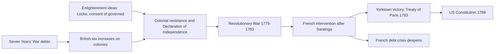
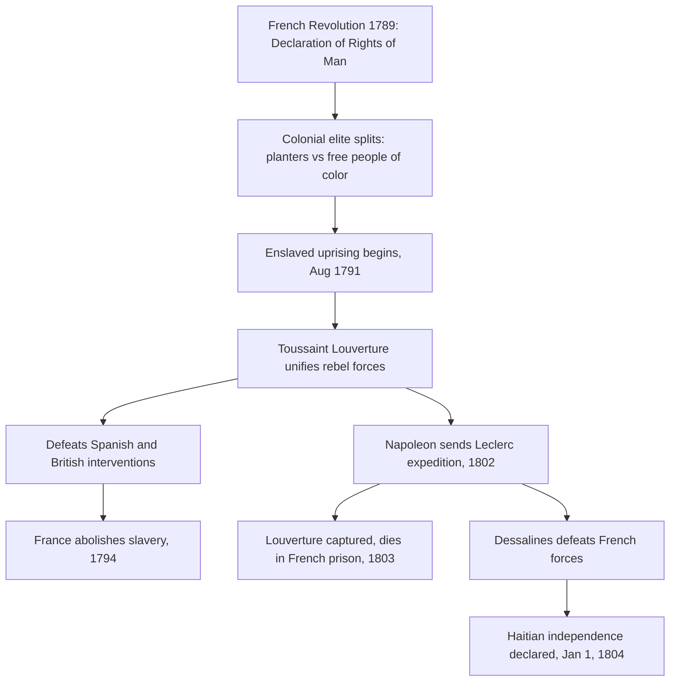
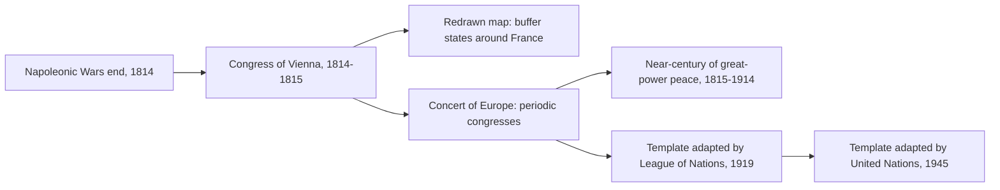

# Concept-Book Run

domain: /home/papagame/projects/digital-duck/conceptbook-app/public/domains/Users/200years_7powers_ch00/input/graph.yaml
target: payoff_liberal_nationalism
started: 2026-09-28T02:38:51

## Teaching order (10 concepts)

- enlightenment_philosophy_1748
- seven_years_war_1756
- american_revolution_1775
- french_revolution_1789
- haitian_revolution_1791
- napoleonic_wars_1799
- congress_of_vienna_1815
- latin_american_independence_1808
- revolutions_of_1830
- payoff_liberal_nationalism

### enlightenment_philosophy_1748 (1.4s)

## Enlightenment Philosophy 1748

The Enlightenment was a movement of writers and thinkers, mostly in France, Britain, and their colonies, who argued that reason and observation — not tradition, divine right, or inherited privilege — should be the basis for organizing government and society. Two texts published within this project's timeframe supplied the specific political vocabulary that revolutionaries would later use to justify overthrowing monarchies: Montesquieu's *The Spirit of the Laws* (1748) and Rousseau's *The Social Contract* (1762).

Montesquieu, studying the English constitutional system after the Glorious Revolution of 1688, argued that liberty is best protected when governmental power is divided among separate branches — legislative, executive, and judicial — each able to check the others. His central claim, drawn from observing how unchecked monarchs like Louis XIV had ruled France, was that concentrating all power in one person or body inevitably leads to tyranny, regardless of that ruler's intentions. Rousseau, writing fourteen years later, went further: he argued that government has no legitimate authority except what the governed consent to give it, an idea he called the "general will." A king who ruled without the people's consent was, in Rousseau's framework, not a legitimate authority at all — merely a person exercising force.

These were not abstract classroom exercises. Thomas Jefferson had a French edition of Montesquieu on his shelf while drafting the Declaration of Independence in 1776, and the U.S. Constitution's division into Congress, the Presidency, and the Supreme Court is a direct, traceable application of Montesquieu's separation-of-powers argument. The French National Assembly's 1789 Declaration of the Rights of Man cites "the distinction of powers" by name as a requirement for any constitution. In Saint-Domingue (Haiti), enslaved and free Black revolutionaries led by Toussaint Louverture invoked the same language of natural rights and popular sovereignty against French colonial rule after 1791, applying Enlightenment consent theory to a population its French originators had not imagined including.

The problem-solving application for a student of this era is diagnostic: when analyzing any revolution or constitutional document from 1776 onward, ask two questions drawn directly from these texts — does power get divided or checked (Montesquieu's test), and does the government's authority derive from the consent of the governed (Rousseau's test)? Regimes that failed both tests — Bourbon France, the Spanish Bourbon monarchy in Latin America, the Russian and Ottoman empires — became the recurring targets of nineteenth-century liberal and nationalist uprisings.

### seven_years_war_1756 (2.2s)

## Seven Years War 1756

The Seven Years' War (1756–1763) was the first conflict fought on a genuinely global scale, with campaigns in Europe, North America, the Caribbean, West Africa, India, and the Philippines. At its core it pitted Britain and Prussia against France, Austria, Russia, and Spain, but the underlying stakes were colonial: who would control North America and the lucrative trade routes to India. Winston Churchill later called it "the first world war," and the label fits — it was the war that decided which European power would dominate global commerce for the next century.

The North American theater, known there as the French and Indian War, illustrates the stakes concretely. British forces under General Jeffrey Amherst captured Quebec in 1759 and Montreal in 1760, ending French rule in Canada. Simultaneously, Robert Clive's victory at the Battle of Plassey in 1757 broke the power of the Nawab of Bengal and gave the British East India Company effective control over Bengal's revenues — a foothold that expanded into control of most of the Indian subcontinent within decades. The 1763 Treaty of Paris formalized these gains: France ceded Canada and its territory east of the Mississippi to Britain, while retaining only small Caribbean sugar islands and trading posts in India.

The financial consequences of the war are as important as the territorial ones. Britain's national debt roughly doubled during the war, from about £75 million to £133 million — a burden Parliament tried to offset by taxing American colonists directly, through measures like the Stamp Act of 1765, setting off the resentments that led to the American Revolution a decade later. France's finances suffered even more severely: the war cost the French crown roughly 1.3 billion livres, deepening a debt crisis that French finance ministers could never fully resolve. That unresolved debt, compounded by France's later support for the American Revolution, was a direct structural cause of the fiscal desperation that forced Louis XVI to convene the Estates-General in 1789 — the opening act of the French Revolution.

Applying this case requires tracing cause and consequence across decades: a war fought to settle colonial rivalry in 1763 produced a chain of fiscal and political pressures that toppled a monarchy twenty-six years later, showing how imperial overreach abroad can generate revolutionary conditions at home.

### american_revolution_1775 (0.9s)

## American Revolution 1775

The American Revolution (1775–1783) was the successful rebellion of thirteen British colonies in North America, justified by Enlightenment political theory and secured through French military intervention. Colonial leaders drew directly on John Locke's arguments about natural rights and government by consent: if a government fails to protect the rights of the governed, the governed may withdraw their consent and form a new one. The Declaration of Independence (1776) states this explicitly, asserting that governments derive their "just powers from the consent of the governed" and that people have the right "to alter or to abolish" a government that violates their rights. This was not an abstract debate — colonists had spent over a decade contesting British taxes (the Stamp Act of 1765, the Townshend Acts of 1767, the tea tax retained after 1770) imposed without their representation in Parliament, a grievance summarized in the slogan "no taxation without representation."

The war itself illustrates how a materially weaker force can prevail through strategy and outside support rather than raw military parity. The Continental Army, poorly funded and often unpaid, avoided full-scale battles it could not win and instead wore down British resolve through attrition and selective victories. The turning point was the American victory at Saratoga (1777), which convinced France — still smarting from its losses in the Seven Years' War — to formally ally with the colonies in 1778, followed by Spain and the Netherlands. French naval support proved decisive at Yorktown (1781), where a combined American-French force trapped General Cornwallis's army, leading to British surrender and the Treaty of Paris (1783), which recognized American independence.

The consequences radiated outward. Domestically, the United States Constitution (1789) established the first large-scale modern republic built on separation of powers and popular sovereignty, translating Enlightenment theory into durable institutions. Internationally, the war deepened the French monarchy's debt — already strained since 1756 — by an estimated 1 billion livres, a burden that fed directly into the fiscal crisis triggering the French Revolution just six years later. The American case also became a reference point that revolutionaries and independence movements across Europe and Latin America would cite for the next century as proof that colonial subjects could overthrow imperial rule.

*How Enlightenment ideology and Seven Years' War debts converged to produce American independence, which in turn worsened France's fiscal crisis.*

### french_revolution_1789 (0.7s)

## French Revolution 1789

By 1789, France's monarchy was insolvent: decades of war spending, including support for the American Revolution, had pushed royal debt to roughly 4 billion livres, while an outdated tax system exempted the nobility and clergy from most direct taxation. Louis XVI convened the Estates-General in May 1789 to address the crisis, but the Third Estate — representing commoners, who made up over 95 percent of France's 28 million people — broke away, declared itself the National Assembly, and swore the Tennis Court Oath to write a constitution. On July 14, 1789, Parisians stormed the Bastille fortress, and by August the Assembly abolished feudal privileges and adopted the Declaration of the Rights of Man and of the Citizen, asserting that men are born free and equal in rights and that sovereignty resides in the nation rather than the crown.

The revolution's trajectory illustrates a recurring pattern in mass political upheaval: initial reform gives way to radicalization when external threats combine with internal factional struggle. When Austria and Prussia threatened to intervene militarily on behalf of the monarchy in 1792, the Assembly declared war, France was declared a republic, and in January 1793 Louis XVI was executed by guillotine. The ensuing Terror (1793–1794), directed by the Committee of Public Safety under Robespierre, executed an estimated 16,000 to 40,000 people accused of counter-revolutionary sympathies before Robespierre himself was overthrown and executed in July 1794.

For problem-solving practice, compare this case to the American Revolution that preceded it: both revolutions invoked natural rights and popular sovereignty, and the French Declaration explicitly echoes language from the American Declaration of Independence and the Virginia Declaration of Rights. But where the American Revolution replaced an external colonial authority with a new federal constitution in a relatively stable social order, the French Revolution overturned an internal social hierarchy — monarchy, aristocracy, and church — within an existing state, producing far greater domestic violence and instability. A useful analytical exercise: given a revolution's stated goals, ask whether it is expelling an external ruler or restructuring internal social relations, since the latter tends to generate more prolonged conflict because entrenched domestic elites have both the means and motive to resist from within.

The Revolution's long-term consequence was to permanently break the assumption that monarchy rested on divine or hereditary right alone. Napoleon Bonaparte's rise to power in 1799 ended the revolutionary republic, but the principles of legal equality and popular sovereignty he codified in the Napoleonic Code (1804) spread across Europe through French conquest, seeding nineteenth-century nationalist and constitutional movements from Germany to Latin America.

### haitian_revolution_1791 (0.9s)

## Haitian Revolution 1791

Saint-Domingue, France's colony on the western third of Hispaniola, produced about 40 percent of the world's sugar and half its coffee in the late 1780s, generating more export revenue than all thirteen North American colonies combined. That wealth rested on roughly 500,000 enslaved Africans working under conditions so brutal that planters expected to work most captives to death within a few years and simply import replacements. When the French Revolution's Declaration of the Rights of Man reached the colony in 1789, it destabilized the racial order: free people of color demanded citizenship rights, white planters split between royalists and revolutionaries, and enslaved people watched the colonial elite fracture in real time.

On the night of August 22, 1791, enslaved leaders including Dutty Boukman organized a coordinated uprising in the Plaine du Nord, burning plantations and killing planters by the thousands. Within weeks roughly 100,000 enslaved people had joined the revolt. Toussaint Louverture, a formerly enslaved man with military and administrative skill, emerged as the rebellion's leader by 1793. He built a disciplined army that defeated Spanish forces (who had allied with the rebels against France), then turned against a British invasion force that lost an estimated 15,000 soldiers to combat and yellow fever between 1793 and 1798. France abolished slavery in its colonies in 1794, partly to secure Louverture's loyalty, and he in turn nominally kept the colony under French sovereignty while governing it autonomously.

The revolution's second, decisive phase began in 1802, when Napoleon Bonaparte sent roughly 40,000 troops under General Leclerc to restore slavery and French control. Louverture was captured through deception and died in a French prison in 1803, but his former subordinate Jean-Jacques Dessalines continued the resistance. Disease and combat destroyed the French expedition — over 50,000 French soldiers died, more than the French casualties at Waterloo. On January 1, 1804, Dessalines declared independence, renaming the colony Haiti and founding the first nation born from a successful slave revolt.

**Problem-solving application:** Historians use the Haitian Revolution as a test case for tracing how ideas travel and mutate across borders. Consider the causal chain: French revolutionary rhetoric about universal rights was written by men who did not intend it to apply to enslaved Africans, yet Haitian revolutionaries took the language literally and extended it further than its authors had. When analyzing any revolutionary movement, ask three questions this case illustrates well: who originated an idea, who reinterpreted it, and whose material interests were threatened by the reinterpretation. Applying that framework here explains why France, Britain, Spain, and the United States — despite their own revolutionary or abolitionist rhetoric — spent the next six decades diplomatically isolating and economically punishing Haiti, culminating in France's 1825 demand for 150 million francs in "compensation" for lost plantation property, a debt Haiti finished paying only in 1947.

*Causal sequence from the French Revolution's ideological shock through the military campaigns that produced Haitian independence.*

### napoleonic_wars_1799 (0.7s)

## Napoleonic Wars 1799

When Napoleon Bonaparte seized power in the coup of 18 Brumaire (November 1799), the French Revolution's ideals of legal equality and popular sovereignty gained a general willing to spread them by force. Over the next sixteen years he turned revolutionary France into a continental empire, and in doing so unintentionally sowed the nationalist movements that would eventually resist him.

Napoleon's military method combined the mass conscript army the Revolution had created with speed and concentration of force at the decisive point. At Austerlitz (1805) he destroyed a combined Austrian-Russian army; by 1807 Prussia and much of the German states, Italy, and Spain were either annexed, occupied, or turned into satellite kingdoms ruled by his relatives. Wherever French administration took hold, it carried the Napoleonic Code of 1804: uniform civil law, abolition of serfdom and hereditary feudal privilege, religious toleration, and careerism based on merit rather than birth. Populations that had never known legal equality experienced it under French occupation — and that experience, paradoxically, planted the seeds of national self-determination against French rule itself. German and Spanish subjects who absorbed revolutionary ideas of citizenship began asking why they should be ruled by a foreign emperor rather than a nation of their own.

That contradiction proved fatal. In Spain after 1808, guerrilla resistance tied down hundreds of thousands of French troops in a war of attrition. In 1812, Napoleon's invasion of Russia with roughly 600,000 men ended in catastrophe: fewer than 100,000 recrossed the border after Moscow's scorched-earth strategy and the brutal winter retreat. Sensing the emperor's vulnerability, Britain, Russia, Prussia, and Austria — powers that had previously fought France separately and lost — formed the Sixth Coalition and, at Leipzig in October 1813, inflicted the first defeat of Napoleon's main army by a unified alliance. His abdication followed in 1814; a brief return during the Hundred Days ended at Waterloo in June 1815.

The lasting lesson was diplomatic rather than military: the Congress of Vienna (1814–1815) established that when a single power threatens to dominate the continent, a coalition of rivals will set aside their own rivalries to restore balance — a template for collective security that recurs throughout the next two centuries of great-power politics.

### congress_of_vienna_1815 (0.6s)

## Congress Of Vienna 1815

After Napoleon's defeat, the great powers of Europe — Austria, Russia, Prussia, and Britain, joined by a restored France — convened in Vienna from September 1814 to June 1815 to settle the continent's borders and prevent another quarter-century of war. The negotiations were dominated by Austria's foreign minister Prince Metternich, Russia's Tsar Alexander I, Britain's Lord Castlereagh, and France's Talleyrand, who skillfully secured his defeated nation a seat among the victors. The guiding principle was balance of power: no single state should again grow strong enough to dominate the continent, as France had under Napoleon. To achieve this, the Congress redrew borders deliberately — strengthening the states bordering France (enlarging the Netherlands, uniting Genoa with Piedmont-Sardinia, and creating a German Confederation of 39 states) while restoring the Bourbon monarchy in France and returning Russian, Austrian, and Prussian territories roughly to pre-Napoleonic lines, adjusted for negotiated compensation elsewhere (Prussia gained the Rhineland and part of Saxony; Russia gained most of Poland; Austria gained northern Italy).

The Congress's lasting innovation was not the map itself but the mechanism it created for maintaining it: the Concert of Europe. Rather than treating the settlement as final, the great powers agreed to hold periodic congresses to manage crises collectively before they escalated into war — a practice formalized in the Quadruple Alliance's 1815 treaty and tested at follow-up meetings such as Aix-la-Chapelle (1818) and Troppau (1820). This system of consultation, though imperfect and increasingly strained by revolutions in 1830 and 1848, held off a general European war among the great powers for nearly a century, until 1914 — a striking contrast to the near-constant warfare of the eighteenth century.

The problem-solving lesson for later diplomacy was that post-war settlements succeed less by punishing the defeated than by reintegrating them into a stable balance and by institutionalizing ongoing dialogue. The League of Nations (1919) and the United Nations (1945) both adapted this Vienna template — periodic multilateral consultation among major powers — while trying to fix its central weakness: the Concert had no permanent enforcement body and relied entirely on the great powers' continued willingness to cooperate, which eventually broke down.

*How the Congress of Vienna's territorial settlement and diplomatic mechanism shaped a century of peace and later international institutions.*

### latin_american_independence_1808 (0.6s)

## Latin American Independence 1808

In 1808 Napoleon deposed the Spanish king and installed his own brother on the throne, then occupied Portugal, forcing its royal family to flee to Brazil. This single act shattered the legal basis of colonial rule. Spanish American colonists had governed under a loyalty to the crown, not to Spain as a nation; with no legitimate king, cities across the Americas formed juntas claiming to hold sovereignty in trust until Ferdinand VII was restored. What began as a defense of the monarchy evolved, over the next two decades, into full independence movements, because the temporary councils resisted relinquishing power even after Ferdinand returned in 1814 and tried to reassert absolute rule.

The movement unfolded in three major theaters. In Mexico, the priest Miguel Hidalgo issued his 1810 call to arms, the Grito de Dolores, igniting a mass insurgency of indigenous and mestizo peasants; though Hidalgo was captured and executed in 1811, the rebellion he sparked ultimately produced Mexican independence in 1821. In the north of South America, Simón Bolívar led a grinding campaign across Venezuela, Colombia, Ecuador, and into Peru and Bolivia, winning decisive battles such as Boyacá (1819) and Carabobo (1821) that broke Spanish military power in the Andes. In the south, José de San Martín crossed the Andes from Argentina in 1817 to liberate Chile, then sailed north to help free Peru, meeting Bolívar at Guayaquil in 1822 before withdrawing from the struggle entirely. Brazil took a different path: in 1822 the Portuguese prince regent Pedro, left in charge of the colony, declared independence himself rather than return to a subordinate role in Lisbon, making Brazil an independent empire without the sustained warfare seen in Spanish America.

By 1826, Spain retained only Cuba and Puerto Rico in the Americas, having lost territory that had generated immense silver wealth for three centuries. Applying this case requires distinguishing *cause* from *trigger*: long-standing grievances — exclusion of American-born elites (Creoles) from top colonial offices, trade restrictions favoring Spanish merchants, and Enlightenment ideas absorbed from the French and American revolutions — created the underlying pressure, while Napoleon's invasion supplied the immediate opening. A useful comparative exercise is to contrast this outcome with the Haitian Revolution of 1791–1804: Haiti's independence came from an enslaved population overturning the entire social order, whereas most Spanish American independence movements were led by Creole elites who preserved existing social hierarchies, illustrating how the same era of revolutionary upheaval produced sharply different social outcomes depending on who led the fight and what they sought to preserve or dismantle.

### revolutions_of_1830 (0.7s)

## Revolutions Of 1830

By 1830 the settlement engineered at the Congress of Vienna fifteen years earlier had held together Europe's monarchies, but it had not resolved the tension between restored royal authority and the liberal, nationalist aspirations the French Revolution had first unleashed. France's Charles X supplied the spark: in July 1830 he issued the July Ordinances, dissolving the newly elected Chamber of Deputies, gutting the franchise, and censoring the press. Parisians responded with three days of street fighting — the "Three Glorious Days" (July 27–29) — that forced Charles X to abdicate. Rather than restoring a republic, the propertied liberal elite installed Louis-Philippe, Duke of Orléans, as a constitutional "Citizen King," a compromise that satisfied the bourgeoisie without granting the broader political rights the Parisian crowds had fought for.

The July Revolution's news traveled fast. In Brussels, opposition to Dutch rule — imposed on the Southern Netherlands by the Vienna settlement to create a buffer state against France — erupted into rebellion that August. Belgian rebels declared independence, and by 1831 the great powers, wary of a wider war but unwilling to let Dutch King William I forcibly reverse the outcome, recognized Belgium as an independent, neutral kingdom under Leopold I. In Poland, however, the uprising that began in Warsaw in November 1830 met a different fate: Tsar Nicholas I crushed the Polish rebels by September 1831, abolished the Congress Kingdom's constitution, and imposed direct Russian rule — a stark reminder that liberal victories in Western Europe did not translate automatically eastward.

The pattern across all three cases reveals the Vienna order's real limits: it could bend in France and Belgium, where Britain and a reform-minded French monarchy had interests in a negotiated outcome, but it snapped back hard wherever an autocratic power like Russia held decisive military force. The underlying grievances — restricted suffrage, censorship, and unresolved national identity — went unaddressed rather than resolved, and they would resurface with far greater force across the continent in 1848, this time touching nearly every major European capital at once.

### payoff_liberal_nationalism (15.4s)

## Payoff Liberal Nationalism

The Congress of Vienna (1814–1815) redrew Europe's map to restore monarchical legitimacy and suppress the revolutionary principles unleashed by France since 1789. Metternich's system relied on the Holy Alliance and the Concert of Europe to police any resurgence of constitutionalism or national self-determination. Yet within fifteen years, that system began to crack, and the cracks reveal a pattern: liberal nationalism could be contained by treaty, censorship, and armed intervention, but not eliminated, because it answered a real demand — for representative government and for political borders that matched cultural and linguistic communities — that the restored order refused to accommodate.

Latin America supplied the first proof. Between 1808 and 1826, Spain's American colonies, exploiting the power vacuum left by Napoleon's invasion of Iberia, fought wars of independence under leaders such as Simón Bolívar and José de San Martín. By 1826 Spain retained only Cuba and Puerto Rico in the Americas; a dozen new republics, most explicitly modeled on constitutional and representative principles rather than restored monarchy, had replaced a centuries-old empire. This mattered to European conservatives precisely because it demonstrated, on a continental scale, that empire was not the only viable form of large-scale political order — republics could govern vast, diverse territories.

The 1830 Revolutions brought the same proof to Europe's own doorstep. France's July Revolution replaced the reactionary Charles X with the constitutional monarch Louis-Philippe in three days of Parisian street fighting. Belgium seceded from the Dutch-dominated United Kingdom of the Netherlands, winning recognition as an independent, constitutional state in 1830–1831. Poland's insurrection against Russian rule failed, but it still consumed a year of Tsarist military resources and produced a wave of exiled Polish nationalists who spread liberal ideas across Western Europe.

The problem-solving lesson for historians is comparative: measure durability, not eruption. A revolution's short-term failure (Poland, 1830) does not indicate the underlying nationalist claim was invalid — the claim resurfaces with additional grievances (economic downturn, famine, unresolved unification questions) until it either compels reform or triggers a wider explosion. That is exactly the mechanism that produces the near-simultaneous revolutions across France, the German states, the Austrian Empire, and Italy in 1848 — not a coincidence, but the accumulated, unresolved pressure of the liberal-nationalist demand Vienna had tried to bury in 1815.

## Run complete

total: 31.3s
