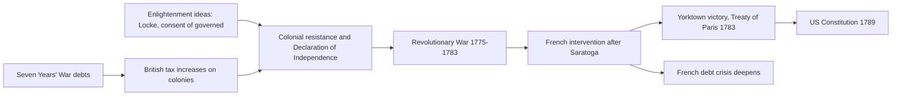
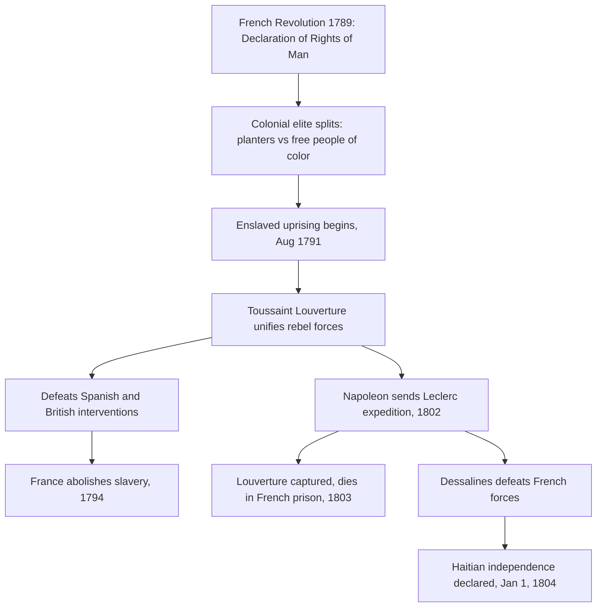
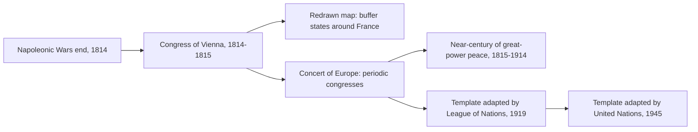

# Concept-Book Run

domain: /home/papagame/projects/digital-duck/conceptbook-app/public/domains/Users/200years_7powers_ch00/input/graph.yaml
target: payoff_opium_war_and_china
started: 2026-09-28T02:39:24

## Teaching order (13 concepts)

- seven_years_war_1756
- enlightenment_philosophy_1748
- american_revolution_1775
- french_revolution_1789
- agri_rev_1740s
- adam_smith_1776
- haitian_revolution_1791
- abolition_slave_trade_1807
- napoleonic_wars_1799
- british_abolition_slavery_1833
- congress_of_vienna_1815
- first_opium_war_1839
- payoff_opium_war_and_china

### seven_years_war_1756 (0.7s)

## Seven Years War 1756

The Seven Years' War (1756–1763) was the first conflict fought on a genuinely global scale, with campaigns in Europe, North America, the Caribbean, West Africa, India, and the Philippines. At its core it pitted Britain and Prussia against France, Austria, Russia, and Spain, but the underlying stakes were colonial: who would control North America and the lucrative trade routes to India. Winston Churchill later called it "the first world war," and the label fits — it was the war that decided which European power would dominate global commerce for the next century.

The North American theater, known there as the French and Indian War, illustrates the stakes concretely. British forces under General Jeffrey Amherst captured Quebec in 1759 and Montreal in 1760, ending French rule in Canada. Simultaneously, Robert Clive's victory at the Battle of Plassey in 1757 broke the power of the Nawab of Bengal and gave the British East India Company effective control over Bengal's revenues — a foothold that expanded into control of most of the Indian subcontinent within decades. The 1763 Treaty of Paris formalized these gains: France ceded Canada and its territory east of the Mississippi to Britain, while retaining only small Caribbean sugar islands and trading posts in India.

The financial consequences of the war are as important as the territorial ones. Britain's national debt roughly doubled during the war, from about £75 million to £133 million — a burden Parliament tried to offset by taxing American colonists directly, through measures like the Stamp Act of 1765, setting off the resentments that led to the American Revolution a decade later. France's finances suffered even more severely: the war cost the French crown roughly 1.3 billion livres, deepening a debt crisis that French finance ministers could never fully resolve. That unresolved debt, compounded by France's later support for the American Revolution, was a direct structural cause of the fiscal desperation that forced Louis XVI to convene the Estates-General in 1789 — the opening act of the French Revolution.

Applying this case requires tracing cause and consequence across decades: a war fought to settle colonial rivalry in 1763 produced a chain of fiscal and political pressures that toppled a monarchy twenty-six years later, showing how imperial overreach abroad can generate revolutionary conditions at home.

### enlightenment_philosophy_1748 (0.7s)

## Enlightenment Philosophy 1748

The Enlightenment was a movement of writers and thinkers, mostly in France, Britain, and their colonies, who argued that reason and observation — not tradition, divine right, or inherited privilege — should be the basis for organizing government and society. Two texts published within this project's timeframe supplied the specific political vocabulary that revolutionaries would later use to justify overthrowing monarchies: Montesquieu's *The Spirit of the Laws* (1748) and Rousseau's *The Social Contract* (1762).

Montesquieu, studying the English constitutional system after the Glorious Revolution of 1688, argued that liberty is best protected when governmental power is divided among separate branches — legislative, executive, and judicial — each able to check the others. His central claim, drawn from observing how unchecked monarchs like Louis XIV had ruled France, was that concentrating all power in one person or body inevitably leads to tyranny, regardless of that ruler's intentions. Rousseau, writing fourteen years later, went further: he argued that government has no legitimate authority except what the governed consent to give it, an idea he called the "general will." A king who ruled without the people's consent was, in Rousseau's framework, not a legitimate authority at all — merely a person exercising force.

These were not abstract classroom exercises. Thomas Jefferson had a French edition of Montesquieu on his shelf while drafting the Declaration of Independence in 1776, and the U.S. Constitution's division into Congress, the Presidency, and the Supreme Court is a direct, traceable application of Montesquieu's separation-of-powers argument. The French National Assembly's 1789 Declaration of the Rights of Man cites "the distinction of powers" by name as a requirement for any constitution. In Saint-Domingue (Haiti), enslaved and free Black revolutionaries led by Toussaint Louverture invoked the same language of natural rights and popular sovereignty against French colonial rule after 1791, applying Enlightenment consent theory to a population its French originators had not imagined including.

The problem-solving application for a student of this era is diagnostic: when analyzing any revolution or constitutional document from 1776 onward, ask two questions drawn directly from these texts — does power get divided or checked (Montesquieu's test), and does the government's authority derive from the consent of the governed (Rousseau's test)? Regimes that failed both tests — Bourbon France, the Spanish Bourbon monarchy in Latin America, the Russian and Ottoman empires — became the recurring targets of nineteenth-century liberal and nationalist uprisings.

### american_revolution_1775 (1.8s)

## American Revolution 1775

The American Revolution (1775–1783) was the successful rebellion of thirteen British colonies in North America, justified by Enlightenment political theory and secured through French military intervention. Colonial leaders drew directly on John Locke's arguments about natural rights and government by consent: if a government fails to protect the rights of the governed, the governed may withdraw their consent and form a new one. The Declaration of Independence (1776) states this explicitly, asserting that governments derive their "just powers from the consent of the governed" and that people have the right "to alter or to abolish" a government that violates their rights. This was not an abstract debate — colonists had spent over a decade contesting British taxes (the Stamp Act of 1765, the Townshend Acts of 1767, the tea tax retained after 1770) imposed without their representation in Parliament, a grievance summarized in the slogan "no taxation without representation."

The war itself illustrates how a materially weaker force can prevail through strategy and outside support rather than raw military parity. The Continental Army, poorly funded and often unpaid, avoided full-scale battles it could not win and instead wore down British resolve through attrition and selective victories. The turning point was the American victory at Saratoga (1777), which convinced France — still smarting from its losses in the Seven Years' War — to formally ally with the colonies in 1778, followed by Spain and the Netherlands. French naval support proved decisive at Yorktown (1781), where a combined American-French force trapped General Cornwallis's army, leading to British surrender and the Treaty of Paris (1783), which recognized American independence.

The consequences radiated outward. Domestically, the United States Constitution (1789) established the first large-scale modern republic built on separation of powers and popular sovereignty, translating Enlightenment theory into durable institutions. Internationally, the war deepened the French monarchy's debt — already strained since 1756 — by an estimated 1 billion livres, a burden that fed directly into the fiscal crisis triggering the French Revolution just six years later. The American case also became a reference point that revolutionaries and independence movements across Europe and Latin America would cite for the next century as proof that colonial subjects could overthrow imperial rule.

*How Enlightenment ideology and Seven Years' War debts converged to produce American independence, which in turn worsened France's fiscal crisis.*

### french_revolution_1789 (2.0s)

## French Revolution 1789

By 1789, France's monarchy was insolvent: decades of war spending, including support for the American Revolution, had pushed royal debt to roughly 4 billion livres, while an outdated tax system exempted the nobility and clergy from most direct taxation. Louis XVI convened the Estates-General in May 1789 to address the crisis, but the Third Estate — representing commoners, who made up over 95 percent of France's 28 million people — broke away, declared itself the National Assembly, and swore the Tennis Court Oath to write a constitution. On July 14, 1789, Parisians stormed the Bastille fortress, and by August the Assembly abolished feudal privileges and adopted the Declaration of the Rights of Man and of the Citizen, asserting that men are born free and equal in rights and that sovereignty resides in the nation rather than the crown.

The revolution's trajectory illustrates a recurring pattern in mass political upheaval: initial reform gives way to radicalization when external threats combine with internal factional struggle. When Austria and Prussia threatened to intervene militarily on behalf of the monarchy in 1792, the Assembly declared war, France was declared a republic, and in January 1793 Louis XVI was executed by guillotine. The ensuing Terror (1793–1794), directed by the Committee of Public Safety under Robespierre, executed an estimated 16,000 to 40,000 people accused of counter-revolutionary sympathies before Robespierre himself was overthrown and executed in July 1794.

For problem-solving practice, compare this case to the American Revolution that preceded it: both revolutions invoked natural rights and popular sovereignty, and the French Declaration explicitly echoes language from the American Declaration of Independence and the Virginia Declaration of Rights. But where the American Revolution replaced an external colonial authority with a new federal constitution in a relatively stable social order, the French Revolution overturned an internal social hierarchy — monarchy, aristocracy, and church — within an existing state, producing far greater domestic violence and instability. A useful analytical exercise: given a revolution's stated goals, ask whether it is expelling an external ruler or restructuring internal social relations, since the latter tends to generate more prolonged conflict because entrenched domestic elites have both the means and motive to resist from within.

The Revolution's long-term consequence was to permanently break the assumption that monarchy rested on divine or hereditary right alone. Napoleon Bonaparte's rise to power in 1799 ended the revolutionary republic, but the principles of legal equality and popular sovereignty he codified in the Napoleonic Code (1804) spread across Europe through French conquest, seeding nineteenth-century nationalist and constitutional movements from Germany to Latin America.

### agri_rev_1740s (1.0s)

## Agri Rev 1740S

Before a factory could hire workers, farming had to release them. In the mid-eighteenth century, British agriculture underwent a transformation that did exactly this — not through a single invention, but through two connected changes: how land was owned and how it was farmed.

The first change was enclosure. For centuries, much English farmland had been worked as open fields — large unfenced tracts divided into strips, with peasants holding scattered strips and shared rights to graze livestock on common land. Enclosure acts, passed in growing numbers by Parliament from the 1750s onward (over 4,000 acts between 1750 and 1830, affecting roughly 7 million acres), consolidated these strips into fenced, individually owned plots. Landlords who could now farm efficient, contiguous fields evicted or bought out smallholders who depended on common grazing rights. The result was a more productive but less labor-absorbing countryside: fewer people were needed to work the same land, and many who lost their customary land rights had no choice but to seek wages elsewhere.

The second change was technique. Charles Townshend popularized the four-field (Norfolk) rotation — wheat, turnips, barley, and clover cycled through each field in sequence — which restored soil nitrogen without leaving land fallow every third year, as the older three-field system required. Turnips and clover also provided winter fodder, which fed into the third development: Robert Bakewell's selective livestock breeding, which produced sheep and cattle that matured faster and yielded more meat and wool per animal.

Together these changes solved a problem simple enough to state in numbers: fewer farmers, using fewer fallow fields, were now feeding more people. Estimates suggest English agricultural output per worker roughly doubled across the eighteenth century, while the share of the workforce in agriculture fell from about 60 percent in 1700 to under 40 percent by 1800.

That freed labor pool is the hinge of this chapter. Enclosure didn't just make farming efficient — it made rural life unsustainable for many families, pushing them toward towns just as new textile machinery was creating demand for exactly that labor. Without the Agricultural Revolution, there is no workforce standing outside the factory gates in the 1780s.

### adam_smith_1776 (0.7s)

## Adam Smith 1776

In 1776 the Scottish philosopher Adam Smith published *An Inquiry into the Nature and Causes of the Wealth of Nations*, the founding text of modern economics. Smith argued that national prosperity does not come from a monarch hoarding gold and silver, the prevailing mercantilist view, but from the productive capacity of a nation's labor and capital. His central claims were threefold: specialization and division of labor dramatically raise output, individuals pursuing their own self-interest in a competitive market tend to produce outcomes beneficial to society as a whole (the famous "invisible hand"), and government interference with trade, through tariffs, monopolies, and export bans, typically makes nations poorer rather than richer.

Smith's worked example, still taught today, was a pin factory. One worker performing every step alone might make a handful of pins a day. But when the eighteen distinct operations, drawing wire, straightening it, cutting it, sharpening the point, attaching the head, are split among ten specialized workers, the same group can produce upward of 48,000 pins a day. Smith used this to show that specialization, not individual skill or effort, was the primary driver of productivity growth, and that markets naturally organize this specialization without central direction.

The book's timing mattered as much as its argument. Smith wrote against the backdrop of Britain's agricultural revolution of the 1740s, which had already freed a large share of the rural population from subsistence farming, and the Seven Years' War of 1756 to 1763, which had left Britain with a vast trading empire but also a heavy war debt serviced partly through tariffs and colonial trade restrictions. Smith's book supplied the intellectual case for dismantling exactly these restrictions, arguing that free trade would generate more tax revenue through growth than protectionism ever could through control.

Applying Smith's framework to a policy problem: economists and reformers who wanted to lower food prices for Britain's growing industrial workforce could point directly to *The Wealth of Nations* to argue that the Corn Laws, tariffs protecting domestic grain producers from cheaper foreign wheat, were making the nation poorer, not safer. This is precisely the reasoning that Richard Cobden and the Anti-Corn Law League would deploy in Parliament seventy years later, culminating in the 1846 repeal that opens the industrial capitalism era of the following chapter.

### haitian_revolution_1791 (0.7s)

## Haitian Revolution 1791

Saint-Domingue, France's colony on the western third of Hispaniola, produced about 40 percent of the world's sugar and half its coffee in the late 1780s, generating more export revenue than all thirteen North American colonies combined. That wealth rested on roughly 500,000 enslaved Africans working under conditions so brutal that planters expected to work most captives to death within a few years and simply import replacements. When the French Revolution's Declaration of the Rights of Man reached the colony in 1789, it destabilized the racial order: free people of color demanded citizenship rights, white planters split between royalists and revolutionaries, and enslaved people watched the colonial elite fracture in real time.

On the night of August 22, 1791, enslaved leaders including Dutty Boukman organized a coordinated uprising in the Plaine du Nord, burning plantations and killing planters by the thousands. Within weeks roughly 100,000 enslaved people had joined the revolt. Toussaint Louverture, a formerly enslaved man with military and administrative skill, emerged as the rebellion's leader by 1793. He built a disciplined army that defeated Spanish forces (who had allied with the rebels against France), then turned against a British invasion force that lost an estimated 15,000 soldiers to combat and yellow fever between 1793 and 1798. France abolished slavery in its colonies in 1794, partly to secure Louverture's loyalty, and he in turn nominally kept the colony under French sovereignty while governing it autonomously.

The revolution's second, decisive phase began in 1802, when Napoleon Bonaparte sent roughly 40,000 troops under General Leclerc to restore slavery and French control. Louverture was captured through deception and died in a French prison in 1803, but his former subordinate Jean-Jacques Dessalines continued the resistance. Disease and combat destroyed the French expedition — over 50,000 French soldiers died, more than the French casualties at Waterloo. On January 1, 1804, Dessalines declared independence, renaming the colony Haiti and founding the first nation born from a successful slave revolt.

**Problem-solving application:** Historians use the Haitian Revolution as a test case for tracing how ideas travel and mutate across borders. Consider the causal chain: French revolutionary rhetoric about universal rights was written by men who did not intend it to apply to enslaved Africans, yet Haitian revolutionaries took the language literally and extended it further than its authors had. When analyzing any revolutionary movement, ask three questions this case illustrates well: who originated an idea, who reinterpreted it, and whose material interests were threatened by the reinterpretation. Applying that framework here explains why France, Britain, Spain, and the United States — despite their own revolutionary or abolitionist rhetoric — spent the next six decades diplomatically isolating and economically punishing Haiti, culminating in France's 1825 demand for 150 million francs in "compensation" for lost plantation property, a debt Haiti finished paying only in 1947.

*Causal sequence from the French Revolution's ideological shock through the military campaigns that produced Haitian independence.*

### abolition_slave_trade_1807 (0.8s)

## Abolition Slave Trade 1807

In 1807, Parliament passed the Slave Trade Act, making it illegal for British subjects to buy, sell, or transport enslaved people across the Atlantic. Britain went further than most nations by deploying the Royal Navy's West Africa Squadron to intercept slave ships on the high seas, effectively policing an international ban rather than merely enforcing a domestic law. This mattered because Britain, having built the largest slave-trading operation in the eighteenth century — carrying over 3 million enslaved Africans between 1660 and 1807 — was now using its naval dominance to dismantle the very system it had helped create.

Two forces converged to produce this reversal. The first was intellectual: Adam Smith's "The Wealth of Nations" (1776) argued that free wage labor was economically more productive than coerced labor, undercutting the planters' claim that slavery was indispensable to profit. Enlightenment moral philosophy, echoed by abolitionist campaigners like William Wilberforce and Thomas Clarkson, reframed slavery as a violation of natural rights rather than a regrettable but necessary institution. The second was empirical proof from Haiti: the Haitian Revolution (1791–1804) showed that an enslaved population could organize, fight a prolonged war against European powers, and win independence, founding the first Black republic in the Americas. This shattered the assumption — central to slaveholders' economic and political arguments — that enslaved people were incapable of self-governance or successful resistance. Together, theory and demonstrated fact moved British public and parliamentary opinion faster than either could have alone.

The problem-solving lesson here is about how social movements convert moral argument into enforceable policy. Abolitionists needed more than a persuasive case; they needed evidence that undermined the economic and security justifications for slavery, plus a mechanism to make the law binding beyond Britain's own ports. The Royal Navy patrols supplied that mechanism, since a law banning trade only within British territory would have simply pushed the trade to other flags. By treating suppression as a matter of naval enforcement on international waters, Britain turned a domestic statute into a de facto global enforcement regime, a strategy later echoed in nineteenth-century treaties pressuring other nations, including the United States, Spain, and Portugal, to follow suit.

### napoleonic_wars_1799 (0.7s)

## Napoleonic Wars 1799

When Napoleon Bonaparte seized power in the coup of 18 Brumaire (November 1799), the French Revolution's ideals of legal equality and popular sovereignty gained a general willing to spread them by force. Over the next sixteen years he turned revolutionary France into a continental empire, and in doing so unintentionally sowed the nationalist movements that would eventually resist him.

Napoleon's military method combined the mass conscript army the Revolution had created with speed and concentration of force at the decisive point. At Austerlitz (1805) he destroyed a combined Austrian-Russian army; by 1807 Prussia and much of the German states, Italy, and Spain were either annexed, occupied, or turned into satellite kingdoms ruled by his relatives. Wherever French administration took hold, it carried the Napoleonic Code of 1804: uniform civil law, abolition of serfdom and hereditary feudal privilege, religious toleration, and careerism based on merit rather than birth. Populations that had never known legal equality experienced it under French occupation — and that experience, paradoxically, planted the seeds of national self-determination against French rule itself. German and Spanish subjects who absorbed revolutionary ideas of citizenship began asking why they should be ruled by a foreign emperor rather than a nation of their own.

That contradiction proved fatal. In Spain after 1808, guerrilla resistance tied down hundreds of thousands of French troops in a war of attrition. In 1812, Napoleon's invasion of Russia with roughly 600,000 men ended in catastrophe: fewer than 100,000 recrossed the border after Moscow's scorched-earth strategy and the brutal winter retreat. Sensing the emperor's vulnerability, Britain, Russia, Prussia, and Austria — powers that had previously fought France separately and lost — formed the Sixth Coalition and, at Leipzig in October 1813, inflicted the first defeat of Napoleon's main army by a unified alliance. His abdication followed in 1814; a brief return during the Hundred Days ended at Waterloo in June 1815.

The lasting lesson was diplomatic rather than military: the Congress of Vienna (1814–1815) established that when a single power threatens to dominate the continent, a coalition of rivals will set aside their own rivalries to restore balance — a template for collective security that recurs throughout the next two centuries of great-power politics.

### british_abolition_slavery_1833 (0.7s)

## British Abolition Slavery 1833

The Slavery Abolition Act, passed by Parliament in August 1833 and effective August 1, 1834, ended slavery across most of the British Empire, freeing an estimated 800,000 enslaved people in the Caribbean, Mauritius, and the Cape Colony. The act did not spring from moral conviction alone: it followed decades of organizing by British abolitionists such as William Wilberforce and Thomas Clarkson, sustained pressure from the Anti-Slavery Society, and a series of slave uprisings—most notably the 1831 Baptist War in Jamaica, in which tens of thousands of enslaved people revolted, signaling to Parliament that the existing system was becoming unsustainable to police. Building on the abolition of the slave trade in 1807, which had cut off the supply of new enslaved people but left existing slavery intact, the 1833 act addressed the institution itself.

The law's central mechanism reveals whose interests it prioritized. Parliament allocated £20 million—roughly 40 percent of the national budget that year, and a sum Britain only finished repaying through consolidated debt in 2015—as compensation, but paid it entirely to the roughly 46,000 slaveholders, not to the freed people. A single owner with hundreds of enslaved workers, such as those with holdings in Jamaica or Barbados, could receive tens of thousands of pounds, while the freed people received nothing and were further required to serve four to six years of unpaid "apprenticeship" before full freedom took effect in 1838. This structure illustrates a recurring pattern in emancipation legislation worldwide: property rights were treated as the injury requiring redress, not the century of unpaid labor extracted from the enslaved.

The economic and political consequences radiated outward. Caribbean plantation economies, dependent on coerced labor, shifted toward indentured labor from India and China to fill the gap, reshaping colonial demographics for a century. More consequentially for global history, British abolition removed a major slaveholding power from the world stage and gave the American abolitionist movement a concrete precedent: activists like Frederick Douglass and William Lloyd Garrison invoked Britain's example to argue that emancipation was administratively achievable, not merely utopian. This comparison sharpened the moral and political stakes of slavery in the United States, feeding directly into the sectional tensions that would erupt in the Civil War three decades later.

### congress_of_vienna_1815 (0.6s)

## Congress Of Vienna 1815

After Napoleon's defeat, the great powers of Europe — Austria, Russia, Prussia, and Britain, joined by a restored France — convened in Vienna from September 1814 to June 1815 to settle the continent's borders and prevent another quarter-century of war. The negotiations were dominated by Austria's foreign minister Prince Metternich, Russia's Tsar Alexander I, Britain's Lord Castlereagh, and France's Talleyrand, who skillfully secured his defeated nation a seat among the victors. The guiding principle was balance of power: no single state should again grow strong enough to dominate the continent, as France had under Napoleon. To achieve this, the Congress redrew borders deliberately — strengthening the states bordering France (enlarging the Netherlands, uniting Genoa with Piedmont-Sardinia, and creating a German Confederation of 39 states) while restoring the Bourbon monarchy in France and returning Russian, Austrian, and Prussian territories roughly to pre-Napoleonic lines, adjusted for negotiated compensation elsewhere (Prussia gained the Rhineland and part of Saxony; Russia gained most of Poland; Austria gained northern Italy).

The Congress's lasting innovation was not the map itself but the mechanism it created for maintaining it: the Concert of Europe. Rather than treating the settlement as final, the great powers agreed to hold periodic congresses to manage crises collectively before they escalated into war — a practice formalized in the Quadruple Alliance's 1815 treaty and tested at follow-up meetings such as Aix-la-Chapelle (1818) and Troppau (1820). This system of consultation, though imperfect and increasingly strained by revolutions in 1830 and 1848, held off a general European war among the great powers for nearly a century, until 1914 — a striking contrast to the near-constant warfare of the eighteenth century.

The problem-solving lesson for later diplomacy was that post-war settlements succeed less by punishing the defeated than by reintegrating them into a stable balance and by institutionalizing ongoing dialogue. The League of Nations (1919) and the United Nations (1945) both adapted this Vienna template — periodic multilateral consultation among major powers — while trying to fix its central weakness: the Concert had no permanent enforcement body and relied entirely on the great powers' continued willingness to cooperate, which eventually broke down.

*How the Congress of Vienna's territorial settlement and diplomatic mechanism shaped a century of peace and later international institutions.*

### first_opium_war_1839 (0.8s)

## First Opium War 1839

By the 1830s, Britain's East India Company had built a profitable, illegal trade funneling opium grown in Bengal into China, reversing a trade imbalance that had long favored Chinese tea, silk, and porcelain exports. Opium addiction spread rapidly through Chinese society, and silver flowed out of the empire to pay for it. In 1839, the Qing court appointed the incorruptible official Lin Zexu as imperial commissioner at Canton. Lin blockaded foreign merchants, confiscated roughly 20,000 chests of British opium — about 1,400 tons — and destroyed it publicly by dissolving it in seawater and lime. Britain, framing the destruction of private property as a justification for war, dispatched a naval expeditionary force in 1840.

The conflict that followed exposed a stark asymmetry: British steam-powered gunboats and modern artillery outmatched Qing coastal defenses and traditional war junks, and British forces seized key ports along the Chinese coast with minimal losses. By 1842, with British ships threatening Nanking (Nanjing) itself, the Qing court sued for peace, producing the Treaty of Nanking — the first of what China would later call the "unequal treaties." Its terms ceded Hong Kong Island to Britain in perpetuity, opened five treaty ports (Canton, Amoy, Foochow, Ningpo, and Shanghai) to British trade and residence, fixed tariffs outside Chinese control, and granted British subjects extraterritoriality — the right to be tried under British, not Chinese, law while on Chinese soil.

To apply this event analytically, compare it against the pattern set at the Congress of Vienna in 1815, where great powers negotiated as recognized equals to restore a balance of power after the Napoleonic Wars. The Treaty of Nanking inverts that model entirely: it was imposed by a victor on a defeated, non-European state, with no reciprocal obligations and no seat for China at the negotiating table. This asymmetry — military industrialization on one side, a still-preindustrial imperial bureaucracy on the other — is the mechanism, not fate or cultural decline, that explains the outcome. The same year, 1833, Britain abolished slavery throughout its empire, a reminder that the era's dominant power could simultaneously advance humanitarian reform at home while enforcing a narcotics trade abroad; British domestic law and British foreign policy toward China operated by entirely separate moral logics. The Treaty of Nanking set the template — extraterritoriality, treaty ports, indemnities — that subsequent powers (France, the United States, later Japan) would replicate in further treaties, compounding the loss of Qing sovereignty across the following decades.

### payoff_opium_war_and_china (16.8s)

## Payoff Opium War And China

The Treaty of Nanking, signed in August 1842 aboard the British warship HMS Cornwallis, closed the First Opium War and set in motion nearly a century of Qing decline. Its terms were blunt: China ceded Hong Kong Island to Britain, opened five treaty ports (Canton, Amoy, Foochow, Ningpo, and Shanghai) to foreign trade and residence, paid an indemnity of 21 million silver dollars, and abolished the Canton System that had confined foreign merchants to a single port under Chinese-controlled terms. A follow-up agreement in 1843 stripped China of tariff autonomy and granted British subjects extraterritoriality — the right to be tried under British, not Chinese, law. This was the first of the "unequal treaties," and it revealed to both foreign powers and the Qing court's own subjects that the dynasty could be defeated by a materially smaller but technologically superior force.

That revealed vulnerability, not the treaty's specific clauses, is the mechanism that links 1842 to the rest of the nineteenth century. The Self-Strengthening Movement (1861–1895) tried to close the military-technology gap by importing Western arsenals, shipyards, and translated engineering texts, but it left the underlying civil service exams, land tax system, and provincial power structures untouched — reform without institutional change. The gap it failed to close showed up again in the Taiping Rebellion (1850–1864), an internal uprising that killed an estimated 20–30 million people and exploited the same fiscal and military weakness Britain had exposed; in the Second Opium War (1856–1860), which added the Treaty of Tientsin and burned the Summer Palace; and in the First Sino-Japanese War (1894–1895), where a supposedly modernized Qing navy lost decisively to Japan, ceding Taiwan and paying an indemnity of 200 million taels of silver.

The problem-solving skill here is tracing causation across decades: rather than treating each conflict as an isolated event, a historian asks what specific weakness — fiscal capacity, military technology, political legitimacy — earlier defeats exposed, and then checks whether the intervening reform actually addressed that weakness or merely its symptoms. Applied to 1842–1895, the answer is that Qing reforms consistently addressed hardware (ships, guns) while leaving software (taxation, bureaucratic incentives, central authority over provincial armies) unreformed, which is why each successive war found the same underlying gap still open.

## Run complete

total: 37.3s
