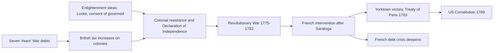
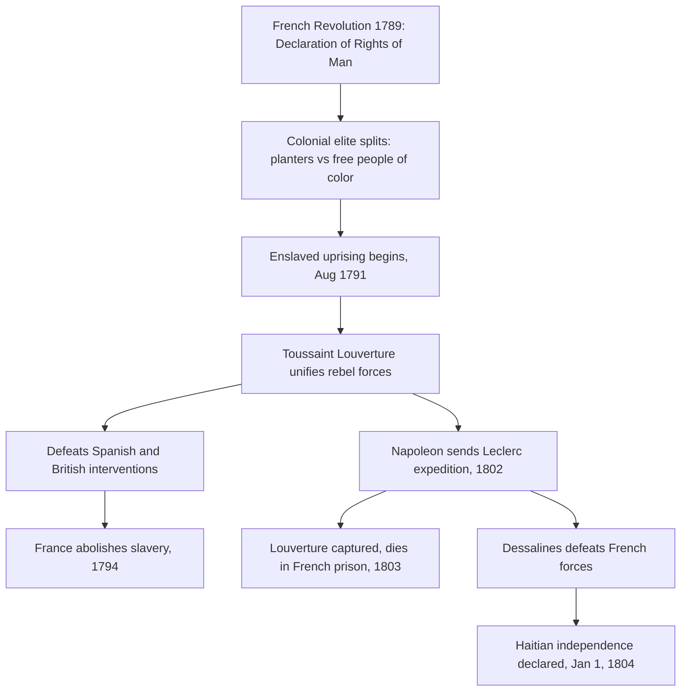
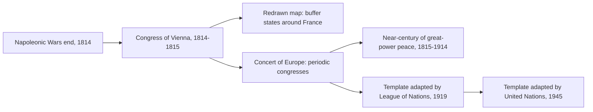
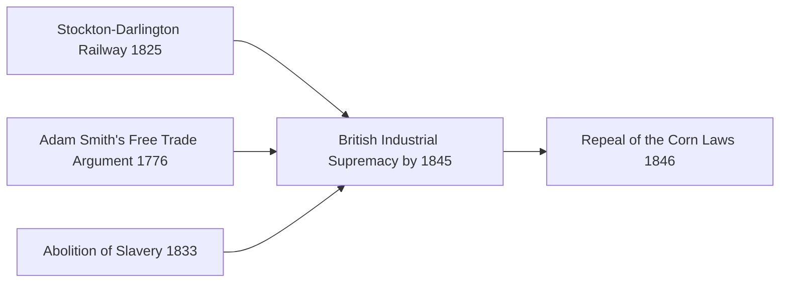
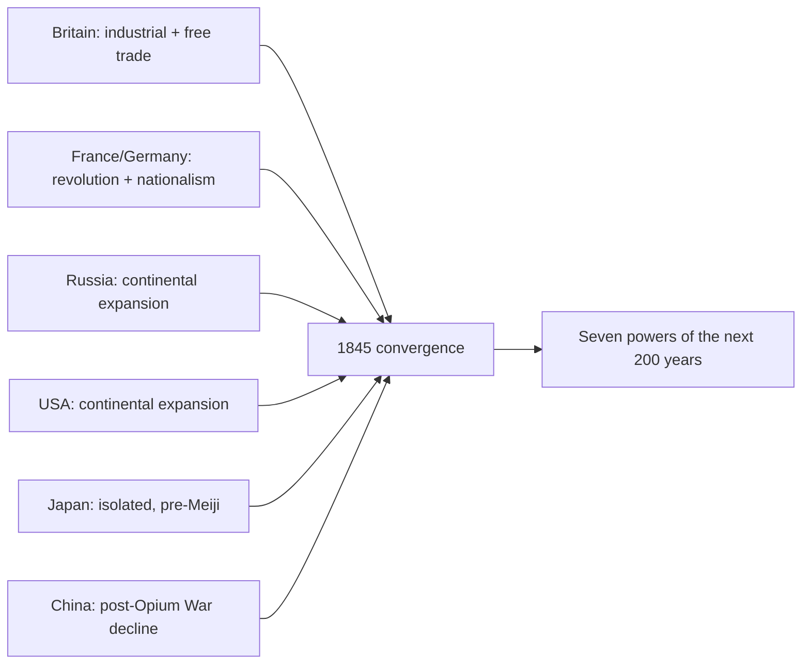

# Concept-Book Run

domain: /home/papagame/projects/digital-duck/conceptbook-app/public/domains/Users/200years_7powers_ch00/input/graph.yaml
target: bridge_to_1845
started: 2026-09-28T02:40:32

## Teaching order (28 concepts)

- seven_years_war_1756
- enlightenment_philosophy_1748
- american_revolution_1775
- french_revolution_1789
- agri_rev_1740s
- haitian_revolution_1791
- franklin_electricity_1752
- adam_smith_1776
- lavoisier_chemistry_1772
- napoleonic_wars_1799
- abolition_slave_trade_1807
- congress_of_vienna_1815
- jenner_vaccine_and_volta_battery
- british_abolition_slavery_1833
- dalton_atomic_theory_1803
- watt_steam_engine_1769
- latin_american_independence_1808
- mechanized_textile_mills_1785
- oersted_faraday_electromagnetism_1820
- first_opium_war_1839
- lyell_darwin_1830
- revolutions_of_1830
- stockton_darlington_railway_1825
- payoff_british_industrial_supremacy
- payoff_liberal_nationalism
- payoff_opium_war_and_china
- payoff_scientific_foundations
- bridge_to_1845

### seven_years_war_1756 (0.9s)

## Seven Years War 1756

The Seven Years' War (1756–1763) was the first conflict fought on a genuinely global scale, with campaigns in Europe, North America, the Caribbean, West Africa, India, and the Philippines. At its core it pitted Britain and Prussia against France, Austria, Russia, and Spain, but the underlying stakes were colonial: who would control North America and the lucrative trade routes to India. Winston Churchill later called it "the first world war," and the label fits — it was the war that decided which European power would dominate global commerce for the next century.

The North American theater, known there as the French and Indian War, illustrates the stakes concretely. British forces under General Jeffrey Amherst captured Quebec in 1759 and Montreal in 1760, ending French rule in Canada. Simultaneously, Robert Clive's victory at the Battle of Plassey in 1757 broke the power of the Nawab of Bengal and gave the British East India Company effective control over Bengal's revenues — a foothold that expanded into control of most of the Indian subcontinent within decades. The 1763 Treaty of Paris formalized these gains: France ceded Canada and its territory east of the Mississippi to Britain, while retaining only small Caribbean sugar islands and trading posts in India.

The financial consequences of the war are as important as the territorial ones. Britain's national debt roughly doubled during the war, from about £75 million to £133 million — a burden Parliament tried to offset by taxing American colonists directly, through measures like the Stamp Act of 1765, setting off the resentments that led to the American Revolution a decade later. France's finances suffered even more severely: the war cost the French crown roughly 1.3 billion livres, deepening a debt crisis that French finance ministers could never fully resolve. That unresolved debt, compounded by France's later support for the American Revolution, was a direct structural cause of the fiscal desperation that forced Louis XVI to convene the Estates-General in 1789 — the opening act of the French Revolution.

Applying this case requires tracing cause and consequence across decades: a war fought to settle colonial rivalry in 1763 produced a chain of fiscal and political pressures that toppled a monarchy twenty-six years later, showing how imperial overreach abroad can generate revolutionary conditions at home.

### enlightenment_philosophy_1748 (0.7s)

## Enlightenment Philosophy 1748

The Enlightenment was a movement of writers and thinkers, mostly in France, Britain, and their colonies, who argued that reason and observation — not tradition, divine right, or inherited privilege — should be the basis for organizing government and society. Two texts published within this project's timeframe supplied the specific political vocabulary that revolutionaries would later use to justify overthrowing monarchies: Montesquieu's *The Spirit of the Laws* (1748) and Rousseau's *The Social Contract* (1762).

Montesquieu, studying the English constitutional system after the Glorious Revolution of 1688, argued that liberty is best protected when governmental power is divided among separate branches — legislative, executive, and judicial — each able to check the others. His central claim, drawn from observing how unchecked monarchs like Louis XIV had ruled France, was that concentrating all power in one person or body inevitably leads to tyranny, regardless of that ruler's intentions. Rousseau, writing fourteen years later, went further: he argued that government has no legitimate authority except what the governed consent to give it, an idea he called the "general will." A king who ruled without the people's consent was, in Rousseau's framework, not a legitimate authority at all — merely a person exercising force.

These were not abstract classroom exercises. Thomas Jefferson had a French edition of Montesquieu on his shelf while drafting the Declaration of Independence in 1776, and the U.S. Constitution's division into Congress, the Presidency, and the Supreme Court is a direct, traceable application of Montesquieu's separation-of-powers argument. The French National Assembly's 1789 Declaration of the Rights of Man cites "the distinction of powers" by name as a requirement for any constitution. In Saint-Domingue (Haiti), enslaved and free Black revolutionaries led by Toussaint Louverture invoked the same language of natural rights and popular sovereignty against French colonial rule after 1791, applying Enlightenment consent theory to a population its French originators had not imagined including.

The problem-solving application for a student of this era is diagnostic: when analyzing any revolution or constitutional document from 1776 onward, ask two questions drawn directly from these texts — does power get divided or checked (Montesquieu's test), and does the government's authority derive from the consent of the governed (Rousseau's test)? Regimes that failed both tests — Bourbon France, the Spanish Bourbon monarchy in Latin America, the Russian and Ottoman empires — became the recurring targets of nineteenth-century liberal and nationalist uprisings.

### american_revolution_1775 (1.5s)

## American Revolution 1775

The American Revolution (1775–1783) was the successful rebellion of thirteen British colonies in North America, justified by Enlightenment political theory and secured through French military intervention. Colonial leaders drew directly on John Locke's arguments about natural rights and government by consent: if a government fails to protect the rights of the governed, the governed may withdraw their consent and form a new one. The Declaration of Independence (1776) states this explicitly, asserting that governments derive their "just powers from the consent of the governed" and that people have the right "to alter or to abolish" a government that violates their rights. This was not an abstract debate — colonists had spent over a decade contesting British taxes (the Stamp Act of 1765, the Townshend Acts of 1767, the tea tax retained after 1770) imposed without their representation in Parliament, a grievance summarized in the slogan "no taxation without representation."

The war itself illustrates how a materially weaker force can prevail through strategy and outside support rather than raw military parity. The Continental Army, poorly funded and often unpaid, avoided full-scale battles it could not win and instead wore down British resolve through attrition and selective victories. The turning point was the American victory at Saratoga (1777), which convinced France — still smarting from its losses in the Seven Years' War — to formally ally with the colonies in 1778, followed by Spain and the Netherlands. French naval support proved decisive at Yorktown (1781), where a combined American-French force trapped General Cornwallis's army, leading to British surrender and the Treaty of Paris (1783), which recognized American independence.

The consequences radiated outward. Domestically, the United States Constitution (1789) established the first large-scale modern republic built on separation of powers and popular sovereignty, translating Enlightenment theory into durable institutions. Internationally, the war deepened the French monarchy's debt — already strained since 1756 — by an estimated 1 billion livres, a burden that fed directly into the fiscal crisis triggering the French Revolution just six years later. The American case also became a reference point that revolutionaries and independence movements across Europe and Latin America would cite for the next century as proof that colonial subjects could overthrow imperial rule.

*How Enlightenment ideology and Seven Years' War debts converged to produce American independence, which in turn worsened France's fiscal crisis.*

### french_revolution_1789 (2.0s)

## French Revolution 1789

By 1789, France's monarchy was insolvent: decades of war spending, including support for the American Revolution, had pushed royal debt to roughly 4 billion livres, while an outdated tax system exempted the nobility and clergy from most direct taxation. Louis XVI convened the Estates-General in May 1789 to address the crisis, but the Third Estate — representing commoners, who made up over 95 percent of France's 28 million people — broke away, declared itself the National Assembly, and swore the Tennis Court Oath to write a constitution. On July 14, 1789, Parisians stormed the Bastille fortress, and by August the Assembly abolished feudal privileges and adopted the Declaration of the Rights of Man and of the Citizen, asserting that men are born free and equal in rights and that sovereignty resides in the nation rather than the crown.

The revolution's trajectory illustrates a recurring pattern in mass political upheaval: initial reform gives way to radicalization when external threats combine with internal factional struggle. When Austria and Prussia threatened to intervene militarily on behalf of the monarchy in 1792, the Assembly declared war, France was declared a republic, and in January 1793 Louis XVI was executed by guillotine. The ensuing Terror (1793–1794), directed by the Committee of Public Safety under Robespierre, executed an estimated 16,000 to 40,000 people accused of counter-revolutionary sympathies before Robespierre himself was overthrown and executed in July 1794.

For problem-solving practice, compare this case to the American Revolution that preceded it: both revolutions invoked natural rights and popular sovereignty, and the French Declaration explicitly echoes language from the American Declaration of Independence and the Virginia Declaration of Rights. But where the American Revolution replaced an external colonial authority with a new federal constitution in a relatively stable social order, the French Revolution overturned an internal social hierarchy — monarchy, aristocracy, and church — within an existing state, producing far greater domestic violence and instability. A useful analytical exercise: given a revolution's stated goals, ask whether it is expelling an external ruler or restructuring internal social relations, since the latter tends to generate more prolonged conflict because entrenched domestic elites have both the means and motive to resist from within.

The Revolution's long-term consequence was to permanently break the assumption that monarchy rested on divine or hereditary right alone. Napoleon Bonaparte's rise to power in 1799 ended the revolutionary republic, but the principles of legal equality and popular sovereignty he codified in the Napoleonic Code (1804) spread across Europe through French conquest, seeding nineteenth-century nationalist and constitutional movements from Germany to Latin America.

### agri_rev_1740s (0.9s)

## Agri Rev 1740S

Before a factory could hire workers, farming had to release them. In the mid-eighteenth century, British agriculture underwent a transformation that did exactly this — not through a single invention, but through two connected changes: how land was owned and how it was farmed.

The first change was enclosure. For centuries, much English farmland had been worked as open fields — large unfenced tracts divided into strips, with peasants holding scattered strips and shared rights to graze livestock on common land. Enclosure acts, passed in growing numbers by Parliament from the 1750s onward (over 4,000 acts between 1750 and 1830, affecting roughly 7 million acres), consolidated these strips into fenced, individually owned plots. Landlords who could now farm efficient, contiguous fields evicted or bought out smallholders who depended on common grazing rights. The result was a more productive but less labor-absorbing countryside: fewer people were needed to work the same land, and many who lost their customary land rights had no choice but to seek wages elsewhere.

The second change was technique. Charles Townshend popularized the four-field (Norfolk) rotation — wheat, turnips, barley, and clover cycled through each field in sequence — which restored soil nitrogen without leaving land fallow every third year, as the older three-field system required. Turnips and clover also provided winter fodder, which fed into the third development: Robert Bakewell's selective livestock breeding, which produced sheep and cattle that matured faster and yielded more meat and wool per animal.

Together these changes solved a problem simple enough to state in numbers: fewer farmers, using fewer fallow fields, were now feeding more people. Estimates suggest English agricultural output per worker roughly doubled across the eighteenth century, while the share of the workforce in agriculture fell from about 60 percent in 1700 to under 40 percent by 1800.

That freed labor pool is the hinge of this chapter. Enclosure didn't just make farming efficient — it made rural life unsustainable for many families, pushing them toward towns just as new textile machinery was creating demand for exactly that labor. Without the Agricultural Revolution, there is no workforce standing outside the factory gates in the 1780s.

### haitian_revolution_1791 (0.8s)

## Haitian Revolution 1791

Saint-Domingue, France's colony on the western third of Hispaniola, produced about 40 percent of the world's sugar and half its coffee in the late 1780s, generating more export revenue than all thirteen North American colonies combined. That wealth rested on roughly 500,000 enslaved Africans working under conditions so brutal that planters expected to work most captives to death within a few years and simply import replacements. When the French Revolution's Declaration of the Rights of Man reached the colony in 1789, it destabilized the racial order: free people of color demanded citizenship rights, white planters split between royalists and revolutionaries, and enslaved people watched the colonial elite fracture in real time.

On the night of August 22, 1791, enslaved leaders including Dutty Boukman organized a coordinated uprising in the Plaine du Nord, burning plantations and killing planters by the thousands. Within weeks roughly 100,000 enslaved people had joined the revolt. Toussaint Louverture, a formerly enslaved man with military and administrative skill, emerged as the rebellion's leader by 1793. He built a disciplined army that defeated Spanish forces (who had allied with the rebels against France), then turned against a British invasion force that lost an estimated 15,000 soldiers to combat and yellow fever between 1793 and 1798. France abolished slavery in its colonies in 1794, partly to secure Louverture's loyalty, and he in turn nominally kept the colony under French sovereignty while governing it autonomously.

The revolution's second, decisive phase began in 1802, when Napoleon Bonaparte sent roughly 40,000 troops under General Leclerc to restore slavery and French control. Louverture was captured through deception and died in a French prison in 1803, but his former subordinate Jean-Jacques Dessalines continued the resistance. Disease and combat destroyed the French expedition — over 50,000 French soldiers died, more than the French casualties at Waterloo. On January 1, 1804, Dessalines declared independence, renaming the colony Haiti and founding the first nation born from a successful slave revolt.

**Problem-solving application:** Historians use the Haitian Revolution as a test case for tracing how ideas travel and mutate across borders. Consider the causal chain: French revolutionary rhetoric about universal rights was written by men who did not intend it to apply to enslaved Africans, yet Haitian revolutionaries took the language literally and extended it further than its authors had. When analyzing any revolutionary movement, ask three questions this case illustrates well: who originated an idea, who reinterpreted it, and whose material interests were threatened by the reinterpretation. Applying that framework here explains why France, Britain, Spain, and the United States — despite their own revolutionary or abolitionist rhetoric — spent the next six decades diplomatically isolating and economically punishing Haiti, culminating in France's 1825 demand for 150 million francs in "compensation" for lost plantation property, a debt Haiti finished paying only in 1947.

*Causal sequence from the French Revolution's ideological shock through the military campaigns that produced Haitian independence.*

### franklin_electricity_1752 (0.6s)

## Franklin Electricity 1752

By the mid-eighteenth century, natural philosophers had produced electricity in the laboratory using friction machines and stored it in Leyden jars, but many still treated lightning as a separate, mysterious force of nature — sometimes attributed to sulfurous vapors or divine wrath rather than to the same electrical fluid crackling in glass tubes. Benjamin Franklin, a Philadelphia printer and self-taught scientist, proposed instead that lightning and laboratory electricity were identical phenomena, differing only in scale. He reasoned that both produced light, followed irregular paths, could kill, melted metals, and were attracted to sharp points — similarities too numerous to be coincidence.

In June 1752, Franklin tested this hypothesis with a now-famous experiment: he flew a silk kite with a pointed wire attached to its top during a thunderstorm, connecting the wet kite string to a key and then to a Leyden jar on the ground, insulated by a dry silk ribbon he held. When the storm's electrified clouds charged the kite and wire, Franklin observed loose threads on the string stand erect, and drew a spark from the key with his knuckle — proof that the cloud's charge was ordinary electricity, capable of charging a jar exactly as a friction machine could. He survived only because he stood clear of the wet string itself and never directly grounded himself to the strike; later experimenters who attempted careless replications, including Georg Wilhelm Richmann in St. Petersburg in 1753, were killed.

Franklin's practical payoff followed immediately: since sharp metal points attract and safely discharge electrical fluid, a grounded metal rod mounted above a building's peak could intercept a lightning strike and conduct it harmlessly into the earth, protecting the structure from fire. Franklin published this design in *Poor Richard's Almanack* (1753), and lightning rods were soon installed on prominent buildings in Philadelphia and beyond, dramatically reducing deaths and fires from strikes on tall structures — one of the first instances of a laboratory discovery converted directly into a lifesaving technology.

The deeper significance was conceptual: Franklin demonstrated that a phenomenon long treated as supernatural and unpredictable instead followed the same measurable rules as electricity generated by human hands, and that those rules could be exploited by design rather than merely observed. This conviction that nature's forces are lawful and controllable through deliberate experiment became the connecting thread running forward through the study of electricity and magnetism, culminating decades later in Michael Faraday's discovery of electromagnetic induction.

### adam_smith_1776 (0.7s)

## Adam Smith 1776

In 1776 the Scottish philosopher Adam Smith published *An Inquiry into the Nature and Causes of the Wealth of Nations*, the founding text of modern economics. Smith argued that national prosperity does not come from a monarch hoarding gold and silver, the prevailing mercantilist view, but from the productive capacity of a nation's labor and capital. His central claims were threefold: specialization and division of labor dramatically raise output, individuals pursuing their own self-interest in a competitive market tend to produce outcomes beneficial to society as a whole (the famous "invisible hand"), and government interference with trade, through tariffs, monopolies, and export bans, typically makes nations poorer rather than richer.

Smith's worked example, still taught today, was a pin factory. One worker performing every step alone might make a handful of pins a day. But when the eighteen distinct operations, drawing wire, straightening it, cutting it, sharpening the point, attaching the head, are split among ten specialized workers, the same group can produce upward of 48,000 pins a day. Smith used this to show that specialization, not individual skill or effort, was the primary driver of productivity growth, and that markets naturally organize this specialization without central direction.

The book's timing mattered as much as its argument. Smith wrote against the backdrop of Britain's agricultural revolution of the 1740s, which had already freed a large share of the rural population from subsistence farming, and the Seven Years' War of 1756 to 1763, which had left Britain with a vast trading empire but also a heavy war debt serviced partly through tariffs and colonial trade restrictions. Smith's book supplied the intellectual case for dismantling exactly these restrictions, arguing that free trade would generate more tax revenue through growth than protectionism ever could through control.

Applying Smith's framework to a policy problem: economists and reformers who wanted to lower food prices for Britain's growing industrial workforce could point directly to *The Wealth of Nations* to argue that the Corn Laws, tariffs protecting domestic grain producers from cheaper foreign wheat, were making the nation poorer, not safer. This is precisely the reasoning that Richard Cobden and the Anti-Corn Law League would deploy in Parliament seventy years later, culminating in the 1846 repeal that opens the industrial capitalism era of the following chapter.

### lavoisier_chemistry_1772 (0.7s)

## Lavoisier Chemistry 1772

By the 1770s, chemistry was still tangled in the vocabulary and assumptions of alchemy. Antoine Lavoisier changed that by insisting on one simple discipline: weigh everything, before and after a reaction, in a sealed system where nothing enters or escapes unaccounted for. Using precision balances, he showed that when substances burn, rust, or react, the total mass of the products always equals the total mass of the reactants — matter is neither created nor destroyed, only rearranged. This became known as the law of conservation of mass, and it turned chemistry from a qualitative craft into a quantitative science built on measurement.

Lavoisier's most famous experiment attacked the reigning "phlogiston theory," which held that a fire-like substance was released during combustion. He heated mercury in a sealed vessel containing air, watched a red powder (mercury calx) form while the air's volume shrank by about one-fifth, then heated the red powder further and recovered a gas that, when added back, restored the original air. He named this reactive component "oxygen" (from Greek for "acid-former") and the other principal gas of water "hydrogen" ("water-former"). Careful weighing showed the mercury had gained exactly the mass of oxygen absorbed — no phlogiston needed to explain the results.

Problem-solving application: Lavoisier's method gives chemists a practical accounting tool. If 12 grams of magnesium burns completely in oxygen and the resulting magnesium oxide weighs 20 grams, conservation of mass tells you the magnesium combined with 8 grams of oxygen — without ever having measured the gas directly. This logic, tracking mass through a reaction like an auditor tracking money through a ledger, let chemists work out the composition of unknown compounds decades before atomic theory existed.

Lavoisier extended this rigor to language itself. With collaborators, he published a systematic nomenclature in 1787, naming compounds by their actual elemental composition (for instance, "sulfuric acid" instead of "oil of vitriol") so that a compound's name revealed what it was made of. His 1789 "Elementary Treatise on Chemistry" listed 33 substances he could not decompose further — an early table of elements — and established the modern chemical equation as a balanced statement of matter in, matter out. This combination of quantitative measurement, controlled experiment, and disciplined naming is what later let 19th-century industrial chemists scale reactions reliably from the laboratory bench to the factory floor.

### napoleonic_wars_1799 (0.9s)

## Napoleonic Wars 1799

When Napoleon Bonaparte seized power in the coup of 18 Brumaire (November 1799), the French Revolution's ideals of legal equality and popular sovereignty gained a general willing to spread them by force. Over the next sixteen years he turned revolutionary France into a continental empire, and in doing so unintentionally sowed the nationalist movements that would eventually resist him.

Napoleon's military method combined the mass conscript army the Revolution had created with speed and concentration of force at the decisive point. At Austerlitz (1805) he destroyed a combined Austrian-Russian army; by 1807 Prussia and much of the German states, Italy, and Spain were either annexed, occupied, or turned into satellite kingdoms ruled by his relatives. Wherever French administration took hold, it carried the Napoleonic Code of 1804: uniform civil law, abolition of serfdom and hereditary feudal privilege, religious toleration, and careerism based on merit rather than birth. Populations that had never known legal equality experienced it under French occupation — and that experience, paradoxically, planted the seeds of national self-determination against French rule itself. German and Spanish subjects who absorbed revolutionary ideas of citizenship began asking why they should be ruled by a foreign emperor rather than a nation of their own.

That contradiction proved fatal. In Spain after 1808, guerrilla resistance tied down hundreds of thousands of French troops in a war of attrition. In 1812, Napoleon's invasion of Russia with roughly 600,000 men ended in catastrophe: fewer than 100,000 recrossed the border after Moscow's scorched-earth strategy and the brutal winter retreat. Sensing the emperor's vulnerability, Britain, Russia, Prussia, and Austria — powers that had previously fought France separately and lost — formed the Sixth Coalition and, at Leipzig in October 1813, inflicted the first defeat of Napoleon's main army by a unified alliance. His abdication followed in 1814; a brief return during the Hundred Days ended at Waterloo in June 1815.

The lasting lesson was diplomatic rather than military: the Congress of Vienna (1814–1815) established that when a single power threatens to dominate the continent, a coalition of rivals will set aside their own rivalries to restore balance — a template for collective security that recurs throughout the next two centuries of great-power politics.

### abolition_slave_trade_1807 (0.7s)

## Abolition Slave Trade 1807

In 1807, Parliament passed the Slave Trade Act, making it illegal for British subjects to buy, sell, or transport enslaved people across the Atlantic. Britain went further than most nations by deploying the Royal Navy's West Africa Squadron to intercept slave ships on the high seas, effectively policing an international ban rather than merely enforcing a domestic law. This mattered because Britain, having built the largest slave-trading operation in the eighteenth century — carrying over 3 million enslaved Africans between 1660 and 1807 — was now using its naval dominance to dismantle the very system it had helped create.

Two forces converged to produce this reversal. The first was intellectual: Adam Smith's "The Wealth of Nations" (1776) argued that free wage labor was economically more productive than coerced labor, undercutting the planters' claim that slavery was indispensable to profit. Enlightenment moral philosophy, echoed by abolitionist campaigners like William Wilberforce and Thomas Clarkson, reframed slavery as a violation of natural rights rather than a regrettable but necessary institution. The second was empirical proof from Haiti: the Haitian Revolution (1791–1804) showed that an enslaved population could organize, fight a prolonged war against European powers, and win independence, founding the first Black republic in the Americas. This shattered the assumption — central to slaveholders' economic and political arguments — that enslaved people were incapable of self-governance or successful resistance. Together, theory and demonstrated fact moved British public and parliamentary opinion faster than either could have alone.

The problem-solving lesson here is about how social movements convert moral argument into enforceable policy. Abolitionists needed more than a persuasive case; they needed evidence that undermined the economic and security justifications for slavery, plus a mechanism to make the law binding beyond Britain's own ports. The Royal Navy patrols supplied that mechanism, since a law banning trade only within British territory would have simply pushed the trade to other flags. By treating suppression as a matter of naval enforcement on international waters, Britain turned a domestic statute into a de facto global enforcement regime, a strategy later echoed in nineteenth-century treaties pressuring other nations, including the United States, Spain, and Portugal, to follow suit.

### congress_of_vienna_1815 (0.8s)

## Congress Of Vienna 1815

After Napoleon's defeat, the great powers of Europe — Austria, Russia, Prussia, and Britain, joined by a restored France — convened in Vienna from September 1814 to June 1815 to settle the continent's borders and prevent another quarter-century of war. The negotiations were dominated by Austria's foreign minister Prince Metternich, Russia's Tsar Alexander I, Britain's Lord Castlereagh, and France's Talleyrand, who skillfully secured his defeated nation a seat among the victors. The guiding principle was balance of power: no single state should again grow strong enough to dominate the continent, as France had under Napoleon. To achieve this, the Congress redrew borders deliberately — strengthening the states bordering France (enlarging the Netherlands, uniting Genoa with Piedmont-Sardinia, and creating a German Confederation of 39 states) while restoring the Bourbon monarchy in France and returning Russian, Austrian, and Prussian territories roughly to pre-Napoleonic lines, adjusted for negotiated compensation elsewhere (Prussia gained the Rhineland and part of Saxony; Russia gained most of Poland; Austria gained northern Italy).

The Congress's lasting innovation was not the map itself but the mechanism it created for maintaining it: the Concert of Europe. Rather than treating the settlement as final, the great powers agreed to hold periodic congresses to manage crises collectively before they escalated into war — a practice formalized in the Quadruple Alliance's 1815 treaty and tested at follow-up meetings such as Aix-la-Chapelle (1818) and Troppau (1820). This system of consultation, though imperfect and increasingly strained by revolutions in 1830 and 1848, held off a general European war among the great powers for nearly a century, until 1914 — a striking contrast to the near-constant warfare of the eighteenth century.

The problem-solving lesson for later diplomacy was that post-war settlements succeed less by punishing the defeated than by reintegrating them into a stable balance and by institutionalizing ongoing dialogue. The League of Nations (1919) and the United Nations (1945) both adapted this Vienna template — periodic multilateral consultation among major powers — while trying to fix its central weakness: the Concert had no permanent enforcement body and relied entirely on the great powers' continued willingness to cooperate, which eventually broke down.

*How the Congress of Vienna's territorial settlement and diplomatic mechanism shaped a century of peace and later international institutions.*

### jenner_vaccine_and_volta_battery (1.0s)

## Jenner Vaccine And Volta Battery

By 1800, two independent breakthroughs handed science its first reliable tools for manipulating life and matter, closing out the eighteenth century's revolution in method that Lavoisier had opened in chemistry.

Edward Jenner, a country doctor in Gloucestershire, England, had long noted a folk belief among dairy workers: those who caught cowpox, a mild disease transmitted from cattle, seemed immune to smallpox, a disease that killed roughly 400,000 Europeans annually and left survivors scarred or blind. On May 14, 1796, Jenner took pus from a cowpox lesion on a milkmaid, Sarah Nelmes, and inoculated an eight-year-old boy, James Phipps. Six weeks later, he deliberately exposed Phipps to smallpox matter. The boy did not develop the disease. Jenner repeated the test on more subjects and published his findings in 1798 as "An Inquiry into the Causes and Effects of the Variolae Vaccinae," coining the term "vaccine" from *vacca*, the Latin word for cow. This was the first empirical demonstration that deliberate exposure to a related, weaker pathogen could confer protection against a lethal one — the founding experiment of immunology, decades before anyone understood what a virus or an antibody was.

Almost simultaneously, the Italian physicist Alessandro Volta solved a different problem: how to produce a steady, on-demand flow of electricity. Earlier experimenters like Luigi Galvani had observed that frog legs twitched when touched by two different metals, and attributed this to "animal electricity" residing in the tissue. Volta disagreed, arguing the electricity came from the contact between dissimilar metals themselves, with the moist tissue merely acting as a conductor. To prove it, in 1800 he built the voltaic pile: alternating discs of zinc and copper separated by cloth soaked in brine, stacked into a column. Each cell of metal pair plus electrolyte produced a small, consistent voltage, and stacking cells in series multiplied it — the same principle underlying every battery built since. Unlike the brief spark of a Leyden jar, Volta's pile delivered continuous current, letting researchers run electricity through wires and substances for as long as they wished.

The consequence arrived almost immediately: within weeks of Volta's announcement, chemists William Nicholson and Anthony Carlisle connected a voltaic pile to water and decomposed it into hydrogen and oxygen gas — the first electrolysis, and proof that electricity could break chemical bonds. This opened a direct path to Humphry Davy's isolation of previously unobtainable elements (potassium, sodium, calcium) by electrolysis within the next decade.

**Problem-solving application:** Suppose a Nicholson-and-Carlisle-style electrolysis cell decomposes water using a current of 2 amperes for 1 hour. Faraday's later law of electrolysis (still describing this same 1800 experiment retrospectively) states that the mass of substance liberated is proportional to total charge passed, $Q = It$. Here $Q = 2\text{A} \times 3600\text{s} = 7200$ coulombs — the quantitative link between Volta's continuous current and measurable chemical change that Jenner's contemporaries could not yet formalize, but that later chemists would use to precisely map electricity onto atomic-scale reactions.

### british_abolition_slavery_1833 (0.8s)

## British Abolition Slavery 1833

The Slavery Abolition Act, passed by Parliament in August 1833 and effective August 1, 1834, ended slavery across most of the British Empire, freeing an estimated 800,000 enslaved people in the Caribbean, Mauritius, and the Cape Colony. The act did not spring from moral conviction alone: it followed decades of organizing by British abolitionists such as William Wilberforce and Thomas Clarkson, sustained pressure from the Anti-Slavery Society, and a series of slave uprisings—most notably the 1831 Baptist War in Jamaica, in which tens of thousands of enslaved people revolted, signaling to Parliament that the existing system was becoming unsustainable to police. Building on the abolition of the slave trade in 1807, which had cut off the supply of new enslaved people but left existing slavery intact, the 1833 act addressed the institution itself.

The law's central mechanism reveals whose interests it prioritized. Parliament allocated £20 million—roughly 40 percent of the national budget that year, and a sum Britain only finished repaying through consolidated debt in 2015—as compensation, but paid it entirely to the roughly 46,000 slaveholders, not to the freed people. A single owner with hundreds of enslaved workers, such as those with holdings in Jamaica or Barbados, could receive tens of thousands of pounds, while the freed people received nothing and were further required to serve four to six years of unpaid "apprenticeship" before full freedom took effect in 1838. This structure illustrates a recurring pattern in emancipation legislation worldwide: property rights were treated as the injury requiring redress, not the century of unpaid labor extracted from the enslaved.

The economic and political consequences radiated outward. Caribbean plantation economies, dependent on coerced labor, shifted toward indentured labor from India and China to fill the gap, reshaping colonial demographics for a century. More consequentially for global history, British abolition removed a major slaveholding power from the world stage and gave the American abolitionist movement a concrete precedent: activists like Frederick Douglass and William Lloyd Garrison invoked Britain's example to argue that emancipation was administratively achievable, not merely utopian. This comparison sharpened the moral and political stakes of slavery in the United States, feeding directly into the sectional tensions that would erupt in the Civil War three decades later.

### dalton_atomic_theory_1803 (0.7s)

## Dalton Atomic Theory 1803

In 1803, the English chemist and schoolteacher John Dalton proposed that all matter is built from atoms — indivisible particles with a characteristic mass for each element. Dalton's theory rested on four claims: elements are made of atoms; all atoms of a given element have identical mass and properties, while atoms of different elements differ; compounds form when atoms of different elements combine in fixed, whole-number ratios; and chemical reactions merely rearrange atoms, never creating or destroying them. This last point extended Antoine Lavoisier's 1789 law of conservation of mass, while the ratio claim generalized Joseph Proust's 1799 law of definite proportions. Dalton's real innovation was assigning atoms relative weights, turning chemistry from a qualitative craft into a quantitative science — he built the first table of atomic weights, setting hydrogen at 1 as the reference standard.

**Worked example.** Dalton's law of multiple proportions is best seen in carbon's two oxides. In carbon monoxide, 12 grams of carbon combine with 16 grams of oxygen; in carbon dioxide, the same 12 grams of carbon combine with 32 grams of oxygen. The oxygen masses reduce to a small whole-number ratio:

$$\frac{16 \text{ g}}{32 \text{ g}} = \frac{1}{2}$$

This 1:2 ratio is exactly what atomic theory predicts if one carbon atom bonds with one oxygen atom in CO and with two oxygen atoms in CO$_2$ — atoms cannot combine as, say, 1.37 oxygen atoms per carbon atom.

**Problem-solving application.** Suppose two nitrogen oxides are analyzed: sample A contains 14 g nitrogen for every 16 g oxygen, and sample B contains 14 g nitrogen for every 32 g oxygen. Dividing the oxygen masses (32 ÷ 16 = 2) shows the ratio is a simple whole number, consistent with formulas NO and NO$_2$. A chemist unfamiliar with atomic theory would see only two puzzling percentage compositions; Dalton's framework converts that data into a testable structural hypothesis — the atom count per molecule. This same logic — fixed mass ratios revealing fixed atomic ratios — later let chemists order elements by atomic weight, directly enabling Dmitri Mendeleev's periodic table in 1869 and, decades after that, the discovery that atoms themselves have internal structure.

### watt_steam_engine_1769 (0.8s)

## Watt Steam Engine 1769

James Watt's 1769 patent for a "new method of lessening the consumption of steam and fuel in fire engines" solved a specific inefficiency in the existing Newcomen engine, which had been used since 1712 mainly to pump water out of coal and tin mines. In the Newcomen design, steam was injected into the main cylinder and then condensed by spraying cold water directly into that same cylinder. This cooled the cylinder walls along with the steam, so every stroke wasted fuel reheating the cylinder before the next stroke could begin. Watt's insight, developed while repairing a Newcomen model at the University of Glasgow, was to add a separate condenser chamber connected to the main cylinder by a valve. Steam still condensed and lost its pressure, but the cylinder itself stayed hot, since only the separate chamber was cooled. This single change cut fuel consumption by roughly 75 percent for the same power output.

The efficiency gain mattered because it changed what the steam engine was for. Newcomen engines were fuel-hungry enough that they only made economic sense at coal mines, where fuel was essentially free on-site. Watt's engine, refined through his partnership with manufacturer Matthew Boulton beginning in 1775, produced enough power per unit of fuel to be worth transporting coal to run it elsewhere. By the 1780s, Boulton and Watt engines were driving rotary machinery in cotton mills and iron forges across Britain, converting the reciprocating piston motion into continuous rotational power via Watt's separate patented sun-and-planet gear mechanism (patented 1781) — because James Watt's original rotative patent had already covered similar crank arrangements held by rivals.

This transition depended on a prior structural shift: the Agricultural Revolution of the 1740s had already increased crop yields per farmworker, releasing labor from the land into towns and factories. Watt's engine gave that displaced labor force a location-independent power source; a mill no longer had to sit beside a fast-flowing river, as water-powered mills did. Textile output in Britain grew accordingly — raw cotton imports rose from about 5 million pounds in 1781 to over 300 million pounds by 1830 — as steam-driven machinery multiplied the productivity of each worker, marking the practical beginning of industrial manufacturing at scale.

### latin_american_independence_1808 (1.6s)

## Latin American Independence 1808

In 1808 Napoleon deposed the Spanish king and installed his own brother on the throne, then occupied Portugal, forcing its royal family to flee to Brazil. This single act shattered the legal basis of colonial rule. Spanish American colonists had governed under a loyalty to the crown, not to Spain as a nation; with no legitimate king, cities across the Americas formed juntas claiming to hold sovereignty in trust until Ferdinand VII was restored. What began as a defense of the monarchy evolved, over the next two decades, into full independence movements, because the temporary councils resisted relinquishing power even after Ferdinand returned in 1814 and tried to reassert absolute rule.

The movement unfolded in three major theaters. In Mexico, the priest Miguel Hidalgo issued his 1810 call to arms, the Grito de Dolores, igniting a mass insurgency of indigenous and mestizo peasants; though Hidalgo was captured and executed in 1811, the rebellion he sparked ultimately produced Mexican independence in 1821. In the north of South America, Simón Bolívar led a grinding campaign across Venezuela, Colombia, Ecuador, and into Peru and Bolivia, winning decisive battles such as Boyacá (1819) and Carabobo (1821) that broke Spanish military power in the Andes. In the south, José de San Martín crossed the Andes from Argentina in 1817 to liberate Chile, then sailed north to help free Peru, meeting Bolívar at Guayaquil in 1822 before withdrawing from the struggle entirely. Brazil took a different path: in 1822 the Portuguese prince regent Pedro, left in charge of the colony, declared independence himself rather than return to a subordinate role in Lisbon, making Brazil an independent empire without the sustained warfare seen in Spanish America.

By 1826, Spain retained only Cuba and Puerto Rico in the Americas, having lost territory that had generated immense silver wealth for three centuries. Applying this case requires distinguishing *cause* from *trigger*: long-standing grievances — exclusion of American-born elites (Creoles) from top colonial offices, trade restrictions favoring Spanish merchants, and Enlightenment ideas absorbed from the French and American revolutions — created the underlying pressure, while Napoleon's invasion supplied the immediate opening. A useful comparative exercise is to contrast this outcome with the Haitian Revolution of 1791–1804: Haiti's independence came from an enslaved population overturning the entire social order, whereas most Spanish American independence movements were led by Creole elites who preserved existing social hierarchies, illustrating how the same era of revolutionary upheaval produced sharply different social outcomes depending on who led the fight and what they sought to preserve or dismantle.

### mechanized_textile_mills_1785 (2.0s)

## Mechanized Textile Mills 1785

By the 1780s, James Watt's improved steam engine gave British manufacturers a power source that did not depend on rivers or the weather. Textile production was the first industry transformed. Richard Arkwright's water frame (1769) and Samuel Crompton's spinning mule (1779) mechanized the spinning of cotton thread, and Edmund Cartwright's power loom (1785) mechanized weaving. When these machines were driven by steam rather than waterwheels, factories no longer needed to sit beside fast-flowing streams — they could cluster wherever coal and labor were cheap and accessible. Manchester, Leeds, and Birmingham grew rapidly as a result, becoming the world's first industrial cities.

The consequence was a fundamental reorganization of work. Before mechanization, spinning and weaving were done by families in their homes — the "domestic system," paid by the piece and set to its own rhythm. The factory system replaced this with wage labor performed on a fixed schedule, under supervision, inside a single building housing dozens or hundreds of machines. A worker no longer owned the tools of production; the machinery, and the building that housed it, belonged to the factory owner. This shift created two new social classes tied directly to mechanized production: an industrial capitalist class that owned mills and machinery, and an urban working class — including large numbers of women and children — that sold labor for wages.

The scale of change is measurable. Britain's raw cotton imports rose from about 11 million pounds in 1785 to over 300 million pounds by 1830, while coal output climbed from roughly 6 million tons in 1770 to over 30 million tons by 1830 to fuel steam engines and iron furnaces. Manchester's population grew from about 25,000 in 1772 to over 300,000 by 1850, a rate of urban growth without precedent in European history.

*How steam power freed textile production from water sites and concentrated it into factory towns, giving rise to the industrial working class.*

For a historian evaluating this transition, the analytical task is to distinguish cause from consequence: mechanization did not simply speed up an existing system, it created a new one, replacing household production with wage labor concentrated under one roof. When assessing any later industrializing region — Lowell, Massachusetts in the 1820s, or the Ruhr Valley in the 1850s — the same diagnostic questions apply: what powered the machines, what happened to the people who previously did the work by hand, and how did population and pollution concentrate around the new mills.

### oersted_faraday_electromagnetism_1820 (1.9s)

## Oersted Faraday Electromagnetism 1820

In 1820, Danish physicist Hans Christian Oersted was demonstrating electric circuits to students when he noticed something unexpected: a compass needle placed near a current-carrying wire swung to point perpendicular to the wire. This was the first direct evidence that electricity and magnetism — until then studied as separate phenomena — were physically connected. An electric current, Oersted showed, generates a magnetic field around itself. Eleven years later, English scientist Michael Faraday reversed the logic. He found that moving a magnet through a coil of wire, or otherwise changing the magnetic field passing through a loop, induces an electric current in that loop, even with no battery attached. This is electromagnetic induction, and together with Oersted's discovery it closed the loop: electricity can create magnetism, and magnetism can create electricity.

Faraday's law states this quantitatively: the electromotive force (EMF) induced in a coil equals the negative rate of change of magnetic flux through it, scaled by the number of turns:

$$ \varepsilon = -N\frac{d\Phi_B}{dt} $$

where $N$ is the number of turns in the coil and $\Phi_B$ is the magnetic flux through one turn. A stronger magnet, a faster motion, or more turns of wire all produce a larger induced voltage — this is exactly why hand-cranked generators and bicycle dynamos work.

Worked example: a coil of 200 turns encloses a magnetic flux that drops uniformly from 0.05 Wb to 0.01 Wb in 0.2 seconds as a magnet is pulled away. The induced EMF is $\varepsilon = -200 \times \frac{0.01 - 0.05}{0.2} = 40$ volts. Reverse the direction of the magnet's motion and the polarity of the induced voltage flips — a direct consequence of the law's minus sign, which encodes the fact that the induced current opposes the change producing it.

The practical payoff of these two discoveries was enormous. Oersted's effect — current producing a magnetic force — is the working principle of the electric motor: current through a wire in a magnetic field experiences a force that produces rotation. Faraday's effect — motion producing current — is the working principle of the generator: mechanical rotation through a magnetic field produces electric current. This complementary pair made it possible, later in the nineteenth century, to generate electricity centrally and use it to drive machinery anywhere, the technological foundation of the Second Industrial Revolution.

### first_opium_war_1839 (0.9s)

## First Opium War 1839

By the 1830s, Britain's East India Company had built a profitable, illegal trade funneling opium grown in Bengal into China, reversing a trade imbalance that had long favored Chinese tea, silk, and porcelain exports. Opium addiction spread rapidly through Chinese society, and silver flowed out of the empire to pay for it. In 1839, the Qing court appointed the incorruptible official Lin Zexu as imperial commissioner at Canton. Lin blockaded foreign merchants, confiscated roughly 20,000 chests of British opium — about 1,400 tons — and destroyed it publicly by dissolving it in seawater and lime. Britain, framing the destruction of private property as a justification for war, dispatched a naval expeditionary force in 1840.

The conflict that followed exposed a stark asymmetry: British steam-powered gunboats and modern artillery outmatched Qing coastal defenses and traditional war junks, and British forces seized key ports along the Chinese coast with minimal losses. By 1842, with British ships threatening Nanking (Nanjing) itself, the Qing court sued for peace, producing the Treaty of Nanking — the first of what China would later call the "unequal treaties." Its terms ceded Hong Kong Island to Britain in perpetuity, opened five treaty ports (Canton, Amoy, Foochow, Ningpo, and Shanghai) to British trade and residence, fixed tariffs outside Chinese control, and granted British subjects extraterritoriality — the right to be tried under British, not Chinese, law while on Chinese soil.

To apply this event analytically, compare it against the pattern set at the Congress of Vienna in 1815, where great powers negotiated as recognized equals to restore a balance of power after the Napoleonic Wars. The Treaty of Nanking inverts that model entirely: it was imposed by a victor on a defeated, non-European state, with no reciprocal obligations and no seat for China at the negotiating table. This asymmetry — military industrialization on one side, a still-preindustrial imperial bureaucracy on the other — is the mechanism, not fate or cultural decline, that explains the outcome. The same year, 1833, Britain abolished slavery throughout its empire, a reminder that the era's dominant power could simultaneously advance humanitarian reform at home while enforcing a narcotics trade abroad; British domestic law and British foreign policy toward China operated by entirely separate moral logics. The Treaty of Nanking set the template — extraterritoriality, treaty ports, indemnities — that subsequent powers (France, the United States, later Japan) would replicate in further treaties, compounding the loss of Qing sovereignty across the following decades.

### lyell_darwin_1830 (0.7s)

## Lyell Darwin 1830

Charles Lyell's *Principles of Geology*, published in three volumes beginning in 1830, made the case that the Earth's surface — its canyons, mountain ranges, and rock strata — was carved not by sudden catastrophes but by the same slow processes still observable today: erosion, sedimentation, and gradual uplift, operating continuously over millions of years. This idea, known as uniformitarianism, directly challenged the prevailing view, rooted in a literal reading of Genesis, that the Earth was roughly six thousand years old and that its features were the product of a single global flood. Lyell's timescale was not a guess; he reasoned from measurable rates — for instance, the observed pace at which Niagara Falls eroded upstream, or the layers of sediment deposited by rivers like the Mississippi — and extrapolated backward to argue that comparable formations elsewhere required not thousands but millions of years to form.

In December 1831, a twenty-two-year-old Charles Darwin boarded HMS Beagle for a survey voyage around South America and the Pacific, carrying the first volume of Lyell's book as reading material. The effect was immediate and lasting: when Darwin observed raised beaches in Chile and marine fossils high in the Andes, he interpreted them through Lyell's framework of gradual geological uplift rather than a single flood event. This habit of reading physical evidence as the record of slow, cumulative change over vast stretches of time became the intellectual scaffolding for Darwin's later biological argument. If mountains and canyons could be built by imperceptibly slow forces given enough time, then perhaps species themselves could be transformed by similarly slow, cumulative processes — a possibility Darwin would spend the next quarter-century developing into natural selection, published in *On the Origin of Species* in 1859.

The problem-solving lesson here is methodological rather than mathematical: both Lyell and Darwin solved the puzzle of "how could such large changes occur without anyone observing them happen" by reasoning that small, continuous effects, compounded over a sufficiently long time, produce dramatic results — a principle historians of science still test today by asking, for any observed large-scale change, whether it more plausibly reflects a single dramatic cause or an accumulation of ordinary ones acting over time.

### revolutions_of_1830 (0.9s)

## Revolutions Of 1830

By 1830 the settlement engineered at the Congress of Vienna fifteen years earlier had held together Europe's monarchies, but it had not resolved the tension between restored royal authority and the liberal, nationalist aspirations the French Revolution had first unleashed. France's Charles X supplied the spark: in July 1830 he issued the July Ordinances, dissolving the newly elected Chamber of Deputies, gutting the franchise, and censoring the press. Parisians responded with three days of street fighting — the "Three Glorious Days" (July 27–29) — that forced Charles X to abdicate. Rather than restoring a republic, the propertied liberal elite installed Louis-Philippe, Duke of Orléans, as a constitutional "Citizen King," a compromise that satisfied the bourgeoisie without granting the broader political rights the Parisian crowds had fought for.

The July Revolution's news traveled fast. In Brussels, opposition to Dutch rule — imposed on the Southern Netherlands by the Vienna settlement to create a buffer state against France — erupted into rebellion that August. Belgian rebels declared independence, and by 1831 the great powers, wary of a wider war but unwilling to let Dutch King William I forcibly reverse the outcome, recognized Belgium as an independent, neutral kingdom under Leopold I. In Poland, however, the uprising that began in Warsaw in November 1830 met a different fate: Tsar Nicholas I crushed the Polish rebels by September 1831, abolished the Congress Kingdom's constitution, and imposed direct Russian rule — a stark reminder that liberal victories in Western Europe did not translate automatically eastward.

The pattern across all three cases reveals the Vienna order's real limits: it could bend in France and Belgium, where Britain and a reform-minded French monarchy had interests in a negotiated outcome, but it snapped back hard wherever an autocratic power like Russia held decisive military force. The underlying grievances — restricted suffrage, censorship, and unresolved national identity — went unaddressed rather than resolved, and they would resurface with far greater force across the continent in 1848, this time touching nearly every major European capital at once.

### stockton_darlington_railway_1825 (0.8s)

## Stockton Darlington Railway 1825

Before 1825, moving heavy freight overland meant horse-drawn wagons on rutted roads or slow canal barges — a horse could haul perhaps two tons on a road but ten times that on rails, since iron wheels on iron rails face far less friction than wheels on dirt. Mine owners in northeast England had used horse-drawn wagonways for decades to move coal short distances, but nothing connected an inland coalfield to a port over a long, public route. The Stockton and Darlington Railway, opened on 27 September 1825, closed that gap: a 26-mile line linking the coal pits around Darlington to the River Tees at Stockton, built by engineer George Stephenson and financed by Quaker merchants who needed a cheaper way to ship coal than the existing turnpike roads.

What made the line historic was not the track itself — wagonways already existed — but the decision to run a steam locomotive, Stephenson's "Locomotion No. 1," and to carry passengers and general goods as well as coal, making it the first public railway to combine steam traction with common-carrier service open to paying customers. On opening day the train pulled around 450 passengers and freight wagons at roughly 8 miles per hour, astonishing crowds who had never seen a mechanical vehicle move that fast over land. Within a few years the line proved that steam haulage was not just a novelty but was cheaper per ton-mile than horse haulage once traffic volume was high enough to spread the locomotive's fixed cost — a lesson investors absorbed quickly.

That commercial proof triggered a wave of railway-building capital could not resist: the Liverpool and Manchester Railway followed in 1830 with faster, fully timetabled steam passenger service, and by 1845 Britain had roughly 2,000 miles of track, with thousands more approved during the "Railway Mania" speculative boom of 1845–1847. Railways cut the cost and time of moving coal, iron, and finished goods between regions, letting factories draw raw materials and reach markets far beyond what canals or roads allowed, and directly extending the industrial shift already begun by mechanized textile production forty years earlier.

*How the 1825 proof-of-concept railway triggered Britain's national rail network within two decades.*

For problem-solving practice: if a mine shipped 500 tons of coal per week by horse wagon at a cost of 8 pence per ton-mile over a 20-mile route, and the railway cut that cost to 2 pence per ton-mile, the weekly saving is 500 × 20 × (8 − 2) pence — over £250 per week, explaining why merchants funded railways even before passenger revenue was considered.

### payoff_british_industrial_supremacy (0.8s)

## Payoff British Industrial Supremacy

By 1845, three separate developments — a working railway, an economic theory, and a moral-political campaign — had converged into a single outcome: Britain stood alone as the world's dominant industrial and commercial power. The Stockton and Darlington Railway of 1825 proved that steam-powered transport could move goods and people cheaper and faster than canals or roads, and by the 1840s Britain had over 2,000 miles of track linking coalfields, factories, and ports into one integrated national market. Adam Smith's 1776 argument in "The Wealth of Nations" — that specialization, competition, and free exchange generate more wealth than state-protected monopoly — had become the working assumption of Britain's governing class, not just an academic idea. And the 1833 Slavery Abolition Act, whatever its moral motivations, also signaled that Britain's economic future lay in industrial manufacturing and wage labor rather than plantation agriculture, freeing capital and political attention to focus on factories at home.

The combined effect was concrete and measurable. By the 1840s Britain produced roughly half the world's iron and coal output and the majority of its cotton textiles, exporting manufactured goods to every continent while importing raw materials and food. British warships enforced open sea lanes, and British capital financed railways and ports abroad, extending its economic reach well past its colonial borders. No rival — not France, not the German states, not the United States — matched this combination of manufacturing capacity, transport infrastructure, financial power, and naval reach.

This supremacy explains why 1846 was the moment for the Repeal of the Corn Laws. As long as Britain's landowning class needed tariffs on imported grain to protect domestic agriculture, free trade remained a theory rather than a policy. But an economy that could out-produce and out-compete the world in manufacturing no longer needed such protection — cheaper imported grain would lower food costs and wages, making British factories even more competitive globally. Prime Minister Robert Peel's decision to repeal the Corn Laws was thus not a break from industrial supremacy but its direct policy expression: having won the industrial race, Britain could afford — and had every incentive — to open its markets and challenge the rest of the world to compete on Britain's terms.

*How railway infrastructure, free-trade ideology, and the shift away from slave-based economics combined to produce British industrial dominance, which in turn made the 1846 Corn Law repeal possible.*

### payoff_liberal_nationalism (0.7s)

## Payoff Liberal Nationalism

The Congress of Vienna (1814–1815) redrew Europe's map to restore monarchical legitimacy and suppress the revolutionary principles unleashed by France since 1789. Metternich's system relied on the Holy Alliance and the Concert of Europe to police any resurgence of constitutionalism or national self-determination. Yet within fifteen years, that system began to crack, and the cracks reveal a pattern: liberal nationalism could be contained by treaty, censorship, and armed intervention, but not eliminated, because it answered a real demand — for representative government and for political borders that matched cultural and linguistic communities — that the restored order refused to accommodate.

Latin America supplied the first proof. Between 1808 and 1826, Spain's American colonies, exploiting the power vacuum left by Napoleon's invasion of Iberia, fought wars of independence under leaders such as Simón Bolívar and José de San Martín. By 1826 Spain retained only Cuba and Puerto Rico in the Americas; a dozen new republics, most explicitly modeled on constitutional and representative principles rather than restored monarchy, had replaced a centuries-old empire. This mattered to European conservatives precisely because it demonstrated, on a continental scale, that empire was not the only viable form of large-scale political order — republics could govern vast, diverse territories.

The 1830 Revolutions brought the same proof to Europe's own doorstep. France's July Revolution replaced the reactionary Charles X with the constitutional monarch Louis-Philippe in three days of Parisian street fighting. Belgium seceded from the Dutch-dominated United Kingdom of the Netherlands, winning recognition as an independent, constitutional state in 1830–1831. Poland's insurrection against Russian rule failed, but it still consumed a year of Tsarist military resources and produced a wave of exiled Polish nationalists who spread liberal ideas across Western Europe.

The problem-solving lesson for historians is comparative: measure durability, not eruption. A revolution's short-term failure (Poland, 1830) does not indicate the underlying nationalist claim was invalid — the claim resurfaces with additional grievances (economic downturn, famine, unresolved unification questions) until it either compels reform or triggers a wider explosion. That is exactly the mechanism that produces the near-simultaneous revolutions across France, the German states, the Austrian Empire, and Italy in 1848 — not a coincidence, but the accumulated, unresolved pressure of the liberal-nationalist demand Vienna had tried to bury in 1815.

### payoff_opium_war_and_china (0.7s)

## Payoff Opium War And China

The Treaty of Nanking, signed in August 1842 aboard the British warship HMS Cornwallis, closed the First Opium War and set in motion nearly a century of Qing decline. Its terms were blunt: China ceded Hong Kong Island to Britain, opened five treaty ports (Canton, Amoy, Foochow, Ningpo, and Shanghai) to foreign trade and residence, paid an indemnity of 21 million silver dollars, and abolished the Canton System that had confined foreign merchants to a single port under Chinese-controlled terms. A follow-up agreement in 1843 stripped China of tariff autonomy and granted British subjects extraterritoriality — the right to be tried under British, not Chinese, law. This was the first of the "unequal treaties," and it revealed to both foreign powers and the Qing court's own subjects that the dynasty could be defeated by a materially smaller but technologically superior force.

That revealed vulnerability, not the treaty's specific clauses, is the mechanism that links 1842 to the rest of the nineteenth century. The Self-Strengthening Movement (1861–1895) tried to close the military-technology gap by importing Western arsenals, shipyards, and translated engineering texts, but it left the underlying civil service exams, land tax system, and provincial power structures untouched — reform without institutional change. The gap it failed to close showed up again in the Taiping Rebellion (1850–1864), an internal uprising that killed an estimated 20–30 million people and exploited the same fiscal and military weakness Britain had exposed; in the Second Opium War (1856–1860), which added the Treaty of Tientsin and burned the Summer Palace; and in the First Sino-Japanese War (1894–1895), where a supposedly modernized Qing navy lost decisively to Japan, ceding Taiwan and paying an indemnity of 200 million taels of silver.

The problem-solving skill here is tracing causation across decades: rather than treating each conflict as an isolated event, a historian asks what specific weakness — fiscal capacity, military technology, political legitimacy — earlier defeats exposed, and then checks whether the intervening reform actually addressed that weakness or merely its symptoms. Applied to 1842–1895, the answer is that Qing reforms consistently addressed hardware (ships, guns) while leaving software (taxation, bureaucratic incentives, central authority over provincial armies) unreformed, which is why each successive war found the same underlying gap still open.

### payoff_scientific_foundations (0.8s)

## Payoff Scientific Foundations

Two scientific breakthroughs of the 1820s–1830s did not stay confined to laboratories and notebooks — within a single generation, each reshaped the material and ideological order of the industrializing world. This is the payoff: the moment discovery converts into decisive national power.

Michael Faraday's 1831 demonstration that a moving magnet induces electric current in a nearby wire (electromagnetic induction) gave physicists the working principle behind every generator and motor built since. James Clerk Maxwell formalized this relationship mathematically in 1865, unifying electricity, magnetism, and light into four equations that predicted the existence of electromagnetic waves before radio was even conceived. The applied payoff followed fast: Thomas Edison opened the Pearl Street power station in New York in 1882, delivering direct-current electricity to paying customers, and Nikola Tesla's alternating-current system — commercialized by George Westinghouse and proven at the 1893 World's Fair and the 1895 Niagara Falls hydroelectric plant — made long-distance power transmission practical. Electrification became the infrastructure of the Second Industrial Revolution, and the nations that mastered it — a unifying Germany building world-class electrical firms like Siemens and AEG, and the United States scaling Edison's and Westinghouse's systems continent-wide — displaced Britain, the pioneer of the First Industrial Revolution's steam and textile economy, as the technological leader by 1900.

Charles Darwin's five-year voyage on HMS Beagle (1831–1836) supplied the observational evidence — finch beak variation across the Galápagos Islands, fossil succession in South America — behind On the Origin of Species (1859), which established natural selection as the mechanism of evolutionary change. The scientific payoff was transformative for biology and medicine, grounding taxonomy, genetics, and later germ theory's evolutionary logic in a testable framework. But the ideological payoff was double-edged: within a decade, thinkers such as Herbert Spencer extended natural selection — a claim about biological populations — into "social Darwinism," a misapplication used to justify laissez-faire economics, racial hierarchy, and imperial conquest as "natural" competition among peoples and nations, supplying European empires a pseudo-scientific rationale for colonial expansion in Africa and Asia through the late nineteenth century.

Both cases illustrate the same historical pattern: a discipline's foundational discovery, once diffused through engineering or ideology, becomes a lever of geopolitical advantage — for better and for worse.

### bridge_to_1845 (16.0s)

## Bridge To 1845

By 1845 the trajectories traced across this chapter no longer run in parallel — they intersect. Britain's textile mills, iron foundries, and railway network had made it the world's workshop: it produced roughly half of the world's iron and coal output and its cotton exports underpinned a trading system enforced, when necessary, by the Royal Navy. That industrial lead was inseparable from the free-trade doctrine Britain now championed, most visibly in the 1846 repeal of the Corn Laws — a policy Britain could afford because no rival could yet undersell its factories.

France and the German states, by contrast, emerged from 1789–1815 and the 1830–48 upheavals with revolution and nationalism as their organizing forces rather than industrial output. The French Revolution had exported the idea that legitimacy flows from the nation rather than the crown; in the German lands this idea fused with Romantic cultural nationalism and the Zollverein customs union, laying the economic and ideological groundwork for unification under Prussia a generation later.

Meanwhile Russia and the United States were expanding as continental land powers — Russia pushing into the Caucasus and Central Asia, the U.S. moving toward the 1846–48 war with Mexico and the acquisition of the Pacific coast — each accumulating territory and population rather than factories. Japan remained closed under the Tokugawa shogunate's sakoku policy, unaware that Commodore Perry's ships were eight years away. China, still the world's largest economy by population, had just lost the First Opium War (1839–42); the Treaty of Nanjing (1842) ceded Hong Kong, opened five treaty ports, and imposed an indemnity of 21 million silver dollars — the first in a century of unequal treaties that would define its decline relative to the industrializing West.

*How five separate national trajectories converge by 1845 into the starting configuration of the seven powers examined in the chapters that follow.*

No single treaty or event caused this convergence; it is the cumulative result of five independent processes — industrialization, revolution, continental expansion, isolation, and imperial decline — reaching a rough simultaneity by the mid-1840s. That simultaneity, not any one power's individual strength, is what makes 1845 a meaningful hinge point for the two centuries of great-power competition this book goes on to trace.

## Run complete

total: 60.7s
