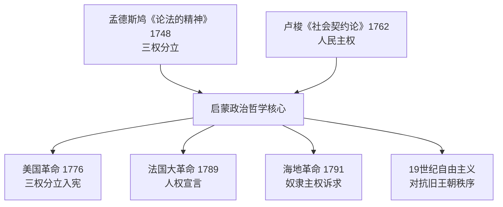

# Concept-Book Run

domain: /home/papagame/projects/digital-duck/conceptbook-app/public/domains/Users/200years_7powers_ch00/input/graph.yaml
target: enlightenment_philosophy_1748
started: 2026-09-28T02:47:43

## Teaching order (1 concepts)

- enlightenment_philosophy_1748

### enlightenment_philosophy_1748 (26.2s)

## Enlightenment Philosophy 1748

**定义**

启蒙哲学是17世纪末至18世纪欧洲思想家发展出的一整套关于理性、政府正当性与个人权利的学说。它挑战了"君权神授"的旧观念——即国王的统治权来自上帝、不受人民约束——转而主张政府的权力来自被统治者的理性同意，并应受到制度性约束。两部奠基性著作确立了这一学说的核心框架：孟德斯鸠（Montesquieu）1748年出版的《论法的精神》提出"三权分立"，主张立法权、行政权与司法权应分设于不同机构，彼此制衡，防止权力集中导致专制；卢梭（Jean-Jacques Rousseau）1762年出版的《社会契约论》则提出，合法政府的基础是"公意"（人民的共同意志），统治者的权力来自人民的授权契约，一旦政府违背这一契约，人民便有权推翻它。

**具体案例**

这些思想很快从书斋走向街头与议会。1787年美国制宪会议的代表们直接借鉴孟德斯鸠的分权理论，设计出国会（立法）、总统（行政）、最高法院（司法）三权分立、相互制衡的联邦政府架构——这一设计至今仍是美国宪法的骨架。1789年法国大革命爆发后，《人权宣言》第十六条写道："凡权利无保障、权力无分立的社会，就没有宪法可言"，几乎是对孟德斯鸠理论的直接呼应；而卢梭的"人民主权"思想则被革命者用来论证推翻路易十六统治的正当性。1791年爆发的海地革命更进一步：被奴役的黑人将"人人生而平等""主权在民"的启蒙语言，用来对抗其宣扬者自身未能实现的种族与阶级排斥，最终于1804年建立了世界上第一个由前奴隶建立的独立共和国。

**问题解决应用**

启蒙哲学的真正力量在于它提供了一套可操作的诊断工具：面对任何一个政治秩序，都可以追问"权力是否集中于一人或一个机构？""统治的正当性来自神授、世袭，还是来自被统治者的同意？"用这两个问题分析19世纪欧洲历次革命（1830年、1848年"民族之春"）会发现，凡是旧王朝拒绝分权、拒绝以宪法约束王权的地方（如奥地利哈布斯堡王朝、俄国沙皇专制），革命冲突就更为激烈持久；而英国通过1832年《改革法案》等渐进立宪改革吸纳了部分启蒙诉求，则避免了法国式的暴力革命。这正是启蒙哲学与19世纪"自由主义对抗旧王朝秩序"长期斗争之间的思想脉络。

*该图展示孟德斯鸠与卢梭的启蒙思想如何分别为分权制衡与人民主权提供理论依据，并共同催生了美、法、海地三场革命及此后一个世纪的自由主义运动。*

## Run complete

total: 29.4s
