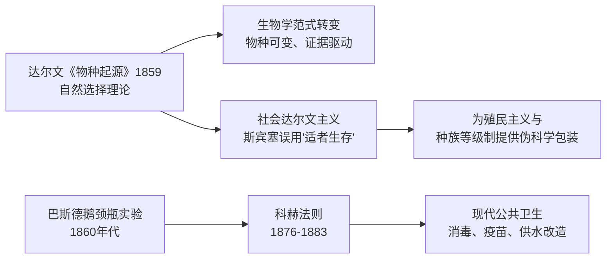
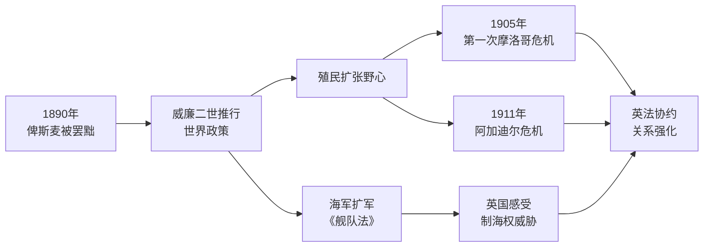
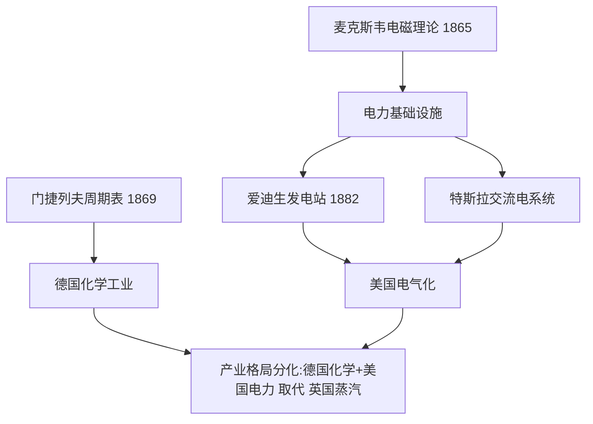

# Concept-Book Run

domain: /home/papagame/projects/digital-duck/conceptbook-app/public/domains/Users/200years_7powers_ch08/input/graph.yaml
target: science_electrification_shifts_power
started: 2026-09-28T02:47:46

## Teaching order (9 concepts)

- science_faraday_darwin_era
- german_unification_1871
- great_power_rivalry
- science_darwinism_and_germ_theory
- us_gilded_age
- germany_weltpolitik_rivalry
- science_electrification_and_chemistry
- us_industrial_rise
- science_electrification_shifts_power

### science_faraday_darwin_era (34.2s)

## 科学:法拉第与达尔文的时代

到1845年,三条日后重塑工业、医学与战争形态的科学线索已经埋下伏笔,但都尚未结出公开的果实。迈克尔·法拉第于1831年在英国皇家研究院发现电磁感应现象:变化的磁场能在导体中产生电流。这一发现被总结为法拉第电磁感应定律,即感应电动势等于磁通量变化率的负值:

$$\mathcal{E} = -\frac{d\Phi_B}{dt}$$

这条定律不是抽象的数学游戏,而是发电机与电动机的理论基础——没有它,后来的电气化产业无从谈起。与此同时,查尔斯·达尔文已于1836年结束"贝格尔号"环球考察,笔记本中记满了物种变异的证据,但他直到1859年才发表《物种起源》,中间沉默了二十余年,因为他清楚教会与学术界对"人由猿演化而来"这一结论会作何反应。化学方面,道尔顿1808年提出原子论,德贝莱纳1829年发现"三元素组"的规律性,为门捷列夫1869年绘出周期表打下地基;德国的染料与硫酸工业正是靠这些早期化学规律实现规模化生产。

三条线索有一个共同的历史规律:科学发现与其产业化、军事化应用之间往往存在二三十年的滞后期。法拉第1831年的实验室现象,要等到19世纪70年代爱迪生和西门子的发电机才转化为实际电力系统;达尔文的手稿要等社会舆论环境成熟才敢发表;德贝莱纳的化学观察要等门捷列夫系统化后才能指导工业合成。这个滞后期的长短,取决于三个可验证的历史条件:实验结果是否可重复(法拉第的感应现象很快被各国实验室复制)、社会接受度是否具备(达尔文案例)、以及是否存在能将理论转化为规模化产品的工程与资本体系(德国化学工业的例子)。分析任何一次科学突破何时才能改变国家实力对比时,应当逐一核对这三个条件,而不是假设发现本身自动等于国力增长。

### german_unification_1871 (19.9s)

## German Unification 1871

1871年1月18日,在凡尔赛宫的镜厅,普鲁士国王威廉一世被加冕为德意志帝国皇帝。这一幕本身就是精心设计的羞辱——地点选在法国王室的心脏地带,时间选在普法战争普鲁士大获全胜之后。三十多个德意志邦国(普鲁士、巴伐利亚、萨克森等)自此统一为一个中央集权的联邦帝国,首都柏林,实际权力掌握在"铁血宰相"俾斯麦手中。一夜之间,欧洲大陆出现了一个人口超过4100万、工业产值迅速逼近英国、拥有欧洲大陆最强陆军的新兴强权。

这一结果并非偶然,而是俾斯麦"铁血政策"三场局部战争的顶点:1864年普丹战争夺取石勒苏益格-荷尔斯泰因,1866年普奥战争(七周战争)击败奥地利并解散德意志邦联,1870至1871年普法战争则是决定性一战。普鲁士总参谋长毛奇利用铁路网实现兵力快速集结,在色当战役(1870年9月2日)围歼法军主力,俘虏法皇拿破仑三世本人,法军伤亡及被俘人数逾十万。战败的法国被迫签署《法兰克福条约》,割让阿尔萨斯和洛林,并赔款50亿法郎——这笔赔款后来成为德国工业化的启动资金之一,而阿尔萨斯-洛林的割让则在法国民众心中埋下复仇的种子,直接影响了四十余年后第一次世界大战的爆发逻辑。

从问题解决的角度看,理解德国统一的关键在于分析俾斯麦如何运用"外部战争制造内部认同"的策略:每一场对外战争都刻意保留有限目标,避免过早触发其他列强(尤其是俄、英)的联合干预,同时利用民族主义情绪压制德意志各邦内部的自由派和地方分离倾向。这也解释了为什么统一后的德意志帝国在宪法设计上刻意保留了普鲁士容克贵族对军队和外交的主导权,而议会(帝国议会)权力有限——这一结构性缺陷后来被历史学家视为魏玛共和国脆弱性乃至纳粹崛起的远因之一。

*该图展示俾斯麦通过三场局部战争逐步实现德意志统一的进程。*

德国统一彻底改变了欧洲大陆的力量格局:一个工业化、军事化、且怀有失地复仇之痛的法国,与一个新生但自信过剩的德意志帝国,从此长期对峙,为此后数十年的欧洲同盟体系与两次世界大战埋下了历史伏笔。

### great_power_rivalry (18.3s)

## Great Power Rivalry（列强竞争）

**定义**：列强竞争指19世纪末工业化国家之间围绕殖民地、资源与国际声望展开的系统性争夺。在这一体系下，一国的"强大"不再仅以本土经济或军事实力衡量，而是以其海外殖民地面积、贸易网络控制权和舰队规模作为核心指标。英国、法国、德国、俄国、美国、日本等工业强国将殖民扩张视为国家荣誉与安全的双重保障：殖民地既提供原材料与市场，也象征着一个国家在"文明等级"中的地位。这种心态直接催生了1880年代至1914年间的"新帝国主义"浪潮。

**实例分析**：最典型的案例是"非洲争夺战"（Scramble for Africa）。1870年时欧洲列强仅控制非洲约10%的领土；到1900年，这一比例飙升至90%以上。转折点是1884—1885年的柏林会议——14个欧洲国家（无一非洲代表参与）在此划定势力范围规则，确立"有效占领"原则。此后短短二十年内，法国占据西非与北非大片土地，英国建立起从开罗到开普敦的纵贯殖民带，德国、比利时、葡萄牙也各自瓜分领地。与此同时，英德两国在海军上展开军备竞赛：1898年后德国连续通过《舰队法》扩充公海舰队，英国则以"两强标准"（海军实力须超过任何两个潜在对手总和）回应，双方战列舰数量在1906至1914年间近乎翻倍增长。

**问题解决应用**：理解列强竞争的关键在于识别其自我强化机制——一国的扩张被其他国家解读为威胁，从而触发对等或超额的军备与殖民投入，形成螺旋式升级。分析具体历史事件时，可提出三个诊断性问题：(1) 该行动的直接经济或战略动机是什么（原材料、海军基地、贸易航线）？(2) 竞争对手如何解读并回应此举？(3) 是否存在既有外交机制（如会议、条约）来缓解而非激化冲突？以柏林会议为例，它虽然避免了欧洲列强在非洲问题上直接开战，却未能解决深层竞争逻辑，这种"管理冲突而非消除冲突"的模式，正是理解1914年危机为何最终失控的重要线索。

### science_darwinism_and_germ_theory (21.5s)

## Science Darwinism And Germ Theory

1859年，达尔文出版《物种起源》，提出以自然选择为机制的进化论:环境资源有限，个体间存在可遗传的性状差异，具有生存和繁殖优势的性状会在种群中逐代累积。这一理论推翻了物种固定不变、由神创论解释生物多样性的传统观念，将生物学纳入基于证据和推理的自然科学体系。几乎同一时期，医学领域发生了同样深刻的范式转变。1860年代，法国化学家巴斯德通过著名的鹅颈瓶实验，证伪了"微生物自然发生"的旧观念，证明发酵和腐败由环境中已存在的微生物引起。德国医生科赫在此基础上更进一步，于1876年确认炭疽杆菌是炭疽病的病原体，随后在1882年分离出结核杆菌、1883年分离出霍乱弧菌，并提出了判定病原体与疾病因果关系的"科赫法则"。这两条看似独立的探索路径——生物如何演化、疾病为何发生——共同确立了一种新的知识生产方式:通过可重复的观察与实验，而非权威或教条，来解释自然现象。

科赫法则本身就是一个可操作的问题解决框架，至今仍是微生物学诊断的基石，值得具体拆解。该法则包含四个步骤:第一，特定病原体必须在患病个体中大量存在，而在健康个体中不存在；第二，该病原体须能从患病个体中分离并进行纯培养；第三，将纯培养的病原体接种到健康且易感的个体后，应引发同样的疾病；第四，从被人工感染的个体中，须能重新分离出同一病原体。19世纪的医生若怀疑某疾病由细菌引起，可依此四步逐一验证，将模糊的临床猜测转化为可检验、可证伪的结论——这正是达尔文和巴斯德所共享的实证方法论在公共卫生领域的具体应用。这套方法直接催生了现代公共卫生实践:消毒手术（李斯特，1867年起推广石炭酸消毒法）、疫苗接种（巴斯德1885年狂犬病疫苗）、城市供水与排污系统改造，使欧美主要城市的传染病死亡率在19世纪末大幅下降。

然而，进化论的"适者生存"概念很快被滥用于科学之外的领域。英国哲学家斯宾塞将"适者生存"一词移植到社会分析中，提出所谓"社会达尔文主义"，主张人类社会与生物种群一样存在优胜劣汰，贫困、疾病和殖民地人口的边缘化不过是"自然选择"的社会体现。这一论调被19世纪末至20世纪初的欧美帝国主义者、种族理论家广泛借用，为殖民扩张、种族等级制度乃至后来的优生学运动提供伪科学包装——将达尔文描述物种演化机制的生物学理论，错误地挪用为证成社会不平等和种族压迫的意识形态工具。这一误用提醒我们:科学发现的传播过程中，其原始含义常被政治与意识形态目的重新诠释乃至扭曲。

*该图展示达尔文进化论与巴斯德、科赫的细菌学说如何分别推动现代医学的诞生，以及"适者生存"概念如何被扭曲挪用为社会达尔文主义、服务于帝国主义意识形态。*

### us_gilded_age (21.7s)

## Us Gilded Age

**定义**

镀金时代（Gilded Age）指1870年至1890年间美国经历的工业化狂飙期。这一名称出自马克·吐温1873年的同名小说，讽刺当时社会表面繁荣光鲜、内里贫富悬殊与腐败丛生。这段时期的核心特征是铁路网络的爆炸式扩张、钢铁与石油产业的垄断化，以及一批被称为"强盗大亨"（Robber Barons）的企业家——如安德鲁·卡内基（钢铁）、约翰·D·洛克菲勒（石油）、科尼利尔斯·范德比尔特（铁路）——通过兼并、压价竞争和政治游说迅速积累巨额财富。政府在这一阶段奉行自由放任（laissez-faire）政策，几乎不对企业垄断和劳工待遇进行干预，这既释放了资本扩张的能量，也埋下了后续劳资冲突与反垄断立法的伏笔。

**具体案例**

铁路是这一时期最直观的证据。美国铁路总里程从1870年的约5.3万英里增长到1890年的约16.3万英里，增幅超过三倍；1869年首条横贯大陆铁路通车后，全国市场被首次真正连成一体，原料运输成本大幅下降。与此同时，卡内基钢铁公司凭借"垂直整合"模式（自建矿山、炼焦厂、运输船队），到1890年时美国钢产量已超越英国，成为世界第一产钢国；洛克菲勒的标准石油公司则通过收购竞争对手，到1880年代控制了全美约90%的炼油能力。这些企业既提供了廉价的钢铁与燃料，为后续的城市化和第二次工业革命奠定基础，也造成了工人日工作12小时以上、童工普遍、1877年铁路大罢工等尖锐的劳资矛盾。

**分析应用**

评估镀金时代的历史意义时，应区分"经济基础的形成"与"社会代价"两条并行的因果链：一方面，铁路网络与钢铁产能的积累，直接构成了1890年代后美国工业总产值超越英、德、法三国总和的物质基础，这是美国崛起为世界强国的关键一步；另一方面，财富集中催生的社会矛盾（如1892年霍姆斯特德罢工、1894年普尔曼罢工）又反过来推动了1890年代后的进步主义改革与《谢尔曼反托拉斯法》（1890年）的出台。理解这段历史时，应把"经济增长的规模"与"增长的分配方式"作为两个独立却相互作用的变量分别考察，而非简单地以GDP增长掩盖社会代价，或以劳资冲突否定工业化的战略价值。

### germany_weltpolitik_rivalry (27.8s)

## Germany Weltpolitik Rivalry

**定义**

1890年,年轻的德皇威廉二世罢黜了老练的首相俾斯麦,德国外交政策随之发生根本转向。俾斯麦时代的核心原则是"克制"——德国已是欧洲大陆最强的国家,无需再谋求更多,只需通过复杂的同盟体系(如三皇同盟、再保险条约)防止法国复仇、避免两线作战。威廉二世抛弃了这一逻辑,转而推行"世界政策"(Weltpolitik):德国不再满足于欧陆强国的地位,而要求获得与英、法平起平坐的全球殖民帝国和海外市场,并将建立一支足以挑战英国皇家海军的远洋舰队,视为"阳光下的地盘"(俾斯麦所讥讽的"place in the sun")的必要条件。这一政策由海军大臣提尔皮茨主导,自1898年起连续通过多部《舰队法》,推动德国海军规模系统性扩张。世界政策的问题在于,它同时触碰了英国的两条核心利益线——制海权与殖民版图——而不像俾斯麦时代那样只在欧陆内部谋求平衡,因此几乎必然把英国推向法国和俄国一边。

**具体案例**

摩洛哥危机集中体现了这一政策的后果。1905年,威廉二世突访丹吉尔,公开支持摩洛哥"独立",实质是试探并企图拆散刚缔结一年的英法协约(1904年"挚诚协定");结果却适得其反——1906年阿尔赫西拉斯会议上,除奥匈外几乎所有列强都站在法国一边,德国反而陷入外交孤立。1911年"豹"号炮舰事件中,德国派军舰驶入摩洛哥阿加迪尔港,以武力威胁换取殖民补偿,英国外交大臣公开警告德国不得挑战英国利益,危机再度以德国让步(换取部分刚果领土)收场。两次危机没有为德国换来实质利益,却使英法协约在军事上逐步具体化,并促使英国海军部加快战备。

**分析应用**

评估任何大国转向"扩张性对外政策"能否成功,可以用以下方法:列出该政策直接威胁到的每一个既有大国的具体利益(殖民地、海权、势力范围),再逐一核对该大国是否因此被推向对立阵营。用此方法审视世界政策可发现:海军扩张威胁英国制海权,殖民要求触及英法两国既得殖民利益,而巴格达铁路计划又触及俄国在近东的利益——德国几乎同时得罪了未来协约国的全部三方,这正是俾斯麦式"分而治之"外交与威廉二世式"四面出击"外交的根本差异,也是第一次世界大战前同盟阵营固化的关键成因之一。

*该图展示威廉二世罢黜俾斯麦后,世界政策如何通过海军扩军与两次摩洛哥危机,不断将英国推向法国一方,强化协约国阵营。*

### science_electrification_and_chemistry (18.1s)

## Science Electrification And Chemistry

1865年至1895年间，科学从抽象理论迅速转化为改变城市面貌与产业格局的现实力量,这一时期标志着第二次工业革命的真正起点。英国物理学家麦克斯韦于1865年发表电磁场方程组,首次用统一的数学语言证明电与磁本质上是同一种力的两种表现,并预言了电磁波的存在——这一预言在二十多年后被赫兹用实验证实,为后来的无线电通信奠定了理论基础。几乎同时,俄国化学家门捷列夫于1869年发布元素周期表,按原子量与化学性质将已知元素系统排列,其大胆之处在于为尚未发现的元素预留空位并预测其性质,后续镓、锗等元素的发现精确印证了这些预测,使化学从经验分类学科转变为具有预测能力的系统科学。

理论突破很快被转化为工业应用。1876年贝尔发明电话,使远距离即时语音通信成为可能,彻底改变了商业与社会联络方式。1882年爱迪生在纽约珍珠街建成世界上第一座商用发电站,采用直流电为曼哈顿下城约85户用户供电照明,标志着电力从实验室走向城市基础设施。随后,特斯拉与西屋公司力推交流电系统,凭借其可远距离低损耗输电的优势,在1893年芝加哥世博会与1896年尼亚加拉水电站项目中战胜爱迪生的直流方案,史称"电流之战",最终奠定了现代电网的技术路线。

这一时期的产业分化具有深远的地缘经济意义:英国仍依赖第一次工业革命的蒸汽动力与纺织业优势,而德国凭借强大的化学工业(如巴斯夫、拜耳等企业在染料、化肥领域的突破)与系统化的技术教育体系迅速崛起,美国则依托丰富资源与爱迪生、特斯拉等人的电气发明建立起全国性电力基础设施。到1900年,德国化学品出口已占全球近三分之二,美国发电量迅速超越英国,两国由此在新兴产业上实现对老牌工业国英国的赶超,预示了二十世纪工业与国力格局的根本转变。

*该图展示了1865–1895年间科学理论突破如何经由技术应用,推动德国与美国在化学与电力产业上超越英国,重塑第二次工业革命的国家竞争格局。*

### us_industrial_rise (20.8s)

## Us Industrial Rise

**概念定义**：19世纪末，美国经历了历史上最迅猛的工业化进程。从1865年南北战争结束到1900年,美国制造业产值增长近七倍,超越英国成为世界第一工业强国。这一转变的关键节点是1890年美国人口普查局宣布"边疆线"（frontier line）已经消失——即已找不到人口密度低于每平方英里两人的连续无人区。这一宣告标志着持续三个世纪的大陆扩张走到终点,美国的战略视野开始从"向西"转向"向外"。

**具体案例**：钢铁产量是衡量工业实力最直观的指标。1870年,美国钢产量仅为7万吨,落后于英国的22万吨;到1900年,美国钢产量猛增至1000多万吨,是英国的两倍以上。安德鲁·卡内基的卡内基钢铁公司正是这一时期崛起,到1901年被摩根收购组建美国钢铁公司时,后者已是全球最大企业,资本总额达14亿美元。与此同时,铁路里程从1865年的3.5万英里扩展到1900年的19万英里,把全国市场连成一体,也让原材料与商品得以高效流通。历史学家弗雷德里克·特纳在1893年发表的《边疆在美国历史上的重要性》一文中指出,边疆的持续存在曾塑造了美国的民主精神与个人主义,而边疆的消失意味着这一"安全阀"不复存在——过剩的工业产能、资本与人口不能再向西部释放,必然要寻找新的出口。

**分析应用**：把工业崛起与边疆终结这两条线索放在一起看,可以解释1890年代后美国对外政策的转向:企业界需要海外市场消化过剩产品与资本(如1893年经济危机后棉纺织业急需出口渠道),海军战略家马汉主张建设远洋海军以保护贸易航线,而政治精英则借用"天定命运"的旧话语为新的海外扩张寻找合法性。这三股力量的汇合,直接导致了此后对夏威夷、古巴、菲律宾等地的介入。

*该图展示美国工业崛起与边疆终结如何共同推动战略重心从大陆扩张转向海外扩张。*

### science_electrification_shifts_power (23.5s)

## Science Electrification Shifts Power

**定义**

第二次工业革命（约1870年代至1900年代）以电力技术与化学工业为核心——发电机、电动机、电报电话网络、合成染料与化肥、内燃机等——区别于第一次工业革命以蒸汽机、纺织机械和煤铁为核心的技术组合。关键的历史事实是：这一轮新技术的产业中心并未继续留在率先完成第一次工业革命的英国，而是转移到了德国和美国。这种"科学链"（即支撑新技术的基础科学研究——电磁学、有机化学——及其人才培养体系）重心的转移，与德国、美国在世界工业产出份额上超越英国，在时间上是同步发生的。这里记录的是三条链（科学、美国、德国）共同显示出的一个时间重合现象，而非断言前者是后者的单一原因。

**实例分析**

数据说明了转移的规模：1870年英国仍占世界制造业产出约32%，美国约23%，德国约13%；到1913年，美国已跃升至约36%，德国约16%，英国降至约14%（据保罗·肯尼迪《大国的兴衰》所引之刘易斯数据整理）。与此同时，德国在电力与化学工业上建立起明显优势——西门子公司（创立于1847年）与AEG主导欧洲电气设备市场；德国化学工业到1900年生产全世界约90%的合成染料，其巴斯夫、拜耳、赫斯特三大公司皆脱胎于对苯胺染料的研究。美国则在爱迪生、特斯拉、威斯汀豪斯的电力系统竞争与福特的流水线生产中，将电气化与规模化制造结合。英国的煤铁蒸汽技术体系在19世纪中叶举世无双，但到电气化时代，其大学体系对应用科学与工程教育的投入远逊于德国的工科大学（Technische Hochschule）体系与美国赠地大学（land-grant university）体系——后两者恰恰是电力与化学新科学得以迅速转化为工业产能的人才基础。

**应用与思考**

面对"英国为何未能延续领先"这一问题，恰当的历史推理方式不是寻找单一原因，而是检验并列证据链之间的时间关系与可能的传导机制：新科学人才培养体系（教育制度）→新技术产业化（电气、化学公司）→产出份额变化，这一序列在德国和美国均可追溯，而在英国则出现断层。这提示我们，评估一个大国工业地位的可持续性时，应追踪其基础科学与工程教育投入是否与其现有产业体系保持同步更新，而非仅看当下的产出规模。

*该图展示科学重心转移、教育体系与工业产出份额变化之间的时间同步关系，而非单向因果断言。*

## Run complete

total: 234.9s
