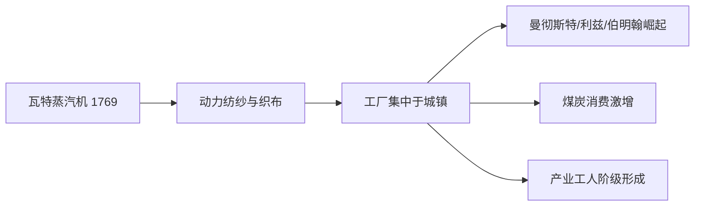

# Concept-Book Run

domain: /home/papagame/projects/digital-duck/conceptbook-app/public/domains/Users/200years_7powers_ch00/input/graph.yaml
target: stockton_darlington_railway_1825
started: 2026-09-28T02:50:08

## Teaching order (4 concepts)

- agri_rev_1740s
- watt_steam_engine_1769
- mechanized_textile_mills_1785
- stockton_darlington_railway_1825

### agri_rev_1740s (0.8s)

## Agri Rev 1740S

农业革命指1740年代至1780年代英国农业生产方式的根本性转变,核心是圈地运动与诺福克四轮轮作制的推广。中世纪以来,英格兰乡村长期实行敞田制:农户在无篱笆分隔的公共条田上分散耕作,休耕地占比高,产量有限。18世纪中期起,议会陆续通过圈地法案,授权地主合并零散地块、用篱笆或石墙围起私有农场,取消农民在公地放牧、拾柴的传统权利。据统计,1750年至1820年间英国议会通过的圈地法案近四千项,涉及地约七百万英亩,约占英格兰可耕地的五分之一。与此同时,诺福克郡的查尔斯·汤森德(人称"萝卜汤森德")系统推广小麦、萝卜、大麦、三叶草的四作物轮种,以萝卜和三叶草取代休耕:三叶草固氮肥田,萝卜则提供冬季饲料,使牲畜得以安然越冬,粪肥又反哺土壤,形成良性循环。

莱斯特郡的育种家罗伯特·贝克韦尔进一步把这套系统推向极致。他不再让牲畜随意交配,而是有目的地挑选生长快、产肉多的个体进行选择性育种,培育出迪什利羊与朗霍恩牛。据当时伦敦史密斯菲尔德市场的记录,18世纪初到18世纪末,出售的绵羊平均体重约从28磅增至80磅,牛的平均体重也大致翻倍——同样的草场,能养出多得多的肉。

这些变革叠加的结果,是用更少的人产出更多的粮食。18世纪初,英格兰约四分之三的人口以务农为生;到1800年前后,这一比例降至三分之一左右。圈地又同时切断了贫农对公地的依赖,许多失去土地使用权的农户不得不离开乡村。于是,农业效率的提升与农村生计的瓦解共同作用,把大量原本被土地束缚的劳动力"挤"向了曼彻斯特、伯明翰等新兴工业城市。没有这一波悄无声息的农业变革,就不会有足够的、可自由流动的劳动力去填满蒸汽机驱动的工厂——这正是本章其余每一条技术与制度线索得以成立的隐藏前提。

### watt_steam_engine_1769 (0.8s)

## Watt Steam Engine 1769

**定义**：1769年，苏格兰工程师詹姆斯·瓦特为纽科门蒸汽机申请了一项关键专利——分离式冷凝器。纽科门机在气缸内交替注入蒸汽再喷冷水冷凝，导致气缸本身反复冷热循环，浪费了约四分之三的燃料。瓦特把冷凝过程移到一个独立的密闭容器中，使气缸始终保持高温、冷凝器始终保持低温，燃料效率因此提高了两三倍以上。这项改进随后与太阳-行星齿轮、离心调速器等专利结合，使蒸汽机从只能做往复直线运动的矿井抽水泵，变成能输出稳定旋转动力的通用动力源。

**应用实例**：改良前，纽科门机主要用于英格兰和康沃尔的煤矿、锡矿排水,笨重、耗煤、效率低,几乎无法离开矿区,因为运煤成本太高。瓦特与实业家马修·博尔顿合作,在伯明翰的索霍工厂批量生产改良蒸汽机,到1800年英国已安装约2500台瓦特式蒸汽机。这些机器被安装进曼彻斯特的棉纺厂、设菲尔德的锻造车间,不再依赖河流水力选址,工厂第一次可以建在原料和劳动力聚集的城市里。1804年,理查德·特里维西克进一步把高压蒸汽机装上轮轨,催生了早期蒸汽机车,为半个世纪后的铁路网奠定了技术基础。

**问题解决与历史推理**：把瓦特蒸汽机放进更长的因果链中分析,能帮助理解"技术突破为何在某一时刻、某一地点发生"这一历史问题。18世纪40年代的农业革命(诺福克轮作制、圈地运动)提高了单位农业劳动力的产出,释放出大量剩余劳动力涌入城镇,形成了工厂愿意雇佣的廉价劳动力池;与此同时,英国煤炭储量丰富、专利制度保护发明者收益、政府尚未对新兴产业设限,三者共同构成了蒸汽机能够迅速商业化的制度与资源条件。练习:比较同一时期法国和中国是否具备类似的剩余劳动力和资源条件,可以帮助解释为何工业革命率先发生在英国,而非当时人口更多、手工业同样发达的其他地区——这正是历史分析中"必要条件"与"充分条件"的区别所在。

### mechanized_textile_mills_1785 (2.0s)

## Mechanized Textile Mills 1785

**定义**

1785年前后，英国纺织业完成了从家庭手工生产到工厂集中生产的转变。这一转变依赖三项关键技术的组合：詹姆斯·哈格里夫斯发明的"珍妮纺纱机"（Spinning Jenny，1764年）大幅提高了单人纺纱的产量；理查德·阿克莱特的"水力纺纱机"（Water Frame，1769年）首次实现了纺纱的机械化连续作业；埃德蒙·卡特赖特于1785年获得专利的"动力织布机"（Power Loom）则把织布环节也纳入了机械动力驱动。真正使这套系统摆脱地理限制的，是瓦特改良蒸汽机（见"瓦特蒸汽机 1769"）提供的稳定动力——工厂不再需要建在河流旁边，而可以集中建在煤炭和劳动力丰富的城镇。曼彻斯特、利兹、伯明翰因此迅速崛起为工业重镇，英国也由此成为世界上第一个工业化经济体。

**具体案例**

以曼彻斯特为例：1774年，全城仅有2家棉纺工厂；到1802年，这一数字已增至52家。棉纺织品产量的爆炸式增长伴随着煤炭消费的同步激增——英国煤炭年产量从1700年的约260万吨，上升到1800年的约1000万吨，绝大部分增量来自为纺织工厂和相关蒸汽机供能。与此同时，工厂制度催生了一个全新的社会阶层：城市产业工人阶级。工人不再像手工业时代那样在自家作坊按自己的节奏劳作，而是必须服从工厂的机器运转时刻表，通常每天工作12至14小时，包括大量童工。1819年英国议会通过的《棉纺织工厂法》正是对这种劳动条件恶化的初步回应，规定禁止雇佣9岁以下童工——这本身就说明了问题的严重程度。

**问题解决应用**

理解这一概念的关键，在于分析"技术集中"如何同时决定了经济地理和社会结构。设想一道历史分析题：为什么工业革命最先在英国而非法国或荷兰发生？答案不能仅归因于某一项发明，而要看到技术、能源与资本的耦合——英国恰好同时具备可开采的浅层煤矿、活跃的专利保护制度、以及愿意为工厂建设提供信贷的商业资本市场。这种多因素同时具备的组合，正是历史比较分析的核心方法：不是寻找单一原因，而是检验哪些必要条件在某一地区恰好同时齐备。

*该图展示瓦特蒸汽机如何驱动纺织业机械化，进而引发工厂选址集中、煤炭需求上升与新兴工人阶级三重连锁效应。*

### stockton_darlington_railway_1825 (21.4s)

## Stockton Darlington Railway 1825

**定义**

1825年9月27日，英国工程师乔治·斯蒂芬森（George Stephenson）设计的"旅行号"（Locomotion No. 1）机车牵引一列载有乘客与货物的列车，从达灵顿驶向斯托克顿，全程约40公里。这是世界上第一条使用蒸汽机车牵引、向公众开放运营的铁路——斯托克顿至达灵顿铁路。它的历史意义不在于"第一条铁路"（此前已有马拉轨道运煤），而在于首次证明：蒸汽机车牵引的公共运输在商业上是可行的，能够稳定、经济地运送煤炭、货物乃至旅客。

**具体案例**

这条铁路最初的设计目的很朴素——把达灵顿附近矿区的煤炭更高效地运到蒂斯河畔的斯托克顿港口装船外运。此前依靠马车运煤，成本高、速度慢、运量有限。斯蒂芬森说服投资人，用蒸汽机车替代马匹牵引，是一次巨大的技术冒险，因为此前蒸汽机车主要用于矿场内部短距离拖运，从未在如此长的公共线路上运营过。通车当天，机车牵引的列车载重超过80吨，时速约15公里，远超马车运输效率，证明了铁路运输在成本和速度上的双重优势。

**问题解决/应用**

斯托克顿至达灵顿铁路的成功，直接刺激了后续更具雄心的工程——1830年通车的利物浦至曼彻斯特铁路，进一步证明铁路不仅能运煤，也能高速运送工业原料、成品与旅客，从而把分散的工业城镇整合进统一的国家经济网络。这一效应可以用真实数据衡量：从1825年这一条约40公里的实验线路开始，到1845年，英国铁路总里程已达到约2000英里（约3200公里），铁路建设进入被称为"铁路热"（Railway Mania）的爆发期，大量资本涌入铁路股票和新线路建设。铁路网络的扩张与曼彻斯特棉纺织工业（见"机械化纺织厂1785"）形成了紧密的因果链条：机械化生产提高了原料与成品的运输需求，而铁路则大幅压缩了运输时间与成本，使原料供应、生产、销售能够在更大地理范围内高效协同，最终把英国从若干相对独立的工业区，编织成一个高度联动的全国性工业经济体。

## Run complete

total: 30.3s
