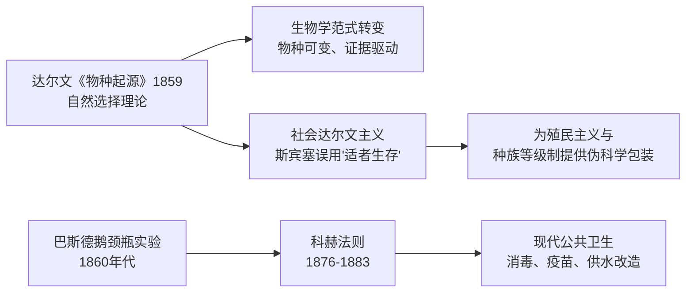
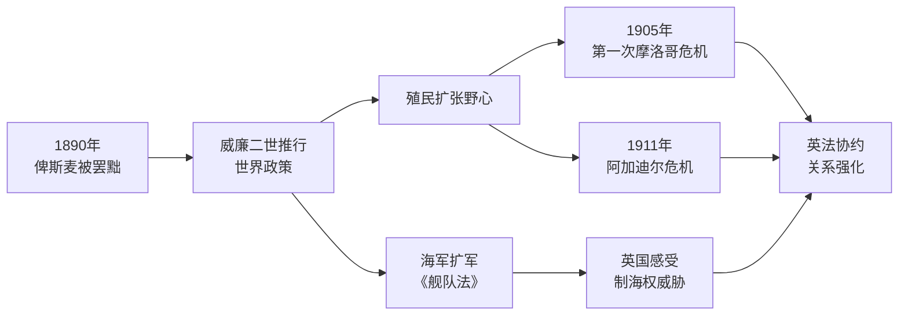
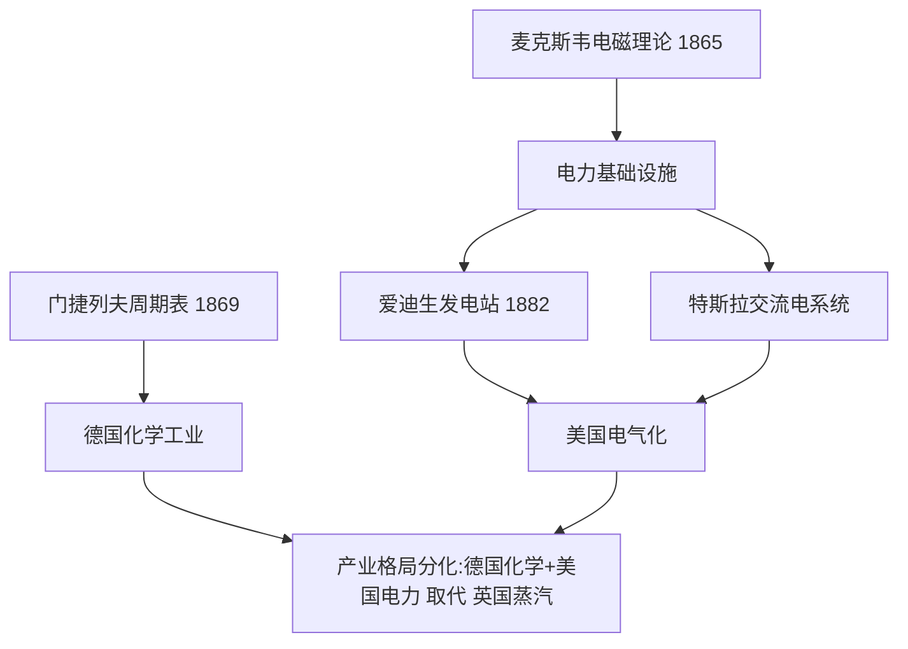
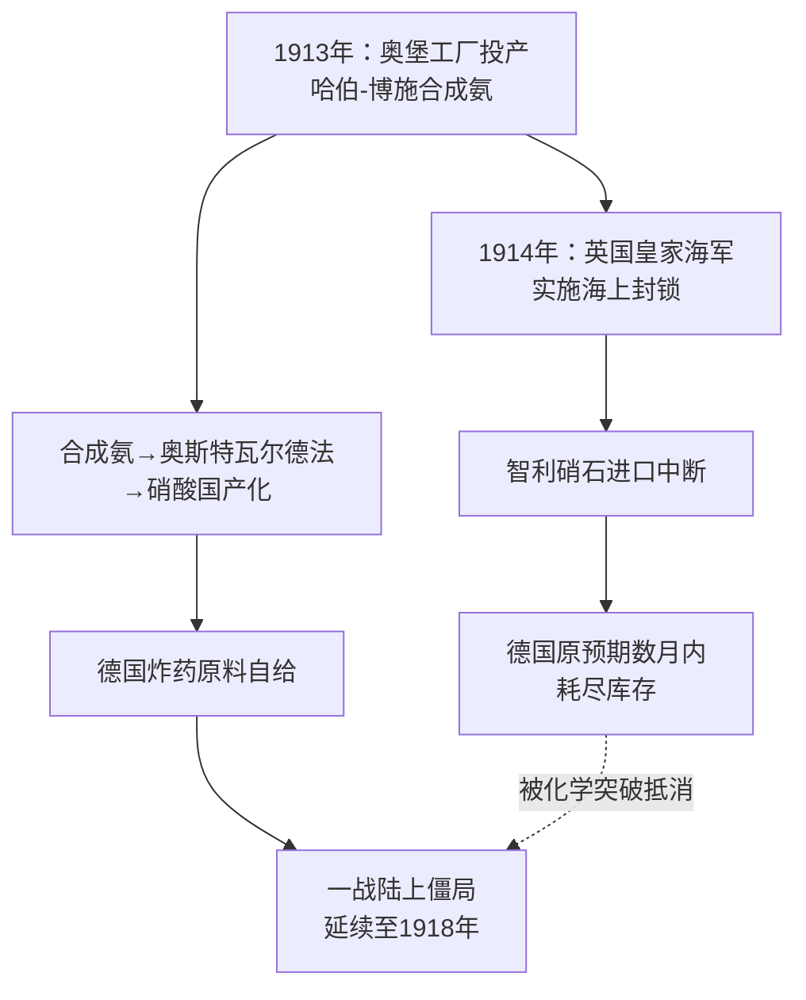

# Concept-Book Run

domain: /home/papagame/projects/digital-duck/conceptbook-app/public/domains/Users/200years_7powers_ch08/input/graph.yaml
target: science_haber_bosch_and_wwi_length
started: 2026-09-28T02:51:43

## Teaching order (9 concepts)

- science_faraday_darwin_era
- german_unification_1871
- great_power_rivalry
- science_darwinism_and_germ_theory
- germany_weltpolitik_rivalry
- science_electrification_and_chemistry
- germany_wwi_defeat
- science_haber_bosch_and_aviation
- science_haber_bosch_and_wwi_length

### science_faraday_darwin_era (1.1s)

## 科学:法拉第与达尔文的时代

到1845年,三条日后重塑工业、医学与战争形态的科学线索已经埋下伏笔,但都尚未结出公开的果实。迈克尔·法拉第于1831年在英国皇家研究院发现电磁感应现象:变化的磁场能在导体中产生电流。这一发现被总结为法拉第电磁感应定律,即感应电动势等于磁通量变化率的负值:

$$\mathcal{E} = -\frac{d\Phi_B}{dt}$$

这条定律不是抽象的数学游戏,而是发电机与电动机的理论基础——没有它,后来的电气化产业无从谈起。与此同时,查尔斯·达尔文已于1836年结束"贝格尔号"环球考察,笔记本中记满了物种变异的证据,但他直到1859年才发表《物种起源》,中间沉默了二十余年,因为他清楚教会与学术界对"人由猿演化而来"这一结论会作何反应。化学方面,道尔顿1808年提出原子论,德贝莱纳1829年发现"三元素组"的规律性,为门捷列夫1869年绘出周期表打下地基;德国的染料与硫酸工业正是靠这些早期化学规律实现规模化生产。

三条线索有一个共同的历史规律:科学发现与其产业化、军事化应用之间往往存在二三十年的滞后期。法拉第1831年的实验室现象,要等到19世纪70年代爱迪生和西门子的发电机才转化为实际电力系统;达尔文的手稿要等社会舆论环境成熟才敢发表;德贝莱纳的化学观察要等门捷列夫系统化后才能指导工业合成。这个滞后期的长短,取决于三个可验证的历史条件:实验结果是否可重复(法拉第的感应现象很快被各国实验室复制)、社会接受度是否具备(达尔文案例)、以及是否存在能将理论转化为规模化产品的工程与资本体系(德国化学工业的例子)。分析任何一次科学突破何时才能改变国家实力对比时,应当逐一核对这三个条件,而不是假设发现本身自动等于国力增长。

### german_unification_1871 (1.7s)

## German Unification 1871

1871年1月18日,在凡尔赛宫的镜厅,普鲁士国王威廉一世被加冕为德意志帝国皇帝。这一幕本身就是精心设计的羞辱——地点选在法国王室的心脏地带,时间选在普法战争普鲁士大获全胜之后。三十多个德意志邦国(普鲁士、巴伐利亚、萨克森等)自此统一为一个中央集权的联邦帝国,首都柏林,实际权力掌握在"铁血宰相"俾斯麦手中。一夜之间,欧洲大陆出现了一个人口超过4100万、工业产值迅速逼近英国、拥有欧洲大陆最强陆军的新兴强权。

这一结果并非偶然,而是俾斯麦"铁血政策"三场局部战争的顶点:1864年普丹战争夺取石勒苏益格-荷尔斯泰因,1866年普奥战争(七周战争)击败奥地利并解散德意志邦联,1870至1871年普法战争则是决定性一战。普鲁士总参谋长毛奇利用铁路网实现兵力快速集结,在色当战役(1870年9月2日)围歼法军主力,俘虏法皇拿破仑三世本人,法军伤亡及被俘人数逾十万。战败的法国被迫签署《法兰克福条约》,割让阿尔萨斯和洛林,并赔款50亿法郎——这笔赔款后来成为德国工业化的启动资金之一,而阿尔萨斯-洛林的割让则在法国民众心中埋下复仇的种子,直接影响了四十余年后第一次世界大战的爆发逻辑。

从问题解决的角度看,理解德国统一的关键在于分析俾斯麦如何运用"外部战争制造内部认同"的策略:每一场对外战争都刻意保留有限目标,避免过早触发其他列强(尤其是俄、英)的联合干预,同时利用民族主义情绪压制德意志各邦内部的自由派和地方分离倾向。这也解释了为什么统一后的德意志帝国在宪法设计上刻意保留了普鲁士容克贵族对军队和外交的主导权,而议会(帝国议会)权力有限——这一结构性缺陷后来被历史学家视为魏玛共和国脆弱性乃至纳粹崛起的远因之一。

*该图展示俾斯麦通过三场局部战争逐步实现德意志统一的进程。*

德国统一彻底改变了欧洲大陆的力量格局:一个工业化、军事化、且怀有失地复仇之痛的法国,与一个新生但自信过剩的德意志帝国,从此长期对峙,为此后数十年的欧洲同盟体系与两次世界大战埋下了历史伏笔。

### great_power_rivalry (2.4s)

## Great Power Rivalry（列强竞争）

**定义**：列强竞争指19世纪末工业化国家之间围绕殖民地、资源与国际声望展开的系统性争夺。在这一体系下，一国的"强大"不再仅以本土经济或军事实力衡量，而是以其海外殖民地面积、贸易网络控制权和舰队规模作为核心指标。英国、法国、德国、俄国、美国、日本等工业强国将殖民扩张视为国家荣誉与安全的双重保障：殖民地既提供原材料与市场，也象征着一个国家在"文明等级"中的地位。这种心态直接催生了1880年代至1914年间的"新帝国主义"浪潮。

**实例分析**：最典型的案例是"非洲争夺战"（Scramble for Africa）。1870年时欧洲列强仅控制非洲约10%的领土；到1900年，这一比例飙升至90%以上。转折点是1884—1885年的柏林会议——14个欧洲国家（无一非洲代表参与）在此划定势力范围规则，确立"有效占领"原则。此后短短二十年内，法国占据西非与北非大片土地，英国建立起从开罗到开普敦的纵贯殖民带，德国、比利时、葡萄牙也各自瓜分领地。与此同时，英德两国在海军上展开军备竞赛：1898年后德国连续通过《舰队法》扩充公海舰队，英国则以"两强标准"（海军实力须超过任何两个潜在对手总和）回应，双方战列舰数量在1906至1914年间近乎翻倍增长。

**问题解决应用**：理解列强竞争的关键在于识别其自我强化机制——一国的扩张被其他国家解读为威胁，从而触发对等或超额的军备与殖民投入，形成螺旋式升级。分析具体历史事件时，可提出三个诊断性问题：(1) 该行动的直接经济或战略动机是什么（原材料、海军基地、贸易航线）？(2) 竞争对手如何解读并回应此举？(3) 是否存在既有外交机制（如会议、条约）来缓解而非激化冲突？以柏林会议为例，它虽然避免了欧洲列强在非洲问题上直接开战，却未能解决深层竞争逻辑，这种"管理冲突而非消除冲突"的模式，正是理解1914年危机为何最终失控的重要线索。

### science_darwinism_and_germ_theory (1.6s)

## Science Darwinism And Germ Theory

1859年，达尔文出版《物种起源》，提出以自然选择为机制的进化论:环境资源有限，个体间存在可遗传的性状差异，具有生存和繁殖优势的性状会在种群中逐代累积。这一理论推翻了物种固定不变、由神创论解释生物多样性的传统观念，将生物学纳入基于证据和推理的自然科学体系。几乎同一时期，医学领域发生了同样深刻的范式转变。1860年代，法国化学家巴斯德通过著名的鹅颈瓶实验，证伪了"微生物自然发生"的旧观念，证明发酵和腐败由环境中已存在的微生物引起。德国医生科赫在此基础上更进一步，于1876年确认炭疽杆菌是炭疽病的病原体，随后在1882年分离出结核杆菌、1883年分离出霍乱弧菌，并提出了判定病原体与疾病因果关系的"科赫法则"。这两条看似独立的探索路径——生物如何演化、疾病为何发生——共同确立了一种新的知识生产方式:通过可重复的观察与实验，而非权威或教条，来解释自然现象。

科赫法则本身就是一个可操作的问题解决框架，至今仍是微生物学诊断的基石，值得具体拆解。该法则包含四个步骤:第一，特定病原体必须在患病个体中大量存在，而在健康个体中不存在；第二，该病原体须能从患病个体中分离并进行纯培养；第三，将纯培养的病原体接种到健康且易感的个体后，应引发同样的疾病；第四，从被人工感染的个体中，须能重新分离出同一病原体。19世纪的医生若怀疑某疾病由细菌引起，可依此四步逐一验证，将模糊的临床猜测转化为可检验、可证伪的结论——这正是达尔文和巴斯德所共享的实证方法论在公共卫生领域的具体应用。这套方法直接催生了现代公共卫生实践:消毒手术（李斯特，1867年起推广石炭酸消毒法）、疫苗接种（巴斯德1885年狂犬病疫苗）、城市供水与排污系统改造，使欧美主要城市的传染病死亡率在19世纪末大幅下降。

然而，进化论的"适者生存"概念很快被滥用于科学之外的领域。英国哲学家斯宾塞将"适者生存"一词移植到社会分析中，提出所谓"社会达尔文主义"，主张人类社会与生物种群一样存在优胜劣汰，贫困、疾病和殖民地人口的边缘化不过是"自然选择"的社会体现。这一论调被19世纪末至20世纪初的欧美帝国主义者、种族理论家广泛借用，为殖民扩张、种族等级制度乃至后来的优生学运动提供伪科学包装——将达尔文描述物种演化机制的生物学理论，错误地挪用为证成社会不平等和种族压迫的意识形态工具。这一误用提醒我们:科学发现的传播过程中，其原始含义常被政治与意识形态目的重新诠释乃至扭曲。

*该图展示达尔文进化论与巴斯德、科赫的细菌学说如何分别推动现代医学的诞生，以及"适者生存"概念如何被扭曲挪用为社会达尔文主义、服务于帝国主义意识形态。*

### germany_weltpolitik_rivalry (0.9s)

## Germany Weltpolitik Rivalry

**定义**

1890年,年轻的德皇威廉二世罢黜了老练的首相俾斯麦,德国外交政策随之发生根本转向。俾斯麦时代的核心原则是"克制"——德国已是欧洲大陆最强的国家,无需再谋求更多,只需通过复杂的同盟体系(如三皇同盟、再保险条约)防止法国复仇、避免两线作战。威廉二世抛弃了这一逻辑,转而推行"世界政策"(Weltpolitik):德国不再满足于欧陆强国的地位,而要求获得与英、法平起平坐的全球殖民帝国和海外市场,并将建立一支足以挑战英国皇家海军的远洋舰队,视为"阳光下的地盘"(俾斯麦所讥讽的"place in the sun")的必要条件。这一政策由海军大臣提尔皮茨主导,自1898年起连续通过多部《舰队法》,推动德国海军规模系统性扩张。世界政策的问题在于,它同时触碰了英国的两条核心利益线——制海权与殖民版图——而不像俾斯麦时代那样只在欧陆内部谋求平衡,因此几乎必然把英国推向法国和俄国一边。

**具体案例**

摩洛哥危机集中体现了这一政策的后果。1905年,威廉二世突访丹吉尔,公开支持摩洛哥"独立",实质是试探并企图拆散刚缔结一年的英法协约(1904年"挚诚协定");结果却适得其反——1906年阿尔赫西拉斯会议上,除奥匈外几乎所有列强都站在法国一边,德国反而陷入外交孤立。1911年"豹"号炮舰事件中,德国派军舰驶入摩洛哥阿加迪尔港,以武力威胁换取殖民补偿,英国外交大臣公开警告德国不得挑战英国利益,危机再度以德国让步(换取部分刚果领土)收场。两次危机没有为德国换来实质利益,却使英法协约在军事上逐步具体化,并促使英国海军部加快战备。

**分析应用**

评估任何大国转向"扩张性对外政策"能否成功,可以用以下方法:列出该政策直接威胁到的每一个既有大国的具体利益(殖民地、海权、势力范围),再逐一核对该大国是否因此被推向对立阵营。用此方法审视世界政策可发现:海军扩张威胁英国制海权,殖民要求触及英法两国既得殖民利益,而巴格达铁路计划又触及俄国在近东的利益——德国几乎同时得罪了未来协约国的全部三方,这正是俾斯麦式"分而治之"外交与威廉二世式"四面出击"外交的根本差异,也是第一次世界大战前同盟阵营固化的关键成因之一。

*该图展示威廉二世罢黜俾斯麦后,世界政策如何通过海军扩军与两次摩洛哥危机,不断将英国推向法国一方,强化协约国阵营。*

### science_electrification_and_chemistry (2.3s)

## Science Electrification And Chemistry

1865年至1895年间，科学从抽象理论迅速转化为改变城市面貌与产业格局的现实力量,这一时期标志着第二次工业革命的真正起点。英国物理学家麦克斯韦于1865年发表电磁场方程组,首次用统一的数学语言证明电与磁本质上是同一种力的两种表现,并预言了电磁波的存在——这一预言在二十多年后被赫兹用实验证实,为后来的无线电通信奠定了理论基础。几乎同时,俄国化学家门捷列夫于1869年发布元素周期表,按原子量与化学性质将已知元素系统排列,其大胆之处在于为尚未发现的元素预留空位并预测其性质,后续镓、锗等元素的发现精确印证了这些预测,使化学从经验分类学科转变为具有预测能力的系统科学。

理论突破很快被转化为工业应用。1876年贝尔发明电话,使远距离即时语音通信成为可能,彻底改变了商业与社会联络方式。1882年爱迪生在纽约珍珠街建成世界上第一座商用发电站,采用直流电为曼哈顿下城约85户用户供电照明,标志着电力从实验室走向城市基础设施。随后,特斯拉与西屋公司力推交流电系统,凭借其可远距离低损耗输电的优势,在1893年芝加哥世博会与1896年尼亚加拉水电站项目中战胜爱迪生的直流方案,史称"电流之战",最终奠定了现代电网的技术路线。

这一时期的产业分化具有深远的地缘经济意义:英国仍依赖第一次工业革命的蒸汽动力与纺织业优势,而德国凭借强大的化学工业(如巴斯夫、拜耳等企业在染料、化肥领域的突破)与系统化的技术教育体系迅速崛起,美国则依托丰富资源与爱迪生、特斯拉等人的电气发明建立起全国性电力基础设施。到1900年,德国化学品出口已占全球近三分之二,美国发电量迅速超越英国,两国由此在新兴产业上实现对老牌工业国英国的赶超,预示了二十世纪工业与国力格局的根本转变。

*该图展示了1865–1895年间科学理论突破如何经由技术应用,推动德国与美国在化学与电力产业上超越英国,重塑第二次工业革命的国家竞争格局。*

### germany_wwi_defeat (23.2s)

## Germany Wwi Defeat

**定义**　1914年，德国怂恿奥匈帝国对塞尔维亚采取强硬立场（"空白支票"），随后又依据施里芬计划入侵中立国比利时，两项决定将局部的巴尔干危机迅速升级为全欧洲乃至全球的战争。这一系列举动是[[germany_weltpolitik_rivalry|德国世界政策与列强竞争]]逻辑的延续：德国试图通过军事冒险打破英法俄的包围态势，结果却促成了协约国的团结与美国的参战。四年鏖战后，德国于1918年11月同盟国全面崩溃、国内爆发基尔水兵起义与柏林革命的背景下签署停战协定，1919年协约国在《凡尔赛条约》中正式确立战败责任：条约第231条（"战争罪责条款"）将战争责任完全归于德国及其盟国；德国被迫割让阿尔萨斯-洛林予法国、波兹南与西普鲁士部分地区予波兰（形成"波兰走廊"），并交出全部海外殖民地；莱茵兰实行非军事化；陆军被限制在10万人以内，且禁止拥有空军、潜艺艇及重型火炮；赔款委员会在1921年确定德国须支付1320亿金马克的战争赔款。

**实例分析**　条约签订之初，德国国内舆论普遍视其为"强加的和平"（Diktat），因为德国代表团被排除在谈判之外，只能被动签字。经济学家凯恩斯在《和平的经济后果》中警告，巨额赔款将摧毁德国经济并殃及整个欧洲复苏，这一预言在1923年鲁尔危机与恶性通货膨胀中部分应验——当年11月，1美元兑换超过4万亿马克。

**问题应用**　评估该条约时应权衡两种史学视角：其一，条约客观上削弱了德国的军事与经济实力，短期内实现了协约国的安全目标；其二，"战争罪责"条款与领土、赔款的组合，为极端民族主义叙事提供了政治燃料，希特勒在《我的奋斗》中反复援引"背后一刀"神话动员支持。历史学家玛格丽特·麦克米伦等人指出，真正的问题不在条约本身过苛,而在于协约国既未彻底执行其条款,也未给予魏玛共和国足够的外交与经济支持，这种"半吊子的严厉"最终为二十年后的第二次世界大战埋下伏笔。

### science_haber_bosch_and_aviation (25.0s)

## Science Haber Bosch And Aviation

**定义**：1909年,德国化学家弗里茨·哈伯（Fritz Haber）在实验室中实现了将空气中的氮气与氢气直接合成为氨的反应：

$$N_2 + 3H_2 \rightarrow 2NH_3$$

这一反应看似简单,却解决了人类数千年来的一个根本难题——如何摆脱对天然硝石（智利硝石矿）和鸟粪石的依赖,人工"固定"空气中取之不尽的氮。1913年,化学工程师卡尔·博施（Carl Bosch）与巴斯夫公司（BASF）将其扩大为工业规模生产,在路德维希港附近建成奥堡（Oppau）工厂,这就是"哈伯-博施法"。氨既是化肥的核心原料,也是制造硝酸——进而制造炸药——的原料,一套工艺,两种用途。

**实例分析**：1914年战争爆发后,英国皇家海军对德国实施海上封锁,切断了德国此前每年从智利进口约80万吨硝石的通道。按照德国陆军部战前的估算,若没有替代的硝酸来源,德国的弹药储备最多支撑到1914年底或1915年初。然而博施迅速将奥堡工厂及随后建成的洛伊纳（Leuna）工厂转向硝酸生产,使德国在四年战争期间持续获得合成硝酸盐用于炸药制造,弹药供应未曾因封锁而中断。历史学家因此普遍认为,哈伯-博施法是德国得以将一战拖延到1918年的关键工业因素之一。

**问题解决应用**：这一案例揭示了科学技术"双重用途"的历史规律——同一项发明,在战时用于制造炸药延长杀戮,在和平时期却成为解决全球饥饿的基石。战后,哈伯-博施法迅速转向民用化肥生产,使农业单位面积产量大幅提升,支撑了20世纪的人口增长;据估计,今天全球约一半人口所摄入的氮元素,最终来源于这一工业过程,尽管其耗能占全球能源消耗的约1%-2%。分析类似的技术时,应当追问:一项发明的军事应用与民用应用是否共享同一条生产链?这决定了封锁、禁运或出口管制能否真正遏制一个国家的战争潜力——正如1914年的英国海军所发现的那样,封锁原料无法阻止工业化国家用化学方法自己制造出原料。

### science_haber_bosch_and_wwi_length (22.0s)

## Science Haber Bosch And Wwi Length

**定义**

哈伯-博施法（Haber-Bosch process）是1909年由弗里茨·哈伯（Fritz Haber）发明、1913年由卡尔·博施（Carl Bosch）在巴斯夫（BASF）实现工业化的合成氨技术，利用氮气与氢气在高温高压（约450摄氏度、200大气压）及铁触媒条件下直接合成氨（NH₃）。这项技术的历史意义远超化学本身：氨是硝酸的前体，而硝酸是制造炸药（如三硝基甲苯）和硝酸盐化肥的关键原料。在此之前，全球的硝酸盐几乎全部依赖智利北部阿塔卡马沙漠的天然硝石矿——这一单一供应来源,构成了20世纪初各工业强国的战略软肋。

**史实关联：封锁与自给**

1914年第一次世界大战爆发后，英国皇家海军立即对德国实施海上封锁，切断了德国经由海路进口智利硝石的通道。按照战前的消耗速度，军事分析家原本预计德国的炸药原料库存最多支撑数月，德国将被迫求和。然而，巴斯夫旗下的奥堡（Oppau）工厂已于1913年投产哈伯-博施合成氨装置，德国政府迅速将其产能转向硝酸生产。到1915年，德国已能通过奥斯特瓦尔德法（Ostwald process）将合成氨氧化为硝酸，实现炸药原料的完全国产化。这使得德国得以将一战的陆上僵局又维持了三年多，直至1918年11月投降——其间的多场关键战役（如凡尔登战役、索姆河战役）所消耗的弹药，很大程度上依赖这条化学供应链，而非任何海外硝石进口。

**问题解决应用**

这一案例揭示了工业化学发现如何直接改写地缘政治的时间尺度：判断一场战争的可持续性，不能只看交战双方的兵力和意愿,还必须追踪其背后的资源供应链是否存在可被封锁的单点故障，以及是否存在可替代该故障点的技术突破。分析类似情形时，可提出三个问题：（1）该国关键军事物资的原产地是否高度集中？（2）是否存在正在研发或已投产的替代技术？（3）该技术的产能扩张速度能否跟上战争消耗速度？就哈伯-博施法而言，答案分别是"高度集中于智利"、"是（1913年已投产）"、"能（奥堡工厂持续扩产)"——三者叠加，使得英国的海上封锁策略未能如预期般迅速奏效，这也是历史学家将一战托入长期消耗战的重要因素之一。

*该图展示了哈伯-博施法的工业化时间点如何与英国海军封锁在1914年发生交汇，并解释了这一化学突破为何延长了一战的持续时间。*

## Run complete

total: 112.2s
