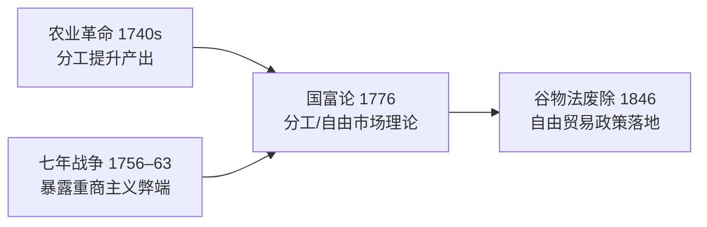

# Concept-Book Run

domain: /home/papagame/projects/digital-duck/conceptbook-app/public/domains/Users/200years_7powers_ch00/input/graph.yaml
target: adam_smith_1776
started: 2026-09-28T02:53:09

## Teaching order (3 concepts)

- agri_rev_1740s
- seven_years_war_1756
- adam_smith_1776

### agri_rev_1740s (1.0s)

## Agri Rev 1740S

农业革命指1740年代至1780年代英国农业生产方式的根本性转变,核心是圈地运动与诺福克四轮轮作制的推广。中世纪以来,英格兰乡村长期实行敞田制:农户在无篱笆分隔的公共条田上分散耕作,休耕地占比高,产量有限。18世纪中期起,议会陆续通过圈地法案,授权地主合并零散地块、用篱笆或石墙围起私有农场,取消农民在公地放牧、拾柴的传统权利。据统计,1750年至1820年间英国议会通过的圈地法案近四千项,涉及地约七百万英亩,约占英格兰可耕地的五分之一。与此同时,诺福克郡的查尔斯·汤森德(人称"萝卜汤森德")系统推广小麦、萝卜、大麦、三叶草的四作物轮种,以萝卜和三叶草取代休耕:三叶草固氮肥田,萝卜则提供冬季饲料,使牲畜得以安然越冬,粪肥又反哺土壤,形成良性循环。

莱斯特郡的育种家罗伯特·贝克韦尔进一步把这套系统推向极致。他不再让牲畜随意交配,而是有目的地挑选生长快、产肉多的个体进行选择性育种,培育出迪什利羊与朗霍恩牛。据当时伦敦史密斯菲尔德市场的记录,18世纪初到18世纪末,出售的绵羊平均体重约从28磅增至80磅,牛的平均体重也大致翻倍——同样的草场,能养出多得多的肉。

这些变革叠加的结果,是用更少的人产出更多的粮食。18世纪初,英格兰约四分之三的人口以务农为生;到1800年前后,这一比例降至三分之一左右。圈地又同时切断了贫农对公地的依赖,许多失去土地使用权的农户不得不离开乡村。于是,农业效率的提升与农村生计的瓦解共同作用,把大量原本被土地束缚的劳动力"挤"向了曼彻斯特、伯明翰等新兴工业城市。没有这一波悄无声息的农业变革,就不会有足够的、可自由流动的劳动力去填满蒸汽机驱动的工厂——这正是本章其余每一条技术与制度线索得以成立的隐藏前提。

### seven_years_war_1756 (2.6s)

## Seven Years War 1756

七年战争（1756—1763年）是历史学家公认的第一场真正意义上的全球冲突：战火同时在欧洲大陆、北美殖民地、印度次大陆和太平洋沿岸燃烧。表面上，这场战争的导火索是普鲁士与奥地利争夺西里西亚的旧怨，以及英法两国在北美和印度的殖民地竞争；但其深层动因是英法两大帝国为争夺全球贸易、航运和殖民霸权而进行的长期较量。战争的结果由1763年《巴黎条约》确认：英国从法国手中取得整个加拿大（新法兰西），并通过东印度公司在普拉西之战（1757年）之后的胜利，逐步确立了对印度的实际控制；法国则几乎丧失了全部海外殖民地，仅保留了少数加勒比糖岛和印度沿海据点。

一个具体的例子最能说明这场战争的财政后果。为了在欧洲、北美和印度三线同时作战，法国国库背负了巨额战争债务——据估算，战争结束时法国王室的债务已占其年度财政收入的数倍，利息支出吞噬了国家预算的很大一部分。路易十五及其继任者路易十六始终未能找到有效办法偿还这笔债务，被迫依赖增税和借贷维持运转。这一财政困境并非孤立事件，而是直接延续到1789年法国大革命的爆发：正是为了寻求新的税收方案，路易十六才被迫召开三级会议，最终引发了推翻旧制度的政治危机。

从问题解决的角度看，历史学家常用这场战争来训练"多线因果链"的分析能力：一场发生在欧洲和北美的殖民地战争，其财政后果如何在三十年后引爆了法国国内的政治革命？答案在于战争债务与旧制度下不平等的免税特权（教士和贵族普遍免税）之间的结构性矛盾——战争本身没有直接推翻法国王室，但它耗尽了国库，使得原本脆弱的财政体系再也无法承受任何额外冲击，从而将一场殖民地争夺战的账单，转化为了一场国内政治秩序的总清算。

### adam_smith_1776 (24.1s)

## Adam Smith 1776

**定义**

1776年，苏格兰经济学家亚当·斯密出版《国富论》（*An Inquiry into the Nature and Causes of the Wealth of Nations*），系统提出了三个奠定现代经济学基础的核心概念:分工（division of labor）、自由市场（free market）与"看不见的手"（invisible hand）。斯密的核心论点是:当个人在竞争性市场中追逐自身利益时,社会整体福利往往会自发提升——不需要国王或政府来指挥生产该造什么、造多少。这一思想直接挑战了当时欧洲盛行的重商主义(mercantilism),后者主张国家应通过关税、垄断和殖民地贸易限制来积累金银财富。斯密认为,真正的财富不是金银的库存量,而是一国生产商品和服务的能力——这种能力可以通过分工和贸易自由化持续增长。

**实例分析**

斯密用制针工厂的例子说明分工的力量:一名工人独自完成制针的全部18个步骤,一天可能做不出几枚针;但若将工序拆分给多名工人各自专精一两个步骤,同样的十人团队一天可生产近48000枚针,人均产量提升数百倍。这一观察建立在他此前经历的历史背景之上——18世纪40年代的英国农业革命(诺福克轮作制、圈地运动)已经证明,专业化分工与资本投入能大幅提升产出,并释放出大量农业劳动力转向手工业和贸易;而1756至1763年的七年战争则让英国政府背负巨额国债,也让人们更清楚地看到当时以关税和垄断为核心的重商主义体制的僵化与低效。斯密正是把这些具体的经济观察,归纳提炼成了一套关于市场如何自发运作的系统理论。

**问题解决应用**

《国富论》的历史意义不在于书斋里的抽象理论,而在于它此后近百年间被英国决策者反复援引,成为拆除保护主义贸易壁垒的思想武器。最典型的案例是1846年的《谷物法》废除:该法自1815年起对进口谷物征收高关税以保护英国地主利益,但斯密的自由贸易逻辑——即让市场按各国比较优势分配生产,而非用关税人为扭曲价格——被曼彻斯特学派等自由贸易派广泛引用,最终说服首相罗伯特·皮尔在爱尔兰大饥荒(1845–1849年)的压力下推动废除。这标志着英国从重商主义保护体系转向自由贸易体系,也是斯密理论从思想变为国家政策的关键转折点。

*图示:亚当·斯密理论如何汇聚农业革命与七年战争的历史经验,并在70年后转化为具体的贸易政策变革。*

## Run complete

total: 32.9s
