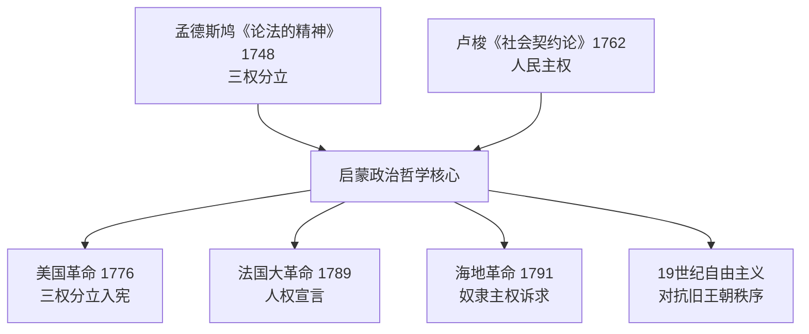
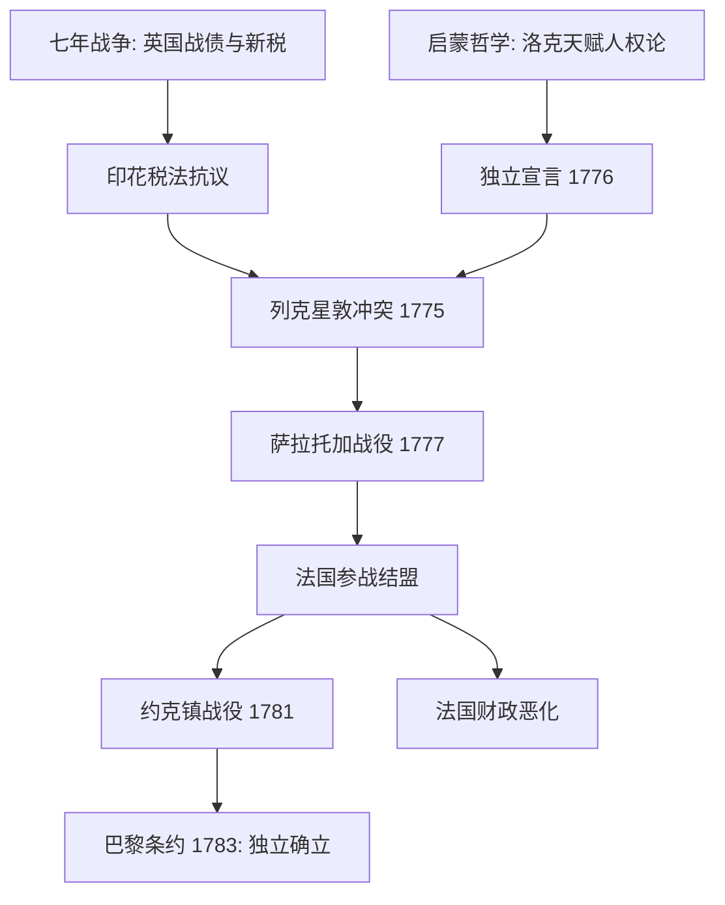
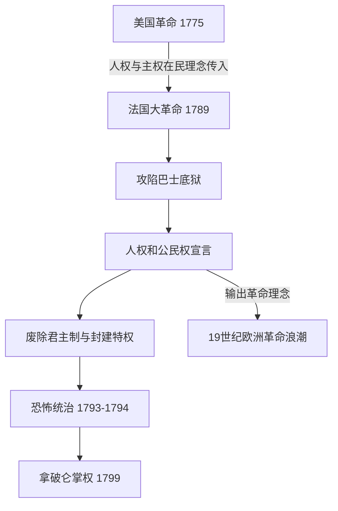
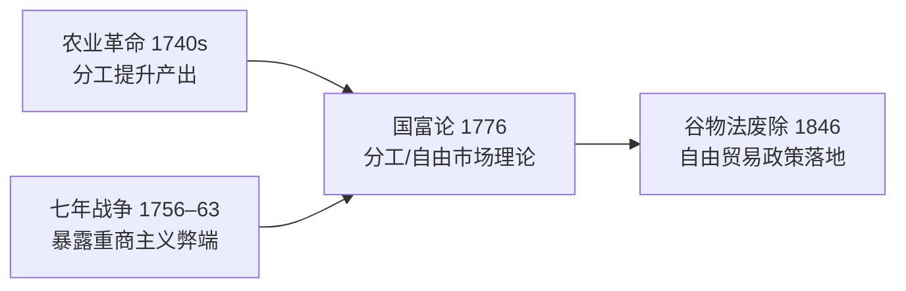
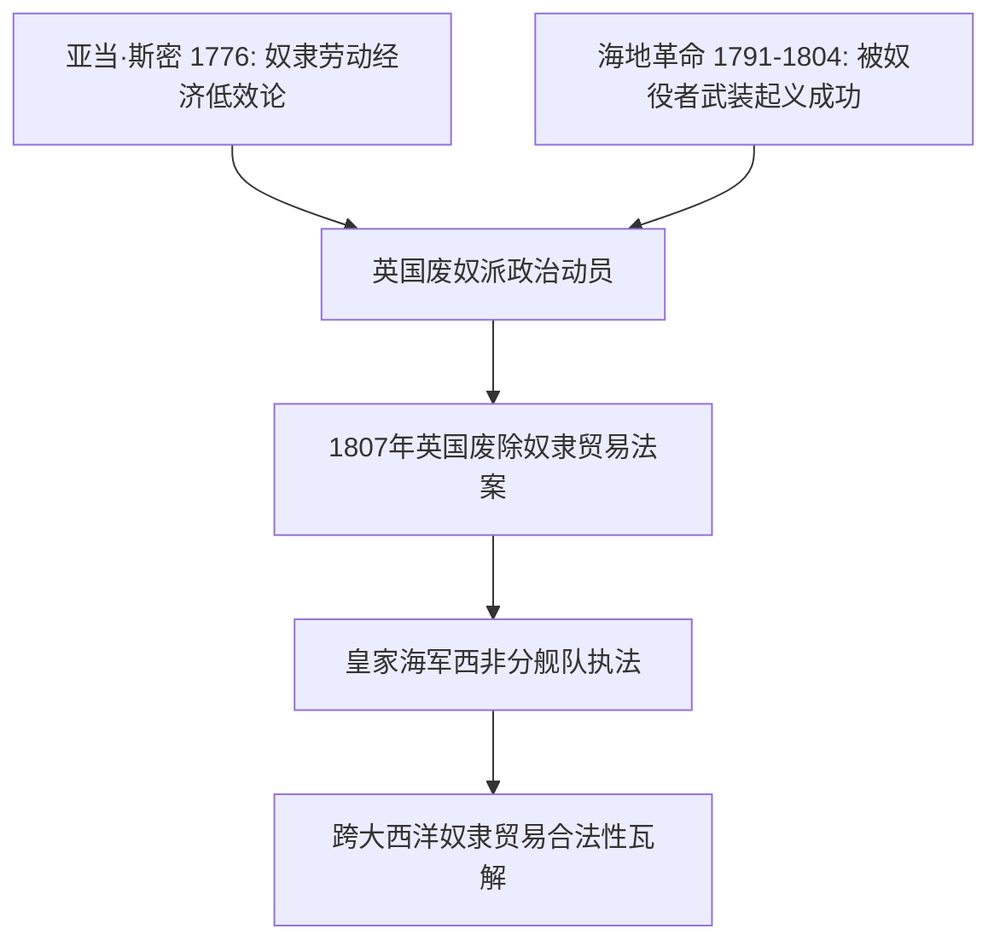

# Concept-Book Run

domain: /home/papagame/projects/digital-duck/conceptbook-app/public/domains/Users/200years_7powers_ch00/input/graph.yaml
target: abolition_slave_trade_1807
started: 2026-09-28T02:53:44

## Teaching order (8 concepts)

- seven_years_war_1756
- enlightenment_philosophy_1748
- american_revolution_1775
- agri_rev_1740s
- french_revolution_1789
- adam_smith_1776
- haitian_revolution_1791
- abolition_slave_trade_1807

### seven_years_war_1756 (1.2s)

## Seven Years War 1756

七年战争（1756—1763年）是历史学家公认的第一场真正意义上的全球冲突：战火同时在欧洲大陆、北美殖民地、印度次大陆和太平洋沿岸燃烧。表面上，这场战争的导火索是普鲁士与奥地利争夺西里西亚的旧怨，以及英法两国在北美和印度的殖民地竞争；但其深层动因是英法两大帝国为争夺全球贸易、航运和殖民霸权而进行的长期较量。战争的结果由1763年《巴黎条约》确认：英国从法国手中取得整个加拿大（新法兰西），并通过东印度公司在普拉西之战（1757年）之后的胜利，逐步确立了对印度的实际控制；法国则几乎丧失了全部海外殖民地，仅保留了少数加勒比糖岛和印度沿海据点。

一个具体的例子最能说明这场战争的财政后果。为了在欧洲、北美和印度三线同时作战，法国国库背负了巨额战争债务——据估算，战争结束时法国王室的债务已占其年度财政收入的数倍，利息支出吞噬了国家预算的很大一部分。路易十五及其继任者路易十六始终未能找到有效办法偿还这笔债务，被迫依赖增税和借贷维持运转。这一财政困境并非孤立事件，而是直接延续到1789年法国大革命的爆发：正是为了寻求新的税收方案，路易十六才被迫召开三级会议，最终引发了推翻旧制度的政治危机。

从问题解决的角度看，历史学家常用这场战争来训练"多线因果链"的分析能力：一场发生在欧洲和北美的殖民地战争，其财政后果如何在三十年后引爆了法国国内的政治革命？答案在于战争债务与旧制度下不平等的免税特权（教士和贵族普遍免税）之间的结构性矛盾——战争本身没有直接推翻法国王室，但它耗尽了国库，使得原本脆弱的财政体系再也无法承受任何额外冲击，从而将一场殖民地争夺战的账单，转化为了一场国内政治秩序的总清算。

### enlightenment_philosophy_1748 (0.8s)

## Enlightenment Philosophy 1748

**定义**

启蒙哲学是17世纪末至18世纪欧洲思想家发展出的一整套关于理性、政府正当性与个人权利的学说。它挑战了"君权神授"的旧观念——即国王的统治权来自上帝、不受人民约束——转而主张政府的权力来自被统治者的理性同意，并应受到制度性约束。两部奠基性著作确立了这一学说的核心框架：孟德斯鸠（Montesquieu）1748年出版的《论法的精神》提出"三权分立"，主张立法权、行政权与司法权应分设于不同机构，彼此制衡，防止权力集中导致专制；卢梭（Jean-Jacques Rousseau）1762年出版的《社会契约论》则提出，合法政府的基础是"公意"（人民的共同意志），统治者的权力来自人民的授权契约，一旦政府违背这一契约，人民便有权推翻它。

**具体案例**

这些思想很快从书斋走向街头与议会。1787年美国制宪会议的代表们直接借鉴孟德斯鸠的分权理论，设计出国会（立法）、总统（行政）、最高法院（司法）三权分立、相互制衡的联邦政府架构——这一设计至今仍是美国宪法的骨架。1789年法国大革命爆发后，《人权宣言》第十六条写道："凡权利无保障、权力无分立的社会，就没有宪法可言"，几乎是对孟德斯鸠理论的直接呼应；而卢梭的"人民主权"思想则被革命者用来论证推翻路易十六统治的正当性。1791年爆发的海地革命更进一步：被奴役的黑人将"人人生而平等""主权在民"的启蒙语言，用来对抗其宣扬者自身未能实现的种族与阶级排斥，最终于1804年建立了世界上第一个由前奴隶建立的独立共和国。

**问题解决应用**

启蒙哲学的真正力量在于它提供了一套可操作的诊断工具：面对任何一个政治秩序，都可以追问"权力是否集中于一人或一个机构？""统治的正当性来自神授、世袭，还是来自被统治者的同意？"用这两个问题分析19世纪欧洲历次革命（1830年、1848年"民族之春"）会发现，凡是旧王朝拒绝分权、拒绝以宪法约束王权的地方（如奥地利哈布斯堡王朝、俄国沙皇专制），革命冲突就更为激烈持久；而英国通过1832年《改革法案》等渐进立宪改革吸纳了部分启蒙诉求，则避免了法国式的暴力革命。这正是启蒙哲学与19世纪"自由主义对抗旧王朝秩序"长期斗争之间的思想脉络。

*该图展示孟德斯鸠与卢梭的启蒙思想如何分别为分权制衡与人民主权提供理论依据，并共同催生了美、法、海地三场革命及此后一个世纪的自由主义运动。*

### american_revolution_1775 (0.8s)

## American Revolution 1775

**定义**

美国革命（1775–1783）是北美十三个英属殖民地反抗英国统治、争取独立并建立共和政体的战争与政治进程。其思想根源直接来自启蒙哲学：约翰·洛克关于"天赋人权"（生命、自由、财产）与"被统治者同意"的学说，被托马斯·杰斐逊写入1776年《独立宣言》，成为"人皆生而平等"这一立场的理论依据。其历史条件则来自七年战争：英国为偿还战争债务（战后国债约1.4亿英镑），对殖民地征收《印花税法》（1765）、《汤森德法案》（1767）等新税，殖民地人以"无代表不纳税"为口号抗议，矛盾逐步升级为1775年4月列克星敦和康科德的武装冲突。

**实例分析**

战争初期，英国拥有当时世界最强的正规军和海军，殖民地民兵装备简陋、缺乏统一指挥。然而，乔治·华盛顿领导大陆军采取消耗战与游击战结合的策略，避免与英军正面决战，同时争取外部支援。1777年萨拉托加战役，大陆军俘获英军将领伯戈因所部约6000人，成为战争的转折点：法国因此确信殖民地有获胜可能，于1778年正式与美国结盟，派遣军队与舰队参战。西班牙、荷兰随后也加入对英作战或提供援助。1781年约克镇战役，华盛顿与法国将领罗尚博联手，法国海军舰队封锁切萨皮克湾，切断英军海上退路，迫使康沃利斯率约8000英军投降，实质终结了战事。1783年《巴黎条约》正式承认美国独立。

**问题解决应用**

分析这场战争，关键在于理解"军事弱势"与"政治胜利"如何并存：殖民地并非依靠传统意义上的军力优势取胜,而是通过延长战争消耗英国的财政与政治意愿，并借助国际联盟（法国的资金、舰队与陆军）弥补自身短板。这一模式此后被多次历史场合借鉴——弱势一方通过持久抵抗与外部结盟对抗强权。同时，此战对法国产生了深远的反噬效应：为支援美国，法国政府举债作战，财政进一步恶化，成为1789年法国大革命爆发的重要诱因之一。美国革命也证明启蒙思想可以转化为可操作的政治制度——1787年《联邦宪法》所确立的分权与共和框架，成为其后拉丁美洲、法国等地革命者效仿的蓝图。

*该图展示启蒙思想与七年战争遗留问题如何共同引发美国革命，以及法国参战对约克镇胜利与自身财政危机的双重影响。*

### agri_rev_1740s (0.8s)

## Agri Rev 1740S

农业革命指1740年代至1780年代英国农业生产方式的根本性转变,核心是圈地运动与诺福克四轮轮作制的推广。中世纪以来,英格兰乡村长期实行敞田制:农户在无篱笆分隔的公共条田上分散耕作,休耕地占比高,产量有限。18世纪中期起,议会陆续通过圈地法案,授权地主合并零散地块、用篱笆或石墙围起私有农场,取消农民在公地放牧、拾柴的传统权利。据统计,1750年至1820年间英国议会通过的圈地法案近四千项,涉及地约七百万英亩,约占英格兰可耕地的五分之一。与此同时,诺福克郡的查尔斯·汤森德(人称"萝卜汤森德")系统推广小麦、萝卜、大麦、三叶草的四作物轮种,以萝卜和三叶草取代休耕:三叶草固氮肥田,萝卜则提供冬季饲料,使牲畜得以安然越冬,粪肥又反哺土壤,形成良性循环。

莱斯特郡的育种家罗伯特·贝克韦尔进一步把这套系统推向极致。他不再让牲畜随意交配,而是有目的地挑选生长快、产肉多的个体进行选择性育种,培育出迪什利羊与朗霍恩牛。据当时伦敦史密斯菲尔德市场的记录,18世纪初到18世纪末,出售的绵羊平均体重约从28磅增至80磅,牛的平均体重也大致翻倍——同样的草场,能养出多得多的肉。

这些变革叠加的结果,是用更少的人产出更多的粮食。18世纪初,英格兰约四分之三的人口以务农为生;到1800年前后,这一比例降至三分之一左右。圈地又同时切断了贫农对公地的依赖,许多失去土地使用权的农户不得不离开乡村。于是,农业效率的提升与农村生计的瓦解共同作用,把大量原本被土地束缚的劳动力"挤"向了曼彻斯特、伯明翰等新兴工业城市。没有这一波悄无声息的农业变革,就不会有足够的、可自由流动的劳动力去填满蒸汽机驱动的工厂——这正是本章其余每一条技术与制度线索得以成立的隐藏前提。

### french_revolution_1789 (0.8s)

## French Revolution 1789

1789年,法国财政濒临破产——七年战争与援助美国独立战争耗尽国库,加之连年歉收推高面包价格,路易十六被迫召开已停摆175年的三级会议。第三等级代表自行宣布成立"国民议会",于6月20日在网球场宣誓"不制定宪法绝不解散"。7月14日,巴黎民众攻陷巴士底狱,这座象征王权专制的堡垒被摧毁,革命由体制内的政治对抗升级为街头暴力与全国动员。8月4日夜,议会废除封建特权与什一税;8月26日通过《人权和公民权宣言》,宣告"人生而自由平等""主权本质上属于国民"。这份文件后来成为全球自由主义宪法的范本,美国《权利法案》(1791年生效)与拉美各国独立宪法均可见其影响。

革命进程并非直线前进。1791年立宪君主制尝试失败后,1792年法国宣布共和,次年国王路易十六被送上断头台。1793–1794年"恐怖统治"期间,罗伯斯庇尔领导的公安委员会以"美德与恐怖"为治国手段,处决约1.7万人(含贵族、教士与政敌),旨在肃清反革命与外国干涉势力——普鲁士与奥地利已组成反法联盟出兵干预。1794年热月政变推翻罗伯斯庇尔,恐怖统治终结,但政局持续动荡,最终由拿破仑·波拿巴于1799年雾月政变夺权,革命十年画上句号。

历史应用题:比较美国革命(1775年)与法国革命(1789年)的成因与结果差异。两者均以"人生而平等""主权在民"为号召,但美国革命是十三个殖民地对抗远方宗主国的政治独立运动,战后建立联邦制共和国,社会结构未被彻底重塑;法国革命则是国内阶级对君主专制与封建等级制度的总清算,废除了整个贵族—教会特权体系,并经历了处决国王、恐怖统治与军事独裁的剧烈震荡。可从以下角度分析:(1)冲突性质——对外独立 vs. 对内社会革命;(2)暴力烈度——为何法国出现大规模处决而美国没有;(3)长期遗产——法国大革命引发的欧洲各王朝连锁动荡(1830、1848年革命浪潮)为何远超美国独立战争的国际影响。

*图示:美国革命的理念如何传导至法国大革命,并进一步演化为19世纪欧洲范围的革命连锁反应。*

### adam_smith_1776 (0.9s)

## Adam Smith 1776

**定义**

1776年，苏格兰经济学家亚当·斯密出版《国富论》（*An Inquiry into the Nature and Causes of the Wealth of Nations*），系统提出了三个奠定现代经济学基础的核心概念:分工（division of labor）、自由市场（free market）与"看不见的手"（invisible hand）。斯密的核心论点是:当个人在竞争性市场中追逐自身利益时,社会整体福利往往会自发提升——不需要国王或政府来指挥生产该造什么、造多少。这一思想直接挑战了当时欧洲盛行的重商主义(mercantilism),后者主张国家应通过关税、垄断和殖民地贸易限制来积累金银财富。斯密认为,真正的财富不是金银的库存量,而是一国生产商品和服务的能力——这种能力可以通过分工和贸易自由化持续增长。

**实例分析**

斯密用制针工厂的例子说明分工的力量:一名工人独自完成制针的全部18个步骤,一天可能做不出几枚针;但若将工序拆分给多名工人各自专精一两个步骤,同样的十人团队一天可生产近48000枚针,人均产量提升数百倍。这一观察建立在他此前经历的历史背景之上——18世纪40年代的英国农业革命(诺福克轮作制、圈地运动)已经证明,专业化分工与资本投入能大幅提升产出,并释放出大量农业劳动力转向手工业和贸易;而1756至1763年的七年战争则让英国政府背负巨额国债,也让人们更清楚地看到当时以关税和垄断为核心的重商主义体制的僵化与低效。斯密正是把这些具体的经济观察,归纳提炼成了一套关于市场如何自发运作的系统理论。

**问题解决应用**

《国富论》的历史意义不在于书斋里的抽象理论,而在于它此后近百年间被英国决策者反复援引,成为拆除保护主义贸易壁垒的思想武器。最典型的案例是1846年的《谷物法》废除:该法自1815年起对进口谷物征收高关税以保护英国地主利益,但斯密的自由贸易逻辑——即让市场按各国比较优势分配生产,而非用关税人为扭曲价格——被曼彻斯特学派等自由贸易派广泛引用,最终说服首相罗伯特·皮尔在爱尔兰大饥荒(1845–1849年)的压力下推动废除。这标志着英国从重商主义保护体系转向自由贸易体系,也是斯密理论从思想变为国家政策的关键转折点。

*图示:亚当·斯密理论如何汇聚农业革命与七年战争的历史经验,并在70年后转化为具体的贸易政策变革。*

### haitian_revolution_1791 (1.0s)

## Haitian Revolution 1791

1791年8月，法属圣多明各（今海地）北部平原的种植园奴隶在一次伏都教秘密集会（布瓦卡曼仪式）后揭竿而起，纵火焚烧数百座甘蔗种植园，拉开了海地革命的序幕。圣多明各当时是大西洋世界最富庶的殖民地：仅占地不足今日海地一半，却贡献了法国对外贸易总值的三分之一以上，出产全球近一半的蔗糖和咖啡，其财富建立在约50万名非洲奴隶的劳动之上，而这些奴隶的死亡率极高，殖民者依赖持续从非洲输入新奴隶来维持种植园人口。这场起义之所以不同于此前历次奴隶反抗（如牙买加或苏里南的马隆人起义），在于它最终推翻了整个殖民统治秩序，而非仅仅在丛林中建立自治飞地。

法国大革命提供了直接的政治契机：1789年《人权宣言》宣称"人人生而自由平等"，却对殖民地奴隶制避而不谈，这一矛盾被圣多明各的自由有色人种（如文森特·奥热）和奴隶领袖同时利用，向巴黎施压。1794年，在奴隶起义和外部战争（法国同时与英国、西班牙交战）的双重压力下，法国国民公会正式废除奴隶制——这是现代史上首次由国家立法全面废奴。杜桑·卢维杜尔随后统一各派力量，击退西班牙与英国的入侵军队，并于1801年颁布宪法自任终身总督。拿破仑执政后企图恢复奴隶制并重新征服该岛，派遣的远征军虽诱捕并囚死杜桑，却在让-雅克·德萨林领导下的抵抗、疟疾与黄热病的重创下惨败：约2.4万法军中仅数千人生还。1804年1月1日，德萨林宣布独立，建立海地——史上第一个由前奴隶建立的共和国。

这一事件的历史应用价值在于因果分析：将海地革命与同期的美国革命、法国革命对照，可见"自由"话语的普适性主张与殖民地奴隶制现实之间的张力，如何被最边缘的群体转化为最彻底的政治行动，并反过来永久动摇了跨大西洋奴隶制度在道德与经济上的正当性——法国因此丧失了其最富有的殖民地，美国与欧洲列强则长期外交孤立海地，直到1825年法国以战争赔款方式勒索承认独立，这笔债务持续拖累海地经济近一个世纪。

### abolition_slave_trade_1807 (21.7s)

## Abolition Slave Trade 1807

**定义**

1807年,英国议会通过《废除奴隶贸易法案》(Slave Trade Act),禁止英国船只从事跨大西洋奴隶贸易,并授权皇家海军在西非沿海设立"西非分舰队"(West Africa Squadron),拦截、扣押从事奴隶贩运的船只。这项立法本身并未解放大英帝国境内已被奴役的人口——那要等到1833年的《废除奴隶制法案》——但它切断了新增奴隶的跨洋供应链,并且英国凭借当时世界最强的海军力量,试图将这一禁令扩展为一项全球执法行动,拦截其他国家的贩奴船只。这是大西洋奴隶贸易体系合法性崩溃的关键转折点。

**促成因素**

推动这场立法转变的,是两股力量的汇合。其一是启蒙运动的道德论证:亚当·斯密在《国富论》(1776年)中已经从经济学角度论证奴隶劳动效率低于自由劳动——被奴役者没有改善产出的激励,而这一逻辑被威廉·威尔伯福斯(William Wilberforce)等废奴主义者转化为更广泛的政治动员,论证奴隶制既不道德也不具经济必然性。其二是海地革命(1791—1804年)提供的实证:圣多明各的被奴役者通过大规模武装起义,击败了法国、西班牙、英国的军队,建立了世界上第一个由前奴隶建立的独立共和国。这场革命打破了"被奴役者无法有组织地反抗"的种植园主假设,让英国议会中的废奴派得以论证——奴隶制度的维持成本(军事镇压、殖民地动荡)正在急剧上升,而不再是一项"稳定"的经济安排。

**问题解决应用**

这项立法的关键张力在于:法律禁令与实际执行之间存在巨大缺口。皇家海军的拦截行动虽然在19世纪中叶截获了约1600艘贩奴船、解放约15万人,但同期仍有数十万非洲人被其他国家(尤其是葡萄牙、巴西、美国国内贸易、古巴)贩运——说明单一国家的立法与武力,若缺乏多边条约配合,难以彻底终止一个跨国的经济体系。历史学家在评估类似"单边执法+多边缺口"的案例时(如后来的国际禁运、贸易制裁),都会援引1807年法案作为范例:立法意图与执行覆盖率之间的落差,决定了政策实际效果的上限。

*图示:亚当·斯密的经济论证与海地革命的实证案例如何汇合,推动1807年英国立法及其后续全球执法行动。*

## Run complete

total: 35.7s
