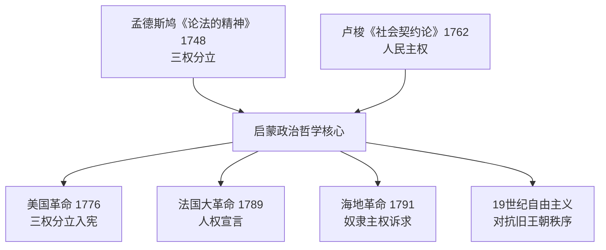
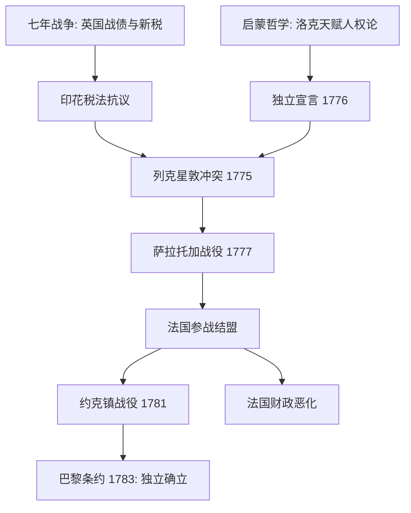
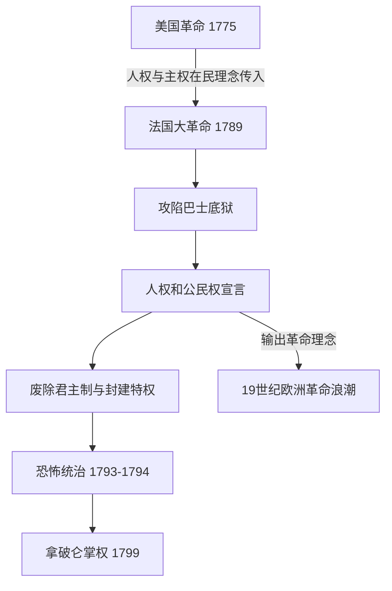
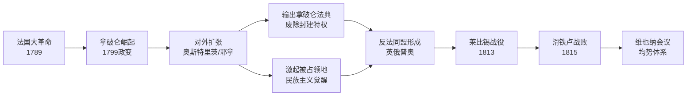
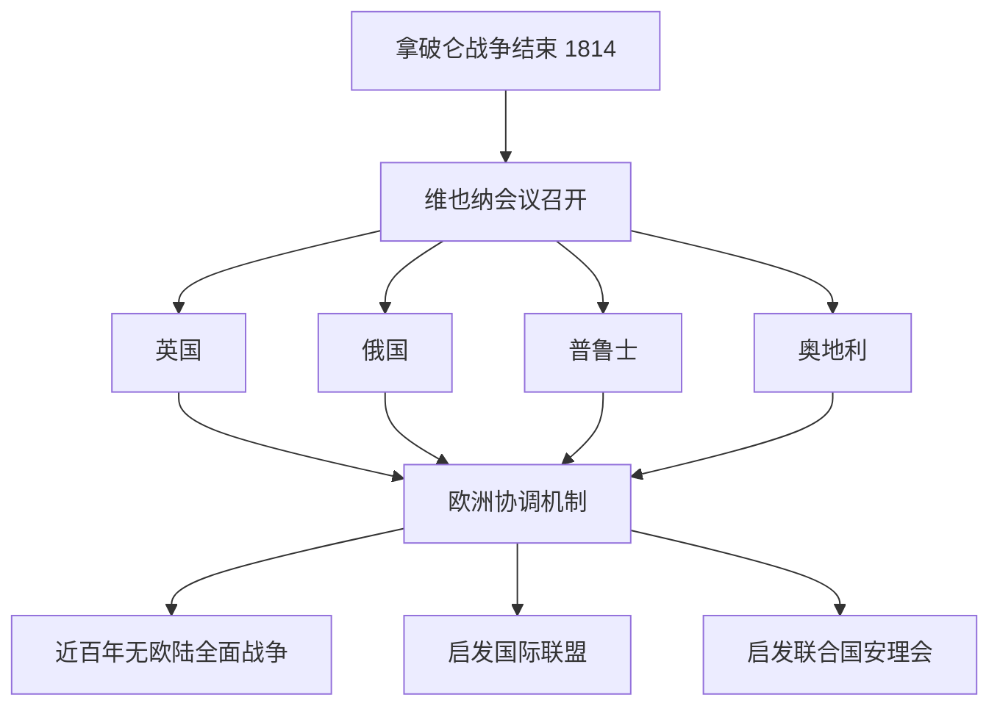

# Concept-Book Run

domain: /home/papagame/projects/digital-duck/conceptbook-app/public/domains/Users/200years_7powers_ch00/input/graph.yaml
target: congress_of_vienna_1815
started: 2026-09-28T02:55:32

## Teaching order (6 concepts)

- enlightenment_philosophy_1748
- seven_years_war_1756
- american_revolution_1775
- french_revolution_1789
- napoleonic_wars_1799
- congress_of_vienna_1815

### enlightenment_philosophy_1748 (0.8s)

## Enlightenment Philosophy 1748

**定义**

启蒙哲学是17世纪末至18世纪欧洲思想家发展出的一整套关于理性、政府正当性与个人权利的学说。它挑战了"君权神授"的旧观念——即国王的统治权来自上帝、不受人民约束——转而主张政府的权力来自被统治者的理性同意，并应受到制度性约束。两部奠基性著作确立了这一学说的核心框架：孟德斯鸠（Montesquieu）1748年出版的《论法的精神》提出"三权分立"，主张立法权、行政权与司法权应分设于不同机构，彼此制衡，防止权力集中导致专制；卢梭（Jean-Jacques Rousseau）1762年出版的《社会契约论》则提出，合法政府的基础是"公意"（人民的共同意志），统治者的权力来自人民的授权契约，一旦政府违背这一契约，人民便有权推翻它。

**具体案例**

这些思想很快从书斋走向街头与议会。1787年美国制宪会议的代表们直接借鉴孟德斯鸠的分权理论，设计出国会（立法）、总统（行政）、最高法院（司法）三权分立、相互制衡的联邦政府架构——这一设计至今仍是美国宪法的骨架。1789年法国大革命爆发后，《人权宣言》第十六条写道："凡权利无保障、权力无分立的社会，就没有宪法可言"，几乎是对孟德斯鸠理论的直接呼应；而卢梭的"人民主权"思想则被革命者用来论证推翻路易十六统治的正当性。1791年爆发的海地革命更进一步：被奴役的黑人将"人人生而平等""主权在民"的启蒙语言，用来对抗其宣扬者自身未能实现的种族与阶级排斥，最终于1804年建立了世界上第一个由前奴隶建立的独立共和国。

**问题解决应用**

启蒙哲学的真正力量在于它提供了一套可操作的诊断工具：面对任何一个政治秩序，都可以追问"权力是否集中于一人或一个机构？""统治的正当性来自神授、世袭，还是来自被统治者的同意？"用这两个问题分析19世纪欧洲历次革命（1830年、1848年"民族之春"）会发现，凡是旧王朝拒绝分权、拒绝以宪法约束王权的地方（如奥地利哈布斯堡王朝、俄国沙皇专制），革命冲突就更为激烈持久；而英国通过1832年《改革法案》等渐进立宪改革吸纳了部分启蒙诉求，则避免了法国式的暴力革命。这正是启蒙哲学与19世纪"自由主义对抗旧王朝秩序"长期斗争之间的思想脉络。

*该图展示孟德斯鸠与卢梭的启蒙思想如何分别为分权制衡与人民主权提供理论依据，并共同催生了美、法、海地三场革命及此后一个世纪的自由主义运动。*

### seven_years_war_1756 (1.2s)

## Seven Years War 1756

七年战争（1756—1763年）是历史学家公认的第一场真正意义上的全球冲突：战火同时在欧洲大陆、北美殖民地、印度次大陆和太平洋沿岸燃烧。表面上，这场战争的导火索是普鲁士与奥地利争夺西里西亚的旧怨，以及英法两国在北美和印度的殖民地竞争；但其深层动因是英法两大帝国为争夺全球贸易、航运和殖民霸权而进行的长期较量。战争的结果由1763年《巴黎条约》确认：英国从法国手中取得整个加拿大（新法兰西），并通过东印度公司在普拉西之战（1757年）之后的胜利，逐步确立了对印度的实际控制；法国则几乎丧失了全部海外殖民地，仅保留了少数加勒比糖岛和印度沿海据点。

一个具体的例子最能说明这场战争的财政后果。为了在欧洲、北美和印度三线同时作战，法国国库背负了巨额战争债务——据估算，战争结束时法国王室的债务已占其年度财政收入的数倍，利息支出吞噬了国家预算的很大一部分。路易十五及其继任者路易十六始终未能找到有效办法偿还这笔债务，被迫依赖增税和借贷维持运转。这一财政困境并非孤立事件，而是直接延续到1789年法国大革命的爆发：正是为了寻求新的税收方案，路易十六才被迫召开三级会议，最终引发了推翻旧制度的政治危机。

从问题解决的角度看，历史学家常用这场战争来训练"多线因果链"的分析能力：一场发生在欧洲和北美的殖民地战争，其财政后果如何在三十年后引爆了法国国内的政治革命？答案在于战争债务与旧制度下不平等的免税特权（教士和贵族普遍免税）之间的结构性矛盾——战争本身没有直接推翻法国王室，但它耗尽了国库，使得原本脆弱的财政体系再也无法承受任何额外冲击，从而将一场殖民地争夺战的账单，转化为了一场国内政治秩序的总清算。

### american_revolution_1775 (1.0s)

## American Revolution 1775

**定义**

美国革命（1775–1783）是北美十三个英属殖民地反抗英国统治、争取独立并建立共和政体的战争与政治进程。其思想根源直接来自启蒙哲学：约翰·洛克关于"天赋人权"（生命、自由、财产）与"被统治者同意"的学说，被托马斯·杰斐逊写入1776年《独立宣言》，成为"人皆生而平等"这一立场的理论依据。其历史条件则来自七年战争：英国为偿还战争债务（战后国债约1.4亿英镑），对殖民地征收《印花税法》（1765）、《汤森德法案》（1767）等新税，殖民地人以"无代表不纳税"为口号抗议，矛盾逐步升级为1775年4月列克星敦和康科德的武装冲突。

**实例分析**

战争初期，英国拥有当时世界最强的正规军和海军，殖民地民兵装备简陋、缺乏统一指挥。然而，乔治·华盛顿领导大陆军采取消耗战与游击战结合的策略，避免与英军正面决战，同时争取外部支援。1777年萨拉托加战役，大陆军俘获英军将领伯戈因所部约6000人，成为战争的转折点：法国因此确信殖民地有获胜可能，于1778年正式与美国结盟，派遣军队与舰队参战。西班牙、荷兰随后也加入对英作战或提供援助。1781年约克镇战役，华盛顿与法国将领罗尚博联手，法国海军舰队封锁切萨皮克湾，切断英军海上退路，迫使康沃利斯率约8000英军投降，实质终结了战事。1783年《巴黎条约》正式承认美国独立。

**问题解决应用**

分析这场战争，关键在于理解"军事弱势"与"政治胜利"如何并存：殖民地并非依靠传统意义上的军力优势取胜,而是通过延长战争消耗英国的财政与政治意愿，并借助国际联盟（法国的资金、舰队与陆军）弥补自身短板。这一模式此后被多次历史场合借鉴——弱势一方通过持久抵抗与外部结盟对抗强权。同时，此战对法国产生了深远的反噬效应：为支援美国，法国政府举债作战，财政进一步恶化，成为1789年法国大革命爆发的重要诱因之一。美国革命也证明启蒙思想可以转化为可操作的政治制度——1787年《联邦宪法》所确立的分权与共和框架，成为其后拉丁美洲、法国等地革命者效仿的蓝图。

*该图展示启蒙思想与七年战争遗留问题如何共同引发美国革命，以及法国参战对约克镇胜利与自身财政危机的双重影响。*

### french_revolution_1789 (0.9s)

## French Revolution 1789

1789年,法国财政濒临破产——七年战争与援助美国独立战争耗尽国库,加之连年歉收推高面包价格,路易十六被迫召开已停摆175年的三级会议。第三等级代表自行宣布成立"国民议会",于6月20日在网球场宣誓"不制定宪法绝不解散"。7月14日,巴黎民众攻陷巴士底狱,这座象征王权专制的堡垒被摧毁,革命由体制内的政治对抗升级为街头暴力与全国动员。8月4日夜,议会废除封建特权与什一税;8月26日通过《人权和公民权宣言》,宣告"人生而自由平等""主权本质上属于国民"。这份文件后来成为全球自由主义宪法的范本,美国《权利法案》(1791年生效)与拉美各国独立宪法均可见其影响。

革命进程并非直线前进。1791年立宪君主制尝试失败后,1792年法国宣布共和,次年国王路易十六被送上断头台。1793–1794年"恐怖统治"期间,罗伯斯庇尔领导的公安委员会以"美德与恐怖"为治国手段,处决约1.7万人(含贵族、教士与政敌),旨在肃清反革命与外国干涉势力——普鲁士与奥地利已组成反法联盟出兵干预。1794年热月政变推翻罗伯斯庇尔,恐怖统治终结,但政局持续动荡,最终由拿破仑·波拿巴于1799年雾月政变夺权,革命十年画上句号。

历史应用题:比较美国革命(1775年)与法国革命(1789年)的成因与结果差异。两者均以"人生而平等""主权在民"为号召,但美国革命是十三个殖民地对抗远方宗主国的政治独立运动,战后建立联邦制共和国,社会结构未被彻底重塑;法国革命则是国内阶级对君主专制与封建等级制度的总清算,废除了整个贵族—教会特权体系,并经历了处决国王、恐怖统治与军事独裁的剧烈震荡。可从以下角度分析:(1)冲突性质——对外独立 vs. 对内社会革命;(2)暴力烈度——为何法国出现大规模处决而美国没有;(3)长期遗产——法国大革命引发的欧洲各王朝连锁动荡(1830、1848年革命浪潮)为何远超美国独立战争的国际影响。

*图示:美国革命的理念如何传导至法国大革命,并进一步演化为19世纪欧洲范围的革命连锁反应。*

### napoleonic_wars_1799 (0.7s)

## Napoleonic Wars 1799

拿破仑战争始于1799年拿破仑发动雾月政变、自立为第一执政之后，终于1815年滑铁卢战役惨败。这十六年间，法国军队几乎征服了整个欧洲大陆：1805年奥斯特里茨战役击溃奥俄联军，1806年耶拿—奥厄施塔特战役摧毁普鲁士主力，1807年提尔西特和约后法国势力延伸至波兰与莱茵地区。拿破仑所到之处，不仅带去军队，也带去法国大革命的制度遗产——《拿破仑法典》确立了法律面前人人平等、财产权保障与世俗婚姻制度，取代了各地残存的封建领主特权与教会司法权。这种"武力输出改革"的模式，使得战争本身成为革命理念跨国传播的载体：意大利、德意志诸邦、西班牙的旧贵族特权与农奴制在法军占领期间被系统性废除。

然而，占领也催生了被占领民族的反弹。西班牙1808年爆发的游击战（"半岛战争"）、普鲁士战败后推行的军事与教育改革（如沙恩霍斯特改革）、德意志知识分子费希特发表《对德意志民族的演讲》，都表明外来统治反而激发了本地的民族认同——这是近代民族主义作为政治力量登场的关键节点之一。

拿破仑最终的失败，源于他树敌过多、战线过长。1812年入侵俄国，六十万大军因俄军坚壁清野与严冬减员至不足十万，成为转折点。此后，英国、俄国、普鲁士、奥地利结成第六次反法同盟，于1813年莱比锡"民族大会战"击败拿破仑，1814年攻入巴黎，1815年滑铁卢终结其复辟企图。

这场战争在国际关系史上具有范式意义：四个原本利益冲突、甚至互相交战过的大国，为遏制一个试图称霸欧陆的单一强权而结成持久联盟，并在战后通过维也纳会议（1814–1815）共同设计均势体系。这是历史上大国首次系统性地合作制衡一个陆权霸主，其外交逻辑——防止任何一国独大、通过多边协调维持均势——此后反复出现于十九、二十世纪的国际秩序建构之中。

*该图展示拿破仑战争如何将法国大革命的理念向外传播，同时引发大国联合制衡，最终塑造出维也纳体系下的欧洲均势秩序。*

### congress_of_vienna_1815 (18.7s)

## Congress Of Vienna 1815

1814年至1815年间,拿破仑战争的四大战胜国——英国、俄国、普鲁士与奥地利——齐聚维也纳,召开了一场决定欧洲未来命运的外交会议。这场由奥地利外交大臣梅特涅主持的会议,其核心目标并非惩罚战败的法国,而是重建一个能够长期维持稳定的欧洲秩序。会议确立了"势力均衡"原则:任何一个国家都不应强大到足以再次称霸欧洲大陆。为此,战胜国刻意保留了法国作为一个中等强国,而不是将其肢解削弱,因为过度削弱法国反而会打破均衡,给俄国或普鲁士留下扩张空间。这种"宽容战败者以维持均衡"的做法,与一战后凡尔赛条约对德国的严厉制裁形成了鲜明对比。

会议最重要的制度创新是"欧洲协调"机制——四大国(后来加入法国成为五国)约定今后通过定期召开多边会议的方式协商解决国际争端,而非诉诸战争。这一机制在此后近一个世纪里发挥了实际作用:1815年至1914年间,欧洲列强之间没有爆发过一场全面战争,这与17、18世纪几乎每隔一代人就爆发一次大规模欧陆战争的历史形成强烈反差。当然,这一时期并非完全和平——克里米亚战争(1853–1856)、普奥战争(1866)、普法战争(1870–1871)都曾发生,但这些冲突规模有限、持续时间短,且未能演变为吞噬整个大陆的总体战。

维也纳体系的问题解决逻辑值得细究:当某一地区出现危机(如1830年比利时独立、1848年革命浪潮),列强会通过外交磋商而非单边军事行动来处理,即便协商结果并不总能令所有国家满意,这种"先协商后行动"的习惯本身,正是维也纳会议留给后世最持久的遗产。它为一个世纪后的国际联盟、以及二战后的联合国安理会常任理事国机制,提供了最初的制度模板——由少数大国共同承担维持体系稳定的责任。

*该图展示维也纳会议如何从四大国协商演变为持续影响后世国际秩序的多边外交机制。*

维也纳体系并非完美无缺——它压制了民族主义与自由主义诉求,最终在1848年革命浪潮中受到冲击,并在1914年因缺乏应对新兴工业化强国德国崛起的弹性机制而彻底崩溃。但其存续的近百年,证明了大国协商机制本身可以成为防止战争的有效工具,这一经验被后世反复借鉴与改良。

## Run complete

total: 29.5s
