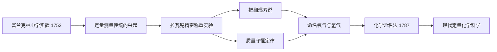

# Concept-Book Run

domain: /home/papagame/projects/digital-duck/conceptbook-app/public/domains/Users/200years_7powers_ch00/input/graph.yaml
target: lavoisier_chemistry_1772
started: 2026-09-28T02:57:32

## Teaching order (2 concepts)

- franklin_electricity_1752
- lavoisier_chemistry_1772

### franklin_electricity_1752 (0.9s)

## Franklin Electricity 1752

**定义**

1752年,本杰明·富兰克林通过费城的风筝实验证明了闪电本质上是一种放电现象,与实验室中用摩擦起电机产生的电火花是同一种物理现象。此前,闪电被普遍视为神秘甚至神圣的自然现象,教堂常常敲钟以"驱散"雷暴,结果导致敲钟人频繁遭雷击身亡。富兰克林的实验将闪电从超自然领域拉入可观察、可测量、可预测的自然规律范畴——这标志着启蒙运动"自然可知"信念在具体自然现象上的一次决定性胜利。基于这一发现,富兰克林发明了避雷针:一根接地的金属杆,安装在建筑物顶端,为闪电提供一条更容易导通的路径,从而保护建筑物本身不被击穿或引燃。

**实验过程与证据**

富兰克林的风筝顶端固定了一根尖细的金属丝,风筝线的下端系有一把铁钥匙,并用丝绸绳与富兰克林手持的部分隔离(丝绸不易导电,起绝缘作用)。当雷云经过风筝上方时,富兰克林观察到风筝线上的细丝竖起,随后当他将手指靠近铁钥匙时,钥匙迸发出火花——与摩擦起电装置产生的火花外观、声音完全一致。他随后用钥匙给莱顿瓶(当时的电容器)充电,证明收集到的确实是电荷。这一实验发表后,富兰克林进一步在费城的建筑物上安装了实际的避雷针,并统计记录了避雷针建筑物遭雷击起火的概率显著低于未安装避雷针的建筑物,为发明的实用性提供了直接的经验数据支持。

**问题解决式应用**

这一发现的意义不仅在于满足科学好奇心,更在于把一种此前无法预测、造成大量财产损失和人员伤亡的自然灾害,转化为可以通过工程手段主动管理的风险。历史学家统计,18世纪欧洲和北美因雷击引发的教堂、船只、火药库火灾屡见不鲜,避雷针推广后这类损失大幅下降。更深远的意义在于方法论:富兰克林没有停留在哲学思辨,而是设计了一个可重复、可验证的对照实验,将假设("闪电是电")转化为可观测的物理证据。这种"用受控实验检验自然假说"的路径,此后被库仑、伏打、奥斯特等人沿用,最终在1831年法拉第发现电磁感应定律时达到高潮,完成了从"驯服天电"到"人工发电"的完整科学链条。

### lavoisier_chemistry_1772 (23.4s)

## Lavoisier Chemistry 1772

1772年10月，法国化学家安托万-洛朗·德·拉瓦锡向法国科学院提交了一份密封文件，记录了他关于燃烧现象的初步实验——这一天后来被视为"化学革命"的起点。在此之前，化学家普遍采用"燃素说"来解释燃烧：认为可燃物中含有一种叫"燃素"的物质，燃烧时会释放出去，因此燃烧后物质应变轻。但拉瓦锡精确称重后发现，金属燃烧后生成的灰烬反而比原来的金属更重。他推断，金属燃烧不是失去了什么，而是从空气中吸收了某种气体。

1774年，约瑟夫·普利斯特里向拉瓦锡展示了他新分离出的一种气体，能使蜡烛燃烧得更旺。拉瓦锡随后系统研究了这种气体，于1777年将其命名为"氧气"（意为"成酸的元素"），并证明它正是金属燃烧、呼吸和许多化学反应中被消耗的关键气体。他还确认了另一种气体——他称之为"氢气"（意为"成水的元素"）——并通过精密的定量实验证明：水并非古希腊人认为的基本元素，而是氢与氧化合而成的化合物。

拉瓦锡最重要的贡献是提出并用实验反复验证了质量守恒定律：在一个密闭系统中进行化学反应，反应前后物质的总质量不变。他用密封的曲颈瓶做实验，精确称量反应前后的重量，证明看似"消失"的物质其实只是转变了形态，并未真正消失。这一原理可表述为：

$$
m_{\text{反应物总质量}} = m_{\text{生成物总质量}}
$$

**问题解决应用**：假设某学生在密闭容器中将12.0克碳完全燃烧，消耗了32.0克氧气，生成二氧化碳气体。根据质量守恒定律，无需知道二氧化碳的具体分子结构，即可直接计算生成物质量：$m_{\text{CO}_2} = 12.0\text{g} + 32.0\text{g} = 44.0\text{g}$。这种"守恒式推理"正是拉瓦锡留给后世化学家、乃至今日工业配方计算和环境物质核算的基本方法——任何化学过程的投入与产出都可以被精确记账。

除了实验方法，拉瓦锡还与合作者共同编写了《化学命名法》（1787年），用元素及其化合价系统地为化学物质命名（如"硫酸""氧化铁"），取代了此前混乱、随意的炼金术式术语（如"锌华""砷之黄油"）。这套命名体系与他质量守恒的定量方法结合，把化学从依靠经验配方的技艺，转变为可重复验证、可精确计算的实验科学，为19世纪道尔顿原子论和工业化学合成奠定了方法论基础。

*该图展示拉瓦锡如何继承精密测量的科学传统，通过定量实验推翻燃素说、确立质量守恒定律，并最终系统化现代化学。*

## Run complete

total: 28.7s
