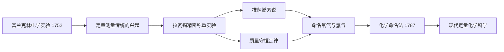

# Concept-Book Run

domain: /home/papagame/projects/digital-duck/conceptbook-app/public/domains/Users/200years_7powers_ch00/input/graph.yaml
target: dalton_atomic_theory_1803
started: 2026-09-28T02:58:32

## Teaching order (4 concepts)

- franklin_electricity_1752
- lavoisier_chemistry_1772
- jenner_vaccine_and_volta_battery
- dalton_atomic_theory_1803

### franklin_electricity_1752 (0.9s)

## Franklin Electricity 1752

**定义**

1752年,本杰明·富兰克林通过费城的风筝实验证明了闪电本质上是一种放电现象,与实验室中用摩擦起电机产生的电火花是同一种物理现象。此前,闪电被普遍视为神秘甚至神圣的自然现象,教堂常常敲钟以"驱散"雷暴,结果导致敲钟人频繁遭雷击身亡。富兰克林的实验将闪电从超自然领域拉入可观察、可测量、可预测的自然规律范畴——这标志着启蒙运动"自然可知"信念在具体自然现象上的一次决定性胜利。基于这一发现,富兰克林发明了避雷针:一根接地的金属杆,安装在建筑物顶端,为闪电提供一条更容易导通的路径,从而保护建筑物本身不被击穿或引燃。

**实验过程与证据**

富兰克林的风筝顶端固定了一根尖细的金属丝,风筝线的下端系有一把铁钥匙,并用丝绸绳与富兰克林手持的部分隔离(丝绸不易导电,起绝缘作用)。当雷云经过风筝上方时,富兰克林观察到风筝线上的细丝竖起,随后当他将手指靠近铁钥匙时,钥匙迸发出火花——与摩擦起电装置产生的火花外观、声音完全一致。他随后用钥匙给莱顿瓶(当时的电容器)充电,证明收集到的确实是电荷。这一实验发表后,富兰克林进一步在费城的建筑物上安装了实际的避雷针,并统计记录了避雷针建筑物遭雷击起火的概率显著低于未安装避雷针的建筑物,为发明的实用性提供了直接的经验数据支持。

**问题解决式应用**

这一发现的意义不仅在于满足科学好奇心,更在于把一种此前无法预测、造成大量财产损失和人员伤亡的自然灾害,转化为可以通过工程手段主动管理的风险。历史学家统计,18世纪欧洲和北美因雷击引发的教堂、船只、火药库火灾屡见不鲜,避雷针推广后这类损失大幅下降。更深远的意义在于方法论:富兰克林没有停留在哲学思辨,而是设计了一个可重复、可验证的对照实验,将假设("闪电是电")转化为可观测的物理证据。这种"用受控实验检验自然假说"的路径,此后被库仑、伏打、奥斯特等人沿用,最终在1831年法拉第发现电磁感应定律时达到高潮,完成了从"驯服天电"到"人工发电"的完整科学链条。

### lavoisier_chemistry_1772 (1.1s)

## Lavoisier Chemistry 1772

1772年10月，法国化学家安托万-洛朗·德·拉瓦锡向法国科学院提交了一份密封文件，记录了他关于燃烧现象的初步实验——这一天后来被视为"化学革命"的起点。在此之前，化学家普遍采用"燃素说"来解释燃烧：认为可燃物中含有一种叫"燃素"的物质，燃烧时会释放出去，因此燃烧后物质应变轻。但拉瓦锡精确称重后发现，金属燃烧后生成的灰烬反而比原来的金属更重。他推断，金属燃烧不是失去了什么，而是从空气中吸收了某种气体。

1774年，约瑟夫·普利斯特里向拉瓦锡展示了他新分离出的一种气体，能使蜡烛燃烧得更旺。拉瓦锡随后系统研究了这种气体，于1777年将其命名为"氧气"（意为"成酸的元素"），并证明它正是金属燃烧、呼吸和许多化学反应中被消耗的关键气体。他还确认了另一种气体——他称之为"氢气"（意为"成水的元素"）——并通过精密的定量实验证明：水并非古希腊人认为的基本元素，而是氢与氧化合而成的化合物。

拉瓦锡最重要的贡献是提出并用实验反复验证了质量守恒定律：在一个密闭系统中进行化学反应，反应前后物质的总质量不变。他用密封的曲颈瓶做实验，精确称量反应前后的重量，证明看似"消失"的物质其实只是转变了形态，并未真正消失。这一原理可表述为：

$$
m_{\text{反应物总质量}} = m_{\text{生成物总质量}}
$$

**问题解决应用**：假设某学生在密闭容器中将12.0克碳完全燃烧，消耗了32.0克氧气，生成二氧化碳气体。根据质量守恒定律，无需知道二氧化碳的具体分子结构，即可直接计算生成物质量：$m_{\text{CO}_2} = 12.0\text{g} + 32.0\text{g} = 44.0\text{g}$。这种"守恒式推理"正是拉瓦锡留给后世化学家、乃至今日工业配方计算和环境物质核算的基本方法——任何化学过程的投入与产出都可以被精确记账。

除了实验方法，拉瓦锡还与合作者共同编写了《化学命名法》（1787年），用元素及其化合价系统地为化学物质命名（如"硫酸""氧化铁"），取代了此前混乱、随意的炼金术式术语（如"锌华""砷之黄油"）。这套命名体系与他质量守恒的定量方法结合，把化学从依靠经验配方的技艺，转变为可重复验证、可精确计算的实验科学，为19世纪道尔顿原子论和工业化学合成奠定了方法论基础。

*该图展示拉瓦锡如何继承精密测量的科学传统，通过定量实验推翻燃素说、确立质量守恒定律，并最终系统化现代化学。*

### jenner_vaccine_and_volta_battery (0.8s)

## Jenner Vaccine And Volta Battery

**定义**：1796年，英国乡村医生爱德华·詹纳（Edward Jenner）观察到,感染过牛痘的挤奶女工很少患上致命的天花,于是他从一名感染牛痘的女工手上取脓疱物质,接种给八岁男孩詹姆斯·菲普斯,六周后再让男孩接触天花病毒,男孩安然无恙。这一实验首次以人为对照的方式证明,接种一种温和的病原体可以让人体获得对另一种致命疾病的免疫力,由此奠定了免疫学的基础,"vaccine"（疫苗）一词正来自拉丁语"vacca"（牛）。四年后的1800年,意大利物理学家亚历山德罗·伏打（Alessandro Volta）将锌片与铜片交替叠放,中间以浸透盐水的纸片隔开,制成了"伏打电堆"——人类历史上第一个能够持续稳定输出电流的装置,终结了此前只能依赖摩擦起电或莱顿瓶瞬时放电的局面。

**应用案例**：伏打电堆问世仅数周,英国化学家尼科尔森与卡莱尔就用它电解水,得到氢气与氧气,首次以实验证明水是化合物而非元素,呼应了拉瓦锡此前建立的元素—化合物分类体系。与此同时,詹纳的方法迅速传播:到1800年,英国皇家海军已要求水兵接种牛痘;拿破仑于1805年下令全军接种;到19世纪中叶,天花在多个欧洲国家的死亡率下降超过九成。

**问题解决训练**：如果你是1800年的医生或化学家,如何评判这两项发明的可靠性与推广价值?可比较其验证逻辑:詹纳的结论依赖于个案观察加对照试验的重复(样本虽小,但设计上排除了"侥幸未感染"的可能),而伏打电堆的可靠性则来自其可重复的物理构造——只要材料与接法相同,任何人在任何地点都能复现同样的电流效果。这提示我们:一项发现能否被称为"可靠的科学工具",关键不在于其原理是否被完全理解(当时无人知道免疫机制,也无人知道电子的存在),而在于其效果是否可被独立重复验证。这正是拉瓦锡定量化学方法留下的方法论遗产,在生物医学与物理学两个方向上分别开花结果。

### dalton_atomic_theory_1803 (23.7s)

## Dalton Atomic Theory 1803

**定义**：1803年，英国化学家约翰·道尔顿（John Dalton）提出原子理论,为化学从定性描述迈向定量科学奠定了基础。他的核心主张可归纳为四点:(1)一切物质由不可再分的原子构成;(2)同一元素的原子具有相同的质量和性质,不同元素的原子质量不同;(3)化合物是由不同元素的原子按固定的简单整数比结合而成;(4)化学反应只是原子的重新组合,原子本身既不产生也不消失。这一理论第一次把"质量"变成了检验化学规律的定量工具,直接催生了后来的定比定律、倍比定律,并为门捷列夫的周期表和一个世纪后的原子核物理研究铺平了道路。

**范例**:道尔顿理论最有力的证据来自碳的两种氧化物。在一氧化碳中,每12克碳与16克氧结合;在二氧化碳中,每12克碳与32克氧结合。固定碳的质量后,两种化合物中氧的质量之比为

$$
\frac{m_{O,\ CO_2}}{m_{O,\ CO}} = \frac{32\text{ g}}{16\text{ g}} = 2:1
$$

这个简单的整数比(而不是任意小数)正是"倍比定律"的实验证据——它只有在物质由不可分割、质量固定的原子组成,并按整数个数结合时才能成立。若物质是连续可分的流体,这样的整数比毫无理由出现。

**问题解决应用**:道尔顿理论给了化学家一套可操作的定量方法——利用质量比反推化合物中原子的相对数目和元素的相对原子质量。例如,已知水中氢氧质量比约为1:8,若假设水的分子式为一个氢原子对一个氧原子(道尔顿最初的猜测),就可推出氧的相对原子质量约为16(以氢=1为基准);这一推算方法后来被贝采里乌斯等人修正、扩展为系统测定原子量的实验流程。这种"由宏观质量比推断微观原子构成"的思路,成为19世纪化学分析、化合价确定、乃至周期表元素排序的通用方法论。

## Run complete

total: 31.5s
