# Concept-Book Run

domain: /home/papagame/projects/digital-duck/conceptbook-app/public/domains/Users/200years_7powers_ch08/input/graph.yaml
target: science_cross_cutting_synthesis_1845_1945
started: 2026-09-28T03:00:51

## Teaching order (29 concepts)

- german_unification_1871
- great_power_rivalry
- science_faraday_darwin_era
- science_darwinism_and_germ_theory
- science_electrification_and_chemistry
- us_gilded_age
- meiji_restoration
- us_industrial_rise
- japan_meiji_modernization
- qing_dynasty_decline
- science_haber_bosch_and_aviation
- japan_imperial_expansion
- japan_prussian_model_emulation
- us_overseas_imperialism
- germany_weltpolitik_rivalry
- japan_depression_militarism
- science_radioactivity_and_quantum
- us_wwi_and_isolationism
- japan_china_war
- science_penicillin_and_nuclear_fission
- us_great_depression
- germany_wwi_defeat
- japan_pacific_war_defeat
- science_atomic_bomb_1945
- us_arsenal_of_democracy
- science_electrification_shifts_power
- science_haber_bosch_and_wwi_length
- science_nuclear_ends_pacific_war
- science_cross_cutting_synthesis_1845_1945

### german_unification_1871 (0.7s)

## German Unification 1871

1871年1月18日,在凡尔赛宫的镜厅,普鲁士国王威廉一世被加冕为德意志帝国皇帝。这一幕本身就是精心设计的羞辱——地点选在法国王室的心脏地带,时间选在普法战争普鲁士大获全胜之后。三十多个德意志邦国(普鲁士、巴伐利亚、萨克森等)自此统一为一个中央集权的联邦帝国,首都柏林,实际权力掌握在"铁血宰相"俾斯麦手中。一夜之间,欧洲大陆出现了一个人口超过4100万、工业产值迅速逼近英国、拥有欧洲大陆最强陆军的新兴强权。

这一结果并非偶然,而是俾斯麦"铁血政策"三场局部战争的顶点:1864年普丹战争夺取石勒苏益格-荷尔斯泰因,1866年普奥战争(七周战争)击败奥地利并解散德意志邦联,1870至1871年普法战争则是决定性一战。普鲁士总参谋长毛奇利用铁路网实现兵力快速集结,在色当战役(1870年9月2日)围歼法军主力,俘虏法皇拿破仑三世本人,法军伤亡及被俘人数逾十万。战败的法国被迫签署《法兰克福条约》,割让阿尔萨斯和洛林,并赔款50亿法郎——这笔赔款后来成为德国工业化的启动资金之一,而阿尔萨斯-洛林的割让则在法国民众心中埋下复仇的种子,直接影响了四十余年后第一次世界大战的爆发逻辑。

从问题解决的角度看,理解德国统一的关键在于分析俾斯麦如何运用"外部战争制造内部认同"的策略:每一场对外战争都刻意保留有限目标,避免过早触发其他列强(尤其是俄、英)的联合干预,同时利用民族主义情绪压制德意志各邦内部的自由派和地方分离倾向。这也解释了为什么统一后的德意志帝国在宪法设计上刻意保留了普鲁士容克贵族对军队和外交的主导权,而议会(帝国议会)权力有限——这一结构性缺陷后来被历史学家视为魏玛共和国脆弱性乃至纳粹崛起的远因之一。

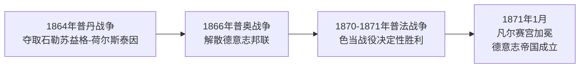
*该图展示俾斯麦通过三场局部战争逐步实现德意志统一的进程。*

德国统一彻底改变了欧洲大陆的力量格局:一个工业化、军事化、且怀有失地复仇之痛的法国,与一个新生但自信过剩的德意志帝国,从此长期对峙,为此后数十年的欧洲同盟体系与两次世界大战埋下了历史伏笔。

### great_power_rivalry (0.8s)

## Great Power Rivalry（列强竞争）

**定义**：列强竞争指19世纪末工业化国家之间围绕殖民地、资源与国际声望展开的系统性争夺。在这一体系下，一国的"强大"不再仅以本土经济或军事实力衡量，而是以其海外殖民地面积、贸易网络控制权和舰队规模作为核心指标。英国、法国、德国、俄国、美国、日本等工业强国将殖民扩张视为国家荣誉与安全的双重保障：殖民地既提供原材料与市场，也象征着一个国家在"文明等级"中的地位。这种心态直接催生了1880年代至1914年间的"新帝国主义"浪潮。

**实例分析**：最典型的案例是"非洲争夺战"（Scramble for Africa）。1870年时欧洲列强仅控制非洲约10%的领土；到1900年，这一比例飙升至90%以上。转折点是1884—1885年的柏林会议——14个欧洲国家（无一非洲代表参与）在此划定势力范围规则，确立"有效占领"原则。此后短短二十年内，法国占据西非与北非大片土地，英国建立起从开罗到开普敦的纵贯殖民带，德国、比利时、葡萄牙也各自瓜分领地。与此同时，英德两国在海军上展开军备竞赛：1898年后德国连续通过《舰队法》扩充公海舰队，英国则以"两强标准"（海军实力须超过任何两个潜在对手总和）回应，双方战列舰数量在1906至1914年间近乎翻倍增长。

**问题解决应用**：理解列强竞争的关键在于识别其自我强化机制——一国的扩张被其他国家解读为威胁，从而触发对等或超额的军备与殖民投入，形成螺旋式升级。分析具体历史事件时，可提出三个诊断性问题：(1) 该行动的直接经济或战略动机是什么（原材料、海军基地、贸易航线）？(2) 竞争对手如何解读并回应此举？(3) 是否存在既有外交机制（如会议、条约）来缓解而非激化冲突？以柏林会议为例，它虽然避免了欧洲列强在非洲问题上直接开战，却未能解决深层竞争逻辑，这种"管理冲突而非消除冲突"的模式，正是理解1914年危机为何最终失控的重要线索。

### science_faraday_darwin_era (0.7s)

## 科学:法拉第与达尔文的时代

到1845年,三条日后重塑工业、医学与战争形态的科学线索已经埋下伏笔,但都尚未结出公开的果实。迈克尔·法拉第于1831年在英国皇家研究院发现电磁感应现象:变化的磁场能在导体中产生电流。这一发现被总结为法拉第电磁感应定律,即感应电动势等于磁通量变化率的负值:

$$\mathcal{E} = -\frac{d\Phi_B}{dt}$$

这条定律不是抽象的数学游戏,而是发电机与电动机的理论基础——没有它,后来的电气化产业无从谈起。与此同时,查尔斯·达尔文已于1836年结束"贝格尔号"环球考察,笔记本中记满了物种变异的证据,但他直到1859年才发表《物种起源》,中间沉默了二十余年,因为他清楚教会与学术界对"人由猿演化而来"这一结论会作何反应。化学方面,道尔顿1808年提出原子论,德贝莱纳1829年发现"三元素组"的规律性,为门捷列夫1869年绘出周期表打下地基;德国的染料与硫酸工业正是靠这些早期化学规律实现规模化生产。

三条线索有一个共同的历史规律:科学发现与其产业化、军事化应用之间往往存在二三十年的滞后期。法拉第1831年的实验室现象,要等到19世纪70年代爱迪生和西门子的发电机才转化为实际电力系统;达尔文的手稿要等社会舆论环境成熟才敢发表;德贝莱纳的化学观察要等门捷列夫系统化后才能指导工业合成。这个滞后期的长短,取决于三个可验证的历史条件:实验结果是否可重复(法拉第的感应现象很快被各国实验室复制)、社会接受度是否具备(达尔文案例)、以及是否存在能将理论转化为规模化产品的工程与资本体系(德国化学工业的例子)。分析任何一次科学突破何时才能改变国家实力对比时,应当逐一核对这三个条件,而不是假设发现本身自动等于国力增长。

### science_darwinism_and_germ_theory (0.7s)

## Science Darwinism And Germ Theory

1859年，达尔文出版《物种起源》，提出以自然选择为机制的进化论:环境资源有限，个体间存在可遗传的性状差异，具有生存和繁殖优势的性状会在种群中逐代累积。这一理论推翻了物种固定不变、由神创论解释生物多样性的传统观念，将生物学纳入基于证据和推理的自然科学体系。几乎同一时期，医学领域发生了同样深刻的范式转变。1860年代，法国化学家巴斯德通过著名的鹅颈瓶实验，证伪了"微生物自然发生"的旧观念，证明发酵和腐败由环境中已存在的微生物引起。德国医生科赫在此基础上更进一步，于1876年确认炭疽杆菌是炭疽病的病原体，随后在1882年分离出结核杆菌、1883年分离出霍乱弧菌，并提出了判定病原体与疾病因果关系的"科赫法则"。这两条看似独立的探索路径——生物如何演化、疾病为何发生——共同确立了一种新的知识生产方式:通过可重复的观察与实验，而非权威或教条，来解释自然现象。

科赫法则本身就是一个可操作的问题解决框架，至今仍是微生物学诊断的基石，值得具体拆解。该法则包含四个步骤:第一，特定病原体必须在患病个体中大量存在，而在健康个体中不存在；第二，该病原体须能从患病个体中分离并进行纯培养；第三，将纯培养的病原体接种到健康且易感的个体后，应引发同样的疾病；第四，从被人工感染的个体中，须能重新分离出同一病原体。19世纪的医生若怀疑某疾病由细菌引起，可依此四步逐一验证，将模糊的临床猜测转化为可检验、可证伪的结论——这正是达尔文和巴斯德所共享的实证方法论在公共卫生领域的具体应用。这套方法直接催生了现代公共卫生实践:消毒手术（李斯特，1867年起推广石炭酸消毒法）、疫苗接种（巴斯德1885年狂犬病疫苗）、城市供水与排污系统改造，使欧美主要城市的传染病死亡率在19世纪末大幅下降。

然而，进化论的"适者生存"概念很快被滥用于科学之外的领域。英国哲学家斯宾塞将"适者生存"一词移植到社会分析中，提出所谓"社会达尔文主义"，主张人类社会与生物种群一样存在优胜劣汰，贫困、疾病和殖民地人口的边缘化不过是"自然选择"的社会体现。这一论调被19世纪末至20世纪初的欧美帝国主义者、种族理论家广泛借用，为殖民扩张、种族等级制度乃至后来的优生学运动提供伪科学包装——将达尔文描述物种演化机制的生物学理论，错误地挪用为证成社会不平等和种族压迫的意识形态工具。这一误用提醒我们:科学发现的传播过程中，其原始含义常被政治与意识形态目的重新诠释乃至扭曲。

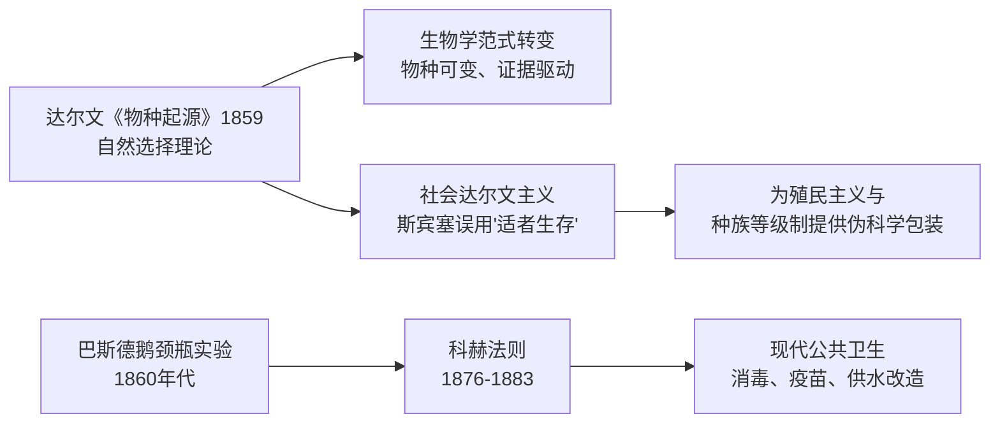
*该图展示达尔文进化论与巴斯德、科赫的细菌学说如何分别推动现代医学的诞生，以及"适者生存"概念如何被扭曲挪用为社会达尔文主义、服务于帝国主义意识形态。*

### science_electrification_and_chemistry (1.4s)

## Science Electrification And Chemistry

1865年至1895年间，科学从抽象理论迅速转化为改变城市面貌与产业格局的现实力量,这一时期标志着第二次工业革命的真正起点。英国物理学家麦克斯韦于1865年发表电磁场方程组,首次用统一的数学语言证明电与磁本质上是同一种力的两种表现,并预言了电磁波的存在——这一预言在二十多年后被赫兹用实验证实,为后来的无线电通信奠定了理论基础。几乎同时,俄国化学家门捷列夫于1869年发布元素周期表,按原子量与化学性质将已知元素系统排列,其大胆之处在于为尚未发现的元素预留空位并预测其性质,后续镓、锗等元素的发现精确印证了这些预测,使化学从经验分类学科转变为具有预测能力的系统科学。

理论突破很快被转化为工业应用。1876年贝尔发明电话,使远距离即时语音通信成为可能,彻底改变了商业与社会联络方式。1882年爱迪生在纽约珍珠街建成世界上第一座商用发电站,采用直流电为曼哈顿下城约85户用户供电照明,标志着电力从实验室走向城市基础设施。随后,特斯拉与西屋公司力推交流电系统,凭借其可远距离低损耗输电的优势,在1893年芝加哥世博会与1896年尼亚加拉水电站项目中战胜爱迪生的直流方案,史称"电流之战",最终奠定了现代电网的技术路线。

这一时期的产业分化具有深远的地缘经济意义:英国仍依赖第一次工业革命的蒸汽动力与纺织业优势,而德国凭借强大的化学工业(如巴斯夫、拜耳等企业在染料、化肥领域的突破)与系统化的技术教育体系迅速崛起,美国则依托丰富资源与爱迪生、特斯拉等人的电气发明建立起全国性电力基础设施。到1900年,德国化学品出口已占全球近三分之二,美国发电量迅速超越英国,两国由此在新兴产业上实现对老牌工业国英国的赶超,预示了二十世纪工业与国力格局的根本转变。

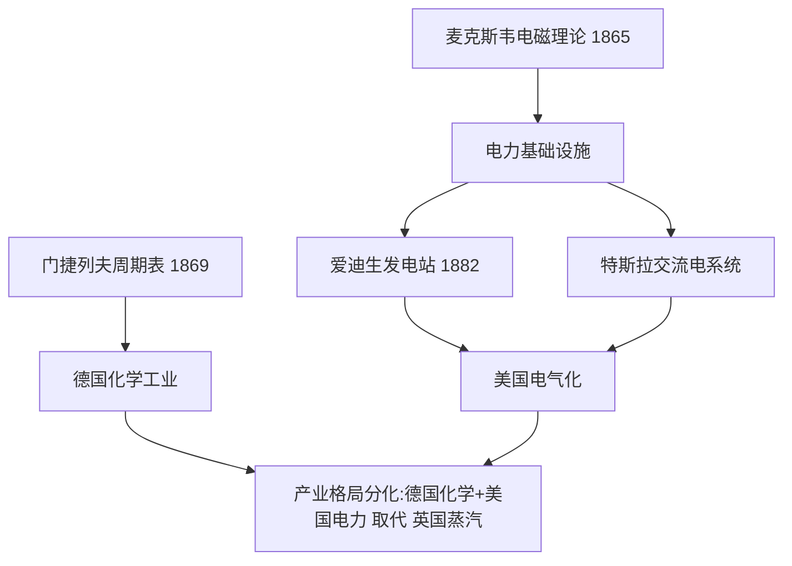
*该图展示了1865–1895年间科学理论突破如何经由技术应用,推动德国与美国在化学与电力产业上超越英国,重塑第二次工业革命的国家竞争格局。*

### us_gilded_age (0.8s)

## Us Gilded Age

**定义**

镀金时代（Gilded Age）指1870年至1890年间美国经历的工业化狂飙期。这一名称出自马克·吐温1873年的同名小说，讽刺当时社会表面繁荣光鲜、内里贫富悬殊与腐败丛生。这段时期的核心特征是铁路网络的爆炸式扩张、钢铁与石油产业的垄断化，以及一批被称为"强盗大亨"（Robber Barons）的企业家——如安德鲁·卡内基（钢铁）、约翰·D·洛克菲勒（石油）、科尼利尔斯·范德比尔特（铁路）——通过兼并、压价竞争和政治游说迅速积累巨额财富。政府在这一阶段奉行自由放任（laissez-faire）政策，几乎不对企业垄断和劳工待遇进行干预，这既释放了资本扩张的能量，也埋下了后续劳资冲突与反垄断立法的伏笔。

**具体案例**

铁路是这一时期最直观的证据。美国铁路总里程从1870年的约5.3万英里增长到1890年的约16.3万英里，增幅超过三倍；1869年首条横贯大陆铁路通车后，全国市场被首次真正连成一体，原料运输成本大幅下降。与此同时，卡内基钢铁公司凭借"垂直整合"模式（自建矿山、炼焦厂、运输船队），到1890年时美国钢产量已超越英国，成为世界第一产钢国；洛克菲勒的标准石油公司则通过收购竞争对手，到1880年代控制了全美约90%的炼油能力。这些企业既提供了廉价的钢铁与燃料，为后续的城市化和第二次工业革命奠定基础，也造成了工人日工作12小时以上、童工普遍、1877年铁路大罢工等尖锐的劳资矛盾。

**分析应用**

评估镀金时代的历史意义时，应区分"经济基础的形成"与"社会代价"两条并行的因果链：一方面，铁路网络与钢铁产能的积累，直接构成了1890年代后美国工业总产值超越英、德、法三国总和的物质基础，这是美国崛起为世界强国的关键一步；另一方面，财富集中催生的社会矛盾（如1892年霍姆斯特德罢工、1894年普尔曼罢工）又反过来推动了1890年代后的进步主义改革与《谢尔曼反托拉斯法》（1890年）的出台。理解这段历史时，应把"经济增长的规模"与"增长的分配方式"作为两个独立却相互作用的变量分别考察，而非简单地以GDP增长掩盖社会代价，或以劳资冲突否定工业化的战略价值。

### meiji_restoration (1.0s)

## Meiji Restoration

1868年，日本爆发了一场根本性的政治革命——明治维新。以萨摩、长州两藩下级武士为核心的倒幕势力，拥立年仅15岁的明治天皇，推翻了延续265年的德川幕府统治，终结了日本的封建幕藩体制。这场革命的直接导火索是1853年美国海军准将佩里率"黑船"叩关，暴露出幕府无力抵御西方列强的军事与外交压力。倒幕派提出"尊王攘夷"口号，最终演变为"王政复古"，于1868年1月发布《王政复古大号令》，建立以天皇为中心的中央集权国家。

新政府随即推行了一系列彻底的制度改革。1869年"版籍奉还"、1871年"废藩置县"，将全国261个藩收归中央，消灭了地方封建领主的世袭权力；1873年颁布《征兵令》，建立以天皇为最高统帅的近代化常备军，取代了武士阶层世袭的军事垄断；同年推行地税改革，统一了国家财政收入。政府还派遣"岩仓使节团"（1871–1873年，历时近两年，考察欧美12国）实地考察西方的政治、工业与教育制度，随后以"殖产兴业""富国强兵""文明开化"为三大国策，由国家主导引进纺织、造船、铁路等近代工业技术，并建立义务教育体系。

这场自上而下的改革在短短几十年内取得了显著成效：到1894–1895年甲午战争中日本击败清朝，1904–1905年日俄战争中又击败俄国——这是近代史上首次非西方国家在正式战争中战胜西方列强，标志着日本已跻身工业化军事强国之列。

明治维新的问题解决意义在于展示了一种"防御性现代化"路径：面对西方帝国主义压力，日本没有选择被动抵抗或全盘西化，而是选择保留天皇制这一传统权威符号作为政治合法性的来源，同时在军事、经济、教育等具体制度层面进行彻底的西式改造。这种"上层保守、基层革新"的策略，为后来其他试图应对西方冲击的非西方国家（如奥斯曼帝国的坦志麦特改革、清朝的洋务运动）提供了对比案例——而明治维新之所以成功、洋务运动之所以相对失败，关键差异在于日本实现了政治权力结构的根本重组，而非仅仅引进技术设备。

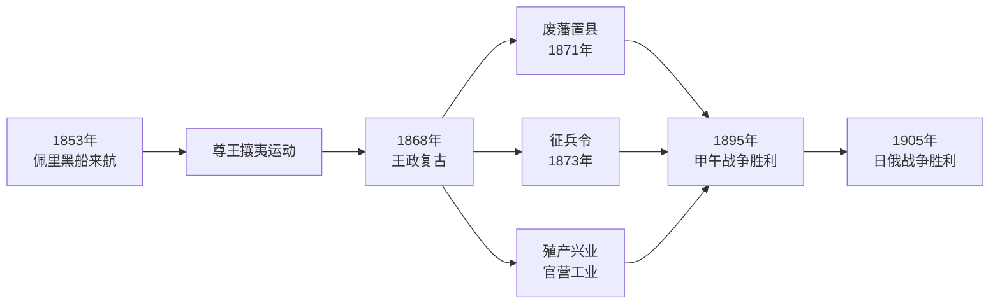
*图示：明治维新从黑船来航到政治体制重组，再到军事工业化，最终使日本战胜清朝与俄国的因果链条。*

### us_industrial_rise (0.6s)

## Us Industrial Rise

**概念定义**：19世纪末，美国经历了历史上最迅猛的工业化进程。从1865年南北战争结束到1900年,美国制造业产值增长近七倍,超越英国成为世界第一工业强国。这一转变的关键节点是1890年美国人口普查局宣布"边疆线"（frontier line）已经消失——即已找不到人口密度低于每平方英里两人的连续无人区。这一宣告标志着持续三个世纪的大陆扩张走到终点,美国的战略视野开始从"向西"转向"向外"。

**具体案例**：钢铁产量是衡量工业实力最直观的指标。1870年,美国钢产量仅为7万吨,落后于英国的22万吨;到1900年,美国钢产量猛增至1000多万吨,是英国的两倍以上。安德鲁·卡内基的卡内基钢铁公司正是这一时期崛起,到1901年被摩根收购组建美国钢铁公司时,后者已是全球最大企业,资本总额达14亿美元。与此同时,铁路里程从1865年的3.5万英里扩展到1900年的19万英里,把全国市场连成一体,也让原材料与商品得以高效流通。历史学家弗雷德里克·特纳在1893年发表的《边疆在美国历史上的重要性》一文中指出,边疆的持续存在曾塑造了美国的民主精神与个人主义,而边疆的消失意味着这一"安全阀"不复存在——过剩的工业产能、资本与人口不能再向西部释放,必然要寻找新的出口。

**分析应用**：把工业崛起与边疆终结这两条线索放在一起看,可以解释1890年代后美国对外政策的转向:企业界需要海外市场消化过剩产品与资本(如1893年经济危机后棉纺织业急需出口渠道),海军战略家马汉主张建设远洋海军以保护贸易航线,而政治精英则借用"天定命运"的旧话语为新的海外扩张寻找合法性。这三股力量的汇合,直接导致了此后对夏威夷、古巴、菲律宾等地的介入。

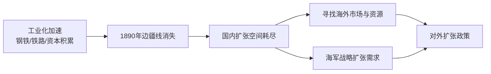
*该图展示美国工业崛起与边疆终结如何共同推动战略重心从大陆扩张转向海外扩张。*

### japan_meiji_modernization (0.6s)

## Japan Meiji Modernization

**定义**：明治维新指1868年日本推翻德川幕府、拥立天皇亲政后，用不到一代人的时间完成的整套制度重构——废除持续了近七百年的封建藩国体制，建立中央集权的国民国家，并将经济与军事全面按西方模式改造。这不是单一改革，而是一组相互支撑的制度变革：1869年"版籍奉还"迫使各藩主交出土地与户籍，1871年"废藩置县"直接撤销全部261个藩、改设72个府县，由中央任命官员管理；1873年颁布《征兵令》，废除武士世袭当兵的特权，改行全民义务兵役制；同年推行地税改革，以货币地税取代实物年贡，为政府提供稳定财政收入。1889年颁布《大日本帝国宪法》，建立君主立宪框架。

**应用实例**：明治政府深知制度移植必须配合技术与人才引进。政府派遣"岩仓使节团"（1871–1873年）赴欧美考察，随后聘请数千名外国技师建立官营示范工厂，如1872年的富冈制丝厂、1901年建成的八幡制铁所，再将成熟产业转售民间财阀（三井、三菱）经营。军事上，陆军仿德国、海军仿英国编制训练。这些改革在1894–95年甲午战争中得到检验：日本以现代化陆海军击败清朝，通过《马关条约》获得台湾及两亿两白银赔款，证明短短二十余年的改革已使其军事工业能力超越东亚原有强权。

**问题解决应用**：比较明治维新与同期清朝"洋务运动"的成败，可以看出关键差异不在技术引进的多少，而在制度改革的彻底程度。清朝洋务派仅购买西式军舰、兴办军工厂，却保留科举、八旗与地方督抚割据的旧体制；日本则同步废除身份等级、统一税制与兵役、建立中央财政与国家教育体系，使技术引进有配套的制度基础支撑。这一对比说明：分析任何一次现代化尝试时，应追问改革是否触及土地、税收、兵役与官僚任免等核心制度，而不仅看是否引进了新技术或新装备。

### qing_dynasty_decline (1.1s)

## Qing Dynasty Decline

十九世纪的清朝从东亚秩序的中心跌落为列强瓜分的对象,这一转折并非一夕之间发生,而是军事失败、财政枯竭与内部叛乱三者相互叠加的结果。1839年至1842年的第一次鸦片战争暴露了清军与英国工业化军队之间的技术鸿沟:英国的蒸汽动力炮舰与后装枪炮对阵清朝的传统帆船与冷兵器,战败后签订的《南京条约》迫使清朝割让香港岛、开放五口通商并赔款2100万银元。1856年至1860年的第二次鸦片战争进一步加深了屈辱,英法联军焚毁圆明园,清朝被迫签订《天津条约》与《北京条约》,增开口岸、允许外国公使驻京、承认鸦片贸易合法化。

比战争失败更致命的是内部动荡。1851年至1864年的太平天国运动由洪秀全领导,以"拜上帝会"为核心信仰,建立太平天国,一度占据南京并威胁清朝半个疆域。这场内战造成的死亡人数估计在2000万至7000万之间,是人类历史上死伤最惨重的内战之一,远超同期美国南北战争(约62万人死亡)的规模。清朝为镇压叛乱耗尽国库,被迫依赖地方乡绅组织的团练武装(如曾国藩的湘军、李鸿章的淮军),这实质上将军事权力从中央转移到地方,为日后军阀割据埋下隐患。

问题解决的关键在于理解"技术代差"与"财政—军事困局"如何相互强化:战败带来的巨额赔款(《北京条约》后清朝对英法赔款各800万两白银)进一步削弱了国库,而国库空虚又使清朝无法系统性地进行军事现代化,只能依赖地方自筹的团练与后来的洋务运动(1861年起)进行局部、零散的近代化尝试,如设立江南制造局仿造西式枪炮。这种"边打边改、改不彻底"的模式,使清朝在随后的中法战争(1884–1885)与甲午战争(1894–1895)中继续失利——甲午战败后割让台湾、赔款2亿两白银,标志着清朝已完全丧失在东亚的主导地位,转而成为列强划分势力范围、争夺租借地与铁路利权的舞台。

*该图展示清朝从鸦片战争失败到甲午战败的连锁衰落过程,以及内部叛乱如何加速权力从中央向地方转移。*

### science_haber_bosch_and_aviation (1.0s)

## Science Haber Bosch And Aviation

**定义**：1909年,德国化学家弗里茨·哈伯（Fritz Haber）在实验室中实现了将空气中的氮气与氢气直接合成为氨的反应：

$$N_2 + 3H_2 \rightarrow 2NH_3$$

这一反应看似简单,却解决了人类数千年来的一个根本难题——如何摆脱对天然硝石（智利硝石矿）和鸟粪石的依赖,人工"固定"空气中取之不尽的氮。1913年,化学工程师卡尔·博施（Carl Bosch）与巴斯夫公司（BASF）将其扩大为工业规模生产,在路德维希港附近建成奥堡（Oppau）工厂,这就是"哈伯-博施法"。氨既是化肥的核心原料,也是制造硝酸——进而制造炸药——的原料,一套工艺,两种用途。

**实例分析**：1914年战争爆发后,英国皇家海军对德国实施海上封锁,切断了德国此前每年从智利进口约80万吨硝石的通道。按照德国陆军部战前的估算,若没有替代的硝酸来源,德国的弹药储备最多支撑到1914年底或1915年初。然而博施迅速将奥堡工厂及随后建成的洛伊纳（Leuna）工厂转向硝酸生产,使德国在四年战争期间持续获得合成硝酸盐用于炸药制造,弹药供应未曾因封锁而中断。历史学家因此普遍认为,哈伯-博施法是德国得以将一战拖延到1918年的关键工业因素之一。

**问题解决应用**：这一案例揭示了科学技术"双重用途"的历史规律——同一项发明,在战时用于制造炸药延长杀戮,在和平时期却成为解决全球饥饿的基石。战后,哈伯-博施法迅速转向民用化肥生产,使农业单位面积产量大幅提升,支撑了20世纪的人口增长;据估计,今天全球约一半人口所摄入的氮元素,最终来源于这一工业过程,尽管其耗能占全球能源消耗的约1%-2%。分析类似的技术时,应当追问:一项发明的军事应用与民用应用是否共享同一条生产链?这决定了封锁、禁运或出口管制能否真正遏制一个国家的战争潜力——正如1914年的英国海军所发现的那样,封锁原料无法阻止工业化国家用化学方法自己制造出原料。

### japan_imperial_expansion (1.8s)

## Japan Imperial Expansion

十九世纪末,日本完成明治维新后,迅速将国力转化为对外扩张的实力,在短短二十年间跻身世界列强之列——这是第一个非西方国家做到这一点。这一进程的起点是1894至1895年的甲午战争。彼时清朝正值国力衰退、财政拮据、军备陈旧,而日本已建立起近代化的海陆军。战争的直接导火索是朝鲜半岛的控制权之争,结果日本速胜:北洋水师全军覆没,清廷被迫签订《马关条约》,承认朝鲜"独立"(实为脱离清朝宗主体系)、割让台湾及澎湖列岛、赔款二亿两白银。这场胜利让日本首次跻身能够在东亚事务中主导议程的强国行列。

十年后,日本又在1904至1905年的日俄战争中击败俄国——这是近代史上第一次非西方国家在正式战争中战胜西方列强。旅顺口的陷落与对马海战中俄国波罗的海舰队的覆灭,迫使俄国接受美国调停的《朴茨茅斯条约》,日本获得辽东半岛租借权、南满铁路权益,并确认对朝鲜的支配地位。1910年,日本正式吞并朝鲜,将其纳入直接殖民统治,朝鲜作为独立国家的地位由此中断三十五年。第一次世界大战期间,日本以对德宣战为名,轻易夺取德国在太平洋的岛屿(如马绍尔群岛、加罗林群岛)及在中国山东的租借地青岛,并借机向中国提出旨在扩大在华权益的"二十一条要求"。

将这一连串事件放在一起分析,可以看到一个清晰的因果链条:明治维新提供了近代化的军事与工业基础,清朝的衰落与俄国在远东的相对薄弱则提供了可乘之机,而每一次胜利又为下一次扩张积累了资本、领土跳板与国际威望。1895年、1905年、1910年、1914至1915年这四个节点,标志着日本从一个被迫签订不平等条约的东亚国家,转变为主动在国际体系中攫取殖民地与势力范围的帝国主义行为体。

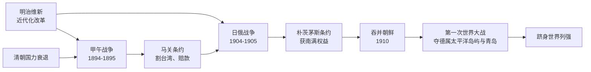
*该图展示日本从明治维新到成为世界列强的关键扩张节点及其因果关联。*

### japan_prussian_model_emulation (1.1s)

## Japan Prussian Model Emulation

1889年颁布的《大日本帝国宪法》（明治宪法）并非日本自主发明的制度，而是伊藤博文等明治精英在1882—1883年赴欧考察后，有意识地选定普鲁士式宪政作为蓝本加以移植的产物。伊藤博文在维也纳师从法学家洛伦茨·冯·施泰因、在柏林研习鲁道夫·冯·格奈斯特的国家学说后得出结论：英美式议会主权模式会削弱天皇权威与士族主导的政府控制力，而1871年俾斯麦统一德国后确立的德意志帝国宪法——保留君主实权、议会权力有限、行政权凌驾于立法权之上——更适合日本"富国强兵"的现实需要。明治宪法因此复制了德意志帝国的核心架构：天皇（对应德皇）总揽统治大权，内阁大臣只对天皇负责而非对议会（帝国议会）负责，贵族院制衡由选举产生的众议院。

这种模仿甚至完整复制了德国体制的一个致命缺陷：军队统帅权（统帅权）独立于内阁，直属天皇本人，史称"统帅权独立"。这一条款直接对应德意志帝国宪法中参谋总长可绕过帝国宰相直接上奏皇帝的军令权安排。其后果是深远的——文官内阁在法理上无权节制陆海军的行动决策。1930年代，关东军可以在未经东京内阁批准、甚至违背其意愿的情况下于中国东北自行发动军事行动（如1931年九一八事变），而内阁事后只能被动追认，正是这一制度设计留下的漏洞被军部逐步利用、最终导致文官政府对军部失控的历史根源。

将两国宪法并置分析，可以看到制度移植如何原样搬运了其原生的结构性风险：普鲁士模式本身即产生于俾斯麦时代军方与容克贵族对文官政府的强势地位，日本在效仿其"效率"时，未能预见（或未加改造）同一套军权独立机制，一旦脱离了俾斯麦本人的政治掌控力，会在制度上失去制衡。

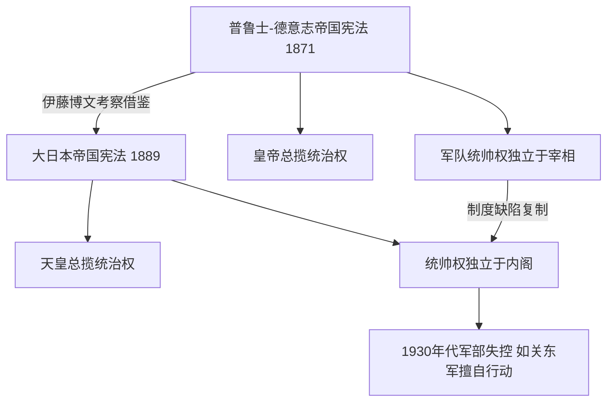
*该图展示明治宪法如何从德意志帝国宪法直接移植统治权结构，并连带复制了军权独立于文官政府这一结构性缺陷，为后续军部坐大埋下伏笔。*

### us_overseas_imperialism (3.9s)

## Us Overseas Imperialism

**定义**

1898年美西战争的胜利，标志着美国从一个专注于大陆扩张的国家转变为一个跨洋帝国。战争仅持续了不到四个月（1898年4月至8月），美军便击溃了西班牙在加勒比海和太平洋的力量。根据同年12月签署的《巴黎条约》，西班牙将波多黎各、关岛割让给美国，并以2000万美元的价格将菲律宾群岛卖给美国；古巴则名义上获得独立，但实际上被置于美国的保护之下（1901年《普拉特修正案》赋予美国干预古巴事务的权利）。这场战争的结果，使美国第一次拥有了海外殖民地，跻身英、法、德等老牌欧洲帝国之列，成为在太平洋和加勒比海地区拥有领土与战略基地的世界强权。

**具体案例分析**

菲律宾的经历最能说明美国这次转型的复杂性。菲律宾民族主义者原以为美国会帮助他们摆脱西班牙统治后实现独立，但美国政府选择直接吞并群岛。这引发了1899年至1902年的菲美战争，冲突造成约4200名美军士兵、约2万名菲律宾士兵，以及因战争、饥荒与疾病而死亡的20万至25万菲律宾平民。这场战争暴露了美国国内对帝国主义的分歧：以马克·吐温为代表的"反帝国主义联盟"谴责吞并菲律宾违背美国自身的建国原则，而以西奥多·罗斯福和参议员亨利·卡伯特·洛奇为代表的扩张派则主张，美国需要海外基地与市场才能在全球贸易与海军竞争中立足。

**问题解决应用**

历史学家在分析此类转型时，常需要权衡"经济动因"与"意识形态动因"孰轻孰重。要评估美国海外扩张的驱动力，可比较以下证据：其一，经济数据——1890年代美国工业产能已跃居世界第一，制造商急需海外原料与销售市场，菲律宾和加勒比海地区被视为进入亚洲与拉丁美洲市场的跳板；其二，战略数据——美国海军将领阿尔弗雷德·马汉的《海权对历史的影响》一书主张，远洋煤炭补给站和海军基地是维持海上力量的必要条件，关岛和菲律宾恰好提供了这类基地。将这两类证据对照使用，可以帮助学生判断：美国的海外帝国主义究竟是工业资本扩张的自然延伸，还是纯粹地缘战略竞争（与英、德等列强争夺势力范围）的结果——答案往往是二者相互交织，而非单一因素所能解释。

### germany_weltpolitik_rivalry (2.1s)

## Germany Weltpolitik Rivalry

**定义**

1890年,年轻的德皇威廉二世罢黜了老练的首相俾斯麦,德国外交政策随之发生根本转向。俾斯麦时代的核心原则是"克制"——德国已是欧洲大陆最强的国家,无需再谋求更多,只需通过复杂的同盟体系(如三皇同盟、再保险条约)防止法国复仇、避免两线作战。威廉二世抛弃了这一逻辑,转而推行"世界政策"(Weltpolitik):德国不再满足于欧陆强国的地位,而要求获得与英、法平起平坐的全球殖民帝国和海外市场,并将建立一支足以挑战英国皇家海军的远洋舰队,视为"阳光下的地盘"(俾斯麦所讥讽的"place in the sun")的必要条件。这一政策由海军大臣提尔皮茨主导,自1898年起连续通过多部《舰队法》,推动德国海军规模系统性扩张。世界政策的问题在于,它同时触碰了英国的两条核心利益线——制海权与殖民版图——而不像俾斯麦时代那样只在欧陆内部谋求平衡,因此几乎必然把英国推向法国和俄国一边。

**具体案例**

摩洛哥危机集中体现了这一政策的后果。1905年,威廉二世突访丹吉尔,公开支持摩洛哥"独立",实质是试探并企图拆散刚缔结一年的英法协约(1904年"挚诚协定");结果却适得其反——1906年阿尔赫西拉斯会议上,除奥匈外几乎所有列强都站在法国一边,德国反而陷入外交孤立。1911年"豹"号炮舰事件中,德国派军舰驶入摩洛哥阿加迪尔港,以武力威胁换取殖民补偿,英国外交大臣公开警告德国不得挑战英国利益,危机再度以德国让步(换取部分刚果领土)收场。两次危机没有为德国换来实质利益,却使英法协约在军事上逐步具体化,并促使英国海军部加快战备。

**分析应用**

评估任何大国转向"扩张性对外政策"能否成功,可以用以下方法:列出该政策直接威胁到的每一个既有大国的具体利益(殖民地、海权、势力范围),再逐一核对该大国是否因此被推向对立阵营。用此方法审视世界政策可发现:海军扩张威胁英国制海权,殖民要求触及英法两国既得殖民利益,而巴格达铁路计划又触及俄国在近东的利益——德国几乎同时得罪了未来协约国的全部三方,这正是俾斯麦式"分而治之"外交与威廉二世式"四面出击"外交的根本差异,也是第一次世界大战前同盟阵营固化的关键成因之一。

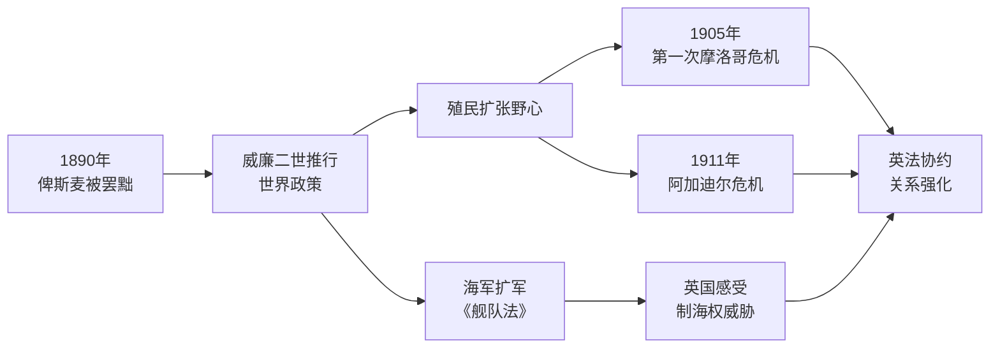

*该图展示威廉二世罢黜俾斯麦后,世界政策如何通过海军扩军与两次摩洛哥危机,不断将英国推向法国一方,强化协约国阵营。*

### japan_depression_militarism (2.1s)

## Japan Depression Militarism

1929年华尔街崩盘引发的经济大萧条，对日本农村经济造成毁灭性打击。当时日本约半数农户依赖养蚕缫丝为副业，而生丝出口的主要市场正是美国。1930年美国生丝进口价格暴跌约65%，日本农村家庭现金收入随之枯竭，东北地区甚至出现卖女为娼、以草根树皮充饥的惨状。这场"昭和农业恐慌"摧毁了普通民众对政党政治与财阀经济的信任，也为军队中下级军官的激进思想提供了土壤——许多军官本身出身农村，亲眼目睹家乡的凋敝。

与经济崩溃同时发酵的，是两桩长期积累的民族屈辱。其一是1922年《华盛顿海军条约》，将美、英、日主力舰吨位比限定为5:5:3，日本海军视此为"对等地位"被否定的象征。其二是美国1924年《移民法》，明文禁止日本移民入境，被日本舆论普遍解读为赤裸裸的种族歧视。这两件事共同强化了一种叙事：西方列强口头倡导"国际协调"，实则用条约体系束缚日本、用种族壁垒羞辱日本。

经济绝望与民族屈辱的双重压力，最终转化为军人干政的连续政变。1932年"五一五事件"中，青年海军军官刺杀首相犬养毅，实质终结了日本的政党内阁制；1936年"二二六事件"中，约1400名陆军官兵发动兵变，虽遭镇压，却使军部从此掌握组阁否决权——依法规定陆海军大臣须由现役将官担任，军部只需拒绝提名即可瘫痪任何内阁。文官政府名存实亡后，军部主导的对外扩张再无制衡：1931年关东军已先发制人，制造"九一八事变"并占领中国东北全境，建立伪满洲国，抢在国内政局彻底转向militarism之前，将扩张既成事实化。

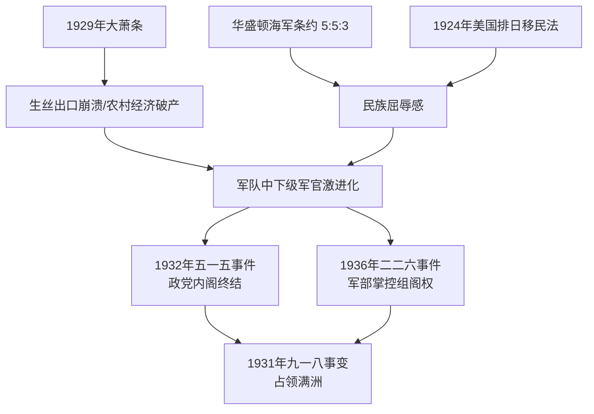
*该图展示经济崩溃与外交屈辱如何共同催化军人政变，进而终结文官政府并驱动对满洲的军事扩张。*

这段历史提供了一个可供检验的因果链条：经济危机瓦解民众对现存体制的信任，未被化解的国际屈辱感提供意识形态燃料，二者交汇于军队内部的激进派系，最终以政变手段夺取国家决策权。分析类似案例（如魏玛德国）时，可比对这三个要素——经济冲击、被感知的外部羞辱、军队/准军事组织的政治化——是否同时具备，以判断文官体制崩溃的风险。

### science_radioactivity_and_quantum (2.0s)

## Science Radioactivity And Quantum

1895年至1915年这二十年,是经典物理学向现代物理学转折的关键期,也是"看不见的射线"从实验室好奇现象变成改变人类历史力量的起点。1895年,伦琴发现X射线,首次证明存在能穿透物质的未知辐射;1896年贝克勒尔发现铀盐能使密封的照相底片感光,揭示出"放射性"这一自然现象。1898年,玛丽·居里与丈夫皮埃尔从数吨沥青铀矿渣中提炼出两种新元素——钋与镭,并首次使用"放射性"(radioactivity)一词描述原子自发释放能量的现象。她因此两次获得诺贝尔奖(1903年物理学奖、1911年化学奖),是这一领域最具标志性的人物。

这些发现动摇了经典物理学"物质不可分、能量连续"的基本假设。1900年,普朗克为解释黑体辐射,提出能量只能以离散的"量子"形式被吸收或释放,其基本关系为 $E = h\nu$ ,其中 $h$ 为普朗克常数, $\nu$ 为辐射频率——这是历史上第一次用不连续的方式描述能量。1905年,爱因斯坦借用这一思想解释光电效应(因此获1921年诺贝尔物理学奖),并发表狭义相对论;1913年,玻尔进一步提出原子的量子化轨道模型,解释了氢原子光谱。短短二十年间,物理学从牛顿力学的确定世界观,过渡到一个以概率和量子跃迁描述微观世界的全新框架。

这段历史的现实意义在于:居里等人发现的放射性元素与随后建立的量子理论,共同构成了此后核物理学乃至核武器、核能的科学基础。换言之,20世纪上半叶的地缘政治格局——两次世界大战、冷战核威慑——其技术根源可以直接追溯到这二十年间实验室里的这些发现。理解这一点,有助于解释为何战后各国政府会不惜代价争夺铀矿资源与核科学家:科学发现本身没有国界,但它一旦揭示出某种战略性能量来源,就必然被卷入大国竞争的历史进程。

### us_wwi_and_isolationism (0.7s)

## Us Wwi And Isolationism

**定义**：1917年4月，美国在德国实施"无限制潜艇战"（击沉包括"卢西塔尼亚号"在内的多艘载有美国公民的商船与客轮）以及"齐默尔曼电报"（德国提议墨西哥若参战可夺回得克萨斯、新墨西哥、亚利桑那）曝光后，威尔逊总统要求国会对德宣战，美国正式加入协约国一方。战争结束后，威尔逊主导巴黎和会，力推《凡尔赛条约》及其核心机制——国际联盟，希望以集体安全体系取代传统的欧洲均势外交。然而，美国参议院两次（1919年11月、1920年3月）投票否决批准该条约，美国始终未加入国际联盟。这一挫败标志着美国外交政策的转向：从威尔逊式的国际主义理想，回摆到孤立主义传统，为1920—1930年代的中立法案与对国际事务的消极姿态埋下伏笔。

**案例分析**：参议院的反对并非铁板一块，而是分裂为三派：以亨利·卡伯特·洛奇为首的"保留派"要求对第十条（集体安全条款，规定成员国有义务协助被侵略国）附加保留条款，担心此条款会自动把美国卷入欧洲战争而绕开国会宣战权；以威廉·博拉为首的"顽固派"（Irreconcilables）主张彻底拒绝加入；威尔逊本人则拒绝任何妥协，坚持条约原文必须完整通过。三方僵持之下，条约两次表决均未达到宪法要求的三分之二多数，美国最终于1921年与德国单独签署和约。这一僵局说明：国际条约的批准不仅取决于外交合理性，还受制于国内宪政程序（参议院的条约批准权）与政治人物之间的权力博弈。

**应用与思考**：理解这一事件有助于解释此后二十年美国外交的基本逻辑——1920年代的"孤立主义"并非完全退出世界事务（美国仍参与华盛顿海军会议、道威斯计划等经济外交），而是刻意回避具有法律约束力的集体安全承诺。这一模式也为后续对比二战后美国转而主导联合国、北约等多边机制提供了关键的历史参照点：正是一战后孤立主义失败的教训（未能阻止二战爆发），促使美国精英阶层在1945年后转向截然相反的国际主义路线。

### japan_china_war (2.1s)

## Japan China War

1937年7月7日夜，日本华北驻屯军在北平西南的卢沟桥附近举行演习，声称一名士兵失踪，要求进入宛平县城搜查，遭中国守军第二十九军拒绝，双方随即交火。这就是"卢沟桥事变"，也称"七七事变"。它本身规模不大，但成为日本从局部蚕食（如1931年九一八事变夺取东北、1933年热河作战）转向全面侵华的引爆点：事变后不到一个月，日本内阁决定向华北大举增兵,战事迅速扩大到平津、淞沪、华中。这一步之所以走出去，直接承接了此前十年日本国内经济危机与军部专权（见"日本经济大萧条与军国主义"）造成的对外扩张冲动，也利用了清朝覆灭后中国长期军阀割据、国力涣散的局面（见"清朝衰亡"）——一个内部虚弱、尚未完成统一整合的国家，很难对一次边境挑衅做出足够慑止的回应。

战事升级的代价迅速显现。1937年8月至11月的淞沪会战中，中国军队投入约70万兵力抵抗，伤亡逾25万人，尽管最终败退，但迟滞了日军原定"三个月灭亡中国"的计划。12月，日军攻占首都南京，在其后六周内对战俘和平民实施大规模屠杀、强奸与劫掠，遇难人数据南京军事法庭及后续研究估计约在20万至30万之间，史称"南京大屠杀"。这一暴行使中日战争从军事冲突升级为一场民族存亡之战，中国抗战意志不降反升。

问题解决的角度在于理解日本此后陷入的战略困境：占领了华北、华东主要城市后，日军兵力（关内约100万人）被牵制在广袤国土和持久抵抗中，既无法迫使国民政府投降（1937年迁都重庆后仍坚持抗战），又不能因国内经济与舆论压力主动撤军，形成了旷日持久、既赢不了也放不下的占领消耗战，直至1945年日本战败才告终。这场战争最终造成中国军民伤亡逾1500万人，也为1941年日本因资源短缺而南进、进而与美国开战埋下伏笔。

### science_penicillin_and_nuclear_fission (2.4s)

## Science Penicilline And Nuclear Fission

1928年到1942年间，两条看似毫不相关的科学线索——医学与核物理——沿着相同的历史逻辑演进：基础发现在和平年代被搁置多年,战争的紧迫需求才把它们迅速转化为改变世界的技术。这正是理解二十世纪科学史的关键机制：不是灵感本身决定影响力,而是国家意志与工业动员的介入速度。

**青霉素的例子**最能说明这一点。亚历山大·弗莱明1928年在伦敦圣玛丽医院观察到,一个被霉菌污染的葡萄球菌培养皿周围细菌无法生长,由此发现了青霉素。但他缺乏提纯和量产的手段,这项发现在文献中沉寂了十年。直到1940年,牛津大学的弗洛里和钱恩重新提纯出可注射的青霉素,并证明其疗效。真正的转折点是战争:英美政府意识到,青霉素能大幅降低士兵因伤口感染死亡的比例,遂将其列为战时优先工业项目。产量从1943年的每月约4亿单位,猛增到1945年的每月超过6500亿单位——四年内产量提升了上千倍,这背后是政府主导的工厂改建、专利共享和跨大西洋技术转移。

**核裂变的例子**遵循几乎相同的节奏。查德威克1932年确认中子的存在,为原子核研究打开了新工具;哈恩和斯特拉斯曼1938年在柏林用中子轰击铀,意外发现铀核分裂并释放巨大能量。1939年,流亡科学家西拉德说服爱因斯坦联名致信罗斯福,警告纳粹德国可能率先掌握这一原理制造武器。这封信促成了曼哈顿计划——一个横跨美国、英国、加拿大三国、动员约13万人、耗资约20亿美元(相当于今天300亿美元以上)的工程,是人类历史上截至当时规模最大、耗资最高的科学项目。

**应用与分析**:比较这两个案例,可以提炼出一个可检验的历史规律——从"实验室发现"到"大规模应用"之间的时间差,几乎总是由外部危机(而非科学本身的成熟度)决定。青霉素等待了十二年,裂变理论从发现到武器化仅用了七年,原因在于后者被明确判定为可能决定战争胜负的技术,因而获得远超前者的资源优先级。这一模式此后反复出现在冷战航天竞赛、艾滋病药物研发等案例中,是评估"科学发现为何被迅速采纳或被长期搁置"的一个实用分析框架。

### us_great_depression (3.5s)

## Us Great Depression

1929年10月，纽约股票市场崩盘，道琼斯工业平均指数在随后三年内下跌近90%，从1929年高点的381点跌至1932年的41点。这场崩盘只是导火索，真正的病根在于1920年代美国经济内部积累的结构性失衡：农产品价格长期低迷、工业产能过剩、股市投机借贷（保证金交易）泛滥，以及银行体系缺乏有效监管。崩盘引发连锁反应——银行挤兑潮席卷全国，1930至1933年间超过9000家银行倒闭，储户存款化为乌有；企业停产裁员，失业率从1929年的约3%飙升至1933年的25%，即每四名劳动者中就有一人失业。工业生产总值腰斩，国内生产总值下降近三分之一，这是美国历史上持续时间最长、破坏力最大的经济衰退。

胡佛政府起初奉行传统的自由放任政策，坚持联邦预算平衡，仅提供有限援助，未能遏制危机蔓延，反而在1930年签署《斯姆特-霍利关税法》，将进口关税提高到历史高位，导致他国报复性加税，国际贸易额萎缩超过60%，进一步加剧了全球经济萧条。1932年，富兰克林·罗斯福以压倒性优势当选总统，随即在其"百日新政"中密集推出一系列立法：《紧急银行法》恢复公众对银行系统的信心；联邦存款保险公司（FDIC）为储户存款提供担保；社会保障法建立起养老金和失业保险制度；田纳西河流域管理局（TVA）等公共工程项目直接创造就业。新政的政策逻辑可归纳为三个目标——救济（对失业者和贫困者的直接援助）、复苏（刺激经济产出与消费）、改革（重塑金融监管以防止危机重演）。

新政并未在短期内彻底消除失业问题——直到1941年美国全面进入战时生产、履行对盟国的军需订单，失业率才真正降至战前水平以下。但新政从根本上重新定义了联邦政府在经济生活中的角色：此前联邦政府很少直接干预市场或提供社会福利，此后社会保障、劳工权利保护、金融监管成为常态化的政府职能。

*该图展示大萧条从股市崩盘到新政干预、最终经济复苏的因果链条。*

这场危机留下的最重要的历史教训是：市场机制在缺乏监管和政府干预的情况下，可能陷入自我强化的萧条螺旋——银行倒闭减少了信贷供给，信贷紧缩加剧了企业破产，企业破产又推高了失业与银行挤兑，唯有外部力量（联邦财政与货币政策）介入才能打破这一循环。

### germany_wwi_defeat (2.0s)

## Germany Wwi Defeat

**定义**　1914年，德国怂恿奥匈帝国对塞尔维亚采取强硬立场（"空白支票"），随后又依据施里芬计划入侵中立国比利时，两项决定将局部的巴尔干危机迅速升级为全欧洲乃至全球的战争。这一系列举动是[[germany_weltpolitik_rivalry|德国世界政策与列强竞争]]逻辑的延续：德国试图通过军事冒险打破英法俄的包围态势，结果却促成了协约国的团结与美国的参战。四年鏖战后，德国于1918年11月同盟国全面崩溃、国内爆发基尔水兵起义与柏林革命的背景下签署停战协定，1919年协约国在《凡尔赛条约》中正式确立战败责任：条约第231条（"战争罪责条款"）将战争责任完全归于德国及其盟国；德国被迫割让阿尔萨斯-洛林予法国、波兹南与西普鲁士部分地区予波兰（形成"波兰走廊"），并交出全部海外殖民地；莱茵兰实行非军事化；陆军被限制在10万人以内，且禁止拥有空军、潜艺艇及重型火炮；赔款委员会在1921年确定德国须支付1320亿金马克的战争赔款。

**实例分析**　条约签订之初，德国国内舆论普遍视其为"强加的和平"（Diktat），因为德国代表团被排除在谈判之外，只能被动签字。经济学家凯恩斯在《和平的经济后果》中警告，巨额赔款将摧毁德国经济并殃及整个欧洲复苏，这一预言在1923年鲁尔危机与恶性通货膨胀中部分应验——当年11月，1美元兑换超过4万亿马克。

**问题应用**　评估该条约时应权衡两种史学视角：其一，条约客观上削弱了德国的军事与经济实力，短期内实现了协约国的安全目标；其二，"战争罪责"条款与领土、赔款的组合，为极端民族主义叙事提供了政治燃料，希特勒在《我的奋斗》中反复援引"背后一刀"神话动员支持。历史学家玛格丽特·麦克米伦等人指出，真正的问题不在条约本身过苛,而在于协约国既未彻底执行其条款,也未给予魏玛共和国足够的外交与经济支持，这种"半吊子的严厉"最终为二十年后的第二次世界大战埋下伏笔。

### japan_pacific_war_defeat (0.9s)

## Japan Pacific War Defeat

1937年爆发的中日战争使日本深陷中国战场,资源消耗巨大却无法迫使中国屈服。为切断西方对华援助并夺取东南亚的石油、橡胶等战略资源,日本于1940年9月与德国、意大利签署《三国同盟条约》,正式加入轴心国阵营。这一举动激化了与美国的对立:美国随即对日本实施钢铁、石油禁运,尤其是1941年夏的石油禁运,直接威胁到严重依赖进口能源的日本战争机器。为打破僵局并夺取东南亚资源,日本军方决定对美国太平洋舰队发动先发制人的打击,于1941年12月7日偷袭珍珠港,炸沉或重创多艘战列舰,同时在东南亚多线出击,中日战争由此扩大为太平洋战争。

珍珠港之后半年,日本势如破竹,迅速占领菲律宾、马来亚、新加坡、荷属东印度等地。但1942年6月的中途岛海战成为战争的转折点。美军凭借破译日本海军密码提前掌握了日军进攻中途岛的计划,在这场航母对决中,美军仅损失1艘航空母舰,却击沉了日本4艘主力航空母舰及大量训练有素的舰载机飞行员。这一战役彻底扭转了太平洋战场的兵力对比:此后日本再无力量发动大规模战略进攻,战争主动权转入美军手中,美军开始沿"跳岛战术"逐步逼近日本本土。

此后三年,美军相继攻克瓜达尔卡纳尔岛、塞班岛、硫磺岛、冲绳岛等战略要地,日本海空军力量被逐步消耗殆尽,本土也遭受持续的战略轰炸。1945年8月6日和9日,美国先后在广岛、长崎投下原子弹,造成约21万人死亡(含辐射后续死亡);同期苏联对日宣战并迅速击溃关东军。在多重打击之下,日本于1945年8月15日宣布接受《波茨坦公告》,并于9月2日在停泊于东京湾的美军"密苏里号"战列舰上正式签署投降书,第二次世界大战至此全面结束。

这段历史提供了一个分析国际冲突升级与终结机制的范例:一场区域性战争(中日战争)如何因结盟选择(三国同盟)与资源博弈(石油禁运)升级为全球性冲突,又如何因关键战役的兵力逆转(中途岛)与终极威慑手段(原子弹)走向终结。理解这一因果链条,有助于分析历史上其他从局部冲突升级为全面战争、并最终因决定性事件而结束的案例。

*图示从中日战争到日本投降的关键升级与转折节点。*

### science_atomic_bomb_1945 (0.8s)

## Science Atomic Bomb 1945

**定义**：1945年的原子弹是科学史上首次将核裂变原理转化为可实战部署的大规模杀伤性武器,其研发、试爆与实战使用在短短数周内彻底终结了第二次世界大战,并开启了此后近八十年的核威慑时代。7月16日,美国在新墨西哥州阿拉莫戈多沙漠进行"三位一体"（Trinity）试验,证明钚内爆式原子弹在实验室之外同样可行,爆炸当量约合21000吨TNT。不到一个月后,8月6日"小男孩"（铀235枪式弹）投于广岛,当量约15000吨TNT,当场及随后数月内造成约14万人死亡;8月9日"胖子"（钚239内爆弹）投于长崎,造成约7万人死亡。8月15日,日本天皇裕仁宣布无条件投降,9月2日签署投降书,战争正式结束——美军由此避免了原定于11月发起、预计将造成数十万至上百万人伤亡的"没落行动"登陆日本本土作战。

**科学决定权力格局的历史转折**：在此之前,大国间的军事优势主要取决于人口、工业产能与常规军力的长期积累;原子弹的出现使得一个国家仅凭少数科学家和一次性工业投入（"曼哈顿计划"耗资约20亿美元,动用超过13万人）,就能在数年内获得对任何对手的压倒性打击能力。这一逻辑迅速外溢:1949年苏联试爆首枚原子弹,证明该技术并非美国可长期垄断;由此触发的军备竞赛,使核武器数量、精度与投送方式的较量,取代传统战场对抗,成为此后冷战大国竞争的核心变量。

**应用于历史分析**：理解广岛与长崎事件,关键不在于计算爆炸当量,而在于评估其战略后果——它是否真正"迫使"日本投降,抑或苏联对日宣战（8月8日）才是更关键因素,这至今仍是史学界争论的焦点。将两种证据并列考察（时间顺序、日本内阁会议记录、美方情报评估）,是训练历史因果推理的典型练习：单一事件很少是唯一原因,须权衡多重同期证据的相对权重。

### us_arsenal_of_democracy (0.7s)

## Us Arsenal Of Democracy

1939年欧战爆发后，美国国内孤立主义情绪浓厚，国会通过多项中立法案，禁止向交战国出售军火。但罗斯福总统判断，英国的存亡直接关系美国的国家安全，遂逐步推动政策松动。1941年3月，国会通过《租借法案》，授权总统向"对美国防务至关重要"的国家提供武器、粮食与物资，无需即时付款，而是战后以"实物或其他方式"偿还。这一安排实质上让美国在不正式参战的情况下，成为反法西斯同盟的军工后盾——罗斯福称此为"民主国家的兵工厂"。据统计，战争期间美国通过租借法案向盟国提供了约500亿美元的物资，其中英国获得约314亿美元，苏联约113亿美元，中国约16亿美元。

1941年12月7日，日本偷袭珍珠港，太平洋舰队损失8艘战列舰、188架飞机，2400余名美军丧生。次日美国对日宣战，德意随即对美宣战，美国由此从"民主国家的兵工厂"转变为全面参战国。这一转变的历史意义在于：美国的工业动员能力被完全释放——战争期间美国生产了近30万架飞机、8.8万辆坦克、近8800艘军舰，工业产值远超轴心国总和。这种压倒性的生产能力，而非单一战役的胜负，最终决定了战争的走向。

战争结束时，美国本土未遭战火波及，工业基础完好无损，而欧亚主要工业国普遍遭受重创。1945年，美国国民生产总值占全球约一半，黄金储备占全球三分之二以上，由此确立了此后数十年的经济主导地位。同年，美国作为联合国创始会员国及安理会常任理事国，深度参与战后国际秩序的构建，从"租借法案"体现的实物援助，演变为通过国际机构塑造全球规则的制度性影响力。

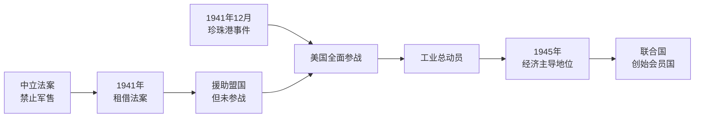
*从中立到参战再到战后主导地位的政策与事件演进路径。*

### science_electrification_shifts_power (0.8s)

## Science Electrification Shifts Power

**定义**

第二次工业革命（约1870年代至1900年代）以电力技术与化学工业为核心——发电机、电动机、电报电话网络、合成染料与化肥、内燃机等——区别于第一次工业革命以蒸汽机、纺织机械和煤铁为核心的技术组合。关键的历史事实是：这一轮新技术的产业中心并未继续留在率先完成第一次工业革命的英国，而是转移到了德国和美国。这种"科学链"（即支撑新技术的基础科学研究——电磁学、有机化学——及其人才培养体系）重心的转移，与德国、美国在世界工业产出份额上超越英国，在时间上是同步发生的。这里记录的是三条链（科学、美国、德国）共同显示出的一个时间重合现象，而非断言前者是后者的单一原因。

**实例分析**

数据说明了转移的规模：1870年英国仍占世界制造业产出约32%，美国约23%，德国约13%；到1913年，美国已跃升至约36%，德国约16%，英国降至约14%（据保罗·肯尼迪《大国的兴衰》所引之刘易斯数据整理）。与此同时，德国在电力与化学工业上建立起明显优势——西门子公司（创立于1847年）与AEG主导欧洲电气设备市场；德国化学工业到1900年生产全世界约90%的合成染料，其巴斯夫、拜耳、赫斯特三大公司皆脱胎于对苯胺染料的研究。美国则在爱迪生、特斯拉、威斯汀豪斯的电力系统竞争与福特的流水线生产中，将电气化与规模化制造结合。英国的煤铁蒸汽技术体系在19世纪中叶举世无双，但到电气化时代，其大学体系对应用科学与工程教育的投入远逊于德国的工科大学（Technische Hochschule）体系与美国赠地大学（land-grant university）体系——后两者恰恰是电力与化学新科学得以迅速转化为工业产能的人才基础。

**应用与思考**

面对"英国为何未能延续领先"这一问题，恰当的历史推理方式不是寻找单一原因，而是检验并列证据链之间的时间关系与可能的传导机制：新科学人才培养体系（教育制度）→新技术产业化（电气、化学公司）→产出份额变化，这一序列在德国和美国均可追溯，而在英国则出现断层。这提示我们，评估一个大国工业地位的可持续性时，应追踪其基础科学与工程教育投入是否与其现有产业体系保持同步更新，而非仅看当下的产出规模。

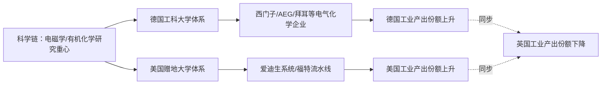
*该图展示科学重心转移、教育体系与工业产出份额变化之间的时间同步关系，而非单向因果断言。*

### science_haber_bosch_and_wwi_length (0.9s)

## Science Haber Bosch And Wwi Length

**定义**

哈伯-博施法（Haber-Bosch process）是1909年由弗里茨·哈伯（Fritz Haber）发明、1913年由卡尔·博施（Carl Bosch）在巴斯夫（BASF）实现工业化的合成氨技术，利用氮气与氢气在高温高压（约450摄氏度、200大气压）及铁触媒条件下直接合成氨（NH₃）。这项技术的历史意义远超化学本身：氨是硝酸的前体，而硝酸是制造炸药（如三硝基甲苯）和硝酸盐化肥的关键原料。在此之前，全球的硝酸盐几乎全部依赖智利北部阿塔卡马沙漠的天然硝石矿——这一单一供应来源,构成了20世纪初各工业强国的战略软肋。

**史实关联：封锁与自给**

1914年第一次世界大战爆发后，英国皇家海军立即对德国实施海上封锁，切断了德国经由海路进口智利硝石的通道。按照战前的消耗速度，军事分析家原本预计德国的炸药原料库存最多支撑数月，德国将被迫求和。然而，巴斯夫旗下的奥堡（Oppau）工厂已于1913年投产哈伯-博施合成氨装置，德国政府迅速将其产能转向硝酸生产。到1915年，德国已能通过奥斯特瓦尔德法（Ostwald process）将合成氨氧化为硝酸，实现炸药原料的完全国产化。这使得德国得以将一战的陆上僵局又维持了三年多，直至1918年11月投降——其间的多场关键战役（如凡尔登战役、索姆河战役）所消耗的弹药，很大程度上依赖这条化学供应链，而非任何海外硝石进口。

**问题解决应用**

这一案例揭示了工业化学发现如何直接改写地缘政治的时间尺度：判断一场战争的可持续性，不能只看交战双方的兵力和意愿,还必须追踪其背后的资源供应链是否存在可被封锁的单点故障，以及是否存在可替代该故障点的技术突破。分析类似情形时，可提出三个问题：（1）该国关键军事物资的原产地是否高度集中？（2）是否存在正在研发或已投产的替代技术？（3）该技术的产能扩张速度能否跟上战争消耗速度？就哈伯-博施法而言，答案分别是"高度集中于智利"、"是（1913年已投产）"、"能（奥堡工厂持续扩产)"——三者叠加，使得英国的海上封锁策略未能如预期般迅速奏效，这也是历史学家将一战托入长期消耗战的重要因素之一。

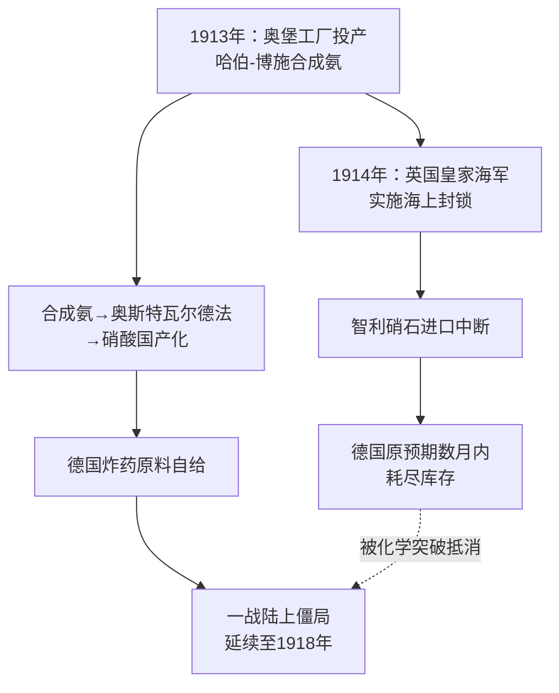
*该图展示了哈伯-博施法的工业化时间点如何与英国海军封锁在1914年发生交汇，并解释了这一化学突破为何延长了一战的持续时间。*

### science_nuclear_ends_pacific_war (0.8s)

## Science Nuclear Ends Pacific War

1945年8月的两次原子弹轰炸，是这套知识体系中极为特殊的一个节点：它同时是"科学"链条的终点、"日本"链条的转折点，也是"美国"链条的巅峰。三条本应独立发展的历史线索，在广岛与长崎这两座城市上空交汇成同一个事件。

从科学链条看，这是核物理从卢瑟福发现原子核（1911年）、查德威克发现中子（1932年）、哈恩与斯特拉斯曼实现核裂变（1938年）以来一系列理论突破的最终应用。曼哈顿计划耗资约20亿美元（相当于今天的300亿美元），集合了费米、奥本海默、玻尔等上千名科学家，于1945年7月16日在新墨西哥州完成首次核试爆（三位一体试验），标志着理论物理第一次转化为足以毁灭一座城市的现实力量。

从美国链条看，这是其工业与科研动员能力的顶点：从珍珠港事件（1941年）后仅用不到四年时间，美国便完成了从工业生产、铀浓缩到武器制造的全链条整合，展现出战时经济总动员的极限效率。

从日本链条看，广岛（8月6日，约7万至14万人死亡）与长崎（8月9日，约4万至8万人死亡）的轰炸，加上苏联同日对日宣战并出兵中国东北，共同促成裕仁天皇于8月15日通过广播宣布无条件投降，正式终结了太平洋战争。

三条链条为何必然汇聚于此？因为原子弹轰炸并非某一国内部事件，而是"科学能力—工业动员—战争终局"三者同时达到极限值的唯一交汇点：没有核物理的理论积累，就没有可造的武器；没有美国的工业动员，理论无法转化为实物；没有日本战局的僵持，也不会有使用这一武器的决策场景。历史学界至今仍在辩论：投掷原子弹是否是迫使日本投降的必要条件，还是苏联出兵起到了同等或更大的作用——这正是评估因果权重时需要权衡的证据问题，而非单一确定的结论。

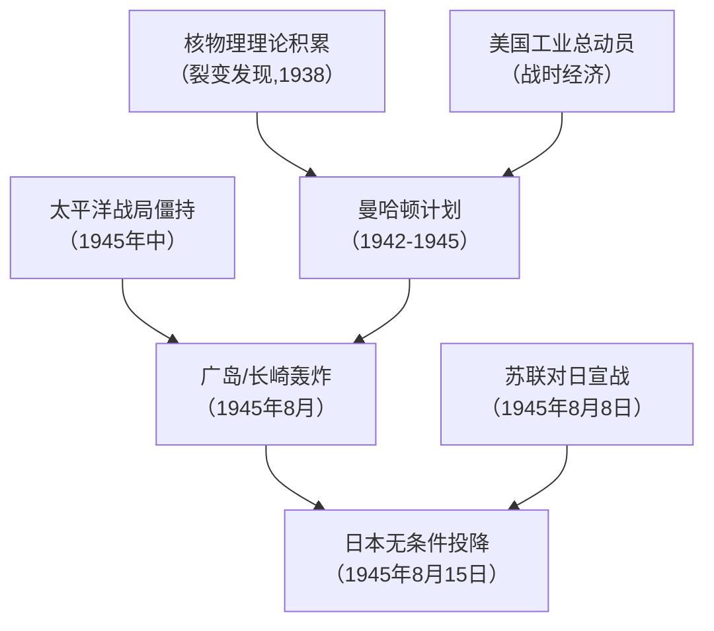
*该图展示科学、美国、日本三条链条如何在1945年8月的原子弹轰炸事件上交汇为同一历史终点。*

### science_cross_cutting_synthesis_1845_1945 (23.1s)

## Science Cross Cutting Synthesis 1845 1945

科学史不应被当作七个大国政治军事叙事的背景装饰,而应被视为与七条国家线并行、并在三个关键节点上反复交叉的"第八条主线"。1845 年至 1945 年这一百年间,科学以三次决定性介入,重新分配了大国之间的相对实力。

第一个交叉点是germ theory(细菌致病理论)。1860 年代巴斯德与科赫确立病原体致病机制后,英、法、德、美等国相继推行城市供水净化、疫苗接种与殖民地公共卫生体系。这不是纯粹的医学进步:它直接决定了殖民帝国能否在热带地区维持驻军与行政人员——19 世纪西非曾被称为"白人坟墓",疟疾与黄热病死亡率一度超过战斗减员;公共卫生技术的扩散,使英法等国得以在 1880-1914 年间将非洲统治成本降到可持续水平,从而支撑了"新帝国主义"瓜分狂潮。

第二个交叉点是电气化。1880 年代交流电系统(特斯拉、威斯汀豪斯)与内燃机的成熟,标志着第二次工业革命的技术基础。谁率先完成电气化与化学工业升级,谁就在这一轮工业竞赛中占据领先——德国的电气与化学工业(西门子、拜耳)在 1900 年前后反超英国的蒸汽时代优势,这一技术代差直接塑造了一战前英德海军军备竞赛与经济竞争的底层逻辑。

第三个交叉点是核物理学。1930 年代裂变理论的突破(哈恩、迈特纳)与 1939-1945 年间美、英、德、苏各自推进的核计划,使谁先掌握核武器成为决定二战结局与战后秩序的关键变量——曼哈顿计划耗资约 20 亿美元(1945 年币值),1945 年 8 月广岛、长崎的原子弹投掷直接促成日本投降,其"载荷节点"正是第 16 章冷战叙事的起始原语。

三次交叉的共同规律是:科学突破先在少数国家转化为制度与工业能力,再通过这种能力差决定大国兴衰的时间表——这正是把科学作为独立行为体而非背景变量来叙述的原因。

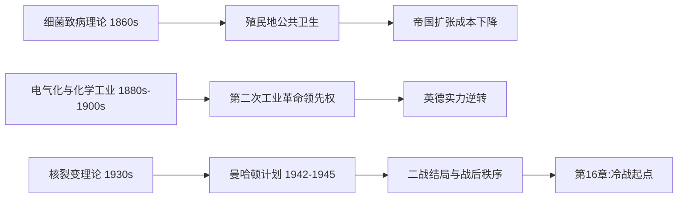

*该图展示科学史与七国政治军事叙事交叉的三个关键节点,以及核物理学如何成为通向第16章冷战叙事的载荷节点。*

## Run complete

total: 99.4s
